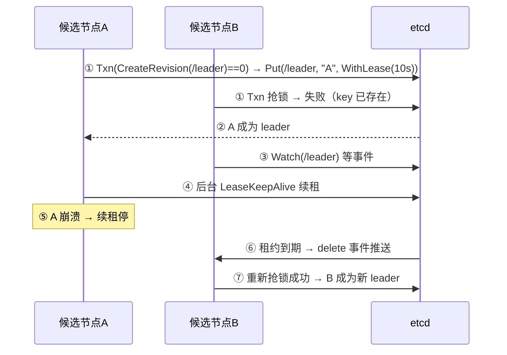

# 选主机制详解：谁是老大、怎么选、怎么防脑裂

> 属于 S8 分布式理论 · 能力强化 · 第三篇（导师清单：选主）
> 上一篇：[etcd 详解与工程实践](./etcd详解与工程实践)　下一篇：[gRPC 负载均衡详解](./gRPC负载均衡详解)

> **这篇解决什么问题**：很多系统需要一个"唯一的执行者"——定时任务调度器只能有一个在跑、集群里只能有一个 controller 管元数据、写路径只能有一个 leader。**选主（leader election）就是"从多个候选节点中选出一个唯一的老大，并在老大挂了之后自动换人"**。Raft 里已经有选举（见 [Raft 算法详解](./Raft算法详解)），但选主是一个**通用能力**：从 Redis 到 etcd 到 DB 行锁都能做，各自精度和代价不同。本篇讲清选主的**方案谱系、正确性要求（不脑裂、不双主）、基于 etcd 的工程实现、选主后的接管与让位**。

## 一、为什么需要选主：先想清楚"单点"这件事

主从模型里，**主是写路径的唯一入口**——这带来两个问题：

1. **主挂了怎么办**：不能没有主（写中断），也不能有两个主（写冲突/数据分叉）；
2. **谁来判断主挂了**：判断者自己也可能误判（网络抖动被当成宕机）。

所以选主本质是回答三个问题（面试背这三问）：

| 问题 | 答案要求 |
| --- | --- |
| **谁是主？** | 任何时刻最多一个（**Safety：不双主**） |
| **主挂了怎么换？** | 有限时间内选出新主（**Liveness：不永远无主**） |
| **换主时旧主怎么办？** | 旧主不能继续写（**fencing：防脑裂写**） |

> **不双主（Safety）是硬约束，不永远无主（Liveness）是软目标**——两者冲突时（分区），保 Safety（宁可短暂无主，绝不双主），这正是 CP 的选择（见 [CAP 与 BASE](./CAP与BASE理论)）。

## 二、选主方案谱系：五种做法，精度与代价递增

| 方案 | 原理 | 精度 | 代价 | 适用 |
| --- | --- | --- | --- | --- |
| **DB 唯一索引/行锁** | `INSERT INTO leader(...,token) VALUES(...)` 唯一索引，抢到即主；心跳续期 | 依赖 DB 高可用 | 简单但 DB 本身可能挂/主从切换丢主 | 小规模、已有 DB 的场景 |
| **Redis SETNX + TTL** | `SET leader token NX EX 10` 原子占坑，续期保活 | **AP**：主从切换可能丢主 → 双主 | 快、简单 | 可容忍极小概率双主的调度去重 |
| **Redis + Redlock** | 多节点多数派加锁 | 争议中（依赖时钟） | 复杂 | 一般不推荐（见 [S5 场景题（中）](./../05-high-concurrency/场景题-中)） |
| **etcd/ZK 租约选举** | 抢带租约的 key + Watch 接任（本篇重点） | **CP**：多数派确认，不双主 | 需要 etcd 集群 | **生产主流**（K8s、Kafka、Milvus、任务调度） |
| **Raft 共识选举** | term + 多数派投票，日志同步 | **CP**：最严格 | 实现复杂 | 存储型系统（etcd/TiKV/MongoDB 副本集） |

> **选型结论**：调度去重、防重复执行这类"双主了顶多多跑一次任务"→ Redis 够用；**"双主 = 数据分叉/资损"的场景（配置、元数据、写入口）→ etcd/ZK 或 Raft**。K8s 的控制面、Kafka 的 controller、Milvus 的 coordinator 全部用 etcd 选主——因为双主在这些系统里是灾难。

## 三、基于 etcd 的选主：抢锁 + Watch + 续租（核心）

### 3.1 原理一句话

> **选主 = 抢同一把带租约的锁。** 抢到的节点是 leader；其他节点 **Watch 这把锁**，leader 崩溃（租约过期触发 delete 事件）时重新抢。



### 3.2 Go 代码（etcd `concurrency` 包封装了全部细节）

```go
// 选主：concurrency.Election 内部就是"抢带租约的 key + Watch"
sess, _ := concurrency.NewSession(cli, concurrency.WithTTL(10)) // 租约 + 后台续租
ele := concurrency.NewElection(sess, "/elections/clip-scheduler")

// 候选节点抢主：抢到则成为 leader，抢不到则阻塞
if err := ele.Campaign(ctx, "scheduler-node-1"); err != nil { /* 处理 */ }

// leader 任期内的业务（唯一的执行者）：
// 定时任务调度、元数据管理、写入口……

// 观察谁是当前 leader（所有节点都能查，用于展示/监控）
resp, _ := ele.Leader(ctx) // 返回 leader 的 key 和 value

// 优雅让位：先主动 resign（删锁），再停业务 —— 比等租约过期更快、更干净
defer ele.Resign(ctx)
```

**手动实现版**（理解原理用，生产直接用上面的封装）：

```go
// ① 抢锁：CreateRevision==0 表示 key 不存在，原子占坑
txn := cli.Txn(ctx).
    If(clientv3.Compare(clientv3.CreateRevision(leaderKey), "=", 0)).
    Then(clientv3.OpPut(leaderKey, nodeID, clientv3.WithLease(leaseID)))
ok, _ := txn.Commit()
if !ok { /* 没抢到，Watch 等上一任过期 */ }

// ② Watch 接任：leader 挂了 → 租约过期 → delete 事件
go func() {
    wch := cli.Watch(ctx, leaderKey)
    for resp := range wch {
        for _, ev := range resp.Events {
            if ev.Type == mvccpb.DELETE { /* 重新 Campaign 抢锁 */ }
        }
    }
}()
```

### 3.3 TTL 是选主的"故障感知延迟"（必背）

**TTL（租约时长）决定两件事**：leader 崩溃后**多久能换主**（TTL 越短，切换越快），以及**多久会误判**（网络抖动导致续租晚到，TTL 越短越容易误判）。

| TTL | 故障感知延迟 | 误切换风险 | 生产取值 |
| --- | --- | --- | --- |
| 太短（如 1s） | 秒级切换 | 高（网络抖动即换主） | — |
| 太长（如 60s） | 分钟级 | 低 | — |
| 平衡 | — | — | **5~10s**（K8s/常见调度器量级） |

> **面试金句**："**TTL = 用故障恢复速度换误切换概率**。生产取 5~10 秒，配合 keepalive 每 TTL/3 左右续一次。"

## 四、选主的正确性：防脑裂、防双主、防旧主乱写

### 4.1 防脑裂：谁在保证"只有一个主"

1. **原子占坑**：`Txn(CreateRevision==0)` 是原子的，两个候选同时抢，etcd 只让一个成功（多数派确认，线性一致）；
2. **租约互斥**：锁绑定租约，只有持有者能续租，其他人只能等；
3. **term/epoch 代际**：Raft 用 term、Kafka 用 controller epoch、ZK 用 session id——**新一任的产生必然伴随代际号递增**，旧代际的请求要被拒绝（见 4.3）。

### 4.2 脑裂为什么仍然可能（深挖点）

etcd 选主是 CP：**多数派存活才可写**。网络分区成 {A,B} 和 {C} 时，只有 {A,B} 能抢锁成功；旧 leader 在少数派一侧，它的续租会失败、锁会过期——**它无法继续以 leader 身份写 etcd**。所以 etcd 选主**从机制上杜绝双主**。

**但**：如果 leader 的业务**不经过 etcd**（比如 leader 直接写 MySQL、直接调下游），etcd 说"你不是主了"并不能阻止它继续写业务数据 → 这就是 4.3 的 fencing token 问题。

### 4.3 Fencing Token：旧主"物理上"不能写（根治）

| 防线 | 解决什么 | 局限 |
| --- | --- | --- |
| 租约过期 | 旧主"没资格"继续自称 leader | 旧主可能还不知道自己过期了 |
| **Fencing Token** | 旧主的写请求**被存储端拒绝** | 需要写路径带 token、存储端校验 |

**Fencing Token 机制**：每产生一任 leader，选主服务发一个**单调递增的 token**（etcd 的 revision 就可以当 token）。leader 写数据时带 token，存储端只接受"最新 token"的写，旧 token 一律拒绝：

```text
任期1 leader（token=5）写库 → 允许
任期2 leader（token=6）产生
任期1 leader 以为还是主，写库带 token=5 → 存储端拒绝（token 过期）
```

> **面试金句**："**选主只决定'谁有资格'，fencing token 决定'旧主写不写得进'——后者才是双主写数据的最后防线。**"（详见 [S5 一致性与故障边界](./../05-high-concurrency/一致性与故障边界) 4.6）

## 五、选主后的接管与让位：新主上任不是"抢到锁"就完了

### 5.1 新主上任的接管动作（必须幂等）

新 leader 抢到锁后，要做四件事（**全部要幂等，因为可能反复当选**）：

1. **检查并接管**：扫描在途任务/资源，标记自己为 owner（`UPDATE ... WHERE owner = old OR owner = 空`，用 CAS 防止和旧主残留冲突）；
2. **续上租约**：启动后台 keepalive；
3. **恢复业务**：启动定时调度/元数据管理；
4. **广播**：把"新主是我"通知到相关方（Watch/配置）。

### 5.2 优雅让位 vs 崩溃让位

| 让位方式 | 过程 | 数据安全 |
| --- | --- | --- |
| **优雅让位** | `Resign`（删锁）→ 停止接收新任务 → 处理完在途任务 → 退出 | 无任务丢失 |
| **崩溃让位** | 进程被杀 → 租约到期 → 新主接管 | 在途任务可能中断，**靠新主"检查并接管"补偿** |

> 生产规范：**发布/缩容先 Resign 再停**（和 [S4 治理与稳定性](./../04-microservice/治理与稳定性) 的优雅下线同一套思路）；崩溃场景由"新主幂等接管"兜底。

### 5.3 真实系统的选主（对照表）

| 系统 | 选主方式 | 选主保护什么 |
| --- | --- | --- |
| **K8s controller/调度器** | 多副本抢 etcd 锁（`--leader-elect`） | 只有一个 controller 写 API Server，避免重复调谐 |
| **Kafka** | controller 抢 ZK 临时节点（新版本 KRaft 用 Raft） | 只有一个 controller 管理分区 leader 分配（epoch 防脑裂） |
| **Milvus** | coordinator 组件基于 etcd 选主 | 只有一个 coordinator 分配 segment/做 DDL |
| **Redis 哨兵** | 哨兵们多数派投票选"哪个从提升" | 避免两个从同时被提升为双主 |
| **任务调度器**（自研） | etcd Election / Redis 锁 | 定时任务不重复执行 |

## 六、故障场景（怎么排查、怎么答）

| 故障 | 现象 | 机制解释 | 处理 |
| --- | --- | --- | --- |
| leader 崩溃 | 任务短暂空窗（TTL 内无主） | 续租停 → 租约到期 → 备节点抢锁 | 等一个 TTL，自动恢复；TTL 太长就调短 |
| 网络抖动 | 频繁换主（主没挂却被换掉） | 续租晚到 → 误判过期 | 调大 TTL / keepalive 频率；检查网络稳定性 |
| 旧主不 Resign 直接停 | 切换变慢（等租约过期） | 删锁是主动动作，崩溃只能等过期 | 进程退出钩子里先 Resign |
| 新主接管后重复执行 | 任务跑了两遍 | 接管逻辑不幂等 | 接管动作用 CAS + 幂等设计（见 5.1） |
| 分区后双主写业务库 | 数据分叉 | 选主防了双主，但旧主直接写业务库 | **Fencing Token**：写路径带 token，存储端拒绝旧 token |

---

## 面试追问

- **问：选主和分布式锁什么关系？** 选主是分布式锁的"长期版本"：锁是"抢到执行一次"，选主是"抢到后持续担任，靠续租维持，靠 Watch 接任"。etcd 的 Election 就是基于 Mutex 语义 + 租约。
- **问：为什么用 etcd 而不是 Redis 做选主？** Redis 主从异步复制丢锁 → 双主（两个调度器同时跑）；etcd 多数派确认 + 租约 → 不双主。调度"双主 = 重复任务"可容忍用 Redis，元数据/写入口"双主 = 灾难"用 etcd。
- **问：TTL 设多少？为什么？** 5~10 秒平衡"切换速度"和"误切换概率"；keepalive 频率约为 TTL/3。
- **问：新 leader 上任要做什么？** 幂等接管（检查在途资源 + CAS 标记 owner）+ 续租 + 恢复业务 + 广播。重复当选也要安全（幂等）。
- **问：怎么彻底防止"旧主继续写"？** 租约只解决"资格"，fencing token 让存储端拒绝旧 token 的写——选主 + 写路径校验双保险。
