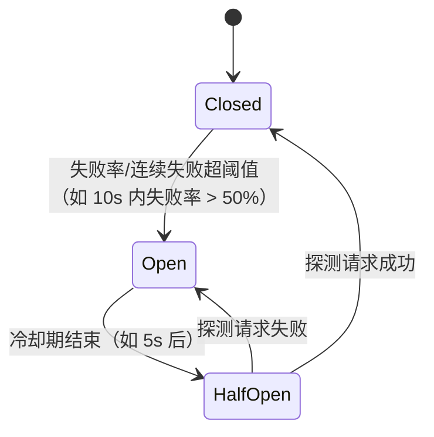

# 限流与熔断：防雪崩的两道闸

> 属于 S8 分布式理论 · 能力强化 · 第六篇（导师清单：限流熔断）
> 上一篇：[网络通信与降级方案](./网络通信与降级方案)　下一篇：[高可用机制全景](./高可用机制全景)

> **这篇解决什么问题**：导师清单里的"限流熔断"是防雪崩的两道闸——**限流：不让流量进来（保护自己）；熔断：不让请求打向下游（保护下游/防止放大）**。上一篇讲了超时/重试/降级/隔离，本篇把**限流算法**（固定窗口/滑动窗口/令牌桶/漏桶，含分布式限流）和**熔断器状态机**（Closed/Open/Half-Open，含工程参数）讲到能写代码、能讲清楚边界。S5 场景题（中）已讲过一版（见 [场景题（中）· 限流](./../05-high-concurrency/场景题-中)），本篇是**算法级深挖**。

## 一、为什么需要两道闸：雪崩的完整链路


- **限流**拦在第 ① 步：**进不来**，系统就不会被打垮；
- **熔断**拦在第 ② 步：**不让打**，下游就不会被拖垮，故障就不会放大；
- 两者配合重试/降级（[上一篇](./网络通信与降级方案)），就是完整的防雪崩体系。

## 二、限流算法：五种算法一次讲透

### 2.1 固定窗口（Fixed Window）

**原理**：把时间切成固定窗口（如 1s），每窗口一个计数器，`counter > limit` 就拒绝，窗口结束清零。

```
[窗口1: 0~1s] 计数到 100 → 满，拒绝
[窗口2: 1~2s] 计数从 0 重新开始
```

| 优点 | 缺点 |
| --- | --- |
| 实现最简单（一个计数器 + 一个时间戳） | **边界突刺**：0.9s 的 100 个 + 1.1s 的 100 个 = 0.2s 内放进来 200 个（两个窗口各一半） |

### 2.2 滑动窗口（Sliding Window）

**原理**：把窗口细分成更小的格子（如 1s 窗口分成 10 个 100ms 格），**滑动**统计最近一个窗口的格子总和，拒绝时精确按"最近 1s"算。

| 优点 | 缺点 |
| --- | --- |
| 消除边界突刺，统计更准 | 每个格子一个计数器，内存多一点；粒度越细越准也越贵 |

### 2.3 令牌桶（Token Bucket）—— 最常用

**原理**：桶里按固定速率**生成令牌**（如每秒 100 个），请求来先**取令牌**，有令牌放行、没有拒绝（或等待）。桶有容量上限（burst 能力）。

```text
桶容量 = 200（可突发）
每秒生成 100 个令牌
请求：先取令牌 → 有则放行，无则拒绝
```

| 优点 | 缺点 |
| --- | --- |
| **允许突发**（桶里攒的令牌可以一次性用完）；平滑限速 | 参数两套（速率 + 容量） |

**Go 实现就是标准库 `golang.org/x/time/rate`**：

```go
limiter := rate.NewLimiter(rate.Limit(100), 200) // 每秒 100 个，桶容量 200
if !limiter.Allow() { // 取令牌失败 → 拒绝
    http.Error(w, "too many requests", http.StatusTooManyRequests) // 429
    return
}
```

### 2.4 漏桶（Leaky Bucket）

**原理**：请求进桶，**桶以固定速率漏水（处理）**，桶满则溢出拒绝。输出严格匀速，**不允许突发**。

| 优点 | 缺点 |
| --- | --- |
| 输出绝对平滑（保护下游最稳） | **不吸收突发**（洪峰直接溢出）；对"允许抖动的流量"过严 |

### 2.5 算法对比（必背表）

| 算法 | 是否允许突发 | 平滑度 | 实现成本 | 典型场景 |
| --- | --- | --- | --- | --- |
| 固定窗口 | 边界突刺 | 差 | 最低 | 简单计数 |
| 滑动窗口 | 小 | 中 | 低 | 精确限速（网关常用） |
| **令牌桶** | **允许**（桶容量） | 好 | 低 | **后端服务默认选择** |
| 漏桶 | 不允许 | 最好 | 中 | 保护下游吞吐（限下游 QPS） |
| 计数器+队列（变体） | 由队列吸收 | 中 | 中 | 削峰（结合 MQ） |

> **选型一句话**：**后端服务限流默认令牌桶**（允许突发、平滑限速）；**保护下游吞吐用漏桶**；**精确按时间窗统计用滑动窗口**。

### 2.6 分布式限流：单机限流跨机器就失效

**问题**：10 台机器各限 100 QPS = 总量 1000，洪峰时可能 10 台同时收 1000 = 总量 10000。

**分布式限流 = 集中计数**（Redis + Lua 原子操作）：

```lua
-- 滑动窗口的 Redis Lua 实现（原子执行，防竞态）
local key = KEYS[1]
local now = tonumber(ARGV[1])
local window = tonumber(ARGV[2])   -- 窗口 ms
local limit = tonumber(ARGV[3])
redis.call('ZREMRANGEBYSCORE', key, 0, now - window) -- 清掉窗口外的
local count = redis.call('ZCARD', key)
if count < limit then
    redis.call('ZADD', key, now, now .. '-' .. math.random(1000000)) -- 记录本次
    redis.call('PEXPIRE', key, window)
    return 1  -- 放行
end
return 0      -- 拒绝
```

**分层限流（生产标配）**：网关层（全局限流，按 IP/用户）→ 服务层（接口级令牌桶）→ 本地层（每实例内存限流兜底）。**总量按最严一级兜底**。

**分布式限流的故障边界（S5 讲过，这里给结论）**：

| 场景 | 现象 | 处理 |
| --- | --- | --- |
| Redis 限流器挂 | 拿不到计数器 | **降级为本地限流**（每实例配额 = 总量/实例数），**宁可多拦不可漏拦**——限流过头是体验问题，漏拦是雪崩问题（[S5 场景题（中）](./../05-high-concurrency/场景题-中)） |
| 时钟不同步 | 窗口边界判断错 | 用 Redis 时间（`TIME` 命令）而不是各节点本地时间 |

### 2.7 限流维度与配额（进阶）

| 维度 | 限什么 | 场景 |
| --- | --- | --- |
| QPS（请求数） | 每秒请求数 | 通用 |
| 并发数（信号量） | 同时在处理的请求数 | **长任务**（AI 推理、视频生成——QPS 低但每个都占资源，限并发更合理） |
| 连接数 | 同时建立的连接 | 保护连接池 |
| 用户/IP 维度 | 每个用户/来源的配额 | 防单用户打爆、防爬虫 |
| 资源维度 | CPU/内存/带宽预算 | 服务网格限流 |

> **面试亮点句**："**限流不只看 QPS——AI 剪辑这种长任务服务，QPS 1 的请求可能占 10 秒 GPU，限并发数（在途请求上限）比限 QPS 更本质。**"（与 [S6 Agent Backend](./../06-agent-backend/系统设计与串联) 的推理任务管理呼应）

## 三、熔断器：状态机与工程参数

### 3.1 为什么需要熔断

下游持续故障时，重试只会放大（重试风暴，见[上一篇](./网络通信与降级方案) 3.3）。**熔断 = 连续失败超阈值后，直接快速失败（不再打下游），让下游喘口气恢复。**

### 3.2 三态状态机（必背）



| 状态 | 行为 | 说明 |
| --- | --- | --- |
| **Closed（关闭）** | 正常放行，**统计失败率** | 滑动窗口内统计（如最近 10s / 最近 100 次） |
| **Open（打开）** | **直接快速失败**（走降级逻辑），不打下游 | 给下游恢复时间 |
| **Half-Open（半开）** | **放一个探测请求**试水 | 成功 → 回 Closed；失败 → 回 Open |

### 3.3 工程参数（go-zero breaker / Hystrix 一致）

| 参数 | 含义 | 典型值 |
| --- | --- | --- |
| 统计窗口 | 在多久内统计失败 | 10s（滑动窗口） |
| 失败阈值 | 失败率超多少触发熔断 | 50%（`failureRatio`） |
| **最小请求数** | 样本太少不熔断（防误判） | 如窗口内至少 20 个请求才计算 |
| 冷却时间 | Open 持续多久后转 Half-Open | 5~10s |
| 超时/延迟阈值 | 慢请求算不算失败 | 按 P99 × 系数 |

**关键：最小请求数**——只有 3 个请求失败了 2 个就熔断，是误判（可能只是运气不好）。**样本量不足不熔断**是工程里最常见的坑。

### 3.4 Go 实现：go-zero 的 breaker（生产可直接用）

```go
b := breaker.NewBreaker(breaker.WithName("clip-service"))
err := b.Do(func() error {           // Do 内部自动统计成功/失败并切换状态
    return callDownstream(ctx)       // 失败会被计入
})
if err == breaker.ErrServiceUnavailable {
    // 熔断打开：走降级逻辑（兜底缓存/默认值）
    return degradedResponse(ctx)
}
```

**手写核心**（理解状态机）：

```go
type breaker struct {
    state    int32 // 0 Closed / 1 Open / 2 HalfOpen
    failures int32 // 连续失败计数
    openedAt time.Time
    mu       sync.Mutex
}

func (b *breaker) Allow() error {
    b.mu.Lock()
    defer b.mu.Unlock()
    switch b.state {
    case stateOpen:
        if time.Since(b.openedAt) > cooldown { // 冷却结束 → 半开
            b.state = stateHalfOpen
            return nil // 放行探测请求
        }
        return errOpen // 快速失败
    case stateHalfOpen:
        return errOpen // 半开期间只放一个探测
    default: // Closed
        return nil
    }
}

func (b *breaker) Mark(success bool) {
    b.mu.Lock()
    defer b.mu.Unlock()
    if success {
        if b.state == stateHalfOpen {
            b.state = stateClosed // 探测成功 → 恢复
        }
        b.failures = 0
    } else {
        b.failures++
        if b.state == stateHalfOpen || b.failures >= threshold {
            b.state = stateOpen // 连续失败超阈值 → 熔断
            b.openedAt = time.Now()
        }
    }
}
```

### 3.5 熔断的边界（面试深挖）

| 场景 | 现象 | 处理 |
| --- | --- | --- |
| 误熔断 | 正常服务被熔断（抖动期失败率瞬间高） | 最小请求数 + 失败率（而非纯计数）+ 冷却期设置 |
| 半开探测风暴 | Half-Open 放行后流量全涌向一个探测 | 半开期间只放**有限个**探测（如 1 个） |
| 熔断后没有降级 | 快速失败但调用方拿到错误 | **熔断必须配降级**（见[上一篇](./网络通信与降级方案)）——熔断是手段，降级才是结果 |
| 熔断粒度 | 整个下游熔断误伤健康接口 | **按接口/按实例粒度熔断**（如 gRPC 按 method 熔断），配合[负载均衡](./gRPC负载均衡详解)摘除故障实例 |
| 熔断与重试顺序 | 熔断了还重试 = 白打 | **先查熔断器，Open 则直接降级，不重试**（见 [S5 场景题（中）](./../05-high-concurrency/场景题-中) 四段防线） |

## 四、限流 + 熔断 + 降级的完整组合（收口）

```text
请求进来
  ├─ 限流器：超配额 → 429 拒绝（进不来）
  ├─ 熔断器：下游 Open → 快速失败（不让打）
  └─ 降级：失败/熔断 → 兜底响应（给结果）
超时：全程兜底（预算递减）
重试：仅瞬时故障 + 幂等 + 退避（救回来）
隔离：资源池分隔（不扩散）
```

**面试完整作答模板（背这个结构）**：
"我们系统防雪崩有四层：**入口限流**（网关 + 服务层 + 本地三层，令牌桶 + Redis 分布式限流）→ **调用超时**（全链路预算递减）→ **熔断**（按接口粒度，失败率超阈值 Open，冷却后半开探测，配最小请求数防误判）→ **降级**（熔断后读兜底缓存/返回默认值，开关走配置中心动态下发）。重试只对幂等请求、指数退避 + jitter、限次数。"

---

## 串起来

**限流管"进不来"，熔断管"不让打"，降级管"打不了也有结果"，超时重试隔离管"过程的健壮性"**——四件事各守一段，组合起来才是完整的防雪崩体系（配合[上一篇](./网络通信与降级方案)的网络降级）。下一篇从"单点防护"上升到"整体不挂"——[高可用机制全景](./高可用机制全景)：冗余、故障检测、故障转移。

---

## 面试追问

- **问：令牌桶和漏桶的区别？** 令牌桶允许突发（桶容量吸收），漏桶输出严格匀速；后端默认令牌桶，保护下游吞吐用漏桶。
- **问：固定窗口有什么问题？怎么解决？** 边界突刺（窗口交界处两倍流量）；滑动窗口按格子滑动统计解决。
- **问：分布式限流怎么做？Redis 挂了怎么办？** Redis + Lua 原子计数（滑动窗口 ZSET / 令牌桶）；Redis 挂降级为本地限流（配额 = 总量/实例数），宁可多拦不可漏拦。
- **问：熔断器状态机讲讲？** Closed 统计失败 → 超阈值 Open 快速失败 → 冷却后 Half-Open 放探测 → 成功回 Closed / 失败回 Open；配最小请求数防误判。
- **问：熔断和限流什么区别？** 限流保护自己（管入口流量），熔断保护下游/防放大（管出站调用）；一个在入口，一个在出口。
- **问：AI 剪辑的长任务服务限流要注意什么？** 限并发数（在途任务上限）比限 QPS 更本质——一个视频生成任务占资源几十秒，QPS 无法反映真实负载。
