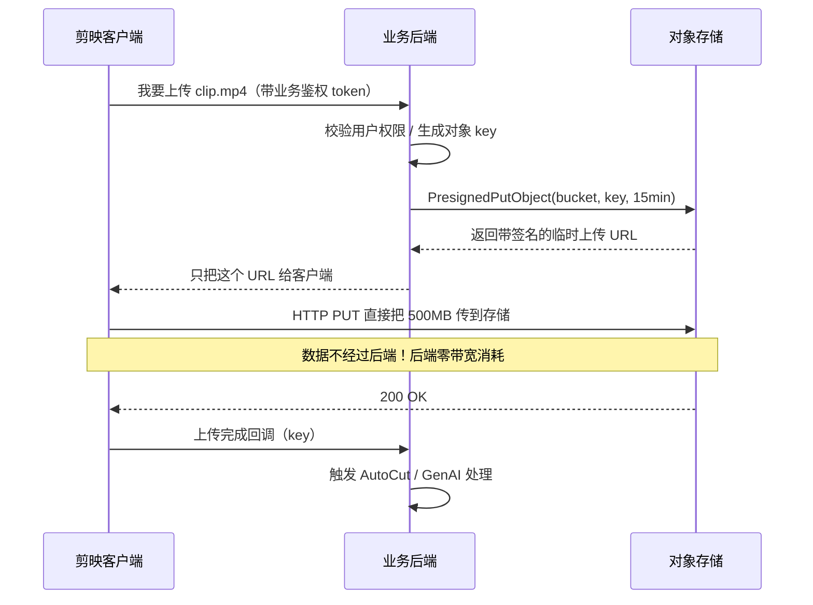

# 用 Go 把素材存进对象存储——S3 API 实战

> 属于 S9 对象存储 · 第三篇
> 上一篇：[架构与核心机制](./架构与核心机制)
> 下一篇：[安全与生产实践](./安全与生产实践)

前两篇讲了"为什么"和"怎么运转"。这一篇把机制落成能跑的 Go 代码：连上 MinIO、做基本增删查、亲手实现分片上传，再引出生产里最实用的一招——**预签名 URL**，让客户端直连存储上传下载，把后端带宽从数据洪流里摘出来。所有代码都跑真实 MinIO，`endpoint`、凭据换掉就能连线上 TOS/OSS/COS。

::: tip 先起 MinIO
本篇代码需要本地 MinIO：`cd code/backend && docker compose up -d minio`。控制台 http://127.0.0.1:9001 （账号密码都是 `minioadmin`），S3 API 在 `127.0.0.1:9000`。
:::

## 一、S3 兼容 API 全景

S3 的 API 面很宽，但日常 90% 的活儿就集中在这几组：

| 分类 | 典型操作 | 用途 |
|------|---------|------|
| **桶管理** | `MakeBucket` / `RemoveBucket` / `ListBuckets` | 建/删/列桶 |
| **对象读写** | `PutObject` / `GetObject` / `StatObject` / `RemoveObject` | 单对象 CRUD |
| **列举** | `ListObjects`（按前缀/分页） | 列某前缀下的对象 |
| **分片上传** | `NewMultipartUpload` / `PutObjectPart` / `CompleteMultipartUpload` | 大文件上传 |
| **预签名** | `PresignedPutObject` / `PresignedGetObject` | 客户端直传/直下 |
| **权限与安全** | `SetBucketPolicy` / SSE 加密选项 | 见第四篇 |

`minio-go` 把这些都封装成了方法。记住这张表，S3 就不再是一堆陌生 API，而是"桶—对象—分片—预签名—安全"五个抽屉。

## 二、连接与基本 CRUD

### 2.1 建立客户端

```go
import (
    "github.com/minio/minio-go/v7"
    "github.com/minio/minio-go/v7/pkg/credentials"
)

func newClient() (*minio.Client, error) {
    return minio.New("127.0.0.1:9000", &minio.Options{
        Creds:  credentials.NewStaticV4("minioadmin", "minioadmin", ""),
        Secure: false, // 本地 MinIO 未开 TLS；线上务必 true（走 HTTPS）
    })
}
```

`credentials.NewStaticV4` 用固定的 AccessKey/SecretKey 做 V4 签名。**线上不要把长期密钥硬编码**——用环境变量、密钥管理服务，或 STS 临时凭据（第四篇细说）。

### 2.2 建桶、上传、下载、删除

```go
ctx := context.Background()
bucket, object := "clips", "covers/2026/hero.jpg"

// 建桶（幂等判断：已存在就跳过）
exists, _ := client.BucketExists(ctx, bucket)
if !exists {
    if err := client.MakeBucket(ctx, bucket, minio.MakeBucketOptions{}); err != nil {
        return err
    }
}

// 上传：把内容 + 长度 + Content-Type 打进去
data := []byte("...素材二进制...")
info, err := client.PutObject(ctx, bucket, object,
    bytes.NewReader(data), int64(len(data)),
    minio.PutObjectOptions{ContentType: "image/jpeg"})
// info.ETag 是内容指纹，info.Size 是大小

// 下载
obj, err := client.GetObject(ctx, bucket, object, minio.GetObjectOptions{})
defer obj.Close()
got, err := io.ReadAll(obj) // got == data

// 查元数据（不下载数据本体，只拿 stat）
stat, err := client.StatObject(ctx, bucket, object, minio.StatObjectOptions{})
// stat.Size / stat.ContentType / stat.LastModified / stat.ETag

// 删除
err = client.RemoveObject(ctx, bucket, object, minio.RemoveObjectOptions{})
```

::: warning 桶命名有硬规则
S3 桶名：**全小写、3~63 字符、只能字母数字和连字符 `-`、不能有下划线 `_`、不能像 IP**。这是全球命名空间的约束，`My_Clips` 这种名字直接建桶失败。练习里用带随机后缀的唯一桶名，就是为了避免测试互相踩桶。
:::

### 2.3 列举：按前缀扫描

还记得第一篇的"扁平命名空间"吗？列目录本质是按前缀扫 key：

```go
opts := minio.ListObjectsOptions{Prefix: "covers/2026/", Recursive: true}
for obj := range client.ListObjects(ctx, bucket, opts) {
    if obj.Err != nil {
        return obj.Err
    }
    fmt.Println(obj.Key, obj.Size) // 列出 covers/2026/ 前缀下所有对象
}
```

`ListObjects` 返回一个 channel，边扫边吐，天然适合海量对象分页流式处理。

## 三、分片上传：用 `minio.Core` 手写三步协议

`PutObject` 对大文件其实内部已经会自动分片。但为了**真正理解协议**（也是面试高频手撕点），我们用低层的 `minio.Core` 亲手写一遍。这正是配套练习 `01_multipart_upload` 的内容：

```go
import "github.com/minio/minio-go/v7"

// core, _ := minio.NewCore("127.0.0.1:9000", &minio.Options{...})
func MultipartUpload(ctx context.Context, core *minio.Core,
    bucket, object string, data []byte, partSize int) (etag string, parts int, err error) {

    // 第一步：申请上传会话，拿 uploadID
    uploadID, err := core.NewMultipartUpload(ctx, bucket, object, minio.PutObjectOptions{})
    if err != nil {
        return "", 0, err
    }
    // 出错要 Abort 清理，别留下悬空的半成品分片
    defer func() {
        if err != nil {
            _ = core.AbortMultipartUpload(ctx, bucket, object, uploadID)
        }
    }()

    // 第二步：按 partSize 切片，逐片上传，收集 (PartNumber, ETag)
    var completeParts []minio.CompletePart
    partNumber := 1
    for offset := 0; offset < len(data); offset += partSize {
        end := offset + partSize
        if end > len(data) {
            end = len(data)
        }
        chunk := data[offset:end]
        p, e := core.PutObjectPart(ctx, bucket, object, uploadID, partNumber,
            bytes.NewReader(chunk), int64(len(chunk)), minio.PutObjectPartOptions{})
        if e != nil {
            return "", 0, e
        }
        completeParts = append(completeParts, minio.CompletePart{
            PartNumber: partNumber, ETag: p.ETag,
        })
        partNumber++
    }

    // 第三步：提交分片清单，服务端按 PartNumber 排序合并
    info, err := core.CompleteMultipartUpload(ctx, bucket, object, uploadID, completeParts,
        minio.PutObjectOptions{})
    if err != nil {
        return "", 0, err
    }
    return info.ETag, len(completeParts), nil
}
```

三个要点：

1. **`defer` + `AbortMultipartUpload`**：任何一步失败都要清理已上传的分片，否则它们会一直占着存储空间（生产里配 `AbortIncompleteMultipartUpload` 生命周期规则兜底自动清理）；
2. **每片 ≥ 5MiB**（最后一片除外）是 S3 硬规定，`partSize` 设太小 `Complete` 会报错；
3. **合并后的 ETag 不再是简单 MD5**，而是形如 `<md5>-<分片数>` 的复合指纹——这是判断"一个对象是不是分片上传的"的小技巧。

## 四、预签名 URL：让客户端直连存储

### 4.1 问题：后端不该当数据搬运工

如果所有素材上传下载都经过后端中转，后端就成了带宽瓶颈：用户传 500MB，后端先收 500MB 再转存 500MB，一进一出 1GB 流量全压在业务服务器上。用户一多，带宽和成本双爆炸。

**预签名 URL** 的思路：后端只做鉴权和"签发通行证"，**数据洪流由客户端和存储直接对接**：



后端全程没碰那 500MB，只发了一个几百字节的 URL。这就是预签名 URL 在剪辑素材上传里的核心价值。

### 4.2 代码：一次直传 + 直下往返

这是配套练习 `02_presigned_url` 的核心：

```go
func PresignedRoundTrip(ctx context.Context, client *minio.Client,
    bucket, object string, body []byte, expiry time.Duration) (downloaded []byte, err error) {

    // 1. 生成预签名上传 URL（有效期 expiry）
    putURL, err := client.PresignedPutObject(ctx, bucket, object, expiry)
    if err != nil {
        return nil, err
    }
    // 2. 客户端用标准库 http 直接 PUT 到这个 URL（模拟客户端行为）
    req, _ := http.NewRequestWithContext(ctx, http.MethodPut, putURL.String(),
        bytes.NewReader(body))
    req.ContentLength = int64(len(body)) // 必须设，签名校验会用
    putResp, err := http.DefaultClient.Do(req)
    if err != nil {
        return nil, err
    }
    defer putResp.Body.Close()
    if putResp.StatusCode != http.StatusOK {
        return nil, fmt.Errorf("预签名上传失败: %d", putResp.StatusCode)
    }

    // 3. 生成预签名下载 URL
    getURL, err := client.PresignedGetObject(ctx, bucket, object, expiry, url.Values{})
    if err != nil {
        return nil, err
    }
    // 4. 直接 GET 回来
    getResp, err := http.Get(getURL.String())
    if err != nil {
        return nil, err
    }
    defer getResp.Body.Close()
    return io.ReadAll(getResp.Body)
}
```

练习的测试还会验证**过期即失效**：把 `expiry` 设成 1 秒，`sleep` 2 秒后再用那个 URL，断言拿不到 200——这正是预签名 URL 安全性的体现，下一篇会深入它的安全边界。

### 4.3 断点续传 + CDN 回源

- **断点续传**：分片上传（第三节）也能预签名——对每个分片单独签发 `PresignedPutObject`（S3 里叫 UploadPart 的预签名），客户端记住已成功分片，断网后只续传缺片。手机弱网上传大素材靠它。
- **CDN 回源**：下载侧，把对象 URL 挂到 CDN 域名下。用户第一次拉，CDN 回源到对象存储取一次并缓存；后续用户就近命中边缘节点，又快又省回源带宽。对象不可变（第一篇）让这个缓存可以放心长期持有。

::: tip 实战经验
"上传用预签名直传、下载走 CDN"几乎是所有 UGC/AIGC 产品的标准姿势。后端只负责**签发凭证 + 记账 + 触发处理**，永远不做数据搬运工。面试讲素材上传链路时，能主动画出 4.1 那张时序图并点出"后端零带宽"，是很加分的架构 sense。
:::

---

## 串起来

这一篇把机制变成了代码：`minio-go` 用五个抽屉（桶/对象/列举/分片/预签名）覆盖日常所有操作；`PutObject/GetObject/StatObject/ListObjects` 是基本功；`minio.Core` 手写的分片三步协议让你真正吃透大文件上传；而**预签名 URL** 把后端从数据洪流里解放出来，配合 CDN 回源构成"直传 + 就近下载"的生产标配。你现在能把素材稳稳地存进去、取出来了。

但——**能存不等于存得安全**。一个配错权限的桶会让你的素材在公网裸奔，一个签得太松的预签名 URL 会被人盗刷。下一篇是整个专题的重头戏**安全与生产实践**：桶权限的最小化、预签名的安全边界、加密、防盗刷、版本与对象锁，以及 AIGC 场景专属的上传校验。
