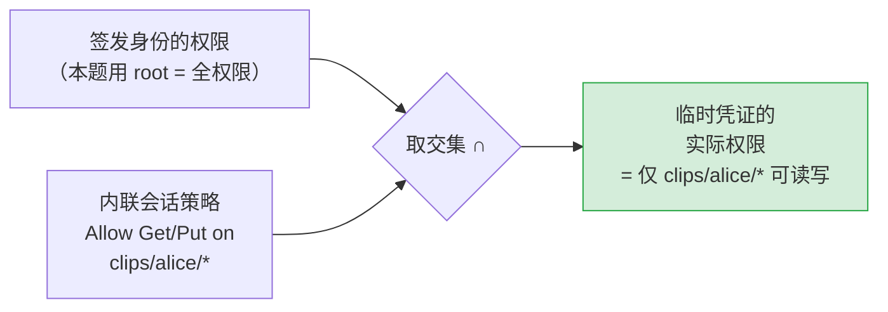
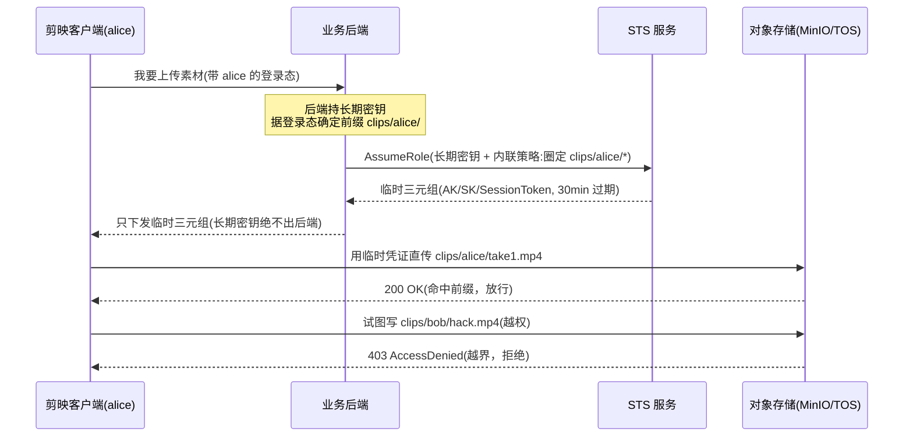

# 别把家门钥匙给客人——STS 临时凭证与客户端直传

> 属于 S9 对象存储 · 第五篇
> 上一篇：[安全与生产实践](./安全与生产实践)
> 下一篇：[面试题集](./面试题集)

上一篇结尾埋了个引子：对更高安全要求的场景，用 **STS 临时凭据**替代长期 AK。这一篇把它彻底讲透。

先记住一句话，它是整篇的题眼：**后端手里的长期密钥，是你家的大门钥匙；客户端要的，只是一张"三楼某个房间、今晚有效"的访客卡。** 把大门钥匙复制一把交给客人，等于把整栋楼的安全押在"客人不会弄丢、不会乱用"上——这在生产里是不可接受的。STS 就是那台**发访客卡的机器**。

## 一、为什么需要 STS：预签名 URL 不够用的地方

第三篇（[S3 API 与 Go 实战](./S3-API与Go实战)）里我们用**预签名 URL** 让客户端直传：后端用长期密钥签一个"针对这一个 key、这一种方法、这一小段时间"的一次性 URL，客户端拿着它 `PUT` 一次就完事。这在"上传一个成片""下载一个封面"这种**单对象、一次性**场景里非常好用。

但剪映/CapCut 的客户端要做的事复杂得多：

- 一次导入**几十上百个素材**（视频、图片、音频），每个都要单独签一条 URL？签名请求本身就成了瓶颈。
- 上传到一半要**列目录、查进度、断点续传、改元数据**——预签名 URL 的粒度是"单对象 + 单方法"，覆盖不了这些操作。
- AutoCut 这类流程要**边算边传中间产物**，对象的 key 在运行时才确定，没法预先一条条签好。

预签名 URL 的本质是 **"把某一次具体操作的授权，提前算好塞进一个 URL"** ；一旦客户端需要在一段时间内 **自主发起多种、多对象的操作**，你要的就不再是"一次授权"，而是 **"一段时间内、圈定范围内的一组能力"** ——这正是 STS 临时凭证解决的问题。

那"直接把后端的长期 AK/SK 发给客户端"行不行？**绝对不行，这是对象存储的头号红线。** 长期密钥是全权限的大门钥匙：一旦它进了客户端（App 包可被反编译、网络可被抓包、内存可被 dump），等于公开。泄露的后果不是"某个对象被下走"，而是**整个账号下所有桶、所有对象可读可删可改**——全盘沦陷。

::: warning 面试常被追问
"预签名 URL 和 STS 临时凭证，什么时候用哪个？"——一句话锚点：**单对象、一次性操作用预签名 URL；客户端要在一段时间内自主做多种/多对象操作，用 STS。** 再补一层：预签名是"预先算好的一次授权"，STS 是"下发一组带边界、会过期的临时身份"。两者都严守同一条底线——**长期密钥永远不出后端**。
:::

## 二、STS 是什么：AssumeRole 换回一组"临时身份"

STS（Security Token Service，安全令牌服务）是对象存储/云平台提供的一个接口。核心动作叫 **AssumeRole**（扮演角色）：

> 后端用**长期密钥**向 STS 发起 AssumeRole 请求，附上一条**内联会话策略**（inline session policy，描述"这组临时凭证能干什么"），STS 校验通过后，返回一组**临时凭证三元组**。

这个三元组是理解 STS 的关键，它比长期密钥多了一件东西：

| 字段 | 作用 | 与长期密钥的区别 |
|------|------|------------------|
| **AccessKeyID**（临时 AK） | 标识这次临时身份 | 临时的、几十分钟后作废 |
| **SecretAccessKey**（临时 SK） | 签名用的密钥 | 临时的 |
| **SessionToken**（会话令牌） | **临时身份的证明**，每个请求都要带上 | 长期密钥**没有**这一项 |

`SessionToken` 是临时凭证独有的"身份证"。服务端凭它识别出"这是一组 STS 签发的临时凭证，带着某条会话策略的边界"，从而在每次请求时校验是否越界。**少了 SessionToken，临时 AK/SK 根本用不了**——这也是为什么临时凭证泄露的危害远小于长期密钥：它带着边界、且很快过期。

临时凭证的两个天生属性，正好对上前面两个痛点：

- **带权限边界**：会话策略把它圈死在 `clips/alice/*`，碰不到别人的素材，更碰不到别的桶。
- **短过期**：几十分钟自动作废，就算泄露，窗口也极小。

## 三、核心机制：会话策略"取交集"，只会更窄不会更宽

这是 STS 最容易被面试官盯、也最容易理解错的一点：

> **临时凭证的实际权限 = 签发身份的权限 ∩ 内联会话策略。**

注意是**交集**——会话策略只能在"签发身份本来就有的权限"里做**减法**，绝不可能凭空放大。你拿一个只能读 `bucketA` 的身份去 AssumeRole，哪怕会话策略写了"允许删除 `bucketB`"，换回的临时凭证也**删不了 `bucketB`**——因为签发身份本来就没这权限，交集为空。



在我们的练习里，签发身份是 **root（全权限）**，所以"全权限 ∩ `clips/alice/*`"= 就等于会话策略本身。生产上更规范的做法是：**签发身份本身也不是 root，而是一个"只能碰素材桶"的中等权限账号**，会话策略再在它之上收窄到单用户前缀——两层最小权限叠加，纵深防御。

::: warning 面试常被追问
"会话策略和桶策略（Bucket Policy）是一回事吗？"——**不是，这是高频混淆点。** 两者结构上有个显眼区别：

- **桶策略**是**资源型**策略（绑在桶上，描述"**谁**能访问**这个桶**"），所以有 `Principal` 字段，比如第四篇里的 `"Principal": {"AWS": ["*"]}`。
- **会话策略**是 **IAM/身份型**策略（描述"**这组临时凭证**能做什么"），**没有 `Principal`**——因为主体就是持有这组凭证的人，不需要再声明。

一句话记牢：**带 `Principal` 的是桶策略（管资源），不带 `Principal` 的是会话策略（管身份）。** 写会话策略时手滑加了 `Principal`，轻则被忽略、重则报错。
:::

一条圈定 `clips/alice/` 的会话策略长这样（注意**没有 `Principal`**）：

```json
{
  "Version": "2012-10-17",
  "Statement": [
    {
      "Effect": "Allow",
      "Action": ["s3:GetObject", "s3:PutObject"],
      "Resource": ["arn:aws:s3:::my-bucket/clips/alice/*"]
    }
  ]
}
```

`Resource` 里的 `arn:aws:s3:::<桶名>/<前缀>*` 就是那把"访客卡"的物理边界：**只有匹配这个前缀的对象，才允许 `GetObject`/`PutObject`**，其余一律默认拒绝。

## 四、Go 实战：`NewSTSAssumeRole` 换凭证，喂给 `minio.New`

`minio-go/v7` 的 `pkg/credentials` 子包（第三篇 `NewStaticV4` 就来自这里）提供了现成的 STS AssumeRole 客户端。整个流程三步：**写策略 → 换凭证 → 建 client**。

```go
import (
    "fmt"
    "time"

    "github.com/minio/minio-go/v7"
    "github.com/minio/minio-go/v7/pkg/credentials"
)

func AssumeScopedRole(endpoint, accessKey, secretKey, bucket, allowedPrefix string, ttl time.Duration) (*minio.Client, error) {
    // 1) 内联会话策略：只放行该前缀下的读写，其余默认拒绝。注意没有 Principal。
    sessionPolicy := fmt.Sprintf(`{
  "Version": "2012-10-17",
  "Statement": [
    {
      "Effect": "Allow",
      "Action": ["s3:GetObject", "s3:PutObject"],
      "Resource": ["arn:aws:s3:::%s/%s*"]
    }
  ]
}`, bucket, allowedPrefix)

    // 2) 向 STS 换回临时三元组。注意 stsEndpoint 要带 scheme。
    stsCreds, err := credentials.NewSTSAssumeRole("http://"+endpoint, credentials.STSAssumeRoleOptions{
        AccessKey:       accessKey,   // 后端持有的长期密钥，只在服务端出现
        SecretKey:       secretKey,
        Policy:          sessionPolicy,
        DurationSeconds: int(ttl.Seconds()),
        RoleSessionName: "capcut-clip-uploader", // 便于服务端审计溯源
    })
    if err != nil {
        return nil, fmt.Errorf("STS AssumeRole 失败: %w", err)
    }

    // 3) 用临时凭证构建受限 client。注意 endpoint 不带 scheme，由 Secure 决定 http/https。
    scoped, err := minio.New(endpoint, &minio.Options{
        Creds:  stsCreds,
        Secure: false, // 本地 dev；线上必须 true(TLS)，切勿明文传临时凭证
    })
    if err != nil {
        return nil, fmt.Errorf("用临时凭证构建 client 失败: %w", err)
    }
    return scoped, nil
}
```

有两个**极易踩的语法细节**，单独拎出来：

- **STS 端点要带 scheme，S3 端点不带**。`NewSTSAssumeRole` 的第一个参数会被 `url.Parse` 解析，必须是完整 URL：`"http://127.0.0.1:9000"`；而 `minio.New` 的第一个参数只吃裸的 `host:port`（`"127.0.0.1:9000"`），走 http 还是 https 由 `Secure` 决定。两者同一个主机，写法却不同，混了就报错。
- **`NewSTSAssumeRole` 返回的就是 `*credentials.Credentials`**——和 `NewStaticV4` 返回同一个类型，可以直接塞进 `minio.Options{Creds: ...}`。换句话说，"换临时凭证"和"用静态密钥"对 `minio.New` 而言是完全一样的接口，差别只在 `Creds` 从哪来。

## 五、剪映直传全链路：一次上传，端到端发生了什么

把上面的函数放进真实业务，客户端直传一个素材的完整链路是这样的：



四个要点连起来看：

1. **长期密钥全程只在后端出现**，客户端从头到尾只见过临时三元组。
2. **前缀由后端根据登录态决定**，客户端说了不算——它没法把自己的前缀改成别人的。
3. **越权由存储服务端强制拦截**：alice 的临时凭证碰 `clips/bob/*`，MinIO/TOS 直接返回 `403 AccessDenied`，不依赖客户端"自觉"。
4. **凭证会过期**：30 分钟后这组临时凭证自动作废，客户端需要时再向后端要一组新的。

这套链路就是配套练习 **`04_sts_assume_role`** 要你亲手实现并**正反向验证**的：正向——alice 的凭证在 `clips/alice/` 内可读可写；反向——碰 `clips/bob/*` 必须 `AccessDenied`。

## 六、STS vs 预签名 URL：一张表看清怎么选

| 维度 | 预签名 URL | STS 临时凭证 |
|------|-----------|--------------|
| **授权粒度** | 单对象 + 单方法（这个 key，这个 PUT） | 一组前缀 + 一组动作（`clips/alice/*` 的读写） |
| **生命周期** | 一次性，用完即弃 | 一段时间内（分钟级）持续有效 |
| **能做多少操作** | 一次一个操作 | 有效期内自主发起多次、多对象操作 |
| **客户端拿到的东西** | 一条带签名的 URL | 一组临时 AK/SK/SessionToken |
| **典型场景** | 下载一个成片、上传一个封面 | 客户端批量导入素材、列目录、断点续传 |
| **是否下发长期密钥** | 否 | 否 |
| **实现复杂度** | 低（一行 `PresignedPutObject`） | 中（写会话策略 + AssumeRole） |

选型口诀：**一次性单对象 → 预签名；一段时间内自主多操作 → STS。** 剪映客户端导入素材属于后者，所以 STS 是它的主力范式。

## 七、生产建议与踩坑

::: tip 实战经验
上线前对着这几条过一遍：

- **最短 TTL**：够用就行，别图省事签几小时。剪映导素材几十分钟足矣，越短越安全。
- **最小策略**：`Action` 只给真正需要的（能只给 `PutObject` 就别搭 `GetObject`），`Resource` 前缀能多细就多细（精确到 `clips/<uid>/`）。
- **签发身份也别用 root**：生产上用一个"只能碰素材桶"的中等权限账号去 AssumeRole，和会话策略两层收窄，纵深防御。
- **`RoleSessionName` 一定要填**：它会进服务端审计日志，出了事能溯源到"哪个用户、哪次会话签发的这组凭证"。
- **线上 `Secure: true`**：临时凭证虽短命，但明文传输仍可能被中间人截获，必须走 TLS。
- **本地 `minioadmin/minioadmin` 只是 dev 凭证**：真实环境的长期密钥要进密钥管理（KMS/Secrets Manager），绝不硬编码进代码或配置文件。
:::

::: warning 踩坑：`DurationSeconds` 会被 clamp 到 ≥ 3600s
`minio-go` v7.3.0 的 `NewSTSAssumeRole` 对 `DurationSeconds` 有个隐蔽处理：**只有传入值 `> 3600` 时才生效，否则强制回落到默认的 3600 秒（1 小时）**。所以你传 `time.Hour` 或更短，实际拿到的过期时间都是 1 小时——想要更短的 TTL，得靠**服务端 STS 策略层面**去限制，而不是指望这个参数。练习里传 `time.Hour` 正是踩着这个下限，行为可预期。
:::

::: warning 面试常被追问
"临时凭证泄露了怎么办？"——三层答：① **危害本就有限**，因为它带边界（只能碰某前缀）+ 短过期（分钟级），不是全权限大门钥匙；② **能主动止血**，服务端可通过撤销会话、轮换签发身份的密钥让相关临时凭证失效；③ **可溯源**，`RoleSessionName` + 审计日志能定位是哪次签发。对比长期密钥泄露的"全盘沦陷 + 难以察觉"，这就是为什么"能用临时凭证就不发长期密钥"是铁律。
:::

## 八、一个易错点：`GetObject` 是惰性的

写反向断言（验证越权被拒）时会撞上一个 SDK 行为，值得单独记：

**`minio-go` 的 `GetObject()` 是惰性的**——它本身不发起真正的读取，只返回一个 `*Object` 句柄，**不报错**；真正的网络请求（和 `AccessDenied` 错误）要到你第一次调用 `Stat()` 或 `Read()` 时才触发。所以验证"越权读被拒"不能只看 `GetObject()` 的返回值，要跟一个 `Stat()` 把错误逼出来：

```go
denied, err := scoped.GetObject(ctx, bucket, "clips/bob/take1.mp4", minio.GetObjectOptions{})
if err == nil {
    _, err = denied.Stat() // 惰性错误在此触发
    denied.Close()
}
// 判定越权：解析结构化错误码
if minio.ToErrorResponse(err).Code == "AccessDenied" { /* 符合预期 */ }
```

而 **`PutObject` 是即时的**——越权写会直接返回 `AccessDenied`，不用额外触发。判定越权统一用 `minio.ToErrorResponse(err).Code == "AccessDenied"` 解析 S3 结构化错误码，比字符串匹配可靠。

## 串起来

STS 临时凭证解决的是一个精确的问题：**当客户端需要在一段时间内自主对对象存储做多种操作，又绝不能持有长期密钥时，怎么给它一组"带边界、会过期"的临时身份。** 机制上，它靠 AssumeRole 换回 **AK/SK/SessionToken** 三元组，权限是"签发身份 ∩ 内联会话策略"的**交集**（只减不增），而会话策略是 **IAM 风格、无 `Principal`**。落到剪映场景，就是后端据登录态把凭证死死圈在 `clips/<uid>/*`、几十分钟过期、越权由存储服务端强制 403——**长期密钥全程不出后端**。

配合上一篇的预签名 URL，你现在手握客户端直传的两种范式，能按"一次性单对象 vs 一段时间多操作"精准选型。

下一篇是 [**面试题集**](./面试题集)：把 S9 全专题的核心考点——对象 vs 块/文件、multipart 为何存在、预签名原理与安全、纠删码 vs 多副本、桶权限与最小权限、强一致 vs 最终一致——整理成 6 道分层追问，帮你在面试里从"知道"讲到"讲透"。
