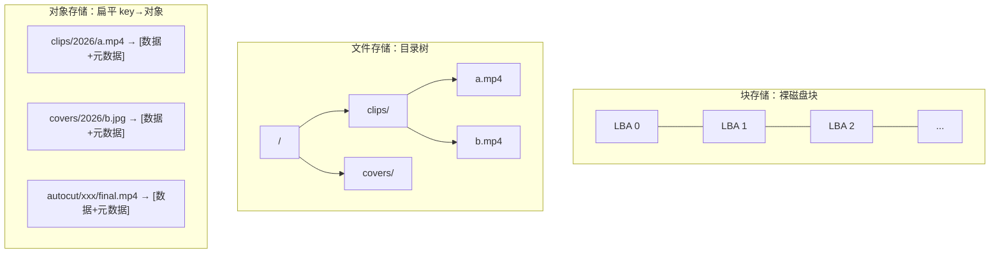

# 海量素材往哪放？——从文件系统到对象存储

> 属于 S9 对象存储 · 第一篇
> 下一篇：[架构与核心机制](./架构与核心机制)

剪映/CapCut 这类产品，用户上传的每一段视频、每一张图片、AutoCut 生成的每一版成片，本质都是**一坨二进制数据 + 一点描述信息**。当用户量到千万级、素材到百亿级，一个绕不开的问题浮出来：**这些素材到底该放哪？** 本篇不写代码，只把"为什么是对象存储，而不是硬盘或 NAS"这件事讲透——这是后面所有实战的地基。

## 一、先看三种存储模型：块、文件、对象

存储系统按"对外暴露的接口"分三类，理解它们的差异，就理解了对象存储为什么存在。

| 维度 | 块存储（Block） | 文件存储（File） | 对象存储（Object） |
|------|----------------|-----------------|-------------------|
| 暴露的抽象 | 裸磁盘块（LBA 地址） | 目录树 + 文件（POSIX） | 扁平的 key → 对象 |
| 访问方式 | SCSI/iSCSI/NVMe | NFS/SMB 挂载路径 | HTTP RESTful API |
| 典型产品 | 云硬盘 EBS、AWS EBS | NAS、NFS、CephFS | S3、OSS、TOS、MinIO |
| 单元大小 | 固定块（4KB） | 任意文件 | 任意对象（可到 TB 级） |
| 元数据 | 无（上层文件系统管） | 目录/权限/时间戳 | **丰富且可自定义**（Content-Type、用户标签…） |
| 扩展性 | 受单机/单卷限制 | 受目录树深度、inode 限制 | **近乎无限水平扩展** |
| 适合场景 | 数据库、虚拟机磁盘 | 团队共享、少量大文件 | **海量非结构化数据**（图片/视频/日志/备份） |

一句话记忆：**块存储给你一块生磁盘，文件存储给你一棵目录树，对象存储给你一个巨大的键值仓库**——你只管用一个全局唯一的 key 存取整个对象，剩下的分布、冗余、扩容它全包了。

## 二、对象存储的四个本质特征

### 2.1 扁平命名空间：没有真正的"目录"

对象存储里 `clips/2026/08/a.mp4` 看着像路径，其实**整个字符串就是一个 key**，没有目录这种实体。所谓"文件夹"只是控制台按 `/` 分隔符做的**前缀聚合展示**。

这带来一个关键后果：**列举一个"目录"下的对象，本质是按前缀（prefix）扫描 key**。素材按 `用户ID/日期/` 组织 key，就能高效地"列出某用户某天的所有素材"——第四篇讲桶策略时，这个前缀概念会直接用来做权限边界。

### 2.2 对象不可变：只能整体覆盖，不能原地改

对象一旦写入，**不支持在中间某个偏移量改几个字节**。要改，只能重新 PUT 一个同名对象整体覆盖（生成新版本）。

这对剪辑场景恰好是优点：一版成片就是一个不可变对象，AutoCut 重新生成就是写一个新 key 或新版本，**天然适合"多版本、可回溯"**，也让缓存/CDN 分发变简单——对象内容不会偷偷变，缓存可以放心长期持有。

### 2.3 元数据随对象走：数据自描述

每个对象除了数据本体，还带一组元数据：

- **系统元数据**：大小、ETag（内容指纹）、Content-Type、Last-Modified；
- **用户自定义元数据**：如 `x-amz-meta-duration: 15s`、`x-amz-meta-resolution: 1080p`、`x-amz-meta-source: autocut`。

剪辑素材把时长、分辨率、来源打进元数据，下游 GenAI 流水线不用下载整个视频就能读到关键信息——**这是"数据自描述"的价值**。

### 2.4 全局唯一 key + 通过 HTTP 访问

每个对象由 `bucket + key` 全局定位，通过一个 URL 就能访问（如 `https://cdn.example.com/clips/a.mp4`）。这意味着**对象存储天生是"面向互联网分发"的**：配上 CDN，全球用户就近拉取素材，这正是 CapCut 这种出海产品的刚需。

## 三、为什么本地盘 / NAS 扛不住剪辑素材

把"海量素材"的特点摊开，就知道传统方案卡在哪：

| 挑战 | 本地盘 / NAS 的困境 | 对象存储怎么解 |
|------|--------------------|---------------|
| **容量**：素材 PB 级、持续增长 | 单机磁盘有上限，NAS 扩容要停机加盘、迁移 | 水平扩展，加机器即扩容，用户无感 |
| **海量小文件 + 大文件混合** | NAS 的 inode / 目录项会成为瓶颈，`ls` 一个百万文件目录能卡死 | 扁平 key + 分布式元数据，前缀扫描不受目录树限制 |
| **高并发访问** | NAS 挂载点、网络文件协议并发能力有限 | 无状态 HTTP 接入层，可水平扩展到极高 QPS |
| **跨地域分发** | NAS 是局域网产物，出海用户访问延迟高 | 对象 URL + CDN，全球边缘节点就近分发 |
| **可靠性** | 单盘坏 = 数据丢；RAID 也只在单机维度 | 多副本 / 纠删码跨机跨机架，设计可靠性 11 个 9 |
| **成本** | 高性能盘全程高价，冷素材也占贵存储 | 生命周期分层：热→温→冷→归档，自动降本 |

::: tip 实战经验
判断一个数据"该不该放对象存储"，问三个问题：**(1) 是不是非结构化的整块数据（图片/视频/模型文件/日志）？(2) 是不是写少读多、以整体存取为主？(3) 量级会不会持续膨胀？** 三个都"是"，几乎必然选对象存储。反过来，需要频繁随机改写、强事务的（如订单、余额）应该放数据库，别硬塞对象存储。
:::

## 四、生态：S3、OSS、COS、字节 TOS、MinIO 与"S3 兼容"

对象存储领域有一个事实标准：**Amazon S3 的 API**。

| 产品 | 归属 | 定位 |
|------|------|------|
| **S3** | AWS | 事实标准，API 被所有人抄 |
| **OSS** | 阿里云 | 国内主流，兼容 S3 |
| **COS** | 腾讯云 | 国内主流，兼容 S3 |
| **TOS**（对象存储 TOS） | 字节跳动火山引擎 | 字节自研，剪映/CapCut 系产品的素材底座，兼容 S3 |
| **MinIO** | 开源 | 可自建，100% 兼容 S3 API，**本专题实战用它** |

"**S3 兼容**"这四个字价值极高：它意味着你用 `minio-go`（或 AWS SDK）写的代码，**几乎不改就能从本地 MinIO 切到线上 TOS/OSS/COS**。学习时用 MinIO 在本地把协议跑通，上线时换个 endpoint 和凭据即可——这也是本专题所有代码练习都跑真实 MinIO 容器、而非离线 mock 的原因：**你练的就是生产同一套 API**。

::: warning 面试常被追问
"对象存储和文件存储的核心区别是什么？"——别只答"一个用 HTTP 一个用挂载"。要答到**接口抽象层次**：文件存储对外是有层级的 POSIX 目录树、支持随机读写；对象存储对外是**扁平的、不可变的、通过 key 全局寻址的键值仓库**，牺牲了原地修改能力，换来了近乎无限的水平扩展和面向互联网的分发能力。这个"用可变性换扩展性"的取舍，是对象存储所有设计的出发点。
:::

---

## 串起来

对象存储的本质，是**为"海量、非结构化、写少读多、需要全球分发"的数据量身定做的键值仓库**：扁平命名空间让它摆脱目录树的桎梏，对象不可变让缓存和多版本变简单，丰富元数据让数据自描述，HTTP + 全局 key 让它天生面向互联网。剪辑素材——海量视频图片、需要跨地域低延迟访问、以整体存取为主——每一条都精准命中对象存储的能力圈。而 S3 兼容生态，让"本地学、线上用"成为可能。

下一篇讲**架构与核心机制**：一个素材对象 PUT 上去之后，在接入层、元数据服务、存储层之间究竟经历了什么？数据是怎么被打散、冗余、找回的？我们还会第一次动手，用 Go 手写分片上传协议。
