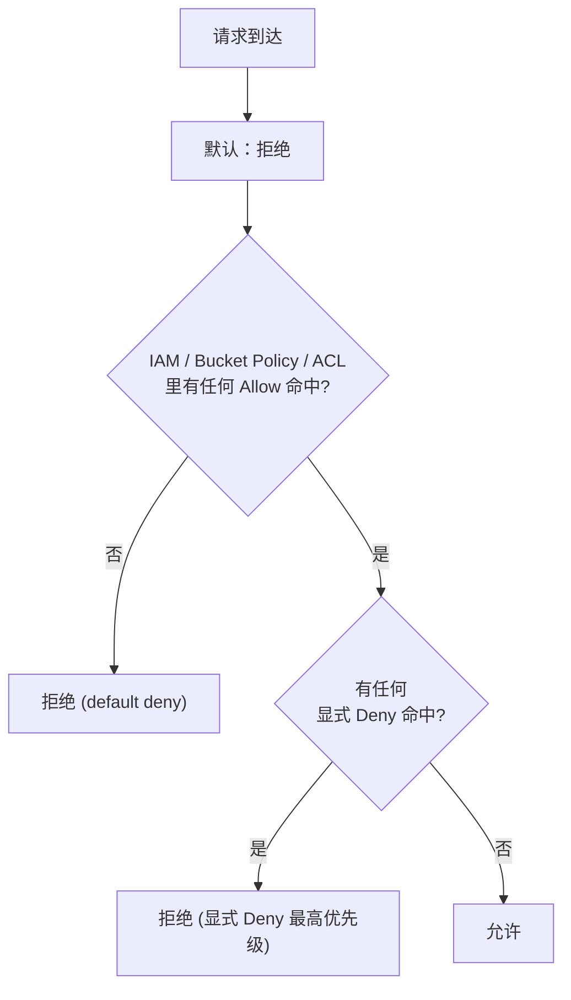
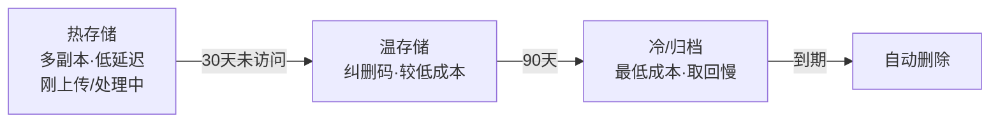
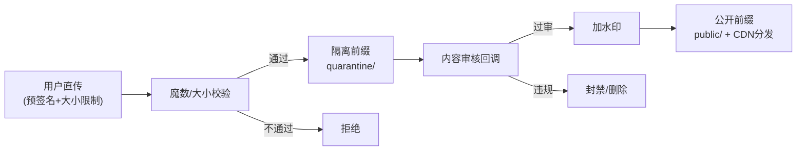

# 别让你的桶裸奔——安全策略与生产实践

> 属于 S9 对象存储 · 第四篇
> 上一篇：[S3 API 与 Go 实战](./S3-API与Go实战)
> 下一篇：[面试题集](./面试题集)

新闻里隔三差五就有一条："某公司 S3 桶配置错误，数千万用户数据在公网裸奔。" 对象存储的坑，几乎从不在"存不进去"，而在"**存进去了，但谁都能拿走 / 谁都能删 / 被人盗刷到破产**"。这一篇是整个专题的安全重头戏，六个板块层层设防：**权限最小化 → 预签名边界 → 加密 → 防盗刷 → 数据保护 → AIGC 校验**。每一块都给可落地的策略，不是喊口号。

## 一、权限：三层模型与最小权限

S3 的权限由三套机制叠加，理解它们的**优先级与合并规则**是安全的地基：

| 机制 | 作用对象 | 粒度 | 典型用途 |
|------|---------|------|---------|
| **IAM Policy** | 绑在"身份"（用户/角色）上 | 细 | "这个服务账号能读写 clips 桶" |
| **Bucket Policy** | 绑在"桶"上 | 中 | "这个桶的 public/ 前缀允许匿名只读" |
| **ACL** | 绑在桶/对象上（旧机制） | 粗 | 早期的 public-read，**现在建议禁用** |

### 1.1 鉴权决策：显式 Deny 永远赢

一个请求进来，系统把所有相关策略合并后按固定规则裁决：



两条铁律：

1. **默认拒绝**：没有任何 Allow 命中 → 拒绝。所以"忘了配权限"是安全的（拒绝），"配错成公开"才是危险的。
2. **显式 Deny 压倒一切**：任何一处出现匹配的 Deny，无论多少 Allow 都无效。这让你可以用一条"禁止公网访问 private/"的 Deny 兜底。

### 1.2 最小权限：只给刚好够用的

**最小权限原则（Least Privilege）** = 主体只拥有完成任务所必需的最小权限集，且范围（Resource）收到最窄。

反例（危险，别学）——给了全桶通配、还带写和删：
```json
{ "Effect": "Allow", "Action": ["s3:*"], "Resource": ["arn:aws:s3:::clips/*"] }
```

正例——CDN 只需读某前缀，那就只给读、且锁死前缀：
```json
{
  "Effect": "Allow",
  "Principal": {"AWS": ["*"]},
  "Action": ["s3:GetObject"],
  "Resource": ["arn:aws:s3:::clips/public/*"]
}
```

这正是配套练习 **`03_bucket_policy`** 的题目：给 `public/` 前缀下发匿名只读策略，然后**双向断言**——匿名访问 `public/logo.png` 得 200、访问 `private/secret.mp4` 被拒。三个收窄点缺一不可：

- `Action` 只给 `s3:GetObject`（只读，不给 List、不给写删）；
- `Resource` 用 `.../public/*` 把开放面锁死在这个前缀，`private/` 天然落在默认拒绝里；
- `Principal: *`（匿名）之所以敢用，正是因为 Resource 已经收窄到只读的公开前缀。

::: danger 裸奔桶事故的三个根因
① 图省事把整桶设成 public-read；② 用了通配 `s3:*` + `Resource: *` 的"上帝策略"；③ 关了 **Block Public Access** 这个总闸。生产铁律：**桶默认开启 Block Public Access（阻止公开访问）总开关**，只对确需公开的前缀用精确的 Bucket Policy 开一个小口，绝不整桶放开。
:::

## 二、预签名 URL 的安全边界

第三篇用预签名 URL 把后端从带宽里解放了出来。但预签名 URL 本质是**一张不记名的临时通行证**——签出去就管不住了，所以边界必须在签发时就卡死：

| 边界 | 做法 | 不做的后果 |
|------|------|-----------|
| **过期时间** | 上传/下载 URL 只给几分钟~几十分钟 | 签一天 = 一天内谁拿到都能用 |
| **限定方法** | 上传签 PUT、下载签 GET，各管各的 | 下载 URL 若能写，等于开放上传 |
| **限定大小** | 用带 `Content-Length-Range` 的 POST Policy | 不限大小 → 有人上传 100GB 塞爆你 |
| **限定类型** | POST Policy 里约束 `Content-Type` | 声明传图片却塞了个可执行文件 |
| **别发长期 AK** | 后端持密钥签发，**只把签好的 URL 给前端** | 长期 AccessKey 泄露 = 全盘沦陷 |

::: warning 面试常被追问
"预签名 URL 会不会被人拿去乱传乱下？"——答**签发时就把边界焊死**：短过期（分钟级）、方法单一（上传只签 PUT）、用 POST Policy 限制大小和 Content-Type，且**永远不把长期密钥下发到客户端**，客户端只拿到"针对这一个 key、这一种方法、这一小段时间"的一次性凭证。就算 URL 泄露，损失也被限制在"这个对象、这几分钟"。这就是"最小权限"在临时凭证上的体现。
:::

对更高安全要求的场景，用 **STS 临时凭据**替代长期 AK：后端向 STS 换一组"带权限边界、几十分钟就过期"的临时 AK/SK/Token 给客户端，客户端用它调 SDK，比裸发 URL 更灵活也更可控。

## 三、加密：传输中 + 静态存储

数据安全要盖住两个状态：**在路上（in transit）**和**躺在盘上（at rest）**。

- **传输加密**：客户端 ↔ 存储全程 **HTTPS/TLS**。第三篇代码里本地 MinIO 用了 `Secure:false`，**线上必须 `true`**，否则素材在公网明文裸传。
- **静态加密（SSE，Server-Side Encryption）**三种模式：

| 模式 | 密钥谁管 | 特点 |
|------|---------|------|
| **SSE-S3** | 存储服务自己管 | 最省心，开箱即用，够用于大多数场景 |
| **SSE-KMS** | 密钥管理服务（KMS） | 可审计、可轮转、可精细授权，合规首选 |
| **SSE-C** | **你自己管**密钥，每次请求带上 | 最大控制权，但密钥丢了数据就永久解不开 |

::: tip 实战经验
静态加密对读写代码**几乎透明**——上传时在 `PutObjectOptions` 里带上加密选项，下载时服务端自动解密，业务逻辑不用改。所以"默认给桶开 SSE"几乎是零成本的安全增益，合规要求高（涉及用户隐私素材）就上 SSE-KMS 拿审计和轮转能力。
:::

## 四、防盗刷与防盗链

素材在 CDN 上公开可访问，就会遇到两类"白嫖"：**盗链**（别人网站直接嵌你的素材 URL，蹭你的流量）和**盗刷**（恶意刷你的下载/回源，烧你的带宽账单）。

- **Referer 防盗链**：CDN 校验请求头 `Referer`，只放行来自自己域名的请求。简单但可伪造，作基础防护。
- **URL 签名鉴权（CDN 鉴权）**：给 CDN 的 URL 也加上带过期时间的签名（和预签名 URL 同思路），无有效签名的请求直接拒。这是主力手段。
- **限流限速**：对单 IP / 单用户的下载频次和速率设限，挡住暴力盗刷。
- **合理过期**：签名 URL、CDN 鉴权 URL 都给短过期，让泄露的链接很快作废。

::: warning 面试常被追问
"素材 URL 是公开的，怎么防止被盗刷带宽？"——答一套组合拳：**CDN 鉴权（带过期签名的 URL，无签名拒绝）为主，Referer 防盗链 + 单用户限流为辅，签名短过期兜底**。核心思想和预签名 URL 一致——**访问必须携带一张会过期的、验得了真伪的凭证**，把"公开可访问"收敛成"持凭证者短时可访问"。
:::

## 五、数据保护：版本、对象锁、生命周期

防的是"误删、恶意删、勒索加密"这类**数据完整性**威胁。

- **版本控制（Versioning）**：开启后，覆盖或删除对象不会真正抹掉旧数据，而是生成新版本 / 打删除标记，可回滚。AutoCut 反复生成成片时，版本控制让每一版都可追溯。
- **MFA Delete**：删除版本或关闭版本控制需二次 MFA 验证，挡住"凭据泄露后被批量删库"。
- **对象锁 / WORM（Write Once Read Many）**：对象在锁定期内**不可删、不可改**，连 root 也不行。用于合规留存、防勒索软件加密。
- **生命周期（Lifecycle）**：自动做两件事——**分层降本**（热存储 → 温 → 冷 → 归档，配合第二篇的多副本转纠删码）和**过期清理**（如"未完成的分片上传 7 天后自动 Abort""临时素材 30 天后删除"）。



::: tip 实战经验
生命周期规则里，**"未完成分片上传自动 Abort"** 常被忽略却很重要——第三篇提过分片上传失败会留下悬空分片，长期积累悄悄吃掉大量存储和钱。配一条 `AbortIncompleteMultipartUpload: 7 days` 兜底，是生产必备的"省钱规则"。
:::

## 六、AIGC 场景专属：上传校验、内容审核、水印

剪辑/GenAI 产品让用户直传素材，多出三道必须做的安全关卡：

### 6.1 上传校验：类型、大小、魔数

**永远不要信任客户端声明的文件类型**。`.jpg` 后缀和 `Content-Type: image/jpeg` 都可伪造。要校验：

- **大小**：预签名时用 POST Policy 限死上限，挡住塞爆存储的攻击；
- **魔数（Magic Number）**：读文件头几个字节判断真实类型（如 JPEG 以 `FF D8 FF` 开头、PNG 以 `89 50 4E 47` 开头），Go 里 `http.DetectContentType(head512)` 一把梭；
- **拒绝可执行/脚本**：素材桶只该有音视频图片，出现 `.exe`/`.sh`/`.html` 一律拒。

```go
// 上传回调里做魔数校验示例
head := data[:min(512, len(data))]
realType := http.DetectContentType(head) // 看真实内容而非后缀
if !strings.HasPrefix(realType, "image/") && !strings.HasPrefix(realType, "video/") {
    return fmt.Errorf("非法素材类型: %s", realType)
}
```

### 6.2 内容审核回调

上传成功后，通过**事件通知/回调**把 key 投递给审核服务（鉴黄、鉴暴、版权检测），审核通过才对外可见。**别让未审核素材直接可被公开访问**——审核前先放进"隔离前缀"，过审后再移动或改策略。

### 6.3 素材水印与溯源

对成片/预览加**可见或隐形水印**，既防盗用又能溯源到具体用户，配合上面的审核形成"上传—校验—审核—水印—分发"的完整素材安全链路。



---

## 串起来

对象存储的安全是**层层设防**而非单点：权限用三层模型 + 显式 Deny + Block Public Access 把开放面收到最小；预签名 URL 靠短过期、限方法、限大小、不下发长期密钥把临时凭证焊死边界；加密盖住传输中和静态两个状态；防盗刷用 CDN 鉴权 + 限流保护带宽；版本 / 对象锁 / 生命周期守住数据完整性与成本；AIGC 场景再叠上魔数校验、内容审核、水印溯源。记住那句话——**别让你的桶裸奔**：默认拒绝、精确开口、凭证短命、数据可回滚。

下一篇是**面试题集**：把 S9 全专题的核心考点——对象 vs 块/文件、multipart 为何存在、预签名原理与安全、纠删码 vs 多副本、桶权限与最小权限、强一致 vs 最终一致——整理成 6 道分层追问，帮你在面试里从"知道"讲到"讲透"。
