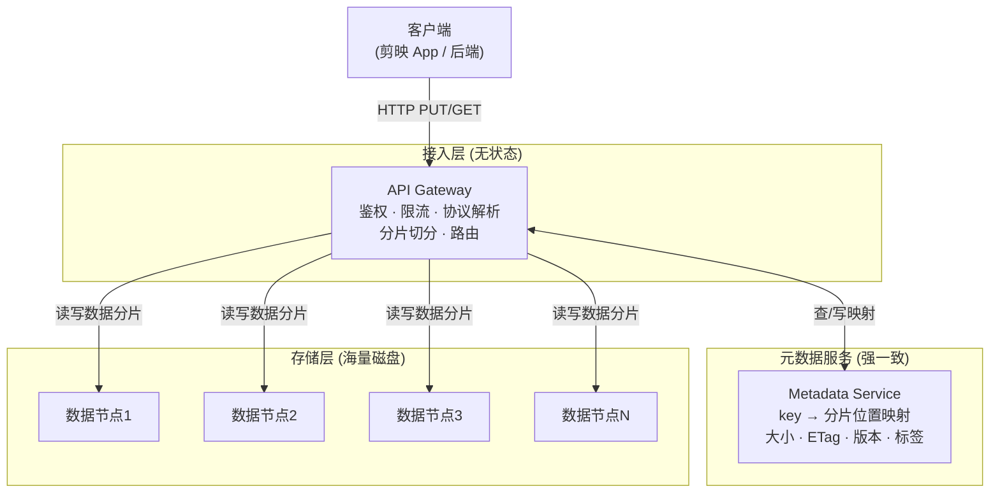
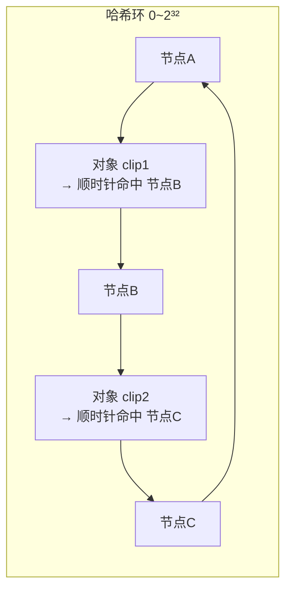
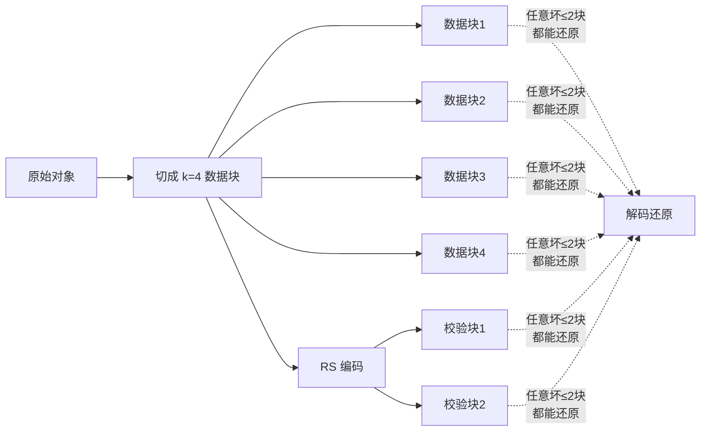
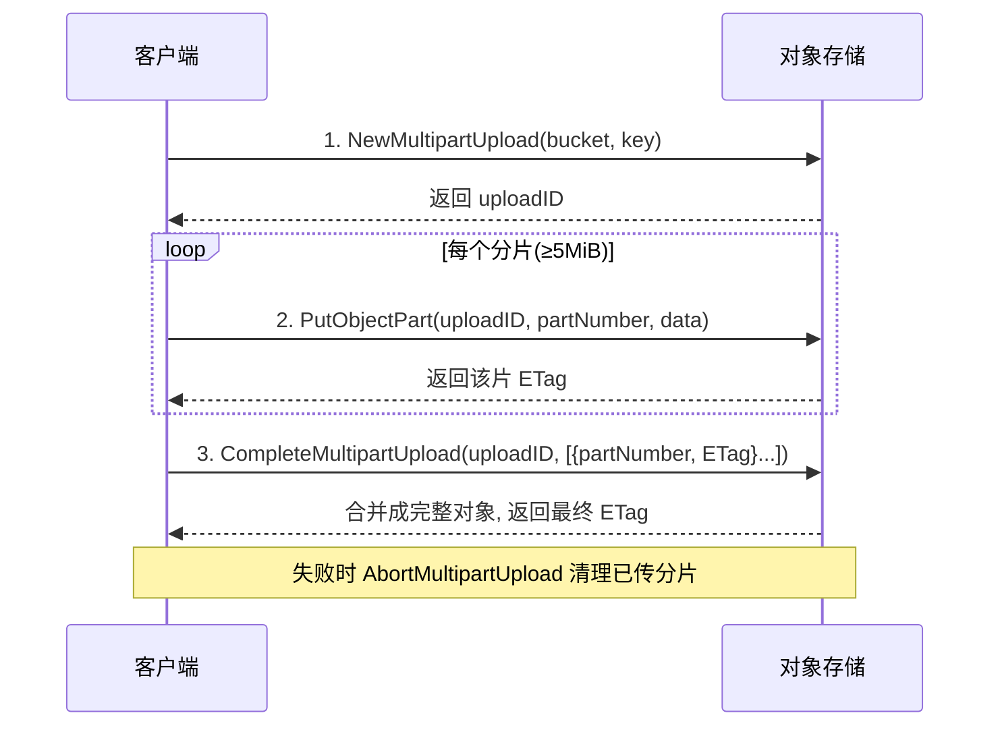

# 一个对象上传后，经历了什么？——架构与数据分布

> 属于 S9 对象存储 · 第二篇
> 上一篇：[为什么需要对象存储](./为什么需要对象存储)
> 下一篇：[S3 API 与 Go 实战](./S3-API与Go实战)

上一篇讲清了"对象存储是一个近乎无限的键值仓库"。但仓库内部不是魔法——当你把一段 500MB 的素材 PUT 进去，它在系统里被拆开、打散、冗余到几十块盘上，再在你 GET 时严丝合缝地拼回来。**这一篇拆解这个"黑盒"**：三层架构怎么分工、数据怎么分布、大文件怎么分片、冗余怎么选、一致性怎么保证。看懂了，你才知道后面写的每一行 SDK 代码，底层在替你做什么。

## 一、三层架构：接入层、元数据服务、存储层

几乎所有对象存储（S3、MinIO、TOS）都可以抽象成三层：

| 层 | 职责 | 特点 | 类比 |
|----|------|------|------|
| **接入层** | 鉴权、限流、协议解析、把大对象切分、路由到存储节点 | **无状态**，可水平扩展到任意多台 | 快递分拣中心的前台 |
| **元数据服务** | 记录 `key → 数据分片落在哪些节点`、大小、ETag、版本、用户标签 | 数据量小但**要求强一致**，是系统的大脑 | 仓库的货位账本 |
| **存储层** | 实际存放对象数据分片（bit） | 海量廉价磁盘，靠冗余保证不丢 | 一排排货架 |

**关键洞察**：元数据和数据本体是**分离**的。元数据小、要强一致、读写频繁——用一致性协议（如 Raft，见 S8）保护；数据本体大、写少读多——摊到海量磁盘上做冗余。这个"控制面 / 数据面分离"是分布式存储的通用范式。

::: tip 实战经验
面试里被问"对象存储怎么支撑百亿对象"，答题主线就是这张图：**无状态接入层解决并发扩展，元数据服务用强一致协议解决"账本不能错"，数据层用冗余编码解决"盘会坏但数据不能丢"。** 三层各自独立扩展，是它能同时做到"海量 + 高并发 + 高可靠"的根本原因。
:::

## 二、数据往哪台机器放？——一致性哈希

对象被切成分片后，接入层要决定"这片放哪个节点"。最朴素的做法 `hash(key) % N`（N=节点数）有致命缺陷：**一旦增删一台机器，N 变了，几乎所有对象的落点都变，触发全量数据迁移**——在 PB 级数据下这是灾难。

**一致性哈希**把节点和对象都映射到一个 `0 ~ 2³²` 的环上，对象顺时针找到的第一个节点就是它的归属：

- **增删节点只影响环上相邻的一小段对象**，迁移量从"全量"降到 `1/N`；
- 为避免数据倾斜（某节点分到过多），引入**虚拟节点**：每个物理节点在环上放几百个分身，让分布更均匀。

（一致性哈希的完整原理与代码，S8 分布式专题有更细的展开，这里只需理解它解决"扩缩容时的迁移放大"问题。）

## 三、冗余：多副本 vs 纠删码

盘一定会坏。对象存储靠冗余保证"坏几块盘也不丢数据"。两条主流路线：

### 3.1 多副本（Replication）

把对象完整复制 N 份（通常 3 份）放到不同节点/机架。

- ✅ 简单、读性能好（任一副本可读）、恢复快；
- ❌ **空间放大 = N 倍**：存 1TB 真实数据要占 3TB 盘。

### 3.2 纠删码（Erasure Coding, EC）

把对象切成 `k` 个数据块，再算出 `m` 个校验块，共 `k+m` 块摊到不同节点。**任意丢失 ≤ m 块都能恢复**原始数据（数学上是 Reed-Solomon 编码）。

以 `k=4, m=2`（记作 4+2）为例：

| 指标 | 多副本(3) | 纠删码(4+2) |
|------|-----------|-------------|
| **空间放大** | 3.0× | **1.5×**（6/4） |
| **可容忍坏块** | 2 个 | 2 个 |
| **恢复开销** | 拷贝一份即可，轻 | 需读 k 块重新解码，**CPU/网络重** |
| **小文件友好度** | 好 | 差（切块+校验有固定开销） |
| **适合** | 热数据、小文件、低延迟 | 冷数据、大文件、成本敏感 |

::: tip 实战经验（剪辑素材落地）
真实系统往往**分层混用**：用户刚上传、正在被 AutoCut 处理的**热素材**用多副本（低延迟、恢复快）；发布很久、几乎只偶尔回看的**冷成片**转纠删码（1.5× 比 3× 省一半以上成本）。生命周期策略自动在两者间迁移——这就是"用编码方式换成本"的工程艺术。
:::

::: warning 面试常被追问
"纠删码比多副本省空间，为什么不全用纠删码？"——答**恢复成本和延迟**：多副本坏了直接拷贝一份，纠删码坏一块要**读齐 k 块重新解码**，网络和 CPU 开销大得多，且小文件的切块/校验固定开销摊不平。所以热路径、小对象、低延迟场景仍用多副本，纠删码留给冷、大、成本敏感的数据。**没有银弹，只有权衡。**
:::

## 四、大文件怎么上传？——分片上传（Multipart）

一段几百 MB 甚至几 GB 的素材，若用一个 HTTP 请求整体 PUT，会遇到三个问题：**(1) 中途断网前功尽弃；(2) 单请求耗时长、超时风险高；(3) 无法并发提速**。

S3 的答案是**分片上传三步协议**：

三步的含义：

1. **NewMultipartUpload**：向服务端申请一次上传会话，拿到 `uploadID`（这次上传的身份证）；
2. **PutObjectPart**：把大文件切成若干片（除最后一片外**每片 ≥ 5MiB** 是 S3 硬性规定），逐片上传，每片返回一个 ETag；分片之间**互相独立**，可以并发、可以任意顺序；
3. **CompleteMultipartUpload**：把所有 `(partNumber, ETag)` 列表提交给服务端，服务端按 partNumber 排序合并成完整对象。

**断点续传**就建立在这套协议上：客户端记住 `uploadID` 和已成功的分片号，断网重连后只需 `ListParts` 查已传了哪些、续传缺的分片即可，不用从头再来。这对手机上传大素材的弱网环境是刚需。

::: tip 动手：手写分片上传协议
配套练习 **`code/backend/09-object-storage/01_multipart_upload`** 就是用 `minio.Core` 低层 API 手写这三步：`NewMultipartUpload → 循环 PutObjectPart → CompleteMultipartUpload`，把一段 12MiB 数据按 5MiB 切成 3 片上传，再断言合并回来的对象**字节完全一致、分片数正确**。下一篇会带你逐行实现它。跑测试前记得 `docker compose up -d minio`。
:::

## 五、一致性：GET 到的一定是最新的吗？

分布式系统绕不开一致性（S8 CAP 专题详述）。对象存储语境下有两种模型：

| 模型 | 含义 | 代价 |
|------|------|------|
| **强一致（Read-after-Write）** | PUT 成功后，任意后续 GET **立刻**读到最新内容 | 元数据要跨节点同步确认，写延迟略高 |
| **最终一致** | PUT 成功后，短时间内某些副本可能还读到旧值，一段时间后收敛一致 | 写快，但有"读到旧数据"的窗口 |

现代主流对象存储（S3 自 2020 年起、MinIO、TOS）对**单对象的 PUT/GET/DELETE 提供强一致**：写成功即可读到最新。但要注意边界——**跨对象的操作（如 List）、以及"删了立刻 List 还看得到"这类，可能仍是最终一致**。

::: warning 面试常被追问
"你上传素材成功后，下游 GenAI 流水线立刻去读，会不会读到旧的/读不到？"——答：**单对象读写在现代对象存储上是强一致的，PUT 返回成功后立刻 GET 一定读到这次的内容**，所以"上传成功回调 → 触发处理"是安全的。但如果流水线是靠 **List 桶来发现新对象**，List 可能有最终一致的延迟窗口，更稳的做法是**上传成功后主动投递一条消息/事件**（key 直接带过去）触发下游，而不是轮询 List。这体现了你懂一致性边界在业务上的落地。
:::

---

## 串起来

一个素材对象 PUT 进来，接入层鉴权限流后把它**切成分片**，用**一致性哈希**决定每片落哪台机器，存储层用**多副本或纠删码**做冗余保证不丢，同时**元数据服务**用强一致协议记下"这个 key 的分片都在哪"。GET 时反向而行：查元数据 → 定位分片 → 读回（必要时解码）→ 拼成完整对象。大文件走**分片上传三步协议**，天然支撑并发与断点续传；单对象读写是强一致的，让"上传成功即可用"成立。三层分离 + 冗余编码 + 分片协议，就是"海量、高并发、高可靠"的全部秘密。

下一篇讲**S3 API 与 Go 实战**：把这一篇的机制翻译成能跑的代码——用 `minio-go` 连接 MinIO、做基本 CRUD、亲手实现分片上传，并引出让客户端绕过后端带宽直传的**预签名 URL**。
