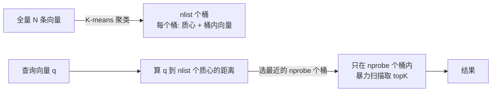
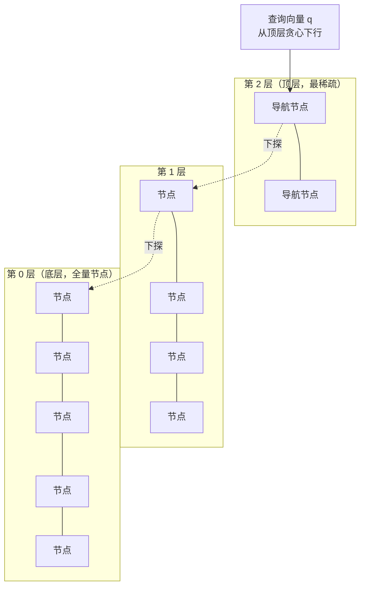
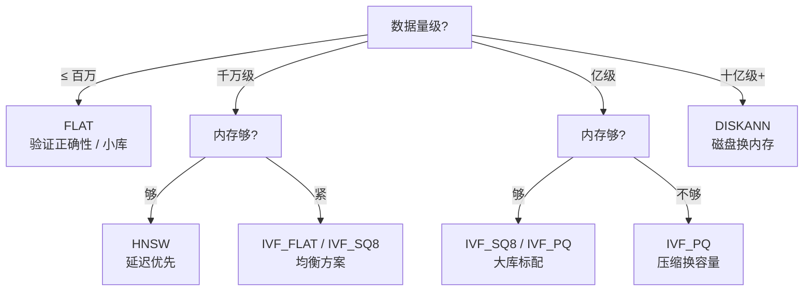

# 1 亿条素材，怎么在 100ms 内找到"夕阳下的海边"？—— 向量检索原理

> 属于 S10 向量数据库 Milvus · 第一篇
> 下一篇：[Milvus 架构与核心概念](./02-Milvus架构与核心概念)

假设你是剪映 AI 剪辑后端的一员。素材库里躺着 **1 亿条视频片段**，用户输入一句"夕阳下的海边"，产品要求在 **100ms 内**返回语义上最像的几十条。注意关键词是"语义上像"——用户并没有搜"海边"这两个字，他搜的是"画面里有一片海、天是橙红色的那种感觉"。

这时候你发现，MySQL 的 LIKE 查询废了，ES 的关键词倒排索引也废了：**用户根本没有输入任何关键词，你怎么匹配？** 而且就算能匹配，1 亿条数据要控制在 100ms 内，也不是"写个循环"能解决的。这一篇，就是把"感觉"变成可计算的东西，再把计算做到足够快的完整链路。

## 一、Embedding：把非结构化数据变成向量

视频、图片、文本、音频，这些**非结构化数据**没法直接进 SQL 比大小。深度学习模型（比如 CLIP 这类多模态模型）解决的就是这个问题：**把任意模态的内容映射成一个固定维度的浮点向量**（比如 768 维），这个过程叫 **Embedding（嵌入）**。

它最神奇的性质是：**语义相近的内容，向量在空间里也离得近**。"猫"和"猫咪"的向量挨在一起，"猫"和"汽车"的向量离得很远；一张"海边日落"的图和一句"夕阳下的海边"的文本，经过多模态模型映射后也会落在相近的区域——这正是跨模态语义检索（用文本搜视频）能成立的根本原因。

于是"找相似的片段"就变成了一个纯粹的几何问题：**给定一个查询向量，在 1 亿个向量里找距离最近的 k 个**。这就是**向量检索（Vector Search）**，也叫最近邻搜索（Nearest Neighbor Search, NNS）。

但这里藏着一个数学上的麻烦：**维度灾难（Curse of Dimensionality）**。维度越高，空间中数据越稀疏，各点之间的距离趋向于**趋同**——高维空间里"最近的点"和"最远的点"距离差越来越小，最近邻的区分度急剧下降。所以向量检索必须专门设计：既要对抗高维距离的退化，又要把 1 亿×768 的计算量压到 100ms 以内。

具体到剪辑场景，"一段视频怎么变成向量"通常走这条流水线（概念级，不用记死）：

1. **抽帧**：按固定间隔（如每秒 1 帧）从视频抽出若干帧图片；
2. **逐帧编码**：每帧送进视觉编码器（如 CLIP 的 ViT 分支），得到一个 768 维的帧向量；
3. **聚合**：把整段视频的所有帧向量做池化（平均/加权），得到**一个代表整段视频的向量**。

于是"夕阳下的海边"这句文本，用同一模型编码成向量后，会和"海边日落"类视频的向量落在相近区域——这就是用文本搜视频、用图搜视频的技术底座。注意一个关键工程点：**查询向量和库里的向量必须出自同一模型**（同一套语义空间），否则距离毫无意义。

::: tip 一句话记住
Embedding 的本质是**把"语义"编码成几何位置**——语义相近 ⇒ 空间距离近。向量检索的本质，就是在大规模高维空间里快速找最近邻。
:::

### 维度灾难到底"灾难"在哪

高维空间反直觉：在 1 维、2 维空间里，"距离"直觉清晰（两点之间直线最短），但维度到 100+ 后出现两个诡异现象：

- **体积爆炸**：边长为 1 的超立方体，半径 0.9 的内切超球体体积占比趋近于 0——所有点都"挤"在空间的边缘薄壳上，中间几乎是空的；
- **距离趋同**：维度越高，任意两点距离的方差越小，最近邻和最远邻的距离比趋向 1。意味着"最近的点"和"最远的点"越来越难区分，单纯靠欧氏距离判断"哪个更像"会失效。

这就是为什么现代向量检索普遍配合**归一化 + 专门度量**（见下一节），以及为什么工业界更偏爱余弦相似度（只比方向，天然压制维度灾难下"模长漂移"的干扰）。理解这一点，面试被问"为什么高维下欧氏距离不靠谱"才不会卡壳。

## 二、怎么度量"像不像"：三种相似度度量

两个向量离得多近，得有个度量标准。向量数据库里最常用的三种，面试必考：

| 度量 | 公式 | 越大/越小越相似 | 典型场景 |
|------|------|----------------|----------|
| **L2 欧氏距离** | $\sqrt{\sum_{i}(x_i-y_i)^2}$ | **越小**越相似 | 人脸特征、位置类特征，绝对数值有意义 |
| **IP 内积** | $\sum_{i} x_i \cdot y_i$ | **越大**越相似 | 向量已归一化、或模长本身有语义（如排序分） |
| **COSINE 余弦相似度** | $\frac{\sum_{i} x_i \cdot y_i}{\|x\|\|y\|}$ | **越大**越相似 | 文本语义检索（最常用） |

三个度量的关系要能脱口而出：

- **余弦只看方向，不看模长**。文本向量天然受长度影响（长文档的向量模长更大），余弦把模长除掉，只比"朝向"，所以文本语义检索默认用余弦；
- **L2 既看方向又看模长**，适合特征本身就包含"强度/大小"信息的场景（比如人脸特征里五官的"形状"）；
- **内积最敏感**：两个向量都不归一化时，模长大的向量内积天然占优，通常要求向量先做 **L2 归一化**（变成单位向量，$\|x\|=1$）再算内积。

**关键结论：向量做 L2 归一化之后，内积 ≡ 余弦相似度**（因为 $\|x\|=\|y\|=1$ 时分母就是 1）。这个等价关系在工程上极其常用：很多索引只优化内积计算，你把向量归一化后就能用内积代替余弦，既保精度又提速度。

::: warning 面试追问（连问三层）
**追问 1**：为什么文本检索用余弦而不是欧氏距离？—— 文本向量模长受文本长度影响，余弦只比方向，天然对长度不敏感。
**追问 2**：那什么时候该用内积？—— 向量已归一化的场景（内积=余弦但算得更快），或模长本身承载语义（如召回排序分）时，内积能保留模长信息。
**追问 3**：内积和余弦在"未归一化"时差在哪？—— 差一个"模长因子"：内积 = 余弦 × $\|x\|\cdot\|y\|$。模长大的向量内积虚高，导致检索偏向"长向量"，这正是要先归一化的原因。
:::

## 三、精确检索：FLAT 暴力扫描为什么不可行

最朴素的做法是**精确检索**：查询向量和库里每一条都算一遍距离，取最小的 k 个。这对应 Milvus 里的 **FLAT 索引**（全量暴力扫描）。算法上它是"最优"的——召回率 100%，一个都不漏。但代价是计算量 **O(N×D)**：N 条向量、每条 D 维。

来算一笔真实的账：1 亿条 × 768 维（float32）：

- 每算一条距离 ≈ 768 次乘加 ≈ **1536 次浮点运算**；
- 单次查询总计算量 ≈ 1亿 × 1536 ≈ **1.5×10¹¹ 次浮点运算 ≈ 150+ GFLOPs**；
- 单核 SIMD 浮点吞吐撑死几十 GFLOPs，**一条查询就要秒级**；要压到 100ms，需要 1.5 TFLOPs 级别的算力且多核并行；
- 更要命的是**内存带宽**：1 亿 × 768 × 4 字节 ≈ **307GB 原始数据**，按 100GB/s 的内存带宽读一遍就要 **3 秒**——算力再强，数据也"喂"不进来。

结论很硬：**暴力扫描在百万级勉强能玩，千万级已经吃力，亿级就是不可能**。这还是单条查询，真实业务 QPS 是几百上千，暴力扫描的算力和带宽需求直接爆炸。

把暴力扫描翻译成 Go 伪代码，你就能直观感受它有多"笨"——它的全部工作就是把每条向量都算一遍距离：

```go
// 暴力扫描：查询向量 q 与库中所有向量算距离，取 topK
// 复杂度 O(N×D)，N=1亿、D=768 时单次查询约 150+ GFLOPs
func bruteForce(q []float32, db [][]float32, k int) []int {
    type hit struct {
        id  int
        dist float64
    }
    all := make([]hit, 0, len(db))
    for i, vec := range db {           // 循环 1 亿次
        d := 0.0
        for j := 0; j < len(q); j++ {  // 内层再循环 768 次
            diff := float64(q[j]) - float64(vec[j])
            d += diff * diff
        }
        all = append(all, hit{i, d})
    }
    sort.Slice(all, func(a, b int) bool { return all[a].dist < all[b].dist })
    top := make([]int, 0, k)
    for i := 0; i < k; i++ {
        top = append(top, all[i].id)
    }
    return top
}
```

这代码没有任何"技巧"可言——它不会利用数据分布，也不会提前剪掉任何候选。**当数据量达到亿级，`for i := 0; i < len(db); i++` 这一行就是系统真正的瓶颈**，后面的所有 ANN 优化，本质都是在想方设法"少循环几次"。

## 四、ANN：用少量召回率换数量级的速度

既然精确检索算不动，工业界的一致选择是 **ANN（Approximate Nearest Neighbor，近似最近邻）**：**不保证每次返回绝对最优，但保证返回"足够好"的结果**。

核心权衡是**召回率 vs 速度**：精确检索召回率 100%，ANN 把召回率做到 90%~99%，换来 **10~100 倍**的速度提升。关键认知是——**工程上召回率 95% 和 99% 对业务体验差别往往不大，但延迟差一个数量级**。搜索、推荐、RAG 这类场景，返回结果里有一两条不是绝对最优，用户根本感知不到。

所有 ANN 算法本质上都在做同一件事：**提前构建一个"剪枝结构"，让查询只访问一小部分数据，而不是全部**。剪枝的路径各不相同，于是衍生出下面四种核心思想——它们是整个向量检索领域的地基，也是面试官最爱深挖的地方。

有一个必须建立的直觉：ANN 的"近似"来自**两个不同阶段**的近似——**建索引阶段的剪枝近似**（分桶、建图时已经损失了部分信息）和**查询阶段的贪心近似**（查询时没有穷尽所有可能路径）。理解这一点，后面调参（nprobe、ef）时就不会瞎调：**这两个参数本质上都是"查询阶段放宽多少剪枝"的旋钮**。

::: warning 面试追问（连问三层）
**追问 1**：ANN 的召回率 100% 意味着什么？—— 意味着结果和暴力扫描完全一致，即"这个近似算法在本次查询上没有损失"，通常只在数据规模很小时能达到。
**追问 2**：召回率怎么测才公平？—— 先跑一遍 FLAT 拿到标准 topK，再测 ANN 的 topK 与它的交集大小；注意要用**同一批查询集**统计平均，单条查询的召回没有统计意义。
**追问 3**：业务上"召回 95%"够吗？—— 取决于下游：检索式问答里召回 topK 后还会重排（rerank），前几位的精度比召回率更关键；而素材粗筛场景 90% 召回 + 高 QPS 往往是更优取舍。**没有绝对标准，只有业务目标下的权衡**。
:::

## 五、四种核心 ANN 思想

### 5.1 倒排/聚类：IVF（Inverted File）

**思想**：先把整个库"分桶"。用 **K-means** 把 N 条向量聚成 **nlist** 个簇（桶），记录每个簇的质心。查询时，先算查询向量到 nlist 个质心的距离，挑出最近的 **nprobe** 个桶，**只在桶内暴力扫描**：



复杂度从 O(N×D) 降到 **O(nlist×D + nprobe×(N/nlist)×D)**，查询量从"全部"变成"一小撮"。两个参数就是调优旋钮：

- **nlist**：建索引时定，桶的数量（Milvus 范围 1~65536）。nlist 越大桶越细，每个桶越小；
- **nprobe**：查询时定，扫多少个桶。nprobe 越大，扫的数据越多，**召回越高、延迟越高**——这是最典型的"召回率-延迟"滑动条。

IVF 是"粗剪枝"：它只负责**快速缩小候选集**，桶内的最终比较还是精确的。所以它是后续一切组合方案（IVF-SQ、IVF-PQ）的底座。

::: warning 面试追问（连问三层）
**追问 1**：加大 nprobe，召回率为什么不是线性上升？—— 因为相关向量在桶里的分布不均匀，热点桶提前被扫到后，再加大 nprobe 扫的多是无关桶，边际收益递减。
**追问 2**：nlist 为什么不能无限大？—— 桶太小，K-means 过拟合、质心区分度下降，而且 nlist 大意味着"算质心距离"这一步本身变贵，倒排的优势被吃掉。
**追问 3**：K-means 聚类本身要多久？—— 建索引是离线任务，几轮迭代扫描全量数据，亿级数据可能小时级；所以索引是**异步构建**的，不影响在线写入（后面讲 Milvus 时 indexnode 就干这个）。
:::

### 5.2 图：HNSW（Hierarchical Navigable Small World）

**思想**：借鉴**跳表（Skip List）+ 图**。把向量组织成**多层图**：底层包含所有节点（连接最密），越往上节点越稀疏，顶层只有极少几个"导航节点"。查询时从顶层入口出发，**逐层贪心**：在每一层沿着边走向离查询向量更近的邻居，走到局部最优后下探到下一层继续，直到最底层：



为什么能毫秒级？因为**层高约 log N**（1 亿条时 ln(1e8)≈18 层），每一层只需访问常数个节点（由参数 ef 决定），总访问节点数从 O(N) 降到 **O(log N) 量级——从 1 亿个变成几百个**。而且整个过程全部在**内存中做指针跳转**，没有任何磁盘 IO，所以单条查询轻松进毫秒级。参数三个：

- **M**（4~64）：每个节点的最大连接数（出度）。M 越大图越稠密，召回越高、建图越慢、内存越大；
- **efConstruction**（8~512）：建图时的候选队列长度，越大图质量越高、建图越慢；
- **ef**（1~32768）：**查询时**的候选队列长度，越大召回越高、越慢——又一个滑动条。

HNSW 的代价是**内存占用大**（图的邻接表开销可能超过向量本身）且**建图慢**，但换来的是目前公认最好的"延迟-召回"平衡，是中小规模（千万~亿级）场景的默认首选。

### 5.3 量化压缩：PQ（乘积量化）/ SQ8（标量量化）

**思想**：向量太占内存，那就**用"压缩表示"替代原始向量**，让同样内存装下更多数据，顺便加快距离计算。

**PQ（Product Quantization，乘积量化）**分两步。第一步**切分**：把 d 维向量切成 m 段子向量；第二步**建码本**：对每一段单独做 K-means，聚成 $2^{nbits}$ 个质心（码本），**每个子向量只存"它属于哪个质心"的 id**。于是一个 768 维向量变成了 m 个 id：

- 例：768 维 float32 = 3072 字节；取 m=96、nbits=8，则一个向量 = 96 个 id，**每个 1 字节，共 96 字节，压缩 32 倍**；
- 距离计算变成**查表（ADC）**：预先算出查询向量的每个子段到对应码本质心的距离表，查询时纯查表累加，比原始浮点距离计算快得多。

**SQ8（标量量化）**更简单粗暴：每个维度从 float32 直接量化成 **uint8**（0~255），内存**省 4 倍**，速度提升，精度损失很小（因为只是数值精度降低，没有结构破坏）。

两者对比：

| 维度 | SQ8 标量量化 | PQ 乘积量化 |
|------|-------------|-------------|
| 压缩方式 | 每维独立量化到 8bit | 分段聚类，用码本 id 表示 |
| 内存节省 | 4 倍 | 8~32 倍（取决于 m/nbits） |
| 精度损失 | 小 | 较大（质心近似） |
| 典型组合 | IVF_SQ8 | IVF_PQ（工业级大杀器） |

**IVF-PQ 组合**是亿级场景的标配：**IVF 负责"粗剪枝"把候选集从 1 亿缩到几千，PQ 负责在桶内"快算"距离**。先分桶再压缩，两个维度同时降本提速——后面 Milvus 的 `IVF_PQ` 索引就是这一套。

::: warning 面试追问（连问三层）
**追问 1**：PQ 为什么不直接用 PCA 降维？—— PCA 是全局线性变换，压缩到低维会丢局部结构；PQ 是分段非线性量化，每段保留自己的分布，精度保持更好，而且 PQ 的"查表算距离"天然适配 SIMD。
**追问 2**：PQ 压缩后还能直接算原始距离吗？—— 不能，算的是**近似距离**（用码本质心代替真实子向量）。这就是精度损失的根本来源：m 越小压缩越狠、质心离真实向量越远、误差越大。
**追问 3**：nbits 从 8 降到 4 会怎样？—— 每个子向量的码本从 256 个质心缩到 16 个，内存再省一半，但量化误差显著增大，召回明显下降。这是"内存-精度"的又一重权衡。
:::

### 5.4 磁盘索引：DISKANN / NSG

前面三种都要求**索引能装进内存**。数据大到百亿级、TB 级时（比如全网视频特征），内存装不下，怎么办？答案是把图结构留在内存、**向量本体放磁盘（SSD）**——这就是磁盘索引。

**DISKANN**（Vamana 图）的思路：构建一个"适合磁盘顺序读"的图索引，查询时用内存中的图结构导航，**需要比较的向量才从 SSD 按块读入**。Zilliz 工程实践给出的效果：**内存消耗约为 HNSW 的 1/10**，性能约为 HNSW 的 1/3~1/2，**千万级数据能做到 ~10ms 延迟**。**NSG**（Navigation Small World，导航小世界图）是同一思想族：用稀疏图 + 少量"导航点"加速，概念层面记住"用磁盘带宽换内存"即可。

本质权衡：内存索引贵但快，磁盘索引省内存但靠 SSD 带宽换延迟。适合"数据极大、内存有限、延迟要求相对放宽"的离线/大库场景（Milvus 的 `DISKANN` 索引，官方要求度量类型为 L2）。

## 六、评估指标与选型

聊完算法，得有一套**可量化的尺子**，否则"快"和"准"都是空话。四个指标面试必背：

| 指标 | 含义 | 怎么测 |
|------|------|--------|
| **Recall@k** | 返回的 top-k 与暴力精确结果的重合比例 | 先跑一遍 FLAT 得到"标准答案"，再测 ANN 命中率 |
| **QPS** | 每秒能处理多少条查询 | 压测工具打并发，看吞吐上限 |
| **latency（P99）** | 99% 的请求延迟不超过该值 | 看长尾——P99 比平均值更能暴露慢查询 |
| **内存占用** | 索引吃多少内存/能否装进内存 | 评估硬件成本与扩容压力 |

选型的本质是在"**召回率-延迟-内存**"三角里找平衡点。实战流程：**先定数据量级 → 再定内存预算 → 看延迟目标 → 反推召回要求 → 选索引**。比如：百万级验证正确性用 FLAT；千万级内存充裕要低延迟用 HNSW；亿级内存吃紧用 IVF_SQ8/IVF_PQ；十亿级以上直接 DISKANN。



选型之外还有两个容易被忽略的生产维度：

- **数据新鲜度**：写入后立刻要能查到（RAG 场景常见），就要选支持"增量数据可检索"的方案（Milvus 的 growing segment 就是为这个设计的，下一篇讲）；
- **过滤能力**：向量检索通常伴随标量过滤（`WHERE category='vlog'`），过滤逻辑做在"检索前"还是"检索后"，直接影响召回质量与性能——这也是 Milvus 这类向量数据库相比裸调 FAISS 的重要差异点。

六种索引一图流对比（Milvus 2.5 时代）：

| 索引 | 核心思想 | 内存占用 | 检索速度 | 召回精度 | 适用规模 | 关键参数 |
|------|---------|---------|---------|---------|---------|---------|
| **FLAT** | 暴力扫描 | 最大（原始数据） | 最慢 | 100% | ≤ 百万 | 无 |
| **IVF_FLAT** | K-means 分桶 + 桶内精确扫 | 原始 + 质心 | 快 | 高 | 百万~千万 | nlist / nprobe |
| **IVF_SQ8** | IVF + 标量量化 | 原始 1/4 | 快 | 中高 | 千万 | nlist / nprobe |
| **IVF_PQ** | IVF + 乘积量化 | 原始 1/8~1/32 | 很快 | 中 | 亿级 | nlist / nprobe / m / nbits |
| **HNSW** | 多层图贪心导航 | 大（含图结构） | **毫秒级** | 高 | 千万~亿 | M / efConstruction / ef |
| **DISKANN** | 磁盘图（SSD 换内存） | 极小（约 1/10） | 较快 | 中高 | 十亿级 | search_list |

::: tip 记忆锚点
四种 ANN 思想 = **四条剪枝路线**：IVF 按"空间区域"剪枝、HNSW 按"图路径"剪枝、PQ/SQ8 按"压缩表示"省内存、DISKANN 按"磁盘层级"省内存。面试答"为什么需要 ANN"，就答这四句话 + 一道 1 亿×768 的算力账。
:::

---

## 串起来

回到开头的场景：1 亿条素材找"夕阳下的海边"，完整链路是——**先靠多模态 Embedding 把每段视频变成 768 维向量（语义 → 几何）**，用**余弦相似度**度量"像不像"；暴力扫描 O(N×D) 在 1 亿规模下算不动（150+ GFLOPs + 307GB 带宽，秒级起步），所以必须用 **ANN**：用 IVF 分桶剪枝、用 HNSW 图导航做到毫秒级、用 PQ/SQ8 把内存压缩几倍到几十倍、数据大到内存放不下时上 DISKANN。最后用 **Recall@k / QPS / P99 / 内存**四把尺子，在"召回率-延迟-内存"三角里选型。

这些索引算法本身只是一堆库函数，真正的难点是**谁去管理这 1 亿条向量的写入、持久化、索引构建、并发查询、扩缩容**——这就需要一个专门干这事的系统。下一篇，我们讲**Milvus 架构与核心概念**：分布式向量数据库凭什么敢说自己能扛住亿级数据，它内部到底是怎么分工的。
