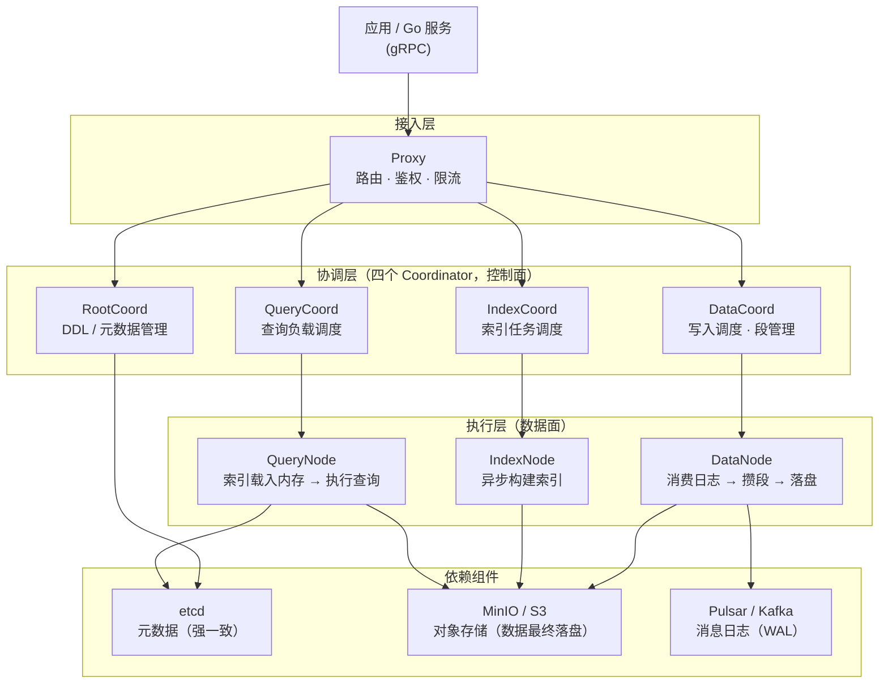
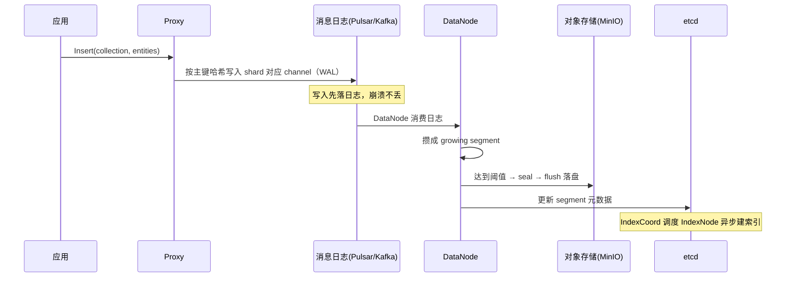
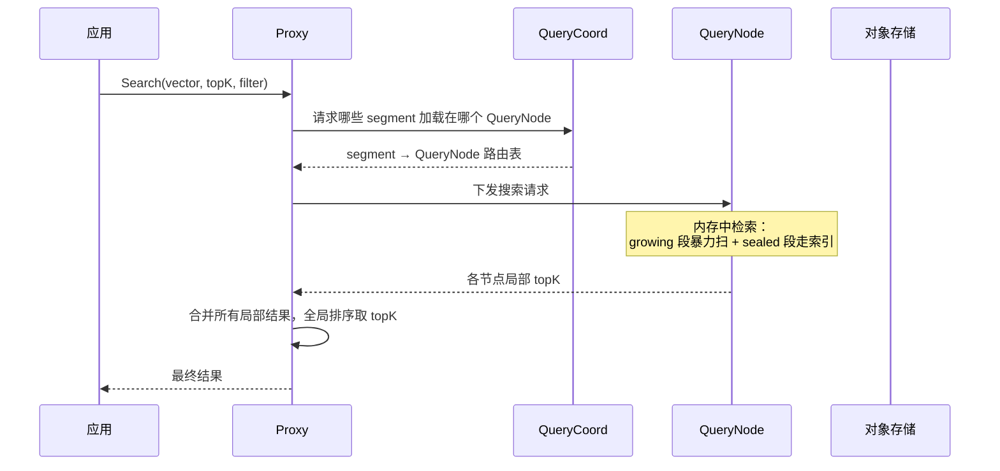

# 为什么有了 FAISS，还要造一个分布式向量数据库？—— Milvus 架构与核心概念

> 属于 S10 向量数据库 Milvus · 第二篇
> 上一篇：[向量检索原理](./01-向量检索原理)
> 下一篇：[Collection 设计与数据写入](./03-Collection设计与数据写入)

上一篇我们解决了"怎么算得快"——IVF 分桶、HNSW 建图、PQ 压缩，一套 ANN 下来单条查询能进毫秒级。但假设你是一个 AI 应用后端：**你的 RAG 知识库要支持文档问答，剪辑素材库要支持语义检索，向量规模从一万涨到一亿，还要保证数据不丢、并发不崩、随时扩容**——这时候你发现，调一个 ANN 库远远不够。

拿 FAISS 举例：它确实快，但它只是个**算法库**，不是数据库——进程重启内存清空，数据就没了；单机内存撑死几百 GB，没有分布式；没有主从、没有故障转移、没有权限管理。真要把它做成生产系统，你得自己写持久化、写 WAL、写分片、写副本、写扩缩容、写监控……这工程量堪比再造一个数据库。所以现实里的大厂（包括字节系）的选择是：**用专门的向量数据库**。这一篇就把行业最主流的开源方案——Milvus——讲透。

## 一、为什么需要独立的向量数据库

先看各种方案的定位，面试第一题经常是"你为什么不用 FAISS / ES / pgvector，而要用 Milvus？"：

| 方案 | 类型 | 持久化 | 分布式 | 向量能力 | 定位 / 短板 |
|------|------|--------|--------|----------|-------------|
| **FAISS** | 内存算法库 | ❌ 无 | ❌ 无 | 强（算法层面） | 单机原型、算法验证；重启丢数据，不面向生产 |
| **Elasticsearch** | 搜索引擎 | ✅ | ✅ | 弱（向量是插件，近邻精度/性能一般） | 关键词检索为主，向量只是辅助 |
| **pgvector** | PG 插件 | ✅ | 随 PG | 中 | 适合百万级、已有 PG 基础设施的小团队 |
| **Qdrant / Weaviate** | 专用向量库 | ✅ | ✅ | 强 | 中小规模好用的独立向量库 |
| **Milvus** | **分布式向量数据库** | ✅ | ✅ | **强 + 完整工程能力** | **亿级~百亿级生产场景的行业主流** |

关键判断标准就三条：**数据量级**（千万以内 pgvector 够用）、**是否要持久化与高可用**（要 → 上数据库，别裸调 FAISS）、**是否要水平扩展**（要 → 上分布式向量库）。Milvus 的定位很清晰：**面向大规模生产环境的开源分布式向量数据库**，由 Zilliz 团队主导开源，是 LF AI & Data 基金会孵化项目，被大量大厂用于 RAG 知识库、多模态素材检索等生产场景。

如果面试官追问"你自己用 FAISS 写一套到底缺什么"，把这张清单背下来——这就是向量数据库存在的全部理由：

| 能力 | 裸调 FAISS 的现状 | Milvus 提供 |
|------|------------------|-------------|
| **持久化** | 进程退出即丢，重启要全量重建 | 数据落对象存储，WAL 保证不丢 |
| **并发** | 你自己加锁/池化 | Proxy 无状态接入，天然并发 |
| **分布式** | 单机内存上限，亿级装不下 | Shard 分片 + QueryNode 水平扩展 |
| **高可用** | 节点挂 = 服务挂 | 副本 + 故障自动重加载 |
| **索引生命周期** | 全量重算、无法增量 | 增量 segment 自动建索引、自动合并 |
| **过滤** | 向量检索与标量过滤自己拼 | 向量 + 标量混合查询原生支持 |
| **运维** | 监控/备份/权限全自己写 | 内置可观测性与 RBAC |

Milvus 2.5 时代的能力清单（后面写代码时都会碰到）：支持**全文检索（BM25）与稀疏向量**（混检首选）、**多向量字段**（一个实体挂多个模态的向量）、**标量索引**（倒排索引/位图索引，加速过滤）、**null 值与默认值**、**迭代器**（分批取全量结果）等。对 Go 后端而言，Milvus 官方 SDK 就是 gRPC 客户端，接入成本极低——这正是本专题选它的原因。

## 二、分布式架构：六大组件 + 三个依赖

Milvus 是典型的**存算分离**架构，全图如下（这是整个章节最重要的一张图，建议能默画）：



### 2.1 六大组件各司其职

| 组件 | 职责 | 类比 |
|------|------|------|
| **Proxy**（代理） | 无状态接入层：接收 gRPC 请求、鉴权、限流、把读写请求路由到对应组件 | 网关 / 反向代理 |
| **RootCoord** | 管理 DDL（建集合、建分区）与全局元数据 | 元数据服务 |
| **DataCoord** | 调度数据写入：分配 segment、触发落盘/合并（compaction）、平衡写入负载 | 写入调度器 |
| **QueryCoord** | 决定哪些 segment 加载到哪些 QueryNode、处理查询的扩缩容 | 查询调度器 |
| **IndexCoord** | 调度索引构建任务给 IndexNode | 索引调度器 |
| **DataNode** | 消费消息日志（WAL），把增量数据攒成 segment 刷到对象存储 | 写入执行者 |
| **QueryNode** | 把 segment + 索引**加载进内存**，真正执行向量检索/标量过滤 | 查询执行者 |
| **IndexNode** | 离线异步构建索引（IVF/HNSW/PQ…） | 索引工坊 |

一句话记忆：**Proxy 是门卫，四个 Coordinator 是四个大脑（各自管一块调度），DataNode/QueryNode/IndexNode 是干活的工人**。控制面（Coordinator + etcd）和数据面（执行节点 + 对象存储）完全分离，这是整个架构的灵魂，下一节展开讲。

### 2.2 三个依赖组件

- **etcd**：存元数据（集合 schema、segment 状态、coordinator 选举），要求**强一致**，是整个系统的"大脑记忆"（etcd 本身的 Raft 原理见 S8）；
- **MinIO / S3**：对象存储，**向量数据和索引文件的最终归宿**——数据刷盘就是写到对象存储，所以理论上数据量只受对象存储容量限制；
- **Pulsar / Kafka**：消息日志，充当 **WAL（预写日志）+ 数据分发总线**：写入先落消息日志，DataNode 再从日志消费落盘。它既是"崩溃不丢数据"的保证，也是数据在组件间流动的通道。

## 三、存储与计算分离：架构的核心思想

为什么 Milvus 要把"存"和"算"拆开？对照 MySQL 那种"数据和计算绑在一台机器"的单体架构看就清楚了：

| 维度 | 传统单体（MySQL） | Milvus 存算分离 |
|------|------------------|-----------------|
| 扩容 | 加从库/分库分表，要搬数据 | **加 QueryNode 即可**，数据在对象存储里共享 |
| 读写 | 读写都压同一批节点 | **写入走 DataNode，查询走 QueryNode，互不阻塞** |
| 故障 | 节点挂 = 数据可能丢 | 计算节点随便挂，**数据在对象存储不会丢**，重启重新加载即可 |
| 成本 | 冷数据也要占计算节点内存 | 计算资源按需伸缩，存储走廉价对象存储 |

三个直接收益，面试要能一口气说出来：

1. **弹性扩缩容**：查询压力大了，加几个 QueryNode 把 segment 加载进去就完事——不用搬任何数据（segment 都在对象存储里）；
2. **读写分离**：写入路径（Proxy → 消息日志 → DataNode → 对象存储）和查询路径（Proxy → QueryNode）是两条独立的流水线，写得多不影响查得快；
3. **故障隔离**：QueryNode 崩了，数据毫发无损（在 MinIO 里），重启后从对象存储重新加载索引即可——这也是为什么"数据不丢"能成为 Milvus 的默认承诺，而不是靠单机磁盘。

::: warning 面试追问（连问三层）
**追问 1**：存算分离最大的代价是什么？—— 多一跳网络：查询节点要从对象存储**加载**数据/索引（首次加载慢），写入要先过消息日志再落对象存储，端到端延迟比单机内存方案多一层 IO。
**追问 2**：那怎么缓解"首次加载慢"？—— 加载是按 segment 维度的：QueryNode 预热（启动时预加载热 segment）、segment 按热度分层、以及副本机制让加载分摊到多节点——本质是**用"预加载 + 副本"对冲对象存储的访问延迟**。
**追问 3**：数据在对象存储里，查询时还要读对象存储吗？—— 不需要。**查询只发生在 QueryNode 内存中**（segment 已加载）；对象存储只负责"持久化"和"故障恢复"，不在查询热路径上——这正是它能做到毫秒级查询的原因。
:::

::: tip 记忆锚点
存算分离 = **数据（对象存储）是唯一真源，计算节点（Query/Data/Index）都是可随时替换的无状态工人**。etcd 记录"数据在哪、谁在加载"，Pulsar 保证"写入不丢"，MinIO 保证"数据永存"。
:::

## 四、核心数据概念：Collection 到底长什么样

向量数据库有自己的数据模型，和关系型数据库高度对应。先记七张"牌"：

| 概念 | 一句话 | 类比 MySQL |
|------|--------|-----------|
| **Collection（集合）** | 一组 Schema 相同的数据容器 | **表** |
| **Schema（模式）** | 定义集合有哪些字段、类型、约束 | 建表语句 |
| **Field（字段）** | 主键字段 / 向量字段 / 标量字段 / 动态字段 | **列** |
| **Entity（实体）** | 一条完整记录（一行数据） | **行** |
| **Partition（分区）** | 集合内的逻辑子集，按业务切（如按天/按用户） | 分区表 |
| **Segment（段）** | 存储与检索的最小物理单元 | 数据页 / 表文件 |
| **Shard（分片）** | 按主键哈希拆分的写入通道（基于消息日志） | 分库分表 |

逐个展开：

**Schema 与 Field**。建 Collection 前必须先定 Schema，关键字段四类：

- **主键字段**：唯一标识一条 Entity，类型 int64 或 string（可设置 auto_id 自动生成）；
- **向量字段**：存储 embedding，2.5 时代支持 `FLOAT_VECTOR`（最常用）、`BINARY_VECTOR`、`FLOAT16_VECTOR`、`BFLOAT16_VECTOR`、`SPARSE_FLOAT_VECTOR`（稀疏向量，配合 BM25 做全文检索）；
- **标量字段**：int/float/string/bool/json/array 等，用于查询时的**过滤条件**（如 `category == "vlog"`）；
- **动态字段（dynamic field）**：写入时带上 Schema 里没定义的字段，会被自动收进一个 `$meta` JSON 字段里——让"先写入、后定义"成为可能，是 2.x 的重要易用性改进。

**Entity** 就是一条行数据，即"主键 + 向量 + 若干标量字段"的组合。用 Go SDK 建一个"视频素材"集合的 Schema（概念级，只展示字段类型，下一篇会完整实现）：

```go
// 概念级示意：一个"视频素材"集合的 Schema
schema := &entity.Schema{
    CollectionName: "video_clip",
    Description:    "AI 剪辑素材库",
    Fields: []*entity.Field{
        {Name: "id", DataType: entity.FieldTypeInt64, IsPrimaryKey: true, AutoID: true},            // 主键
        {Name: "embedding", DataType: entity.FieldTypeFloatVector, TypeParams: map[string]string{   // 向量字段
            "dim": "768",
        }},
        {Name: "title", DataType: entity.FieldTypeVarChar, TypeParams: map[string]string{           // 标量字段(可过滤)
            "max_length": "256",
        }},
        {Name: "duration", DataType: entity.FieldTypeFloat},                                          // 标量字段
    },
    EnableDynamicField: true, // 开启动态字段：未预定义的写入字段自动进 $meta
}
```

这段代码把上一节的所有概念落到了实处：`id` 是主键字段、`embedding` 是向量字段、`title`/`duration` 是标量字段、`EnableDynamicField: true` 打开动态字段——一个 Collection 的"长相"就是由 Schema 决定的。

**Partition 与 Segment** 要分清两个层级：

- **Partition 是逻辑层**：把集合按业务切成子集（如 `2024-01`、`user_123`），查询时指定 partition 可以**只扫命中分区**（分区裁剪），写入时也可以按 partition 隔离（配合 partition key 做多租户隔离）；
- **Segment 是物理层**：数据真正落盘的基本单元。写入的数据先落在 **growing segment**（内存中、可被查询但未落盘），攒够大小/超时后**封存（seal）成 sealed segment** 刷到对象存储，之后由 IndexNode 构建索引、QueryNode 加载。一个 Collection 的数据由海量 segment 组成，segment 之间彼此独立，天然适合并行查询与分布式放置。

**Shard（分片）**：一个 Collection 默认 **2 个 shard**（可配置，范围 1~64），每个 shard 对应消息日志里的一个 **channel**（类似 Kafka topic 的一个分区）。写入时按**主键哈希**决定进哪个 shard，写入流水线并行处理互不阻塞——这是 Milvus 写吞吐能横向扩展的底层机制。

### 与 MySQL 概念对照表

| MySQL | Milvus |
|-------|--------|
| 数据库 / 实例 | Milvus 集群（cluster） |
| 表（table） | **Collection** |
| 行（row） | **Entity** |
| 列（column） | **Field** |
| 主键 | 主键字段（int64/string，唯一） |
| 索引（B+ 树） | **向量索引**（FLAT/IVF/HNSW/DISKANN）+ **标量索引**（倒排/位图） |
| 分区表 | **Partition** |
| 数据页 / 表文件 | **Segment** |
| 分库分表 | **Shard**（channel） |
| 建表语句 | **Schema** |

::: warning 面试追问（连问三层）
**追问 1**：Segment 和 Shard 是什么关系？—— 维度不同：Shard 是**写入并行的逻辑分片**（消息日志通道），Segment 是**存储与检索的物理单元**；一个 shard 的数据会被切成很多个 segment，两者是"一个逻辑通道里产出多块物理数据"的关系。
**追问 2**：为什么查询要先指定 partition？—— 分区裁剪：只扫命中的分区，省掉全集合扫描。对应 MySQL 的"分区裁剪"，是数据量上来之后第一级过滤优化。
**追问 3**：growing segment 和 sealed segment 查询时差别在哪？—— growing segment 还在内存、未建索引，查询时**暴力扫描**；sealed segment 已落盘建好索引，查询走索引。所以"写入后立刻查"结果准但慢（走暴力），数据封存后查询性能才完全体。
:::

## 五、一条数据从写入到查询，全流程走一遍

把组件和概念串起来，看两条主流程（概念级，时序图请对着理解）。

### 5.1 写入流程：WAL → DataNode → 对象存储



写入路径的关键点：**先写日志（WAL）、后落盘**——和 MySQL 的 redo log 同一哲学。应用收到"写入成功"时数据其实还在消息日志里，即使 DataNode 当场崩溃，日志还在，重新消费即可恢复，**一条都不丢**。索引构建完全异步，不影响写入返回的延迟。

### 5.2 查询流程：Proxy → QueryNode → 合并返回



查询路径的关键点：**所有计算都在 QueryNode 的内存里完成**（segment 和索引预先加载），所以查询极快；单个 QueryNode 内存不够就分片加载到多个节点，各节点算完局部 topK，由 **Proxy 做全局归并**——这就是"分布式检索 = 分片搜索 + 归并排序"的标准范式（和 ES 的 query-then-fetch 同构）。QueryNode 挂了，etcd 里的元数据还在，QueryCoord 重新调度别的节点从对象存储加载，服务自动恢复。

---

## 串起来

Milvus 的整个设计可以浓缩成一句话：**它把"向量检索"做成了像 MySQL 一样可靠、像 ES 一样可扩展的数据库服务**。底层是上一篇讲的 ANN 算法（FLAT/IVF/HNSW/PQ/DISKANN），上层是**存算分离的分布式架构**——Proxy 接入、四个 Coordinator 调度、DataNode 写 / QueryNode 查 / IndexNode 建索引、etcd 管元数据、MinIO 存数据、Pulsar/Kafka 当 WAL。数据模型上，**Collection（表）/ Schema（建表）/ Entity（行）/ Field（列）/ Partition（分区）/ Segment（数据页）/ Shard（分片）** 一套概念与 MySQL 严丝合缝地对齐。

下一篇进入实战：**Collection 设计与数据写入**——用 Go 写一个真实的 RAG 素材库：Schema 怎么设计（主键选 int64 还是 string？向量字段用哪种类型？要不要开动态字段？）、数据怎么写进去、Shard/Partition 怎么规划，把这套架构真正跑起来。
