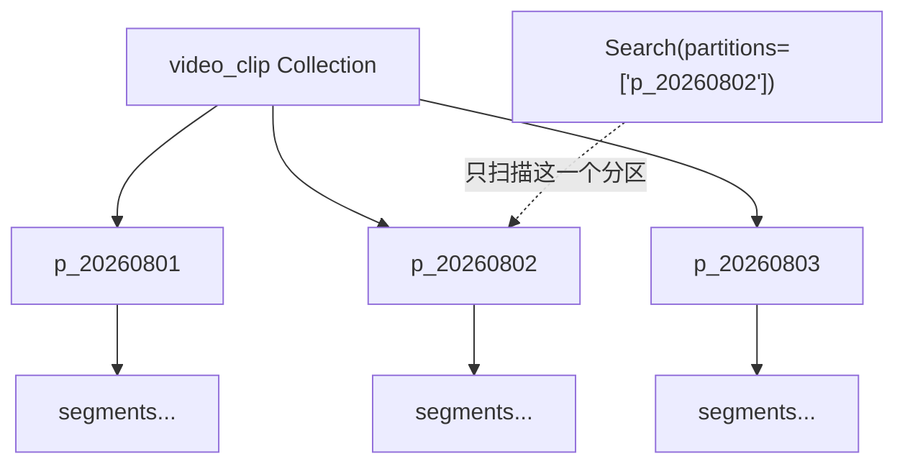
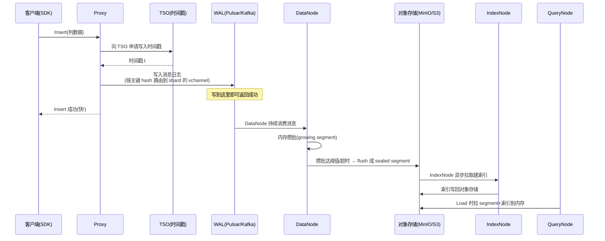
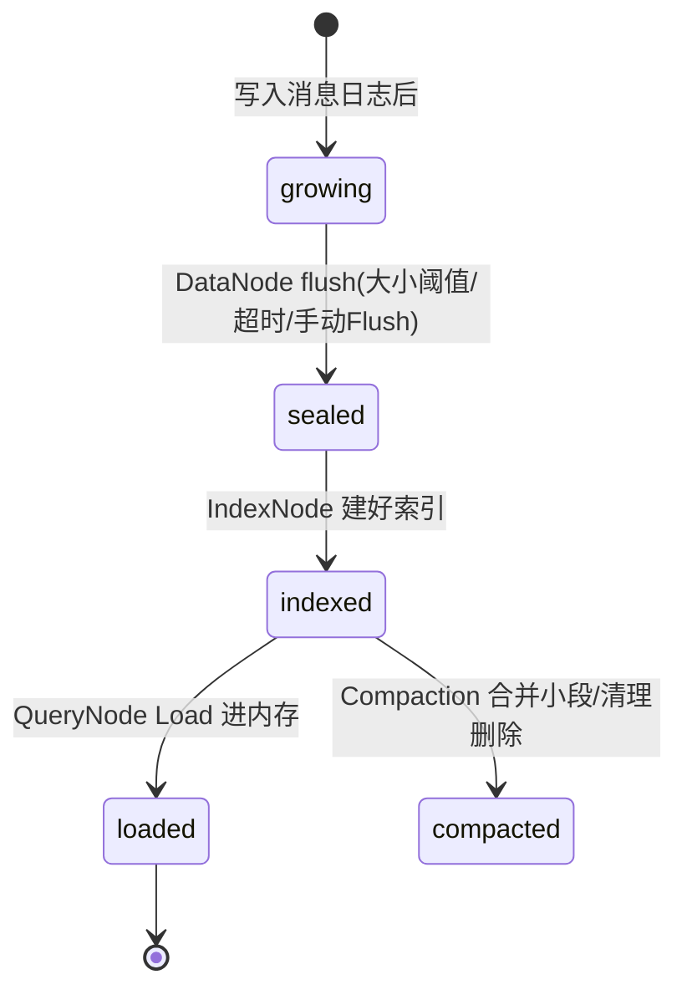

# 给"视频素材语义检索"建表，字段怎么定？—— Collection 设计与数据写入

> 属于 S10 向量数据库 Milvus · 第三篇
> 上一篇：[Milvus 架构与核心概念](./02-Milvus架构与核心概念)
> 下一篇：[向量索引与检索](./04-向量索引与检索)

假设你接手剪映 AI 剪辑的素材库检索：用户输入"夕阳下的海边跑步"，要在千万条视频片段里召回语义最像的 Top-10。第二篇讲过，Milvus 用 Collection 存数据，但**表结构怎么设计**——主键用自增还是 UUID？向量字段多少维？标签、时长、是否公开这些字段怎么放？要不要开动态字段？——这一篇全部讲透，并沿着"数据写入"把**一条素材从客户端到落盘**的完整链路走一遍，最后回答一个最关键的问题：**写进去之后，到底什么时候能查得到？**

> 本文全程以 Milvus 2.5.x 为准，Go SDK 用 `github.com/milvus-io/milvus-sdk-go/v2`（与第七篇实战代码同一套 API，本篇侧重"为什么这么设计"，第七篇侧重"怎么跑起来"）。

## 一、Schema 设计：一张"表"由四类字段组成

Collection 的 Schema 就是"建表语句"，它声明四件事：**主键、向量字段、标量字段、是否开动态字段**。

### 1.1 主键：int64 自增还是 varchar？

Milvus 主键只支持两种类型：**INT64 或 VARCHAR**（SDK 层强制校验，别的类型直接报错）。怎么选，看业务 ID 从哪来：

| 方案 | 写法 | 优点 | 缺点 | 适用 |
|------|------|------|------|------|
| **int64 自增** | `WithDataType(FieldTypeInt64).WithIsPrimaryKey(true).WithIsAutoID(true)` | 紧凑（8 字节）、无中心化 ID 生成器、插入时按主键 hash 均匀分布到各分片 | ID 无业务含义，关联业务表要额外映射 | **内部主键（默认推荐）** |
| **业务 varchar** | `WithDataType(FieldTypeVarChar).WithIsPrimaryKey(true).WithMaxLength(64)` | 直接用素材 ID / UUID，省一次映射 | 占内存更大（字符串比 8 字节大得多）、随机字符串导致写入分布不均 | 业务已有全局唯一 ID，如 `material_8f3a…` |
| **UUID 塞 varchar** | 同上，值填 UUID | 全局唯一、无需中心化 | 36 字符每行都存、哈希分布打散写入局部性、过滤/排序无意义 | 不推荐，除非上游只有 UUID |

关键结论：**推荐"内部 int64 自增主键 + 业务 ID 独立放一个 varchar 字段"**——业务 ID 需要按 ID 反查时，给该 varchar 字段建标量索引即可（第四篇讲），主键保持 8 字节紧凑。还有个反直觉点：自增主键插入时在 shard 间是**按主键 hash 路由**的（见第四节），所以不存在 MySQL 那种"自增主键写热点"问题。

### 1.2 向量字段：维度是"写死"的，选错全重来

向量字段用 `FieldTypeFloatVector`，必须指定 `Dim`：

```go
entity.NewField().WithName("embedding").
    WithDataType(entity.FieldTypeFloatVector).
    WithDim(1024) // 由 embedding 模型决定，建表后不可改
```

维度怎么定？**跟着你的 embedding 模型走**——CLIP ViT-L/14 是 768 维，OpenAI `text-embedding-3-large` 是 3072 维，剪映系多模态模型常见 512/768/1024。维度一旦建表就固定，**换模型 = 换维度 = 必须重建 Collection**，所以选型时先用小样本跑通模型再定表。维度还直接决定成本：float32 每个维度 4 字节，**1024 维一条向量 = 4KB**，1 亿条就是 400GB 的裸向量——所以第四篇的量化索引（IVF_SQ8/PQ）才那么重要。

补充两点：Milvus 2.5 还支持 `BINARY_VECTOR`（二进制向量，8 维挤 1 字节，配 HAMMING/JACCARD 距离）和 `SPARSE_FLOAT_VECTOR`（稀疏向量，配 IP/BM25 做关键词召回）；一个 Collection 默认最多 **4 个向量字段**（配置 `proxy.maxVectorFieldNum` 可放宽到 10），多向量字段是第四篇混合检索的前提。

### 1.3 标量字段：int / string / bool / JSON

标量字段用于"过滤"，就是 MySQL 的普通列。常用四类：

| 类型 | 示例字段 | 注意 |
|------|---------|------|
| `FieldTypeInt64` | `duration_ms`（时长）、`likes`（点赞） | 数值过滤、范围过滤 |
| `FieldTypeVarChar` | `title`、`tag` | **必须给 `WithMaxLength`**，否则 SDK 报错 |
| `FieldTypeBool` | `is_public`（是否公开） | 布尔过滤 |
| `FieldTypeJSON` | `extra`（扩展属性） | 任意 JSON，可用 `JSON_CONTAINS` 等表达式过滤（第四篇） |

### 1.4 动态字段：未预定义的字段自动进 `$meta`

Schema 外的字段想照单全收？开动态字段：`schema.WithDynamicFieldEnabled(true)`。此后所有**未在 Schema 里定义**的字段，会自动收进一个保留的 JSON 字段 **`$meta`**（也叫 dynamic field），并且 `$meta` 里的 key 也能参与过滤。

```go
schema := entity.NewSchema().
    WithName("video_clip").
    WithDescription("视频素材语义检索").
    WithDynamicFieldEnabled(true) // 未定义字段进 $meta，而不是报错
```

**取舍**（面试高频）：

| 维度 | 全预定义（不开动态） | 开动态字段 |
|------|---------------------|-----------|
| 灵活性 | 字段变了要改 Schema（`AlterCollection` 或重建） | 字段随便加，写入零阻塞 |
| 过滤性能 | 预定义标量字段可建索引（inverted/bitmap） | `$meta` 里的 key 过滤走 JSON 路径，性能与类型校验都打折 |
| 类型安全 | 强（写错类型 SDK/服务端报错） | 弱（`$meta` 是 JSON，全靠自觉） |
| 典型场景 | 核心检索链路（tag、duration 天天用来过滤） | 埋点、AB 实验、边缘属性 |

一句话原则：**核心过滤字段必须预定义并建标量索引；边缘、多变字段扔 `$meta`**。全开动态字段一时爽，查询慢的时候火葬场。

::: warning 面试追问（3 层）
**Q1：主键为什么推荐 int64 自增？**——紧凑、无中心化生成器、写分布均匀；业务 ID 单独放字段建索引即可。
**Q2：那 UUID 当 varchar 主键有什么问题？**——36 字符每行都存，内存膨胀；随机字符串打散写入顺序；且 varchar 主键过滤要配标量索引才有性能。
**Q3：如果业务要求"按用户 ID 分区隔离查询"，主键怎么设计？**——主键保持 int64 自增，用户 ID 单独做字段并设为 **Partition Key / Clustering Key**（下节讲），让 Milvus 按用户自动路由分片，而不是把用户 ID 塞进主键。
:::

## 二、建 Collection 的完整 Go 流程

一条龙：**NewClient → CreateCollection → CreateIndex → LoadCollection**。这才是生产里"建表"的全部动作——只 `CreateCollection` 不建索引、不 Load，数据进得去但**查不了/查不快**（原因见第五节、第四篇）。

```go
package main

import (
	"context"
	"log"

	"github.com/milvus-io/milvus-sdk-go/v2/client"
	"github.com/milvus-io/milvus-sdk-go/v2/entity"
)

func main() {
	ctx := context.Background()

	// 1) 连接：Config.Address 是 proxy 的 gRPC 地址
	c, err := client.NewClient(ctx, client.Config{Address: "localhost:19530"})
	if err != nil {
		log.Fatalf("连接失败: %v", err)
	}
	defer c.Close()

	// 2) 定义 Schema
	schema := entity.NewSchema().
		WithName("video_clip").
		WithDescription("视频素材语义检索").
		WithField(entity.NewField().
			WithName("id").WithDataType(entity.FieldTypeInt64).
			WithIsPrimaryKey(true).WithIsAutoID(true)). // 内部自增主键
		WithField(entity.NewField().
			WithName("material_id").WithDataType(entity.FieldTypeVarChar).
			WithMaxLength(64)). // 业务素材 ID
		WithField(entity.NewField().
			WithName("embedding").WithDataType(entity.FieldTypeFloatVector).
			WithDim(1024)). // 与 embedding 模型对齐，建表后不可改
		WithField(entity.NewField().
			WithName("title").WithDataType(entity.FieldTypeVarChar).
			WithMaxLength(512)).
		WithField(entity.NewField().
			WithName("duration_ms").WithDataType(entity.FieldTypeInt64)).
		WithField(entity.NewField().
			WithName("is_public").WithDataType(entity.FieldTypeBool)).
		WithField(entity.NewField().
			WithName("extra").WithDataType(entity.FieldTypeJSON)).
		WithDynamicFieldEnabled(true) // 边缘属性进 $meta

	// 3) 建 Collection：第二个参数是分片数（shard 数，对应写入并行度）
	if err := c.CreateCollection(ctx, schema, 2); err != nil {
		log.Fatalf("建集合失败: %v", err)
	}

	// 4) 建向量索引（HNSW，M=16, efConstruction=200；详见第四篇）
	idx, err := entity.NewIndexHNSW(entity.COSINE, 16, 200)
	if err != nil {
		log.Fatal(err)
	}
	// async=false：同步等索引建完；生产大表建议 true 异步构建
	if err := c.CreateIndex(ctx, "video_clip", "embedding", idx, false); err != nil {
		log.Fatalf("建索引失败: %v", err)
	}

	// 5) Load：把数据+索引加载进 QueryNode 内存，之后才能查询
	if err := c.LoadCollection(ctx, "video_clip", false); err != nil {
		log.Fatalf("加载失败: %v", err)
	}
}
```

::: tip 连接方式的小坑（关于 `client.WithURI`）
Go SDK v2 里**没有 `client.WithURI(...)` 这个函数**——官方推荐写法是 `client.NewClient(ctx, client.Config{Address: "localhost:19530"})`，带 URI 的变体叫 `client.NewDefaultGrpcClientWithURI(ctx, "localhost:19530", "", "")`。别把 Python SDK 的 `MilvusClient(uri="http://...")` 写法照搬进 Go——Go 侧是 `Config` 结构体，鉴权后还要填 `Username/Password`，多租户填 `DBName`。
:::

## 三、分区 Partition：按业务维度切"子表"

Partition 是 Collection 之下的逻辑分组，**数据必须属于某个分区**（默认进 `_default` 分区）。

- **为什么分**：检索时可指定 `partitions` 参数，**只扫描目标分区**，扫描量从"全库"变成"一个桶"。比如按日期分区，用户搜"上周的素材"，只扫上周那个分区；按用户分区，只扫该用户分区——这才是分区最大的价值：**查询裁剪（partition pruning）**。
- **和 MySQL 分区类比**：MySQL 的 `PARTITION BY RANGE(id)` 也是"逻辑一张表、物理多块"，SQL 优化器按分区裁剪（partition pruning）跳过无关分区。两者思路完全一致：**用物理切分换查询裁剪**。区别是 Milvus 的分区是显式 API（`CreatePartition`/指定 `partitionName` 写入），而且分区内外的检索都要先 Load。
- **2.2.9+ 的 Partition Key**：不想手动指定分区？给字段加 `WithIsPartitionKey(true)`，Milvus 按该字段值**自动 hash 路由到分区**（如 `user_id` 作 partition key），检索时表达式中带 `user_id == xxx` 即可自动只查对应分区，省去业务方自己维护分区名。
- **2.4+ 的 Clustering Key**：更进一步，按标量字段把数据"聚簇"到 segment 内（配合聚类压缩，见第五篇），实现更细粒度的剪枝。



```go
if err := c.CreatePartition(ctx, "video_clip", "p_20260802"); err != nil { /* ... */ }
// 检索时指定分区，其余分区完全不碰
sr, err := c.Search(ctx, "video_clip", []string{"p_20260802"}, /* ... */)
```

::: warning 面试追问（3 层）
**Q1：分区一定能加速查询吗？**——能，但前提是**按查询条件选对分区维度**；分区维度和查询条件对不上，指定分区反而写死扫描范围、甚至漏数据。
**Q2：分区能替代标量索引吗？**——不能。分区是粗粒度物理裁剪（到分区粒度），标量索引是分区内的细粒度过滤（到行粒度），两者是叠加关系。
**Q3：百万级 partition key 值（如用户数 1 亿）适合用 Partition Key 吗？**——不适合，分区数过多会放大元数据和调度开销；高基数场景用 Clustering Key 或标量索引更合适。
:::

## 四、数据写入全链路：为什么"先写日志，再慢慢落盘"

一条素材写进来，经历的不是"存文件"，而是四段接力：



四步各自的职责：

1. **Proxy（接入/校验）**：校验字段、给每条写入向 **TSO（Timestamp Oracle）** 申请全局单调递增时间戳——这个时间戳是第五篇一致性的地基；
2. **WAL（消息日志）**：写入按**主键 hash 路由到某个 shard**（每个 shard 对应一个 vchannel，映射到 Pulsar/Kafka 的物理 channel）。**消息进日志即返回成功**；
3. **DataNode（攒批落盘）**：后台消费 WAL，在内存里攒批，达到大小阈值/超时后一次性 flush 成 segment 写到对象存储；
4. **IndexNode（异步建索引）+ QueryNode（加载服务查询）**：索引异步构建，Load 后查询节点才提供检索。

**为什么"先日志后落盘"？**——把"必须同步完成的写"压到最短：写 Pulsar/Kafka 是一次网络往返（且消息日志本身多副本），对象存储的批量写被异步化，攒成几百 MB 的大 segment 一次写，IO 效率远高于逐条写小文件。这和 MySQL 的 **redo log WAL + 组提交**是同一个思想：**先写顺序追加的日志拿 ack，把随机/批量 IO 挪到后台**。代价是"日志已确认、对象存储还没落"的窗口——这段窗口的数据靠 WAL 重放兜底（第五篇的故障窗口讲这个）。

| 对比 | 直接写对象存储 | 先写 WAL 再异步落盘（Milvus） |
|------|--------------|------------------------------|
| 写延迟 | 高（小文件多次 IO） | 低（一次日志网络往返） |
| 吞吐 | 低 | 高（攒批合并成大 segment） |
| 崩溃恢复 | 写一半就丢 | WAL 重放，消息不丢 |
| 一致性依据 | 无全局顺序 | TSO 时间戳排全序（第五篇） |

## 五、Segment 生命周期：从"能写"到"能快查"

Milvus 的最小存储/检索单元是 **segment**（一个不可再分的物理文件组），它的状态机如下：



| 阶段 | 可写？ | 在哪 | 查询方式 |
|------|--------|------|---------|
| **growing** | ✅ 可写 | DataNode 内存（QueryNode 同步一份做实时查询） | **无索引，brute force 逐条算**（数据少，可接受） |
| **sealed** | ❌ 不可写 | 对象存储 | 建好索引后走 ANN |
| **flushed** | ❌ | 对象存储（flush 后 sealed 即持久化） | 同上 |
| **compacted** | ❌ | 对象存储 | 小 segment 合并成大 segment、物理清理删除数据 |

三个要点：

- **growing → sealed 的触发**：segment 达到大小阈值（默认 `datacoord.segment.maxSize = 1024MB`，含 12% 左右的 sealProportion 抖动）或超时，DataNode 自动 flush；`Flush()` API 可手动触发，把内存数据立即落盘（第五篇详述）；
- **为什么 growing 查询是 brute force**：数据还在内存里流式攒批，没到"值得建索引"的量级，直接全量算反而最快——这解释了第四篇里"索引只对 sealed segment 生效"；
- **Bulk Insert（批量导入）**：海量历史数据（比如把 1 亿条素材一次性灌进来）不要逐条 Insert——用 **RemoteBulkWriter 把数据写成 JSON/Parquet 文件放对象存储，再提交 import 任务**，Milvus 直接按文件生成 sealed segment 并异步建索引，绕过逐条 WAL，速度是量级差距。**初始灌库/数据迁移必用它**（第七篇实战有完整代码）。

```go
// 手动 flush：把当前 growing 数据立即 seal 落盘（生产一般不用手动，阈值自动触发）
if err := c.Flush(ctx, "video_clip", false); err != nil { /* ... */ }
```

::: warning 面试追问（3 层）
**Q1：为什么 growing segment 查询不用索引？**——数据量小、在内存，逐条算距离的代价可忽略；索引要等 segment 定型（sealed）后才值得构建。
**Q2：刚插入的数据查询走哪条路？**——QueryNode 订阅 vchannel 实时拿到流式数据（growing），所以**写入后立刻能查**（受一致性级别约束，见下节）。
**Q3：Bulk Insert 和逐条 Insert 的可见性差异？**——逐条插入先进 growing（可实时查）；Bulk Insert 直接生成 sealed segment，需要 Load 之后才可见/可查。
:::

## 六、数据可见性：写进去，什么时候能查到？

这是本篇最容易被问穿的点，一句话：**写入返回成功 ≠ 立刻能被所有查询看到**。能不能看到、看到多少，取决于：

1. **数据在哪**：growing 数据实时可见；sealed 数据要 Load 进 QueryNode 才可见；
2. **一致性级别**：查询请求带一个 **GuaranteeTs（保证时间戳）**，QueryNode 只保证返回"时间戳 ≤ GuaranteeTs 的数据"。默认 **Bounded（有界）一致性**下，GuaranteeTs = 请求时刻 − 5 秒（graceful time），所以**刚写 1 秒的数据搜不到，是正常现象，不是 bug**。

```go
// 想让"写后立即读"生效，把本次搜索的一致性级别提到 Strong：
sr, err := c.Search(ctx, "video_clip", nil, "", []string{"id"},
	[]entity.Vector{v}, "embedding", entity.COSINE, 10, sp,
	client.WithSearchQueryConsistencyLevel(entity.ClStrong)) // 默认是 ClBounded
```

什么时候该用 Strong？**写后立刻要读到该条**的业务，如"素材入库后马上按 ID 反查校验"；纯召回场景（搜 Top-10）完全可以用默认 Bounded，省下的延迟很可观。四种一致性级别各自的语义、TSO/watermark 是怎么让查询延迟"可控"的，是第五篇的主线。

---

## 串起来

给素材库设计 Collection，本质是回答四件事：**主键**（int64 自增 + 业务 ID 独立字段）、**向量字段**（维度跟模型走、建表即锁死）、**标量字段**（过滤条件预定义 + 建索引）、**动态字段**（边缘属性进 `$meta`，别让灵活性拖垮性能）。建表只是第一步，还要 `CreateIndex` + `LoadCollection` 才能快查。数据写入走"**Proxy 校验 → WAL 记日志 → DataNode 攒批 flush → 对象存储 → 异步建索引**"四段接力，用"先日志后落盘"换高吞吐；segment 从 growing（内存可写、brute force）到 sealed（不可写、可建索引）再到 compacted，配合 Bulk Insert 完成海量灌库。最后记住：**可见性由一致性级别决定，默认有 5 秒的容忍窗口**。

下一篇讲**向量索引与检索**——同一个 Top-10 查询，为什么有人几十毫秒、有人几秒？FLAT/IVF/HNSW/DISKANN/GPU 索引怎么选、检索参数怎么调、过滤和向量检索怎么融合，这是整个 Milvus 面试含金量最高的一篇。
