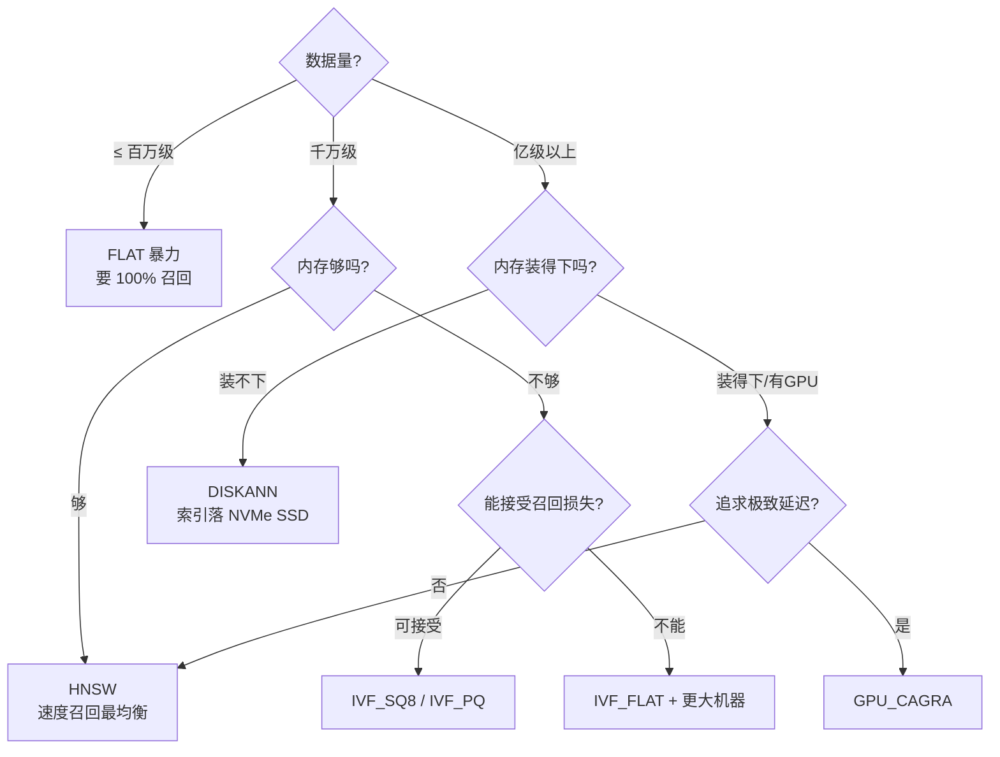
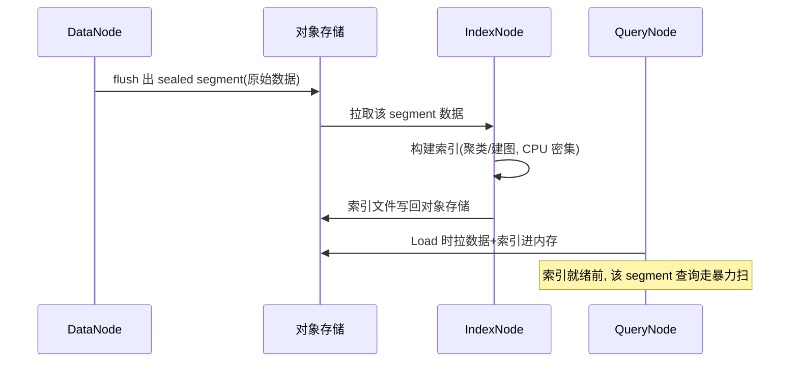
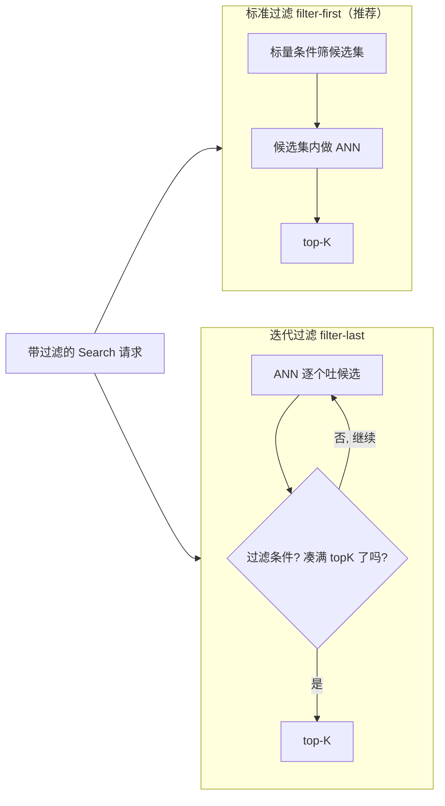

# 同一个 top-10 查询，为什么有人几十毫秒、有人几秒？—— 向量索引与检索

> 属于 S10 向量数据库 Milvus · 第四篇
> 上一篇：[Collection 设计与数据写入](./03-Collection设计与数据写入)
> 下一篇：[一致性、事务与数据管理](./05-一致性事务与数据管理)

同一个 Collection、同一个 query 向量、同一个 top-10，A 团队压到 30ms，B 团队跑出 3 秒——差距不在机器，而在**索引选型 + 检索参数**：有人建了 HNSW 图索引还调好了 `ef`，有人用的是 FLAT 暴力扫描；有人查询时按天分区 + 标量过滤把扫描量砍掉 99%，有人让每个请求在全库裸奔。这一篇把 Milvus 的索引全家桶、四种检索姿势、过滤下推原理、性能调优的三角权衡一次讲透——**这是整个 Milvus 面试含金量最高的一篇**。

## 一、先建立框架：索引 = "把暴力扫描变成导航"

第一篇讲过 ANN 的两条主线：**桶（IVF 系）**和**图（HNSW 系）**。Milvus 的索引就是这两条主线 + 压缩 + 硬件加速的排列组合。先给一张"怎么读索引"的通用框架：

- **索引构建参数**（建索引时定）：决定索引的"形状"——桶的数量 `nlist`、图的度数 `M`、量化精度 `m/nbits`；
- **检索参数**（每次搜索时定）：决定查询走多远——探多少桶 `nprobe`、图搜索的候选池 `ef`；
- **构建时机**：索引是**异步构建**的，由 IndexNode 调度，只对 **sealed segment** 建；构建期间该 segment 查询走 brute force。所以"刚 flush 完就查"可能没吃到索引红利；
- **一个向量字段同一时刻只有一种索引**：换索引类型会自动删掉旧的，所以别指望"FLAT 和 HNSW 同时挂在一个字段上"。

## 二、索引全景：一张表看穿 Milvus 全家桶

### 2.1 CPU 内存索引（主力）

| 索引 | 原理一句话 | 构建参数 | 检索参数 | 内存/规模 | 适合场景 |
|------|-----------|---------|---------|----------|---------|
| **FLAT** | 全量暴力算距离，不做任何压缩 | 无 | 无 | ≈ 原数据，百万级 | 数据小、要 100% 召回；给其他索引当"准确率基准" |
| **IVF_FLAT** | k-means 聚成 `nlist` 个桶，只探 `nprobe` 个桶 | `nlist`(默认128) | `nprobe`(默认8) | ≈ 原数据 | 中等规模、要召回率尽量高 |
| **IVF_SQ8** | 桶 + 标量量化：float32(4B)→uint8(1B) | `nlist` | `nprobe` | **省 70%~75%** | 内存紧张、可接受一点召回损失 |
| **IVF_PQ** | 桶 + 乘积量化：向量切 `m` 段各量化 `nbits` 位 | `nlist`、`m`(需 dim%m==0)、`nbits`(默认8) | `nprobe` | 比 SQ8 还小 | 内存极紧张、召回可损失 |
| **HNSW** | 分层小世界图：上层稀疏长跳、下层密集精搜 | `M`(度数)、`efConstruction` | `ef` | ≈1.2~1.5× 原数据 | **速度/召回最均衡，默认主力** |
| **SCANN**(2.5+) | 类 IVF_PQ 的量化 + SIMD 加速距离计算 | `nlist`、`with_raw_data` | `nprobe`、`reorder_k` | 小于原数据 | 要快又要省内存的 CPU 场景 |
| **AUTOINDEX** | 让 Milvus 按硬件自动选（CPU→HNSW，GPU→CAGRA） | 无 | 随所选索引 | 随所选索引 | 不想操心选型的场景 |

**量化是省内存的命根子**：SQ8 把每个 float32 压成 1 字节 uint8（4 倍）；PQ 把 1024 维向量切成 `m` 段，每段用 `nbits` 位编码，一个向量可以压到 `m×nbits/8` 字节。**省的是内存，代价是召回率**——所以有 `refine_k`/`reorder_k` 这类"粗筛 + 精排"参数：先用量化索引粗筛一批候选，再对候选用原始向量精算距离重排，把召回率找回来。

### 2.2 DISKANN 与 GPU 索引

| 索引 | 原理一句话 | 构建参数 | 检索参数 | 硬件要求 |
|------|-----------|---------|---------|---------|
| **DISKANN** | Vamana 图**索引放磁盘**，查询只把相关图块读进内存 | 无需参数（全局配置 MaxDegree=56 等） | `search_list`(默认16) | NVMe SSD，**十亿级数据** |
| **GPU_BRUTE_FORCE** | GPU 上全量暴力，100% 召回 | 无 | 无 | GPU 显存 |
| **GPU_IVF_FLAT** | 桶索引搬到 GPU 上算 | `nlist`、`cache_dataset_on_device` | `nprobe` | GPU 显存 ≈ 原数据 |
| **GPU_IVF_PQ** | 桶 + PQ 压缩，GPU 计算 | `nlist`、`m`、`nbits` | `nprobe` | 显存占用最小 |
| **GPU_CAGRA**(2.4+) | GPU 专用图索引（粗图+剪枝） | `intermediate_graph_degree`(128)、`graph_degree`(64)、`build_algo` | `itopk_size`、`search_width`、`team_size` | 显存 ≈ 1.8× 原数据 |

要点：**DISKANN 解决"内存装不下"**——十亿级向量不可能全进内存，靠 NVMe 随机读 + 图分块，用磁盘 IO 换内存；**GPU 索引解决"CPU 算不动"**——距离计算是典型的 SIMD 密集运算，GPU 上批量算距离可以比 CPU 快一个量级，代价是显存预算和 top-k 上限（如 GPU_IVF_FLAT 搜索 top-k ≤ 256）。选型口诀：**数据 < 1M 用 FLAT；几 M~几千万用 HNSW（或 IVF_FLAT）；内存紧用 IVF_SQ8/PQ；上亿且内存不够用 DISKANN；有 GPU 且要极致延迟用 CAGRA**。

选型也可以反过来画成决策树，面试时顺着说非常加分：



### 2.3 构建时机：为什么"建完索引还要等"

索引不是写完立刻有的：DataNode flush 出 sealed segment 后，**IndexNode 异步**从对象存储拉数据、建索引、写回对象存储（k-means / 图遍历都是 CPU 密集活），QueryNode Load 时才把索引加载进内存。



`CreateIndex(..., async=false)` 是同步等建完，`async=true` 则立刻返回、后台建。**构建期间该 segment 查询 = 无索引暴力扫**，大表首次建索引动辄分钟级——这是"为什么建完索引第一次查询还是慢"的常见原因。

## 三、建索引 Go SDK 示例

```go
// 主推：HNSW + COSINE，M=16, efConstruction=200（官方推荐的常见起点）
idx, err := entity.NewIndexHNSW(entity.COSINE, 16, 200) // M∈[4,64], efConstruction∈[8,512]
if err != nil {
	log.Fatal(err)
}
// async=false：同步等索引构建完成；大表建议 true 异步，后台建完再 Load
if err := c.CreateIndex(ctx, "video_clip", "embedding", idx, false); err != nil {
	log.Fatalf("建索引失败: %v", err)
}
```

备选：内存紧的桶索引 `entity.NewIndexIvfSQ8(entity.COSINE, 128)`（nlist=128）；显存方案 `entity.NewIndexGPUIvfFlat(entity.COSINE, 128, false)`；不想操心 `entity.NewIndexAUTOINDEX(entity.COSINE)`。距离度量三选一：**L2**（欧氏，值越小越近）、**IP**（内积，越大越近，未归一化时用）、**COSINE**（余弦，越大越近，文本语义检索最常用）。**换模型/换度量 = 索引不兼容，得重建**。

::: warning 面试追问（3 层）
**Q1：FLAT 有什么存在价值？**——它是唯一能保证 100% 召回、且不需要构建的索引，小库直接用，大库用来做"准确率基准"，衡量其他 ANN 索引的召回损失。
**Q2：IVF_SQ8 和 IVF_PQ 都省内存，怎么选？**——SQ8 简单粗暴把每个 float 压成 1 字节，召回损失可控；PQ 把向量切成 m 段分别量化，压缩率更高但精度损失更大，且 m 要能整除维度。召回敏感选 SQ8，容量敏感选 PQ。
**Q3：数据涨到十亿级、内存买不起怎么办？**——DISKANN：索引放 NVMe SSD，查询按需读图块；或缩维度+量化（PQ）后用 GPU/CPU 小内存索引；再不行就按业务维度拆 Collection/分区（多级存储思路）。
:::

## 四、检索方式详解：四种姿势按需取

### 4.1 Search：向量相似度 Top-K（最常用）

```go
// 构造检索参数：HNSW 的 ef（候选池大小），越大召回越高、越慢
sp, err := entity.NewIndexHNSWSearchParam(64) // ef ∈ [1, 32768]，通常 ≥ topK
if err != nil {
	log.Fatal(err)
}

// query 向量：和插入时同一个 embedding 模型产出
v := entity.FloatVector{0.1, 0.2, /* ... 1024 维 ... */}

sr, err := c.Search(ctx, "video_clip",
	[]string{"p_20260802"},          // 指定分区，其余分区不扫（第三篇）
	"",                              // 过滤表达式，空串 = 不过滤
	[]string{"title", "duration_ms"}, // 返回的标量字段
	[]entity.Vector{v},               // 支持一次多向量（nq>1），批量算更省
	"embedding", entity.COSINE,       // 检索字段 + 度量（必须与索引一致）
	10, sp,                           // topK + 检索参数
	client.WithSearchQueryConsistencyLevel(entity.ClBounded), // 一致性（第五篇）
)
if err != nil {
	log.Fatal(err)
}

// 解析结果：ID 列 + 分数 + 输出字段
for i, id := range sr[0].IDs.FieldData().GetScalars().GetLongData().GetData() {
	score := sr[0].Scores[i] // COSINE 相似度，越大越近
	title := sr[0].Fields.GetColumn("title").FieldData().GetScalars().GetStringData().GetData()[i]
	fmt.Printf("id=%d score=%.4f title=%s\n", id, score, title)
}
```

补充：`limit`（topK）+ `client.WithOffset(offset)` 可以做分页（注意深分页代价大）；`nq>1`（一次搜多个 query 向量）时批量计算比逐个搜快得多。

### 4.2 Query：只按标量过滤取数据（不走向量）

Query 不比较相似度，就是"带条件的取数"，等价于 MySQL 的 `SELECT ... WHERE`：

```go
res, err := c.Query(ctx, "video_clip", nil,
	`duration_ms > 5000 && is_public == true`, // 布尔表达式
	[]string{"id", "title"},                   // 输出字段
)
if err != nil {
	log.Fatal(err)
}
idCol := res.GetColumn("id") // entity.Column，转成具体类型取值
```

注意 Query 也有 `limit`/`offset`，还支持聚合式的 `count(*)` 统计（`Query(ctx, coll, nil, expr, []string{"count(*)"})`）；按主键直查用 `c.QueryByPks(ctx, coll, nil, idCol, []string{"title"})`，这是"按 ID 反查素材"的最快路径。

### 4.3 带过滤的向量检索：过滤下推是性能分水岭

"先按条件过滤、再做向量检索"是业务最常用的组合（比如"只看公开的、时长 30s 内的海边视频"）。表达式语法示例：

| 表达式 | 含义 |
|--------|------|
| `id in [1, 2, 3]` | 主键集合 |
| `tag == "sports" && likes > 1000` | 与 + 数值比较 |
| `is_public == true` | 布尔 |
| `title like "海%"` | 前缀匹配 |
| `JSON_CONTAINS(extra, '["4k"]')` | JSON 字段过滤 |
| `$meta["source"] == "autocut"` | 动态字段（`$meta`）过滤 |

**过滤下推原理**：Milvus 2.5 中，过滤条件会被下推到 QueryNode 的 **segcore 执行引擎**，与向量搜索**融合执行**（不是先捞全量再在 proxy 过滤）。但融合有两条路径，性能天差地别：



- **标准过滤（filter-first）**：先按标量条件筛出候选集，再在候选集内做 ANN——**过滤选择性好（能筛掉 90%+）时，这是最优路径**；
- **迭代过滤（filter-last / iterative）**：先做 ANN 逐个吐候选，边吐边过滤直到凑满 topK——**过滤条件超复杂、选择性差时反而更快**（避免了全库扫标量），但极端情况下可能扫很久都凑不齐。

**为什么"过滤 + 向量检索"会慢？**三个元凶：**(1) 过滤选择性差**——比如 `is_public == true` 命中 95% 的数据，等于没过滤还白付一次过滤开销；**(2) 标量字段没有索引**——没有 inverted/bitmap 索引时，过滤是逐行暴力扫（百万行 × 每请求）；**(3) 下推链路长**——表达式要解析、下推、逐 segment 执行，表达式越复杂越拖慢首包延迟。

**标量索引是解药**（2.5 对标量字段单独建索引，和向量索引互不影响）：

| 标量索引 | 原理 | 适用 |
|---------|------|------|
| **Inverted（倒排，默认）** | Tantivy 引擎：词项字典 + 倒排列表，点查/IN/范围/前缀都快（1M 数据点查最多快 **30×**） | VARCHAR/数值字段的等值与范围过滤 |
| **Bitmap（位图）** | 每个取值一张位图，AND/OR 用位运算瞬间合并 | 低基数字段（BOOL/小枚举）、多条件组合 |
| 无索引 | 逐行扫 | 兜底，性能最差 |

```go
// 给标量字段单独建索引：tag 用倒排，likes 用位图
if err := c.CreateIndex(ctx, "video_clip", "tag",
	entity.NewScalarIndex(), true); err != nil { // 默认倒排
	log.Fatal(err)
}
```

::: warning 面试追问（3 层）
**Q1：为什么过滤条件命中率高反而慢？**——过滤选择性差 = 候选集≈全库，向量检索退化回全量扫描，还叠加过滤开销；此时应改走"先 ANN 后过滤"或干脆不加过滤。
**Q2：过滤是在 proxy 做还是 querynode 做？**——表达式下推到 QueryNode 的 segcore，与向量搜索融合执行、逐 segment 并行；proxy 只做结果合并，不做逐行过滤。这也是"过滤下推"这个词的由来。
**Q3：位图索引为什么适合低基数？**——每个取值一张"行号位图"，AND/OR 是 CPU 位运算，N 个条件一次并掉；基数一高（几百万个取值），位图矩阵本身的内存和构建成本就失控了，所以高基数数值字段该用倒排/范围索引。
:::

### 4.4 HybridSearch：多路召回 + RRF 融合（2.4+）

一个素材同时有"画面向量"和"标题文本向量"（多个向量字段，默认上限 4 个，可配到 10），每路各自召回再融合，就是 **Hybrid Search**。融合策略两种：

- **RRF（Reciprocal Rank Fusion）**：按排名融合——`score(d) = Σ 1/(k + rank_i(d))`，`k` 是平滑参数（惯例取 60）。只看排名、不看分数尺度，各路"公平"融合；
- **WeightedRanker**：把各路分数先归一化（arctan 压到 [0,1]）再按权重加权求和——想让某一路（如画面相似度）说了算时用。

```go
req1 := client.NewANNSearchRequest("image_embedding", entity.COSINE, "",
	[]entity.Vector{imgVec}, sp1, 10)                    // 路 1：画面
req2 := client.NewANNSearchRequest("text_embedding", entity.COSINE,
	`duration_ms > 30000`, []entity.Vector{txtVec}, sp2, 10) // 路 2：标题 + 过滤

res, err := c.HybridSearch(ctx, "video_clip", nil, 10,
	[]string{"title"},                                   // 最终返回字段
	entity.NewRRFReranker(),                             // 或 entity.NewWeightedReranker([]float64{0.6, 0.4})
	[]*client.ANNSearchRequest{req1, req2})
```

适用场景：**稠密向量（语义） + 稀疏向量（关键词）双路召回**（RAG 里语义+全文混合检索）、多模态检索。面试点：RRF 为什么好——不同路分数分布不可比（COSINE 与 L2 的分数不在一个量纲），RRF 用"排名"绕开了分数归一化，鲁棒且无需调权重。

### 4.5 Range Search 与按主键查询

- **Range Search（范围相似度）**：不只取 top-K，而是取"相似度落在某个区间"的所有向量——去重、找"近似重复素材"神器。两个参数：`radius`（外圈）和 `range_filter`（内圈），语义随度量而变：

| 度量 | 返回条件 | 含义 |
|------|---------|------|
| L2 | `range_filter <= 距离 < radius` | 距离越小越近，取"不太近也不太远" |
| IP / COSINE | `radius < 分数 <= range_filter` | 分数越大越近，取"足够近"的一段 |

```go
sp, _ := entity.NewIndexHNSWSearchParam(64)
sp.AddRadius(0.8)      // 相似度外圈
sp.AddRangeFilter(0.6) // 相似度内圈 → 取 [0.6, 0.8] 的素材
sr, err := c.Search(ctx, "video_clip", nil, "", []string{"id"},
	[]entity.Vector{v}, "embedding", entity.COSINE, 100, sp)
```

- **按主键查询**：`QueryByPks`（4.2 已给），"写入后立刻反查校验"、"批量取素材详情"都走它，比 Query 表达式更快（直接按主键定位）。

## 五、性能调优：三角权衡 + 预加载

### 5.1 召回率 / 延迟 / 内存的三角权衡

| 调优手段 | 召回率 | 延迟 | 内存/CPU | 说明 |
|---------|-------|------|---------|------|
| `nprobe ↑`（IVF 系） | ↑ | ↑ | CPU ↑ | 探更多桶，找到真近邻的概率↑ |
| `ef ↑`（HNSW） | ↑ | ↑ | CPU ↑ | 候选池更大，图搜更彻底 |
| `search_list ↑`（DISKANN） | ↑ | ↑ | IO ↑ | 每轮读更多候选 |
| `M/efConstruction ↑`（HNSW 构建） | ↑ | 构建更慢 | 构建时内存↑ | 图更密，查询更快 |
| 量化（SQ8/PQ） | ↓ | ↓ | 内存↓↓ | 用召回换内存 |
| `refine_k`/`reorder_k` 精排 | 找回 ↑ | 略↑ | CPU 略↑ | 粗筛+精算组合拳 |

**调参铁律：先定召回目标（如 ≥95%），再在满足召回的前提下压延迟**——nprobe/ef 从默认值往上翻倍试，画"召回率-延迟"曲线，找到拐点。别一上来就最大参数，那等于用全量扫描的钱买 ANN 的便利。

**实操案例**（面试能讲出数字感）：1 亿条 1024 维素材，HNSW（M=16, efConstruction=200）。基线 `ef=64` 时召回 92%、延迟 12ms；`ef=128` 召回 96%、延迟 25ms；`ef=256` 召回 97.5%、延迟 60ms——**拐点在 ef≈128**，再往上召回只涨 1.5 个点、延迟翻倍多。所以线上定 `ef=128`，而不是拍脑袋上 256。IVF 同理：`nprobe=8` 是默认起跑线，先试 16/32，命中率到目标就停。

另一个常见坑是**只调索引参数、不管数据摆放**：同样的 HNSW，配合"按天分区 + `duration_ms > 0` 过滤"把扫描段砍到 1/30，延迟能再降一个数量级——**索引调优永远和过滤下推、分区裁剪一起谈**，单拎任何一项都是片面的。

### 5.2 预加载与查询延迟：第一次查询为什么慢？

- **Load 是查询的前提**：Collection 没 Load，Search/Query 直接报错；Load 之后 QueryNode 才把 segment 数据 + 索引拉进内存。`LoadCollection(ctx, coll, false)` 同步等加载完，大集合加载是秒~分钟级；
- **冷启动**：刚 Load 完的第一次查询慢（页缓存冷、图索引首次遍历）；压测/验证别拿第一次查询当基准；
- **部分加载（2.4+）**：`WithLoadFields("embedding", "title")` 只加载需要的字段进内存，省内存换"某些字段查不了"；还有 mmap 把向量映射到磁盘按需读，属于"用磁盘换内存"的折中。

```go
if err := c.LoadCollection(ctx, "video_clip", false,
	client.WithReplicaNumber(2), // 多副本，查询负载均衡 + 高可用（第五篇）
	client.WithLoadFields("embedding", "title", "id"), // 部分加载，省内存
); err != nil {
	log.Fatal(err)
}
```

### 5.3 其他常被忽略的调优点

- **查询分区裁剪**（第三篇）：能指定分区就别全库扫；
- **批量 nq**：一次 Search 传多个 query 向量，批量距离计算有 SIMD/并行红利，比循环单发快；
- **一致性级别**：Bounded（默认）比 Strong 省掉"等 watermark 追平"的阻塞时间——强一致是延迟杀手，能不用就别用（第五篇展开）；
- **growing vs sealed**：新写入的数据在 growing segment 上无索引暴力扫，检索延迟会随写入量波动；`WithIgnoreGrowing()` 可只查 sealed（牺牲新数据的实时性换稳定延迟）。

---

## 串起来

检索性能 = **索引选型 × 检索参数 × 过滤下推 × 预加载**，四件事层层叠加：FLAT/IVF 系/HNSW/DISKANN/GPU 索引各有适用规模与硬件约束（`nlist`/`M`/`efConstruction` 定形状，`nprobe`/`ef`/`search_list` 定每查询的深度）；Search 走向量 Top-K、Query 走标量取数、带过滤检索靠**下推到 segcore 的 filter-first/iterative 两条路径** + inverted/bitmap 标量索引救命；HybridSearch 用多向量字段多路召回 + RRF/Weighted 融合；Range Search 按相似度区间取数。调参永远是**召回率/延迟/内存的三角权衡**，先定召回再压延迟，别忘了 Load 预热和分区裁剪这两张"免费"加速券。

下一篇讲**一致性、事务与数据管理**：为什么刚写入的素材搜不到？Strong/Bounded/Session/Eventually 四种一致性级别怎么选、TSO 和 watermark 怎么让查询延迟可控，以及 Load/Flush/Compact/删除/TTL/备份这些数据管理操作。
