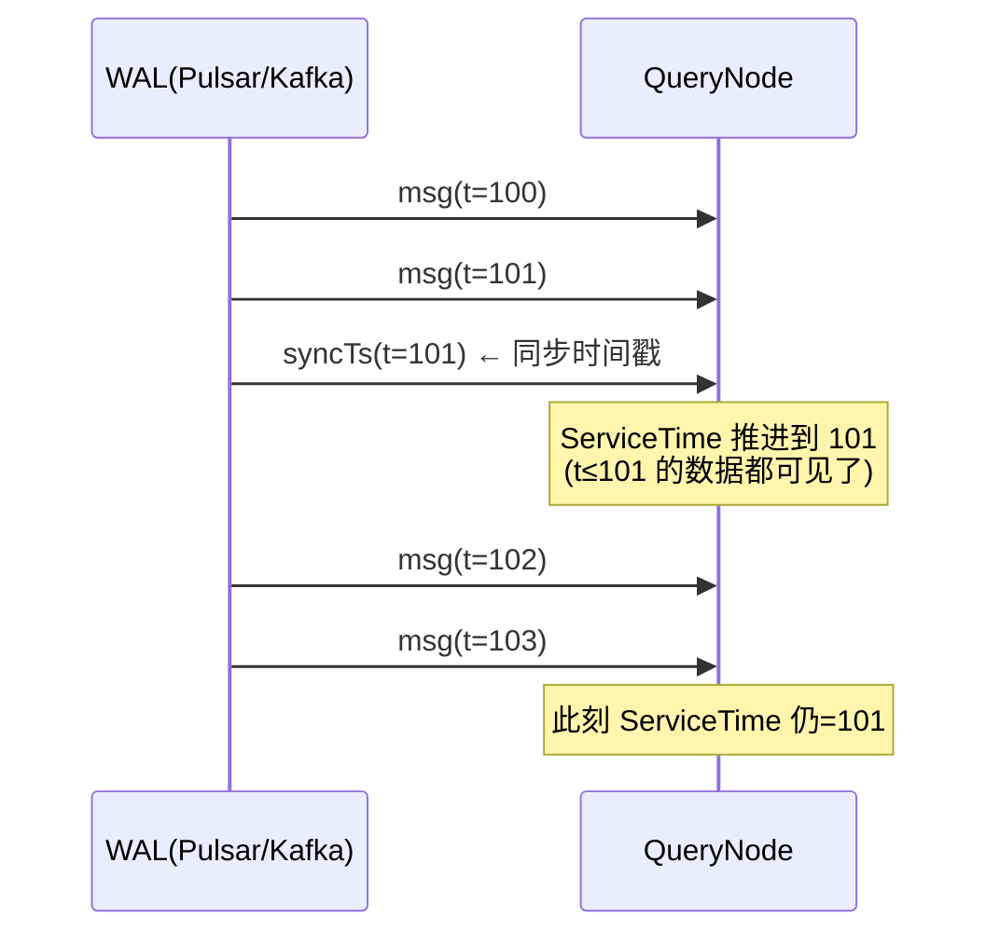
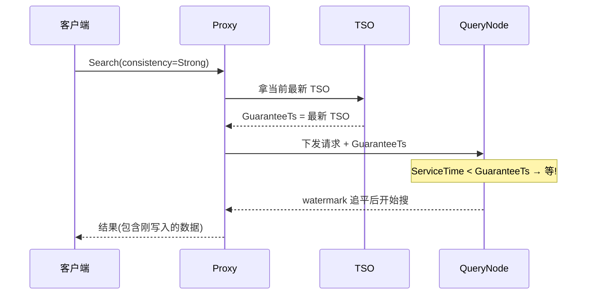
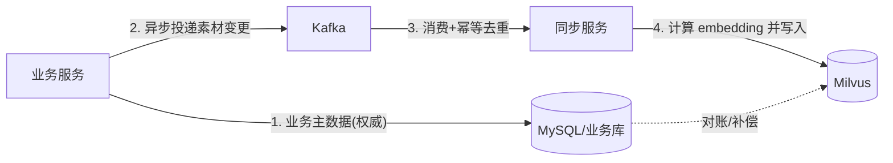
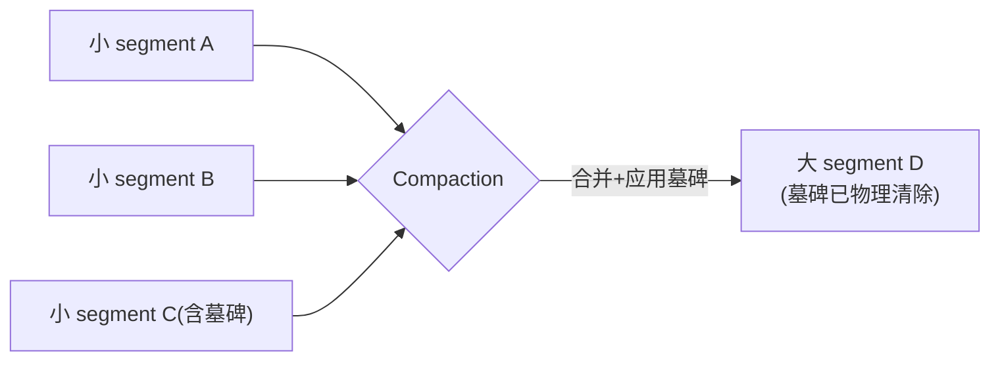
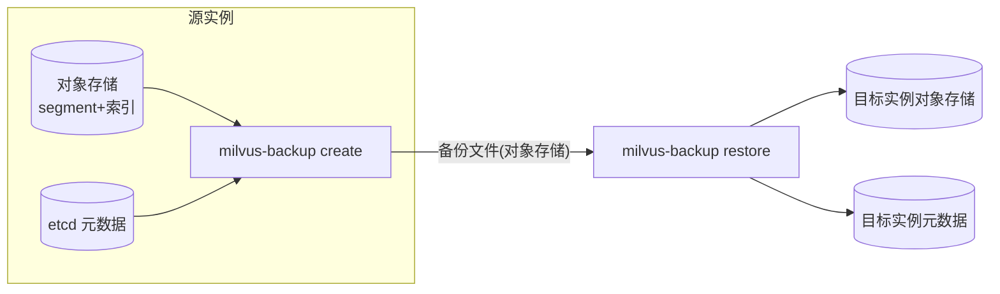

# 刚写入的素材为什么搜不到？—— 一致性、事务与数据管理

> 属于 S10 向量数据库 Milvus · 第五篇
> 上一篇：[向量索引与检索](./04-向量索引与检索)
> 下一篇：[部署、监控与生产实践](./06-部署监控与生产实践)

线上事故现场：素材入库接口返回成功，用户立刻搜索"刚上传的视频"，**查不到**。第一反应是不是 BUG？不是——大概率是**一致性级别**在起作用：Milvus 默认的 Bounded（有界）一致性下，写入成功和"被搜索到"之间，天然隔着约 5 秒的容忍窗口。这一篇把一致性四种级别彻底讲透（TSO、watermark、graceful time 三个关键词），再讲 Milvus 的 DML 事务到底能不能用，最后是数据管理的完整工具箱：Load/Release、Flush、Compact、删除与 TTL、备份，以及"数据到底会不会丢"的高可用边界。

## 一、地基：三个时间戳概念

理解一致性之前，先建立三个时间概念（第二篇的 TSO 在这里派上用场）：

| 概念 | 是什么 | 谁产生 |
|------|--------|--------|
| **TSO（Timestamp Oracle）** | 全局单调递增的时间戳发放器，和 rootcoord 同部署 | Proxy 每次写入向它申请 |
| **ServiceTime（tsafe / watermark）** | QueryNode "已消费到哪"的水位线：WAL 里每隔一段插一条 **syncTs 同步时间戳**，QueryNode 收到它就把 ServiceTime 推进到该点，意味着"**这个时间点之前的数据我都看到了**" | QueryNode 自行维护 |
| **GuaranteeTs（保证时间戳）** | 每条搜索请求携带的"我要看到哪个时间点之前的数据" | Proxy 按一致性级别计算 |

核心机制一句话：**搜索请求带 GuaranteeTs，QueryNode 必须等自己的 ServiceTime ≥ GuaranteeTs 才执行**——这就是"查询延迟可控"的物理基础：等的是"数据已就绪"的水位，而不是瞎等。

ServiceTime 为什么能当水位线？因为 WAL 里**每隔一段就插一条 syncTs 同步时间戳**：QueryNode 消费到 syncTs，就把 ServiceTime 推进到它标记的时间点，意思是"这之前的消息我全处理完了"。画出来就是这样：



所以"数据可见性"本质是一个**沿时间轴推进的窗口**：QueryNode 的 ServiceTime 跟着 WAL 消费走，查询的 GuaranteeTs 决定你要等窗口推进到哪。理解了这个，四种一致性级别就是四个"GuaranteeTs 取值策略"而已。

## 二、四种一致性级别：语义、原理、怎么选

| 级别 | 语义 | GuaranteeTs 怎么定 | 实现原理 | 延迟代价 |
|------|------|-------------------|---------|---------|
| **Strong 强一致** | 读到的永远是**最新**写入 | 当前最新 TSO | QueryNode 等 ServiceTime 追平到最新 TSO 才搜 | **最高**：写后立刻读，必须等数据流到所有目标 QueryNode |
| **Bounded 有界**（默认） | 容忍约 5 秒的陈旧 | **请求时刻 TSO − gracefulTime（默认 5000ms）** | Proxy 拿请求时刻减 5 秒当 GuaranteeTs，QueryNode 几乎不需要等 | 低：通常不阻塞 |
| **Session 会话** | 本会话**写后立读** | 本客户端最近一次写入的时间戳 | 同一 client 的写入和查询绑定时间线 | 中：等自己的写追平 |
| **Eventually 最终** | 不保证，读到啥算啥 | 极小值（≈1） | 跳过一致性检查，直接搜当前 ServiceTime 的数据 | **最低** |



**怎么选**（面试必答的"权衡"）：

- **强一致贵、弱一致快**：Strong 每请求都可能等"数据流追平"（等 WAL 消费、跨节点同步），吞吐和延迟都吃亏；Eventually 完全不等，但可能读到旧数据；
- **默认 Bounded**：官方默认、SDK 默认（`entity.ClBounded`，注释就写着"default tolerance of 5 seconds"）。对"搜 Top-10 召回"这类场景，**5 秒内搜不到刚写的素材完全可接受**；
- **业务对照**：素材"语义召回"用 Bounded；"素材审核状态反查"（写库后立刻按 ID 读状态）用 Strong 或 Session；日志/埋点这类可丢可旧的数据用 Eventually。

给一张"业务 → 一致性级别"速查表，面试直接背：

| 业务诉求 | 推荐级别 | 为什么 |
|---------|---------|--------|
| 视频素材语义召回（Top-K） | **Bounded（默认）** | 最新 5 秒的素材没被搜到，用户无感，换吞吐 |
| 写入后立刻按 ID 反查（状态校验、回调） | **Strong / Session** | 必须读到刚写的那条，不能接受陈旧 |
| 同一用户"上传完立刻看自己的素材" | **Session** | 只要求"自己写的自己立读"，比 Strong 便宜 |
| 日志/埋点/统计类向量 | **Eventually** | 可丢可旧，延迟最敏感 |
| 金融/审核类强校验（如有） | Strong | 但通常不把这类数据放 Milvus，放业务库 |

```go
// 建集合时定默认级别（影响该集合所有查询）
if err := c.CreateCollection(ctx, schema, 2,
	client.WithConsistencyLevel(entity.ClStrong)); err != nil { /* ... */ }

// 单次查询覆盖：只对这一次生效
sr, err := c.Search(ctx, "video_clip", nil, "", []string{"id"},
	[]entity.Vector{v}, "embedding", entity.COSINE, 10, sp,
	client.WithSearchQueryConsistencyLevel(entity.ClEventually))
```

::: warning 面试追问（3 层）
**Q1：Bounded 的"5 秒"是谁定的？**——`proxy.gracefulTime` 配置，默认 5000ms，语义是"请求到达时刻减去 5 秒作为 GuaranteeTs"，所以**最近 5 秒内写入的数据可能看不到**。
**Q2：为什么 Strong 查询延迟是可控的而不是无限等？**——等的是 QueryNode 的 ServiceTime 追平 GuaranteeTs，WAL 消费是持续进行的，追平通常只需几十到几百 ms；若超时仍追不平，会按配置降级返回（如等待超时后返回当前可见数据），不会死等。
**Q3：Session 和 Strong 的区别？**——Session 只保证"本客户端写的数据立读"，其他客户端写入的较新数据看不到也无所谓；Strong 保证全局最新。多实例部署时 Session 依赖连接绑定，跨连接就不成立了。
:::

## 三、事务：向量数据库的 DML 事务（2.3+，beta）

### 3.1 概念与 MII

Milvus 自 2.3 起提供 **DML 事务**（beta）：`Begin → Insert/Delete/Upsert → Commit / Rollback`，语义上和关系库事务一致——要么全成、要么全滚。底层是 **MII（multiple in-flight）** 机制：允许**多个事务同时在途**执行，事务内的操作仍走 TSO 时间戳排序，从而保证可串行化的执行顺序（概念级理解：事务是"一批打了事务标签的写入"，靠 TSO 保证它们要么整体可见要么整体不可见）。

```text
// pymilvus 语义示意（概念级；Go SDK 截至 2.5 未提供公开事务 API）
conn.begin()
try:
    collection.insert(rows_a)   # 事务内的写入
    collection.delete(expr)     # 未 commit 前对外不可见
    conn.commit()               # 要么全部生效
except Exception:
    conn.rollback()             # 要么全部回滚
```

### 3.2 事务的限制（必须背）

| 限制 | 说明 |
|------|------|
| **单集合 + 单分区** | 一个事务只能作用在**同一个 Collection 的同一个 Partition**，跨集合/跨分区事务不支持 |
| **无 DDL** | 事务内不能建索引、改 Schema——索引构建/compaction 与事务互斥 |
| **SDK 覆盖有限** | 目前主要在 pymilvus 侧，Go SDK 2.5 没有公开的 begin/commit API；生产慎用 |
| **定位 beta** | 官方文档没有把它列为正式能力，社区多视为"探索性功能" |

### 3.3 面试点：为什么向量库事务这么难？

关系库事务靠锁 + undo/redo 日志，向量库的难处在三层：**(1) 全局索引**——写入要进倒排/图索引，回滚要连索引一起回滚，代价极高；**(2) ANN 结构**——图索引是增量维护的，事务回滚等于破坏已建好的图；**(3) 分布式**——Milvus 是存储计算分离，数据在 WAL、对象存储、内存索引三处流转，跨组件原子性极难。所以**生产上几乎没人把 Milvus 当事务数据库用**，标准做法是**"业务库为准、向量库为影"**：



**业务主数据放 MySQL，Milvus 只做检索副本**，用消息队列异步同步 + 幂等去重——Milvus 挂了、丢了、乱序了，都能从业务库重放回来。这个架构才是面试加分答案：它把"Milvus 不支持事务"从缺陷变成了"压根不需要"。

## 四、数据管理工具箱：Load、Flush、Compact、删除、TTL、备份

### 4.1 Load / Release：内存是稀缺资源

Milvus 查询**必须先把数据 Load 进 QueryNode 内存**（Load 前 Search/Query 直接报错），Release 则释放内存：

- `LoadCollection(ctx, coll, async)`：同步等加载完；大集合加载秒~分钟级，期间已有数据照常服务；
- **多副本**：`client.WithReplicaNumber(n)` 让多个 QueryNode 各持一份 segment，查询负载均衡 + 节点挂了还有副本顶（见第五节）；
- **分级/部分加载（2.4+，概念级）**：`WithLoadFields(...)` 只加载部分字段进内存（省内存、代价是没加载的字段查不了）；`LoadLevel` 支持"只加载元数据 → 全量数据+索引 → 磁盘索引"的分级加载，配 mmap 把向量按需从磁盘读——本质都是**用内存预算换查询能力**的取舍。

```go
if err := c.LoadCollection(ctx, "video_clip", false,
	client.WithReplicaNumber(2),
	client.WithLoadFields("embedding", "title", "id"),
); err != nil { /* ... */ }
// 用完了释放，把内存还给集群
if err := c.ReleaseCollection(ctx, "video_clip"); err != nil { /* ... */ }
```

### 4.2 Flush：把内存数据立即落盘

第三篇讲过 growing segment 在内存攒批，**Flush 是手动触发落盘**：把当前 growing 数据 seal 成对象存储上的持久化 segment（之后才能建索引、才真正脱离"内存一没就丢"的状态）。生产一般靠阈值自动触发，Flush 用于"我要立刻确保这批数据持久化"的强诉求。

### 4.3 Compact：合并小段 + 物理清理

对象存储里躺着大量小 segment（每次 flush 一个），查询要跨 segment 并行扫，段太多会放大开销；同时**删除的数据还物理占着位置**。Compaction 做两件事：

1. **合并**：把多个小 sealed segment 合并成大 segment，减少查询扫描的段数；
2. **清理**：把逻辑删除的数据（墓碑）从物理文件中真正抹掉。

自动 compaction 由 DataCoord 调度；也可手动触发：`c.ManualCompaction(ctx, "video_clip", 30*time.Second)` 返回任务 ID，再用 `c.GetCompactionState(ctx, id)` 轮询结果。2.4+ 还有 **Clustering Compaction**：按聚类键（clustering key）把同范围数据重排进同一 segment，生成 PartitionStats 做更细的查询剪枝——本质是"把分散的数据按业务维度物理聚拢"。



Compaction 前后对比：**段数少 → 查询跨段扫描开销小；墓碑清除 → 空间真正回收**。这也是"删除的数据为什么隔一段时间空间才变小"的答案。

### 4.4 删除与 TTL：都是"异步清理"

**删除是逻辑删除**：`Delete` 写的是**墓碑（tombstone）**，数据在物理文件里原封不动，只是查询时被过滤掉；**只有 compaction 才会物理清除**——所以"删了还占空间"是正常现象。

```go
// 按表达式删除：删掉所有 is_public == false 的素材（逻辑删除）
if err := c.Delete(ctx, "video_clip", "", `is_public == false`); err != nil { /* ... */ }
// 按主键删同理：DeleteByPks(ctx, coll, partition, idCol)
```

**TTL（存活时间）**：建集合时设置 `collection.ttl.seconds` 属性（如 14 天 = 1209600 秒），到期数据**自动删除**——同样是异步的：删除依赖 GC 和 compaction 的周期性执行，所以**TTL 到期后数据不会立刻消失，会有延迟**。

```go
if err := c.CreateCollection(ctx, schema, 2,
	client.WithCollectionProperty("collection.ttl.seconds", "1209600")); err != nil { /* ... */ }
// 已建的集合可改 TTL：AlterCollection + CollectionTTL 属性
if err := c.AlterCollection(ctx, "video_clip", entity.CollectionTTL(1209600)); err != nil { /* ... */ }
```

| 操作 | 立即生效？ | 物理清理 | 用途 |
|------|-----------|---------|------|
| Delete（逻辑） | 查询立刻看不到 | ❌ 等 compaction | 删单条/按条件批量删 |
| TTL | 到期后查询不可见（有延迟） | ❌ 等 GC + compaction | 临时数据自动过期（会话、缓存类） |
| DropCollection | 立即 | ✅ 立即 | 整表删除，不可逆 |

### 4.5 备份：milvus-backup

官方工具 **milvus-backup**（`milvus-io/milvus-backup`）：把 Collection 的数据 + 元数据备份到对象存储，支持跨实例/跨桶恢复，命令形态：

```text
milvus-backup create -n backup_20260801                     # 创建名为 backup_20260801 的备份
milvus-backup restore -n backup_20260801 -s _restore        # 恢复；-s 给新集合名加后缀
```

原理上，Milvus 的数据本体本来就在对象存储（segment + 索引文件），元数据在 etcd——所以**备份 = 拷贝对象存储 + 导出元数据**，恢复 = 反向导入。这也是为什么"对象存储快照 + milvus-backup 双保险"是生产标配。注意：**milvus-backup 不是持续复制**，频繁变化的库要配合业务层兜底（消息队列重放 / 定时全量）。



备份分层思维（面试可讲）：**Milvus 内做逻辑备份（milvus-backup），存储层做快照（对象存储 bucket 快照），业务层做重放兜底（MQ）**——三层各管一段，任何一层失效都有下一层接住。

::: warning 面试追问（3 层）
**Q1：Delete 之后立刻查不到了，为什么空间没变小？**——Delete 写墓碑（逻辑删除），查询时过滤掉；物理文件要等 compaction 把墓碑应用掉、重写 segment 才真正释放空间。
**Q2：TTL 和数据删除的关系？**——TTL 本质是"按时间自动 Delete"：到期由后台 GC 标记删除，再靠 compaction 物理清理，所以也是异步的、有延迟的。
**Q3：备份能保证恢复到"任意时刻"吗？**——不能，milvus-backup 是快照式（某时刻的一致拷贝），不是 CDC 持续复制；要"任意时刻"得用 milvus-cdc 或业务层消息重放兜底。
:::

## 五、数据会丢吗？——高可用边界（概念级）

| 风险点 | 防护 | 仍存在的窗口 |
|--------|------|-------------|
| **QueryNode 挂了** | 多副本（`WithReplicaNumber>1`）负载均衡 + 故障转移 | 副本数 = 1 时查询不可用（数据不丢） |
| **DataNode 挂了，内存里还有未 flush 数据** | 数据在 WAL 里，**WAL 重放**恢复 | 无：WAL 落消息队列即确认 |
| **WAL（消息日志）本身故障** | Pulsar/Kafka 多副本、消息持久化 | **ack 之后、对象存储落盘之前**，若 WAL 数据丢失则该窗口写入丢失 |
| **元数据（etcd）故障** | etcd 集群多节点 | 集群脑裂/多数派丢失时不可服务 |
| **对象存储故障** | S3/MinIO 多副本/纠删码 | 极小概率，靠对象存储的 11 个 9 兜底 |

一句话总结故障模型：**对象存储是最终数据归宿（最可靠），WAL 是"近期数据"的临时保险（次可靠），内存是最快的但也是最容易丢的一层**。所以架构铁律：**宁可让写入慢一点，也要保证 ack 之前数据进 WAL**；对象存储落盘前的"WAL 未消费窗口"是整个系统唯一需要靠 WAL 冗余来兜的数据丢失风险点。

把"一条数据的一生"和"每一段的故障后果"画在一张图里，就是高可用边界的全景：


- **①→② 之间**：数据只存在于 WAL。DataNode 挂了没关系——**WAL 重放**即可（所以 DataNode 无状态可随时重建）；
- **②→③ 之间（故障窗口）**：内存攒批的数据还没落对象存储，如果 DataNode 崩溃**且 WAL 也丢了**，这段写入就丢了。防护 = WAL 多副本 + 消息持久化；
- **③之后**：数据在对象存储，跨节点冗余，属于安全区。

---

## 串起来

"写进去搜不到"不是 bug，是**一致性级别的设计使然**：TSO 给每条数据排全局序，QueryNode 的 ServiceTime（watermark）决定它看到哪，GuaranteeTs 决定查询等到哪——Strong 等最新、Bounded（默认）容忍 5 秒、Session 保证自己写立读、Eventually 不等。**查询延迟可控的秘密，就是"等 watermark 追平"这个有界等待**。事务在 Milvus 里是 beta 且限制重重（单分区、无 DDL、Go SDK 未覆盖），生产靠"业务库为准 + 异步同步"解决。数据管理上，Load 把数据请进内存、Release 还回去，Flush 手动落盘，Compact 合并小段并物理清理墓碑，Delete/TTL 都是"先逻辑后物理"的异步清理，备份用 milvus-backup 做快照。最后记住高可用边界：**对象存储兜底、WAL 护近期、内存最快最容易丢**。

下一篇讲**部署、监控与生产实践**：从 Docker Compose 单机到 K8s 集群怎么部署，资源怎么配怎么扩，监控告警怎么搭，线上故障怎么排查，以及一份可直接照抄的生产最佳实践清单。
