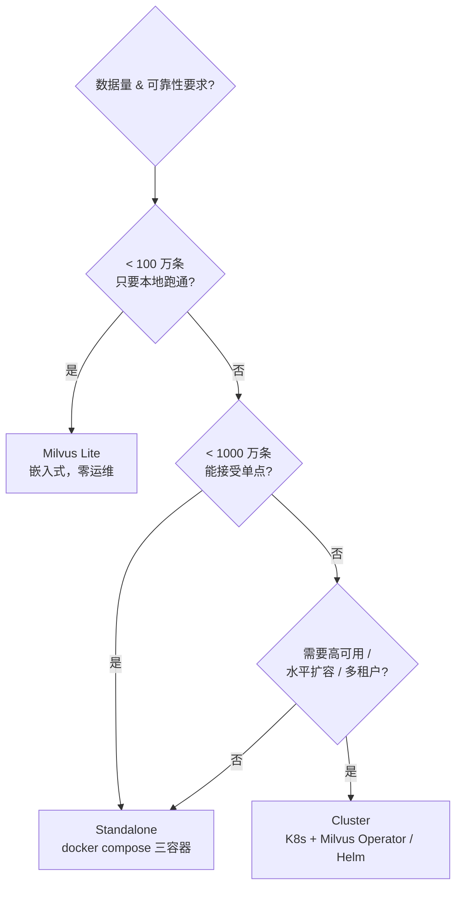
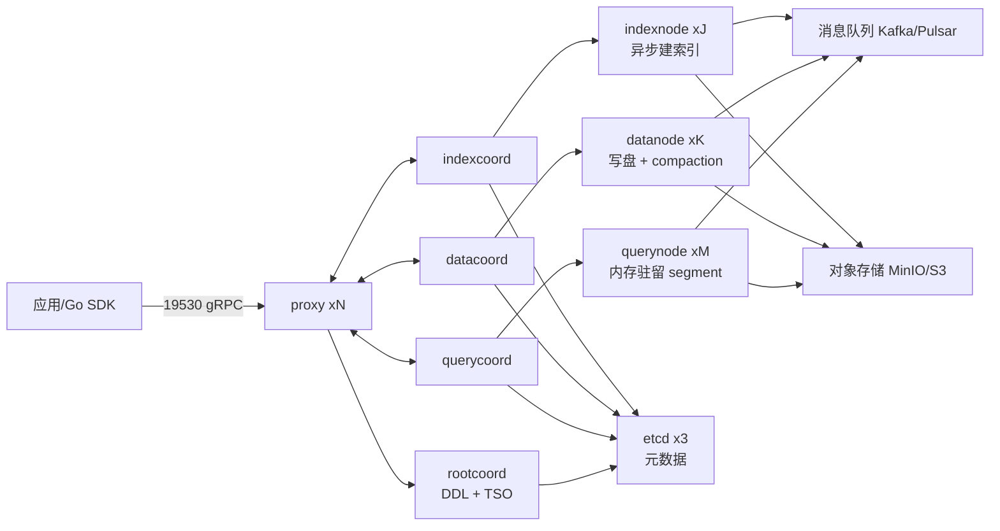
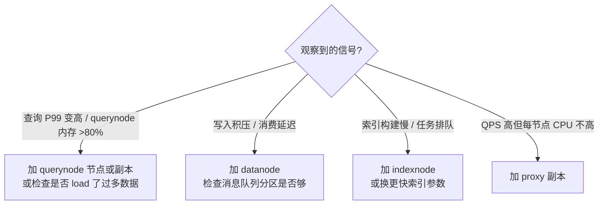
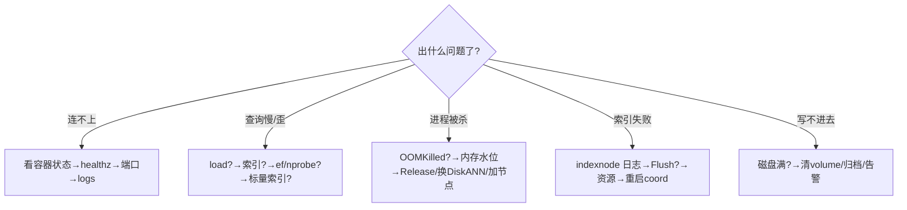

# 本地能跑，上生产怎么不崩——Milvus 部署、监控与生产实践

> 属于 S10 向量数据库 Milvus · 第六篇
> 上一篇：[一致性、事务与数据管理](./05-一致性事务与数据管理)
> 下一篇：[Milvus Go 实战](./07-Milvus-Go实战)

你在本地 `docker run` 起了一个 Milvus，插了几万条向量，检索丝滑。然后 PM 说："下周上线，日活 10 万，向量 1 亿条。"——问题来了：**本地 demo 和生产环境之间，隔着部署形态、监控、容量规划、故障预案整整一座山**。这一篇就把这座山拆成五段爬：**部署形态怎么选 → 单机怎么起 → 集群长什么样 → 资源怎么配怎么扩 → 出了问题怎么查**，最后给一张生产最佳实践清单。全程以 Milvus 2.5.x 为准。

## 一、部署形态：先回答"我在哪一档"

Milvus 官方把部署分成三档，从轻到重：

| 形态 | 是什么 | 适合谁 | 代价 |
|------|--------|--------|------|
| **Milvus Lite** | 纯嵌入式（进程内自带存储），`pip install milvus-lite` 即用 | 本地单测、demo、CI | 单机单进程，不可扩展，无运维能力 |
| **Standalone（单机）** | 一个 `milvus` 进程内嵌全部角色 + 外部 etcd + MinIO 三个容器 | 本地开发、中小规模（百万级以内）生产 | 单点，重启窗口，无水平扩展 |
| **Cluster（分布式）** | 各角色拆成独立节点 + 消息队列 + 对象存储，K8s 编排 | 生产、数据量大、要高可用 | 组件多，运维复杂度陡增 |



**结论一句话：本地开发用 standalone 就够**——它和集群跑的是同一个 milvus 二进制、同一套 SDK API，本地验证过的代码，换连接地址就能连集群。Lite 再轻也只是"能跑"，和生产的差异最大。本篇下文先讲 standalone 怎么起、怎么验，再给集群形态的概念地图。

Standalone 与 Cluster 的本质区别不是"部署了几台机器"，而是**组件是否被拆开、消息队列是否独立**：

| 能力 | Standalone | Cluster |
|------|-----------|---------|
| 各角色（proxy/querynode/datanode…） | 都塞进一个进程 | 独立 Deployment/StatefulSet，可分别扩缩容 |
| 元数据（etcd） | 独立容器 | 独立集群 |
| 数据（MinIO/S3） | 独立容器 | 独立存储集群 |
| 消息队列（存算之间的通道） | 内置（NATS） | 独立部署（Kafka / Pulsar / RocketMQ） |
| 扩容 | 换更大的机器（垂直） | 加节点（水平） |
| 高可用 | 无（进程挂了全部不可用） | 有（组件多副本、探活自愈） |

## 二、Docker Compose 单机部署：三个容器把 Milvus 跑起来

官方在 `milvus` 仓库 `deployments/docker/standalone/` 下维护了一份可直接用的 compose，以下是对标官方 v2.5.x 的完整可用版本（etcd + minio + milvus 三个 service）：

```yaml
# docker-compose.yml —— Milvus standalone
version: '3.5'

services:
  etcd:                       # ① 元数据：所有 schema、segment 位置、索引任务状态都存在这
    container_name: milvus-etcd
    image: quay.io/coreos/etcd:v3.5.16
    environment:
      - ETCD_AUTO_COMPACTION_MODE=revision
      - ETCD_AUTO_COMPACTION_RETENTION=1000
      - ETCD_QUOTA_BACKEND_BYTES=4294967296
    volumes:
      - ${DOCKER_VOLUME_DIRECTORY:-.}/volumes/etcd:/etcd
    command: etcd -advertise-client-urls=http://127.0.0.1:2379 -listen-client-urls http://0.0.0.0:2379 --data-dir /etcd
    healthcheck:
      test: ["CMD", "etcdctl", "endpoint", "health"]
      interval: 30s
      timeout: 20s
      retries: 3

  minio:                      # ② 数据本体：segment 文件、索引文件都落这里（S3 兼容）
    container_name: milvus-minio
    image: minio/minio:RELEASE.2023-03-20T20-16-18Z
    environment:
      MINIO_ACCESS_KEY: minioadmin
      MINIO_SECRET_KEY: minioadmin
    ports:
      - "9001:9001"           # 控制台
      - "9000:9000"           # S3 API
    volumes:
      - ${DOCKER_VOLUME_DIRECTORY:-.}/volumes/minio:/minio_data
    command: minio server /minio_data --console-address ":9001"
    healthcheck:
      test: ["CMD", "curl", "-f", "http://localhost:9000/minio/health/live"]
      interval: 30s
      timeout: 20s
      retries: 3

  standalone:                 # ③ milvus 本体：一个进程内嵌所有角色
    container_name: milvus-standalone
    image: milvusdb/milvus:v2.5.4     # 版本按需换，如 v2.5.3 / v2.5.7
    command: ["milvus", "run", "standalone"]
    security_opt:
      - seccomp:unconfined
    environment:
      ETCD_ENDPOINTS: etcd:2379       # 指向 etcd 容器
      MINIO_ADDRESS: minio:9000       # 指向 minio 容器
      MINIO_REGION: us-east-1
      # 可选：显式指定 bucket（默认 a-bucket，首次启动自动创建）
      # MINIO_BUCKET: milvus-bucket
    volumes:
      - ${DOCKER_VOLUME_DIRECTORY:-.}/volumes/milvus:/var/lib/milvus
    ports:
      - "19530:19530"         # gRPC：所有 SDK 走这个端口
      - "9091:9091"           # 健康检查 + Prometheus 指标
    depends_on:
      - "etcd"
      - "minio"
    healthcheck:
      test: ["CMD", "curl", "-f", "http://localhost:9091/healthz"]
      interval: 30s
      start_period: 90s       # 首次启动要拉镜像、初始化，给足时间
      timeout: 20s
      retries: 3

networks:
  default:
    name: milvus
```

启动与验证四连：

```bash
docker compose up -d          # 起三个容器（首次会拉镜像，稍等）
docker compose ps             # 三个容器都是 running / healthy

# ① 健康检查：返回 OK 就是活着的
curl http://localhost:9091/healthz

# ② 指标端点：能吐出 prometheus 格式的文本流
curl -s http://localhost:9091/metrics | grep -c "milvus_"   # 指标数量，非 0 即正常

# ③ SDK 连接（Go 侧，见下一篇）
# c, err := client.NewClient(ctx, client.Config{Address: "localhost:19530"})
```

三个容易踩的本地坑：**端口冲突**（19530/9091/2379/9000/9001 被占用时改端口映射）；**数据目录权限**（volumes 目录归属不对，etcd/minio 起不来，看 `docker compose logs`）；**忘了 `depends_on` 就急着连**（etcd/minio 还没就绪，milvus 会一直重试，等 healthcheck 变 healthy 再连）。

## 三、Kubernetes 集群部署（概念级）

生产环境的正解是 K8s。官方给两条路，二选一：

| 方式 | 本质 | 适用 |
|------|------|------|
| **Milvus Operator** | 以 CRD `Milvus` 描述集群，operator 负责创建/扩缩/升级底层资源 | 想用"声明式"管理 Milvus，官方推荐 |
| **Helm chart** | `milvus/milvus` chart 一把梭渲染全部资源 | 快速部署、用 values 调参 |

```bash
# 方式一：Operator
kubectl apply -f https://github.com/milvus-io/milvus-operator/releases/latest/download/milvus-operator.yaml
kubectl apply -f - <<EOF
apiVersion: milvus.io/v1beta1
kind: Milvus
metadata:
  name: my-milvus
spec:
  mode: cluster        # standalone / cluster 二选一
EOF

# 方式二：Helm
helm repo add milvus https://milvus-io.github.io/milvus-helm/
helm repo update
helm install my-milvus milvus/milvus --set cluster.enabled=true
```

集群里每个组件的形态各不相同，面试能背出这张表就赢了：

| 组件 | 角色 | 资源形态 | 有无状态 |
|------|------|---------|---------|
| **proxy** | 网关：路由请求、做一致性检查 | Deployment，可多副本 | 无状态，随便扩 |
| **rootcoord** | 总协调：DDL、时间戳（TSO）、DDL 日志 | Deployment（通常 1 副本，走选主） | 无状态（元数据在 etcd） |
| **querycoord / querynode** | 查询：load 数据进内存、跑检索 | coord 1 副本；**querynode 是 Deployment 多副本** | querynode 内存里驻留 segment，有内存状态 |
| **datacoord / datanode** | 写入：消费消息队列、落盘、compaction | coord 1 副本；datanode Deployment 多副本 | 无状态（数据在对象存储） |
| **indexcoord / indexnode** | 建索引：异步任务 | coord 1 副本；indexnode 可按需起（弹性） | 无状态（结果写对象存储） |
| **消息队列**（Kafka/Pulsar/NATS） | 存算之间的缓冲区 | StatefulSet | 有状态 |
| **etcd** | 元数据存储 | StatefulSet（3 节点起步） | **有状态，必须 PVC** |
| **对象存储**（MinIO/S3） | 数据本体 | StatefulSet / 外部托管 | **有状态，必须 PVC** |



记住一句话：**etcd 和对象存储是"账本和货仓"，谁都不能丢；querynode 是"前台柜台"，数据要端到内存里才能检索**——后文所有故障排查都围绕这个心智模型展开。

## 四、资源配置与扩容：给每个 Node 配"人设"

给节点配资源前先搞清职责，否则就是盲配：

| 节点 | 人设 | 主要消耗 | 扩容信号 |
|------|------|---------|---------|
| **proxy** | 前台迎宾 | CPU（解析、转发） | 请求量高、QPS 上不去 → 加副本 |
| **querynode** | 柜台服务员 | **内存**（segment 驻留内存）+ CPU（检索计算） | 查询 P99 延迟升高、内存水位高 → 加节点/加副本 |
| **datanode** | 仓库收货员 | IO 带宽（写盘、compaction） | 写入延迟高、消息队列积压 → 加节点 |
| **indexnode** | 质检员 | CPU + 临时内存（建索引） | 索引任务排队、构建耗时飙升 → 加节点 |
| **rootcoord** | 店长 | 很低 | 一般不扩，瓶颈在别处 |

扩容决策流（这是生产里最常被问的）：



**内存不足的典型表现**（querynode 最常犯）：① 容器被 OOMKilled，`kubectl describe pod` 里能看到 `OOMKilled` 状态；② `LoadCollection` 报错，日志出现 `no enough memory to load`；③ 查询延迟突然恶化——segment 被反复换入换出（chunk cache 命中率暴跌）。对策：加节点分摊、用 `DiskANN` 把索引换到磁盘、调小单副本 load 量（`queryNode.loadMemoryRatio` 相关配置）。给 querynode 的内存经验值：**1GB 内存 ≈ 支撑几千万条 128 维向量的 HNSW 索引**（量级感受，实测以监控为准），所以亿级数据 + 多副本，querynode 内存预算要按"总数据量 × 放大系数 × 副本数"估。

## 五、监控与告警：让 Milvus 开口说话

Milvus 每个组件都内置 Prometheus 指标端点，standalone 就暴露在 **9091/metrics**，集群里每个 pod 也有自己的 9091。指标命名有固定规范——**`milvus_<角色>_<指标名>`**，角色就是八大件之一：`rootcoord`、`proxy`、`querycoord`、`querynode`、`indexcoord`、`indexnode`、`datacoord`、`datanode`。例如官方文档里提到的 `milvus_proxy_search_vectors_count`（累计检索向量数）。采集链路：


接入三步：

```bash
# ① Prometheus 配置里加 job，抓 milvus 的 9091/metrics
# ② 下载官方 Grafana dashboard 并导入（官方 JSON 在 milvus 仓库）：
wget https://raw.githubusercontent.com/milvus-io/milvus/master/deployments/monitor/grafana/milvus-dashboard.json
# Grafana → Import → 上传该 JSON → 选 Prometheus 数据源
```

关键指标与建议阈值（记住"看哪几个数"比背指标名更重要）：

| 维度 | 代表性指标（前缀 milvus_） | 看什么 | 建议告警阈值 |
|------|--------------------------|--------|-------------|
| 查询延迟 | `proxy_search_latency_milliseconds`（histogram） | P99 是否爬升 | P99 > 500ms 持续 5min |
| 查询量 | `proxy_search_requests` / `proxy_search_vectors_count` | 容量规划、异常突增 | 突增 5 倍告警（可能被刷） |
| 内存 | `querynode_memory_usage` / `querynode_memory_limit` | 内存水位 | > 80% 持续 5min |
| Segment 数量 | `querynode_*segment*` / `datanode_*segment*`（带 `segment_state` 标签） | 小 segment 是否堆积（compaction 没跟上） | 增长趋势异常 |
| 索引进度 | `indexcoord_*` 任务指标（带 `index_task_status` 标签） | `in-progress` / `failed` 计数 | 失败数 > 0 |
| 磁盘 | 对象存储侧监控 | 容量 | > 85% |

所有指标的精确名字以 `curl localhost:9091/metrics | grep milvus_` 实际输出为准——**生产第一课：永远以端点输出为准，别背网上的旧指标名**。

## 六、故障排查手册：现象 → 排查 → 解决

运维的功夫都在排查套路里。下面五个高频故障，每个都按"现象→排查→解决"三步走：

### 6.1 连接超时：SDK 连不上，`context deadline exceeded`

- **现象**：`client.NewClient` 报错或首次操作超时。
- **排查**：`docker compose ps` 看容器是否 healthy；`curl http://localhost:9091/healthz` 是否 OK；`telnet localhost 19530` 端口是否通；`docker compose logs standalone | tail` 看启动是否完成。
- **解决**：容器没起来 → 看 logs 修（常见：etcd/minio 没就绪、volume 权限）；端口映射错了 → 改 compose 端口；**连接地址写成 `milvus:19530`（容器内网名）而客户端在宿主机** → 客户端统一用 `localhost:19530`。

### 6.2 查询慢 / 召回差：搜是能搜，就是又慢又歪

- **现象**：Search 延迟几百毫秒以上，或者 topK 结果明显不相关。
- **排查**：按顺序检查——① collection 是否 load（没 load 直接报错或走全量）；② 有没有建索引（无索引时 Milvus 做暴力扫描，几十万条就开始慢）；③ HNSW 的 `ef`、IVF 的 `nprobe` 是否太小（召回差）；④ 是否带了标量过滤而过滤字段没有标量索引；⑤ 查 Grafana 的 `proxy_search_latency` 确认瓶颈在哪个阶段。
- **解决**：`LoadCollection` 后重试；建 HNSW/IVF 索引（见下一篇）；把 `ef` 从 64 提到 256、`nprobe` 从 8 提到 32（召回↑延迟↑，按业务接受度调）；给过滤字段加标量索引（inverted index）；再不行看是不是 load 的副本太少（查询并发全压在一个节点上）。

### 6.3 OOM：进程被系统杀掉

- **现象**：querynode/standalone 进程退出，`docker compose ps` 显示 exited，或 K8s 里 `OOMKilled`。
- **排查**：`docker inspect` / `kubectl describe pod` 确认 OOM 状态；`dmesg | tail` 看内核日志；Grafana 看 `querynode_memory_usage` 是不是长期贴着 limit；`GetCollectionStatistics` 看 collection 里到底有多少行、估内存。
- **解决**：**load 的数据量超过了内存预算**——删掉不用的 collection / `ReleaseCollection`；拆分 collection 或按 partition load；换 `DiskANN`（索引落盘，内存换延迟）；加 querynode 节点分摊；调小 chunk cache。

### 6.4 索引构建失败

- **现象**：`CreateIndex` 后 `GetIndexState` 一直是 Failed，或一直 InProgress 卡死。
- **排查**：看 indexnode 日志（`docker compose logs` / pod logs）里的具体报错；`GetIndexState` 拿状态；确认数据是否已 `Flush`（没 flush 的 streaming 数据可能不参与索引任务）。
- **解决**：资源不足（indexnode 内存不够建大索引）→ 加内存或换参数（`M`/`efConstruction` 调小）；数据分布问题（某 segment 数据异常）→ 删掉重插；状态卡死 → 重启 indexcoord/indexnode 让任务重新调度。**记住：建索引是异步的，`CreateIndex` 返回不代表完成**，生产要轮询 `GetIndexState` / `GetIndexBuildProgress` 到 Finished 再 load。

### 6.5 磁盘满

- **现象**：写入报错、minio 容器起不来、指标采集异常。
- **排查**：`df -h` 看宿主盘；`du -sh volumes/minio volumes/etcd` 定位大头；对象存储侧看 bucket 大小。
- **解决**：清掉已 Drop 但没回收干净的 segment（等 GC/compaction 或手动清临时目录）；给日志和存储挂独立盘、加容量告警；生产上对象存储配生命周期规则（冷数据归档/过期清理）。**磁盘满的根因往往是"没人盯容量"**，所以第五节的磁盘告警别省。



## 七、生产最佳实践清单

| 实践 | 具体做法 |
|------|---------|
| **备份** | 官方 `milvus-backup` 工具（milvus-io/milvus-backup）支持全量/增量备份到对象存储；**备份的是元数据 + segment 清单**，恢复时按清单从对象存储拉数据。备份要定期跑、恢复要演练过 |
| **版本升级** | standalone：备份 → 停容器 → 换镜像 tag → 起容器；集群：用 Operator/Helm 做滚动升级，先升小版本再跨大版本，**升级前必读官方 release note 里的兼容性说明**（尤其是索引、schema 相关的 breaking change） |
| **多副本** | `LoadCollection` 时指定 `replicas`，同一份 segment 加载到多个 querynode，查询负载分摊 + 节点故障不丢服务；代价是内存占用 × 副本数 |
| **多租户（DB 级）** | Milvus 2.3+ 支持多 **Database**（`CreateDatabase`），租户间按 DB 逻辑隔离；DB 之下再按 collection 细分 |
| **多租户（权限级）** | 内置 **RBAC**：`user`（账号）→ `role`（角色）→ `privilege`（对 object 的操作权限，如 Search/Insert/Delete/CreateIndex）。最小权限：给应用开专用 user，只授它要用的 collection 的 Search 权限 |
| **资源隔离** | 2.4+ **Resource Group**：把不同 querynode 划成组，重业务和轻业务隔离，避免互相挤内存（概念级，运维再展开） |

RBAC 的最小闭环（milvuscli 命令，SDK 也有对应 API）：

```bash
create user -u app_user -p 强密码
create role -r search_only
grant_privilege -r search_only -d default -c my_collection -p Search   # 只给 Search
grant_role -u app_user -r search_only
# 之后 app_user 只能检索 my_collection，连 schema 都看不了（如需读 schema 再授 DescribeCollection）
```

---

## 串起来

这一篇把"从 demo 到生产"的路径捋直了：**选型**（Lite / standalone / cluster 三档，本地 standalone 就够，生产上 K8s + Operator/Helm）；**单机部署**（etcd + minio + milvus 三容器，19530 对外、9091 健康检查 + 指标）；**集群心智模型**（etcd 是账本、对象存储是货仓、querynode 是柜台、消息队列是传送带）；**扩容**（延迟高加 querynode、积压加 datanode、索引慢加 indexnode、内存是 querynode 的命门）；**监控**（9091/metrics → Prometheus → Grafana，盯着延迟、内存、segment、索引任务四个维度）；**排查**（连接超时、查询慢、OOM、索引失败、磁盘满，每件都是"现象→排查→解决"三步）；最后用**备份、升级、多副本、DB + RBAC 多租户、资源组**把生产位补齐。

下一篇是 **Milvus Go 实战**：把前面所有概念落成能跑的 Go 代码——用 `github.com/milvus-io/milvus-sdk-go/v2` 完整走一遍"连接→建集合→插数据→建索引→load→检索→过滤→删除"，再拼一个本地文档语义检索的 RAG 小项目。
