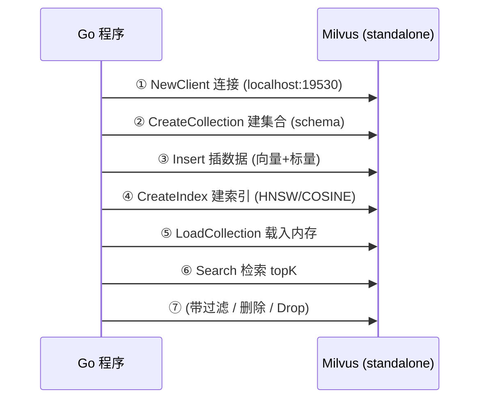
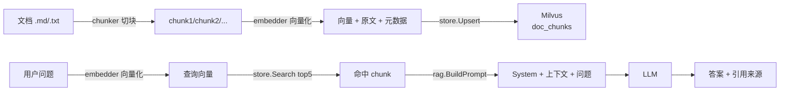

# 怎么用 Go 把"文档语义检索"跑通——Milvus Go SDK 实战

> 属于 S10 向量数据库 Milvus · 第七篇
> 上一篇：[部署监控与生产实践](./06-部署监控与生产实践)
> 下一篇：[面试题集](./08-面试题集)

前六篇讲完"为什么、怎么运转、怎么部署"，这一篇动手：用 `github.com/milvus-io/milvus-sdk-go/v2` 把向量检索全链路跑一遍，再拼一个**本地文档语义检索**的 RAG 小项目骨架，和你的 docs-rag 项目遥相呼应。全部代码都是官方 SDK 的真实 API（以 v2.5.x 为准），你只需要一个本地 Milvus。

先看最小链路——它就是你面试时能默写的"Milvus 七步"：



## 一、环境准备

**第 1 步：起 Milvus standalone**。用第六篇的 docker-compose.yml，然后：

```bash
docker compose up -d
# 等 healthcheck 变 healthy（首次要拉镜像，1~3 分钟）
curl http://localhost:9091/healthz   # 返回 OK 即可
```

**第 2 步：建 Go 工程并拉 SDK**：

```bash
mkdir milvus-demo && cd milvus-demo
go mod init milvus-demo
go get github.com/milvus-io/milvus-sdk-go/v2@latest
```

**第 3 步：连一下试试**（把第七步的"连接"单独先跑通，后面出错时能排除网络问题）：

```go
package main

import (
	"context"
	"fmt"
	"log"

	"github.com/milvus-io/milvus-sdk-go/v2/client"
)

func main() {
	ctx := context.Background()
	c, err := client.NewClient(ctx, client.Config{
		Address: "localhost:19530", // 生产换成集群 proxy 地址
		// Username: "xxx", Password: "xxx", // 开了鉴权才需要
	})
	if err != nil {
		log.Fatalf("连接失败: %v", err)
	}
	defer c.Close()
	fmt.Println("connected to milvus ✔")
}
```

## 二、七步走：一段代码跑通全链路

下面每小节都是独立可编译的片段，最后拼起来就是完整 demo。演示用**维度 8 的伪向量**（生产用 768/1024 维真实 embedding，见第三节）。

### 2.1 连接

见上文第 3 步。`client.Config` 最常用字段：`Address`（必填，proxy 的 gRPC 地址）、`Username/Password`（开鉴权后）、`DBName`（多租户 DB，默认 `default`）。

### 2.2 定义 Schema 并建 Collection

向量数据库的"建表"就是定义 schema：主键、标量字段、向量字段。

```go
schema := entity.NewSchema().
	WithName("doc_chunks").
	WithDescription("文档切块向量").
	WithField(entity.NewField().
		WithName("id").WithDataType(entity.FieldTypeInt64).
		WithIsPrimaryKey(true).WithIsAutoID(false)). // 主键，业务自己生成
	WithField(entity.NewField().
		WithName("text").WithDataType(entity.FieldTypeVarChar).
		WithMaxLength(1024)). // VarChar 必须给 MaxLength
	WithField(entity.NewField().
		WithName("category").WithDataType(entity.FieldTypeVarChar).
		WithMaxLength(64)).
	WithField(entity.NewField().
		WithName("vector").WithDataType(entity.FieldTypeFloatVector).
		WithDim(8)) // 演示 8 维；生产用 embedding 模型维度（如 768）

// 建集合前先查重，重复建会报错
has, err := c.HasCollection(ctx, "doc_chunks")
if err != nil {
	log.Fatal(err)
}
if has {
	c.DropCollection(ctx, "doc_chunks") // 演示环境直接重建
}
if err := c.CreateCollection(ctx, schema, entity.DefaultShardNumber); err != nil {
	log.Fatalf("建集合失败: %v", err)
}
```

字段校验是 SDK 替你把关的：`VarChar` 不设 `MaxLength` 直接报错；`FloatVector` 不设 `Dim` 报错；主键字段类型必须是 Int64 / VarChar 之一。**这些校验是"编译期/运行期替你挡低级错误"的第一道防线**，写代码时善用。

### 2.3 插入数据：伪向量 vs 真实 embedding

Milvus 的插入是**列式**的：每个字段传一整个列。

```go
// 演示：8 维伪向量（生产：用 embedding 模型把文本转成向量，见第三节）
n := 100
ids := make([]int64, 0, n)
texts := make([]string, 0, n)
cats := make([]string, 0, n)
vecs := make([][]float32, 0, n)
for i := 0; i < n; i++ {
	ids = append(ids, int64(i))
	texts = append(texts, fmt.Sprintf("这是第 %d 篇文档的切块内容", i))
	cats = append(cats, []string{"go", "redis", "k8s"}[i%3])
	vec := make([]float32, 8)
	for j := range vec {
		vec[j] = rand.Float32()
	}
	vecs = append(vecs, vec)
}

// 组装成列；注意 FloatVector 列要带维度
idCol := entity.NewColumnInt64("id", ids)
textCol := entity.NewColumnVarChar("text", texts)
catCol := entity.NewColumnVarChar("category", cats)
vecCol := entity.NewColumnFloatVector("vector", 8, vecs)

// 第二个参数是分区名，"" 表示 default partition
// 注意：Insert 返回主键列（entity.Column），用 Len() 拿插入条数
pkCol, err := c.Insert(ctx, "doc_chunks", "", idCol, textCol, catCol, vecCol)
if err != nil {
	log.Fatalf("插入失败: %v", err)
}
log.Printf("插入 %d 条", pkCol.Len())

// Flush：把内存里的数据落盘成 segment（数据能被索引、被查询的前提）
if err := c.Flush(ctx, "doc_chunks", false); err != nil {
	log.Fatal(err)
}
```

**生产提醒**：`Insert` 是"写进消息队列 + 内存"，`Flush` 才落盘。大批量写入用"攒一批插一批 + 定期 Flush"效率最高，一条一条插会被批处理放大成本。

### 2.4 建索引 + Load：从"能存"到"能快查"

不建索引也能查（暴力扫描），但几十万条就肉眼可见地慢。建 HNSW 索引：

```go
// HNSW 参数：M 每个节点的最大连接数；efConstruction 建图时候选集大小
idx, err := entity.NewIndexHNSW(entity.COSINE, 16, 64)
if err != nil {
	log.Fatal(err)
}
// async=false 表示等这次调用返回；但索引真正构建完仍需轮询状态
if err := c.CreateIndex(ctx, "doc_chunks", "vector", idx, false); err != nil {
	log.Fatal(err)
}

// 轮询索引状态：InProgress → Finished / Failed
for {
	state, err := c.GetIndexState(ctx, "doc_chunks", "vector")
	if err != nil {
		log.Fatal(err)
	}
	if state == entity.IndexState(commonpb.IndexState_Finished) {
		break
	}
	if state == entity.IndexState(commonpb.IndexState_Failed) {
		log.Fatal("索引构建失败")
	}
	log.Printf("索引构建中: %v", state)
	time.Sleep(time.Second)
}

// Load：把索引+数据加载进 querynode 内存，之后才能检索
if err := c.LoadCollection(ctx, "doc_chunks", false); err != nil {
	log.Fatal(err)
}
```

> import 里要加 `commonpb "github.com/milvus-io/milvus-proto/go-api/v2/commonpb"`（SDK 依赖的 proto 包）。**注意类型转换**：`GetIndexState` 返回的是 `entity.IndexState`（底层就是 commonpb 枚举，但 Go 的类型系统要求显式转换），所以比较要写 `entity.IndexState(commonpb.IndexState_Finished)`，直接比会编译报错。

**索引构建是异步的**：`CreateIndex` 返回只代表任务提交成功。图省事可以 `async=true` 立刻返回，但**在 load 前必须确认索引 Finished**，否则可能检索时还没建完，性能回到暴力扫描。

### 2.5 检索：top5 + 输出字段 + 分数

```go
// 构造查询向量（演示：拿第 0 条数据的向量去搜）
queryVec := entity.FloatVector(vecs[0])
// HNSW 检索参数：ef 越大召回越好、延迟越高
sp, err := entity.NewIndexHNSWSearchParam(128)
if err != nil {
	log.Fatal(err)
}

// 签名：Search(ctx, collection, partitions, expr, 输出字段, 查询向量列表, 向量字段名, 度量, topK, 检索参数, opts...)
sRet, err := c.Search(ctx, "doc_chunks", nil, "",
	[]string{"text", "category"}, // 输出字段：除了分数，还想带回哪些标量
	[]entity.Vector{queryVec},
	"vector", entity.COSINE, 5, sp)
if err != nil {
	log.Fatal(err)
}

for _, res := range sRet {
	fmt.Printf("命中 %d 条:\n", res.ResultCount)
	// 解析输出字段：按名字找列
	var textCol *entity.ColumnVarChar
	for _, field := range res.Fields {
		if field.Name() == "text" {
			textCol = field.(*entity.ColumnVarChar)
		}
	}
	for i := 0; i < res.ResultCount; i++ {
		t, _ := textCol.ValueByIdx(i)
		fmt.Printf("  score=%.4f text=%s\n", res.Scores[i], t)
	}
}
```

结果结构就三个东西：`res.Scores`（float32 切片，COSINE 是越大越相似）、`res.Fields`（输出字段的列，按名字找）、`res.IDs`（命中的主键）。**面试要能说清"搜索结果 = 主键 + 分数 + 你要求的输出字段"**。

### 2.6 带过滤检索：向量相似 + 标量条件

```go
// expr 语法和 SQL where 很像：字段名 == / != / > / < / in / and / or
expr := `category == "go" and id > 10`
sRet2, err := c.Search(ctx, "doc_chunks", nil, expr,
	[]string{"text"}, []entity.Vector{queryVec},
	"vector", entity.COSINE, 5, sp)
if err != nil {
	log.Fatal(err)
}
// 结果里只会有满足 category=="go" 且 id>10 的向量
```

注意：过滤条件越紧，候选越少，召回越受影响；**过滤字段加标量索引**（第六篇讲过）能显著提速。Milvus 2.4+ 还有 `partition key`——按某字段自动分桶，检索时只扫相关分区，过滤性能质的飞跃，概念要能说出来。

### 2.7 删除与释放：清理的完整姿势

```go
// 按表达式删数据（删的是向量+标量，不是删集合）
if err := c.Delete(ctx, "doc_chunks", "", `id in [0, 1, 2]`); err != nil {
	log.Fatal(err)
}

// 释放内存：集合不再用，把 querynode 内存还回去
if err := c.ReleaseCollection(ctx, "doc_chunks"); err != nil {
	log.Fatal(err)
}

// 彻底删除集合（schema 一起没）
if err := c.DropCollection(ctx, "doc_chunks"); err != nil {
	log.Fatal(err)
}
```

## 三、完整项目：本地文档 RAG 语义检索

光会调 API 不算数，把它放进一个真实链路才算掌握。下面是"本地文档语义检索"小项目骨架——它就是你 docs-rag（`projects/docs-rag`，见 /phase3/docs-rag）里向量存储模块的最小版本：

```text
doc-rag/
├── go.mod
├── main.go                    # 入口：命令分发（index / search）
├── internal/
│   ├── chunker/
│   │   └── chunker.go         # 文档切块：按段落/固定窗口切，带重叠
│   ├── embedder/
│   │   └── embedder.go        # 向量化：调 embedding 模型 API（本地可先用伪向量）
│   ├── store/
│   │   └── milvus.go          # 封装本教程全部 SDK 调用
│   └── rag/
│       └── rag.go             # 检索 → 拼 prompt → 调 LLM
└── data/
    └── docs/                  # 放你的 md/txt 文档
```

核心链路：



关键函数（store 层封装，生产直接复用）：

```go
// store/milvus.go —— 三个核心方法
type Store struct{ c client.Client }

// Upsert：切块 → 向量化 → 插入（幂等：先删同 id 再插）
func (s *Store) Upsert(ctx context.Context, chunks []Chunk) error {
	ids, texts, cats, vecs := make([]int64, 0), make([]string, 0), make([]string, 0), make([][]float32, 0)
	for _, ch := range chunks {
		vec, err := embed(ch.Text) // 调用 embedding 模型
		if err != nil {
			return err
		}
		ids = append(ids, ch.ID)
		texts = append(texts, ch.Text)
		cats = append(cats, ch.Category)
		vecs = append(vecs, vec)
	}
	_, err := s.c.Insert(ctx, "doc_chunks", "",
		entity.NewColumnInt64("id", ids),
		entity.NewColumnVarChar("text", texts),
		entity.NewColumnVarChar("category", cats),
		entity.NewColumnFloatVector("vector", Dim, vecs))
	return err
}

// Search：问题 → 向量 → topK 命中块（带回原文给 RAG 拼上下文）
func (s *Store) Search(ctx context.Context, question string, topK int) ([]Hit, error) {
	qVec, err := embed(question)
	if err != nil {
		return nil, err
	}
	sp, _ := entity.NewIndexHNSWSearchParam(128)
	res, err := s.c.Search(ctx, "doc_chunks", nil, "",
		[]string{"text"}, []entity.Vector{entity.FloatVector(qVec)},
		"vector", entity.COSINE, int64(topK), sp)
	if err != nil {
		return nil, err
	}
	// 解析 res[0].Fields 里的 text 列 + res[0].Scores → []Hit
	return parseHits(res[0]), nil
}

// rag.go —— 拼 prompt：检索命中的 chunk 塞进 System 上下文
func BuildPrompt(question string, hits []Hit) string {
	var sb strings.Builder
	sb.WriteString("你是文档问答助手。仅根据以下资料回答，资料没有就直说不知道。\n\n资料：\n")
	for i, h := range hits {
		fmt.Fprintf(&sb, "[%d] %s\n", i+1, h.Text)
	}
	fmt.Fprintf(&sb, "\n问题：%s\n回答：", question)
	return sb.String()
}
```

与 docs-rag 的呼应点：docs-rag 的 `embedder`/`chunker`/`store` 模块设计和你这里完全同构——**先切块（chunk）→ 向量化（embed）→ 入库（upsert）→ 检索（search）→ 拼 prompt**，只是它的向量存储用了别的实现。把 `store` 层换成 Milvus，就是一份"我用 Go + Milvus 做向量检索"的简历项目素材。

## 四、常见坑清单（背下来，能省半天）

| 坑 | 现象 | 原因 | 解法 |
|----|------|------|------|
| **维度不一致** | Insert/Search 报 `dimension mismatch` | 插入的向量维度和 schema `WithDim` 不一致 | 维数写死成常量 `Dim`，embedding 模型换了记得同步 |
| **类型必须是 float32** | 编译不过 / 数据异常 | Go 里顺手用了 `[]float64` | 向量统一 `[]float32`；`entity.NewColumnFloatVector(name, dim, [][]float32)` |
| **没 load 就 Search** | 报错 `collection not loaded` | 忘了 `LoadCollection`，或 load 是异步的还没完成 | 先 Load 再搜；load 返回后可用 `GetLoadState` 确认 |
| **索引异步没等完** | 检索慢到怀疑人生 | `CreateIndex` 返回后立刻 load/搜索，索引还在后台建 | 轮询 `GetIndexState` 到 `Finished` 再往下走 |
| **写后立刻查不到** | Insert 成功但 Search 看不到新数据 | 默认一致性是 Bounded（容忍一定滞后）；streaming 数据没刷进 querynode | 需要"读己之写"时用 `client.WithSearchQueryConsistencyLevel(entity.ClStrong)` 或 Session 级别（见面试题 Q6） |
| **端口连错** | 连接超时 | 19530 是 gRPC（SDK），9091 是指标/健康检查 | SDK 永远连 **19530**；9091 只用来 curl 检查 |
| **VarChar 没设 MaxLength** | 建集合报错 | SDK 字段校验强制 | `WithMaxLength(1024)` |
| **重复建同名集合** | `collection already exists` | 没查重 | 先 `HasCollection`，需要重建就先 `DropCollection` |

## 五、验收标准 checklist

跑完这一篇，逐项打勾：

- [ ] `docker compose up -d` 起 standalone，`curl localhost:9091/healthz` 返回 OK
- [ ] `go get github.com/milvus-io/milvus-sdk-go/v2` 成功，`NewClient` 连上 19530
- [ ] 建 schema（Int64 主键 + VarChar 文本 + FloatVector 8 维），能触发一次字段校验报错并修好
- [ ] 插入 100 条伪向量，`Flush` 成功，`pkCol.Len() == 100`
- [ ] `CreateIndex(HNSW, COSINE)` + 轮询到 `IndexState_Finished`，`LoadCollection` 成功
- [ ] Search top5 返回 `Scores` 和 `text` 输出字段，能打印分数
- [ ] 带 `category == "go"` 过滤的 Search 结果全部命中条件
- [ ] `Delete` 表达式删数据、`ReleaseCollection`、`DropCollection` 各执行一次
- [ ] 把 `store` 封装成 `Upsert/Search` 两个方法，接入第三节的项目骨架
- [ ] 说出七步链路 + 至少 3 个坑（没 load、索引异步、维度不一致）

## 串起来

这一篇把 Milvus 从"概念"变成了"能跑的代码"：**连接（NewClient）→ 建集合（Schema）→ 插数据（列式 Insert + Flush）→ 建索引（HNSW + 轮询状态）→ Load → Search（topK + 输出字段 + 分数）→ 过滤检索（expr）→ 清理（Delete/Release/Drop）**，再用"文档切块 → 向量化 → upsert → 检索 → 拼 prompt"拼出一个 RAG 小项目骨架，和 docs-rag 的模块设计一一对应。面试时你能默写七步、说出列式插入、索引异步、一致性三件事，Go + 向量数据库这一块就立住了。

下一篇是 **面试题集**：把这一路踩过的概念（ANN 原理、HNSW/IVF/PQ、存算分离、一致性、RAG 落地）整理成 8 道带三层追问的高频题，练到面试官怎么问都不虚。
