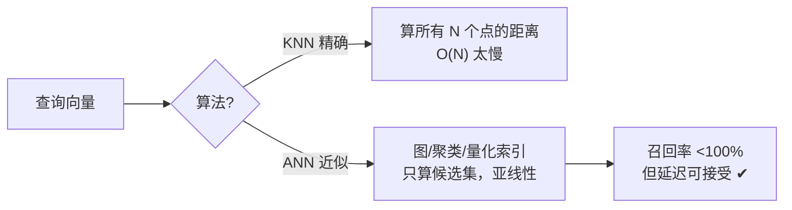
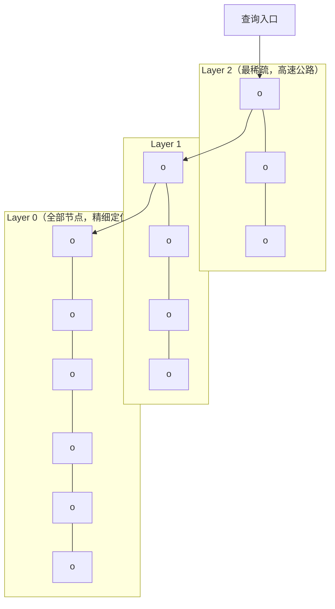
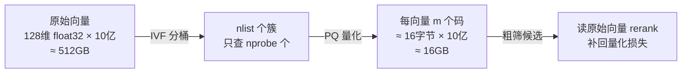
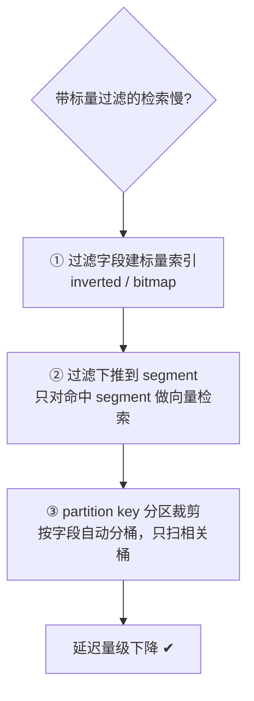
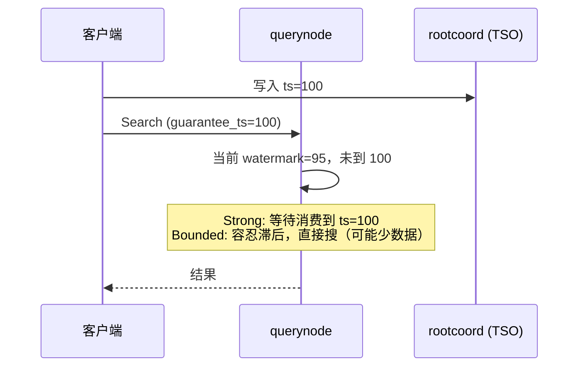
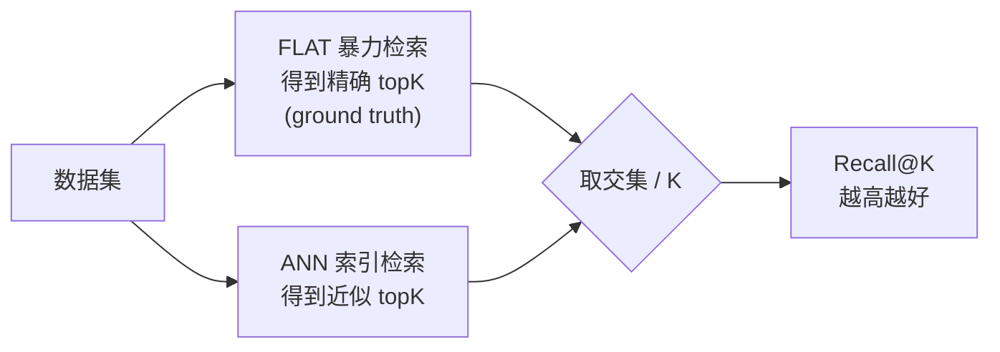
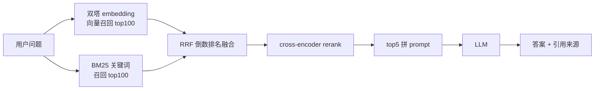
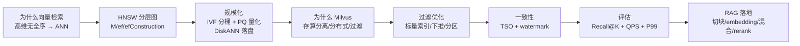

# 向量检索面试，连问三层都不慌——Milvus 面试题集

> 属于 S10 向量数据库 Milvus · 收口篇
> 上一篇：[Milvus Go 实战](./07-Milvus-Go实战)

S10 的高频面试题都在这了，8 道题，每题都按"**问题 → 参考答案 → 追问1 → 追问2 → 追问3**"练到三层。答题时始终扣住"原理 → 参数 → 权衡 → 落地"这条主线，并把话题引回你自己的项目（docs-rag / Milvus demo），这是实习生面试最加分的姿态。每题末尾附一句**记忆点**，面试前 30 分钟扫一遍够用。

## Q1：向量检索的原理是什么？为什么不能用 B+ 树 / 哈希？

**参考答案**（结构化要点）：
1. **数据形态**：非结构化数据（文本/图/音视频）经 embedding 模型变成固定维度的稠密向量，语义相近 → 向量距离近。
2. **检索本质**：在向量空间里找与查询向量"距离最近"的 K 个点（KNN）。距离度量三选一：

| 度量 | 公式含义 | 典型场景 |
|------|---------|---------|
| **欧氏距离 L2** | 绝对距离，`sqrt(Σ(aᵢ-bᵢ)²)` | 特征本身有物理意义 |
| **内积 IP** | 点积，越大越相似 | 打分/匹配，通常先归一化 |
| **余弦 COSINE** | 夹角余弦，只看方向不看长度 | 文本/图片语义检索 |

3. **为什么不用 B+ 树**：B+ 树是为"一维有序"设计的，靠比较大小做范围查询；高维空间（128/768/1024 维）**没有全序**，无法定义"谁比谁大"，索引树会退化成高维点簇，剪枝失效。
4. **为什么不用哈希**：哈希只回答"相等不相等"，而向量检索要的是"相似不相似"——两个语义相近的向量哈希值完全不同，精确哈希在向量场景没有意义（局部敏感哈希 LSH 是例外，用"相似的输入哈希后大概率落在同一个桶"做近似，但召回和维度适配都不如 ANN）。
5. **结论**：向量检索走 **ANN（近似最近邻）**——用索引结构把"全量距离计算"变成"大概率更近的候选集"，牺牲可证明的最优，换回可接受的延迟。

**追问1：ANN 和 KNN 的区别？** KNN 是精确答案：算完所有点距离取前 K；ANN 是近似答案：用索引剪枝，只算候选集，召回率 < 100% 但延迟从 O(N) 降到亚线性。**用召回率（Recall@K）衡量"近似"损失了多少**（见 Q7）。

**追问2：三种距离度量分别什么时候用？** 文本/图片语义检索一般用 COSINE（对向量模长不敏感）；特征本身有物理意义且要绝对距离时用 L2；打分/匹配类场景（如推荐）用 IP。**陷阱：IP 和 COSINE 在向量未归一化时结果不同**，所以用 IP 前通常先 L2 归一化。

**追问3（提示）：B+ 树真的完全没用吗？** 不是。B+ 树仍用于**标量过滤**——向量检索前用 `category == "go"` 这类条件过滤，靠的就是标量索引（inverted / B+ 树系）。所以真实系统是"向量索引找相似 + 标量索引做过滤"双引擎（见 Q5）。答出这层，说明你理解混合查询。

> 记忆点：**高维无全序 → 用不了 B+ 树；相似不相似 → 用不了哈希；所以 ANN**。度量三选一：L2 绝对距离、IP 点积、COSINE 看方向。

## Q2：HNSW 的原理是什么？M / ef / efConstruction 怎么影响性能？

**参考答案**：
1. **核心思想**：HNSW = **分层可导航小世界图（Hierarchical Navigable Small World）**。把向量建成多层图：**底层（layer 0）包含全部节点**，越往上节点越稀疏；每层内每个节点连接最多 M 个邻居。
2. **插入**：从顶层入口开始贪心搜索，逐层往下找到最近位置，再在底层建立双向连接（插入时决定哪些节点当邻居——用"启发式选边"保证图的可导航性）。
3. **检索**：同样从顶层入口开始，每层做**贪心搜索**（当前节点 → 与查询更近的邻居），逼近局部最优后进入下一层，最后一层得到候选集。
4. **为什么快**：顶层图是"高速公路"——几步就能跳到查询附近的大致区域；底层图负责精细定位。搜索路径长度与 log(N) 相关。

参数影响（这是面试最爱的表格）：

| 参数 | 阶段 | 调大 | 典型值 |
|------|------|------|--------|
| **M** | 建图 | 连接数↑ → 图更稠密，召回↑、内存↑、建图慢 | 8~64，常用 16/32 |
| **efConstruction** | 建图 | 建图时候选集↑ → 建图更久、图质量更好（召回↑） | 8~512，常用 64~200 |
| **ef** | 检索 | 检索候选集↑ → 召回↑、延迟↑ | 1~32768，常用 64~512 |

**追问1：为什么高召回场景优先调 ef 而不是 M？** M 影响内存和建图成本，上线后改 M 要**重建索引**；ef 是纯检索期参数，运行时改完立刻生效。所以"在线调参救召回"第一反应是 ef，M 是建图时就要定好的。

**追问2：HNSW 的内存代价为什么高？** 每个节点要存它的邻居列表（指针 + 距离），图结构本身吃内存，且**索引要整体驻留内存**才能低延迟访问。所以亿级数据上 HNSW 内存压力大——这正是 Q3 的 IVF-PQ、以及 DiskANN（索引落盘）存在的理由。

**追问3（提示）：为什么说 HNSW 是"可导航小世界"？** 小世界网络特性 = 任意两点之间的最短路径很短（六度分隔）。图里加"长跳边"（高层稀疏连接），让搜索能快速跨越向量空间的远距离区域——这是"几步就到目标区域"的理论基础。答出"长跳边 + 分层稀疏"就到位了。

> 记忆点：**M 建图定稠密、efConstruction 建图定质量、ef 检索定召回**；上线后救召回先动 ef（不用重建索引）。

## Q3：IVF 与 PQ 分别解决什么问题？IVF-PQ 为什么能扛亿级？

**参考答案**：
1. **IVF（倒排文件）解决"搜索范围"**：建索引时用 **k-means 把全部向量聚成 nlist 个簇**，每簇一个质心，向量只属于最近的簇；检索时只查与查询最近的 **nprobe 个簇**，把全量扫描变成"扫几个桶"。nlist↑ 桶更细召回更好但建索引更慢；nprobe↑ 召回↑延迟↑。
2. **PQ（乘积量化）解决"内存占用"**：把 d 维向量切成 m 段，每段单独用 k-means 量化成 nbits 位码（通常 8 位 = 256 个码本项）。**每个向量不再存原始 float32，只存 m 个码**——128 维 float32 要 512 字节，m=16、nbits=8 的 PQ 只要 16 字节，压缩约 32 倍。查询时用"查表法"（码本距离表）近似算距离。
3. **IVF-PQ = 先分桶缩范围 + 再量化缩内存**：两者叠加，**内存占用降 10~20 倍，检索范围降 nlist/nprobe 分之一**，让"十亿级向量放进内存索引"成为可能。

**追问1：PQ 的距离是精确的吗？** 不是。**量化本身有信息损失**——原始向量被"压缩成码"后再算的距离是近似距离，召回会掉。所以用 PQ 要用更大的 nprobe 补偿召回损失，或对 topK 结果做**重排序（rerank）**：先用 PQ 粗筛出候选，再对候选读原始向量精算距离。

**追问2：量化码本是怎么来的？** 建索引时用**训练数据（抽样）做 k-means 聚类**得到每段的质心表（码本）。所以 **IVF/PQ 建索引依赖样本分布**：训练集和真实数据分布差异大，召回会明显变差。这也是"索引要随数据更新重建"的原因之一。

**追问3（提示）：为什么说"亿级"是分水岭？** 十亿级 × 512 字节 ≈ 512GB 原始数据，内存放不下；PQ 压缩后 ≈ 16GB，单机内存就能扛。面试答"**IVF 管范围、PQ 管内存、rerank 补精度**"三件套，直接封神。

> 记忆点：**IVF 管范围（nlist/nprobe）、PQ 管内存（m/nbits）、rerank 补精度**；码本来自训练数据抽样聚类，所以索引依赖数据分布。

## Q4：为什么选 Milvus 而不是 ES / FAISS / pgvector？

**参考答案**（对比表格）：
| 维度 | Milvus | ES | FAISS | pgvector |
|------|--------|----|-------|----------|
| 形态 | 分布式数据库（服务） | 搜索引擎 + kNN 插件 | **纯库（lib）** | PG 扩展 |
| 持久化/CRUD | ✔ 内置 | ✔ | ✘ 只管内存计算 | ✔ |
| 分布式/水平扩展 | ✔ 存算分离，节点随便加 | 尚可但为文档设计 | ✘ 单机 | ✘ 单机（PG 集群复杂） |
| 亿级+向量 | ✔ 分区 + 量化 + 多副本 | 吃力 | 自己拼工程 | 吃力 |
| 标量过滤 | ✔ 过滤下推 + 标量索引 | ✔ 强（ES 看家本领） | ✘ 无 | ✔（SQL 强） |
| 运维生态 | 算子/helm/监控/备份 | 成熟 | 无 | 随 PG |

**为什么选 Milvus**：① **分布式 + 存算分离**——datanode 存、querynode 算、indexnode 建索引，各自水平扩展，这是亿级数据的命门；② **服务化**——CRUD、多副本、一致性、多租户、监控开箱即用，FAISS 只是算法库，工程全要自己搭；③ **向量 + 标量混合过滤是原生能力**（过滤下推到 segment 级别）；④ **字节系/大厂生产常用**（Milvus 是 LF AI & Data 基金会项目，Zilliz 主导），面试讲"生态和生产验证"有说服力。

**追问1：那 ES 什么时候合适？** 当业务**本质是文本/日志搜索**、向量只是辅助时，ES 的倒排 + BM25 + 分词生态更强；且团队已有 ES 运维能力。纯向量 workload 或亿级规模，ES 的 kNN 性能和资源效率明显不如专用库。**选型金句：文档检索选 ES，向量主战场选 Milvus，能混用（ES 出关键词候选 + Milvus 出向量候选再融合）。**

**追问2：FAISS 在什么场景仍是首选？** 离线/批处理、对召回和速度极致调优、不想维护服务——比如研究实验、推荐系统的离线向量召回模块。**"FAISS 是引擎，Milvus 是整车"**：Milvus 的索引体系本身就和 FAISS 同源同思路。

**追问3（提示）：pgvector 的短板具体在哪？** 单机内存和 CPU 算力上限，索引（IVFFlat/HNSW）在千万级之后 recall 和延迟都吃紧；没有存算分离，扩缩容绑死 PG。小数据量（百万内）+ 已有 PG 业务，pgvector 是最省事的，**"够用就好，量级决定选型"**。

> 记忆点：**FAISS 是引擎、Milvus 是整车；ES 强在文本、Milvus 强在纯向量 + 亿级 + 混合过滤；pgvector 百万内够用**。

## Q5：向量检索 + 标量过滤为什么慢？怎么优化？

**参考答案**：
1. **慢的本质**：标量过滤和向量相似度是**两种不同性质的检索**——向量要"找最近"，标量要"精确匹配"。两者的执行顺序决定了性能。
2. **顺序一（先过滤后向量）**：过滤后的候选集可能非常小（条件太紧），小集合上向量索引优势尽失，甚至退化；候选为 0 则检索直接没结果。
3. **顺序二（先向量后过滤）**：向量 topK 结果里过一遍标量条件，**可能全部被过滤掉**，导致结果不足 K 条——这就是"搜出来的东西不对"的根源。
4. **优化三板斧**：

   - **标量索引**：过滤字段建 inverted index / bitmap index，过滤本身从全表扫描变索引查找；
   - **过滤下推**：把过滤条件推到 segment 级——先扫 segment 的标量索引，只对命中的 segment 做向量检索（Milvus 原生支持，这就是"分段式过滤"）；
   - **分区裁剪（partition key）**：建集合时声明 partition key 字段（如 `tenant_id`），数据按该字段自动分桶，检索自动只扫相关分区——**过滤从"每条比"变成"只进一个桶"**，这是量级上的优化。

**追问1：filter 和 prefilter 的区别？** 概念上：prefilter = 先按标量过滤得到候选集，再在其中做向量检索（候选小则快，但可能牺牲召回）；filter = 先向量检索再过滤。Milvus 通过下推和分区把两者优势合并——**"过滤在 segment 内做、且用标量索引"**，回答时别把 Milvus 的 filter 参数和这两个概念搞混，说出"下推 + 分区"就赢了。

**追问2：为什么带过滤后 topK 经常凑不满？** 向量 topK 命中的恰好被标量条件滤掉了。解法：**提高检索的 topK（如取 100 再滤到 5）**，或让过滤提前生效（分区/下推），本质是"扩大候选池再精确筛选"。

**追问3（提示）：过滤字段要怎么设计？** 区分"高频过滤字段"（租户、分类、时间范围——适合建标量索引 + partition key）和"低频字段"（别什么都建索引，索引也有内存和写入成本）。答出"**索引不是越多越好，按过滤频率设计**"显工程判断力。

> 记忆点：**标量索引 + 过滤下推 + partition key 分区裁剪**；topK 凑不满 = 候选池太小，先扩 topK 再精筛。

## Q6：Milvus 的一致性级别怎么选？写入后查不到怎么办？

**参考答案**：
1. **背景**：Milvus 存算分离，写入先进消息队列 + datanode，**querynode 内存里不一定有最新数据**（streaming 数据同步有延迟）。一致性级别本质是"查询愿意等多久，保证能看到多新的数据"。
2. **四个级别**（Milvus 2.5，默认 **Bounded**）：

| 级别 | 含义 | 代价 |
|------|------|------|
| **Strong** | 用最新时间戳做 guarantee timestamp，querynode 必须等到可见性满足 | 延迟最高 |
| **Bounded（默认）** | 容忍一定滞后（grace time 窗口），多数场景够用 | 延迟可控 |
| **Session** | 保证"读己之写"：客户端自己插入的立即可见 | 中等 |
| **Eventually** | 不校验，立刻搜 | 可能读不到刚写的数据 |

3. **写入后查不到怎么办**：默认 Bounded 下，刚 Insert 的数据可能不在 querynode 可见范围。解法按需选：单次查询用 `WithSearchQueryConsistencyLevel(entity.ClStrong)`（Go SDK 的 SearchOption）；写后立即读的强一致场景直接建集合时把一致性级别设为 Strong；或等 `Flush` 完成、数据进入 batch 数据后再查。

**追问1：Strong 是怎么实现的？** 全局**时间戳（TSO）** 由 rootcoord 统一发放，保证全局单调递增；查询带上 guarantee timestamp，**querynode 通过消息队列的 watermark 判断自己消费到了哪个时间点**，没到就等待。答出"TSO + watermark + 等待机制"就是完整答案。

**追问2：Bounded 的"界"是什么？** 允许查询看到的数据比最新写入滞后不超过某个窗口（grace time）。它在"读最新"和"低延迟"之间取平衡——**大部分业务（RAG 检索、推荐）不需要强一致**，默认 Bounded 是最佳性价比。

**追问3（提示）：Session 和 Strong 的区别？** Session 只保证"自己的写入可见"，别的客户端写入不管；Strong 保证**所有已提交写入**可见（线性一致）。所以"用户刚传完文档立刻检索"用 Session 就够，"全系统都要看到同一版本"才需要 Strong。

> 记忆点：**TSO 发全局时间戳、watermark 表示消费进度、guarantee_ts 决定查询等多久**；写后查不到 → 单次查用 Strong / Session，或等 Flush。

## Q7：如何评估向量检索的效果与性能？

**参考答案**：
1. **效果（准不准）**：
   - **Recall@K**：真实 topK（暴力精确算）里有几个被 ANN 找回来了，召回率 = 命中数 / K。越高越好，一般 0.9+ 才敢上线；
   - **精确率 / MAP / NDCG**：结果相关性排序质量的经典 IR 指标（有标注数据集时用）；
   - **业务指标**：RAG 场景直接看答案命中率/用户满意度——**效果最终以业务为准**。
2. **性能（快不快）**：**QPS**（吞吐）、**P99 / P95 延迟**（毛刺比均值重要）、内存占用、索引构建耗时、写入吞吐。压测要模拟真实查询分布和并发，别用单线程跑。
3. **索引选型矩阵**（面试高频）：

| 数据量 | 内存够 | 首选 | 备选 |
|--------|--------|------|------|
| 百万内 | ✔ | HNSW（低延迟高召回） | IVF_FLAT |
| 千万级 | ✔ | HNSW / IVF_PQ | SCANN |
| 亿级 | ✔ | IVF_PQ | SCANN / GPU 索引 |
| 亿级+ | ✘（内存不够） | DiskANN（落盘） | 分层召回 |

**追问1：Recall@K 怎么测？** 建一个小数据集（如 1 万条），用**暴力检索（FLAT 索引）算出精确 topK 作为 ground truth**，再和 ANN 检索结果比对算命中率。注意：**FLAT 索引本身要参与对比**，它没有近似损失，是召回率的基准线。

**追问2：调参怎么平衡 QPS 和延迟？** 同一索引下"召回 = f(ef/nprobe)"单调，但 QPS 反比——**先定召回底线（如 Recall@K ≥ 0.95），再最小化延迟/最大化 QPS**；QPS 不够就加副本/加节点（水平扩展是 Milvus 的强项）。回答要体现"先指标后参数，用数据说话"。

**追问3（提示）：为什么 P99 比平均延迟重要？** 平均值被大量快请求拉低，掩盖长尾；**P99 毛刺直接决定用户体感**（最慢的 1% 用户 = 最容易流失的 1%）。回答时补一句"监控要同时看 P99 和 QPS，以及两者随并发的变化曲线"，显得有运维实战感。

> 记忆点：**效果看 Recall@K（FLAT 做基准）、性能看 QPS + P99**；先定召回底线再调 ef/nprobe，不够就加副本。

## Q8：在 RAG 系统里向量库怎么落地？

**参考答案**（流程 + 关键决策）：
1. **链路**：文档加载 → **切块（chunk）** → **embedding 向量化** → 写入向量库（带 metadata）→ 查询时问题向量化 → 向量 + 关键词**混合检索** → **rerank 重排** → 拼 prompt 送 LLM。
2. **切块决策**：块太大 → 语义混杂、命中不精准；块太小 → 上下文碎片化、召回噪音大。常用 200~500 token + 10~20% 重叠；**结构化文档按标题/段落切**，保留层级信息做引用溯源。
3. **embedding 选型**：看三件事——**维度**（768/1024 常见，越高越贵）、**语义能力**（中文场景选中文优化模型）、**成本与延迟**。**查询向量和文档向量必须用同一个模型**（embedding 空间才可比）。
4. **混合检索**：向量管语义（"怎么给视频加水印"），BM25 管关键词精确匹配（"水印 设置 入口"）。**两种结果用 RRF（倒数排名融合）合并**：`score = Σ 1/(k + rank)`，把两个 list 的排名变成融合分数——简单、无需调权、效果稳。
5. **rerank**：混合检索 top 100 → **cross-encoder 重排**（query 和 doc 一起过模型，语义匹配打分）→ 取 top 5 进 prompt。召回用双塔（快），精排用 cross-encoder（准），**"粗召回 + 精重排"是 RAG 检索的标准姿势**。
6. **metadata 过滤**：向量库里每块 chunk 带 `doc_id / category / 更新时间` 等字段，检索时用 Q5 的过滤能力（partition key + 标量索引）**只搜相关文档子集**，召回和延迟双赢。

**追问1：检索不准，先动哪一环？** 按"**切块 → embedding → 混合检索 → rerank**"顺序排查：块粒度对不对（Bad Case 看是碎片化还是混杂）→ embedding 模型对领域词汇是否有效 → 单向量检索召回够不够（不够才上混合）→ rerank 有没有把相关文档提上来。**别一上来就换模型，先用 Bad Case 定位环节**——这就是 docs-rag 项目"命中率 61% → 四件套优化到 82%"的复盘逻辑。

**追问2：为什么向量检索召回 5 个不够，要召回 100 再重排？** 双塔 embedding 的排序质量有限——top5 里可能混进语义相近但实际无关的（如都讲"水印"但一个是防盗链一个是加水印）；召回 100 个候选再重排，**让更强的模型在更大的池子里精挑**，能显著提升最终命中率，代价只是多算 95 个 rerank 分数。

**追问3（提示）：怎么避免"答非所问"？** 三道闸：**检索质量**（上面的全套）、**prompt 约束**（"只依据资料回答，没有就说不知道"）、**引用溯源**（每个答案块带 chunk 来源，用户可查证、迭代可归因）。答出"检索是 RAG 的瓶颈 + 引用溯源"两点，面试官就知道你真做过。

> 记忆点：**粗召回（双塔）+ 精重排（cross-encoder）+ 混合检索 RRF + metadata 过滤**；查不准先定位环节，别盲目换模型。

---

## 向量数据库面试主线：3 分钟复述提纲

把 8 题串成一条线，从原理讲到落地：

- **30 秒版**（原理）：向量检索 = embedding 把语义变成空间距离，高维无全序所以用 ANN；HNSW 用分层小世界图把搜索从 O(N) 降到亚线性。
- **1 分钟版**（+规模化与选型）：亿级数据靠 IVF 缩范围 + PQ 缩内存 + rerank 补精度；选 Milvus 因为它分布式、存算分离、原生混合过滤、生产生态成熟；过滤慢就用标量索引 + 下推 + partition key。
- **3 分钟版**（+工程落地）：一致性用 TSO + watermark 理解"写后查不到"；效果用 Recall@K、性能用 QPS/P99 评估；最后落进 RAG——切块、embedding 选型、混合检索 + RRF、cross-encoder rerank、metadata 过滤，每一步都能接你的 docs-rag 项目实例。

## 自测清单

八题 + 三层追问全答上，S10 过关。核心追问链：**ANN 原理与度量 → HNSW 三参数权衡 → IVF-PQ 分桶量化与内存账 → Milvus 四选一对比 → 混合过滤三板斧 → TSO/watermark 一致性 → Recall@K 与 QPS/P99 评估 → RAG 检索全链路**。面试讲 RAG 项目时，能主动画出"切块 → 双塔粗召回 → 混合检索 RRF → cross-encoder 重排 → metadata 过滤"的流程图，并用 Bad Case + 指标数据说话，是实习生里最亮的那一批。
