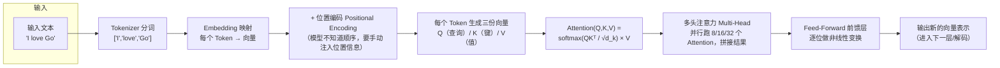
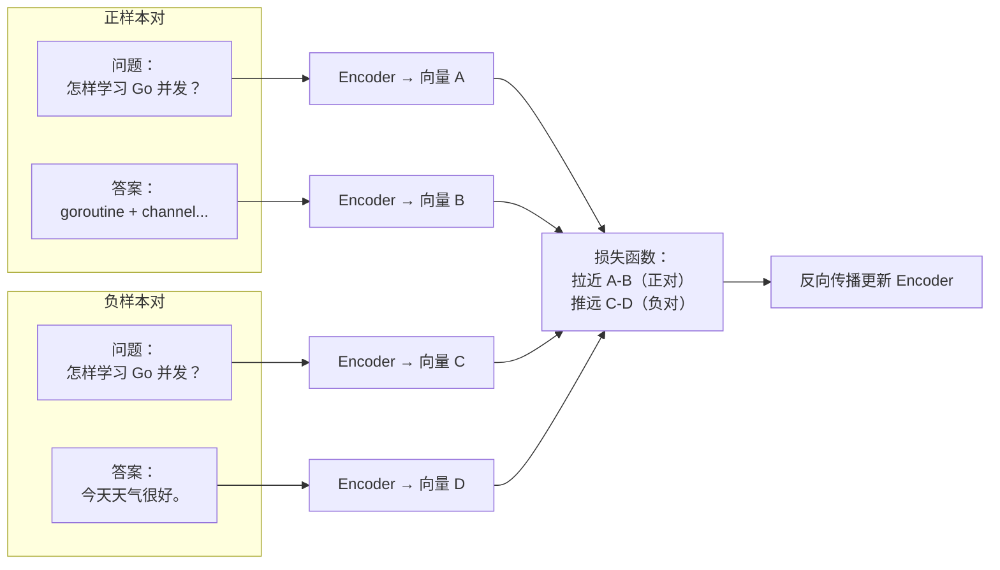
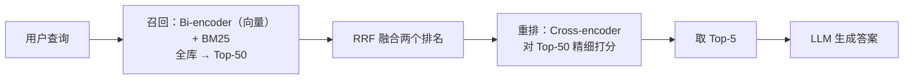

# 01 · RAG 原理与 LLM 基础

> 来源：导师《Agent 学习路径》第 1 章提炼展开版。本章是所有 Agent 知识的**地基**：Transformer 决定模型怎么"看懂"文本，Embedding 决定检索怎么"理解"语义，BM25/RRF/Cross-encoder 决定 BinRag 的检索链路为什么这样设计。
> 面试要求：**不需要推导公式，需要能给面试官画图讲清楚流程。**

## 本章学习目标

1. 能画图讲清 Transformer 自注意力的完整流程（Tokenizer → Embedding → Q/K/V → softmax → 多头 → FFN）。
2. 能解释 Token 和 Context Window 是什么，以及"Context Window 满了怎么办"的三种解法。
3. 能解释 Embedding 的训练方式（对比学习）与相似度计算（余弦），知道向量数据库和 ANN 是什么。
4. 能讲清 BM25 的三个关键思想（TF 上限 / IDF / 长度归一化），以及它和向量检索的适用场景。
5. 能推导 RRF 公式、解释"为什么用 RRF 而不是直接加权平均"。
6. 能对比 Cross-encoder 与 Bi-encoder，并讲清 BinRag 两阶段管道的设计原因。

## 核心知识点提炼

| 知识点 | 一句话核心 | 面试要会画/会讲 |
|--------|-----------|----------------|
| Self-Attention | 每个词看其他词多少，`softmax(QKᵀ/√d_k)·V` | Attention 计算流程图 |
| Token / Context Window | 模型一次能处理的输入上限，超了就看不到 | 超限的三种解法 |
| Embedding | 文本 → 高维向量，语义近则向量近（对比学习训练） | 正负样本对训练示意 |
| 余弦相似度 | 只看方向夹角，不受长度影响，值域 [-1,1] | 公式 + 直觉 |
| 向量数据库 | 存百万级向量 + ANN 近似最近邻搜索 | 与暴力搜索的对比 |
| BM25 | 词频 × 稀缺性的关键词打分，有 TF 上限和长度归一化 | TF/IDF/长度三思想 |
| RRF | `Σ 1/(k+rank)` 合并多个排名，k=60 | 为什么比加权平均鲁棒 |
| Bi-encoder | 查询和文档分别编码算距离，快、可预计算 | 召回阶段 |
| Cross-encoder | 拼接后一起算，慢但精度高 | 重排阶段 |

---

## 1.1 Transformer 和注意力机制

### 1.1.1 解决的问题

在 RNN 时代，模型要"按顺序"读句子，长句子的早期信息会被慢慢遗忘（梯度消失）。Transformer 换了个思路：**一句话里每个词要"看"其他所有词多少，由此得出每个词的向量表示** —— 所有词之间直接互相看，不存在"顺序遗忘"。

Self-Attention（自注意力）里的 Self 指的是：**句子内部的词互相看**（对比后面第 7 章的 Cross-Attention，那是"文本和图像互相看"）。

### 1.1.2 完整流程（面试画图用）

逐步骤讲解（配合上图）：

1. **Tokenizer 切分**：文本 → Token 序列。`I love Go` 可能切成 `['I', 'love', 'Go']`（也可能更细，取决于词表）。
2. **Embedding 映射**：每个 Token 查表映射为向量（比如 512 维）。此时只是"词查表"，还没有上下文。
3. **位置编码**：Transformer 没有顺序概念（不像 RNN 一步步读），所以要给每个位置的向量加一个位置编码，告诉模型"第 3 个词和前面的词位置不同"。这就是为什么 Transformer 不递归也能处理顺序。
4. **生成 Q/K/V**：每个 Token 的向量乘三个不同的权重矩阵，得到三个新向量：
   - **Q（Query，查询）**：我"想要找什么"；
   - **K（Key，键）**：我"能提供什么标签"；
   - **V（Value，值）**：我"实际携带的内容"。
5. **打分与归一化**：`Q·Kᵀ` 算出"我和每个词的相关度"，除以 `√d_k`（缩放，防止点积过大导致 softmax 梯度消失），再过 softmax 变成权重（所有词权重和为 1）。
6. **加权求和**：用权重对 V 加权求和，得到该 Token 的新表示 —— 它现在"看过"全句所有词，重点词权重高。
7. **多头注意力**：同样的流程并行跑 8/16/32 份（每份用不同的 Q/K/V 投影），拼接结果。意义：不同头学到不同维度的关系（一个头注意语法、一个头注意指代、一个头注意语义）。
8. **前馈层**：对每个位置的向量做一次全连接变换，增加模型容量，然后进入下一层（大模型有几十上百层）。

**面试画图要点**：Q/K/V 的比喻（图书馆找书：Q 是你的问题、K 是书的标签、V 是书的内容），softmax 的"注意力权重"直觉，多头"分工"直觉。

### 1.1.3 Token 和 Context Window

- **Token 是什么**：模型处理文本的最小单位。≈ 0.75 个英文单词；1 个中文汉字约等于 1-2 个 Token。
- **Context Window 是什么**：模型一次能处理的最大 Token 数。GPT-4 是 128K，Qwen 系列最大 1M。
- **关键结论**：**超过 Context Window 的内容模型看不到** → 这是 RAG 存在的根本原因之一（另一个是知识截止日期）。

**Context Window 满了怎么办**（高频追问）：
1. **摘要压缩**：把早期对话/文档压缩成摘要，占位小（详见第 6 章"摘要压缩"）。
2. **RAG**：不把所有内容塞进去，只检索最相关的片段送进去（本系列第 2 章）。
3. **长上下文模型**：换 Context Window 更大的模型（如 Qwen 1M），但成本线性上涨，且"中间迷失"问题（长文里中间内容被忽略）依然存在。

---

## 1.2 Embedding 向量化原理

BinRag 里用了向量检索，面试官一定会问：**"向量从哪来？"**

### 1.2.1 核心概念

Embedding 是把文本转换为**高维向量**的过程，目标是：**语义相近的文本，向量距离也近**。

- "苹果"和"水果"的向量应该近；
- "苹果"和"数据库"的向量应该远。

### 1.2.2 训练方式：对比学习（Contrastive Learning）

训练三步：
1. **准备正样本对**：语义相近的句子对（问题↔答案、原文↔改写、同义词句子）。
2. **准备负样本对**：语义无关的句子对（随机采样即可）。
3. **训练目标**：正样本对的向量距离小、负样本对的向量距离大。训练完成后，Encoder 就把"语义"编码进了向量空间。

典型模型：`text-embedding-3-small`（OpenAI）、`bge-m3`（BAAI，中文最强之一，BinRag 可选）。

### 1.2.3 相似度计算：余弦相似度

最常用的度量，衡量**向量方向的夹角**，不受向量长度影响：

$$\cos(A,B) = \frac{A \cdot B}{|A| \times |B|}$$

- 值域 [-1, 1]，越大越相似；
- 1 = 方向完全相同，0 = 正交（无关），-1 = 方向相反；
- 为什么不用欧氏距离？因为向量长度往往编码了"词频/信息量"等与语义无关的信息，余弦只看方向更稳。归一化后的向量（L2 norm 化）两者等价，但工程上余弦仍更常用。

### 1.2.4 向量数据库的作用

问题：全库几百万条向量，每次都算一遍余弦距离，太慢（暴力搜索 O(N)）。

向量数据库解决两件事：
1. **存储**：高效存数百万级向量（含元数据、索引）。
2. **ANN 搜索**：近似最近邻（Approximate Nearest Neighbor），不暴力算所有距离，用索引结构（HNSW、IVF 等）快速逼近 Top-K，毫秒级返回。

常见：Milvus、Qdrant、Chroma、pgvector（PostgreSQL 扩展，小规模项目够用）。Go 侧对接：Milvus 有官方 Go SDK；pgvector 直接走 `pgx`/`database/sql` 即可。

---

## 1.3 BM25 算法原理

### 1.3.1 核心概念

BM25 是**基于关键词**的传统信息检索算法：不需要向量，直接根据**词频**计算文档和查询的相关性。面试不要求背公式，要**理解思想**。

BM25 分数 ≈ Σ（词在文档里出现的频率 × 文档稀缺性权重）

### 1.3.2 三个关键思想

1. **TF（词频）**：一个词在文档里出现越多，越相关 —— **但有上限**，避免刷词。比如"Go Go Go Go"不会比出现 3 次的文档相关 4 倍，增长是亚线性的（饱和）。
2. **IDF（逆文档频率）**：一个词在所有文档里**越少见，出现时越有价值**。"量子纠缠"在 100 万篇文档里只出现 10 次，一旦出现就是强信号；"的"每篇都有，权重接近 0。这就是 IDF = log(总文档数 / 含该词的文档数) 的直觉。
3. **文档长度归一化**：长文档里词频天然高（1000 词的文档出现"Go" 10 次很平常，100 词的文档出现 10 次很惊人），所以要除以文档长度修正，否则长文档永远占便宜。

### 1.3.3 BM25 vs 向量检索

| 维度 | BM25（关键词） | 向量检索（语义） |
|------|----------------|------------------|
| 原理 | 精确词匹配 + 词频统计 | 语义向量距离 |
| 优势 | 精确匹配、快、可解释（知道命中哪个词） | 捕捉语义、处理同义词（"手机"和"iPhone"能匹配上） |
| 劣势 | 不理解语义，词不同就匹配不到 | 无法精确匹配（"A80542"这种 ID 会被语义化、弄丢） |
| 适合场景 | 专有名词、代码、ID、型号查询 | 模糊语义查询、自然语言问题 |
| 面试金句 | "BM25 管得准，向量管得懂" | 两者互补 → 所以 BinRag 做混合检索 |

---

## 1.4 RRF（倒数排名融合）为什么有效

### 1.4.1 要解决的问题

BM25 给了一个排名，向量检索给了另一个排名，**怎么合成一个最终排名**？最直觉的做法是"分数加权平均"——但立刻踩坑：

- BM25 分数和向量相似度分数**量纲不同**（一个是词频统计值，一个是余弦值），直接相加/加权没有意义；
- 一个检索器内部分数分布还很怪异（比如 BM25 前两名都是 20 分，第三名突然 3 分）。

RRF 的解法：**不看分数，看名次**。

### 1.4.2 公式

$$RRF\_score(d) = \sum_i \frac{1}{k + rank_i(d)}$$

- d：某一篇文档；
- rank_i(d)：文档 d 在第 i 个排名列表里的**名次**（第 1 名、第 3 名…）；
- k：常数，通常取 **60**（平滑系数，防止排名第 1 的文档权重过大）。

### 1.4.3 为什么有效（面试核心）

1. **名次比分数更稳定**：BM25 的分数和向量相似度分数在不同量纲，无法直接相加；但"第 3 名"在哪个系统里都是"第 3 名"——把排名转成 1/(k+rank)，天然统一了量纲。
2. **防止单一检索方式的偏差**：某文档在向量检索里排第 2、BM25 里排第 10，综合下来仍然很靠前；反过来，只有一种检索器认为它好，另一种排 100 名开外，综合分就被拉低。
3. **长尾自动被压制**：`1/(60+100)` 远小于 `1/(60+1)`，排在 100 名后的文档对最终分数几乎无贡献，不需要额外剪枝。

**一句话总结设计哲学**：一个方法说它好，不一定真的好；多个方法都说它好，那就真的好。具体实现是对每个文档累加它在各检索列表中排名的倒数（加常数 k 防止头部垄断），这样在多个排名系统里都靠前的文档获得最高综合分，比直接对分数加权更鲁棒，因为避免了跨系统的分数量纲问题。

### 1.4.4 数字示例（面试可随手举例）

假设 BM25 排名：A=1, B=2, C=3；向量排名：B=1, A=5, C=10（k=60）：

| 文档 | RRF 来自 BM25 | RRF 来自向量 | 总分 |
|------|--------------|--------------|------|
| A | 1/61 ≈ 0.0164 | 1/65 ≈ 0.0154 | **0.0318** |
| B | 1/62 ≈ 0.0161 | 1/61 ≈ 0.0164 | **0.0325** |
| C | 1/63 ≈ 0.0159 | 1/70 ≈ 0.0143 | 0.0302 |

B 在两个系统都靠前 → 总分最高；C 只在 BM25 靠前 → 被压制。这就是"共识"机制。

---

## 1.5 Cross-encoder vs Bi-encoder

BinRag 用了 Cross-encoder 做重排，必须能解释区别。

### 1.5.1 对比表

| 维度 | Bi-encoder | Cross-encoder |
|------|-----------|---------------|
| 工作方式 | 查询和文档**分别**编码成向量，计算向量距离 | 查询和文档**拼接**后一起输入，直接输出相关分 |
| 速度 | 快（文档向量可**预计算**，查询时只算一次查询向量） | 慢（每次查询都要对每个候选文档重新算一遍） |
| 精度 | 中等（各自压缩成向量，丢失了交互信息） | 高（模型能看到两者的词级交互） |
| 用途 | **召回阶段**：从百万文档里找 Top-50/100 | **重排阶段**：对 Top-50 精细排序取 Top-5 |

### 1.5.2 为什么 BinRag 这样设计（两阶段管道）

设计原因（面试回答要点）：
- **第一步**：Bi-encoder（向量 + BM25）从整个知识库**快速**召回 Top-50。因为文档向量是预计算的，这一步是索引查询，毫秒级。
- **第二步**：Cross-encoder 只对 Top-50 做精细排序，取 Top-5 给 LLM。Cross-encoder 对 50 篇重排比对全库重排**快 100 倍**（复杂度从 O(全库) 降到 O(50)），且精度高。

**本质：精度和效率的权衡。** Bi-encoder 把查询和文档独立编码成向量，可以预计算文档向量，查询时只需一次向量检索，速度极快但精度有损；Cross-encoder 把两者拼接让模型"一起看"，精度更高但每次都要重计算，无法扩展到大规模。BinRag 用两阶段管道：Bi-encoder 负责高效召回，Cross-encoder 负责精准重排，平衡了效率和质量。

**追问 1：为什么不直接用 Cross-encoder 做召回？** 因为要遍历全库、每个候选都要拼接重算，慢到不可用（百万文档 × 每次一次前向 = 不可接受）。
**追问 2：重排用什么分数？** Cross-encoder 输出一个相关分（0-1 或 logits），按分数降序取 Top-5，不再需要 RRF。

---

## 面试问答（含参考答案）

**Q1：Transformer 的注意力机制解决了什么问题？**

> 解决的是"如何让一个词在编码时参考句子里的其他词"。RNN 时代模型按顺序读句子，长句的早期信息会随着传播被遗忘；自注意力让句子里的每个词直接和所有其他词两两交互（通过 Q/K/V 打分加权），权重大的词影响更大。它带来了两个关键能力：一是**并行**（所有词同时算，不需要等前面的词），二是**长距离依赖**（相隔再远也能直接互相看到）。

**Q2：Context Window 满了怎么办？**

> 三条路：第一，**摘要压缩**——让 LLM 把早期内容压缩成摘要，用小文本代替大历史；第二，**RAG**——不把全部内容塞进去，只检索与当前问题最相关的片段送入上下文，这也是我们 BinRag 的核心思路；第三，**换长上下文模型**——比如 Qwen 的 1M 窗口，但成本随长度线性上升，而且长上下文有"中间迷失"问题，不是越多越好。

**Q3：向量检索和关键词检索（BM25）各有什么优劣，为什么要混合？**

> BM25 基于词频统计做精确匹配，快、可解释、对专有名词和 ID（比如产品型号）命中率高，但不懂语义，"手机"和"iPhone"匹配不上；向量检索把文本映射成语义向量，能处理同义词和模糊表达，但对精确字符串匹配无能为力，且更慢。两者是互补的：专有名词场景 BM25 强，自然语言语义场景向量强，所以 BinRag 做**混合检索**——两条路都召回，再用 RRF 融合排名，最后 Cross-encoder 重排。

**Q4：你们的 BinRag 为什么用 RRF 而不是直接把两个分数加权平均？**

> 因为 BM25 分数和向量相似度分数**量纲不同**，一个是词频统计值、一个是余弦值，直接加权相加没有数学意义，权重也难调。RRF 不看分数只看**名次**：对每个文档累加它在各检索列表里的 1/(k+rank)，k 取 60 防止第一名权重过大。名次在不同系统间是可比的，"第 3 名"到哪都是第 3 名，所以 RRF 天然统一了量纲；同时它体现"多系统共识"——两个检索器都说好的文档才排最前，单一系统说好的会被长尾压制（1/(60+100) 远小于 1/(60+1)）。

**Q5：Cross-encoder 比 Bi-encoder 精度高，为什么不直接用 Cross-encoder 做召回？**

> 精度高是因为模型能看到查询和文档的**词级交互**，但代价是每个候选都要把查询和文档拼接起来重新跑一遍模型。知识库有几十万篇文档，全量重排的计算量完全不可接受。而 Bi-encoder 的文档向量是**预计算**好的，查询时只需一次向量检索，毫秒级从全库筛出 Top-50。所以正确做法是两阶段：Bi-encoder 负责快而粗的召回，Cross-encoder 只对 Top-50 做精而慢的重排，取 Top-5 给 LLM——这就是 BinRag 的管道设计，本质是**精度和效率的权衡**。

## 自测清单

- [ ] 能不看资料画出 Attention 流程图（Tokenizer → Embedding → 位置编码 → Q/K/V → softmax → 多头 → FFN）。
- [ ] 能解释 Q/K/V 分别代表什么（用"图书馆找书"比喻也行）。
- [ ] 能说出 Token 估算规则（英文 ≈0.75 词/Token，中文 1 字 ≈1-2 Token）和 Context Window 超限的三种解法。
- [ ] 能讲清 Embedding 是怎么训练的（正负样本对 + 对比学习）。
- [ ] 能写出余弦相似度公式并解释为什么用余弦不用欧氏距离。
- [ ] 能说出向量数据库解决的两个问题（存储 + ANN）和两个常见产品（Milvus/pgvector）。
- [ ] 能讲清 BM25 的三个思想（TF 饱和、IDF 稀缺性、长度归一化）。
- [ ] 能随手算一个 RRF 数字示例，并解释 k=60 的作用。
- [ ] 能画 BinRag 两阶段管道图（召回 → RRF → 重排 → Top-5 → LLM）并解释每一步的"为什么"。

## 与既有文档联动

- 30 天冲刺执行版（Day 10-12 RAG 深度优化）：[路线专题/03-大模型与Agent核心能力](../路线专题/03-大模型与Agent核心能力)
- 向量数据库底层原理（HNSW/IVF 索引）：[后端技术栈强化/10-milvus/01-向量检索原理](../后端技术栈强化/10-milvus/01-向量检索原理)
- RAG 全流程工程化（下一章）：[02-RAG 完整原理与 Prompt 工程](./02-RAG完整原理与Prompt工程)
