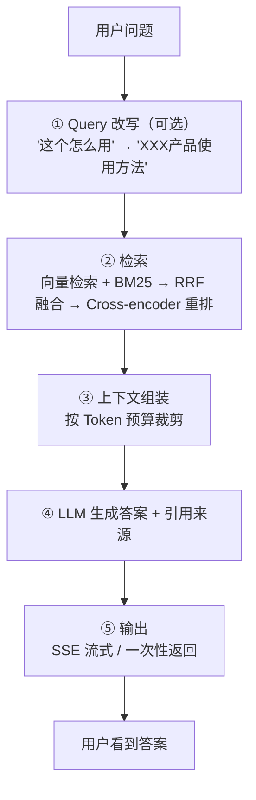
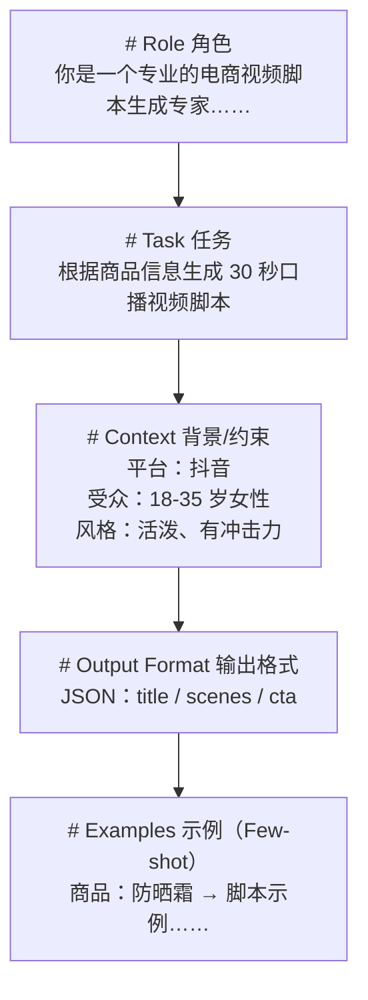

# 02 · RAG 完整原理与 Prompt 工程

> 来源：导师《Agent 学习路径》第 2 章提炼展开版。第 1 章讲的是"零件"（Attention/Embedding/BM25），本章把零件装成 **BinRag 整机**，并系统化讲 Prompt 工程——这是面试官最常让你"现场设计"的两块。

## 本章学习目标

1. 能画出 RAG 完整流程图并讲清每一步的"为什么"（Query 改写 → 检索 → 重排 → 组装 → 生成 → 输出）。
2. 能讲清分块策略（Chunking）的三种方式和 chunk_size / chunk_overlap 两个关键参数。
3. 能解释 Token 预算组装的过程。
4. 能说出 RAGAS 四个评测指标各测什么。
5. 能按"五段式"现场设计一个 Prompt，并解释 CoT、Few-shot、System Prompt 的工程原则。

## 核心知识点提炼

| 知识点 | 一句话核心 | 面试要会讲 |
|--------|-----------|-----------|
| RAG 核心价值 | 把"LLM 记忆"换成"外部知识库"，解决知识截止 + 幻觉 | 为什么 RAG 减少幻觉 |
| Query 改写 | 先让 LLM 把模糊问题改写成自洽搜索词，提升召回质量 | HyDE 进阶 |
| Chunking | 文档切块：固定大小 / 递归字符 / 语义分块 | chunk_size 与 overlap 权衡 |
| Token 预算 | 按重排分数从高到低加上下文，到预算为止 | 组装顺序 |
| RAGAS 四指标 | Faithfulness / Answer Relevancy / Context Recall / Context Precision | 每个指标测什么 |
| 五段式 Prompt | Role → Task → Context → Output Format → Examples | 现场设计 |
| CoT | 让模型分步推理，前面 token 影响后面 | 为什么更准 |
| Few-shot | 给 2-5 个 Input→Output 例子，模型从例子学规律 | 什么时候用 |

---

## 2.1 RAG 完整流程拆解

### 2.1.1 全景图（面试先画这张图）



### 2.1.2 每一步的设计原因

#### ① Query 改写（可选）

- **问题**：用户问"这个怎么用"，"这个"指代不明，直接拿原句去检索，召回质量差——库里根本没有叫"这个"的文档。
- **解法**：让 LLM 先把问题**改写成自洽的搜索 Query**（"XXX 产品的使用方法是什么"），再拿改写后的 Query 去检索。改写用 LLM，本身也是一次便宜的调用。
- **进阶：HyDE（Hypothetical Document Embeddings）**——让 LLM 先**假设一个答案**（不要求正确，要求格式像答案），用"假设答案"的向量去检索。为什么有效？**答案向量比问题向量和文档向量更接近**：问"Go 怎么处理并发"和文档"goroutine 调度详解"的向量距离，远大于一段假设答案"Go 使用 goroutine 和 channel 处理并发……"和该文档的距离。检索本质是"找相似文本"，用长得像文档的东西去找，天然更准。

#### ② 检索（分块策略 Chunking 先行）

**为什么要分块？** 两个原因：一是整篇文档太长放不进 Context Window；二是**太长会稀释信息**——一篇 5000 字的文档里只有一段和问题相关，整篇塞进去，检索分数会被无关内容稀释，LLM 也被噪音干扰。

三种分块方式：

| 方式 | 做法 | 优点 | 缺点 |
|------|------|------|------|
| 固定大小分块（Fixed-size） | 每 N 个字符一刀切 | 简单、快、可控 | **切断语义**（一句话可能被从中间劈开） |
| 递归字符分块（Recursive Character） | 优先按段落/句子/标点切，不行再按字符 | **保留语义完整性**，LangChain 默认 | 块大小不固定 |
| 语义分块（Semantic） | 相似语义的句子合并为一块 | 最准确（块内主题一致） | 最慢（要额外算一遍 embedding） |

**两个关键参数**：
- `chunk_size`（块大小）：块太大，一块覆盖信息太宽泛，检索精度下降；块太小，丢失上下文（一句话的前因后果被切开）。
- `chunk_overlap`（重叠量）：相邻块重叠一部分，**防止信息在切缝处被截断**（比如一句话刚好跨两个块，重叠保证这句话在至少一个块里是完整的）。

**面试陷阱题**：块太大 / 太小分别什么问题？
> 太小 → 丢失上下文，语义不完整，检索可能召回"半句话"；太大 → 一块信息太宽泛，检索精度下降，且浪费 Token 预算。工程上常用递归字符分块 + 适度 overlap（如 500 字符、重叠 50）。

#### ③ 上下文组装（Token 预算）

- **问题**：召回了 5 篇文档，加起来可能超过 LLM 的 Context Window。
- **解法**：按重排分数**从高到低**依次加入上下文，加到 **Token 预算**（如 2000 tokens）为止。分数低的文档在预算不足时被丢弃。
- **工程细节**：组装的 prompt 结构通常是 `System（角色） + 检索到的文档片段（标注来源编号） + 用户问题 + 输出要求（引用来源）`。引用来源让 LLM 在答案里标注 [1][2]，这是"引用来源"能力的实现方式。

#### ④ LLM 生成答案 + 引用来源

LLM 基于检索片段回答，并要求答案**只来自检索内容**（"如果检索内容没有答案，直接说不知道"）——这是减少幻觉的关键指令。

#### ⑤ 输出（SSE 流式 / 一次性返回）

- 生成类应用用 **SSE（Server-Sent Events）** 流式输出，用户看到打字机效果，首字延迟低。
- Go 侧实现：`http.ResponseWriter` + `Flusher`，把每次 LLM 返回的增量 chunk 写入并 `Flush()`；前端用 `EventSource` 或 fetch stream 接收。

**RAG 核心价值总结（面试必背）**：RAG 的核心价值是把"LLM 记忆"（训练数据）换成"外部知识库"，解决**知识截止日期**和**幻觉**两个问题。关键设计决策是：① 分块策略——块太小丢失上下文，块太大信息太宽泛影响检索精度；② 检索阶段——纯向量检索对专有名词命中率低，**混合检索（向量 + BM25 + 重排）**是目前工程上的最佳实践。

### 2.1.3 评测指标（RAGAS 框架）

面试官问"你的 RAG 怎么评测"，答这套：

| 指标 | 英文 | 测什么 | 直观理解 |
|------|------|--------|----------|
| 忠实度 | Faithfulness | 答案是否**完全来自**检索内容，不乱编 | 把答案和检索片段对比，有多少句能在片段里找到依据 |
| 答案相关性 | Answer Relevancy | 答案是否**回答了用户的问题** | 答案跑题不跑题 |
| 上下文召回 | Context Recall | 检索回来的内容**是否包含**正确答案 | 正确答案的要点有多少被检索到了（查全） |
| 上下文精度 | Context Precision | 检索回来的内容里**有多少是有用的** | 检索结果里噪音占比（查准） |

评测方式：用另一个 LLM 当评审模型打分（LLM-as-a-judge），或规则检查（详见第 6 章评测体系）。

---

## 2.2 Prompt Engineering 系统化

核心认知：**Prompt 不是玄学，是结构化工程。** 本质是和 LLM **对齐期望**。

### 2.2.1 五段式 Prompt 结构



**为什么每段都必要**：
1. **Role（角色）**：激活模型的专业知识库——"电商视频专家"比"助手"的措辞、术语、套路更专业。
2. **Task（任务）**：一句话对齐目标，避免模型自作主张。
3. **Context（背景/约束）**：给模型"限制条件"，减少幻觉、规范内容。
4. **Output Format（输出格式）**：**强制 JSON**，否则模型格式随机，下游解析必崩。
5. **Examples（示例，Few-shot）**：降低模型的解释歧义——例子比十句描述都管用。

**完整示例（要能现场写出来）**：

```text
# Role
你是一个专业的电商视频脚本生成专家，擅长为中国电商平台制作吸引人的短视频内容。

# Task
根据用户提供的商品信息，生成一个30秒的口播视频脚本。

# Context
- 目标平台：抖音
- 目标受众：18-35岁女性
- 风格要求：活泼、有冲击力、口语化

# Output Format
请按以下 JSON 格式输出：
{
  "title": "视频标题",
  "scenes": [{"time": "0-5s", "script": "...", "visual": "..."}],
  "cta": "结尾行动号召"
}

# Examples
商品：防晒霜
脚本：姐妹们注意了！今天这款防晒真的绝！...
```

### 2.2.2 CoT（思维链）

- **原理**：在 Prompt 里加"Let's think step by step"（让我们一步步思考），**强迫模型分步推理**。
- **适合**：数学题、逻辑推理、复杂决策。
- **为什么有效**：LLM 是**自回归生成**，**前面生成的 token 影响后面的**——先写出"第一步、第二步"的过程，再写结论，比直接跳到最后一步答案更准。过程本身把推理"外化"成文本，减少了跳步出错。
- **注意事项**：CoT 不是万能的——简单任务用 CoT 反而增加 token 成本和出错的中间环节；且 Prompt 里不应强制模型"必须展示思考过程"给用户看，可以在 System Prompt 里要求"内部推理，只输出最终答案"（或使用 API 的 reasoning 能力）。

### 2.2.3 Few-shot vs Zero-shot

| 方式 | 做法 | 适用 |
|------|------|------|
| Zero-shot | 直接告诉模型做什么，不给例子 | 简单任务够用（"把这段文字翻译成英文"） |
| Few-shot | 给 2-5 个例子（Input→Output），模型从例子**推断规律** | 格式复杂、输出有特定风格时效果好 |

原则：**格式复杂、输出有特定风格时，用 Few-shot 效果更好**。例子数量 2-5 个最佳——太少学不到规律，太多浪费 token 且可能引入噪音。示例质量比数量重要：例子的输入要和真实输入分布接近。

### 2.2.4 System Prompt 设计原则

1. **角色要具体**："电商视频专家"比"助手"好——具体角色激活更匹配的知识。
2. **约束要明确**：列出**禁止**的行为（"不要编造商品参数""不要输出 Markdown"），负向约束往往比正向描述更有效。
3. **输出格式要强制**：用 JSON schema 或五段式里的 Output Format，否则模型格式随机。
4. **长度控制**：太长的 System Prompt 会被模型"遗忘"——模型对中间内容的注意力较弱（长上下文"中间迷失"），重要指令放开头和结尾，System Prompt 精简到必要信息。

**Prompt Engineering 本质总结（面试必背）**：Prompt Engineering 本质是和 LLM 对齐期望。结构化 Prompt 的五段式（角色/任务/背景/格式/示例）是工程最佳实践——角色设定激活模型的专业知识，任务描述对齐目标，约束减少幻觉，格式强制提高可解析性，Few-shot 示例降低模型的解释歧义。

---

## 面试问答（含参考答案）

**Q1：RAG 为什么能减少 LLM 幻觉？**

> 幻觉的本质是模型在"编造它不知道的事"。RAG 把答案的**事实来源**从模型的训练记忆换成了外部知识库：检索出的文档片段作为上下文喂给模型，并在 Prompt 里强制"答案只能来自检索内容，检索不到就明说不知道"。这样模型的输出被约束在真实材料范围内，而不是自由发挥；同时还能附上引用来源，可追溯、可验证。相比 SFT 或 Prompt 硬教，RAG 还能随时更新知识库，不重新训练就能跟上新知识。

**Q2：文档分块太小和太大分别有什么问题？**

> 分块太小，语义上下文丢失——一句话被从中间切断，检索可能召回"半句话"，模型也看不懂上下文；分块太大，一块覆盖的信息太宽泛，和问题的匹配分数被无关内容稀释，检索精度下降，还会浪费 Token 预算。所以要用递归字符分块优先按段落/句子切分保留语义，并设置合理的 chunk_size 和 chunk_overlap（重叠防止切缝截断信息）。

**Q3：HyDE 的原理是什么？**

> HyDE 是"假设文档嵌入"：先用 LLM 基于问题生成一段**假设答案**（内容不一定正确，但格式和风格像真实文档），再用这段假设答案的向量去检索。原理是检索本质是"找向量相近的文本"：问题和文档的文本差异很大，向量距离远；但假设答案和真实文档"长得像"（都是陈述性文本），向量距离近得多，所以用答案向量检索比用问题向量检索召回更准。

**Q4：CoT 为什么能提升推理准确率？**

> 因为 LLM 是自回归生成，**前面生成的 token 会影响后面的**。直接跳到最后答案，相当于要求模型"一步推理到位"，容易跳步出错；而"Let's think step by step"强迫模型先把中间推理过程写出来，每一步都是基于前一步的显式结论，减少了跳步。本质上 CoT 把"隐形推理"变成了"外化文本"，模型在生成过程 token 时顺便完成了推理，准确率自然更高。

**Q5：你在 shatangAI 里用了什么 Prompt 策略？能否讲一个你优化过的例子？**

> 我在 shatangAI 里主要用了两类策略：一是**结构化五段式 Prompt** 生成视频脚本（角色=视频脚本专家、任务=30 秒口播、约束=平台/受众/风格、格式=JSON、示例=Few-shot），保证输出可解析、风格统一；二是**格式强制 + 规则校验**，要求输出严格 JSON，后端用 Pydantic/Go struct 校验，不合格自动重试一次。举一个优化例子：最初脚本生成 Prompt 只有角色和任务，模型经常输出 Markdown 段落、字段名不稳定，解析成功率只有 70% 左右；我加上 Output Format 的 JSON 示例 + Few-shot 完整脚本样例后，解析成功率提升到 98% 以上，且脚本风格更贴合"活泼、口语化"的要求。这验证了 Few-shot 对"格式复杂 + 特定风格"任务的有效性。

## 自测清单

- [ ] 能画出 RAG 五步流程图并讲清每步的"为什么"。
- [ ] 能解释 Query 改写解决什么问题，HyDE 为什么有效。
- [ ] 能说出三种分块方式及优缺点，以及 chunk_size / chunk_overlap 的权衡。
- [ ] 能讲清 Token 预算组装的过程（按重排分数从高到低加，到预算为止）。
- [ ] 能说出 RAGAS 四个指标的名称、英文和各自测什么。
- [ ] 能现场写出一个五段式 Prompt（用"电商视频脚本"或自己的项目场景）。
- [ ] 能解释 CoT 有效的机制（自回归 + 前 token 影响后 token）。
- [ ] 能说出 Few-shot vs Zero-shot 的适用原则（格式复杂/有风格 → Few-shot）。
- [ ] 能说出 System Prompt 设计四原则（角色具体/约束明确/格式强制/长度控制）。
- [ ] 能讲一个自己优化 Prompt 的真实例子（含前后指标对比）。

## 与既有文档联动

- 30 天冲刺执行版（Day 9-12 Prompt + RAG 落地代码）：[路线专题/03-大模型与Agent核心能力](../路线专题/03-大模型与Agent核心能力)
- 评测体系完整设计（测试集/LLM-as-judge/A-B）：[06-Agent 记忆与评测体系](./06-Agent记忆与评测体系)
- 向量数据库落地（Milvus 检索底座）：[后端技术栈强化/10-milvus/01-向量检索原理](../后端技术栈强化/10-milvus/01-向量检索原理)
