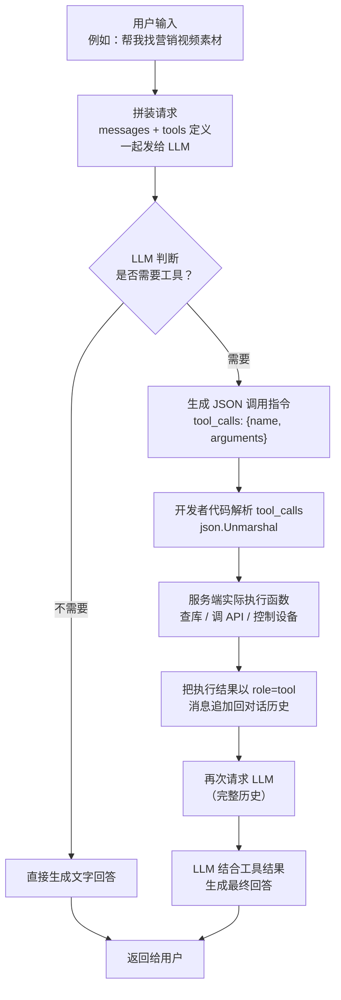
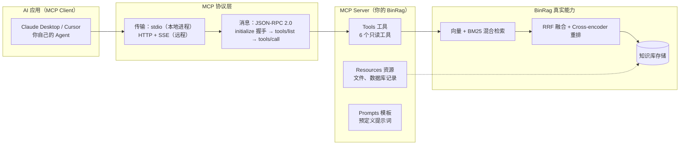

# 03 · Function Calling + MCP 协议原理

> 目标岗位：字节跳动剪映 CapCut「Agent 开发实习生（AI 剪辑）」（职位 ID：A80542）。
> 本章目标：彻底讲清「Agent 凭什么能调用工具」这件事的两个层次 —— 底层是 **Function Calling**（LLM 输出结构化调用指令），上层是 **MCP 协议**（工具接口的标准化）。
> 前置依赖：已会调用 LLM API（见「学习计划安排/第三阶段-AI应用开发基础.md」）；本章所有示例给 Go 落地写法。
> 项目对照：BinRag（RAG 项目，已实现 MCP Server 暴露 6 个只读工具）。

## 本章学习目标

1. 能画出并口述 Function Calling 的完整闭环（定义 Tools → LLM 生成 JSON 调用指令 → 服务端执行 → 结果回填 → 最终回答），并说清「LLM 不是真的调用函数，而是生成调用指令」这个本质。
2. 能独立用 Go 的 `struct + json.Marshal` 描述一个 Tool，并手写一个解析 `tool_calls`、执行函数、回填结果的循环。
3. 能解释并行工具调用（parallel tool calls）的返回格式、适用场景与工程注意点。
4. 能讲清 MCP 解决了什么痛点、它的三类能力（Tools / Resources / Prompts）、传输层（stdio / HTTP+SSE）与消息格式（JSON-RPC 2.0），以及 `initialize` / `tools/list` / `tools/call` 三个关键方法。
5. 能结合 BinRag 讲出自己 MCP Server 的设计决策：6 个只读工具覆盖哪三类能力、为什么坚持只读、为什么"实现一次 MCP Server 就能被任意 MCP 客户端接入"。

## 核心知识点提炼

| 知识点 | 一句话本质 | 面试关键句 |
|------|------|------|
| Function Calling 本质 | LLM 输出**结构化 JSON 调用指令**，真正的函数执行在服务端 | "LLM 不执行代码，只生成调用描述" |
| Tool 定义三要素 | `name` + `description` + `parameters`（JSON Schema） | description 决定调用准确率 |
| 执行闭环 | 工具结果以 `role=tool` 消息**回填对话历史**，再请求 LLM | 上下文必须包含工具结果 |
| 并行工具调用 | 一次响应返回多个 `tool_calls`，Agent 可并发执行 | 多个独立子任务可并行 |
| MCP 是什么 | 标准化 Server/Client 协议，一次实现、处处复用 | "工具界的 USB 接口" |
| MCP 三类能力 | Tools（可调用函数）/ Resources（可读取资源）/ Prompts（预定义模板） | 统一能力模型 |
| 传输与消息 | JSON-RPC 2.0 over **stdio**（本地）/ **HTTP+SSE**（远程） | initialize → tools/list → tools/call |
| BinRag 的 MCP | 6 个只读工具（问答 / 检索 / 知识库管理） | 只读 = 最小权限安全设计 |

---

## 知识点详解

### 3.1 Function Calling 底层机制

#### 3.1.1 关键认知：LLM 不是"调用"函数，而是"生成"调用指令

这是整个章节最重要的一句话，面试必须第一时间讲出来：

> **LLM 本身不执行任何代码。** 它做的事情只有一件：根据用户意图和工具描述文档，**决定"要不要调用、调用哪个、传什么参数"，然后输出一段标准化的 JSON 调用描述**。真正执行函数的是你的服务端代码。

用 Go 的视角理解：LLM 就像是一个"生成 JSON 的接口"，它把"用户想搜营销视频"翻译成 `{"name": "search_video", "arguments": {"query": "营销视频"}}`，然后你的代码 `json.Unmarshal` 这段 JSON，再去调真正的函数。所以：

- LLM 输出的是**调用意图的结构化描述**（JSON），不是可执行代码；
- 实际执行发生在你的服务端（查数据库、调 API、控制设备都在这里）；
- 这是 LLM 获得"外部能力"的唯一途径 —— 模型训练完就冻结了，知识库、实时数据、视频生成 API 都得靠工具接进来。

这个设计还带来一个隐藏收益：**可审计性**。每次调用都是结构化 JSON，可以被记录、被校验、被追溯，而不是模型自由发挥的文本。

#### 3.1.2 完整六步流程

一次带工具调用的请求，走完下面六步才算结束：



各步职责拆解：

| 步骤 | 谁在做 | 做什么 |
|------|------|------|
| 1. 定义 Tools | 开发者 | 描述函数名、参数、用途（JSON Schema） |
| 2. 发送消息 + Tools | 开发者 | 用户消息和工具描述一起进请求 |
| 3. LLM 决策 | LLM | 不需要 → 直接回答；需要 → 生成 JSON 调用指令 |
| 4. 接收并执行 | 开发者代码 | 解析 JSON → 实际执行函数 → 拿到结果 |
| 5. 回填历史 | 开发者代码 | 函数结果以 `tool` 角色消息加回对话 |
| 6. 生成最终回答 | LLM | 基于工具结果组织语言回答用户 |

#### 3.1.3 在 Go 里怎么描述一个 Tool

工具描述的本质是给 LLM 一份"说明书"，让它在推理时知道：**有什么工具可用、什么时候该用、参数怎么填**。Go 里用 struct + JSON marshal 即可：

```go
// ToolDefinition：一个可被 LLM 调用的工具描述（OpenAI 兼容格式）
type ToolDefinition struct {
    Type     string         `json:"type"`     // 固定为 "function"
    Function FunctionSchema `json:"function"`
}

type FunctionSchema struct {
    Name        string         `json:"name"`        // 工具名：LLM 靠它决定"调用哪个"
    Description string         `json:"description"` // 用途说明：LLM 靠它决定"什么时候该用"
    Parameters  map[string]any `json:"parameters"`  // 参数 JSON Schema：LLM 靠它生成合法参数
}

var searchTool = ToolDefinition{
    Type: "function",
    Function: FunctionSchema{
        Name:        "search_video",
        Description: "根据关键词搜索视频素材库，返回匹配的视频列表",
        Parameters: map[string]any{
            "type": "object",
            "properties": map[string]any{
                "query": map[string]any{
                    "type":        "string",
                    "description": "搜索关键词，例如：营销视频",
                },
                "limit": map[string]any{
                    "type":        "integer",
                    "description": "最多返回多少条，默认 10",
                },
            },
            "required": []string{"query"}, // 必填参数校验由 Schema 约束
        },
    },
}

// 序列化成 JSON 随请求发给 LLM
toolJSON, _ := json.MarshalIndent([]ToolDefinition{searchTool}, "", "  ")
fmt.Println(string(toolJSON))
```

> **为什么 Parameters 用 `map[string]any` 而不是 struct？** 因为参数 Schema 是给 LLM 看的通用 JSON Schema，字段是可变的（不同工具参数不同），用 `map[string]any` 保持灵活性；如果你用代码生成 Schema（如 `genSchema[SearchArgs]()`），本质也是把它 marshal 成同一个结构。

#### 3.1.4 服务端如何接收并执行调用指令

LLM 返回的响应里带 `tool_calls` 数组，注意 `arguments` 是一个 **JSON 字符串**，需要二次解析：

```go
// LLM 响应中的工具调用
type ToolCall struct {
    ID       string       `json:"id"`   // 调用 ID：回填结果时用于对应
    Type     string       `json:"type"` // "function"
    Function FunctionCall `json:"function"`
}

type FunctionCall struct {
    Name      string `json:"name"`
    Arguments string `json:"arguments"` // 注意：这是 JSON 字符串，需二次 Unmarshal
}

// ============ 核心循环：执行并回填 ============
var messages []Message // 对话历史（含最初 user 消息）

resp := chat(messages, tools) // 第一次请求：带工具定义

// 模型要求调用工具 → 逐条执行
for _, call := range resp.ToolCalls {
    var args map[string]any
    if err := json.Unmarshal([]byte(call.Function.Arguments), &args); err != nil {
        continue // 参数不是合法 JSON：跳过，别让一个坏调用炸掉整个循环
    }

    // 服务端真正执行：查库、调 API、控制设备都发生在这里
    result := executeTool(call.Function.Name, args)

    // 关键：把结果以 role=tool 的消息回填历史，并通过 ToolCallID 对应上
    messages = append(messages, Message{
        Role:       "tool",
        ToolCallID: call.ID,
        Content:    result,
    })
}

// 用含工具结果的完整历史再请求一次 → LLM 基于真实结果生成最终回答
final := chat(messages, tools)
fmt.Println(final.Content)
```

三个工程细节，面试可以主动提：

1. **`role=tool` 消息必须带 `ToolCallID`**，否则模型无法把结果和之前的调用对应起来；
2. **函数结果必须是文本**（或可转成文本的结构化 JSON），因为要进上下文；
3. **错误也是一种结果**：函数失败时不要 panic，把错误信息作为 Content 返回，模型看到后可以重试或换策略（第 3.3 节面试题 5 会展开）。

#### 3.1.5 并行工具调用（parallel tool calls）

新版本 API 支持一次生成多个工具调用 —— 当任务包含多个互相独立的子问题时，模型会一次性输出多个 `tool_calls`，Agent 可以**并发执行**，显著降低延迟：

```json
{
  "tool_calls": [
    {
      "id": "call_1",
      "type": "function",
      "function": {
        "name": "search_video",
        "arguments": "{\"query\": \"防晒霜产品图\", \"limit\": 3}"
      }
    },
    {
      "id": "call_2",
      "type": "function",
      "function": {
        "name": "search_music",
        "arguments": "{\"style\": \"清新活泼\"}"
      }
    }
  ]
}
```

适用场景：比如"做个防晒霜视频，需要素材 + 音乐 + 文案"，三个子任务互不依赖，并行搜索比串行快 3 倍。工程注意点：

- 并发执行后，**结果回填的顺序必须按 `tool_calls` 数组原始顺序**，否则模型会困惑；
- 并行适合"读"型工具；有依赖关系的调用（后一个要用前一个的输出）必须串行，这是 Agent 编排的常见面试点。

#### 3.1.6 本质总结（背诵版）

> Function Calling 的本质是 **LLM 输出结构化指令，而非直接执行代码**。LLM 通过分析用户意图和 Tool 的描述文档，决定是否调用、调用哪个、传什么参数，然后生成标准化的 JSON 调用描述。开发者拦截这个 JSON，实际执行函数，再把结果反馈给 LLM。这个机制让 LLM 能够安全地访问外部系统，同时保持了调用的可审计性。

---

### 3.2 MCP 协议（Model Context Protocol）

#### 3.2.1 MCP 出现的原因：没有它之前的世界

想象没有 MCP 的日子：每个 AI 应用都要自己实现一套工具接口 —— Claude 的工具格式、OpenAI 的 tools 格式、LangChain / 各家 Agent 框架的格式**都不一样**。你的 BinRag 想把知识库检索能力开放出去：

- 接 Claude Desktop，要写一套 Claude 格式的适配；
- 接自己的 Go Agent，要写一套 OpenAI 兼容格式的适配；
- 接 Cursor，可能又要一套……

同一个工具，为每个客户端各写一遍适配代码，**大量重复开发**。MCP 的解决方案是：**标准化协议** —— 定义一套通用的 Server/Client 接口，让任何 AI 应用都能连接任何工具。工具只实现一次 MCP Server，所有支持 MCP 的客户端开箱即用。

#### 3.2.2 MCP 架构总览



一句话架构：**AI 应用（MCP Client）↔ MCP 协议（JSON-RPC over stdio/HTTP）↔ MCP Server（你的 BinRag）→ 实际工具（知识库检索、文档管理等）**。

#### 3.2.3 MCP 定义的三类能力

| 能力 | 含义 | BinRag 对应 |
|------|------|------|
| **Tools** | AI 可以**调用**的函数（有输入输出，产生副作用或查询） | 你的 6 个只读 Tool：问答、检索、知识库管理 |
| **Resources** | AI 可以**读取**的资源（文件、数据库记录，无副作用） | 知识库中的文档原文、检索命中的 chunk |
| **Prompts** | **预定义的提示模板**（把常用工作流固化成模板，用户一键触发） | 比如"按主题检索并总结"的固定模板 |

区别一句话：Tools 是"让 AI 做事"，Resources 是"让 AI 看东西"，Prompts 是"给 AI 的固定开场白"。面试被问"Tools 和 Resources 有什么区别"时，答"Tools 可调用、有参数、可能产生副作用；Resources 是只读数据，通过 URI 定位，直接读取"，即可。

#### 3.2.4 协议细节：传输层与消息格式

- **传输层**：`stdio`（本地进程间通信，客户端把 MCP Server 作为子进程拉起，走标准输入输出）或 `HTTP + SSE`（远程，Server 跑在服务器上，通过 HTTP 流式推送事件）；
- **消息格式**：**JSON-RPC 2.0**（`jsonrpc` / `method` / `params` / `id` 四个字段）；
- **三个关键方法**：

```json
// 1) 初始化握手：客户端声明自己是谁，服务端返回支持的能力
{"jsonrpc": "2.0", "id": 1, "method": "initialize", "params": {
  "protocolVersion": "2024-11-05",
  "capabilities": {},
  "clientInfo": {"name": "my-agent", "version": "0.1.0"}
}}
// ← 响应：服务端确认协议版本 + 声明自己支持哪些能力（比如 tools）
{"jsonrpc": "2.0", "id": 1, "result": {
  "protocolVersion": "2024-11-05",
  "capabilities": {"tools": {"listChanged": false}},
  "serverInfo": {"name": "binrag-mcp", "version": "0.1.0"}
}}
```

```json
// 2) 获取工具列表：客户端想知道"这个 Server 能干什么"
{"jsonrpc": "2.0", "id": 2, "method": "tools/list"}
// ← 响应：返回工具定义数组（结构就是 3.1.3 里那个 JSON Schema）
{"jsonrpc": "2.0", "id": 2, "result": {"tools": [
  {"name": "rag_search", "description": "混合检索知识库（向量+BM25，RRF 融合）", "inputSchema": {"type": "object", "properties": {"query": {"type": "string"}}}}
]}}
```

```json
// 3) 调用工具：客户端按名字调用，传参，等结果
{"jsonrpc": "2.0", "id": 3, "method": "tools/call", "params": {
  "name": "rag_search",
  "arguments": {"query": "什么是 RRF 融合", "top_k": 5}
}}
// ← 响应：结果统一包在 content 数组里
{"jsonrpc": "2.0", "id": 3, "result": {"content": [
  {"type": "text", "text": "[检索结果] 1. RRF 融合是一种……"}
]}}
```

Go 落地视角：MCP Server 本质就是一个 **JSON-RPC 消息分发器**，按 `method` 路由到不同 handler：

```go
// MCP Server 核心骨架：一个 dispatch 函数按 method 分发
func (s *MCPServer) handle(req JSONRPCRequest) JSONRPCResponse {
    switch req.Method {
    case "initialize":
        return s.handleInitialize(req)  // 握手：声明能力列表
    case "tools/list":
        return s.handleToolsList(req)   // 返回 6 个只读工具定义
    case "tools/call":
        return s.handleToolsCall(req)   // 只读执行：检索 / 问答 / 读文档
    case "resources/list", "resources/read":
        return s.handleResources(req)   // 暴露知识库文档资源
    default:
        return errMethodNotFound(req)   // 未知方法返回标准错误
    }
}
```

#### 3.2.5 BinRag 的 MCP Server：6 个只读工具的设计（面试重点）

你的 BinRag 已经把"向量+BM25 混合检索、RRF 融合、Cross-encoder 重排"这条 RAG 链路包成了一个 MCP Server。工具清单（名字以你的实现为准，这里按能力分类示意）：

| 工具 | 分类 | 能力 |
|------|------|------|
| `rag_answer` | 问答 | 基于知识库直接回答用户问题（带引用） |
| `rag_search` | 检索 | 混合检索（向量 + BM25 + RRF 融合），返回 top-k 片段 |
| `rag_search_rerank` | 检索 | 混合检索后追加 Cross-encoder 重排，质量优先 |
| `kb_list` | 知识库管理 | 列出所有知识库 / 文档清单 |
| `kb_get_document` | 知识库管理 | 按 ID 读取文档全文（Resource 能力也可以覆盖） |
| `kb_stats` | 知识库管理 | 查询文档数量、chunk 数、索引状态等元信息 |

**为什么坚持只读？** 这是刻意为之的安全设计，面试要能讲出三层理由：

1. **防 prompt injection（提示注入）**：外部 Agent 的输入不可信，恶意指令可能诱导模型调用"删除文档""覆盖索引"这类工具；只读把风险面从"可读可写"收敛到"只可能泄露信息"这一维；
2. **最小权限原则**：Agent 工具暴露遵循最小权限，BinRag 的核心价值是"被检索、被问答"，写入操作根本不在它的职责范围；
3. **状态一致性**：知识库的写入应由人工或专门管线（数据回流、索引更新任务）负责，Agent 并发写容易造成脏数据；只读让知识库成为 Agent 的"事实来源（source of truth）"。

**为什么说"实现一次 MCP Server 就能到处接入"？** 因为 MCP 是开放协议：Claude Desktop、Cursor 以及任何支持 MCP 的框架都能直接发现你的 `rag_search`。BinRag 从"一个孤立的 RAG 系统"变成了"可被任意 Agent 编排调用的知识库工具" —— 这正是 MCP 标准化的价值。

#### 3.2.6 本质总结（背诵版）

> MCP 是 Anthropic 推出的开放协议，目标是让 AI 应用和外部工具之间有一套统一的接口标准，**类似于 USB 接口之于硬件**：设备（工具）只需实现一次 USB（MCP Server），任何电脑（AI 客户端）都能即插即用。没有 MCP 之前，每个 AI 平台都需要为每个工具写一套适配代码；有了 MCP，工具只需实现一次，所有支持 MCP 的 AI 客户端都能直接使用。BinRag 实现 MCP Server 的意义在于，它不再是一个孤立的 RAG 系统，而是一个可以被任何 Agent 编排调用的知识库工具。

---

## 面试问答

> 以下为本章"需要掌握"问题的参考答案，面试口吻，可直接背诵。

### Q1：LLM 是如何决定什么时候调用工具的？

LLM 本身不会执行工具，它只做两件事：推理是否需要外部信息，以及生成调用指令。开发者把工具的结构化描述（名字、用途、参数 Schema）随消息一起发给模型，模型根据用户意图和工具描述做匹配：如果回答依赖训练数据之外的信息——比如实时数据、私有知识库、需要触发外部动作——它就生成结构化的 `tool_calls`；如果不需要，就直接生成文字回答。这个"决策"本质上是模型基于工具描述文本做的语义匹配与推理，而不是真的检查了系统状态。所以工具描述的质量直接决定调用准确率，这也是"工具描述 Prompt 工程"的核心价值。

### Q2：Function Calling 和直接在 Prompt 里说"请调用搜索"有什么区别？

最大的区别是**结构化**：Function Calling 由 API 层保证输出一定是合法的 JSON（`name` + `arguments`），代码可以直接解析执行；而 Prompt 方式只是自由文本，你需要自己写解析逻辑去猜模型想调什么、参数是什么，极易出错。其次是**约束力**：Function Calling 带参数 JSON Schema，类型和必填项在生成时就受约束；Prompt 方式完全没有约束。第三是**协议能力**：Function Calling 原生支持并行 `tool_calls` 和标准的 `tool` 角色消息回填，Prompt 方式只能自己拼字符串模拟。一句话：Function Calling 把"调用意图"从自然语言升级为结构化协议，让机器可解析、可校验、可并行、可审计。

### Q3：MCP 和直接写 API 接口有什么区别？为什么要多一层协议？

直接写 API 时，接口是你和我之间的私有约定，每个 AI 应用都要为每个工具单独写适配代码，OpenAI 格式、Claude 格式、各家框架格式互不兼容，重复开发严重。MCP 把这套约定标准化：工具只实现一次 MCP Server（统一的 JSON-RPC 方法，如 `tools/list`、`tools/call`），任何支持 MCP 的客户端开箱即用。类比 USB：每个设备不用为每种电脑定制接口，统一协议让"插上就能用"。多这一层的代价是少量序列化开销和抽象，但换来一次实现、到处复用，以及 Tools / Resources / Prompts 统一能力模型。对我的 BinRag 来说，实现一次 MCP Server，等于向所有 AI 应用开放知识库能力，而不是只服务我自己的 Agent。

### Q4：你的 BinRag 的 MCP Server 暴露了哪些工具？为什么只做只读？

BinRag 的 MCP Server 暴露了 6 个只读工具，覆盖三类能力：问答类（基于知识库直接回答）、检索类（向量+BM25 混合检索、RRF 融合、Cross-encoder 重排）、知识库管理类（列出知识库、读取文档内容、查询统计信息）。所有工具只读是刻意的安全设计：第一，防 prompt injection——外部 Agent 输入不可信，可写工具可能被诱导去删除或篡改知识库，只读把风险面收敛到"信息泄露"单一维度；第二，符合最小权限原则，BinRag 的价值就是被检索被问答，写入不在职责内；第三，保证知识库状态一致性，写入由人工或专门的数据管线负责，避免 Agent 并发写脏数据。这也是给 Agent 暴露工具时的通用原则：默认只读、最小权限。未来需要写能力的话，我会单独加写工具并配权限校验和白名单。

### Q5：如果一个 MCP Tool 执行失败了，LLM 应该怎么处理？

工具执行失败时，服务端**不要中断整个对话或抛异常**，而是把错误信息作为 Observation / 结果文本返回给 LLM，比如 `"Error: 检索超时，请重试"`。LLM 看到错误后有两条策略：一是重试——微调参数再调一次；二是换策略——换工具、换关键词，或向用户说明无法完成并给出替代建议。这个容错机制的关键是"错误必须进入上下文"，因为 LLM 只能基于对话历史做决策，错误被吞掉它就永远不知道失败过。工程上还要配合超时控制、重试上限和步骤数上限，防止模型在同一个错误上反复打转，造成死循环和成本失控。

---

## 自测清单

- [ ] 能否讲清「LLM 不是真的调用函数，而是生成 JSON 调用指令」这个本质，并画出六步闭环流程图？
- [ ] 能否用 Go 的 `struct + json.Marshal` 描述一个 Tool，并说清 `name` / `description` / `parameters` 三个字段各自的作用？
- [ ] 能否讲清 `role=tool` 消息为什么要带 `ToolCallID`、函数结果为什么必须是文本？
- [ ] 能否解释并行工具调用的返回格式，以及什么场景适合并行、什么场景必须串行？
- [ ] 能否用"USB 接口"类比讲清 MCP 的价值，并说出 MCP 的三类能力（Tools / Resources / Prompts）与两种传输方式（stdio / HTTP+SSE）？
- [ ] 能否讲清 `initialize` 握手、`tools/list`、`tools/call` 三个方法分别做了什么？
- [ ] 能否结合 BinRag 讲出 6 个只读工具的分类，以及"只读"设计的三层安全理由？
- [ ] 能否讲出"工具失败时错误信息必须进入上下文"的容错思路？

---

## 与既有文档联动

- 本章是「[大模型与 Agent 核心能力](/路线专题/03-大模型与Agent核心能力)」中 **Agent 层（Day 13-15）** 的详细展开：那里讲了 Function Calling / ReAct / Multi-Agent 的全景，本章把 Function Calling 和 MCP 协议抠到协议细节。
- 前置基础见「[第三阶段-AI应用开发基础](/学习计划安排/第三阶段-AI应用开发基础)」：先会调 LLM API（messages / tools 字段），再看本章的协议细节会更顺。
- 下一步衔接：第 4 章「ReAct 与 Agent 规划」——Function Calling 解决"怎么调工具"，ReAct 解决"什么时候调、调完怎么办"，两者组合才是完整 Agent。
