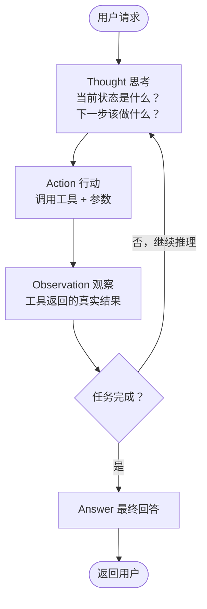
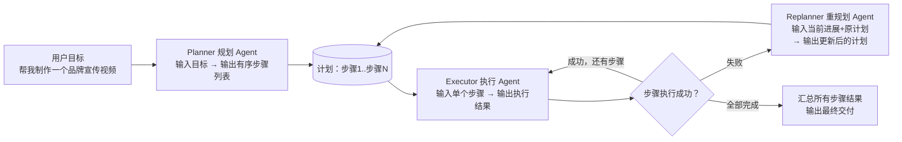

# 04 · ReAct + Agent 规划（Planning）

> 目标岗位：字节跳动剪映 CapCut「Agent 开发实习生（AI 剪辑）」（职位 ID：A80542）。
> 本章目标：掌握 Agent 的两种核心执行模式 —— **ReAct**（思考-行动-观察循环）与 **Plan-and-Execute**（先规划再执行），并能把 shatangAI 的视频生成流程改写成 ReAct 模式。
> 前置依赖：第 3 章 Function Calling 与 MCP 协议（Agent 的行动能力来自工具调用）。
> 项目对照：shatangAI（视频生成项目，调 DashScope / Seedance 生成短视频）。

## 本章学习目标

1. 能默写并复述 ReAct 的 **Thought → Action → Observation** 循环，并完整走一遍"防晒霜 30 秒电商视频"示例。
2. 能讲清 Thought 的作用、Observation 驱动决策的机制，以及 ReAct 与 Chain-of-Thought（CoT）的本质区别。
3. 能讲清 Plan-and-Execute 的三角色架构（Planner / Executor / Replanner），并能对比它和 ReAct 的适用边界，对应到 JD 里的"长程任务规划"。
4. 能设计 ReAct 循环的终止条件与防死循环机制（最大步数、Final Answer 判定、动作去重）。
5. 能把 shatangAI 的「素材搜索 → 脚本生成 → 视频合成 → 状态轮询」流程改写成 ReAct 模式描述，并说明改造前后的差异。

## 核心知识点提炼

| 知识点 | 一句话本质 | 面试关键句 |
|------|------|------|
| ReAct 范式 | **Reasoning + Acting 交替**，Thought → Action → Observation 循环 | "想 → 做 → 看结果 → 再想 → 再做" |
| Thought | 给模型自己看的推理过程，决策前先想清楚 | 去掉它 = 盲目前进，不可调试 |
| Action | 实际调用工具（依赖第 3 章 Function Calling） | 行动必须可执行、有观测 |
| Observation | 工具返回的真实结果，驱动下一步决策 | 错误也要作为 Observation 返回 |
| CoT vs ReAct | CoT 只推理不行动；ReAct 推理 + 行动 + 观测 | 后者能处理动态、多步任务 |
| Plan-and-Execute | Planner 拆步骤 → Executor 执行 → Replanner 重规划 | 先规划再执行（proactive） |
| 适用边界 | 短/动态任务用 ReAct；步骤确定的长程任务用 P&E | JD"长程任务规划"= P&E |
| 防死循环 | 步数上限 + Final Answer 判定 + 动作去重 | 步数上限同时是成本上限 |
| 异步任务处理 | 工具返回任务 ID，用 poll 工具轮询状态 | 状态观测要纳入循环 |

---

## 知识点详解

### 4.1 ReAct 范式（Agent 的核心执行模式，面试必问）

#### 4.1.1 传统方式的问题：一步到位

没有 ReAct 时，LLM 的典型用法是**一次问答**：用户提问 → 模型直接输出答案。这在简单问题上没问题，但遇到复杂多步任务就暴露短板：

- 任务步骤事先无法全部预知（素材够不够、脚本生成后才知道下一步）；
- 模型没有"中间状态"概念，一旦某一步需要根据真实结果调整，它就无能为力；
- 模型只能基于训练时的知识"猜"，无法访问实时信息或调用外部能力。

典型失败案例：让 LLM"做一个防晒霜 30 秒电商视频"，一次性回答只能吐一段文案建议，既不会真的去搜素材，也不会生成脚本、合成视频。

#### 4.1.2 ReAct 的解法：强制循环

ReAct = **Rea**soning（推理）+ **Act**ing（行动）交替执行。它强制 LLM 按固定循环工作：



三个角色的分工：

| 角色 | 含义 | 关键点 |
|------|------|------|
| **Thought** | 思考，给**模型自己**看的推理 | 让模型"想清楚再做"，可调试可审计 |
| **Action** | 行动，实际调用工具 | 依赖 Function Calling：输出工具名 + 参数 |
| **Observation** | 观察，工具返回的结果 | 反馈给模型继续推理，**真实数据驱动决策** |

循环持续进行，直到模型认为任务完成并输出 Answer。

#### 4.1.3 完整示例：防晒霜 30 秒电商视频

把上面那个失败案例改成 ReAct，模型会这样一步步走（面试直接背这个例子）：

```
用户：帮我制作一个关于"防晒霜"的30秒电商视频

Thought: 我需要先找一些防晒霜的素材图片，然后生成脚本，最后合成视频
Action: search_materials(query="防晒霜产品图")
Observation: 找到3张高清产品图，URL: [img_01.jpg, img_02.jpg, img_03.jpg]

Thought: 有了素材，现在生成脚本
Action: generate_script(product="防晒霜", duration=30, style="活泼")
Observation: 脚本生成成功："姐妹们！防晒真的不能偷懒..."

Thought: 脚本和素材都有了，现在合成视频
Action: generate_video(script="...", materials=[img_01.jpg, img_02.jpg, img_03.jpg])
Observation: 视频生成中，任务ID: task_123

Thought: 视频生成需要等待，告知用户
Answer: 您的视频正在生成中，预计2分钟后完成，任务ID: task_123
```

注意观察每一步的依赖关系：**Observation 驱动 Thought** —— 第二步的 Thought"有了素材，现在生成脚本"正是因为看到了第一步返回的素材列表；如果素材搜索返回空，模型就不会去生成脚本，而是换个关键词再搜。这就是 ReAct 处理"事先无法预知所有步骤"的动态任务的方式。

把上面六轮交互整理成表格，面试时可以指着讲"每一轮输入输出"：

| 轮次 | Thought（思考） | Action（行动） | Observation（观察） | 决策含义 |
|------|------|------|------|------|
| 1 | 先找素材，再生成脚本，最后合成 | `search_materials(query="防晒霜产品图")` | 找到 3 张高清产品图 | 任务被拆解为三步 |
| 2 | 有了素材，现在生成脚本 | `generate_script(product, duration=30, style="活泼")` | 脚本生成成功 | 上一步结果驱动本步 |
| 3 | 脚本和素材都有了，合成视频 | `generate_video(script, materials)` | 视频生成中，任务 ID `task_123` | 依赖关系满足才行动 |
| 4 | 生成是异步的，告知用户 | —— | —— | 输出 Answer 终止循环 |

表格揭示一个关键机制：**Action 的参数往往来自上一步的 Observation**（第二步把第一步返回的素材 URL 传给了脚本工具），这正是 ReAct 能完成多步任务的原因——信息在循环中流动。

#### 4.1.4 Go 伪代码：ReAct 执行引擎

ReAct 引擎在工程上就是一个**循环**：每一步让 LLM 输出结构化 JSON（Thought + Action），执行工具，把结果追加进历史，再进入下一轮。先定义模型的输出结构——Go 里用 struct 约束 LLM 必须返回的字段（配合 `json_schema` / 函数调用强制模式）：

```go
// ReActOutput：每一轮要求 LLM 输出的结构化决策
type ReActOutput struct {
    Thought     string         `json:"thought"`      // 思考：给模型自己看
    Action      string         `json:"action"`       // 行动：工具名，完成任务时为 ""
    ActionInput map[string]any `json:"action_input"` // 行动参数：传给工具的 JSON
    FinalAnswer string         `json:"final_answer"` // 最终回答：任务完成时非空
}
```

引擎主体：

```go
// ReAct 引擎：Thought → Action → Observation 循环
func RunReAct(userGoal string, tools map[string]Tool, maxSteps int) string {
    history := []Message{{Role: "user", Content: userGoal}}

    for step := 0; step < maxSteps; step++ {
        // 1. 让 LLM 输出结构化决策：Thought + Action（或 FinalAnswer）
        plan := llm.StructuredCall(history, ReActOutput{
            Thought:     "string: 给模型自己看的推理",
            Action:      "string: 工具名，或空",
            ActionInput: "object: 工具参数",
            FinalAnswer: "string: 任务完成时的最终回答",
        })

        // 2. 模型认为任务完成 → 终止循环
        if plan.FinalAnswer != "" {
            return plan.FinalAnswer
        }
        // 3. 既没行动也没答案 → 防死循环，强制终止
        if plan.Action == "" {
            return "error: 模型未给出行动也未给出答案，强制终止"
        }

        // 4. 执行 Action，拿到 Observation
        result, err := executeTool(tools, plan.Action, plan.ActionInput)
        if err != nil {
            result = "Error: " + err.Error() // 错误也作为 Observation，让模型重试或换策略
        }

        // 5. 把这一步写进历史，进入下一轮
        history = append(history,
            Message{Role: "assistant", Content: fmt.Sprintf(
                "Thought: %s\nAction: %s(%v)", plan.Thought, plan.Action, plan.ActionInput)},
            Message{Role: "user", Content: "Observation: " + result},
        )
    }
    return "error: 超过最大步数 " + strconv.Itoa(maxSteps)
}
```

工程要点（面试加分）：

- **每一步都是一次完整 LLM 调用**，所以步数上限同时是**成本上限**；
- Observation 必须追加进 `history`，模型才"看得到"上一步的结果；
- 错误不中断循环：`"Error: ..."` 作为 Observation 返回，让模型自己决定重试还是换策略（与第 3 章 Q5 呼应）。

#### 4.1.5 Thought 为什么不能省

Thought 是 ReAct 的灵魂，面试大概率追问"去掉 Thought 会怎样"：

1. **决策质量**：Thought 强制模型先分析"当前状态、还缺什么、下一步做什么"，再选工具和参数，避免凭直觉乱调；
2. **过程记忆**：在长循环里，Thought 文本天然承担了"做了哪些事"的记录，防止模型重复执行同一动作；
3. **可调试性**：每一步的思考是可见文本，出问题能直接看到模型为什么这么选，而不是对着黑盒猜。

#### 4.1.6 ReAct vs Chain-of-Thought（CoT）

| 维度 | CoT（思维链） | ReAct（思考-行动） |
|------|------|------|
| 组成 | 只有思考 | 思考 + 行动 + 观察 |
| 流程 | "先想，然后直接回答" | "想 → 做 → 看结果 → 再想 → 再做" |
| 外部交互 | 无 | 有（调用工具，基于真实结果调整） |
| 适用 | 纯推理题（数学、逻辑） | 需要查信息、调工具的动态任务 |
| 局限 | 想错就错，无法纠正 | 能根据 Observation 纠错 |

一句话：**CoT 只做脑内推理，ReAct 让 LLM 与外部环境交互**，基于真实的工具返回结果调整下一步行动，从而处理事先无法预知所有步骤的动态任务。

#### 4.1.7 本质总结（背诵版）

> ReAct 的核心洞察是：复杂任务无法一步到位，需要"思考-行动-观察"的迭代循环。相比于纯推理的 CoT，ReAct 让 Agent 能够与外部环境交互，基于真实的工具返回结果调整下一步行动，从而处理事先无法预知所有步骤的动态任务。本质是把 LLM 从"一次性问答机器"变成了"自主决策的执行循环"。

---

### 4.2 Plan-and-Execute 模式（比 ReAct 更适合复杂创作任务）

#### 4.2.1 为什么需要"先规划"

ReAct 是**边走边想（reactive）**：每一步根据上一步的结果决定下一步。但视频创作这类长任务有个特点：**步骤基本可预测**（找素材 → 写脚本 → 合成 → 评审），只是步骤多、链条长。ReAct 在这种场景下会"走一步看一步"，容易绕路、缺乏全局视图、中途失败只能从头再来。Plan-and-Execute 的答案是：**先把整个任务拆成计划，再逐步执行**（proactive）。

#### 4.2.2 三角色架构：Planner / Executor / Replanner



| 角色 | 输入 | 输出 | 职责 |
|------|------|------|------|
| **Planner**（规划 Agent） | 用户目标 | 有序的任务步骤列表 | 把模糊目标分解为可执行序列 |
| **Executor**（执行 Agent） | 单个任务步骤 | 该步骤的执行结果 | 一次专注做一件事 |
| **Replanner**（重规划 Agent） | 当前进展 + 已执行步骤 + 原计划 | 更新后的计划 | 某步失败时精准重规划，而非从头开始 |

#### 4.2.3 创作场景示例：品牌宣传视频

```
用户：帮我制作一个品牌宣传视频

Planner 输出：
  步骤1：分析品牌定位和目标受众
  步骤2：生成3个视频概念方案
  步骤3：用户选择后，生成详细分镜脚本
  步骤4：根据脚本搜索匹配素材
  步骤5：合成视频并评审
  步骤6：输出最终视频

Executor 依次执行各步骤...
如果步骤4素材不足 →
  Replanner：插入新步骤"生成AI素材"（调用 Seedance 生成占位素材），
  然后继续执行步骤5、6 —— 而不是从头开始。
```

注意 Replanner 的价值：**精准修复**。素材不足只影响步骤 4，Replanner 插入一步"AI 生成素材"即可，前 3 步成果全部保留；如果 ReAct 遇到这种情况，可能要从头绕一大圈甚至直接失败。

#### 4.2.4 Go 伪代码：Plan-and-Execute 骨架

```go
type Step struct {
    ID          string   `json:"id"`
    Description string   `json:"description"` // 单个可执行步骤
    DependsOn   []string `json:"depends_on"`  // 依赖的步骤 ID
    Status      string   `json:"status"`      // pending / running / done / failed
    Result      string   `json:"result"`
}

func PlanAndExecute(goal string) string {
    // 1. Planner：把模糊目标拆成有序步骤列表（一次 LLM 调用）
    plan := planner.Plan(goal) // []Step

    for i := 0; i < len(plan); i++ {
        step := &plan[i]
        if step.Status == "done" {
            continue
        }
        // 2. Executor：执行单个步骤（内部可再嵌套 ReAct / 工具调用）
        step.Result, step.Status = executor.Execute(*step)

        // 3. 失败 → Replanner：基于当前进展重新规划，而不是从头开始
        if step.Status == "failed" {
            newSteps := replanner.Replan(goal, plan[:i+1])
            plan = mergePlan(plan, newSteps) // 插入/替换后续步骤
            continue
        }
    }
    return summarize(plan) // 汇总所有步骤结果，交付最终产物
}
```

一个容易踩的面试坑：**Executor 内部不一定要用 ReAct**。单个步骤如果简单，直接一次 LLM 调用 + 工具即可；如果单步也复杂，可以嵌套 ReAct。业界常见组合是"顶层 Plan-and-Execute，单步内部 ReAct"。

#### 4.2.5 ReAct vs Plan-and-Execute 对比

| 维度 | ReAct | Plan-and-Execute |
|------|------|------|
| 决策时机 | 边走边想（reactive） | 先规划再执行（proactive） |
| 全局视图 | 无，只看上一步结果 | 有，显式计划列表 |
| 适用任务 | 短任务、动态环境、步骤不确定 | 步骤确定、可预测的长程创作任务 |
| 失败恢复 | 靠模型自己绕路 | Replanner 精准重规划 |
| 可观测性/可调试性 | 中等 | 高（计划即文档） |
| 成本 | 每步一次调用，无规划开销 | 多一次 Planner 调用，但减少绕路 |
| 代表场景 | 多轮检索问答、动态排障 | 视频创作流水线、多文档处理 |

**结论**：对于短任务或动态环境，ReAct 更灵活；对于步骤确定、可预测的长程创作任务，Plan-and-Execute 更优——它通过显式的计划步骤提升了任务的可观测性和可调试性，也方便在出错时做精准重规划，而不是从头开始。

#### 4.2.6 长程任务规划：JD 里的考点

JD 里"长程任务规划"的核心难点有两个，面试要主动点出来：

1. **目标分解**：如何把用户的模糊目标（"做一个品牌宣传视频"）分解为可执行的步骤序列——粒度要合适（太粗执行不了，太细成本爆炸）、顺序要有依赖关系（先有脚本才能搜素材）；
2. **容错恢复**：执行中途失败怎么办——Plan-and-Execute 的答案是 Replanner 基于"已完成步骤 + 原计划"做**增量重规划**，而不是从头开始，也不是硬着头皮继续。

分解粒度是实操中第一道坎，用同一个目标示范三个粒度：

| 粒度 | 示例步骤 | 问题 |
|------|------|------|
| 过粗 | 步骤1：制作视频 | 无法执行，Executor 无从下手 |
| 过细 | 步骤1：定义变量 `videoName`… | 步骤爆炸，规划成本远高于收益 |
| 合适 | 步骤1：分析品牌定位与受众；步骤2：生成 3 个概念方案… | 每步是一个"可独立交付结果"的任务 |

判断粒度是否合适的标准：**每个步骤都应该能回答"这一步完成了没有"**（有明确的产出物），且步骤之间只有必要的依赖。这个判断标准本身就是很好的面试输出。

结合你的项目：shatangAI 的视频生成流水线天然适合 Plan-and-Execute（步骤固定：素材→脚本→合成→评审→交付），而 BinRag 的知识库问答适合 ReAct（问题千变万化，检索路径动态决定）。两者可以组合——顶层用 Planner 把"做视频"拆成步骤，其中"写脚本"这种单步内部再用 ReAct 多轮打磨文案。

#### 4.2.7 本质总结（背诵版）

> 对于短任务或动态环境，ReAct 更灵活；对于步骤确定、可预测的长程创作任务，Plan-and-Execute 更优——它通过显式的计划步骤提升了任务的可观测性和可调试性，也方便在出错时做精准重规划，而不是从头开始。JD 里的"长程任务规划"核心难点在于：如何把用户的模糊目标分解为可执行的步骤序列，以及如何处理中途失败的容错恢复。工程实践中两者常以"顶层 Plan-and-Execute + 单步内部 ReAct"的混合形态出现。

---

## 面试问答

> 以下为本章"需要掌握"问题的参考答案，面试口吻，可直接背诵。

### Q1：ReAct 里的 Thought 有什么作用？去掉 Thought 直接 Action 会怎样？

Thought 是给模型自己看的推理过程，作用是让模型在行动前"想清楚"：当前状态是什么、还缺什么、下一步该做什么。它把决策过程变成可观察的文本，既提高决策质量——像人一样先分析再动手——也方便开发者调试和审计。如果去掉 Thought 直接 Action，模型就只能靠"直觉"选工具和参数，缺少对中间状态的分析，容易选错工具、传错参数、重复执行；而且一旦出错，你完全看不到它为什么这么选，问题无法定位。另外 Thought 还承担了过程记忆的功能：长循环里前面的 Thought 会提醒模型已经做过什么，避免重复劳动。所以 Thought 不是装饰，是 ReAct 推理质量的关键。

### Q2：Agent 在第三步工具调用返回了错误，应该怎么处理？

处理分三个层面。第一，不中断：把错误信息作为 Observation 返回给模型，让它看到失败原因——超时、无结果、参数非法，都属于可恢复错误。第二，给模型纠错余地：模型会基于错误信息决定调整参数重试、换工具、换关键词，或者向用户说明无法完成。第三，工程兜底：设置重试次数、步骤上限，并区分错误类型——"无结果"可以换关键词再试，"系统崩溃"就要停止而不是硬试。如果是 Plan-and-Execute 模式，还应该触发 Replanner 对后续步骤做精准重规划，而不是让 Executor 硬着头皮继续。核心原则是：错误要可见、要可恢复、要有边界。

### Q3：什么时候用 ReAct，什么时候用 Plan-and-Execute？

关键看任务的两个特征：步骤是否可预测，以及环境是否动态。ReAct 是边走边想，适合短任务、步骤不确定、每步依赖上一步结果、需要频繁和环境交互的场景——比如多轮检索问答、动态排障；优点是完全反应式、灵活，缺点是没有全局视图，长任务容易绕路。Plan-and-Execute 是先规划再执行，适合步骤基本确定、有清晰起点和终点的长程任务——比如视频创作（找素材→写脚本→合成→评审）；优点是全局可见、可调试、出错时能精准重规划，缺点是规划本身有成本，环境变化时计划容易过时。JD 里说的"长程任务规划"主要指 Plan-and-Execute。实践中很多系统是两者混合：顶层 Plan-and-Execute，单个复杂步骤内部嵌套 ReAct。

### Q4：ReAct 的最大步骤数设多少合适？怎么防止死循环？

步骤上限按任务复杂度定：简单问答 5-8 步足够，复杂创作类任务 15-30 步。防死循环我一般设三道防线：一是硬上限，达到 `max_steps` 直接终止并返回当前进展；二是完成判定，要求模型只有明确输出 Final Answer 才算完成，否则计数继续；三是动作去重，维护已执行过的 (Action, 参数哈希) 集合，发现重复执行时提示模型"这个你已经做过了"并记一次警告。另外，超时和错误重试上限要单独设置，避免在单个错误步骤内部打转。还有一点容易被忽略：每步都是一次完整 API 调用，步数上限同时是成本上限，所以宁可设小一点，配合 Replanner 做精准恢复。

### Q5：你能把 shatangAI 的视频生成流程改造成 ReAct 模式描述一下吗？

可以。shatangAI 现在是一次性的"提示词 → 调 Seedance 生成视频"，改造成 ReAct 后变成循环：**Thought**（确认素材是否齐全）→ **Action** `search_materials(query=...)` → **Observation**（素材列表）→ **Thought**（素材够了吗，够就写脚本）→ **Action** `generate_script(style=...)` → **Observation**（脚本文本）→ **Thought**（脚本和素材都齐了，开始合成）→ **Action** `generate_video(script, materials)` → **Observation**（返回任务 ID `task_xxx`）→ **Thought**（视频生成是异步的，需要轮询）→ **Action** `poll_video_status(task_id)` → **Observation**（渲染中 / 完成）→ **Thought**（已完成）→ **Answer**（视频链接 + 任务信息）。关键改造有两点：一是把硬编码的顺序调用改成"模型根据观测结果决定下一步"，比如素材不足时模型会自动换关键词再搜，而不是直接失败；二是异步任务用 poll 工具把状态轮询纳入循环，让模型"看得到"任务进展。改造后系统从固定流水线变成能自我纠错的执行循环，正好对应 JD 的 Agent 能力要求。

---

## 自测清单

- [ ] 能否完整复述 ReAct 的 Thought → Action → Observation 循环，并用"防晒霜 30 秒电商视频"例子从头到尾走一遍？
- [ ] 能否讲清去掉 Thought 直接 Action 会带来哪三个问题（决策质量 / 过程记忆 / 可调试性）？
- [ ] 能否讲清 ReAct 与 CoT 的本质区别，并举一个"ReAct 能做而 CoT 做不了"的场景？
- [ ] 能否画出并讲清 Plan-and-Execute 的 Planner / Executor / Replanner 三角色架构？
- [ ] 能否讲清 ReAct 和 Plan-and-Execute 的适用边界，并对应到 JD 里的"长程任务规划"？
- [ ] 能否说出防死循环的三道防线（步数上限 / Final Answer 判定 / 动作去重），并解释"步数上限=成本上限"？
- [ ] 能否把 shatangAI 的视频生成流程改写成 ReAct 模式（含异步任务轮询），并说清改造前后差异？
- [ ] 能否解释"顶层 Plan-and-Execute + 单步内部 ReAct"的混合模式为什么常见？

---

## 与既有文档联动

- 本章是「[大模型与 Agent 核心能力](/路线专题/03-大模型与Agent核心能力)」中 **Agent 层（Day 13-15）** 的详细展开：ReAct 是 Agent 的核心执行模式，Plan-and-Execute 对应其中的"长程任务规划"能力，与 Multi-Agent 协作共同构成 Agent 层全景。
- 行动能力依赖第 3 章「Function Calling + MCP 协议」：ReAct 的 Action 就是工具调用，MCP 则是工具的标准接入方式，建议先读完第 3 章再看本章。
- 前置基础见「[第三阶段-AI应用开发基础](/学习计划安排/第三阶段-AI应用开发基础)」：先会调 LLM API，再理解 Agent 执行模式会更顺。
