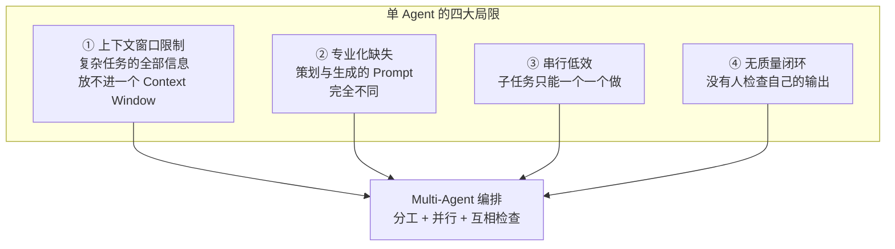
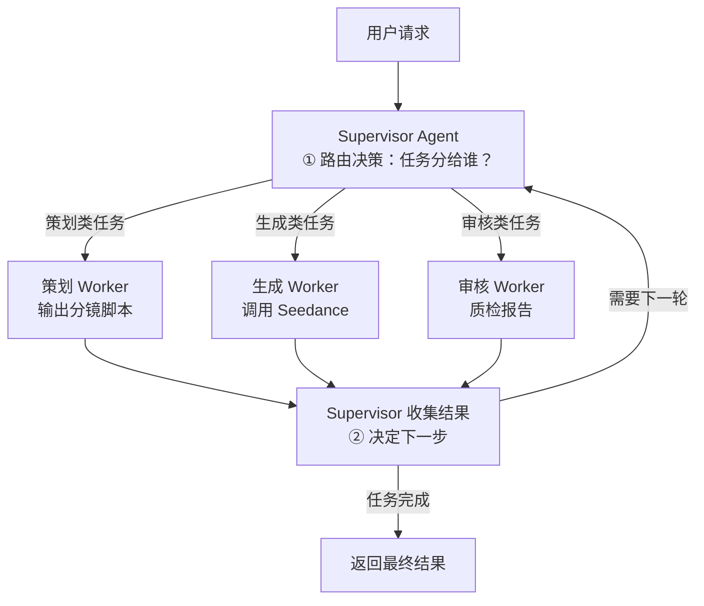
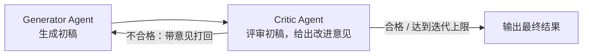
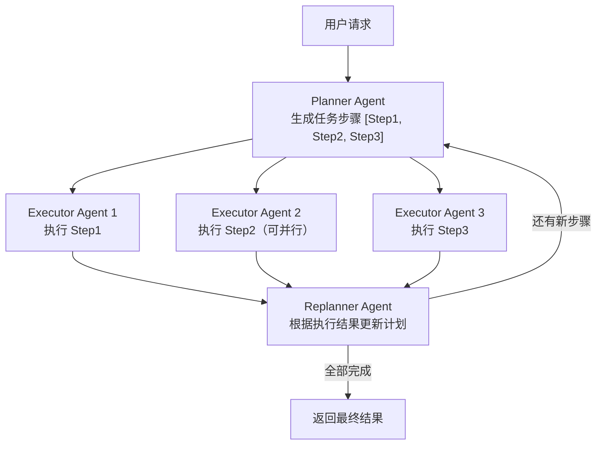
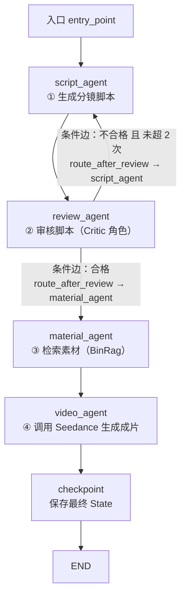

# 05 · Multi-Agent 编排与 LangGraph

> 来源：导师《Agent 学习路径》第 5 章提炼展开版。前四章解决"单个 Agent 怎么想、怎么用工具"，本章解决"多个 Agent 怎么协作"——这是面试官区分"会调 API"和"会做系统设计"的分水岭。
> 面试要求：**三种编排模式能画图讲清楚，LangGraph 四个核心概念（State/Node/Edge/Checkpoint）能结合项目落地，Worker 失败的处理有完整思路。**
> 实践项目：shatangAI（视频生成：脚本 → 素材 → 成片）、BinRag（素材检索）。

## 本章学习目标

1. 能说出单 Agent 的四大局限（上下文窗口 / 专业化 / 并行效率 / 质量保证），并解释为什么 Multi-Agent 能解决它们。
2. 能画出并讲清三种核心编排模式：Supervisor-Worker、Reflection、Plan-and-Execute，各配一个 shatangAI/BinRag 的真实场景。
3. 理解 LangGraph 的四个核心概念，能说清"State 为什么是全局共享的"以及"State 和普通变量有什么区别"。
4. 能写出一个完整的 LangGraph 视频生成工作流（script_agent → 审核条件分支 → material_agent → video_agent），并给出 Go 侧的等价实现思路。
5. 能回答 5 道本章必考题，Worker 失败、信息传递等追问都有工程化答案。

## 核心知识点提炼

| 知识点 | 一句话核心 | 面试要会画/会讲 |
|--------|-----------|----------------|
| 单 Agent 四大局限 | 上下文装不下、Prompt 不专一、串行慢、无人把关 | 为什么不用一个大 Agent |
| Supervisor-Worker | 一个"监督者"路由分发，多个"工作者"专注单任务 | 架构图 + 失败处理策略 |
| Reflection（反思） | 生成 → 批判 → 再生成，直到达标或达迭代上限 | 循环图 + shatangAI 脚本审核 |
| Plan-and-Execute | 先规划步骤，再执行，执行中可再规划 | 与第 4 章 ReAct 对比 |
| LangGraph State | 全工作流共享的数据结构（TypedDict） | State vs 普通变量 |
| LangGraph Node | 无副作用的"输入 State → 返回增量字段"函数 | 为什么只返回要更新的字段 |
| LangGraph Edge | 普通边固定流向；条件边按 State 动态路由 | 条件边 = 审核分支 |
| LangGraph Checkpoint | 自动保存每步 State，支持暂停/恢复/回溯 | 生产环境为什么必须 |
| LangGraph vs LangChain | 图式支持循环与分支，链式只支持线性 | 对比表张口就来 |

---

## 5.1 为什么需要 Multi-Agent（单 Agent 的局限）

一个直觉问题：**"反正都是同一个 LLM，为什么要拆成好几个 Agent？"** 答案是：单个 Agent 有四个结构性局限，而 Multi-Agent 是工程上的拆解手段——就像你不会让一个工程师既写前端又写后端又管运维，而是拆成团队、明确分工、互相 review。



### 5.1.1 局限一：上下文窗口限制

一次真实的视频创作任务，需要同时"看到"的信息包括：用户需求、商品资料（BinRag 检索结果）、参考脚本、用户历史风格偏好、平台时长/违禁词规则、素材清单……加起来轻松超过几万 Token。把这些全塞进一个 Agent 的 Context Window，有两个问题：

1. **装不下**：超窗内容模型根本看不到，任务必然做不好；
2. **不经济**：Token 成本随输入线性增长，且大量无关信息会稀释注意力（长上下文"中间迷失"）。

Multi-Agent 的解法：**每个 Agent 只看自己需要的片段**。策划 Agent 只看用户需求，素材 Agent 只看脚本，上下文各取所需，互不污染。

### 5.1.2 局限二：专业化

策划、生成、审核三个环节的"专家知识"完全不同，需要的系统提示和工具也不一样：

```python
# 同一个基础模型，不同 Prompt + 不同工具 = 不同"专家"
PLAN_PROMPT = "你是短视频策划专家：输出分镜脚本（镜头、文案、时长、BGM 建议）"
GENERATE_PROMPT = "你是视频生成调度者：把脚本转为 Seedance 的调用参数，处理素材拼接"
REVIEW_PROMPT = "你是资深剪辑审核：评估节奏、卖点清晰度、违禁词合规，输出通过/修改意见"
```

单 Agent 的 Prompt 只能是一个"平均化"的 Prompt，做策划时不够专业、做审核时不够严格。拆成三个 Agent 后，每个角色都能用**量身定制的 Prompt + 专用工具集**，质量上限显著更高。

### 5.1.3 局限三：并行效率

单 Agent 只能串行：先写脚本、再找素材、再生成视频，一步步来。Multi-Agent 可以并行：**生成脚本的同时，让素材检索 Agent 去 BinRag 里搜商品图库，让竞品分析 Agent 去抓同类爆款**——互不依赖的子任务同时跑，整条流水线的墙钟时间大幅缩短。这是"多线程"思想在 Agent 层的体现。

### 5.1.4 局限四：质量保证

生成者很难客观评价自己的输出（既当运动员又当裁判）。Multi-Agent 的 Reflection 模式让**另一个 Agent 用不同的 Prompt 来评审**：审核 Agent 以"资深剪辑"视角挑毛病，能发现节奏拖沓、卖点不清晰、命中广告法违禁词等问题。质量保证从"自说自话"变成"交叉检查"，这是单 Agent 结构上做不到的。

---

## 5.2 三种核心编排模式

面试官常问："Multi-Agent 有哪些组织方式？" 标准答案就是下面三种，**每种都要能画图 + 配一个自己的项目场景**。

### 5.2.1 模式一：Supervisor-Worker（监督者-工作者）



**Supervisor 的职责**（像项目负责人）：接收用户请求 → 判断该把任务给哪个 Worker（路由决策）→ 收集 Worker 的结果 → 决定任务是否完成、下一步做什么。**Worker 的职责**（像一线员工）：专注执行被分配的单一任务，**不需要知道大局**，只对输入输出负责。

**适合场景**：任务类型固定、需要专业化分工的场景。比如 shatangAI 里"用户来了先判断他要什么"：是"做个产品展示视频"还是"改一版已有脚本"还是"审核一个脚本"——Supervisor 先分类再分发，比让一个 Agent 什么都干清晰得多。

```python
# Supervisor-Worker 极简实现思路（伪代码）
workers = {
    "plan":     plan_worker,      # 策划 Worker
    "generate": generate_worker,  # 生成 Worker
    "review":   review_worker,    # 审核 Worker
}

def supervisor(user_request: str):
    # ① 路由决策：LLM 判断任务类型
    task_type = llm.invoke(f"判断任务类型（plan/generate/review）：{user_request}")
    # ② 分发执行
    result = workers[task_type](user_request)
    # ③ 收集结果，决定任务是否完成（可进入下一轮路由）
    return decide_next(result)
```

### 5.2.2 模式二：Reflection（反思）



**流程**：Generator 生成初稿 → Critic 评审并给出改进意见 → Generator 根据意见修改 → 重复，直到 Critic 满意或达到迭代次数上限（**必须设上限，防止死循环**，这也是第 4 章"死循环防护"思想的延伸）。

**适合场景**：需要高质量输出的任务——代码生成（评审语法与边界）、文章写作（评审逻辑与文风）、视频脚本（评审节奏与卖点）。**在 shatangAI 里的应用**（多 Agent 版脚本审核）：生成视频脚本 → 审核 Agent 评估脚本质量（节奏、卖点、违禁词）→ 不合格则带着修改意见重新生成，最多迭代 2 次。这个场景在第 5.4 节会变成完整的 LangGraph 工作流。

```python
def reflection_loop(initial_draft: str, max_iterations: int = 3) -> str:
    draft = initial_draft
    for i in range(max_iterations):
        feedback = critic_agent(draft)              # Critic 评审
        if feedback["passed"]:
            return draft                            # 通过，提前退出
        draft = generator_agent(draft, feedback)    # 按意见修改后继续
    return draft                                    # 达迭代上限，输出最后一版
```

### 5.2.3 模式三：Plan-and-Execute（规划-执行）



**与第 4 章呼应**：ReAct 是"边想边做"——每执行一步工具调用都重新思考；Plan-and-Execute 把"想"和"做"拆开——Planner 一次性生成步骤清单，Executor 批量执行（互不依赖的步骤可并行），Replanner 根据执行结果修正计划。适合**长流程、步骤相对可预测**的任务：比如"生成一支带货视频"可以规划成 [写脚本 → 找素材 → 生成视频 → 加字幕]，如果素材找不到，Replanner 再补一步"改写脚本规避无版权素材"。

| 维度 | ReAct（第 4 章） | Plan-and-Execute（本章） |
|------|------------------|--------------------------|
| 规划时机 | 边执行边规划（每步都重新想） | 先一次性规划，再执行 |
| 适用任务 | 步骤未知、需要动态探索 | 步骤可预测、流程固定 |
| 并行能力 | 弱（串行思考-行动） | 强（步骤间可并行） |
| 失败恢复 | 重新思考下一步 | Replanner 修正计划 |

---

## 5.3 LangGraph 核心概念

LangGraph 是 LangChain 团队出的**图式编排框架**（字节系工程里很常见，面试提它有加分），核心思想一句话：**把 Agent 工作流建模为有向图——State 是全局共享的数据结构，Node 是无副作用的状态转换函数，Edge 定义流转逻辑，Checkpoint 让每一步可回放。** 官方文档：https://langchain-ai.github.io/langgraph/ （重点看 Tutorials → "Build a basic chatbot" 和 "Build a multi-agent system"）。

### 5.3.1 State（状态）：全工作流共享的数据结构

State 是**整个工作流共享的一份数据**，所有 Node 都读写它。用 TypedDict 定义它的字段结构：

```python
from typing import TypedDict, List

class VideoState(TypedDict):
    user_request: str     # 用户原始需求
    script: str           # 分镜脚本（script_agent 写入）
    materials: List[str]  # 素材清单（material_agent 写入）
    video_url: str        # 成片地址（video_agent 写入）
    review_passed: bool   # 审核是否通过
    review_count: int     # 已迭代次数（防死循环）
```

**State 和普通变量的区别**（高频追问，详见面试 Q3）：普通变量是某个函数内部的局部状态，函数结束就没了；State 是整个图共享的"全局黑板"，Node 写进去、后续 Node 读出来，并且会被 Checkpoint 持久化——这是它能支撑暂停/恢复/回溯的根本原因。

### 5.3.2 Node（节点）：处理 State 的函数

Node 是**处理 State 的函数**：输入整个 State，输出**要更新的字段**（增量更新，不是返回整个 State）：

```python
def script_agent(state: VideoState) -> dict:
    # 只返回要更新的字段，LangGraph 会自动 merge 进 State
    script = generate_script(state["user_request"])
    return {"script": script}
```

注意：Node 应该是**无副作用**的——不直接改外部数据库、不写全局变量，只做"读 State → 计算 → 返回增量字段"的纯函数式转换。这样每个节点可单独测试、可回放，这是图式编排工程化的基础。

### 5.3.3 Edge（边）：节点间的连接关系

- **普通边（固定流向）**：无条件地把 A 接到 B。`graph.add_edge("script_agent", "material_agent")` 表示脚本生成后固定去素材检索。
- **条件边（动态路由）**：根据 State 的当前内容动态决定下一个节点，用 `add_conditional_edges` 实现。典型场景就是审核分支：**"脚本审核通过 → 继续生成视频；不通过 → 重新生成"**。

```python
def route_after_review(state: VideoState) -> str:
    # 路由函数：返回值是"下一个节点的名字"
    if state["review_passed"]:
        return "material_agent"   # 通过 → 去检索素材
    return "script_agent"         # 不通过 → 回炉重写

graph.add_conditional_edges(
    "review_agent",
    route_after_review,
    {"material_agent": "material_agent", "script_agent": "script_agent"},
)
```

### 5.3.4 Checkpoint（检查点）：生产环境的关键机制

Checkpoint 自动保存**每一步执行后的 State 快照**，带来三个生产级能力：

1. **暂停与恢复**：长任务（如视频生成）可以挂起，人工审批节点可以"暂停等人"再"恢复执行"；
2. **错误回溯**：某个 Node 失败时，不用从头重跑整个工作流，从最近一个 Checkpoint 恢复；
3. **时间旅行调试**：回放任意一步的 State，定位"哪一步开始错的"。

```python
from langgraph.checkpoint.memory import MemorySaver

# 开发环境用内存版；生产环境换成持久化 Checkpointer（如 SqliteSaver / PostgresSaver）
app = graph.compile(checkpointer=MemorySaver())
```

### 5.3.5 LangGraph vs LangChain

| 维度 | LangChain（链式） | LangGraph（图式） |
|------|------------------|-------------------|
| 结构模型 | 线性 Chain，一个接一个 | 有向图，Node + Edge |
| 循环 | 不支持，要自己写 while | 原生支持（Reflection 迭代） |
| 分支 | 要自己写 if/else 胶水 | `add_conditional_edges` 声明式路由 |
| State | 各 Chain 内部私有变量 | 全局共享 TypedDict + Checkpoint 持久化 |
| 生产能力 | 弱（无状态恢复） | 暂停/恢复/错误回溯 |

**一句话总结设计哲学**：相比 LangChain 的链式设计，LangGraph 支持**循环**（Reflection 模式的迭代）和**分支**（条件路由），更适合需要动态决策的 Multi-Agent 场景；Checkpoint 机制是生产环境的关键，它让长时运行的 Agent 任务支持暂停、恢复和错误回溯。

---

## 5.4 完整示例：LangGraph 视频生成工作流（含 Go 对照）

把 shatangAI 的核心流程落成一个 LangGraph 图：**script_agent（写脚本）→ review_agent（审核，条件分支）→ material_agent（找素材）→ video_agent（生成成片）**。



### 5.4.1 Python 完整实现（带注释）

```python
from typing import TypedDict, List
from langgraph.graph import StateGraph, END
from langgraph.checkpoint.memory import MemorySaver

# ---------- State：全工作流共享的数据结构 ----------
class VideoState(TypedDict):
    user_request:  str
    script:        str
    review_passed: bool
    review_opinion: str          # 审核意见（打回时带给 script_agent）
    review_count:  int
    materials:     List[str]
    video_url:     str

MAX_REVIEW = 2                   # 审核迭代上限，防止死循环

# ---------- Node：无副作用的状态转换函数 ----------
def script_agent(state: VideoState) -> dict:
    """① 策划角色：把用户需求写成脚本；被审核打回时带上修改意见"""
    script = generate_script(state["user_request"],
                             feedback=state.get("review_opinion"))
    return {"script": script}

def review_agent(state: VideoState) -> dict:
    """② 审核角色：以资深剪辑视角评审，返回是否通过 + 意见"""
    passed, opinion = review_script(state["script"])
    return {"review_passed": passed,
            "review_opinion": opinion,
            "review_count": state["review_count"] + 1}

def material_agent(state: VideoState) -> dict:
    """③ 素材角色：基于脚本关键词调 BinRag 检索商品图/视频素材"""
    materials = binrag_search(state["script"])
    return {"materials": materials}

def video_agent(state: VideoState) -> dict:
    """④ 生成角色：脚本 + 素材 → 调用 DashScope/Seedance 生成成片"""
    url = seedance_generate(state["script"], state["materials"])
    return {"video_url": url}

# ---------- Edge：条件边路由函数 ----------
def route_after_review(state: VideoState) -> str:
    """审核不过且未超次数 → 回 script_agent 重写；否则 → 继续"""
    if not state["review_passed"] and state["review_count"] < MAX_REVIEW:
        return "script_agent"
    return "material_agent"

# ---------- 构图与编译 ----------
g = StateGraph(VideoState)
g.add_node("script_agent", script_agent)
g.add_node("review_agent", review_agent)
g.add_node("material_agent", material_agent)
g.add_node("video_agent", video_agent)

g.set_entry_point("script_agent")
g.add_edge("script_agent", "review_agent")           # 普通边：固定流向
g.add_conditional_edges("review_agent", route_after_review,   # 条件边：审核分支
    {"script_agent": "script_agent", "material_agent": "material_agent"})
g.add_edge("material_agent", "video_agent")
g.add_edge("video_agent", END)

app = g.compile(checkpointer=MemorySaver())           # 生产环境换持久化 Checkpointer

# ---------- 执行 ----------
final = app.invoke({"user_request": "给这款保温杯做一支 30s 产品展示视频",
                    "review_count": 0})
print(final["video_url"])
```

**逐段讲解**：State 定义了 7 个字段，是所有节点通信的"黑板"；四个 Node 各自只做一件事，且**只返回要更新的字段**；`route_after_review` 是条件边的路由函数，它让"审核 → 打回 → 重写"形成一条**循环边**（LangChain 做不到，LangGraph 原生支持）；`checkpointer` 让每一轮迭代的 State 都被保存，长任务中断后可以从 Checkpoint 恢复。这整个图的本质，就是 5.2 节"Supervisor-Worker + Reflection"两种模式的融合实现。

### 5.4.2 Go 侧对照：等价编排实现

Go 生态没有 LangGraph 官方库，但它的图式编排思想在 Go 里**完全可以手写**，思路是：**struct 定义 State + map 注册 Node + 路由函数实现条件边 + for 循环驱动图**（也可以直接引入有限状态机库，如 `github.com/looplab/fsm`）。

```go
// ① State：等价 LangGraph 的 TypedDict
type VideoState struct {
	UserRequest   string
	Script        string
	ReviewPassed  bool
	ReviewOpinion string
	ReviewCount   int
	Materials     []string
	VideoURL      string
}

const maxReview = 2

// ② Node：统一签名为 func(*VideoState) error，等价 add_node
type NodeFunc func(s *VideoState) error

func scriptAgent(s *VideoState) error {
	script, err := generateScript(s.UserRequest, s.ReviewOpinion)
	if err != nil {
		return err
	}
	s.Script = script // 直接改共享 State；LangGraph 是返回增量字段，Go 是原地改
	return nil
}

var nodes = map[string]NodeFunc{
	"script_agent":   scriptAgent,
	"review_agent":   reviewAgent,
	"material_agent": materialAgent,
	"video_agent":    videoAgent,
}

// ③ 条件边：路由函数返回下一个节点名，等价 add_conditional_edges
func routeAfterReview(s *VideoState) string {
	if !s.ReviewPassed && s.ReviewCount < maxReview {
		return "script_agent" // 打回重写
	}
	return "material_agent"   // 通过，继续
}

// ④ 图驱动：邻接表 + 循环，等价 StateGraph.compile().invoke()
func runGraph(s *VideoState, entry string) error {
	cur := entry
	for cur != "END" {
		fn, ok := nodes[cur]
		if !ok {
			return fmt.Errorf("未知节点: %s", cur)
		}
		if err := fn(s); err != nil {
			// 错误回溯：LangGraph 靠 Checkpoint，Go 侧靠 State 快照恢复
			return fmt.Errorf("节点 %s 失败: %w", cur, err)
		}
		if cur == "review_agent" {
			cur = routeAfterReview(s)
		} else {
			cur = "END"
		}
	}
	return nil
}

// ⑤ Checkpoint 的 Go 等价：每步执行后把 State 序列化快照存 Redis/MySQL
func saveCheckpoint(s *VideoState, node string) error {
	data, _ := json.Marshal(s)
	return redis.Set(ctx, "checkpoint:"+s.UserRequest+":"+node, data, 24*time.Hour).Err()
}
```

**Go 对照要点**：① `VideoState` struct 等价 TypedDict；② `nodes` map 等价 `add_node` 注册表，Node 签名统一为 `func(*VideoState) error`，天然支持并发 Worker（每个 Node 可起 goroutine）；③ `routeAfterReview` 等价条件边路由函数；④ `runGraph` 用循环驱动邻接表，**注意 Go 是原地修改 State**，而 LangGraph 是函数式返回增量字段——所以 Go 侧要手动调用 `saveCheckpoint` 打点，才能获得与 Checkpoint 等价的"任意一步可恢复"能力（这也是 Go 工程里把 Agent 状态快照 + 任务队列（如 BullMQ）结合做断点续跑的常见姿势）。面试时能画出"struct + map + 路由函数 + 驱动循环"这张图，Go 侧的编排能力就讲透了。

---

## 面试问答（含参考答案）

**Q1：为什么要用 Multi-Agent 而不是一个大 Agent？**

> 四个原因。第一是上下文窗口，复杂任务的全部信息放不进单个 Context Window，塞进去既超限又费 Token；第二是专业化，策划、生成、审核需要完全不同的系统提示和工具集，一个"平均化"的 Agent 什么都做不精；第三是并行效率，互不依赖的子任务可以同时跑，缩短整体耗时；第四是质量保证，生成者无法客观评价自己，需要另一个 Agent 交叉检查。以 shatangAI 为例，脚本生成、素材检索、成片审核如果塞进一个 Agent，Prompt 会互相打架，也无法并行，所以按角色拆成多个 Agent 是工程上的必然。

**Q2：Supervisor 模式和 Reflection 模式分别适合什么场景？**

> Supervisor 适合任务类型固定、需要专业化分工的场景：一个监督者做路由决策，把请求分发给策划、生成、审核等工作者，工作者专注单任务。Reflection 适合需要高质量输出的场景：生成者出初稿，批判者评审给意见，循环修改直到满意或达到迭代上限，典型应用是代码生成、文章写作、视频脚本。两者不冲突，可以嵌套用——Supervisor 分发任务，其中某个 Worker 内部再用 Reflection 保证质量。我在 shatangAI 里就是脚本生成环节用 Reflection 做审核迭代。

**Q3：LangGraph 里的 State 和普通变量有什么区别？**

> 普通变量是函数内部的局部状态，函数结束就销毁；State 是整个工作流共享的数据结构，所有 Node 都读写它，是 Agent 之间通信的"黑板"。区别有三点：一是作用域，State 是图级别的全局可见，普通变量只在本函数可见；二是持久化，State 会被 Checkpoint 自动保存，支持暂停、恢复和错误回溯，普通变量丢了就丢了；三是驱动逻辑，条件边要根据 State 的当前内容做路由决策，所以 State 不只是一个数据容器，它还是图的"决策依据"。用 TypedDict 定义 State 还带了类型约束，节点只能返回定义过的字段。

**Q4：Agent 之间如何传递信息？**

> 通过共享 State，而不是 Agent 之间直接互相调用。每个 Agent（Node）只做两件事：从 State 读它需要的字段，把结果作为增量字段写回 State，后续节点再读。这样设计的本质是解耦——Agent 之间不需要知道彼此的存在，只依赖"黑板"上的数据契约，这保证了每个节点可以独立测试和复用。更重要的是，只有信息经过 State 流转，图才能支持条件路由（根据 State 决定下一个节点）和 Checkpoint 恢复（每一步的 State 都被保存）；如果 Agent 直接互相调用，就退化成普通函数调用链，既没法动态路由，也没法断点重跑。

**Q5：如果 Worker Agent 失败了，Supervisor 如何处理？**

> 三个层次。第一是重试：区分可重试错误（网络超时、临时限流）与不可重试错误（参数错误），可重试的按退避策略重试有限次；第二是降级与替换：这个 Worker 不行就换一个能力等价的后备方案，比如生成 Agent 调用 Seedance 失败，降级用备选模型或返回半成品加提示；第三是结果归因：Supervisor 记录失败原因，把任务标记为"失败/部分完成"并如实告诉用户，而不是假装成功。工程上我会配合 Checkpoint 使用——LangGraph 能从失败节点的前一个 Checkpoint 恢复重跑，而不是整个工作流从头再来；Go 侧则把 State 快照存 Redis，结合任务队列做断点续跑和重试。

## 自测清单

- [ ] 能不看资料说出单 Agent 的四大局限，并各配一个 shatangAI/BinRag 的例子。
- [ ] 能手绘 Supervisor-Worker 架构图，讲清 Supervisor 与 Worker 各自的职责边界。
- [ ] 能手绘 Reflection 循环图，说出为什么必须设迭代上限。
- [ ] 能对比 ReAct 与 Plan-and-Execute，说出各自适合的任务类型。
- [ ] 能解释 LangGraph 的 State/Node/Edge/Checkpoint 四个概念，并说出 State 和普通变量的区别。
- [ ] 能写出 `add_conditional_edges` 实现审核分支的最小示例（含路由函数）。
- [ ] 能画出第 5.4 节的视频生成工作流图（含条件边循环），并逐节点讲清职责。
- [ ] 能说出 Go 侧等价实现的三要素（struct State + map 注册 Node + 路由函数驱动循环），以及 Go 侧 Checkpoint 怎么做。
- [ ] 5 道面试问答能脱稿回答，Q5（Worker 失败处理）能讲出重试/降级/归因三层。

## 与既有文档联动

- 上一章 ReAct 与 Agent 规划（Plan-and-Execute 的源头）：[04-ReAct 与 Agent 规划](./04-ReAct与Agent规划)
- 下一章 Agent 记忆与评测体系（Multi-Agent 如何记住用户、如何量化效果）：[06-Agent 记忆与评测体系](./06-Agent记忆与评测体系)
- 30 天冲刺执行版（Day 13-15 Agent 层、Day 16-17 评估）：[路线专题/03-大模型与Agent核心能力](../路线专题/03-大模型与Agent核心能力)
- Agent 后端工程化（状态快照、任务队列、断点续跑）：[后端技术栈强化/06-agent-backend/系统设计与串联](../后端技术栈强化/06-agent-backend/系统设计与串联)
- 面试 STAR 话术与项目深挖（把编排模式讲成项目亮点）：[路线专题/04-简历项目改造与面试实战](../路线专题/04-简历项目改造与面试实战)
