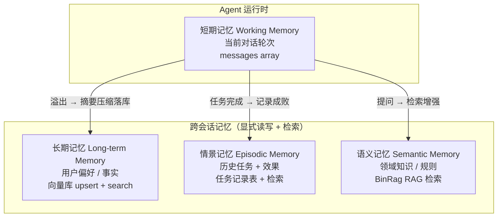
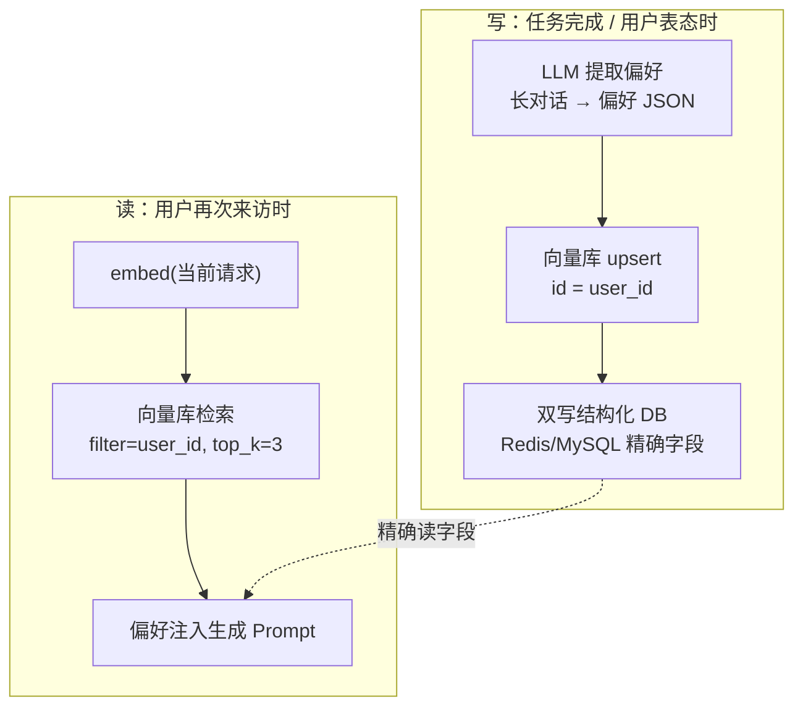
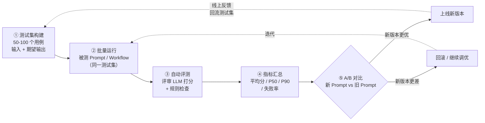

# 06 · Agent 记忆与评测体系

> 来源：导师《Agent 学习路径》第 6 章提炼展开版。JD 明确要求**"设计 Prompt / Workflow / 评测体系"**——前两件前面章节已覆盖，本章把"记忆系统"和"评测体系"补齐，让整个 Agent 系统既有"记性"又有"度量衡"。
> 面试要求：**四种记忆能分类、短期记忆溢出有三种解法、长期记忆能写代码落地；"感觉还不错"为什么不够、评测体系怎么建，要有完整闭环。**
> 实践项目：BinRag（语义记忆 = 知识库）、shatangAI（长期记忆 = 用户偏好 + 评测体系 = 脚本/成片质量度量）。

## 本章学习目标

1. 能说出 Agent 的四种记忆类型（短期/长期/情景/语义），各对应什么存储实现，能区分"记住文档"和"记住用户"。
2. 能讲清短期记忆溢出的三种解决方案（Window Buffer / 摘要压缩 / Token Buffer）的原理与优缺点。
3. 能写出长期记忆"提取偏好 → 向量库 upsert → 下次检索"的完整代码并解释每一行。
4. 能解释为什么"感觉还不错"不是工程标准，并设计完整评测体系（测试集 → 自动评测 → 指标汇总 → A/B）。
5. 能回答 4 道本章必考题，全部结合 BinRag / shatangAI 讲出落地细节。

## 核心知识点提炼

| 知识点 | 一句话核心 | 面试要会画/会讲 |
|--------|-----------|----------------|
| 短期记忆 | 当前对话轮次，messages array | 溢出时怎么办 |
| 长期记忆 | 跨会话的用户偏好/事实，向量库或结构化 DB | 提取 + 持久化 + 检索代码 |
| 情景记忆 | "上次做了 X，效果 Y"，历史任务记录 + 检索 | Agent 怎么从经验中学习 |
| 语义记忆 | 领域知识/规则，RAG 知识库 = 你的 BinRag | 区分知识库与用户记忆 |
| Window Buffer | 只保留最近 N 轮，简单但丢早期信息 | 三种方案优缺点对比 |
| 摘要压缩 | 超阈值时 LLM 把旧历史压成摘要 | 有损 + 额外 LLM 成本 |
| Token Buffer | 按 Token 数精确裁剪历史 | 最精确但实现复杂 |
| 评测体系 | 测试集 + 自动评测 + 指标汇总 + A/B | "感觉还不错"为什么不够 |
| 指标汇总 | 平均分 / P50 / P90 / 失败率 | P90 反映最差 10% |

---

## 6.1 Agent 的四种记忆类型

面试官的高频开局问题："**BinRag 有知识库，是不是就有记忆了？**" 答案：**不是**。BinRag 的知识库回答"世界是怎样的"（领域知识），而"记住用户"是另一回事——回答的是"你是谁、你上次要什么、你喜欢什么风格"。前者是语义记忆，后者主要是长期记忆和情景记忆，两者存储的东西完全不同。



### 6.1.1 四种记忆对照表

| 记忆类型 | 类比 | 存储内容 | 实现方式 |
|---|---|---|---|
| 短期记忆（Working Memory） | 人的短时记忆 | 当前对话轮次 | 对话历史列表（messages array） |
| 长期记忆（Long-term Memory） | 人的长期记忆 | 跨会话的用户偏好/事实 | 向量数据库或结构化 DB |
| 情景记忆（Episodic Memory） | 人的经历记忆 | "上次用户做了X，效果Y" | 历史任务记录 + 检索 |
| 语义记忆（Semantic Memory） | 人的知识 | 领域知识、规则 | RAG 知识库（你的 BinRag） |

**记忆的读写时机（面试常追问）**：记忆不是随时乱写的，工程上遵循三个时机——**写**：任务完成时（总结这次交互）、用户明确表达偏好时（"我喜欢快节奏"）、用户否定时（"不要卡点剪辑"）；**读**：会话开始时（加载用户画像）、任务开始时（检索相关偏好）、组装 Prompt 时（注入命中片段）。读写都应该是**显式触发**的，而不是把整个记忆库无脑塞进上下文——这和 BinRag"先检索再注入"的思想一脉相承。

### 6.1.2 短期记忆与溢出问题

短期记忆就是**当前对话的上下文**：系统提示 + 历史消息 + 本轮输入，全部拼在 messages array 里发给 LLM。它的天然问题：**对话越来越长 → Token 超限**，必须做压缩。三种方案：

| 方案 | 做法 | 优点 | 缺点 |
|------|------|------|------|
| Window Buffer | 只保留最近 N 轮对话 | 实现最简单、零额外成本 | 丢失早期信息——用户开头说过的关键约束（"预算 500 以内"）会被裁掉 |
| 摘要压缩（Summary Memory） | 历史超过阈值时，让 LLM 把前面的对话压缩成摘要，摘要代替原始历史 | 早期信息以"压缩形态"保留，Token 可控 | 摘要本身有损（细节会丢）；每次压缩有额外 LLM 调用成本与延迟 |
| Token Buffer | 精确统计历史占用的 Token 数，按 Token 预算裁剪 | 最精确，能严格卡住预算 | 实现复杂，需要 tokenizer 精确计数，且裁剪边界可能切断半句话 |

```python
def compact_if_needed(messages, llm, threshold_tokens=8000):
    total = sum(estimate_tokens(m) for m in messages)
    if total <= threshold_tokens:
        return messages
    # 把最早的一半压成摘要，摘要代替原始历史（保留偏好与关键决定）
    early = messages[: len(messages) // 2]
    summary = llm.invoke(
        "把以下对话压缩成 200 字以内的摘要，"
        "必须保留：用户偏好、明确决定、未完成的事项。\n" + str(early)
    )
    return [{"role": "system", "content": f"历史摘要：{summary}"}] \
           + messages[len(messages) // 2:]
```

**工程上的组合策略**：不是三选一，而是**摘要压缩为主 + Token Buffer 兜底**——先按轮次做摘要压缩保留早期语义，再用 Token Buffer 精确卡住剩余预算，防止偶发超长输入击穿上限。

### 6.1.3 长期记忆落地（要能写代码）

长期记忆解决"**跨会话记住用户**"：用户上次说"节奏太慢，要快一点"，下次来不能装作不认识。完整实现分两步：**写（提取 + 持久化）** 和 **读（检索 + 注入）**。



```python
# ========== 写：用户完成一次视频创作后，提取偏好写入长期记忆 ==========
def extract_and_save_preference(conversation_history, user_id):
    # ① 让 LLM 从对话中提取用户偏好（结构化抽取，不是把全文存下来）
    preference = llm.invoke(f"""
从以下对话中提取用户的视频创作偏好（风格、时长、受众等）：
{conversation_history}
输出 JSON 格式。""")
    # ② 写入向量库（以便下次按语义检索）
    #    id 用 user_id：同一用户的新偏好覆盖旧偏好（upsert = update or insert）
    vector_db.upsert(
        id=user_id,
        vector=embed(preference),                       # 偏好文本 → 向量
        metadata={"user_id": user_id,
                  "preference": preference,             # 原始文本也存进 metadata
                  "updated_at": now()},
    )
    # ③ 可选：同时写一份到结构化 DB（如 Redis/MySQL），存偏好 JSON，
    #    供"精确字段查询"用（如直接读用户偏好的风格字段）
    redis.set(f"user:{user_id}:preference", preference)

# ========== 读：下次用户来时，检索历史偏好 ==========
def get_user_preference(user_id, current_request) -> str:
    # ① 用当前请求的语义去检索该用户的历史偏好（而不是全量拉回）
    query_vector = embed(current_request)
    results = vector_db.search(
        filter={"user_id": user_id},                    # 只搜这个用户的记录
        query_vector=query_vector,
        top_k=3,                                        # 取最相关的 3 条
    )
    return results
```

**逐行解释（面试要能讲）**：第一步用 LLM 做**结构化抽取**——把长对话浓缩成 JSON 偏好，而不是存原始对话（省存储、好检索）；第二步 `upsert` 是"有则更新、无则插入"，保证一个用户只有一条最新偏好，`metadata` 里同时存向量和原文，检索结果直接可用；第三步是双写，向量库负责语义检索、Redis 负责精确读字段，各取所长。读的时候**用当前请求做查询向量 + 按 user_id 过滤 + top_k=3**，只拿最相关的偏好注入 Prompt，而不是把用户所有历史都塞进去——这和 BinRag 的检索思想完全一致：**先召回，再注入，永远不把整个库搬进上下文**。

**为什么用向量库而不是只用 MySQL**（加分点）：偏好是自然语言，用户表达"想要那种节奏快、有反转的带货风格"和"要快节奏、带反转"语义相同但文本不同——**关键词精确匹配（SQL LIKE）匹配不上，向量检索能按语义命中**。所以长期记忆的主存储选向量库，结构化 DB 只做精确字段的辅助查询（比如直接读"默认时长偏好"）。小规模用户量时也可以用 MySQL 的全文检索或直接按 user_id 全量读取（用户量小、偏好条数少，全量读也可接受），面试时说明这个取舍即可。

### 6.1.4 情景记忆与语义记忆

- **情景记忆（Episodic Memory）**：记录"上次做了什么、效果如何"的成败模式，让 Agent 从经验中学习。实现 = 历史任务记录表（task_id、用户、动作、结果、效果评分）+ 按相似场景检索。比如 shatangAI 记录"上次给这个商品生成的视频点击率低，原因是前 3 秒没有展示产品"，下次同类任务先检索到这条失败经验，规避同样的坑。

```python
# 情景记忆：历史任务记录表（结构化 DB / 向量库均可）
def save_task_record(task_id, user_id, action, result, score):
    """写：任务结束后记录"做了什么 + 效果如何""""
    task_log.upsert({
        "task_id": task_id, "user_id": user_id,
        "action": action,    # 做了什么（如"生成了情感型带货脚本"）
        "result": result,    # 结果（通过 / 用户取消 / 点击率低）
        "score": score,      # 效果评分（人工或自动）
        "created_at": now(),
    })

def recall_failed_patterns(user_id, current_request):
    """读：按相似场景检索失败记录，避免重复犯错"""
    query_vector = embed(current_request)
    return task_log.search(
        filter={"user_id": user_id, "result": "fail"},  # 只召回失败经验
        query_vector=query_vector,
        top_k=3,
    )
```

情景记忆和长期记忆的区别一句话：**长期记忆记"用户想要什么"，情景记忆记"什么做法有效/无效"**——前者服务个性化，后者服务经验复用。
- **语义记忆（Semantic Memory）**：领域知识与规则，就是你的 **BinRag**——文档知识库通过 向量+BM25 混合检索 → RRF 融合 → Cross-encoder 重排 提供"事实性知识"。语义记忆是静态的（文档不变就不变），长期/情景记忆是动态的（随用户交互累积）。

### 6.1.5 shatangAI 里的记忆应用（面试举例）

在 shatangAI 中，长期记忆落地为三个具体能力：

1. **记住用户偏爱的视频风格**：快节奏 / 情感型 / 产品展示——用户做视频时把偏好写进长期记忆，下次生成时先检索再注入 Prompt；
2. **记住用户常用的商品类别**：做带货视频的用户常做"数码配件"，下次可以默认按该品类给素材建议；
3. **记住用户否定过的视频类型**：用户上次明确说"不要卡点剪辑"，记录成负向偏好，避免重复犯同样的错误——这是"从经验中学习"最直接的价值。

```python
# 检索到偏好后注入生成 Prompt 的示意
pref = get_user_preference(user_id, current_request)
prompt = f"""
用户本次需求：{current_request}
用户历史偏好：{pref}   # 命中则注入，未命中就跳过，不要硬编
请据此生成分镜脚本。
"""
```

**本质总结**：Agent Memory 解决的核心问题是——**AI 应该在多大范围内"记住"用户**。短期记忆是对话窗口内的上下文，通过摘要压缩解决 Token 限制；长期记忆是跨会话的用户偏好，需要显式提取和持久化存储；情景记忆记录历史交互的成败模式，让 Agent 能从经验中学习。在创作 Agent 场景里，长期记忆尤其重要——**记住用户的风格偏好能显著降低"每次都要重新沟通需求"的摩擦**，这也是产品体验从"工具"升级为"助理"的分水岭。

### 6.1.6 记忆的冲突、遗忘与隐私（加分点）

面试官可能继续深挖记忆系统的工程边界，三个点要能接住：

1. **冲突处理**：新偏好覆盖旧偏好（`upsert` 天然支持"以最新为准"）；当正面偏好和负面偏好同时存在时（用户说"喜欢快节奏"但"不要卡点剪辑"），**负面偏好优先**——避免重复犯错比迎合偏好更重要，生成 Prompt 时先注入负面约束。
2. **遗忘机制**：记忆不是只增不减。设计 `delete_by_user_id` / 记忆 TTL（超过 N 天未更新的偏好降权或删除），防止"用户三个月前想要 A，现在其实想要 B"的过期偏好干扰。
3. **隐私与合规**：用户数据要有明确的删除入口（"清除我的记忆"），涉及个人信息时遵循最小化存储原则——只存创作相关的偏好，不存无关对话原文。面试能主动说出"我们的记忆是可删除、可过期的"，比只说"能记住用户"高一个段位。

---

## 6.2 评测体系（JD 明确要求）

### 6.2.1 为什么需要评测

LLM 输出是**随机**的：同一个 Prompt 多次运行结果不同；改一个 Prompt 说"感觉更好了"——怎么证明？工程上必须量化回答两个问题：**"改了 Prompt 之后，是变好了还是变坏了？"** 和 **"这个系统现在到底什么水平？"**。"感觉还不错"不是工程标准，因为：① 无法回归——你无法知道改动是否让别的用例变差；② 无法比较——新旧版本谁更好没有依据；③ 无法排障——线上出问题了，你没有基线数据定位是哪次改动引起的。

举个真实的例子：你给 shatangAI 的脚本生成 Prompt 加了一句"突出产品卖点"，跑出来的脚本看起来确实更专业——但你不跑测试集就不会发现，它同时让"情感型脚本"这个用例从 85 分掉到 40 分（因为强制突出卖点破坏了情感叙事）。**没有评测体系，这类"按下葫芦浮起瓢"的回归问题只能等线上用户来发现。**

### 6.2.2 评测体系五步 pipeline



### 6.2.3 第 1 步：测试集构建

准备 **50-100 个测试用例**，每个用例 = （输入，期望输出）。来源有三：

1. **线上真实日志采样**：从生产环境取真实用户请求（脱敏），这是最接近真实的分布；
2. **边界 Case 手工构造**：空输入、超长输入、违禁词、多轮追问、无答案问题——这些最暴露系统短板；
3. **人工标注期望输出**：对每个用例标注"理想答案"，作为打分参照（标注质量决定评测质量）。

按项目举例：BinRag 的测试集是检索问答集（单跳问题 / 多跳问题 / 知识库外问题各一批，外加格式要求如"必须给出引用来源"）；shatangAI 的测试集是脚本生成用例（覆盖不同商品类型、风格、时长要求、违禁词边界）。

shatangAI 脚本生成测试集示例（面试可随手举 4 条）：

| 用例 ID | 输入 | 期望输出 | 覆盖点 |
|---------|------|----------|--------|
| S001 | 商品：保温杯；风格：快节奏 | 30s 脚本，前 3 秒展示产品 | 基础生成 |
| S002 | 超长商品描述（5000 字） | 脚本仍覆盖核心卖点，不跑题 | 长输入边界 |
| S003 | 约束："不要卡点剪辑" | 脚本无卡点剪辑设计 | 负向偏好 |
| S004 | 无商品信息 | 先追问补充，而不是硬编内容 | 信息缺失 |

这类表格直接在面试里讲出来，比抽象说"我有测试集"有说服力得多。

### 6.2.4 第 2 步：自动评测（评审模型 + 规则检查）

用**另一个 LLM（评审模型）打分** + **规则检查**（格式是否正确、必须字段是否存在），两者结合：

```python
def evaluate(question, expected, actual):
    # ① 规则检查：硬性约束不靠 LLM，用代码判（快、零成本、不抽风）
    checks = {
        "包含 script 字段": "script" in actual,
        "JSON 格式合法":     is_valid_json(actual),
        "时长在 30-60s":     30 <= extract_duration(actual) <= 60,
    }
    if not all(checks.values()):
        return {"pass": False, "reason": f"规则未通过: {checks}"}

    # ② LLM 评审：让评审模型按维度打分（生成模型不能自己评自己）
    score = judge_llm.invoke(f"""
你是严格的评审模型，请对以下回答打分（0-100）：
问题：{question}
期望输出：{expected}
实际输出：{actual}
按 相关性、完整性、格式正确性 三个维度评分，输出 JSON。""")
    return {"pass": score["total"] >= 60, "score": score}
```

**关键注意点**：① 规则检查用代码写死——格式、必填字段这类硬约束交给 LLM 既不快也不稳；② **评审模型与生成模型要分离**，生成者不能给自己打分（和 5.2 节 Reflection 是同一个道理）；③ 评审模型可选用能力更强或固定的模型（如固定 seed、低温度），保证评分本身的稳定性。

### 6.2.5 第 3 步：指标汇总

对 50-100 个用例的得分做统计，核心指标：**平均分、P50/P90 分位、失败率**。

```python
def percentile(sorted_scores, p):
    """p 分位：排序后第 p% 位置的分数"""
    idx = int(len(sorted_scores) * p / 100)
    return sorted_scores[idx]

scores = [72, 88, 45, 90, 66, 95, 30, 80, 75, 70]   # 示例：10 个用例的得分

avg = sum(scores) / len(scores)                          # 平均分：整体水平
sorted_scores = sorted(scores)
p50 = percentile(sorted_scores, 50)                      # P50：中位数，代表"典型表现"
p90 = percentile(sorted_scores, 90)                      # P90：最差 10% 的门槛
fail_rate = sum(1 for s in scores if s < 60) / len(scores)  # 失败率：低于阈值占比
```

**为什么必须看 P90**：平均分会被高分掩盖问题——10 个用例 9 个 95 分、1 个 30 分，平均分 88.5 看起来不错，但 P90 会暴露"有 10% 的用例烂到不可用"。线上体验的崩坏往往来自最差的那批输入（比如用户输入了超长文本），所以 **P90 和失败率是比平均分更敏感的回归指标**——一次 Prompt 改动让平均分涨了 2 分，但 P90 掉了 20 分，说明它牺牲了最差场景，这种改动应该被评测体系拦住。

### 6.2.6 第 4 步：A/B 测试

同一份测试集，分别跑**新 Prompt / 旧 Prompt**，对比指标。**控制变量**是核心：同一测试集、同一模型与参数（温度、seed）、同一评审模型——只允许被测的 Prompt 不同。指标差异显著（如平均分 +3 且 P90 不降）才允许上线；否则回滚继续调优。这就是"用数据代替感觉"的完整闭环。

一次 A/B 评测报告示例（面试可随手画出）：

| 指标 | 旧 Prompt | 新 Prompt | 结论 |
|------|-----------|-----------|------|
| 平均分 | 78.2 | 82.5 | +4.3 ✅ |
| P50 | 80 | 84 | ✅ |
| P90 | 55 | 62 | ✅ 最差场景也在改善 |
| 失败率 | 12% | 8% | ✅ |

> 如果新版本平均分 +2 但 P90 从 55 掉到 40，评测结论应该是**不通过**——它牺牲了最差输入，这个版本会被评测体系拦住。

### 6.2.7 第 5 步：视频生成评测（了解即可）

视频生成的结果是音视频，不能只靠文本打分，常用三层：**客观指标**（时长、分辨率、首帧时间、生成耗时）、**人工盲评**（A/B 双盲打分，评审者不知道哪个是新版本）、**语义一致性**（用 VLM 视觉大模型检查画面内容与脚本是否匹配，比如脚本说"展示保温杯密封性"但画面里没有倒水镜头，判定不一致）。这一层了解即可，面试能说出"视频评测 = 客观指标 + 人工盲评 + VLM 一致性"就是加分项。

### 6.2.8 Go 侧落地要点

评测体系本身与语言无关，Go 侧落地三个要点：① **测试集固化为文件/表**（JSON Lines 或数据库表，输入 + 期望输出 + 版本号）；② **评测跑批做成任务**（类似 BinRag 的异步任务队列，50-100 用例批量跑、结果落库）；③ **指标服务化**（每次评测生成一份报告，平均分/P50/P90/失败率 + 与上一次的 diff，让"改了 Prompt 变好还是变坏"有据可查）。面试能说出"我们的评测是 CI 里的一部分，每次改 Prompt 自动跑一遍测试集出报告"，评测体系就立住了。

### 6.2.9 评测体系的组织：离线回归 + 线上监控（加分点）

完整的评测体系是**双轨制**：

1. **离线回归（Offline Eval）**：上面五步就是离线评测——改 Prompt / 改 Workflow 时，跑一遍固定测试集（Golden Set），出报告决定上不上线。它回答"**改动前 vs 改动后**"。
2. **线上监控（Online Monitor）**：上线后持续抽样真实请求，用评审模型自动打分 + 收集用户反馈（点赞/取消/投诉），把**线上 bad case 回流进测试集**，让测试集跟着真实分布演进。它回答"**线上现在什么水平、有没有劣化**"。

双轨闭环：线上发现的问题 → 加入测试集 → 下次改动必然被回归到 → 修复后指标回升。这样评测体系就从"一次性打分"变成了"持续的质量工程"——面试时讲出这层闭环，直接命中 JD 的"评测体系"关键词。

---

## 面试问答（含参考答案）

**Q1：Agent 的四种记忆分别是什么？各用什么实现？**

> 短期记忆、长期记忆、情景记忆、语义记忆。短期记忆是当前对话轮次，用 messages array 实现；长期记忆是跨会话的用户偏好和事实，用向量数据库或结构化 DB（Redis/MySQL）实现，需要显式提取和持久化；情景记忆记录"上次做了什么、效果如何"的成败模式，用历史任务记录表加检索实现；语义记忆是领域知识和规则，用 RAG 知识库实现——就是我们的 BinRag。关键区分是：语义记忆回答"世界是怎样的"，长期和情景记忆回答"你是谁、你上次要什么"，我在 shatangAI 里就是用向量库存用户的视频风格偏好，每次生成前检索注入。

**Q2：短期记忆溢出怎么办？**

> 三种方案。Window Buffer 最简单，只保留最近 N 轮对话，但会丢掉早期信息——用户开头说过的关键约束可能被裁掉；摘要压缩（Summary Memory）是历史超过阈值时让 LLM 把早期对话压成摘要，用摘要代替原始历史，能保留早期语义但摘要本身有损、且有额外 LLM 调用成本；Token Buffer 最精确，按 Token 数精确裁剪历史，能严格卡预算但实现复杂，需要 tokenizer 计数。工程上我会组合用：摘要压缩为主保留早期信息，Token Buffer 兜底防止偶发超长输入击穿上限。

**Q3：为什么"感觉还不错"不够？评测体系怎么建？**

> 因为 LLM 输出是随机的，同一个 Prompt 多次运行结果不同，"感觉"既不能回归（不知道改动是否让别的用例变差）也不能比较（新旧版本谁好没有依据）。评测体系分五步：构建 50-100 个测试用例（输入 + 期望输出，从线上日志采样加边界 case 加人工标注）；批量运行被测 Prompt 或 Workflow；自动评测——规则检查用代码写死、质量打分交给独立的评审模型（生成模型不能自己评自己）；汇总指标——平均分、P50/P90、失败率；最后 A/B 对比新旧版本，指标显著更优才上线。在 shatangAI 里我就用这套流程评测脚本生成：改一次 Prompt，跑一遍测试集，看平均分和 P90 的变化决定是上线还是回滚。

**Q4：评测集怎么构建？指标怎么汇总？**

> 评测集构建三来源：线上真实日志采样（最接近真实分布）、手工构造的边界 case（空输入、超长输入、违禁词、无答案问题）、人工标注期望输出（打分参照），数量 50-100 个，覆盖主要场景和极端场景。指标汇总四个：平均分代表整体水平，P50 代表典型表现，P90 代表最差 10% 的门槛，失败率是低于阈值的用例占比。我最强调 P90——平均分会被高分掩盖问题，10 个用例 9 个 95 分 1 个 30 分，平均分还是很好看，但 P90 会暴露有 10% 的输入烂到不可用，所以 P90 和失败率是比平均分更敏感的回归指标。

**Q5（加分）：长期记忆用什么存？为什么不用 MySQL 直接查？**

> 主存储用向量库，辅助用结构化 DB 双写。因为用户偏好是自然语言，"快节奏、有反转"和"节奏快、要反转"语义相同但文本不同，MySQL 的 LIKE 精确匹配命中不了，向量检索按语义就能命中；而且偏好注入 Prompt 前要做语义相关性筛选（top_k=3），这正是向量检索擅长的。但向量库做"精确读字段"（比如直接读用户默认时长）不方便，所以再双写一份到 Redis 或 MySQL。用户量小的时候也可以只用 MySQL 按 user_id 全量读，我在项目里就是向量库为主、Redis 双写做精确字段查询。

**Q6（加分）：长期记忆写错了或者过期了怎么办？**

> 两方面。写错：upsert 机制保证新偏好覆盖旧偏好，用户下次明确表态后自动纠偏，同时保留"清除记忆"的删除入口（delete_by_user_id）让用户手动纠正；过期：给记忆加 TTL 或最后更新时间，超过阈值（比如 90 天未更新）的偏好降权甚至删除，防止过期偏好干扰当前任务。负面偏好优先于正面偏好处理——用户说过的"不要"比"喜欢"更有约束力。面试能主动讲出冲突、遗忘、隐私这三层，说明你真的做过记忆系统而不是背概念。

## 自测清单

- [ ] 能说出四种记忆类型、各自类比、存储内容与实现方式，并区分"知识库"与"记住用户"。
- [ ] 能对比 Window Buffer / 摘要压缩 / Token Buffer 三种方案的优缺点，说出组合策略。
- [ ] 能默写长期记忆的"提取偏好 → upsert → 检索"代码，并解释为什么 upsert、为什么按 user_id 过滤。
- [ ] 能说出 shatangAI 里长期记忆的三个应用（风格偏好 / 商品类别 / 否定过的类型）。
- [ ] 能说出为什么"感觉还不错"不是工程标准（随机性 / 无法回归 / 无法比较）。
- [ ] 能手绘评测体系五步 pipeline 图（测试集 → 批量运行 → 自动评测 → 指标汇总 → A/B）。
- [ ] 能解释为什么规则检查用代码、质量打分用独立评审模型。
- [ ] 能解释 P90 为什么比平均分更敏感，并举一个"平均分好看但 P90 崩坏"的例子。
- [ ] 能说出视频生成评测的三层（客观指标 / 人工盲评 / VLM 一致性）。
- [ ] 4 道面试问答能脱稿回答，并各配一个 BinRag 或 shatangAI 的落地例子。

## 与既有文档联动

- 上一章 Multi-Agent 编排与 LangGraph（记忆是 State 的一部分，评测是 Checkpoint 的延伸）：[05-Multi-Agent 编排与 LangGraph](./05-Multi-Agent编排与LangGraph)
- 第 1 章 Context Window 与摘要压缩的原理基础：[/导师学习路径/01-RAG原理与LLM基础](./01-RAG原理与LLM基础)
- 30 天冲刺执行版（Day 16-17 评估体系、Bad Case 分析）：[路线专题/03-大模型与Agent核心能力](../路线专题/03-大模型与Agent核心能力)
- Agent 后端工程化（记忆落库、评测跑批任务队列）：[后端技术栈强化/06-agent-backend/系统设计与串联](../后端技术栈强化/06-agent-backend/系统设计与串联)
- 面试 STAR 话术与项目深挖（把记忆与评测讲成项目量化亮点）：[路线专题/04-简历项目改造与面试实战](../路线专题/04-简历项目改造与面试实战)
