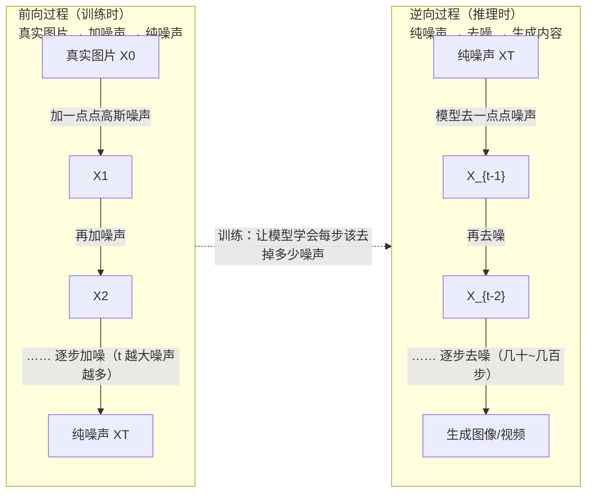
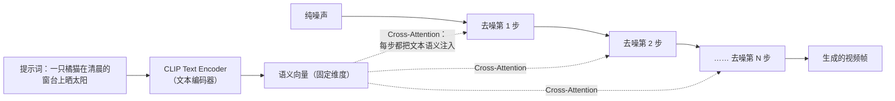
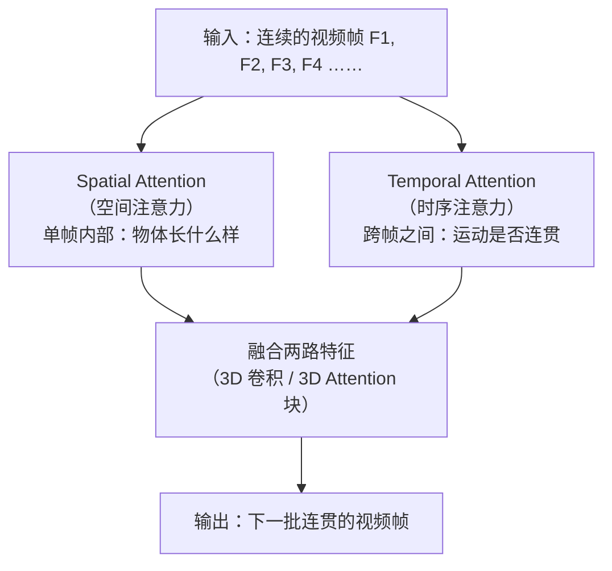
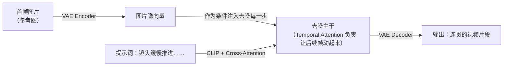
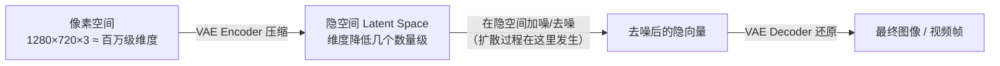
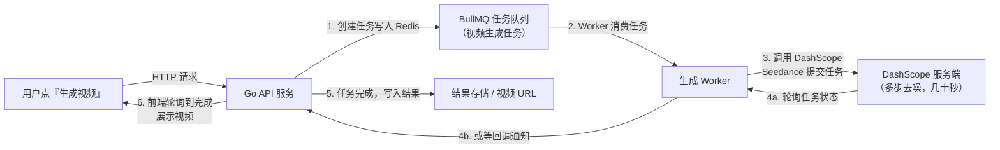

# 07 · 文生视频模型原理（Diffusion Model）

> 目标岗位：字节跳动剪映 CapCut「Agent 开发实习生（AI 剪辑）」（职位 ID：A80542，深圳/广州）。
> 为什么学：JD 写了「**文生视频、图生视频**」。你的 shatangAI 项目调的 Seedance / DashScope（通义万相视频生成）背后就是扩散模型，面试官大概率会追问一句"这类模型到底是怎么生成视频的"。这一章把扩散模型讲透，让你从"会调 API"升级到"懂原理"。

## 本章学习目标

学完这一章，你要能回答四件事：

1. **扩散模型的两个过程**：前向加噪（训练）与逆向去噪（推理），以及"模型学的不是生成，而是去噪"这个关键洞察。
2. **文生视频的两个关键机制**：Cross-Attention 做文本控制、Temporal Attention 做帧间时序一致。
3. **Latent Space 的意义**：为什么扩散要在 VAE 压缩后的隐空间做，而不是直接在像素空间做。
4. **工程视角**：为什么 Seedance 生成一个视频要几十秒，以及 shatangAI 里为什么必须用"异步任务队列 + 轮询/回调"而不是同步等待。

## 核心知识点提炼

| 知识点 | 一句话结论 | 面试高频度 |
|--------|-----------|-----------|
| 前向过程（Forward） | 训练时往真实数据上逐步加高斯噪声，直到变成纯噪声 | ⭐⭐⭐ |
| 逆向过程（Reverse） | 推理时从纯噪声出发，逐步去噪还原出图像/视频 | ⭐⭐⭐ |
| 模型本质 | 学的不是"生成图片"，而是"预测并去掉一点点噪声"（去噪函数） | ⭐⭐⭐ |
| 噪声调度（Noise Schedule） | 加噪程度随时间步 t 递增，模型通过时间步 Embedding 感知当前噪声水平 | ⭐⭐ |
| 文本控制 | CLIP Text Encoder 编码文本 → Cross-Attention 注入每一步去噪 | ⭐⭐⭐ |
| CFG（无分类器引导） | 同时算"有条件"和"无条件"的去噪，拉开差距放大文本控制力度 | ⭐⭐ |
| 视频 vs 图像 | 额外挑战是帧间时序一致性，用 Temporal Attention 解决 | ⭐⭐ |
| VAE / Latent Space | 先用 VAE 压缩到低维隐空间再扩散，省算力（Latent Diffusion Model） | ⭐⭐ |
| Seedance 慢的原因 | 多步迭代去噪是串行的，步数越多越慢但质量越高 | ⭐⭐⭐ |

## 知识点详解

### 1. Diffusion Model 核心思路：加噪与去噪两个过程

扩散模型（Diffusion Model）的思想可以用一句话概括：**"先把数据弄脏，再学怎么弄干净。"** 它由两个对称的过程组成：

- **前向过程（Forward / Diffusion Process，训练时）**：拿一张真实图片，逐步往里面加高斯噪声。加一点 → 图变模糊一点 → 再加一点 → 更模糊 → …… 直到完全变成纯噪声。这个过程是人为设计好的，不需要模型参与。
- **逆向过程（Reverse / Denoising Process，推理时）**：从纯噪声出发，让模型一步步去掉噪声。每去掉一点，图像就清晰一点，经过几十到几百步，最终还原出一张（或一帧）符合要求的图像/视频。



#### 1.1 前向过程：噪声怎么加

前向过程的关键是**噪声调度（Noise Schedule）**：每个时间步 t 对应一个噪声强度，t 越大噪声越强。常见的调度有线性调度（Linear Schedule）和余弦调度（Cosine Schedule）。训练时，模型并不需要真的"一步一步"加噪——**因为多次加噪可以合并成一步**：给定原图 X0 和时间步 t，可以直接一次性算出"加噪 t 步后的图 Xt"和"加进去的噪声 ε"。这个数学性质让训练非常高效：不需要模拟完整的前向链，一次前向就能拿到任意噪声程度的训练样本。

为什么噪声用**高斯噪声**？两个原因：一是高斯噪声是"最中性"的扰动，不会引入有偏的模式，模型学到的去噪函数更干净；二是高斯分布的性质让"任意步加噪合并成一步"的推导成立，训练才可行。这两个点答出来，面试官会认为你不是背概念。

#### 1.2 逆向过程：噪声怎么去

推理时，从纯噪声出发（t = 最大步数），模型预测当前图上"混入了多少噪声"，把它减掉，得到稍微干净一点的图，然后 t 减一，重复这个过程。每一步都是**用上一步的输出作为输入**，所以这是一个天然串行的过程——这也直接决定了后面要讲的"生成为什么慢"。

注意一个细节：模型预测的是"噪声 ε"，而不是"干净图 X0"。虽然两者可以互相换算，但预测噪声的误差更平滑、更容易优化，这是 DDPM 论文里的关键实验结论。面试时如果能补一句"模型预测的是噪声而不是原图，因为预测噪声的优化目标更稳定"，会非常加分。

#### 1.3 关键洞察：模型学的不是"生成"，而是"去噪"

这是整个扩散模型最反直觉、也最常被面试官考察的一点：

> 模型从来没有见过"从噪声生成图片"的完整过程，它只学一件事——**给定一张带噪图片和当前噪声程度（时间步 t），预测出"我加进去的噪声是什么"**。

训练目标就是让"模型预测的噪声"和"真实加进去的噪声"尽量一致（通常用 MSE 损失）。伪代码如下：

```text
# 训练循环（伪代码）
for 每个 batch:
    1. 取一批真实图片 X0
    2. 随机采样时间步 t
    3. 采样高斯噪声 ε
    4. 按噪声调度算出带噪图 Xt = 加噪(X0, ε, t)
    5. 模型预测噪声 ε_pred = model(Xt, t, text_embedding?)
    6. 损失 = MSE(ε_pred, ε)，反向传播更新参数

# 推理循环（伪代码）
1. 采样纯噪声 X = 高斯噪声
2. for t = 最大步数 递减到 1:
       ε_pred = model(X, t, text_embedding)
       X = X - ε_pred   # 去掉预测出的噪声，t 减一
3. 返回 X（再经 VAE Decoder 还原成像素）
```

推理时把预测的噪声从当前图上减掉，就完成了一步去噪。因为**每步只预测并去除少量噪声**，模型任务简单、容易学，几十上百步叠加起来就能从噪声中"长出"内容。这里有一个值得深挖的点：**为什么步数越多质量越高？** 因为每一步只做微小改动，出错被限制在很小的范围，步数多相当于"细水长流地精修"；反过来步数太少，每步改动幅度大，容易出错、生成模糊。所以"步数 ↔ 质量 ↔ 速度"三者是同一个 trade-off。

#### 1.4 时间步 Embedding：模型怎么知道现在该去多少噪

模型每一步都要知道"当前噪声有多强"，才能决定"去多少"。做法是把时间步 t 编码成一个向量（类似 Transformer 里的位置编码），和图像特征加在一起喂给网络。这一步虽然细节，但解释了模型"感知噪声水平"的机制，答出来会显得理解扎实。

### 2. 文本控制：CLIP / CLIP-like 与 Cross-Attention

"文生视频"的"文"是怎么生效的？分两步：

1. **文本编码**：用户输入的提示词（Prompt）先经过文本编码器（如 CLIP Text Encoder）转成语义向量。例如 `"一只橘猫在清晨的窗台上晒太阳，逆光"` 会被编码成一个固定维度的向量，向量里"浓缩"了这句话的全部语义。
2. **语义注入**：在去噪的每一步，模型把当前隐向量当作"查询（Query）"，把文本向量当作"键值（Key/Value）"，做 **Cross-Attention（交叉注意力）**——让图像的每个位置"去参考"文本中与之相关的词。比如画面中"窗台"区域会更关注文本里的"窗台"，"逆光"则影响整体光影分布。



规律很直接：**文本越具体、描述越详细，Cross-Attention 的指向性越强，生成结果越受控。** 这也是为什么生成类产品的 Prompt 工程如此重要——"一只猫"和"一只橘猫在清晨的窗台上晒太阳，逆光，电影感镜头"生成出来的完全是两个东西。

#### 2.1 进阶：Classifier-Free Guidance（CFG）

光靠 Cross-Attention，文本的"力度"还不够强。业界普遍再用一个技巧叫 **CFG（无分类器引导）**：推理时，模型分别计算"带文本条件"的去噪结果和"不带文本条件"的去噪结果，然后用一个引导系数（CFG Scale，通常 3~8）把两者的差距放大——相当于"有文本的方向"被推得更远。CFG Scale 越高，文本控制越强，但过头会色彩过饱和、画面失真。理解 CFG 是面试的加分项，因为它是所有主流文生图/文生视频模型都用的标准技术。

### 3. 视频生成 vs 图像生成：时序一致性的额外挑战

图像生成只关心**空间维度**——单帧画面好不好看。视频生成多了**时间维度**：相邻帧必须连贯，物体不能凭空跳变、闪烁、变形。这是视频模型与图像模型最本质的差别。

#### 3.1 解法一：Temporal Attention（时序注意力）

给 Attention 加上时序维度：让模型不是只看单帧，而是同时"看"相邻的多帧，学习帧与帧之间的运动关系。空间注意力管"这一帧里哪里该长什么样"，时序注意力管"这一帧和上一帧之间该怎样连续运动"，两者配合，才能生成"动的起来"且"不跳变"的视频。



#### 3.2 解法二：把"看 2D"升级成"看 3D"

更彻底的做法是把图像模型里的 2D 卷积 / 2D Attention 升级成 **3D 版本**（把帧数当作第三个维度），或者用 **DiT（Diffusion Transformer）** 把整段视频当成一串 token 做时空联合建模。Seedance、Sora 都属于"时空联合建模"这一路。进阶手段还包括用光流约束运动、对长视频做分段生成再拼接等，面试层面你只需要抓住主线：**多了一个时间维度，就要多一个时序建模机制**。

#### 3.3 为什么视频更难：数据与算力

视频的训练数据比图像少一个数量级，标注成本高；单样本的算力开销随"分辨率 × 帧数"爆炸增长；长视频还要解决"故事连贯性"（前后 10 秒的逻辑一致）。所以视频模型通常先训低分辨率、再超分（Scale-up），先训短视频、再外推到长视频。

#### 3.4 图生视频（Image-to-Video）：JD 的另一半

JD 里除了"文生视频"还有"**图生视频**"，面试很可能追问两者的差别。图生视频的输入多了一张**首帧图片（或参考图）**，任务变成：在"保持这张图内容不变"的前提下，生成后续帧的运动。实现上，图片会经过 VAE Encoder 变成隐向量，作为去噪过程的**条件注入**——和文本注入用的是同一套机制（条件向量进 Cross-Attention / 拼接进主干网络）。核心难点是：**既要让画面动起来，又不能破坏首帧的构图、人物和风格**，比纯文生视频多了"图像保真"这个约束。



在 shatangAI 里对应的是"模板素材 + 图生视频"玩法：用户上传一张照片，配一句提示词，生成一段以照片为开场的短视频——这正好是剪映"智能成片"类功能的底层能力。

### 4. VAE 与 Latent Space：为什么不在像素空间直接做扩散

一个直击灵魂的问题：为什么不直接在像素上做扩散？

答案很朴素：**像素空间太大，算不动。** 以 1280×720 的一帧为例，就是 1280×720×3 ≈ 276 万个数值；一个 5 秒、24fps 的视频就是 120 帧，总共约 3.3 亿个数值。在这种维度上做几十上百步迭代去噪，训练和推理的成本都不可接受。

于是有了 Latent Diffusion Model（Stable Diffusion 的架构基础）的思路：

1. **压缩**：用 VAE（变分自编码器）的 Encoder 把像素图压到低维隐空间（Latent Space），例如从 `1280×720×3` 压到 `80×45×4` 量级——维度降了几个数量级。
2. **在隐空间做扩散**：加噪、去噪全部在低维隐空间进行，速度快得多。
3. **还原**：去噪完成后，用 VAE 的 Decoder 把隐向量解码回像素空间，得到最终图像/视频。



各组件职责可以这样记：

| 组件 | 职责 | 类比 |
|------|------|------|
| VAE Encoder | 像素 → 隐空间（降维） | 压缩包 |
| Diffusion 主干 | 在隐空间加噪/去噪 | 真正的"生成引擎" |
| VAE Decoder | 隐空间 → 像素（还原） | 解压包 |
| CLIP Text Encoder | 文本 → 语义向量 | 翻译官 |
| Cross-Attention / CFG | 把文本语义注入去噪 | 控制开关 |

一句话总结：**VAE 负责降维，扩散模型负责生成，两者分工——"难算的高维问题"被变成"好算的低维问题"。**

### 5. 串起来：Seedance 的一次视频生成，到底发生了什么

把前面四块拼起来，就是你调 Seedance API 时，DashScope 服务端在背后做的事：

1. 你的提示词 → CLIP Text Encoder → 语义向量；
2. 随机初始化一个纯噪声隐向量；
3. 反复调用去噪网络（Cross-Attention 注入文本 + Temporal Attention 保证时序），几十步后得到"隐空间视频"；
4. VAE Decoder 还原成像素帧，输出 MP4。

换个角度理解你的 API 调用：`dashscope.SubmitVideoGen({prompt, duration, resolution})` 这个请求，本质上是把"文本条件 + 期望时长/分辨率"发给远端，远端替你跑完上面 1-4 步。所以**"调用 Seedance API" = "调用多步去噪推理链路的封装"**——这句话面试时可以原样说出来，说明你真的理解 API 背后是什么。

**这整个过程是串行的多步迭代**——第 t 步的输出是第 t+1 步的输入，没法并行。加上视频帧数多、每步计算量大，所以**生成一个视频要几十秒是正常的、结构性的，不是 Seedance 慢**。你在 shatangAI 里调 Seedance API，本质上就是在调用这个"多步去噪推理链路"的封装——API 背后替你跑了上面 1-4 步。

#### 5.1 对 shatangAI 的架构约束：异步任务队列 + 轮询/回调

因为生成慢，所以**请求-响应必须拆开**：提交任务立即返回 `task_id`，客户端轮询状态或等服务端回调。这正是视频生成类应用的标准范式，也正好用上你在站内学过的 BullMQ / Redis 知识：



对应的 Go 侧代码结构大致是：

```go
// 1. 提交任务：入队后立即返回 taskID
taskID, _ := queue.Add("video-gen", map[string]any{
    "prompt":   prompt,
    "duration": 5,   // 秒
    "resolution": "1280x720",
})

// 2. Worker 消费：调 Seedance，提交异步生成
job := <-queue.Chan("video-gen")
remoteID, _ := dashscope.SubmitVideoGen(job.Payload()) // 返回远程任务 ID

// 3. 轮询远程状态（或注册回调 URL），直到 SUCCESS/FAILED
for {
    status := dashscope.QueryVideoGen(remoteID)
    if status.IsFinal() { break }
    time.Sleep(3 * time.Second)
}
// 4. 拿结果 URL 写库、更新任务状态，前端轮询可见
```

要点：**视频生成是慢的、异步的，队列 + 轮询/回调是标配**。面试时把这个闭环讲清楚，能同时展示你对"模型原理"和"工程落地"两端的理解。

### 6. 扩散模型 vs 其他生成范式（GAN / VAE / 自回归）

面试经常用一个对比题来考察你对生成模型全局的理解："为什么是扩散模型，而不是 GAN 或自回归？"

| 范式 | 核心思想 | 优点 | 缺点 | 代表 |
|------|---------|------|------|------|
| GAN | 生成器与判别器对抗博弈 | 生成快（单次前向） | 训练不稳定、易模式坍塌、多样性差 | StyleGAN |
| VAE | 学隐变量分布，采样后解码 | 训练稳定、有可解释隐空间 | 生成模糊（像素级重建损失） | 早期图像生成 |
| 扩散模型 | 逐步加噪 / 逐步去噪 | 质量最高、多样性好、训练稳定 | 推理慢（多步串行迭代） | Stable Diffusion / Seedance |
| 自回归（AR） | 逐个 token 预测下一个 | 擅长离散序列（语言） | 视觉像素空间太大、顺序生成慢 | GPT / 视频 token 模型 |

面试金句：**扩散模型用"推理慢"换来了"质量高 + 训练稳 + 多样性好"，所以成为文生图/文生视频的主流；自回归模型在语言领域是王者，用在视觉上要把连续像素离散成 token，复杂度高、生成也慢**。Sora 时代出现了"扩散 + 自回归"融合的趋势（如 DiT 把视频当 token 序列做扩散），但主线还是扩散。

### 7. 演进时间线：从 DDPM 到 Sora / Seedance

了解演进史能让你在面试时说出"为什么现在的模型长这样"：

| 阶段 | 代表工作 | 贡献 |
|------|---------|------|
| 奠基 | DDPM（2020） | 提出清晰的加噪/去噪训练框架 |
| 提速 | DDIM / 采样加速（2021） | 跳步采样，1000 步压到 20~50 步 |
| 落地 | Latent Diffusion / Stable Diffusion（2022） | VAE 压缩 + 扩散，消费级 GPU 可跑 |
| 视频化 | Video Diffusion Models / AnimateDiff（2022-2023） | 引入时间维度与 Temporal Attention |
| 规模化 | Sora（2024）/ Seedance、即梦 | DiT 架构 + 时空联合建模 + 大规模训练 |

**常见误区提醒**（面试时说错任何一个都很致命）：

- ❌ "扩散模型是一次性生成整张图的" → 错，是几十步迭代去噪的结果。
- ❌ "CLIP 是生成模型" → 错，CLIP 是**对比学习的多模态编码器**，只负责"理解"文本/图像，生成靠扩散主干。
- ❌ "视频模型就是逐帧调用图像模型" → 错，那样帧间必然跳变，必须有时序建模。
- ❌ "VAE 和扩散是同一回事" → 错，VAE 负责压缩/还原维度，扩散负责生成内容。

### 8. 面试追问速答：高频小问题

面试官在你讲完主线后，通常会扔几个小追问验证你是不是真懂。这里给一版速答表：

| 追问 | 速答 |
|------|------|
| 什么是 DDIM？ | 跳步采样加速算法，把 1000 步压缩到 20~50 步，质量损失很小，是推理加速的基础手段 |
| 什么是 DiT？ | Diffusion Transformer，把图像/视频当成 token 序列做扩散，Sora 的架构基础 |
| 什么是 ControlNet？ | 用额外条件（姿态、边缘、深度）控制生成结构的机制，属于"可控生成"路线 |
| 什么是首帧条件？ | 图生视频把第一帧作为条件注入，约束后续帧的构图与内容 |
| 为什么同样 prompt 每次结果不一样？ | 初始噪声是随机采样的，噪声不同 → 去噪路径不同 → 结果不同；固定 seed 可复现 |
| 什么是视频超分？ | 先低分辨率生成，再用超分模型放大，省算力，是视频模型常用的两阶段策略 |
| Seedance 和 Sora 的区别？ | 都是扩散 + 时空建模路线；Seedance 是阿里通义万相系列，主打中文语义理解和可控性 |
| 为什么 prompt 里要写"电影感、4K"？ | 训练数据里有大量这类描述的样本，模型学到"这些词对应高质感画面"，属于分布对齐 |

## 面试问答

### Q1：扩散模型的训练目标是什么？

扩散模型的训练目标不是"学会从噪声直接生成图片"，而是**学会预测并去除噪声，也就是学习一个去噪函数**。具体来说，训练时在前向过程给真实数据逐步加高斯噪声，得到不同噪声程度的带噪样本；模型拿到带噪样本和当前时间步 t，预测"我加进去的噪声是什么"，用预测噪声和真实噪声算 MSE 损失来更新参数。推理时从纯噪声出发，反复调用这个去噪函数，一步步还原出图像或视频。所以模型本质上是学"每步去掉多少噪声"，而不是"生成一张图"。

### Q2：为什么要在 Latent Space 而不是像素空间做扩散？

因为像素空间维度太高，计算量不可接受。比如 1280×720 的一帧就有上百万个数值，视频还要乘帧数，直接在像素空间做几十上百步的迭代去噪，训练和推理都慢到没法用。所以先用 VAE 的 Encoder 把图像压缩到低维隐空间，在隐空间做扩散，最后用 VAE Decoder 还原回像素。这就是 Latent Diffusion Model 的思路，也是 Stable Diffusion 的架构基础，Seedance 这类视频模型同样基于这个思想。一句话：VAE 负责降维省算力，扩散模型负责生成。

### Q3：文本是如何控制生成内容的？

文本先经过 CLIP Text Encoder 编码成语义向量。在去噪的每一步，模型通过 **Cross-Attention** 把文本语义注入生成过程：图像隐向量的每个位置作为 Query，文本向量作为 Key/Value，让画面区域"参考"与之语义相关的文本词。文本越具体、描述越详细，注意力指向越明确，生成结果就越受控。比如"一只猫"和"一只橘猫在清晨的窗台上晒太阳，逆光"生成出来的画面差别很大。所以文生视频里文本控制的机制就是 Cross-Attention 注入，很多模型还会叠加 CFG 引导来放大文本的约束力。

### Q4：视频生成比图像生成多了什么挑战？

视频生成比图像生成多了**时间维度的帧间一致性**挑战。图像只有空间维度，模型只需要保证单帧好看；视频要求相邻帧之间内容连贯、运动平滑，物体不能跳变、闪烁或变形。解法是在 Attention 中加入时序维度，也就是 **Temporal Attention**，让模型同时"看"多帧，学习帧与帧之间的运动关系，空间注意力管单帧内容，时序注意力管跨帧运动。这也是 Seedance、Sora 这类视频模型的核心创新点之一。另外视频数据量更大、显存占用更高，训练和推理成本也更高。

### Q5：Seedance 生成视频要几十秒，为什么不能更快？

因为扩散模型的推理本质是**几十步到上百步的串行迭代去噪**——每一步的输出是下一步的输入，没法并行；每步还要完整跑一遍网络（Cross-Attention、Temporal Attention），视频又比图像多了时间维度，计算量随帧数增长。步数越多质量越高但越慢，这是个 trade-off。所以在 shatangAI 里，视频生成任务必须走异步：提交任务后用 BullMQ 队列排队，Worker 轮询 DashScope 任务状态或等回调，完成后前端再拉取结果。用户看到"提交后等几十秒出片"是正常现象，不是接口设计问题。

### Q6（拓展）：为什么步数越多质量越高？能不能减少步数？

步数越多，每一步只做很小幅度的去噪，出错被限制在极小范围，相当于"精雕细琢"，质量更高；步数太少，每步改动幅度大，模型要一次跳很远，容易出错、生成模糊或伪影。但步数多意味着串行迭代次数多，速度慢。所以业界用 **DDIM** 这类加速采样方法，把 1000 步压缩到 20~50 步，用"跳步去噪"的思路在几乎不损失质量的前提下大幅提速。面试里能提到 DDIM，说明你对扩散模型的采样机制有真实了解。

### Q7（拓展）：CFG（Classifier-Free Guidance）是什么？

CFG 是一种放大文本控制力的引导技术。推理时模型分别计算"带文本条件"和"不带文本条件"两种去噪结果，用引导系数把两者差距放大，使生成结果更贴合文本。比如 CFG Scale = 7 时，模型会朝着"有文本的方向"多走一段，让提示词里的要素更突出。CFG 越大文本约束越强，但过大容易色彩过饱和、画面失真。它是当前所有主流文生图/文生视频模型的标准组件，我理解的 Seedance 内部同样使用类似机制。

### Q8（拓展）：图生视频和文生视频的差别在哪？

图生视频比文生视频多了一个输入：首帧图片（或参考图）。实现上，图片先经过 VAE Encoder 变成隐向量，作为去噪过程的**条件注入**，和文本注入共用同一套机制。核心难点是图像保真——既要让画面动起来，又不能破坏首帧的构图、人物和风格。所以图生视频模型需要在"运动生成"和"内容保持"之间做平衡，通常会给图像条件更高的注意力权重或加专门的保真损失。在我们 shatangAI 里，图生视频对应"用户上传照片 + 提示词 → 生成以照片为开场的短视频"这类功能。

### Q9（拓展）：为什么视频生成主流用扩散模型，而不是自回归或 GAN？

因为扩散模型在质量、训练稳定性和多样性上综合最优。GAN 生成快但训练不稳定、容易模式坍塌，生成多样性差；自回归模型要逐 token 预测，视觉的像素空间太大，顺序生成慢，还要把连续像素离散成 token，复杂度高。扩散模型用"多步迭代去噪"换来高质量和稳定训练，虽然推理慢，但可以通过 DDIM 等采样加速和工程优化（并行批处理、缓存）来缓解。这也是 Stable Diffusion、Seedance、Sora 这些主流文生视频模型都选扩散路线的原因。

## 自测清单

- [ ] 能画出前向加噪与逆向去噪的双过程 mermaid 图，并讲清训练时模型到底在学什么
- [ ] 能说出"模型学的不是生成图片，而是去噪函数"这个关键洞察
- [ ] 能解释噪声调度（Noise Schedule）和时间步 Embedding 的作用
- [ ] 能解释 CLIP Text Encoder 和 Cross-Attention 在文生视频里各自的作用
- [ ] 能说出 CFG 是什么、为什么能放大文本控制力
- [ ] 能说出视频生成相对图像生成多出来的挑战，以及 Temporal Attention 的解法
- [ ] 能讲清图生视频与文生视频的差别（首帧条件注入、图像保真）
- [ ] 能对比扩散模型 / GAN / VAE / 自回归的优缺点，并说出扩散成为主流的原因
- [ ] 能解释为什么要在 Latent Space 做扩散（VAE 的作用），以及 Latent Diffusion Model 的含义
- [ ] 能解释 Seedance 生成慢的结构性原因，并画出 shatangAI 的异步任务队列 + 轮询/回调流程
- [ ] 能按面试口吻回答本章 5 个必答问题 + 4 个拓展问题（每题 3-6 句，不背稿）

## 与既有文档联动

- [向量检索原理](/后端技术栈强化/10-milvus/01-向量检索原理)：视频生成后如何做多模态检索/相似视频匹配，理解 Embedding 与向量库的关系
- [大模型与 Agent 核心能力](/路线专题/03-大模型与Agent核心能力)：LLM 与扩散模型同属生成式 AI，理解 Agent 应用如何编排多类生成模型
- [第三阶段 AI 应用开发基础](/学习计划安排/第三阶段-AI应用开发基础)：shatangAI 的工程落地主线，本章是它的模型原理底座
