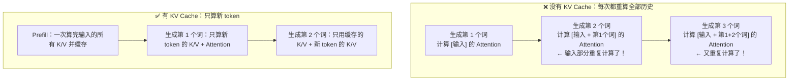
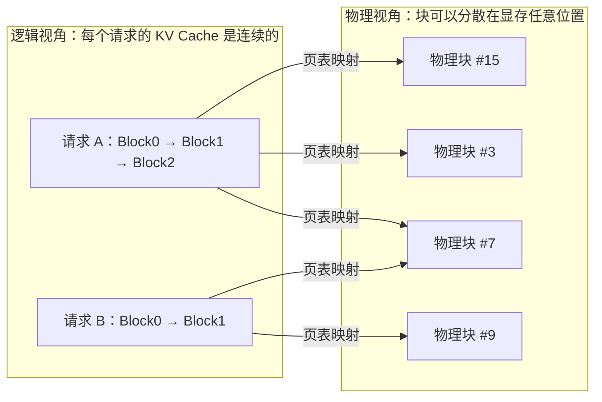
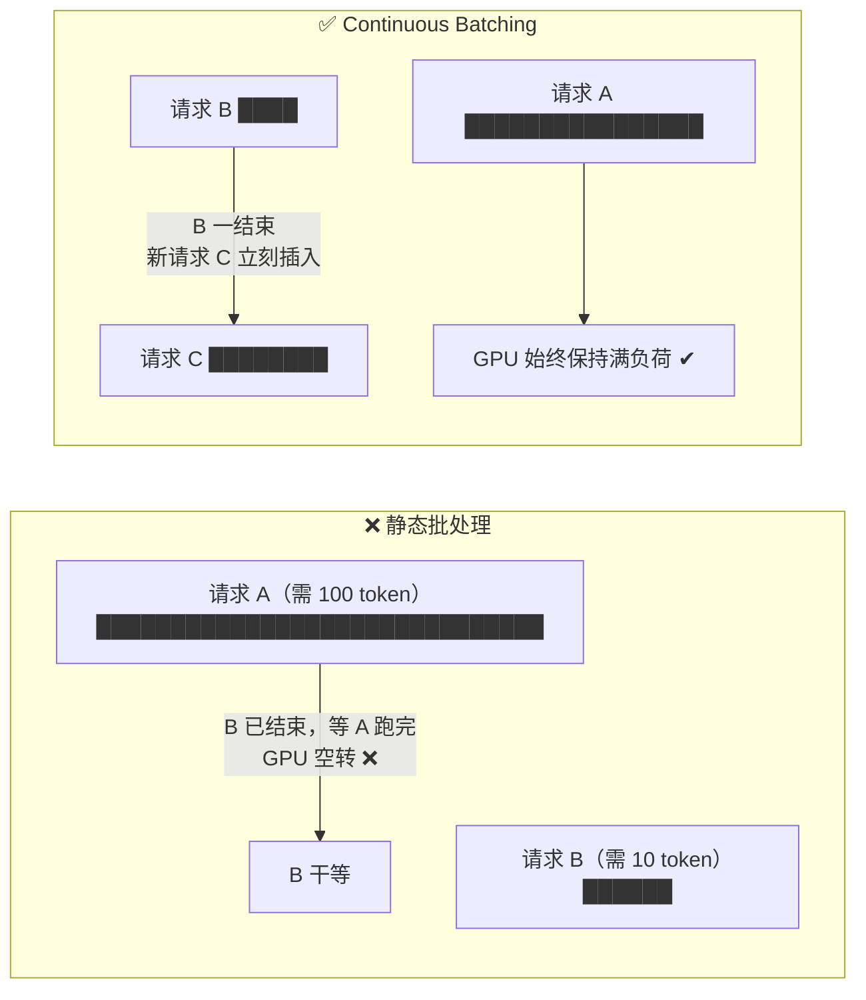
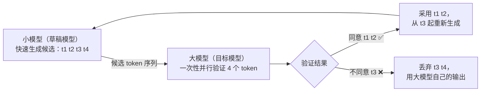
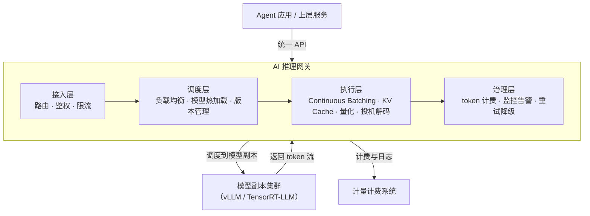

# 08 · LLM 推理优化（AI 推理网关）

> 目标岗位：字节跳动剪映 CapCut「Agent 开发实习生（AI 剪辑）」（职位 ID：A80542，深圳/广州）。
> 为什么学：JD 写了「**AI 推理网关**」——这是字节内部支撑所有 LLM 调用的基础设施。你的 shatangAI 里每次调用大模型、每次让 Agent 做决策，背后都过一层推理网关。面试官问你"怎么让大模型推理更快更省钱"，答出这一章的内容就是降维打击。

## 本章学习目标

学完这一章，你要能回答三件事：

1. **LLM 慢的根因**：自回归生成是串行的，瓶颈在显存带宽而不是算力——以及 KV Cache 为什么是解决"重复计算"的标配。
2. **四大优化手段**：PagedAttention（显存碎片）、Continuous Batching（批次等待）、量化（显存占用）、Speculative Decoding（模型慢）。
3. **网关视角**：把上述优化封装成统一服务时，要考虑哪些模块——请求路由、负载均衡、模型热加载、限流、成本计费。

## 核心知识点提炼

| 知识点 | 一句话结论 | 面试高频度 |
|--------|-----------|-----------|
| 自回归生成 | 每生成一个 token 都要对所有历史 token 做 Attention，天然串行 | ⭐⭐⭐ |
| KV Cache | 缓存历史 token 的 Key/Value，避免重复计算；副作用是吃显存 | ⭐⭐⭐ |
| KV Cache 碎片 | 请求长度不规则 → 显存碎片化，利用率只有 40%-60% | ⭐⭐⭐ |
| PagedAttention | 把 KV Cache 切成固定大小的 Page，像操作系统分页一样管理，利用率到 90%+ | ⭐⭐⭐ |
| Continuous Batching | 请求完成立刻插入新请求，GPU 不空转，吞吐提升 2-10 倍 | ⭐⭐ |
| 量化 | FP16→INT4 用精度换显存/速度，INT4 是消费级 GPU 跑大模型的主流 | ⭐⭐⭐ |
| Speculative Decoding | 小模型草稿 + 大模型并行验证，速度 2-3 倍，质量不变 | ⭐⭐ |
| AI 推理网关 | 把以上优化封装成统一服务，上层 Agent 无感使用 | ⭐⭐⭐ |

## 知识点详解

### 1. 自回归生成与 KV Cache：先搞懂"重复计算"在哪

#### 1.1 自回归的本质

LLM（GPT 系）是**自回归**模型：一次只生成一个 token，生成第 n 个 token 时，要把"输入 + 前 n-1 个输出"全部作为上下文，重新过一遍 Transformer。所以它的生成过程是**天然串行的**——第 n 个 token 依赖第 n-1 个，无法并行。这是理解后面所有优化的出发点。

#### 1.2 重复计算问题：KV Cache 的动机

生成第 2 个词时，模型其实**又算了一遍第 1 个词的 Key/Value**；生成第 3 个词时，又算了一遍第 1、2 个词的 K/V。历史越长，浪费越大——Attention 的计算量随序列长度**平方级增长**。



**KV Cache 的解法**：把已经计算过的 Key/Value 向量**缓存起来**，每次生成新 token 时，只需要计算新 token 自己的 K/V，然后和缓存的历史 K/V 一起做 Attention 即可。

#### 1.3 数字例子：省了多少计算量

假设输入 100 个 token，再生成 100 个 token。Attention 的计算量大致正比于"参与 Attention 的历史 token 数"：

| 生成阶段 | 无 KV Cache：每次重算的 token 数 | 有 KV Cache：每次新算的 token 数 |
|---------|-------------------------------|--------------------------------|
| 第 1 个词 | 100（输入） | 1（新 token）+ 首次缓存 100 |
| 第 2 个词 | 101（输入 + 第1词） | 1 |
| 第 3 个词 | 102 | 1 |
| …… | …… | …… |
| 第 100 个词 | 199 | 1 |
| **合计** | **100+101+…+199 ≈ 15050** | **100（prefill）+ 100 ≈ 200** |

**约 75 倍的差距**，而且输入越长、生成的 token 越多，差距越大（这是平方 vs 线性的差距）。所以 KV Cache 不是优化选项，而是标配。

#### 1.4 KV Cache 的副作用：显存爆炸与碎片

KV Cache 换来的是显存开销：每个请求都要把 K/V 向量放在显存里，而且——

- **消耗大**：长上下文的 KV Cache 可以轻松占几个 GB 显存，比模型权重还大。
- **不规则**：不同请求的上下文长度不同，缓存长度参差不齐。
- **碎片化**：像内存碎片一样，显存被切成很多小块，利用率只有 40%-60%，新请求经常"有空间但放不下"。

KV Cache 的"重复计算 → 缓存"和它带来的"显存问题"，分别对应了下一节的 PagedAttention 和量化。

#### 1.5 补充：Prefill 与 Decode 两阶段

把一次推理调用拆成两个阶段，是理解一切推理优化的前提：

| 阶段 | 做什么 | 特点 |
|------|--------|------|
| Prefill（预填充） | 一次性处理完输入的所有 token，算出各自的 K/V | 计算密集（算力瓶颈），可以并行 |
| Decode（解码） | 逐个生成新 token，边生成边更新 KV Cache | 访存密集（显存带宽瓶颈），串行 |

这两个阶段的瓶颈完全不同——**Prefill 拼算力，Decode 拼显存带宽**。所以优化的手段也是分开的：Prefill 阶段靠并行和算子优化，Decode 阶段靠 KV Cache、量化、投机解码这些减少访存的手段。能把这一层讲清楚，面试官会知道你真的读过推理相关的文章，而不只是背名词。

### 2. PagedAttention（vLLM）：像操作系统一样管显存

#### 2.1 核心思想：分页

PagedAttention 是 vLLM 的核心创新，思路**直接类比操作系统的分页内存管理**：

- 把 KV Cache 切成**固定大小的"块"（Page/Block）**，比如每块存 16 个 token 的 K/V；
- 用**页表（Page Table）**记录每个请求的 KV 块在物理显存中的位置，逻辑上连续、物理上可以分散；
- 请求结束时释放块，新请求按需分配，碎片问题大幅缓解。



#### 2.2 两个收益

1. **消除碎片**：块可以放在任何空闲物理位置，不再需要连续大块显存 → 显存利用率从 40%-60% 提升到 **90%+**。
2. **支持共享**：不同请求的相同前缀可以**共享同一份物理块**——最典型的就是**相同的 System Prompt 只存一份**，所有请求的页表都指向它。对 Agent 应用尤其关键：Agent 每次调用都带一大段 system prompt，共享 KV Cache 能省下巨量显存。

举个例子感受共享的收益：假设 100 个并发请求，每个都带 2000 token 的 system prompt，如果不共享，这 2000×100 份 KV 全要存；共享后，这 2000 token 的 KV 物理上**只存一份**，省下 99% 的前缀显存。这就是为什么"前缀共享"是 Agent 场景推理成本优化的第一刀。

面试金句：**PagedAttention 用"分页 + 页表 + 共享"三个操作系统的老朋友，解决了 KV Cache 的碎片与冗余两大问题。**

#### 2.3 KV Cache 大小怎么估算

给个公式，面试时能算出具体数字会非常加分：

```
KV Cache 大小 = 2 × 层数 × 头数 × 每头维度 × 序列长度 × 精度字节数
                ↑  K 和 V 各一份
```

例子：13B 模型，40 层 × 40 头 × 128 维，FP16（2 字节），序列长度 4096：

```
2 × 40 × 40 × 128 × 4096 × 2 字节 ≈ 3.35 GB
```

一个请求的 KV Cache 就吃掉 3.35GB 显存！100 个并发请求就是 335GB——**远超模型权重本身**。这个数字能解释两件事：为什么必须做 KV Cache 优化（PagedAttention、量化 KV），以及为什么长上下文推理那么贵。

### 3. Continuous Batching：让 GPU 永不空转

#### 3.1 传统静态批处理的浪费

传统做法是"静态批处理"：一批请求一起进，全部生成完才放下一批。问题很明显——请求 A 要生成 100 个 token，请求 B 只要 10 个，B 生成完后**只能干等 A**，GPU 大量时间在空转。



#### 3.2 解法：连续批处理（迭代级调度）

**Continuous Batching（连续批处理）**：把调度粒度从"整个请求"细化到"每次迭代"。每生成一个 token 就检查一次批次——有请求完成了，立刻把队列里的新请求 C 插进来，和还在跑的 A 一起做下一次前向。

效果：**吞吐量提升 2-10 倍**，GPU 利用率显著提高。这也是 vLLM、TensorRT-LLM 等推理框架的标配能力，对"推理网关"这类要服务海量并发请求的系统至关重要。

#### 3.3 实现细节：迭代级调度（Iteration-level Scheduling）

连续批处理的关键是**迭代级调度**：调度器在**每个 decode 步**而不是"每个请求"维度做决策：

1. 维护两个集合：**运行集**（正在生成中的请求）和**等待队列**（排队中的请求）；
2. 每步 decode 前，检查运行集里有没有请求已经生成完（遇到 EOS 或达到 max_tokens）——有就弹出，并把它的 KV Cache 块释放回内存池；
3. 从等待队列里按策略（如 FCFS、优先级、长度均衡）挑选新请求进入运行集，分配它的 KV 块；
4. 运行集的所有请求拼成一个 batch，做一次前向，各自得到下一个 token。

配合 PagedAttention 的块分配，这一步天然是**动态的**——新请求进来的"位置"由页表决定，不需要连续内存。所以 PagedAttention 是 Continuous Batching 的"内存地基"，两者经常成对出现。

#### 3.4 为什么吞吐提升这么大

静态批处理里，批次大小由"最慢的请求"决定，GPU 在等待中空转；连续批处理里，GPU 的每一步都在为"当前还活着的请求"干活，**空转时间被压到接近零**。请求越多、长短差异越大，收益越明显——而 Agent 应用的请求恰恰是长短不一、到达时间随机的，所以这个优化对 Agent 场景格外重要。

### 4. 量化（Quantization）：用精度换显存和速度

#### 4.1 精度与显存的账

模型权重用不同精度存储，显存开销完全不同（以 70B 模型为例）：

| 精度 | 每参数字节数 | 70B 模型显存 | 质量损失 | 典型场景 |
|------|-------------|-------------|---------|---------|
| FP32 | 4 字节 | 280GB | 无损 | 训练主精度 |
| FP16 / BF16 | 2 字节 | 140GB | 极小 | 训练/推理主流 |
| INT8 | 1 字节 | 70GB | 小 | 单卡服务器 |
| INT4 | 0.5 字节 | 35GB | 中等 | 消费级 GPU / 端侧 |

#### 4.2 量化原理

**量化**就是把浮点数映射到整数范围：比如把 FP16 的权重按比例缩放到 INT8 的 -128~127，推理时用整数做矩阵乘（整数运算比浮点快得多），再按比例缩放回去。核心是**牺牲一点精度，换来显存减半/减四和计算加速**。

- **INT8**：质量损失很小，是目前线上服务的主流折中；
- **INT4**：质量损失中等，但**70B 模型能压到 35GB，消费级 GPU（如 4090 的 24GB 仍需配合 KV Cache 优化）才跑得动大模型**——所以 INT4 是消费级 GPU 运行大模型的主流方案。注意实际部署还要加上 KV Cache 和激活值的开销。

面试时常被追问"量化为什么损失可控"：因为神经网络对权重的小扰动有**鲁棒性**，加上推理时还有量化校准（Calibration，用真实数据统计激活分布来定缩放因子）、混合精度（敏感层保持高精度）等手段兜底。

#### 4.3 进阶：INT4 不是"一刀切"，而是分组量化

INT4 并不是简单地把每个权重都除以同一个缩放因子，而是 **Group Quantization（分组量化）**：把权重矩阵按小组（比如 128 个一组）分别计算缩放因子和零点，组内共享一个缩放比例。这样能贴合不同区域权重的分布，把 INT4 的质量损失压到"中等但可接受"。

业界常见的两种实现：**GPTQ**（基于二阶信息的逐层量化，离线一次性完成，适合部署）和 **AWQ**（激活感知量化，按激活值的重要性给敏感权重加权，保住重要通道的精度）。这两个名词说出来，说明你关注过实际部署工具链，而不是只背了精度表。

### 5. Speculative Decoding：用小模型给大模型"打草稿"

#### 5.1 思路

大模型慢，小模型快但质量差。**投机解码（Speculative Decoding）**把两者结合：

1. 小模型（Draft Model）先快速生成一串候选 token（比如 4 个）；
2. 大模型一次性并行验证这 4 个 token（**并行前向，不是串行**）；
3. 大模型同意的 token 直接采用；不同意的地方，从第一个不同意的 token 重新开始。



#### 5.2 为什么能提速且质量不变

- **提速 2-3 倍**：一次大模型前向只花一次时间，但"顺带"验证了好几个 token——相当于一次前向产出多个 token；
- **质量不变**：最终输出由大模型把关，小模型猜错的地方会被纠正，所以**输出分布与直接跑大模型一致**；
- **适用前提**：小模型和大模型的 token 分布接近（通常同族模型微调得到），否则接受率低、提速不明显。

#### 5.3 接受率：决定提速倍数的关键

投机解码能提速多少，取决于**接受率（Acceptance Rate）**——小模型猜的 token 有多大比例被大模型认可。接受率越高，一次大模型前向验证的 token 越多，提速越明显；接受率低时，大模型可能只认可 1 个 token，还要额外付小模型的开销，反而更慢。所以工程上通常会：

- 用**同族小模型**（比如同系列 7B 配 70B）做草稿，分布天然接近；
- 动态调整草稿长度（草稿越长，接受率通常越低）；
- 或者反过来用"多个候选分支"（如 Medusa 的多头并行草稿）提高一次验证的命中数。

面试时可以补充一句：投机解码的收益是"质量无损"的，因为它只改变了计算路径，没有改变最终采样分布——这和量化那种"有损"优化形成鲜明对比。

面试点睛：投机解码是"用一次大模型前向的成本，产出多个 token"——把一个串行瓶颈，变成了"小模型串行 + 大模型并行验证"。

### 6. 串起来：AI 推理网关设计（JD 考点）

#### 6.1 网关的价值

上面的优化（KV Cache、PagedAttention、Continuous Batching、量化、投机解码）单个落地都很复杂。**AI 推理网关**的价值就是：把这些优化**封装成统一服务**，提供统一 API，让上层 Agent 应用"无感使用"——你调接口，网关负责调度、加速、计费、容错。

#### 6.2 模块清单

一个完整的推理网关，至少要考虑这些模块：

| 模块 | 职责 | 关键点 |
|------|------|--------|
| 接入层 | 请求路由、鉴权、限流 | 按用户/应用维度限流，防单个应用打爆后端 |
| 调度层 | 负载均衡、模型热加载、版本管理 | 多副本分发；模型更新灰度切换、不中断服务 |
| 执行层 | 推理引擎封装 | Continuous Batching、KV Cache 复用、量化/投机解码对上层透明 |
| 治理层 | 监控、计费、重试降级 | token 计量、延迟/错误率监控、超时重试与优雅降级 |
| 存储层 | Prompt 缓存、结果缓存 | 相同请求命中缓存，省一次推理 |

#### 6.3 架构图



#### 6.4 结合 shatangAI

在 shatangAI 里，你对推理网关的接触点是：**Agent 每轮决策、每次文案生成，都通过网关调用 LLM**；而视频生成走的 Seedance 是**独立的多模态生成链路**，任务慢、必须异步——所以网关和异步队列各管一段：**网关管"快而高频"的 LLM 调用，BullMQ 队列管"慢而异步"的视频生成**。面试时可以这样串联，展示你对"什么场景走什么链路"的判断力。

网关的一次请求流转，用 Go 伪代码看大概是：

```go
// 接入层：限流 + 鉴权
if !rateLimiter.Allow(appID) { return 429 }   // 按应用维度限流

// 调度层：按模型名路由到对应模型副本，并做负载均衡
backend := registry.Pick("qwen-plus", strategy.LeastLoad)

// 执行层：把 Agent 的 system prompt 前缀 ID 传给后端，
// 后端命中共享 KV Cache 后，只计算新增部分
resp, err := backend.Chat(ctx, &ChatRequest{
    PromptCacheID: "sys-prompt-v3",  // 前缀共享
    Messages:      agentMessages,
    MaxTokens:     512,
})

// 治理层：token 计量 + 监控
meter.Record(appID, model, resp.Usage)
trace.Log(ctx, resp.Latency)
```

这个伪代码把"限流 → 路由 → 前缀共享 → 计费监控"四个网关职责一次讲全，面试时直接照着展开即可。

#### 6.5 网关与"不优化"的对比：一句话总结

没有网关时，每个应用自己裸调模型：各自排队、各自算 KV、重复加载权重、无法共享前缀，GPU 利用率低、成本失控。有了网关：**限流防打爆、路由保稳定、共享省显存、批处理提吞吐、量化降成本、计费可观测**——上层 Agent 应用只面对一个简单接口，这就是"AI 推理网关"作为基础设施存在的意义。

## 面试问答

### Q1：为什么 LLM 生成速度慢？瓶颈在哪？

LLM 是自回归模型，一次只生成一个 token，第 n 个 token 依赖前 n-1 个，所以生成过程天然串行，这是结构性的慢。真正的瓶颈不是算力，而是**显存带宽**——每生成一个 token 都要把模型全部权重从显存搬到计算单元，权重越多、带宽越有限，速度越慢；算力反而经常是富余的。所以业界优化的方向都围绕"减少重复计算（KV Cache）"和"减少显存搬运（量化）"展开。

### Q2：KV Cache 解决了什么问题？有什么副作用？

KV Cache 解决的是**重复计算**问题：自回归生成时，每生成一个新 token 都要和历史所有 token 做 Attention，如果不缓存，历史的 K/V 会被反复重算，计算量随序列长度平方级增长。KV Cache 把已算过的 Key/Value 缓存起来，每次只算新 token 的 K/V。副作用是**消耗大量显存**——长上下文的 KV Cache 可能比模型权重还大，而且请求长度不规则会造成显存碎片，利用率只有 40%-60%。所以又需要 PagedAttention 和量化来配合。

### Q3：vLLM 为什么能把显存利用率从 40% 提升到 90%？

因为 vLLM 的 **PagedAttention** 借鉴操作系统的分页内存管理：把 KV Cache 切成固定大小的块，用页表管理，块可以存放在显存任意空闲位置，解决了"必须找连续大块内存"造成的碎片问题。同时它还支持**共享 KV Cache**——相同前缀（比如相同的 System Prompt）可以只存一份物理块，多个请求的页表共同指向它，大大减少了冗余存储。碎片消除 + 共享去重，两个效果叠加，显存利用率就提升到了 90% 以上。

### Q4：INT4 量化和 FP16 相比有什么代价？

主要代价是**精度略有损失**，生成质量可能下降，比如复杂推理能力变弱、偶尔生成不准确。但收益非常明显：以 70B 模型为例，FP16 要 140GB 显存，INT4 只要 35GB，显存直接降到四分之一，同时整数运算更快、显存带宽压力更小，推理速度也提升。所以 INT4 能让 70B 级大模型在消费级 GPU 上跑起来——这已经是部署层面接受"轻微质量损失换可运行"的主流选择。实际部署中通常配合量化校准和混合精度来控制损失。

### Q5：如果你来设计一个 AI 推理网关，需要考虑哪些问题？

我会按模块拆：**接入层**负责请求路由、鉴权和限流，防止单个应用打爆后端；**调度层**负责负载均衡和模型热加载，模型更新要灰度切换、不中断服务；**执行层**封装推理引擎能力，让 Continuous Batching、KV Cache 复用、量化这些优化对上层透明；**治理层**负责 token 计费、监控告警和超时重试、优雅降级；再加**存储层**做 Prompt 缓存和结果缓存。总之网关的价值是把这些优化封装成统一服务，让上层 Agent 应用无感使用——这也是 JD 里"AI 推理网关"这个岗位定位的本质。

### Q6（拓展）：KV Cache 会随请求长度增长，长上下文下怎么办？

KV Cache 的大小和序列长度成正比，超长上下文下显存很快吃紧。工程上有几类手段：一是**量化 KV Cache**（把缓存的 K/V 也降到 INT8/INT4）；二是 **PagedAttention 式分块管理**减少碎片；三是**前缀共享**，多轮对话和 Agent 场景下相同的 system prompt 只存一份；四是更激进的**KV Cache 压缩/淘汰**，比如把不重要 token 的 KV 丢弃或合并。这几条按顺序答，面试官会认为你有完整的显存管理认知。

### Q7（拓展）：Agent 应用为什么特别需要推理网关？

因为 Agent 应用有几个特点：**调用频繁**（一个任务可能多次调 LLM）、**上下文长**（多轮对话 + 工具结果都在上下文里）、**并发高**（多用户同时跑 Agent）、**成本敏感**（每次调用都要花钱）。网关正好对应解决：路由和限流扛住并发、前缀共享省 KV Cache 显存、token 计费让成本可观测、超时重试让 Agent 链路更稳。回答时结合 shatangAI 的 Agent 调用场景展开，会很有说服力。

## 自测清单

- [ ] 能画出自回归"每步重算全部历史"的 mermaid 示意图，并讲清 KV Cache 的动机
- [ ] 能复述数字例子：输入 100 + 生成 100 时，无/有 KV Cache 的计算量差距（约 75 倍）
- [ ] 能说出 KV Cache 的两大副作用（显存消耗大、碎片化）及其对应解法
- [ ] 能讲清 PagedAttention 的分页思想、页表、以及 System Prompt 共享的原理
- [ ] 能画出静态批处理 vs Continuous Batching 的对比图，说出吞吐提升量级
- [ ] 能背出 FP32/FP16/INT8/INT4 的字节数、70B 显存占用与质量损失
- [ ] 能讲清投机解码的四步流程和"质量不变"的原因
- [ ] 能默写出推理网关的五大模块清单（接入/调度/执行/治理/存储）
- [ ] 能结合 shatangAI 讲清"网关管快而高频的 LLM 调用，BullMQ 管慢而异步的视频生成"
- [ ] 能按面试口吻回答本章 5 个必答问题 + 2 个拓展问题（每题 3-6 句，不背稿）

## 与既有文档联动

- [向量检索原理](/后端技术栈强化/10-milvus/01-向量检索原理)：RAG 检索链路同样受延迟与吞吐约束，理解向量检索的索引与缓存设计
- [大模型与 Agent 核心能力](/路线专题/03-大模型与Agent核心能力)：Agent 每轮决策都在调 LLM，推理优化的收益直接体现在 Agent 应用的延迟与成本上
- [第三阶段 AI 应用开发基础](/学习计划安排/第三阶段-AI应用开发基础)：shatangAI 工程落地的整体规划，本章的网关设计是其中"LLM 调用基础设施"的深化
