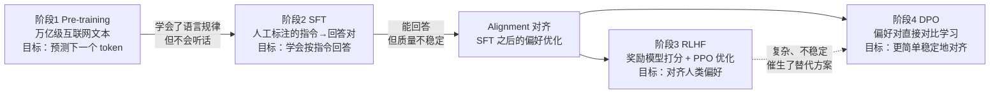
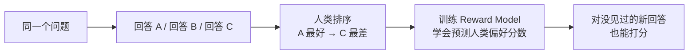
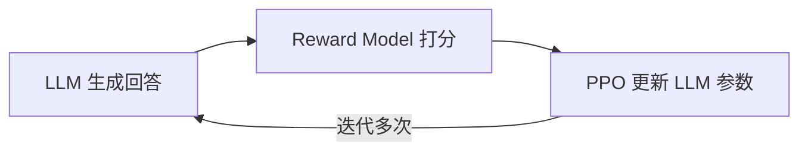
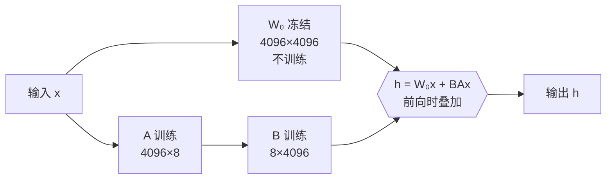

# 09 · LLM 训练流程与微调（Pre-training → SFT → RLHF → DPO）

> 目标岗位：字节跳动剪映 CapCut「Agent 开发实习生（AI 剪辑）」（职位 ID：A80542，深圳/广州）。
> 前置要求：已跑通基础 LLM API 调用（见「学习计划安排/第三阶段-AI应用开发基础.md」）。
> 本章定位：**理解层**——不需要会实现训练，但要能讲清每个阶段在做什么、为什么存在，以及把简历上「深圳草莓 LoRA 微调」这条经历讲成一个有数据、有踩坑的面试故事。

## 本章学习目标

完成本章后，你应该能：

1. 按顺序讲出 LLM 训练的完整链路：Pre-training → SFT → RLHF → DPO，并说明每个阶段的数据、目标和结果。
2. 解释 RLHF 为什么需要 Reward Model，DPO 为什么能替代它、优势在哪。
3. 用「低秩分解」解释 LoRA 为什么能把可训练参数压到 1% 以下，并报出显存数据（280GB → 20-40GB）。
4. 面对「SFT 还是 RAG」的场景题，能按知识更新频率、数据量、保密要求快速给出选择。
5. 用填空式 STAR 模板，把草莓实习的微调经历组织成 1 分钟可讲的面试故事。

> 学习方法建议：本章 80% 是「背概念 + 画链路」。把两张 mermaid 图自己默画一遍，然后对着「面试问答」自问自答，最后完成「实习经历面试话术」的填空。

## 核心知识点提炼

| 阶段 | 数据 | 目标 | 结果 | 成本量级 |
| --- | --- | --- | --- | --- |
| Pre-training | 万亿级互联网文本 | 预测下一个 token（语言建模） | 学会语言规律，但不会「听话」 | 极高（数千卡级别，大厂专属） |
| SFT | 几万~几十万条人工标注「指令→回答」对 | 学会按指令回答的格式 | 能回答，但质量不稳定 | 中（配合 LoRA 单卡可跑） |
| RLHF | 人类偏好排序 + Reward Model | 输出对齐人类偏好 | 质量更高，但训练复杂不稳定 | 高（RM + PPO 两阶段） |
| DPO | 好回答 vs 差回答的偏好对 | 直接优化策略，对齐偏好 | 与 RLHF 数学等价，更简单稳定 | 中 |

| 关键概念 | 一句话记忆 |
| --- | --- |
| Alignment（对齐） | 让模型「学会听话」的总称 = SFT + RLHF/DPO |
| Reward Model | 人类偏好的「打分器」：把主观排序变成客观分数 |
| PPO | 强化学习算法，用 reward 信号更新 LLM 参数 |
| LoRA | 低秩分解：W = W₀ + A×B，只训练 A、B 两个小矩阵 |
| 低秩（Low Rank） | 微调时权重更新量 ΔW 在实践中天然是低秩的 |

## 知识点详解

### 全景：一条训练链路，两次「学习」

LLM 的训练可以压缩成一句话：**Pre-training 让模型学会语言，Alignment（SFT + RLHF/DPO）让模型学会听话。**



理解这张图的三个要点：

1. **Pre-training 是「大而粗」**：数据是互联网上几乎所有文本，目标是语言建模，模型学到的是语法、常识和世界知识。这个阶段成本极高，只有大厂能训；你现在用到的任何开源基座模型（Qwen、LLaMA 等）都是这个阶段的产物。
2. **SFT 是「第一次对齐」**：用人工标注的指令→回答对，让模型学会「用户问什么、我答什么」的交互格式。数据量只要几万到几十万条，这是普通团队用 LoRA 就能做的。
3. **RLHF / DPO 是「第二次对齐」**：SFT 之后的模型「会答但不一定答得好」，需要再用人类偏好数据做偏好对齐。RLHF 是经典方案（Reward Model + PPO），DPO 是简化方案（直接对比学习）。

**这一章和 AI 剪辑岗位的关系**：岗位 JD 强调「AI Agent 建设经验」，而 Agent 背后是「基座模型（Pre-training 产物）→ 指令对齐（SFT）→ 偏好对齐（RLHF/DPO）」这条链路。面试官问微调相关问题，一半是考你**理解训练链路**（证明你不是只会调 API），一半是考你**实习真实性**（你的 LoRA 经历能不能讲出细节）。所以本章的复习重点就两条：链路图能画、实习话术能讲。

### 阶段 1：Pre-training（预训练）

- **数据**：万亿级别的互联网文本（网页、书籍、代码、论文……）。
- **目标**：预测下一个 token，即语言建模（Language Modeling）。模型学的是「给定前面的词，下一个最可能是哪个词」。
- **结果**：模型学会了语言的规律、知识和推理能力，但它不知道「用户」和「助手」的概念——它只会续写，不会「听话」。

**给 Go 学习者的类比**：Pre-training 就像给一个编译器喂了海量源码，它能「续写」出语法正确的代码，但你让它「帮我写一个 HTTP 服务」它没有这个概念——因为它从没见过「指令-回答」这种交互格式。

**技术细节（理解层，不用背公式）**：训练目标是交叉熵损失，模型对每个位置输出一个「下一个 token 的概率分布」，损失就是「真实 token 的概率的负对数」。训练得好的标志是**困惑度（Perplexity）低**——即模型对「真实下一个 token」给出高概率。注意：**Pre-training 的「知识」来自统计相关性，不是数据库**，所以它可能说错（幻觉），这是所有后续对齐阶段要解决的问题之一。

**为什么成本极高**：不仅数据是万亿级，而且要把整份数据「过」很多遍（epoch），加上梯度、优化器状态（Adam 的动量）会再吃掉 2-3 倍显存。这也是为什么 Pre-training 只有大厂能训、而 SFT/微调是普通团队的主战场——后者数据量小、参数量可压缩（LoRA）。

**面试一句话**：「Pre-training 解决的是『会不会说』，用语言建模目标在海量文本上训练，产出的是知识强但不可控的基座模型。」

### 阶段 2：SFT（Supervised Fine-Tuning，监督微调）

- **数据**：高质量的「指令 → 回答」对，人工标注，几万到几十万条。例如 `{"instruction": "写一首关于夏天的诗", "output": "……"}`。
- **目标**：让模型学会「按指令回答」的格式——识别 user/assistant 角色，学会回答问题而不是续写。
- **结果**：模型开始能回答问题，但回答质量不稳定：有时好、有时幻觉、有时啰嗦。

SFT 在工程上的两个关键点：

1. **数据质量 > 数据数量**：几十万条高质量数据的效果可能好过几百万条低质量数据。训练前要做去重、过滤、长度分布检查。
2. **SFT 不等于「学会新知识」**：SFT 主要改变模型的行为格式，而不是注入知识。这也是为什么「知识更新」类需求更推荐 RAG（见下文判断表）。

**SFT 数据怎么来（你实习要能讲）**：最常见的三种来源——

1. **线上日志脱敏**：把客服/对话系统的真实交互日志去掉敏感信息，再整理成「指令 → 回答」对；
2. **运营/标注团队人工编写**：针对业务场景（比如视频脚本）编写种子数据，质量最高、量最少；
3. **模型辅助构造**：用强模型生成初稿，人工修正（self-instruct 思路），量可以放大，但要警惕「模型教模型」导致的能力坍缩，必须抽检。

**一个格式上的细节**：SFT 数据要套上 chat 模板（`<|im_start|>system` / `user` / `assistant` 等），训练时只对 assistant 回答部分计算损失、对 prompt 部分 mask 掉——这个「只算回答、不算问题」的细节，是 SFT 和 Pre-training 的损失计算差异之一。

**SFT 的代价（加分项）**：**灾难性遗忘（Catastrophic Forgetting）**——模型可能忘掉没出现在 SFT 数据里的能力。缓解手段：数据里混入通用指令数据（比如开源 Alpaca 数据）、控制 SFT 数据与预训练数据比例（常见 1:10 量级）、用 LoRA 等参数高效方法减小更新幅度。

**面试一句话**：「SFT 用人工标注的指令-回答对做监督学习，让模型学会按指令回答的格式；它改的是行为，不是知识。」

### 阶段 3：RLHF（Reinforcement Learning from Human Feedback）

RLHF 分两步走。

**步骤 1：训练奖励模型（Reward Model）**

给同一个问题的多个回答让人类排序（比如 A > B > C），用这些排序数据训练一个模型，让它学会「预测人类偏好分数」。



**步骤 2：用 PPO 优化 LLM**

1. LLM 生成回答；
2. Reward Model 给这个回答打分；
3. PPO 算法根据分数更新 LLM 参数，让「高分回答」的概率变大。



- **结果**：模型输出更符合人类偏好（更有帮助、更少有害、更少幻觉）。
- **代价**：训练链路长（先训 RM，再跑 PPO）；PPO 运行时同时有 4 个模型在交互（Actor / Critic / Reference / Reward），超参数多、训练不稳定，是工程上出了名的难调。

**PPO 里的 4 个模型分别干什么（面试加分细节）**：

| 模型 | 角色 | 类比（Go 视角） |
| --- | --- | --- |
| Actor（= 被训练的 LLM） | 生成回答，参数被更新 | 正在被调优的「策略」 |
| Critic | 估计「这个状态值多少分」，给 Actor 提供优势估计 | 评估器，帮 Actor 判断好坏 |
| Reference | 微调前的 LLM 快照，用来算 KL 惩罚 | 基线版本，防止偏离太远 |
| Reward Model | 给回答打偏好分 | 外部评分器（上一步训好的） |

**为什么容易不稳定**：RL 的奖励信号是「稀疏 + 噪声」的，Critic 估计不准会导致梯度方差大；而且 reward hacking（模型钻打分漏洞、输出对 RM 讨巧但不真实的内容）需要用 **KL 惩罚**压住——让更新后的输出分布不要离 Reference 太远。这一整套就是「4 个模型 + 3 个损失 + KL」的复杂工程，所以后来才有 DPO。

**面试一句话**：「RLHF 先把人类偏好训练成 Reward Model 这个打分器，再用 PPO 以打分作为奖励信号优化 LLM；效果好，但链路长、不稳定。」

### 阶段 4：DPO（Direct Preference Optimization，直接偏好优化）

DPO 的核心洞察：**RLHF 的优化目标其实可以从偏好数据里直接推导出来，不需要显式的 Reward Model。**

- **数据**：偏好对（好回答 vs 差回答），和 RLHF 第一步用的数据一样。
- **做法**：直接用对比学习的方式更新 LLM——让模型更倾向于生成「被人类偏好的回答」，疏远「被人类讨厌的回答」。
- **性质**：数学上被证明与 RLHF 等价（都在最大化同一套偏好目标），但省掉了 Reward Model 和 PPO 那套强化学习流程。

**DPO vs RLHF 对比**：

| 维度 | RLHF | DPO |
| --- | --- | --- |
| 是否要训 Reward Model | 要（先训 RM） | 不要 |
| 优化方式 | 强化学习（PPO） | 监督式对比学习 |
| 实现复杂度 | 高（4 个模型、超参多） | 低（和 SFT 差不多） |
| 训练稳定性 | 不稳定，易崩溃 | 稳定 |
| 适用场景 | 需要显式奖励信号、精细控制 | 大多数开源模型的偏好对齐 |

**DPO 损失函数的直觉（理解层）**：对每个偏好对 `(chosen, rejected)`，DPO 的梯度方向是「提高 chosen 的生成概率、降低 rejected 的生成概率」，同时加一个和 Reference 模型的 KL 项防止跑偏。所以它本质是**对比学习 + 正则**，和 SFT 一样好训练——这也是「DPO 简单」的数学来源。

**DPO 的缺点（面试主动说，显得全面）**：对偏好数据的**噪声敏感**——如果「好回答」其实质量不高，模型会学到错误偏好；且没有显式奖励模型，无法做「奖励值查询/缩放」这类精细控制。所以工业界常见组合是：**SFT 打底 → DPO 对齐**，两段都便宜。

**面试一句话**：「DPO 把 RLHF 简化成直接对比学习：用偏好对做监督式训练，不需要单独的 Reward Model，数学上等价、工程上简单稳定，所以现在开源模型微调普遍优先用 DPO。」

### LoRA 微调：你简历上的核心武器

这是你在深圳草莓真实做过的方向，**必须能主动讲**。

#### 全量微调的问题

70B 模型光参数就有约 140GB（FP16），训练时还要保存梯度和优化器状态，全量微调需要 **280GB+ 显存**——对应几十张 A100，普通团队根本训不起。

#### LoRA 的解法

LoRA（Low-Rank Adaptation）观察到：**微调时权重的更新量 ΔW 在实践中天然是低秩的**——真正有效的方向只有很少几个。所以不更新整个 W，而是用两个小矩阵的乘积来近似更新量：

```
W = W₀ + A × B
```

- **W₀**：冻结的原权重，不训练（4096×4096）
- **A**：4096×r（随机初始化）
- **B**：r×4096（零初始化，保证训练开始时 ΔW = 0）
- **r**：秩，通常取 8 或 16



**算一笔账**：4096×4096 = 约 1677 万参数；而 A（4096×8）+ B（8×4096）= 65536 个参数，只有原来的 **0.4%**。

**两个容易忽略的细节（面试追问点）**：

1. **B 为什么要零初始化**：如果 A、B 都随机初始化，训练一开始 ΔW = A×B ≠ 0，等于在基座模型上加了一个随机扰动，loss 会从很差的状态起步。B 置零保证「训练前模型输出 = 原模型输出」，训练平稳起步。这是 LoRA 论文里的标准初始化。
2. **lora_alpha 是什么**：实际前向是 `h = W₀x + (alpha/r)·BAx`，`alpha` 是缩放系数，控制低秩分支的「力度」，通常取 `2r`。改 `alpha` 不改参数量，只改学习效果——面试能说出「alpha 是缩放、r 是秩、alpha 常取 2r」就算讲透了。

#### 效果

| 指标 | 全量微调 | LoRA |
| --- | --- | --- |
| 可训练参数量 | 100% | < 1%（通常 0.1% ~ 1%） |
| 70B 模型显存 | 280GB+（多卡） | 20-40GB（单卡） |
| 训练速度 | 基准 | 显著更快 |
| 质量损失 | 基准 | 极小（接近全量微调） |

**面试一句话**：「全量微调 70B 模型要 280GB 以上显存；LoRA 利用微调更新量天然低秩的性质，冻结 W₀ 只训练 A、B 两个小矩阵，把可训练参数压到原来的 0.4%，显存降到 20-40GB，单卡就能训，质量损失极小。」

#### 参数高效微调家族（PEFT）：LoRA 不是唯一解

面试官可能问「除了 LoRA 你还知道什么」，答出这张表就够：

| 方法 | 做法 | 可训练参数 | 特点 |
| --- | --- | --- | --- |
| LoRA | 低秩矩阵 A×B 加到权重上 | 极小（<1%） | 主流选择，效果接近全量 |
| QLoRA | LoRA + 基座 4-bit 量化 | 极小 | 消费级显卡可跑 7B-13B |
| Adapter（P-Tuning v2 / Prefix Tuning） | 在 Transformer 层间插入小网络 / 给每层加可训练前缀 | 小 | 更省，但效果通常弱于 LoRA |
| 全量微调（Full FT） | 更新全部参数 | 100% | 效果上限最高，但显存/成本爆炸 |

**关键结论**：LoRA 是「性价比之王」——训练参数少一个量级、显存降一个量级、质量损失极小，所以实际微调场景里 LoRA（或其变体 QLoRA）几乎是标配。

#### 经常一起问的加分项

- **QLoRA**：在 LoRA 基础上把基座模型量化到 4-bit（NF4 量化），显存再降一个量级，消费级显卡（如 4090 24GB）就能微调 7B-13B 模型；训练时把量化参数反量化回高精度做前向，所以精度损失可控。
- **PEFT 库**：HuggingFace 的参数高效微调库，`LoraConfig` 里最常用的两个参数就是 `r`（秩）和 `lora_alpha`（缩放系数，通常取 2r）。
- **LoRA 的合并**：训练完可以把 A×B 加回 W₀ 合并成完整权重，推理时零额外开销——这也是 LoRA 能直接替换基座模型权重、便于分发的原因。
- **LoRA 可以只挂一部分层**：可以只对 attention 的 q/k/v/o 投影加 LoRA，也可以全层加；实践上「只加 q/v」就能有不错效果，全加效果更稳。

### 微调工程实践要点（面试「实战感」来源）

面试官深挖实习时会问「你怎么知道微调有没有效果」，把下面这套流程讲出来会很有说服力：

1. **数据配比**：领域数据 + 通用数据混合（防止灾难性遗忘），常见比例 1:10 到 1:1 之间调。
2. **训练超参**：LoRA 微调学习率通常比全量小一个量级（1e-4 ~ 2e-5 区间），epoch 一般 1-3 轮（数据量小，多轮反而过拟合）；用验证集（比如 5% 数据）监控 loss。
3. **评测体系（重点）**：不能只看 loss——loss 降了不代表回答变好。要有**独立测试集**（训练时没见过的题目），指标可以是：人工打分通过率、格式正确率（JSON 能否解析）、GPT-4 等强模型评分、领域准确率。前后对比基线：**微调前 vs 微调后**在同一测试集上的得分差。
4. **Bad case 分析**：把微调后仍然答错的样本捞出来归类（幻觉 / 格式错误 / 漏答），反推是数据问题还是超参问题，再迭代——这就是「微调闭环」。

### SFT vs RAG：面试高频场景题

面试官常问：「这个需求你用 SFT 还是 RAG？」——本质在考你**知道每种手段的适用边界**。判断口诀：**RAG 管「知识」，SFT 管「行为」。**

| 场景 | 推荐方案 | 原因 |
| --- | --- | --- |
| 知识经常更新 | RAG | 无需重新训练，直接更新知识库即可 |
| 需要特定输出风格/格式 | SFT | 让模型「学会」特定格式比 Prompt 更稳定 |
| 领域术语很多，模型不懂 | SFT 或 RAG 均可 | 取决于数据量 |
| 需要保密（知识不能出网） | RAG（私有部署） | 数据留在本地，不外发 |
| 数据量 < 1000 条 | RAG | 数据太少 SFT 效果差 |

### 本章小结：训练链路的本质

把整章压缩成一段话，面试前默背：

> LLM 的训练分两个阶段：**Pre-training 让模型学会语言**（万亿级文本、预测下一个 token、成本极高、只属于大厂），**Alignment 让模型学会听话**（SFT 学格式、RLHF/DPO 学偏好）。RLHF 的核心思路是用人类偏好训练一个评分模型（Reward Model），再用强化学习（PPO）优化 LLM；DPO 把这个过程简化成直接对比学习，不再需要单独的 Reward Model，数学等价、工程更稳。在实际微调场景里，**LoRA 几乎是标配**——通过低秩矩阵分解 W = W₀ + A×B 把可训练参数压缩到原来的 1% 以下，让普通 GPU 也能微调大模型。

对 AI 剪辑岗位来说，这一章的价值是「**听得懂、能复述、能挂到自己项目上**」：面试官问「你微调用过什么」「RLHF 和 DPO 什么区别」，你要能 30 秒讲清楚链路，然后把话题引到你在草莓的 LoRA 实习——用下一节的 STAR 模板收尾。

## 面试问答

### Q1：SFT 和 Pre-training 的区别是什么？

Pre-training 是在万亿级互联网文本上做语言建模，目标是预测下一个 token，让模型学到语法、常识和世界知识；SFT 是在几万到几十万条人工标注的「指令→回答」对上做监督微调，目标是让模型学会按指令回答的格式。简单说，Pre-training 让模型「会说人话」，SFT 让模型「学会听话」。Pre-training 成本极高，只有大厂能做；SFT 数据量小，配合 LoRA 普通团队就能做。最后补一句：Pre-training 产出的模型「知识强但不可控」，SFT 之后「能用但质量不稳定」，所以还需要 RLHF/DPO 做偏好对齐。

### Q2：RLHF 为什么需要 Reward Model？

因为人类偏好没法直接写成损失函数——我们没法用一个可微的公式表达「这段回答更好」。所以 RLHF 第一步先让人类对同一问题的多个回答排序，用这些偏好数据训练一个 Reward Model，把它变成能对新回答打分的「偏好预测器」。有了 Reward Model，才能把它当作强化学习里的 reward 信号，用 PPO 去更新 LLM 的参数。核心逻辑是：先把主观偏好转化成客观分数，再让模型去最大化这个分数。

### Q3：DPO 相比 RLHF 有什么优势？

DPO 最大的优势是不需要单独训练 Reward Model，直接用「好回答 vs 差回答」的偏好对做对比学习，优化目标可以从偏好数据里直接推导出来。因为省掉了 RM 训练和 PPO 那套复杂流程，DPO 实现更简单、训练更稳定、超参数更少，数学上又和 RLHF 等价，所以现在开源模型微调普遍优先用 DPO。不过它没有显式的奖励信号，如果场景需要精确控制奖励分布，RLHF 仍然有它的价值。

### Q4：LoRA 为什么能大幅减少训练参数？

LoRA 基于一个观察：微调时权重矩阵的更新量 ΔW 在实践中天然是低秩的，有效信息集中在少数几个方向上，没必要直接更新整个矩阵。所以 LoRA 冻结原权重 W₀，只训练两个小矩阵 A（4096×r）和 B（r×4096），用 W = W₀ + A×B 近似。以 4096 维为例，原矩阵约 1677 万参数，A、B 加起来只有 6 万多参数，是原来的 0.4%。这样可训练参数减少 99% 以上，70B 模型的显存需求从 280GB 降到 20-40GB，单卡就能微调，质量损失极小。

### Q5：你在草莓实习时的大模型微调用的什么方法？数据怎么来的？

（先用下一节的 STAR 模板填好，再按「方法 + 数据来源 + 评测方式」三段式回答。）示例话术：我在深圳草莓的实习里做的是大模型微调，方法用的 LoRA，基座模型是 Qwen2-7B，用 LLaMA-Factory 跑的，rank 取 8。数据是我们线上客服对话日志脱敏后由运营团队标注成的指令-回答对，大约 X 万条，训练前做了去重和低质量过滤。评测上，我们在 500 条测试集上做人工打分，回答通过率从微调前的 70% 提到了 88%，幻觉率明显下降。踩过最大的坑是中文长文本 token 化不均匀导致 OOM，后来通过按长度分桶 + 序列打包解决了。

### Q6（加分题）：SFT 和 RAG 怎么选？

核心判断标准是「知识」还是「行为」。知识经常更新、数据量少（少于 1000 条）或知识不能出网的场景，选 RAG——改知识库就行，不用重训，还能私有化部署；需要特定输出风格、格式稳定性的场景，选 SFT——让模型「学会」格式比 Prompt 更稳定。领域术语很多但模型完全不懂，两个都可以，取决于数据量：数据量够就 SFT，不够就 RAG。

### Q7（追问）：为什么 LoRA 里 B 矩阵要零初始化？如果 A、B 都随机初始化会怎样？

因为要保证训练一开始 ΔW = A×B = 0，这样微调初期的模型输出和基座模型完全一致，loss 从基座的水平平滑起步。如果 A、B 都随机初始化，等于在基座权重上叠加了一个随机扰动矩阵，初始输出被污染，训练起点差、收敛更慢甚至不稳。这个细节是 LoRA 论文里的标准初始化设计，面试说出来会显得你真的调过参。

### Q8（追问）：RLHF 里的 PPO 为什么有 4 个模型？

Actor 就是要被优化的 LLM，负责生成回答；Reward Model 给回答打分，提供奖励信号；Critic 估计状态价值，帮 Actor 计算「这一步比预期好还是差」（优势函数），降低梯度方差；Reference 是微调前的快照，用来算 KL 惩罚，防止 Actor 为了刷分偏离原始能力太远。4 个模型各司其职，加上 reward hacking 问题，整个流程复杂且不稳定，这就是 DPO 出现的原因。

### Q9（追问）：微调后模型变差了怎么办？/ 什么是灾难性遗忘？

先判断「变差」是哪种：如果是对旧知识/通用能力变差，大概率是灾难性遗忘——SFT 数据太偏、没有混通用数据，解法是提高通用数据比例、减小学习率或用 LoRA 限制更新幅度；如果是领域内回答变差，可能是数据质量问题（标注错误、低质量回答混入），要做数据清洗和抽检。我实习里的经验是：先捞 bad case 归类，再决定改数据还是改超参，而不是盲目加训练轮数——多轮训练在数据量小的时候反而更容易过拟合和遗忘。

## 实习经历面试话术（填空式 STAR 模板）

> 这一节直接对着填空，填完就是你的 1 分钟项目介绍。面试官问「讲讲你在草莓做的微调」，就用 S → T → A → R 讲。

**S（情境）**：在深圳草莓实习期间，我负责 `[业务场景：客服问答 / 内容生成 / 视频脚本……]` 的大模型微调工作。

**T（任务）**：目标是 `[量化指标：把回答通过率从 X% 提到 Y% / 让模型稳定输出某种格式 / 降低幻觉率]`。

**A（行动）**：

- **微调方法**：LoRA，基座 `[Qwen2-7B / 通义千问 / 其他]`，框架 `[LLaMA-Factory / HuggingFace PEFT]`，`r = [8/16]`，`lora_alpha = 2r`。
- **数据来源**：`[自己构造 / 线上日志脱敏 / 运营标注]`，规模 `[X 千/万条]`，清洗规则 `[去重 / 过滤低质量 / 长度过滤]`。
- **训练细节**：`[epochs / 学习率 / batch size / 训练时长]`。
- **评测方式**：`[测试集规模 + 指标：人工评分 / 通过率 / BLEU]`，对比基线 `[微调前 vs 微调后]`。

**R（结果）**：`[量化结果：通过率 70% → 88% / 幻觉率下降 X% / 已上线]`。

**踩过的坑与解法**（这往往是面试官最感兴趣的部分）：`[坑：中文长文本 OOM / SFT 数据混入低质量回答导致输出变差 / 训练 loss 不降……；解法：按长度分桶打包 / 规则过滤 + 人工抽检 / 调整 lr 和 warmup]`。

**收尾升华**：通过这次实习，我完整跑通了「数据清洗 → LoRA 微调 → 评测 → 迭代」的闭环，也理解了 SFT 改的是行为而不是知识，所以后来遇到知识更新类需求我会优先考虑 RAG。

**面试官深挖时的追问与应答（提前准备好）**：

| 追问 | 应答要点 |
| --- | --- |
| 为什么用 LoRA 不用全量微调？ | 显存不够（全量 70B 要 280GB+），LoRA 只训 0.4% 参数、单卡可跑、质量损失极小 |
| rank 怎么定的？ | 先试 8/16，观察验证集效果；r 太小欠拟合、太大接近全量失去意义；alpha 取 2r |
| 数据怎么清洗的？ | 去重、过滤低质量/超长样本、长度分布检查、人工抽检标注质量 |
| 怎么证明微调有效？ | 独立测试集上对比「微调前 vs 微调后」的人工打分/通过率，不看训练 loss |
| 效果不好你会先改什么？ | 先捞 bad case 归类：数据问题（清洗/补数据）优先于超参问题；避免盲目加轮数 |
| 如果再给你一次机会，会改进什么？ | `[结合自己情况：比如一开始就该建评测集 / 数据量再大一倍 / 尝试 QLoRA]` |

## 自测清单

- [ ] 能默画 Pre-training → SFT → RLHF → DPO 训练链路图，并标注每阶段的数据、目标、结果
- [ ] 能说出 Pre-training 和 SFT 的三个区别（数据、目标、成本）
- [ ] 能解释 RLHF 为什么需要 Reward Model（人类偏好无法写成损失函数）
- [ ] 能说出 PPO 里 4 个模型（Actor / Critic / Reference / Reward）各自的作用
- [ ] 能从四个维度对比 DPO 和 RLHF（是否训 RM、优化方式、复杂度、稳定性）
- [ ] 能口算 LoRA 参数账：4096×4096 vs (4096×8 + 8×4096)，并报出 0.4% 和显存从 280GB 降到 20-40GB
- [ ] 能解释 W = W₀ + A×B 里为什么 B 要零初始化（保证训练开始时 ΔW = 0），以及 lora_alpha 的作用
- [ ] 能说出 PEFT 家族 4 种方法（LoRA / QLoRA / Adapter / 全量）的差别
- [ ] 能对 5 种 SFT vs RAG 场景秒答推荐方案
- [ ] 能讲出「微调闭环」四步：数据配比 → 训练 → 独立测试集评测 → bad case 迭代
- [ ] 已用填空式 STAR 模板写好自己在草莓的微调故事（方法 + 数据 + 评测 + 踩坑），并能应对「为什么用 LoRA / rank 怎么定 / 效果不好改什么」三个追问

## 与既有文档联动

- [路线专题：大模型与 Agent 核心能力](/路线专题/03-大模型与Agent核心能力) —— RAG、Agent、评测体系的主线文档，本章的「SFT vs RAG 判断准则」在那里有完整的落地方案
- [学习计划安排：第三阶段 AI 应用开发基础](/学习计划安排/第三阶段-AI应用开发基础) —— 前置基础：Token、API 调用格式、生成参数
- [练习指南](/练习指南) —— 用 `code/` 目录的配套练习验证本章概念
