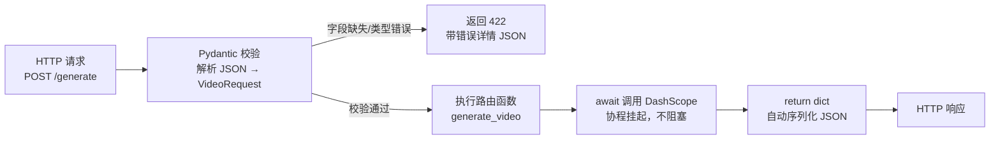
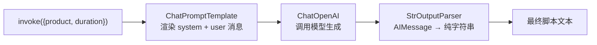
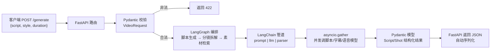

# 10 · AI 应用技术栈速通（FastAPI / LangChain / Pydantic / asyncio）

> 目标岗位：字节跳动剪映 CapCut「Agent 开发实习生（AI 剪辑）」（职位 ID：A80542）。
> 前置要求：熟悉 Express(Node)，在 shatangAI 用 FastAPI 风格后端调过 DashScope（通义千问）。
> 本章定位：**速通对照**——不是从零学 Python Web，而是把你会的东西映射到 Python AI 生态最常用的四件套（FastAPI / LangChain / Pydantic / asyncio），做到能看懂、能写最小示例、能在面试中讲清和 Go/Node 的对照。

## 本章学习目标

完成本章后，你应该能：

1. 用 FastAPI 写出一个带请求体校验的 POST 接口，并逐行解释它和 Express 的对应关系。
2. 讲清 LangChain 的 4 个核心对象（ChatOpenAI / ChatPromptTemplate / StrOutputParser / RunnableSequence），能解释 `prompt | llm | parser` 管道在做什么。
3. 理解 LangGraph 的 3 个关键词：State（TypedDict）、add_conditional_edges（动态路由）、MemorySaver（Checkpoint 暂停/恢复）。
4. 用 Pydantic V2 定义带约束的模型（Field 校验），并说清校验失败时 FastAPI 返回 422 的机制。
5. 对比 asyncio.gather 和 Go 的 sync.WaitGroup / errgroup，以及 async/await 和 goroutine + channel 的调度差异。
6. 能对着「四件套串起来」的架构图，讲清 FastAPI → Pydantic → LangGraph → LangChain → asyncio 在视频生成后端里的分层分工。

> 学习方法建议：四件套可以分 4 个半天过一遍，每个组件跑通一个最小示例即可；面试重点在「对照」——能把 FastAPI 讲成「Python 的 Express」、把 Pydantic 讲成「TS 的 Zod」、把 asyncio 讲成「事件循环版的 goroutine」。

## 核心知识点提炼

| 组件 | 一句话作用 | 你会的东西对照 |
| --- | --- | --- |
| FastAPI | Python 异步 Web 框架，类型注解驱动 | Express（路由 / 中间件 / async 概念一致） |
| Pydantic V2 | 声明式数据校验 + 自动序列化 | TS 的 Zod |
| LangChain | LLM 应用的组件库（Prompt / 模型 / 解析器 / 链） | 可类比「Express 中间件管道」，但面向 LLM 调用 |
| LangGraph | 用图结构编排 Agent（状态机 + 动态路由 + Checkpoint） | 可类比「工作流 / 状态机引擎」 |
| asyncio | 协程 + 事件循环，`asyncio.gather` 并发 | async/await ≈ Promise；gather ≈ Promise.all |

## 知识点详解

### 0. 速通心态：Node 开发者怎么快速迁移

你的优势：**Web 后端心智已经齐全**——路由、中间件、请求体、异步、错误处理这些概念在 Python 里全都有，只是写法不同。你要做的不是「学 Python」，而是「查表迁移」：

1. 看到 `@app.post(...)` → 想到 Express 的 `app.post(...)`；
2. 看到函数参数里声明 `req: VideoRequest` → 想到 `req.body` + 手动校验；
3. 看到 `return {"video_url": ...}` → 想到 `res.json({...})`；
4. 看到 `await asyncio.gather(...)` → 想到 `Promise.all([...])`。

唯一真正新的东西是 **LangChain / LangGraph**（Node 生态没有直接对应物），但它俩的本质你也不陌生：**把 LLM 调用包装成可组合的模块，像中间件管道一样串起来**——这正是 Express 的中间件思想。

### 1. FastAPI：你的 Express 记忆迁移

#### Express vs FastAPI 对照表

| 概念 | Express（你熟悉） | FastAPI（要学） |
| --- | --- | --- |
| 路由定义 | `app.get('/path', handler)` | `@app.get('/path')` 装饰器 |
| 请求体 | `req.body`（需中间件解析） | 函数参数 + Pydantic 模型（自动解析校验） |
| 返回 JSON | `res.json({})` | `return {}`（自动序列化） |
| 中间件 | `app.use(middleware)` | `@app.middleware("http")` |
| 异步 | `async/await` | 同样支持 `async/await` |
| 类型校验 | 手动 / 第三方库 | 声明式（Pydantic），校验失败自动返回 422 |
| 接口文档 | 手写 / Swagger 配置 | 自动生成 OpenAPI 文档（/docs） |

#### 最小示例（逐行解释）

```python
from fastapi import FastAPI          # 导入 FastAPI 类
from pydantic import BaseModel       # 导入 Pydantic 基类，用来定义请求体模型

app = FastAPI()                      # 创建应用实例（等价于 const app = express()）

class VideoRequest(BaseModel):       # 定义请求体模型：声明字段和类型
    script: str                      # 必填字符串字段：缺了它 FastAPI 直接返回 422
    style: str = "快节奏"             # 可选字段，带默认值，前端不传就用"快节奏"

@app.post("/generate")               # 装饰器注册路由：POST /generate（等价于 app.post('/generate', handler)）
async def generate_video(req: VideoRequest):  # 请求体作为函数参数，声明类型 VideoRequest 即可
    result = await call_dashscope(req.script, req.style)  # async 函数里 await 调用外部 API
    return {"video_url": result}     # 直接 return dict，FastAPI 自动序列化成 JSON 响应
```

**逐行要点**：

- `class VideoRequest(BaseModel)`：**声明式校验**。FastAPI 看到参数类型是 `VideoRequest`，会自动把请求体 JSON 解析成这个模型并校验类型——这一步对应 Express 里 `req.body` + 手写 `if (!body.script) return 400`。
- `async def`：和 Express 的 async handler 一样，遇到 `await` 就挂起协程，不阻塞事件循环。**注意**：`call_dashscope` 必须本身是 async 函数（或者用线程池包装），否则会阻塞整个事件循环——这是 Python 和 Node 最大的坑之一（见第 5 节）。
- `return {"video_url": result}`：不需要 `res.json()`，FastAPI 自动把 dict 序列化成 JSON 并设置 Content-Type。

#### FastAPI 请求处理流程



**对照 Express 的记忆点**：FastAPI = 路由（装饰器）+ 中间件（`@app.middleware("http")`）+ **自动校验**（Pydantic）+ **自动文档**（/docs）。你在 shatangAI 里调 DashScope 的 FastAPI 风格后端，本质就是这个流程。

#### 环境准备与启动（5 分钟跑起来）

```bash
python3 -m venv .venv          # 创建虚拟环境（等价于 npm 的 node_modules 隔离，但隔离的是 Python 包）
source .venv/bin/activate      # 激活环境
pip install fastapi "uvicorn[standard]"   # FastAPI 是框架，uvicorn 是 ASGI 服务器（等价于 Node 里的监听进程）
uvicorn main:app --reload      # 启动：main 是文件名，app 是实例名；--reload 等价于 nodemon 热重载
```

启动后打开 `http://127.0.0.1:8000/docs`——Swagger UI 自动生成，可以直接在页面上调试接口（相当于 Express 手搭的 Swagger）。

#### 路径参数 / 查询参数 / 状态码（对照 Express 高频写法）

```python
from fastapi import FastAPI, HTTPException, Query

app = FastAPI()

@app.get("/tasks/{task_id}")                # 路径参数：等价于 Express 的 /tasks/:task_id
async def get_task(task_id: str):
    task = db.get(task_id)                  # 假设有个 db
    if task is None:
        raise HTTPException(status_code=404, detail="任务不存在")  # 等价于 res.status(404).json(...)
    return task

@app.get("/tasks")                          # 查询参数：/tasks?page=1&size=10
async def list_tasks(
    page: int = Query(1, ge=1),             # Query 约束：page >= 1，不合法返回 422
    size: int = Query(10, ge=1, le=50),
):
    return {"page": page, "size": size}
```

- `{task_id}` 路径参数 → Express 的 `req.params.task_id`；
- `page: int = Query(1, ge=1)` → 等价于 Express 里手写 `parseInt(req.query.page)` + 校验，FastAPI 声明即完成；
- `raise HTTPException(status_code=404)` → 等价于 `res.status(404).json({detail: ...})`，且错误格式统一。

#### 中间件示例（对照 app.use）

```python
@app.middleware("http")
async def log_requests(request, call_next):
    # 请求进来先执行这里（等价于 Express 的 app.use 前置逻辑）
    response = await call_next(request)   # 调用下一个中间件/路由（等价于 next()）
    response.headers["X-Server"] = "gocampus"   # 响应出去前还能改（等价于 res.setHeader）
    return response
```

**记忆点**：`@app.middleware("http")` 包裹的函数签名固定是「接收 request，调用 call_next，返回 response」——和 Express 中间件 `(req, res, next)` 是一个心智模型，只是把 `next()` 改成了 `await call_next(request)`。

### 2. LangChain：LLM 应用的「中间件管道」

你只需要理解 4 个核心对象：

| 对象 | 作用 | 类比 |
| --- | --- | --- |
| `ChatOpenAI` | LLM 客户端，封装模型调用 | 数据库 client（但调用的是模型） |
| `ChatPromptTemplate` | Prompt 模板，`from_messages` 支持 system/user 角色 | 带变量的模板字符串 / 函数签名 |
| `StrOutputParser` | 把 LLM 的 AIMessage 输出解析成纯字符串 | 反序列化 / `.content` 取值 |
| `RunnableSequence`（管道 `\|`） | 把上面几个对象链式组合 | Express 中间件管道 / 函数组合 |

#### 最小示例（逐行解释）

```python
from langchain_openai import ChatOpenAI                        # LLM 客户端（兼容 OpenAI 格式，DashScope 也能配）
from langchain_core.prompts import ChatPromptTemplate          # Prompt 模板
from langchain_core.output_parsers import StrOutputParser      # 输出解析器

llm = ChatOpenAI(model="gpt-4o")                               # 创建模型实例
prompt = ChatPromptTemplate.from_messages([                    # 多消息模板：支持 system/user 角色
    ("system", "你是视频脚本专家"),                              # system：设定角色和全局约束
    ("user", "为{product}生成一个{duration}秒的脚本")            # user：带 {变量} 占位符
])
parser = StrOutputParser()                                     # 实例化解析器：AIMessage → str
chain = prompt | llm | parser   # 管道组合：输入 dict → 渲染 prompt → 调 LLM → 解析成字符串
result = chain.invoke({"product": "防晒霜", "duration": "30"})  # 一次 invoke 跑完整条链
print(result)  # 纯字符串：一份防晒霜 30 秒视频脚本
```

**逐行要点**：

- `ChatPromptTemplate.from_messages([...])`：传入 `(role, content)` 元组列表，`{product}`、`{duration}` 是占位符，`invoke` 时用 dict 填充——等价于 Express 里的模板字符串渲染。
- `chain = prompt | llm | parser`：这是 LangChain 的 LCEL（LangChain Expression Language）语法。`|` 表示「前一步的输出作为后一步的输入」，每个对象都实现了统一的 Runnable 接口，所以能像管道一样串起来。它本质上就是**函数组合**：`parser(llm(prompt.format(inputs)))`。
- `chain.invoke({...})`：传入整个链需要的所有变量，一次调用完成「渲染 → 生成 → 解析」。

#### LangChain 管道组合图



**为什么这对你（AI 剪辑方向）有用**：一键成片（AutoCut）这类业务，典型链路就是「脚本生成（LLM）→ 分镜拆解（LLM + 结构化输出）→ 素材检索（RAG）→ 剪辑参数」。LangChain 的管道思想让你能把「脚本专家」和「分镜专家」两个 Prompt + 两个模型调用串成一条链——这就是 Agent 的最小形态。

#### 进阶两个高频用法（看懂即可）

**① 流式输出（stream）**：脚本生成耗时几十秒，前端要「打字机效果」，用 `chain.stream(...)` 而不是 `invoke`：

```python
async for chunk in chain.astream({"product": "防晒霜", "duration": "30"}):
    print(chunk, end="")        # 逐块输出，等价于把 LLM 的 SSE 流逐段转发给前端
```

**② 结构化输出（with_structured_output）**：分镜拆解需要返回「镜头列表」这种 JSON，直接绑定一个 Pydantic 模型，让 LLM 输出被校验过的结构化对象：

```python
from pydantic import BaseModel, Field

class Shot(BaseModel):
    shot_no: int
    scene: str = Field(description="画面描述")
    duration_sec: int

structured_llm = llm.with_structured_output(Shot)   # 强制 LLM 输出符合 Shot 的 JSON
shot = structured_llm.invoke("第一个镜头：海边日出")   # 直接拿到 Shot 对象：shot.scene、shot.duration_sec
```

这一步把「自由文本 → 强类型对象」交给了框架：LLM 输出 JSON → Pydantic 校验 → 失败自动重试。对应你在 Go 里手写 `json.Unmarshal` + 校验的工作，这里声明即完成。

### 3. LangGraph：Agent 的工作流引擎（与第 5 章呼应）

LangChain 的管道是**线性**的（一条直线）；Agent 需要**分支、循环、暂停恢复**，这就是 LangGraph 登场的原因。你只需要理解 3 个关键词：

1. **State（TypedDict）**：定义 Agent 的全局状态，所有节点共享读写。
2. **add_conditional_edges**：根据状态动态决定下一步走哪个节点（动态路由）。
3. **MemorySaver**：Checkpoint 机制，给调用传入 `thread_id` 就能暂停/恢复会话。

```python
from typing import TypedDict, Literal
from langgraph.graph import StateGraph, END

class AgentState(TypedDict):          # ① 状态：所有节点共享的"黑板书"
    input: str
    route: str

def route_node(state: AgentState) -> dict:
    # ② 节点就是普通函数：读 state，返回要更新的字段
    return {"route": "generate" if "生成" in state["input"] else "search"}

def generate_node(state: AgentState) -> dict:
    return {"input": f"已生成脚本: {state['input']}"}

def search_node(state: AgentState) -> dict:
    return {"input": f"已检索素材: {state['input']}"}

def router(state: AgentState) -> Literal["generate", "search"]:
    return state["route"]             # ③ 路由函数：返回下一个节点的名字

g = StateGraph(AgentState)
g.add_node("route", route_node)
g.add_node("generate", generate_node)
g.add_node("search", search_node)
g.set_entry_point("route")
g.add_conditional_edges("route", router, {"generate": "generate", "search": "search"})
g.add_edge("generate", END)
g.add_edge("search", END)
app = g.compile()
```

- **加 Checkpoint（暂停/恢复）**：`from langgraph.checkpoint.memory import MemorySaver`，编译时传入 `checkpointer=MemorySaver()`，之后每次 `invoke` 带 `config={"configurable": {"thread_id": "task-001"}}`，同一 thread_id 的对话可以从上次状态继续——天然支持「AI 剪辑任务做到一半暂停，恢复后接着做」。
- **结合 asyncio 的异步执行**：LangGraph 节点函数可以是 async（`async def`），编译后的图也支持 `await app.ainvoke(...)`、`app.astream(...)`，可以直接跑在 FastAPI 的 async 路由里——三者串起来毫无障碍。
- **官方文档**：[https://langchain-ai.github.io/langgraph/](https://langchain-ai.github.io/langgraph/)——重点看 Tutorials 里的 **「Build a basic chatbot」** 和 **「Build a multi-agent system」**。

### 4. Pydantic V2：TS Zod 的 Python 版

FastAPI 的校验全靠它，单独拎出来学是因为它也是 LangChain 结构化输出的基础设施。

#### 最小示例（逐行解释）

```python
from pydantic import BaseModel, Field

class VideoTask(BaseModel):
    task_id: str                                            # 必填字符串
    script: str = Field(min_length=10, max_length=1000)     # 长度约束：10-1000 字符
    style: str = Field(default="快节奏")                      # 带默认值，等价于 style: str = "快节奏"
    duration: int = Field(ge=5, le=300)                     # 数值约束：5-300 秒（ge=greater or equal, le=less or equal）

task = VideoTask(task_id="t001", script="这是一段超过十个字的脚本", duration=30)
# 校验通过，task 对象可以直接用：task.script、task.duration
```

**要点**：

- **声明式校验**：`Field(min_length=..., max_length=..., ge=..., le=...)` 是校验规则的声明，违反规则会抛 `ValidationError`，而不是运行时手写 if 判断。
- **自动类型转换**：`duration=30` 传字符串 `"30"` 也会被自动转成 int（宽松模式下），这是 Pydantic 的「数据清洗」能力。
- **自动生成 OpenAPI 文档**：FastAPI 路由的参数只要声明了 Pydantic 模型，`/docs`（Swagger UI）和 OpenAPI schema 就自动生成——后端文档零成本。
- **FastAPI 集成**：请求体自动校验，**校验失败返回 422 Unprocessable Entity** + 详细的错误 JSON（哪个字段、什么原因），前端可以直接展示。

#### Pydantic vs Zod 对照表

| 概念 | Zod（你熟悉） | Pydantic V2 |
| --- | --- | --- |
| 定义 Schema | `z.object({...})` | `class X(BaseModel)` + 类型注解 |
| 约束 | `.min().max()` | `Field(min_length=..., ge=...)` |
| 校验时机 | 运行时手动 `parse()` | 请求进入路由时自动校验 |
| 校验失败 | 抛 ZodError | 抛 ValidationError / HTTP 422 |
| 类型推导 | `z.infer` | `TypeAdapter` / 类本身即类型 |

#### 再补三个常用能力（面试提到会加分）

**① 自定义校验（field_validator）**：内置约束不够时写函数校验，等价于 Zod 的 `.refine()`：

```python
from pydantic import BaseModel, field_validator

class VideoTask(BaseModel):
    style: str

    @field_validator("style")
    @classmethod
    def style_not_empty(cls, v: str) -> str:
        if not v.strip():
            raise ValueError("style 不能是空白")     # 抛 ValueError 即校验失败
        return v
```

**② 序列化输出（model_dump）**：校验后转 dict/JSON，等价于 Zod 解析后的对象再 `JSON.stringify`：

```python
task_dict = task.model_dump()          # {"task_id": "t001", "script": "...", "style": "快节奏", "duration": 30}
task_json = task.model_dump_json()     # JSON 字符串，可直接返回给前端
```

**③ 嵌套模型**：模型套模型，等价于 Zod 的嵌套 object schema——分镜拆解的结果天然是「列表套对象」结构：

```python
class Shot(BaseModel):
    shot_no: int
    scene: str

class Script(BaseModel):
    title: str
    shots: list[Shot]                  # 嵌套：列表里的每个元素都会被校验成 Shot

s = Script(title="防晒霜广告", shots=[{"shot_no": 1, "scene": "海边日出"}])
print(s.shots[0].scene)                # "海边日出"（已自动从 dict 转成 Shot 对象）
```

### 5. asyncio：和 JS 几乎一样，核心差异在调度

#### 最小示例（逐行解释，等价于 Promise.all）

```python
import asyncio

async def main():
    # gather 并发执行三个协程，全部完成后返回结果列表（顺序与传入顺序一致）
    results = await asyncio.gather(
        call_provider_a(script),   # 并发调供应商 A
        call_provider_b(script),   # 并发调供应商 B
        call_provider_c(script)    # 并发调供应商 C
    )
    return results                 # [A 的结果, B 的结果, C 的结果]
```

**逐行要点**：

- `async def`：定义协程函数，调用它返回协程对象，**不会立即执行**——和 JS 的 async function 完全一致。
- `asyncio.gather(...)`：把多个协程并发调度，等价于 JS 的 `Promise.all`；谁先完成不重要，`await` 等全部返回，结果顺序和传入顺序一致（对应 `Promise.all` 的 `Promise.allSettled` 语义差异要注意异常处理）。
- `await`：挂起当前协程，让出事件循环，等结果回来再继续——**一个线程内协作式切换**。

#### Go 对照表（面试常考）

| Python | Go | 差异 |
| --- | --- | --- |
| `asyncio.gather` | `sync.WaitGroup` / `errgroup.Group` | gather 等价于「并发 + 等待全部」；errgroup 额外支持「第一个错误就取消」 |
| `async`/`await` | goroutine + channel | 语法层面对应，但调度模型完全不同 |
| 事件循环（单线程协作式） | GMP 调度器（M 个线程抢占式） | **Python 协程切换靠主动 `await` 让出；Go 是运行时抢占式调度，阻塞操作自动让出 M 线程** |
| 阻塞操作 | — | Python 里同步阻塞（如 `requests.get`）会卡死整个事件循环；Go 里一个 goroutine 阻塞不影响其他 goroutine |

**面试一句话**：「Python 的 asyncio 是单线程协作式调度，`await` 是显式让出；Go 是 M:N 抢占式调度，goroutine 阻塞时调度器自动换线程。所以 Python 里绝不能把同步阻塞调用放进 async 函数，而 Go 里随便写。」

**AI 场景的典型用法**：一键成片要同时调「脚本模型 + 字幕模型 + 语音模型」，或者同时对比三家供应商的响应——`asyncio.gather` 就是你的 `Promise.all`，把耗时从串行的 3×T 降到 T。

#### 再补三个和 JS 对得上的工具

**① create_task（等价于「不 await 就启动」）**：

```python
task = asyncio.create_task(call_dashscope(script))   # 立即调度，不等待（等价于 Promise 创建即执行）
# ... 中间做别的事 ...
result = await task                                  # 需要结果时再 await
```

**② wait_for 超时（等价于 Promise.race + setTimeout 取消）**：AI 供应商可能很慢，必须设超时：

```python
try:
    result = await asyncio.wait_for(call_dashscope(script), timeout=30)
except asyncio.TimeoutError:
    return fallback_result        # 超时降级：等价于 Go 里 context.WithTimeout 到期
```

**③ 同步阻塞的坑（Python 独有，必须会讲）**：`requests.get` 这类同步调用放进 async 函数会**卡死整个事件循环**——所有请求都排队等它。解法是用线程池包装：

```python
import asyncio, requests

def sync_call(url):               # 普通同步函数（不是 async）
    return requests.get(url).json()

async def handler():
    result = await asyncio.to_thread(sync_call, "https://dashscope.aliyuncs.com/...")  # 丢到线程池跑，不阻塞事件循环
```

对照 Go：goroutine 里随便写阻塞调用，GMP 调度器会自动换线程；Python 没有这个能力，只能靠 `to_thread` / `run_in_executor` 手动兜底——这是面试官最爱挖的差异点。

### 6. 四件套串起来：一个视频生成后端的骨架

看完四个组件后，把它们拼成一个真实的 shatangAI 风格后端（这也是面试时「讲架构」的素材）：



对应的伪代码骨架（看懂层次即可）：

```python
@app.post("/generate")
async def generate(req: VideoRequest):
    shots = await app_graph.ainvoke({"script": req.script, "style": req.style})  # LangGraph 编排
    media = await asyncio.gather(                                                # 并发调模型
        gen_video(shots), gen_subtitle(shots), gen_voice(shots)
    )
    return {"task_id": create_task(media)}                                       # Pydantic 校验后返回
```

**层次记忆**：FastAPI 是外壳（接收 HTTP）→ Pydantic 是门卫（校验数据）→ LangGraph 是大脑（决定流程分支）→ LangChain 是手（调用模型）→ asyncio 是血管（并发不阻塞）。面试被问「你在 shatangAI 里架构怎么分层」，按这个顺序讲即可。

## 面试问答

### Q1：FastAPI 和 Express 的核心区别是什么？

最大的区别是「声明式」vs「命令式」：Express 里路由、请求体解析、校验、响应序列化都是手动一步步写的；FastAPI 靠类型注解和装饰器声明，框架自动完成解析、校验和序列化。具体到请求体，Express 是 `req.body` + 自己写校验逻辑，FastAPI 是函数参数声明一个 Pydantic 模型，校验失败自动返回 422。另外 FastAPI 用类型注解自动生成 OpenAPI 文档，Express 一般要额外配 Swagger。异步方面两者都支持 async/await，但 Python 是单线程事件循环，同步阻塞调用会卡住整个服务，这一点和 Node 是一样的心智。

### Q2：为什么 FastAPI 用类型注解就能自动校验请求体并生成 OpenAPI 文档？

因为 Python 的函数参数可以带类型注解，FastAPI 在启动时用反射（`inspect.signature`）扫描所有路由函数的参数，发现参数类型是 Pydantic 模型时，就把这个模型注册为请求体 schema。Pydantic 模型本身是声明式的：字段类型 + Field 约束就是完整的校验规则，同时可以推导出 JSON Schema。于是校验逻辑、OpenAPI 文档、Swagger UI 都是同一个声明自动生成的，没有重复代码。这本质上和 Zod 在 TS 里做运行时校验是同一套思想，只是 FastAPI 把它和路由深度绑定。

### Q3：LangChain 里 `prompt | llm | parser` 这个管道是什么原理？

这是 LangChain 的 LCEL 语法，`|` 表示把两个 Runnable 组合成一个新的 Runnable：前一个对象的输出自动作为后一个对象的输入。`prompt` 接收 dict 渲染出消息列表，`llm` 接收消息返回 AIMessage，`parser` 把 AIMessage 解析成字符串。组合出来的 `chain` 也是一个 Runnable，调用 `chain.invoke(inputs)` 就等价于 `parser.invoke(llm.invoke(prompt.invoke(inputs)))`。它和 Express 中间件管道的区别是：Express 中间件共享 req/res 对象，LangChain 管道是严格的「上一个输出 = 下一个输入」的函数组合。

### Q4：asyncio.gather 和 Go 的 errgroup 有什么区别？

两者都能并发执行多个任务并等待全部完成，但语义不同：`asyncio.gather` 更像 `Promise.all`——所有任务跑完才返回，结果按传入顺序排列；Go 的 `errgroup.Group` 是「并发 + 错误传播」，任何一个任务返回错误会取消其他任务并立刻返回该错误。更本质的差异在调度模型：Python 是单线程协作式事件循环，靠 `await` 主动让出；Go 是 M:N 抢占式调度，goroutine 阻塞时运行时自动切换。所以 Python 里混入同步阻塞调用会卡死整个事件循环，Go 里没有这个问题。

### Q5：Pydantic 校验失败时 FastAPI 返回什么？为什么这对工程有价值？

返回 422 Unprocessable Entity，响应体是结构化的错误详情 JSON，精确到哪个字段、什么类型错误、违反了什么约束。这对工程的价值有三点：一是后端不需要写一堆手动的参数校验代码，声明即校验；二是错误格式统一，前端可以直接解析并展示到表单对应字段；三是配合自动生成的 OpenAPI 文档，前端和后端对「接口契约」的理解完全一致，联调成本大幅降低。

### Q6（加分题）：从 Node 迁移到 Python AI 生态，你最大的几个心智转变？

第一，从「手写」到「声明」：Express 手动解析、校验、序列化，FastAPI + Pydantic 声明完自动完成，把精力放在业务上。第二，从「一个生态」到「两套生态」：Python 的 Web 框架（FastAPI）和 AI 框架（LangChain/LangGraph）是两个层次，Agent 的编排逻辑主要在 LangGraph 里，FastAPI 只是外壳。第三，调度模型的差异：Node 和 Python 都是单线程事件循环，但 Go 是抢占式多线程调度，写 Python AI 服务时要格外小心别把同步阻塞调用放进 async 函数。最后，LangGraph 的 State + 条件边其实就是状态机思想，和 Go 里手写状态机是同一件事，只是它把暂停恢复、多 Agent 协作做成了现成能力。

### Q7（加分题）：为什么 AI 生态的 Web 框架普遍选 FastAPI 而不是 Flask / Django？

核心原因是**类型注解 + 异步 + 自动文档**三件套正好匹配 AI 应用的需求。AI 后端几乎都是「接收请求 → 调模型（慢，几十秒）→ 返回结果」，必须异步并发处理多个请求，FastAPI 原生支持 async/await；Flask 是同步的，异步要额外套 asgi 适配。同时 AI 应用的输入输出结构复杂（脚本、镜头、参数），Pydantic 的声明式校验 + 自动生成 OpenAPI 文档让「后端定义好模型，前端照着 /docs 就能联调」，开发效率高很多。Django 更重（自带 ORM、admin），适合完整业务系统，AI 服务这种「薄接口 + 重外部调用」的场景用 FastAPI 更轻。

## 自测清单

- [ ] 能不查资料写出 FastAPI 的 POST 接口（Pydantic 请求体 + async + return dict），并说出每行对应 Express 的哪个概念
- [ ] 能默写 Express vs FastAPI 对照表（路由、请求体、返回 JSON、中间件、异步）
- [ ] 能用 `uvicorn main:app --reload` 启动服务并打开 /docs 调试接口
- [ ] 能解释 `prompt | llm | parser` 管道：每个对象是什么、数据怎么流动、invoke 做什么
- [ ] 能说出 LangChain 的 4 个核心对象及其作用，并知道 stream 和 with_structured_output 两个进阶用法
- [ ] 能说出 LangGraph 的 3 个关键词（State / add_conditional_edges / MemorySaver）并解释各自解决什么问题
- [ ] 能用 Field 写出带长度和数值约束的 Pydantic 模型，并说出校验失败时 FastAPI 返回 422
- [ ] 能说出 Pydantic 的 field_validator / model_dump / 嵌套模型三种进阶用法
- [ ] 能对比 asyncio.gather / Promise.all / errgroup，并说清 Python 协作式 vs Go 抢占式调度
- [ ] 能讲出「同步阻塞调用卡死事件循环」的坑和 asyncio.to_thread 的解法
- [ ] 能对着「四件套串起来」的架构图，讲出视频生成后端的五层分工
- [ ] 已在本地跑通本章最小示例（FastAPI 接口、LangChain 管道）

## 与既有文档联动

- [路线专题：大模型与 Agent 核心能力](/路线专题/03-大模型与Agent核心能力) —— LangChain/LangGraph 的完整 Agent 编排主线，本章的 4 个核心对象在那里有完整的 Go 对照实现
- [学习计划安排：第三阶段 AI 应用开发基础](/学习计划安排/第三阶段-AI应用开发基础) —— 前置基础：Token、OpenAI 兼容接口格式、生成参数
- [练习指南](/练习指南) —— 用 `code/` 目录的配套练习验证本章概念（如 Pydantic 校验练习）
