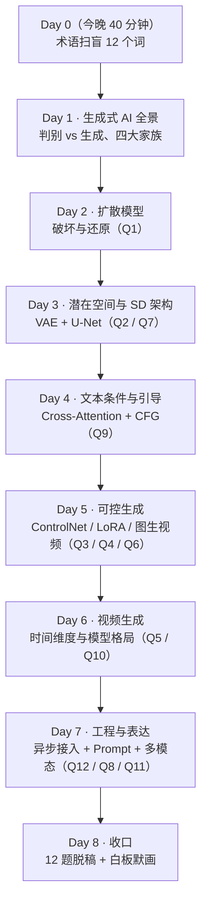
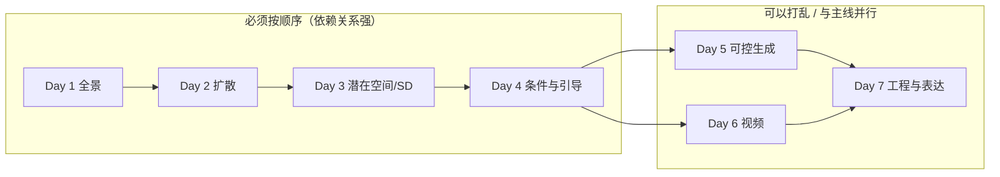
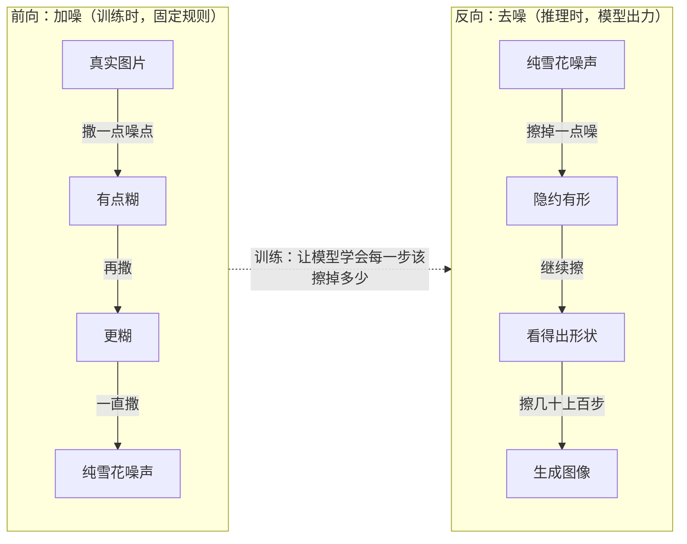
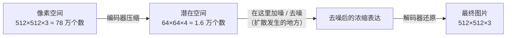
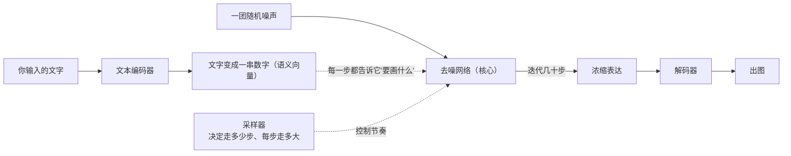
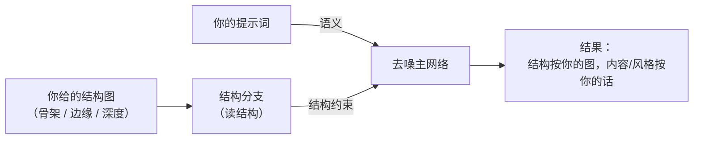
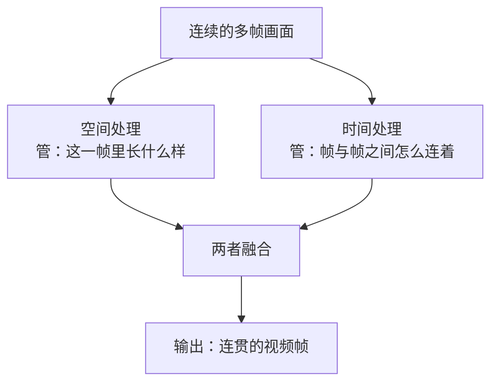
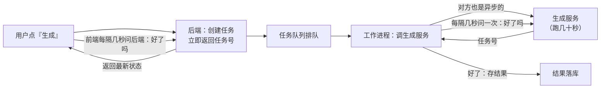
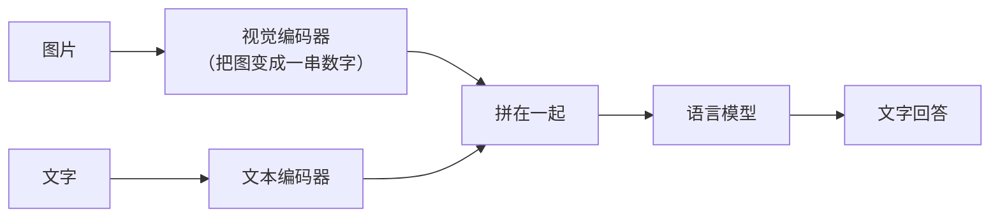

# 11 · 图像与视频生成原理：零基础学习方案（配套实习面试 12 题）

> **面向谁**：机器学习**零基础**，但后端工程扎实（Go / Node / HTTP / 队列 / 数据库）的你。
> **目标**：**7 天 × 每天 90 分钟**，从"连张量、潜在空间是什么都不知道"，到"在实习面试里把图像/视频生成原理讲清楚，并扛得住 2-3 层追问"。
> **交付物不是代码，是三样东西**：**一张能默画的图**、**一段 60 秒能脱口而出的讲解**、**一份能接住追问的作答卡**。
> **与 [07 · 文生视频与 Diffusion](./07-JD专题-文生视频与Diffusion模型) 的关系**：07 是原理深读（有推导、有公式、有工程细节），本章是**入门学习方案**——先用大白话把地基铺好，再去读 07 就不会一页都读不下去。**建议顺序：先本章，后 07。**
> **本文不含代码、不含环境搭建**。实习面试口头考的是理解，不是让你现场写模型代码；需要代码的地方会明确说"这个不考"。

## 0. 先立规矩：这份方案为什么这样排

### 0.1 三条原则

1. **先建直觉，再补名词**。0 基础最大的坑不是难，是**顺序错**：一上来读"变分自编码器""无分类器引导"，每个字都认识、连起来不知道在说什么。正确的顺序是先在脑子里建立画面（"往图上撒噪点，再一点点擦干净"），然后才知道那些名词各自站在这个画面的哪个位置。
2. **能讲出来才算学会**。面试不是笔试，考的是**口述**。所以每天的验收动作是"**关掉文档，讲 60 秒**"，而不是"读完了"。看得懂但讲不出，等于没学。
3. **只学能考的**。时间只有 7 天，凡是面试不会问的（反向传播怎么算、KL 散度怎么推、PyTorch 怎么写）一律不学，并在"不做的事"里明确划掉，避免自己吓自己。

### 0.2 三层理解法（每天的目标就是往上爬一层）

| 层级 | 状态 | 验收标准（过了才往下走） | 大约耗时 |
|------|------|------------------------|---------|
| **第一层：看懂** | "哦，原来是这个意思" | 能用一句大白话给完全不懂的人解释，且他知道你在说什么 | 每节 20 分钟 |
| **第二层：讲出** | "我能不看稿讲 60 秒" | 录音回听，没有卡顿、没有"呃…那个…"，结构是"结论 → 原理 → 取舍" | 每天 30 分钟 |
| **第三层：扛追问** | "你再问我也答得上" | 面试官问三层"为什么"，每层都能答，且能挂到项目上 | 每天 40 分钟 |

### 0.3 明确不做的事（0 基础最容易在这里浪费时间）

| 不做 | 为什么 |
|------|-------|
| 安装 Python / PyTorch / 跑本地模型 | 面试口头考原理，不问你会不会部署；装环境能吃掉你两天，还会因为下模型失败直接放弃 |
| 自己训练一个扩散模型 | 需要 GPU 集群和数据，实习面试不要求，也不相信你训过 |
| 背数学推导（ELBO、变分推断、链式法则） | 面试官问你"能不能推导"的概率极低；问"直觉是什么"的概率极高 |
| 背论文名和年份 | 记 2-3 个标志性的（DDPM、Stable Diffusion、Sora）够了，重点是说清"它解决了什么" |
| 把所有竞品参数背下来 | 只需要能说清"各家定位差异"，细节会被问穿 |

## 1. 第一步：术语扫盲（先花 40 分钟，把 12 个词变成常识）

**做法**：不要背，**读完每一行，合上文档，用你自己的话讲一遍**。讲不出来的回来看一眼，再讲。这 12 个词是后面一切的地基。

| 术语 | 大白话 | 你已经会的类比 | 一句话记忆 |
|------|-------|--------------|-----------|
| **图像 / 像素** | 一张图就是一大堆数字排成的方阵，每个位置有 3 个数（红、绿、蓝的亮度） | 一个 `[][]Color` 二维数组 | 图片就是数字表格 |
| **通道（Channel）** | 彩色图的"层"：红一层、绿一层、蓝一层，共 3 层 | 3 个并排的二维切片 | RGB 就是三层数字 |
| **张量（Tensor）** | 多维数组的统称。一张图 `高×宽×3`，一批图再加一维 `批×高×宽×3` | 嵌套的 slice，只是维度可多可少 | 张量 = 多维数组 |
| **模型 / 权重** | 一个巨大的函数；"权重"是这个函数里几亿个可调旋钮的当前取值，存在一个 4GB 的文件里 | 一个编译好的二进制 + 它的配置文件 | 模型 = 函数，权重 = 旋钮值 |
| **训练（Training）** | 用海量图片**自动调那些旋钮**，让输出越来越对。训练过程不属于面试范围 | CI 里跑很久的构建产物 | 训练 = 自动调旋钮 |
| **推理（Inference）** | 拿着调好的旋钮**跑一次**，得到结果（生成一张图） | 调一次接口 | 推理 = 用一次 |
| **参数 / 超参** | 参数是模型自己学的（权重）；超参是**你手调的**（生成步数、引导强度） | 配置文件 vs 代码里的常量 | 参数是学的，超参是你调的 |
| **编码器 / 解码器** | 编码器把大东西压成小的表达；解码器把小的表达还原回来 | `gzip` / `gunzip`，只不过它是**学出来的**有损压缩 | 编码器压缩，解码器还原 |
| **潜在空间（Latent Space）** | 压缩之后那个"小表达"所在的空间。图不再是"像素"，而是一串浓缩过的数字 | 把 4MB 图片压成 40KB 的那份编码 | 潜在空间 = 压缩后的表示 |
| **噪声（Noise）** | 随机的、没有意义的杂点（电视雪花）。生成模型把它当作"原料" | 随机数 | 噪声 = 生成的原料 |
| **采样 / 步数（Sampling / Steps）** | 从噪声一点点算出结果的过程叫采样；走多少小步叫步数 | 迭代逼近：走 20 步比走 4 步更精细 | 步数 = 迭代次数 |
| **条件（Conditioning）** | 你给模型的"要求"：文字、参考图、骨架图。条件决定它往哪个方向生成 | 请求里的参数 / 上下文 | 条件 = 给模型的要求 |

> **扫盲收尾动作**：把这张表盖住，让自己说出"潜在空间是什么""噪声在这里扮演什么角色"。这两个是后面所有内容的支点。

## 2. 学习路线图：7 天怎么走

### 2.1 每日日程（90 分钟标准版）

| 天 | 主题 | 90 分钟怎么分 | 当天交付物（必须产出，不然不算学完） |
|----|------|--------------|--------------------------------|
| Day 1 | 生成式 AI 全景、四大家族 | 读 35 分 + 白板画 20 分 + 口述 25 分 + 自测 10 分 | 【白板图 1】四大家族对比图 + 60 秒"为什么现在都用扩散" |
| Day 2 | 扩散模型双过程（Q1） | 读 30 分 + 画图 20 分 + 口述 30 分 + 自测 10 分 | 【白板图 2】加噪/去噪双过程 + Q1 口述录音 |
| Day 3 | VAE、潜在空间、SD 架构（Q2 / Q7） | 读 35 分 + 画图 20 分 + 口述 25 分 + 自测 10 分 | 【白板图 3】SD 四模块架构图 + 压缩比能当场算 |
| Day 4 | Cross-Attention、CFG（Q9） | 读 30 分 + 画图 15 分 + 口述 30 分 + 自测 15 分 | 【白板图 4】文本到底怎么影响生成 + Q9 口述 |
| Day 5 | ControlNet、LoRA、图生视频（Q3 / Q4 / Q6） | 读 35 分 + 口述 40 分 + 自测 15 分 | 三张作答卡 + "参考图/骨架图"产品流程能口述 |
| Day 6 | 视频生成、模型格局（Q5 / Q10） | 读 30 分 + 画图 20 分 + 口述 30 分 + 自测 10 分 | 【白板图 5】图像 vs 视频的差别 + 竞品定位表能说 |
| Day 7 | 异步工程、Prompt、多模态（Q12 / Q8 / Q11） | 读 30 分 + 口述 40 分 + 自测 20 分 | 【白板图 6】慢任务流程图 + 9 条 Prompt 规则 |
| Day 8 | 收口 | 12 题逐题脱稿 60 秒 + 默画 6 张图 | 全部 12 题不卡壳；6 张图能空手画 |

### 2.2 时间不够怎么办（三种节奏）

| 情况 | 怎么做 |
|------|-------|
| **只剩 3 天** | 只做 Day 2（扩散）、Day 3（SD 架构）、Day 4（条件与引导）+ Day 8 收口。这三块覆盖了面试 70% 的提问；Day 5-7 只背作答卡不深读 |
| **只剩 1 天（明天就面）** | 只读第 5 节的**「12 题总表」+ 每题作答卡**，把口述稿念 3 遍；白板只记【图 2】和【图 3】两张；其余全部放弃 |
| **每天只有 30 分钟** | 拆成"三天一层"：每天只做当天的"读"和"口述"，白板图挪到周末一次补齐 6 张 |

> **每天的固定动作（不管多忙都要做）**：① 关掉文档，用 60 秒把今天学的讲一遍并**录音**；② 回听，找出卡壳的地方；③ 卡壳处重读那一小节。**录音回听是这份方案里性价比最高的一步**——90% 的"我以为我会了"都死在这一步。

## 3. 逐层吃透（正文）

> 阅读方法：每一层都按「**先看直觉 → 再看名词 → 再画图 → 最后口述**」四步走。每层末尾的**作答卡**就是面试时的答案，但**不要先读作答卡**——先自己答，再对照，差别记下来，那才是你的薄弱点。

### 第 1 层 · 生成式 AI 全景（Day 1）

#### 3.1.1 先分清两类模型：判别 vs 生成

- **判别式（Discriminative）**：给它一张图，它告诉你"这是猫还是狗"。它做的是**判断**。
- **生成式（Generative）**：给它一句话，它**造出一张本来不存在的图**。它做的是**创造**。

你已经熟悉的 AI 大多是判别式的（分类、识别、打分）。图像/视频生成属于生成式，它的难点不在"判断对不对"，而在"**造出来的东西要像真的、且要听你的话**"。

> **一句话记忆**：判别是"这是不是猫"，生成是"给我画一只猫"。

#### 3.1.2 生成式 AI 的四大家族（面试最爱问的对比题）

| 家族 | 一句话原理 | 生活类比 | 优点 | 缺点 |
|------|-----------|---------|------|------|
| **GAN**（对抗生成网络） | 两个网络对打：一个造假图，一个鉴别真假，互相进步 | 造假币的和验钞的互相较劲 | 生成快（一次就出） | 训练不稳、容易"只会画一种脸"（模式崩溃） |
| **VAE**（变分自编码器） | 先把图压成浓缩编码，再从编码还原回来 | 有损压缩 + 解压 | 训练稳、编码连续可插值 | 出图偏模糊 |
| **扩散模型**（Diffusion） | 先学会"往图上加噪"，再学会"把噪声擦掉" | 一滴墨水滴进清水，再学怎么把墨收回去 | 质量高、训练稳、多样 | **慢**（要迭代很多步） |
| **自回归**（Autoregressive） | 一个接一个地预测下一个片段 | 像打字一样，一个字一个字往外蹦 | 擅长离散序列（语言） | 图像/视频里片段太多，又慢又难 |

**为什么现在主流是扩散模型？** 一句话：**它用"慢"换来了"质量高 + 训练稳 + 好加条件"**。GAN 快但训不稳，VAE 稳但糊，自回归在语言上是王者但在视觉上太慢——扩散是当前综合最优解，所以 Stable Diffusion、Sora、Seedance 全走这条路。

【白板图 1】四大家族地图（横轴：生成速度；纵轴：质量与稳定性；四个家族各占一角，扩散在右上）

> **自测 3 问**（答不上来就回读）
> 1. 判别式和生成式的根本差别是什么？
> 2. GAN 的"模式崩溃"用一句话怎么解释？
> 3. 为什么扩散模型慢，却成了主流？

---

### 第 2 层 · 扩散模型：破坏容易，还原很难（Day 2）→ 对应 **Q1**

#### 3.2.1 直觉先行：一滴墨水

把一滴墨水滴进一杯清水：**它会自己扩散开，最后整杯水颜色均匀——这个过程不用学，物理自发的**。
现在反过来问：**你能把已经散开的墨，一滴不差地收回到原来那一滴吗？** 很难。

扩散模型干的就是这件事：**它不学"怎么画图"，它学"怎么把被打散的图收回来"**。

- **前向过程（加噪）**：拿一张真图，一步步往里撒随机噪点，撒到最后变成一片电视雪花。这个过程是**人为规定死的，不需要模型参与**。
- **反向过程（去噪）**：从一片雪花出发，一步步把噪点擦掉。每擦一步，画面清晰一点，走几十到上百步，最后"擦"出一张图。**这个过程才是模型学的**。

#### 3.2.2 最关键的洞察：模型学的不是"画"，是"擦"

这是整个主题**最容易被问、也最能体现你有没有真懂**的一点：

> 模型从来没见过"从噪声变出图片"的完整过程。它只学一件事——**给你一张糊了的图，再告诉你"这张图大概糊到什么程度"，你猜出"糊进去的那些噪点长什么样"**。

训练时就是这么做的：拿一张真图，随机撒一批噪点（知道撒的是什么），让模型看图猜答案，猜错了就调整旋钮，反复几亿次。它学的是**"识别并去除噪点"这个局部能力**。

为什么这样设计？因为**"猜噪点"比"一步画出整幅图"简单太多**。就像教一个新人擦黑板：不要求他一秒擦干净，只要求他"每次擦掉薄薄一层"——这件事他学得会，擦一百次也就干净了。

> **面试金句**：*"扩散模型的模型不负责创作，它只负责'去噪'——创作是把几十次去噪叠加出来的效果。"*

#### 3.2.3 两个必答的追问

**追问一：为什么非要很多步？一步到位不行吗？**

不行，而且原因很实在：每一步只擦掉一点点，**单步的误差被限制在很小的范围**；如果要求一步擦干净，模型必须一次做出几百万个数字的精确判断，任何一点偏差都会放大成明显破绽。步数少 → 每步改动大 → 容易糊、容易出错；步数多 → 精修 → 质量高但耗时长。所以**"步数—质量—速度"是同一个天平上的三样东西**。

（面试加分：业界用"跳步采样"的办法把上千步压到 20~50 步，质量几乎不损失——这就是 DDIM 这类采样加速技术干的事。你只要说清"有这回事、方向是跳步"就够。）

**追问二：为什么不同提示词、同样的描述，每次生成结果都不一样？**

因为**起点是随机噪声**。噪声不同，去噪的路径就不同，终点自然不同。想复现，就固定"随机种子（seed）"——这跟你在后端里固定随机数是同一个思路。

【白板图 2】加噪/去噪双过程（面试时**最该先画的就是这张**）

#### 📋 作答卡 Q1：扩散模型的原理是什么？

**60 秒口述稿**：
> "扩散模型学的是'加噪'的逆过程。训练时，它拿真实图片一步步撒随机噪点，直到变成一片雪花；模型的任务不是学怎么画图，而是学**每一步该擦掉多少噪点**——给它一张糊图，再告诉它糊到什么程度，让它猜出糊进去的噪点长什么样。推理时反过来：从一片随机雪花出发，让模型一步步擦噪点，擦几十到上百步，最后擦出一张图。它的好处是比 GAN 稳定得多，没有两个网络对抗导致的模式崩溃；代价是**慢**，因为这些步骤是串行的，下一步的输入是上一步的输出，没法并行。所以业界又在两个方向上优化：一是把扩散放到压缩后的空间里做，二是用跳步采样把上千步压到几十步。"

**追问三连**：
| 面试官问 | 你怎么答（要点） |
|---------|----------------|
| "为什么不让模型一次生成整张图？" | 单步误差会被放大；分步是把难题拆成一堆简单题，每步只擦薄薄一层，累积起来才精确 |
| "模型到底在优化什么？" | 让它预测的噪点和真实撒进去的噪点尽量一致（衡量差异、调旋钮），重点是"学的是去噪函数" |
| "为什么同样的提示词每次不一样？" | 起点噪声是随机的 → 路径不同 → 结果不同；固定 seed 就能复现 |

**常见错误（说出口就掉分）**：
- ❌ "扩散模型是一次性画出整张图的" → 是几十上百步迭代出来的
- ❌ "模型是在'生成'图片" → 模型只做去噪，"生成"是整条流程的效果
- ❌ "步数越多越慢但没有任何代价" → 步数多=慢=成本高，工程上要权衡

---

### 第 3 层 · 为什么要在"压缩空间"里做：VAE 与 Stable Diffusion（Day 3）→ 对应 **Q2、Q7**

#### 3.3.1 先算一笔账：为什么不能直接在像素上做

一帧 512×512 的彩色图，数字量是 `512 × 512 × 3 ≈ 78 万个`。视频更吓人：5 秒 24 帧就是 120 帧，直接上千万到上亿个数字。

在这个体量上做"几十上百步的迭代去噪"，算力根本扛不住——**这是 Stable Diffusion 出现前，扩散模型只能在实验室跑的原因**。

#### 3.3.2 VAE 的三步作用（把 78 万变成 1.6 万）

VAE（变分自编码器）在这里的角色**不是生成**，而是**压缩和解压**：

1. **压缩**：用编码器把 `512×512×3` 的图压成 `64×64×4` 的"浓缩表达"。空间上是 64 倍小，算上通道变化（3 层变 4 层），**总数字量少约 48 倍**。
2. **在浓缩空间里做扩散**：加噪、去噪全在这个小空间里进行，速度快几十倍。
3. **还原**：去噪完成后，用解码器把 `64×64×4` 解回 `512×512×3` 的图片。

> **面试时的精度提醒**：说"计算量降低几十倍"最稳。若面试官追问精确数字：空间上每边压 8 倍 → **面积小 64 倍**，但通道从 3 变 4 → **总数值少约 48 倍**。**能主动区分这两个数字，是"真懂"的信号**（很多人只会含糊说"小很多"）。

#### 3.3.3 Stable Diffusion 的四个模块（**Q2 的骨架**）

| 模块 | 它负责什么 | 一句话记忆 |
|------|-----------|-----------|
| **文本编码器**（CLIP） | 把你的话变成一串数字，让去噪网络知道"要画什么" | 翻译官：把中文变成模型的语言 |
| **VAE** | 压缩与还原（上面说的那三步） | 压缩包 + 解压包 |
| **去噪网络**（U-Net） | 真正的干活的：每一步预测噪点并擦掉 | 生成引擎 |
| **采样器**（Scheduler） | 决定走多少步、每步迈多大 | 节奏控制器 |

> **关于"U-Net"这个词**：你只需要知道它是**一种专门处理图像的神经网络结构**，特点是"先缩小看全局、再放大补细节，中间用跳跃连接把细节接回来"，所以它既懂"整体构图"又抠得了"局部纹理"。**面试不会让你推导 U-Net 的结构图**，说清这个特点就够了。
>
> **关于"采样器"为什么值得提**：因为同一个模型权重，换采样器就能在速度和质量之间重新选一次，而且**不用重新训练**——这是工程上很实用的一点。

【白板图 3】SD 四模块架构图（面试第二该画的图；画的时候把"文字→向量→注入去噪→解码"这条线走通）

#### 📋 作答卡 Q2：Stable Diffusion 的架构与各模块作用

**60 秒口述稿**：
> "Stable Diffusion 可以拆成四个部分。**文本编码器**把你的提示词变成一串语义数字；**VAE** 负责压缩和还原——它先把图片从 512×512 的像素空间压到 64×64 的浓缩空间，扩散过程和去噪都在这个小空间里做，算力降低几十倍，生成完再解压回原尺寸，这是 SD 能在消费级显卡上跑起来的关键；**去噪网络**是真正干活的核心，每一步预测噪点并擦掉，而且每一步都会参考文本向量，靠的是 **Cross-Attention** 机制，让画面不同区域各自关注提示词里相关的词；最后是**采样器**，它决定去噪走多少步、每步迈多大，影响速度和质量，而且换采样器不用重新训练模型。"

#### 📋 作答卡 Q7：VAE 是什么？在生成里起什么作用

**60 秒口述稿**：
> "VAE 是变分自编码器，在生成模型里它主要负责**压缩和解压**，不是负责生成。它的编码器把高分辨率图片压成一个低维的浓缩表达，解码器再把它还原成图片。在 Stable Diffusion 里，512×512 的图会被压成 64×64 的浓缩表达，空间上小了 64 倍，算上通道变化总数字量少大约 48 倍，扩散过程就在这个小空间里做，所以才能把成本降下来。**视频里更复杂**：视频不只是空间上的冗余，相邻帧之间还高度相似，所以要用"时空 VAE"，在空间和时间两个维度同时压缩——这也解释了为什么视频模型虽然效果进步很快，训练和推理成本依然远高于图像。"

**常见错误**：
- ❌ "VAE 负责生成图片" → 它负责压缩/还原，生成是去噪网络干的
- ❌ "潜在空间是低清缩略图" → 不是缩小版图片，是一串**抽象的浓缩数字**，人眼看不懂但机器能算
- ❌ 把 64 倍和 48 倍混着说 → 主动区分（面积 64 倍 / 总数值 48 倍）

---

### 第 4 层 · 模型怎么"听懂"文字：条件与引导（Day 4）→ 对应 **Q9**

#### 3.4.1 从一句话到一串数字

模型不认字，只认数字。所以第一步永远是**把文字变成一串数字**（这一步叫"文本编码"），这串数字浓缩了整句话的意思。

#### 3.4.2 Cross-Attention：图像每个位置"举手提问"

大白话版本：去噪的每一步，画面被拆成很多个小区域（每个区域是一个"位置"）。**每个位置都会去问一遍这句话："在你这段话里，跟我最相关的是哪个词？"** 然后它就把那个词的信息吸收过来。

于是："一只猫坐在窗台上，晨光"——画面上"猫所在的区域"会重点吸收"猫"，"背景区域"吸收"窗台"，整体色调受"晨光"影响。

> **为什么这解释了 Prompt 工程有用**：你描述得越具体，每个位置"该关注谁"就越明确，画面就越受控。**"一只猫"和"一只橘猫坐在洒满晨光的窗台上、逆光、电影感"生成出来完全是两个东西**——差别就在这个注意力分布上。

#### 3.4.3 CFG（引导强度）：把"听话的方向"放大

问题：模型如果完全自由发挥，可能会跑题。怎么办？

做法很巧：每一步**同时算两次**——一次"看着提示词去噪"，一次"完全不看提示词去噪"。然后看这两个方向的差别，**把这个差别放大若干倍**，再照着放大后的方向走：

> 最终方向 = 不看提示词的方向 + **引导强度** ×（看提示词的方向 − 不看提示词的方向）

| 引导强度 | 效果 | 类比 |
|---------|------|------|
| 低（1-3） | 自由发挥、多样，但可能跑题 | 只给了个方向，剩下自己看着办 |
| 中（7 左右） | 平衡，**默认最优** | 明确要求 + 给一点创作空间 |
| 高（15 以上） | 严格贴着提示词，但容易颜色发焦、边缘失真 | 死抠字眼，反而僵硬 |

> **产品经理视角（面试加分）**：这个参数在真实产品里**不会直接给用户看**，会被包装成"创意程度"或"与参考图的相似度"这样人话的旋钮——用户要的是"更像/更自由"，不是"CFG=7"。**把数学参数翻译成用户意图，是 AIGC 产品设计的一个通用原则。**

#### 📋 作答卡 Q9：CFG Scale 是什么，为什么调节它会影响效果

**60 秒口述稿**：
> "CFG 可以理解成'模型对提示词的服从程度'。它的做法是每一步同时算两个方向：一个是看着提示词的去噪方向，一个是不看提示词的、纯自由发挥的方向；然后把两者的差别乘上一个引导系数再叠加回去，相当于**把'听话'这个方向放大**。系数低的时候模型自由发挥，结果多样但可能跟你的描述关系不大；系数高的时候严格贴着提示词，但容易出现颜色过饱和、细节发焦；一般在 7 左右最平衡。在产品里这个参数通常不会直接暴露，而是包装成'创意程度'或者'与参考图相似度'这类用户能理解的表达。"

**自测 3 问**：
1. 为什么文字能控制画面？（答案要落到"每步都在参考文本"）
2. CFG 的公式在做什么？（放大"听话"的方向）
3. 引导强度调太高会怎样？（过饱和、失真——不是"越好越听话"）

---

### 第 5 层 · 可控生成：让模型"照着做"（Day 5）→ 对应 **Q3、Q4、Q6**

#### 3.5.1 问题：文字在"结构"上很无力

你可以说"一个女孩在跑步"，但**"右腿在前、左臂抬起、身体前倾 15 度"**这种要求，用文字根本说不清。而生成任务里，结构、姿态、构图恰恰是用户最在意的。

**思路的转变**：既然文字说不清，那就**直接给一张图**——用图形本身当条件。

#### 3.5.2 ControlNet：给模型一张"结构草图"

做法：在原有去噪网络旁边**再挂一个分支**，这个分支专门读一张"结构图"，把结构信息喂给主网络，从而精确控制生成结果的空间结构。

关键设计（面试加分点）：这个分支用"**零初始化**"的方式接上去——**一开始它的影响是零，所以不会破坏原模型已有的能力**，然后在这个基础上训练它学会"听结构图的"。这就是为什么 ControlNet 能**外挂在已经训好的大模型上**，而不需要从头重训。

| 你给的结构图 | 长什么样 | 用户能干什么 |
|------------|---------|-------------|
| 边缘线稿 | 只有轮廓的黑白线 | 线稿上色、保持轮廓换风格 |
| 骨架图 | 人的关节火柴人 | **摆姿势**：让生成的人跟你给的姿势一样 |
| 深度图 | 灰阶表示远近 | 保持空间层次，换背景/重绘场景 |
| 语义分区图 | 不同色块代表不同物体 | 控制"这一块是天、这一块是地" |
| 涂鸦 | 随手画几笔 | 涂鸦生图 |

> **面试金句**：*"ControlNet 的价值是把'描述结构'这件事从语言换成了图形——用户不需要学会写提示词，他只需要给一张骨架图。"*
>
> **诚实边界**：ControlNet 是开源社区（Stable Diffusion 生态）里的经典机制。商业闭源视频模型对外只提供"参考图""首尾帧"这类能力，**内部不一定就是 ControlNet**。被问到时要答"这类能力在原理上都属于**可控生成**"，不要斩钉截铁地说某家内部用了 ControlNet。

#### 3.5.3 LoRA：让"个性化"变得便宜

问题：想给某个人、某种画风、某个商品做专门优化，**全量微调一个大模型太贵**（几十亿参数，给每个用户训一份不可能）。

LoRA 的做法：**原来的大模型完全不动（冻结）**，只在旁边插一对**很小的矩阵**，只训练这对小矩阵；用的时候把它俩相乘的结果**叠加**到原权重上。

> 形象类比：**大模型是一本已经印好的词典，LoRA 是一张薄薄的"勘误+补充贴纸"**。不重印整本词典，只贴一张小贴纸就能改变它的表现，而且贴纸可以随时撕下来换另一张。

| 对比项 | 全量微调 | LoRA |
|--------|---------|------|
| 要动的东西 | 全部权重 | 只加一对小矩阵 |
| 文件大小 | 几 GB | 一两百 MB |
| 能不能组合 | 难 | **可以叠加多个**（各自带权重） |
| 效果上限 | 高 | 略低，但工程上可行得多 |

**为什么它对产品很重要**：它是"**用户上传几张自己的照片 → 生成以自己为主角的内容**"这类功能的技术基础；也是"品牌风格一键生成"的基础。

> **诚实边界（重要的加分项）**：说 LoRA 时主动补一句它的代价——**效果上限低于全量微调，而且训练需要额外的等待时间，不是即时的**。面试官听到你知道边界，比只听你夸优点更信任你。

#### 3.5.4 图生视频：把"一张图"当条件（Q6 的核心）

- **做法**：把输入的那张图先编码成浓缩表达，作为"第 0 帧"的条件，之后每一帧生成时都**始终参考它**——所以画面不会跑偏，像是从这张图"长"出来的。
- **三种控制方式**（不同产品支持程度不同）：

| 控制方式 | 什么意思 | 用户视角 |
|---------|---------|---------|
| **首帧控制** | 只给开头一张图，后面自己动 | "让我的照片动起来" |
| **首尾帧控制** | 给开头和结尾两张图，中间让它"脑补"过渡 | "从这张变到那张"（对模型能力要求高，是主要竞争点） |
| **运动强度 / 轨迹** | 控制动多大幅度、往哪个方向动 | "动得温柔一点""镜头往右移" |

> **面试金句**：*"图生视频的难点不是'让它动'，而是**动的同时不破坏原图**——构图、人物、风格都得保住，还要在帧之间保持连贯。"*

#### 📋 作答卡 Q3 / Q4 / Q6（简版）

| 题 | 一句话骨架 | 必备追问 |
|----|-----------|---------|
| **Q3 ControlNet** | "文字说不清结构，所以改用图当条件：挂一个专门读结构图的分支，用零初始化接上去不破坏原模型，实现姿态/轮廓/深度的精确控制" | 为什么能外挂？（零初始化）哪些结构图？（骨架/边缘/深度/分割）产品对应什么？（姿态迁移、参考图生成） |
| **Q4 LoRA** | "冻结大模型、只训一对小矩阵，几百 MB 就实现个性化，可以叠加组合" | 和全量微调比？（便宜、可插拔、上限略低）产品价值？（个人形象、品牌风格）边界？（需训练等待） |
| **Q6 图生视频** | "把输入图编码成条件，每一帧都参考它；控制方式有首帧、首尾帧、运动强度" | 首尾帧难在哪？（要脑补合理过渡）什么最容易坏？（破坏原图内容 / 帧间跳动） |

---

### 第 6 层 · 视频生成：多出来的那个维度（Day 6）→ 对应 **Q5、Q10**

#### 3.6.1 图像只有一个难题，视频有两个

- 图像要保证：**同一张图内部**像素之间协调（空间一致性）——画得像、不崩。
- 视频还要多保证一件事：**帧与帧之间**连贯（时序一致性）——**人不变脸、物体不乱跳、画面不闪烁**。

所以"逐帧调用图像模型"是行不通的：每帧独立生成，人物长相、灯光、物体位置都会各玩各的，拼起来必然闪。

#### 3.6.2 解法：让模型"同时看到多帧"

**核心思路**：在原有的"空间注意力"之外，**再加一层"时间注意力"**——空间注意力负责"这一帧里该长什么样"，时间注意力负责"这一帧和上一帧之间该怎么连续"。两者配合，画面才既好看又连贯。

更彻底的做法是把"看图片的二维网络"升级为**同时处理时间和空间的模型**，或者干脆换成一种更适合处理长序列的结构（这就是 **DiT** 这一路——用处理序列的架构来做去噪主干，长视频的连贯性更好）。**面试层面你只需要抓住主线**：多了一个时间维度，就一定要多一个处理时间关系的机制。

#### 3.6.3 三条技术路线（Q5 的骨架）

| 路线 | 做法 | 优点 | 缺点 |
|------|------|------|------|
| **时空一起做**（时空扩散） | 空间和时间同时去噪 | 质量高、连贯好 | 算力需求极大 |
| **先关键帧再插值**（图生视频路线） | 先生成首/尾帧，中间补 | 控制性强、成本低 | 长视频容易不连贯 |
| **换成序列模型做主干**（DiT） | 把视频切成小块当序列处理 | 长程连贯性强、易扩展 | 门槛高、数据要求高 |

#### 3.6.4 主流模型格局（Q10：只记"定位"，不背参数）

| 模型 | 谁做的 | 你该记住的一句话 | 备注 |
|------|-------|----------------|------|
| **Seedance** | **字节跳动** | 即梦 / Dreamina / 剪映生态的底层视频模型，迭代快 | **本岗位所在生态，必须记住归属** |
| **Sora** | OpenAI | 视频生成的标杆，用 DiT 路线把连贯性和物理感拉到新高度 | 访问受限 |
| **Wan（通义万相）** | 阿里 | 走开源、可本地部署 | 别和 Seedance 搞混 |
| **CogVideoX** | 智谱 | 开源、DiT 架构、国内社区用得多 | — |
| **可灵 Kling** | 快手 | 国内直接竞品，人物运动一致性口碑好 | — |
| **海螺 AI** | MiniMax | 国内直接竞品 | — |
| **Runway Gen-3 / Pika** | 海外 | 商业化成熟 / 轻量创作友好 | — |

**即梦的三个差异化角度（面试聊产品时用）**：
1. **工作流闭环**：生成结果能直接进剪映/CapCut 时间线，**"生成即素材"**，不用导出导入；
2. **多模态齐备**：图、视频、音乐等能力在同一产品里；
3. **自研模型**：底层是自家 Seedance，迭代节奏可控。

> ⚠️ **事实纠错（说错就掉分）**：网上很多文章把 Seedance 写成"阿里通义万相系列"，**这是错的**。**Seedance 是字节跳动的**；阿里的是通义万相 Wan。阿里的 DashScope 平台提供的是语音合成、声音克隆、图像理解、生图等能力，**不是视频生成模型**。

【白板图 5】图像 vs 视频对比图（左：只有空间维度；右：空间 + 时间，标出"闪烁/变脸"从哪来、"时间注意力"解决什么）

#### 📋 作答卡 Q5 / Q10

**Q5（文生视频与图像生成的区别）60 秒稿**：
> "文生视频比文生图多了一个时间维度，也就多了一个核心难题：**帧间连贯**。图像只要保证单帧内部协调，视频还要求相邻帧之间人物不变脸、物体不乱跳、画面不闪烁——所以'逐帧调用图像模型'是行不通的。主流解法是在空间注意力之外再加一层时间注意力，让模型同时看到多帧，学习帧与帧之间的运动关系；更彻底的做法是用 DiT 这类更适合长序列的架构当去噪主干，Sora、Seedance 都属于这一路。代价是算力和数据需求比图像高一个量级，生成耗时也从几秒变成几十秒到几分钟。"

**Q10（模型格局）60 秒稿**：
> "现在的格局大致是**两超多强、闭源自研和开源并行**：OpenAI 的 Sora 是技术标杆，走 DiT 加时空联合建模；**字节的 Seedance 是即梦和剪映生态的底层模型**，迭代很快；开源这一路有阿里的通义万相 Wan 和智谱的 CogVideoX，可以本地部署；国内直接竞品是可灵和海螺，海外是 Runway 和 Pika。各家差异主要在运动一致性、镜头控制细腻度这些点上。**即梦的优势我理解是工具链闭环**——生成完能直接进剪映时间线，加上多模态能力都在同一个产品里。"

---

### 第 7 层 · 工程视角：慢任务怎么变成产品（Day 7）→ 对应 **Q12**

> 这一层是**你的主场**：你做过后端，队列、状态机、幂等这些你都熟。要做的只是把"生成模型天生慢"这件事跟你的工程经验接上。**面试时不要讲代码，讲判断。**

#### 3.7.1 为什么生成必然慢（先讲清"慢"的来源）

两个原因叠加：① 去噪是**串行的**——下一步的输入是上一步的输出，没法并行铺开；② 视频比图像多了时间维度，每步的计算量随帧数增长。所以"等 30 秒到几分钟"不是供应商做得差，而是**结构性的**。

#### 3.7.2 于是请求-响应必须拆开

**要讲清的六件事**（不用提任何技术名词，讲判断）：

| # | 问题 | 你的做法（口述版） |
|---|------|------------------|
| 1 | 用户怎么不焦虑 | 提交后立刻返回任务号并显示"生成中"占位，**绝不让用户对着转圈干等** |
| 2 | 轮询怎么不打爆后端 | 间隔**逐次拉长**（比如 2 秒起步，慢慢涨到 10 秒封顶），而不是每秒狂问 |
| 3 | 状态谁说了算 | **服务端是唯一权威**；浏览器里的进度只是显示，刷新/换设备都不能丢状态 |
| 4 | 重复提交怎么办 | 提交带**幂等标识**，状态更新只在"当前状态允许"时才生效，避免同一任务被改两次 |
| 5 | 进程挂了任务怎么办 | 有**恢复巡检**：启动时和定时把"卡在生成中"的任务捞回来重查，绝不让它永远挂着 |
| 6 | 失败了怎么办 | 区分"可重试"和"不重试"；重试有上限；失败要**按比例退款或部分交付**，不能"钱扣了没片子" |

> **问答要点**：面试官大概率会追一句"轮询超时了算失败吗？" ——正确答案是**不能简单判失败**，因为有可能片子其实已经生成了、只是你没收到通知，直接判失败会导致重复扣费。应该标记成"待核查"并走人工/对账兜底。**这个回答能直接体现你是不是真的想过线上问题。**

#### 📋 作答卡 Q12

**60 秒口述稿**：
> "接生成类 API 最大的挑战不是调用，而是**用户体验和状态管理**，因为视频生成要等一到几分钟。我的做法分四层：第一，**提交和结果分离**——请求立刻返回任务号，前端马上渲染生成中的占位卡片；第二，**轮询要退避**，间隔逐次拉长、设上限，否则前端轮询很容易把后端打成假的流量攻击；第三，**状态以服务端为准**，任务状态落库、更新时校验当前状态，保证幂等，用户切页面、刷新甚至服务重启都能恢复；第四，**失败要兜底**，区分可重试和不可重试错误，重试有上限，失败要按比例退款或者部分交付。另外进度条要诚实：很多供应商不给真实进度，那就用预估曲线，但不能宣称'已完成 87%'这种假精度。"

---

### 第 8 层 · 两个"顺带考"的题（碎片时间）→ 对应 **Q8、Q11**

#### 3.8.1 Prompt 工程（Q8）：九个能记住的规则

**正向骨架**：`主体 + 风格 + 光影/构图 + 质量词 + 负向排除`

| # | 规则 | 例子 |
|---|------|------|
| 1 | 主体要具体（年龄/动作/穿着/环境） | 不是"女孩"，而是"穿米色风衣的短发女孩，站在雨后街道" |
| 2 | 明确风格 | 写实 / 动漫 / 油画 / 胶片感 |
| 3 | 给光线（最容易出效果） | 晨光逆光、黄金时刻、柔光、影棚灯 |
| 4 | 给镜头（显专业） | 特写 / 广角 / 浅景深 / 85mm |
| 5 | 质量词 | 高细节、8K、masterpiece |
| 6 | **负向提示词（最容易被忽略、效果最明显）** | 模糊、低质量、脸崩、多手指、水印、文字 |
| 7 | 权重可加减 | 想突出的加重、想弱化的减重 |
| 8 | **视频要写"动作"** | "缓慢向前走" 而不是 "站着" |
| 9 | **视频要写"镜头运动"**，且别写太多同时发生的事 | "镜头缓慢推进"；避免"同时…又…还…"（模型会各演各的） |

**产品视角（加分）**：真实产品不会让用户写提示词，而是**按场景给模板**（口播、商品展示、翻拍），用户只填关键信息，系统拼成结构化提示词。**你项目里就是这套做法**，可以主动讲。

#### 3.8.2 多模态模型（Q11）：和纯语言模型的差别

- **纯语言模型**：只吃文字，只吐文字。
- **多模态模型**：多了一条"看图"的通道——图像先被转成一串"视觉数字"，和文字的"数字"拼在一起，再一起送进语言模型。所以它能"看着图说话"。

**产品用途**：读懂用户上传的参考图并**自动生成提示词**（降低门槛）、图像问答、风格提取。
**怎么挂到你的项目上**：你在 RAG 项目里做过图片入库——项目里**没有 OCR**，图片是靠视觉模型出一段文字描述再入库的；而且视觉能力和语音能力做成了**可插拔的接口**，两条线独立降级（只配了视觉没配语音时，图片照常处理、音轨跳过并记一条 warning）。**说清"接口可插拔 + 独立降级"比说"我用了某个具体模型"更显工程判断力。**

---

## 4. 12 题总表：学在哪、考什么、答在哪

| 题 | 问题 | 学习在哪 | 一句话答案（背这个） | 追问风险 |
|----|------|---------|-------------------|---------|
| Q1 | 扩散模型原理 | 第 2 层 · Day 2 | 学"加噪"的逆过程；模型学的是去噪函数，不是画图 | 为什么多步、为什么每次不一样 |
| Q2 | SD 架构与模块 | 第 3 层 · Day 3 | 文本编码器 + VAE 压缩解压 + 去噪网络 + 采样器 | 各自输入输出、采样器作用 |
| Q3 | ControlNet | 第 5 层 · Day 5 | 文字说不清结构，改用结构图当条件，外挂分支做精确控制 | 为什么能外挂、产品对应什么 |
| Q4 | LoRA | 第 5 层 · Day 5 | 冻结大模型只训一对小矩阵，几百 MB 实现个性化、可叠加 | 和全量微调比、边界在哪 |
| Q5 | 文生视频 vs 图像 | 第 6 层 · Day 6 | 多了时间维度 → 帧间连贯；靠时间注意力/DiT 解决 | 为什么不能逐帧生成 |
| Q6 | 图生视频 | 第 5 层 · Day 5 | 输入图当条件注入每一帧；首帧/首尾帧/运动强度 | 首尾帧难在哪、什么最容易坏 |
| Q7 | VAE 的作用 | 第 3 层 · Day 3 | 负责压缩还原；视频要时空压缩 | 压缩比、为什么必须压缩 |
| Q8 | Prompt 工程 | 第 8 层 · Day 7 | 结构化骨架 + 负向词 + 权重；视频要写动作和镜头 | 为什么负向词有效 |
| Q9 | CFG Scale | 第 4 层 · Day 4 | 放大"听话方向"；太低跑题、太高发焦 | 公式含义、怎么包装成产品参数 |
| Q10 | 主流模型格局 | 第 6 层 · Day 6 | 两超多强；**Seedance 是字节的** | 各家差异、即梦的差异化 |
| Q11 | 多模态模型 | 第 8 层 · Day 7 | 多一条视觉通道，和文字拼在一起进语言模型 | 和纯语言模型的架构差别 |
| Q12 | 接入生成 API | 第 7 层 · Day 7 | 提交/轮询分离 + 退避 + 服务端权威状态 + 失败兜底 | 超时算失败吗、怎么防重复扣费 |

## 5. 把"看懂"变成"讲得出"：口述训练法

### 5.1 60 秒结构模板（所有题都能套）

> **① 一句话结论**（我能一句话说清它是什么）
> **② 它解决什么问题 / 怎么做的**（两三句，带一个生活类比）
> **③ 取舍或对比**（代价是什么、和别的方案比差在哪）
> **④ 挂到项目或产品**（我见过/做过哪一块）

第 ④ 步是实习面试的加分位：**面试官招的是能干活的实习生，不是背书机器**。

### 5.2 六张必须能空手默画的图

| # | 图 | 画出来要能讲 |
|----|----|-------------|
| 1 | 四大家族对比 | 为什么扩散成了主流 |
| 2 | 加噪/去噪双过程 | 训练学什么、推理做什么 |
| 3 | SD 四模块架构 | 文字怎么一路走到出图 |
| 4 | 文本影响生成的路径 | Cross-Attention 和 CFG 各在哪一环 |
| 5 | 图像 vs 视频 | 多出来的时间维度带来什么麻烦、怎么解 |
| 6 | 慢任务流程图 | 提交/轮询/状态/恢复/失败兜底 |

### 5.3 三句保命话术（真不会的时候用）

1. **细节没到源码级** → "这一层我知道边界是这样，具体实现我还没到源码级，回去我会先看 XXX。"（**绝不硬编**）
2. **数字没有基线** → "我没有可信的实测基线，所以不编数字——但我可以说清该看哪些指标、瓶颈在哪。"
3. **被质疑是 AI 写的** → "是 AI 辅助。我把住的是**设计决策和验证责任**——哪几个坑是我踩出来的判断。"

### 5.4 每天 10 分钟"回炉"法

把当天最卡的一个点写在纸上，第二天开场先用 60 秒把它讲一遍再学新的。**卡点不清理，会一路堆到面试当天。**

## 6. 自测卷（20 题）

> 用法：**口头回答**，每题 30-60 秒。答不上来的题号写在纸上，回对应层级重读。

**A 组 · 概念题（考"你懂不懂"）**
1. 图像在计算机里到底是什么？
2. 什么是潜在空间？为什么要有它？
3. 扩散模型里"噪声"扮演什么角色？
4. 为什么去噪要分很多步？一步到位行不行？
5. 采样器是干什么的？换它要重训模型吗？
6. 什么是条件？举三种常见的条件。

**B 组 · 对比题（考"你能不能分辨"）**
7. 判别式和生成式模型的区别？
8. GAN、VAE、扩散、自回归各有什么优缺点？为什么现在主流是扩散？
9. VAE 在 SD 里负责生成吗？（这是陷阱题）
10. ControlNet 和 LoRA 分别改的是什么？
11. 文生视频和文生图的根本差别在哪？
12. 多模态模型和纯语言模型的架构差别是什么？
13. 首帧控制、首尾帧控制，难度差在哪？

**C 组 · 场景题（考"你能不能落地"）**
14. 用户说"生成的图跟我描述的完全不一样"，你会从哪几个参数/环节排查？
15. 同一个提示词想复现同一张图，怎么做到？
16. 视频生成要等 90 秒，产品上怎么设计用户才不会跑？
17. 轮询到超时了，直接判失败有什么风险？
18. 上游生成服务挂了，用户的钱和任务怎么处理？
19. 你要给"参考图生成"设计上传交互，会引导用户传什么样的图？为什么？
20. 如果要降低生成成本，你会动哪些杠杆？

## 7. 把自己挂上去：口述版口径与雷区

> 面试聊到项目时，**说错事实比不知道更糟**。下面每条都是"怎么说才不会被问穿"。

| 别说 | 要说 | 为什么 |
|------|------|-------|
| "集成了 6 家视频供应商，都在用" | "**历史接入过 6 家，当前新任务只走 1 家**（腾讯云 VOD）；老实现保留是为了让发布时在途任务还能被轮询" | 说"都在用"立刻会被追细节 |
| "阿里云 DashScope 是视频生成供应商" | "DashScope 在项目里做**分镜理解、生图、语音合成**，不是视频生成通道" | 归属说错等于没看过自己的项目 |
| "Seedance 是阿里的" | "**Seedance 是字节跳动**的，是即梦/剪映生态的底层模型；阿里的是通义万相 Wan" | 本岗位生态的核心事实，必答对 |
| "我们用 OCR 处理图片文档" | "项目**没有 OCR**：图片是靠视觉模型出文本描述入库的，能力接口是可插拔的" | 细节一追问就露馅 |
| "首尾帧是我们最常用的能力" | "**带参考图时首尾帧会被降级为参考图**，而我们的生产场景基本都带参考图，所以主力是'参考图 + 提示词接续'" | 这是打主动牌的机会 |
| "进度条是真实的" | "真实进度多数供应商不给，进度是**预估曲线**；权威状态在服务端" | 诚实反而加分 |

> **口径纪律**：**代码/项目里有的照实说，没有的一律不编。** 面试官最怕"讲得流畅、一问细节就露馅"；你主动划界（"这块是同事写的，我从恢复侧参与"），他反而更信你负责的那部分。

## 8. 0 基础专属 FAQ（10 个最容易卡住的问题）

| 卡点 | 破法 |
|------|------|
| "潜在空间到底长什么样？" | 别去想象画面。它就是**一串浓缩过的数字**（比如 64×64×4 个数），机器能算、人看不懂——**它不是缩略图** |
| "模型怎么'听懂'中文？" | 不是听懂，是**转成数字**：文字被编码成一串数字，表达"这句话在说什么"，被叫做语义向量 |
| "为什么噪声能'长出'图像？" | 换个角度想：模型不是从噪声里"找"出图，而是**每一步都在往'更像图'的方向修一点点**，几十步累积成图 |
| "注意力到底是什么？" | **按相关度加权平均**：每个位置去问"我该重点参考谁"，相关度高就多吸收一点 |
| "损失/优化这些词要不要懂？" | 知道"训练就是反复猜、猜错就调旋钮"就够了，面试不考你怎么算梯度 |
| "要不要背公式？" | 只记 CFG 那一个方向的公式和"压缩比"两个数字，其余一律用大白话讲 |
| "读 07 章读不下去" | 正常——07 是深读篇。**先按本章顺序走完，再回去读 07**，你会发现大部分段落都能看懂了 |
| "面试官问论文怎么办？" | 说 2-3 个里程碑即可（扩散的开山框架、让扩散能落地的"潜在空间压缩"、视频时代的 DiT 架构），重点讲"解决了什么" |
| "答到一半忘了怎么办？" | 停下来画图。**画图能救场**：边画边说，比干讲流畅得多，面试官也喜欢 |
| "被问'你做过什么'答不上" | 回到第 7 节的口径表，把 6 条事实背熟；你的强项是**工程侧**，就往工程侧引导 |

## 9. 学完之后（拿到面试/投递后继续深水）

| 方向 | 做什么 | 什么时候做 |
|------|-------|-----------|
| 动手感受 | 真正跑一次文生图/图生视频，调步数和引导强度看差别 | 面试后，不占用 7 天 |
| 深读原理 | 通读 [07 章](./07-JD专题-文生视频与Diffusion模型)，把噪声调度、时间步嵌入、Latent Diffusion 补上 | 面试后 |
| 读模型源码 | 读 diffusers 的采样器实现，理解"跳步采样"到底怎么跳 | 有余力时 |
| 评估能力 | 学怎么评测生成质量（人工偏好 + 客观指标 + 业务可用率） | 进组后最有用 |

## 与既有文档联动

- [07 · 文生视频与 Diffusion](./07-JD专题-文生视频与Diffusion模型)：**本章的深读版**，含双过程推导、噪声调度、时间步嵌入、Latent Diffusion 与视频时序建模细节；读完本章再看它
- [09 · LLM 训练流程与微调](./09-JD专题-LLM训练流程与微调)：LoRA 的训练侧细节（秩、权重、目标层）与 SFT/RLHF 全链路，是 Q4 的延伸
- [08 · LLM 推理优化](./08-JD专题-LLM推理优化)：生成式模型的推理成本与加速思路，和"采样步数 / 跳步采样"互为对照
- [02 · RAG 完整原理与 Prompt 工程](./02-RAG完整原理与Prompt工程)：Prompt 工程在 RAG 场景的写法，与本章 Q8 的生成侧骨架互相印证
- [03 · 大模型与 Agent 核心能力](/路线专题/03-大模型与Agent核心能力)：Embedding 与向量检索，是"文字变数字""潜在空间"这些概念的能力底座
- [ShatangAI 项目深挖](/面试项目深挖/ShatangAI/)：第 7 节口径表的每一条都出自这里，面试前抽查一遍
- [BinRag 项目深挖](/面试项目深挖/BinRag/)：多模态入库链路（视觉能力可插拔、能力缺失时明确拒绝而不是入库空文档）
