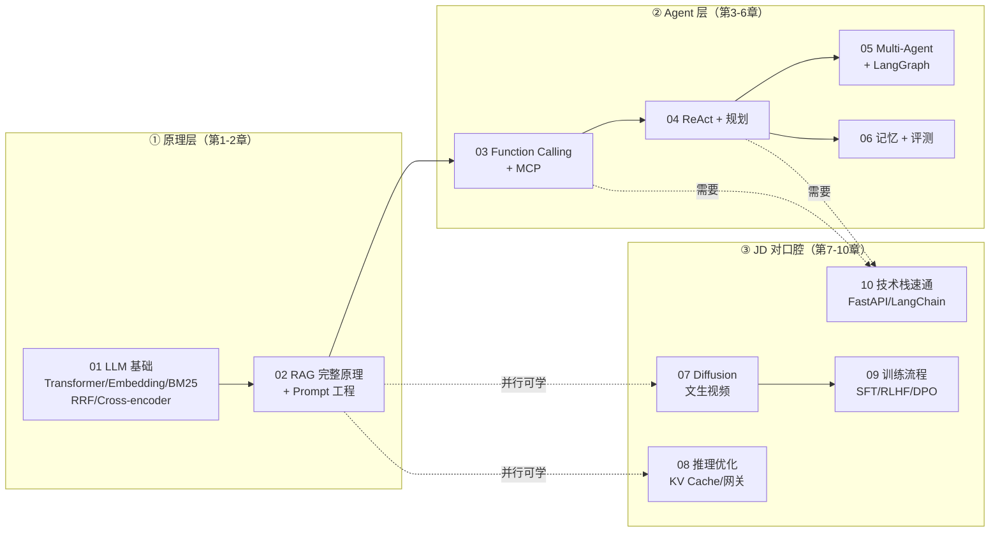

# 导师学习路径：Agent 系统知识提炼与章节安排

> 来源：导师提供的《Agent 学习相关知识》细致版学习路径。本章节系列把原始提纲**提炼为知识点地图**，并**重排为可执行的章节**，每个知识点都展开成面试能讲的内容，配套 mermaid 流程图、面试问答（含参考答案）与自测清单。
> 目标岗位：字节跳动剪映 CapCut「Agent 开发实习生（AI 剪辑）」（职位 ID：A80542，深圳/广州）。核心语言 **Go**，Python 生态只需看得懂、能写最小示例。

## 一、知识地图：导师原始提纲 → 本章节体系

导师提纲有 6 大章 + JD 相关 3 大章，中间还夹杂了一段技术栈速查。我把它重新组织为 **10 个章节 + 1 份总览**，划分依据是「原理依赖顺序」：

| 章节 | 内容 | 对应导师提纲 | 面试权重 |
|------|------|--------------|----------|
| [01-RAG 原理与 LLM 基础](./01-RAG原理与LLM基础) | Transformer/注意力、Embedding、BM25、RRF、Cross/Bi-encoder | 第 1 章 | ★★★★★ 必考 |
| [02-RAG 完整原理与 Prompt 工程](./02-RAG完整原理与Prompt工程) | RAG 全流程、Chunking、Token 预算、RAGAS、五段式 Prompt、CoT、Few-shot | 第 2 章 | ★★★★★ 必考 |
| [03-Function Calling 与 MCP 协议](./03-FunctionCalling与MCP协议) | FC 底层机制、MCP 协议、BinRag MCP Server 亮点 | 第 3 章 | ★★★★☆ |
| [04-ReAct 与 Agent 规划](./04-ReAct与Agent规划) | ReAct 循环、Plan-and-Execute、死循环防护 | 第 4 章 | ★★★★☆ |
| [05-Multi-Agent 编排与 LangGraph](./05-Multi-Agent编排与LangGraph) | 三种编排模式、LangGraph State/Node/Edge/Checkpoint | 第 5 章 | ★★★★☆ |
| [06-Agent 记忆与评测体系](./06-Agent记忆与评测体系) | 四种记忆、短期记忆压缩、长期记忆落地、评测体系 | 第 6 章 | ★★★☆☆ |
| [07-JD 专题：文生视频与 Diffusion](./07-JD专题-文生视频与Diffusion模型) | 扩散模型、CLIP 文本控制、Temporal Attention、VAE/Latent | JD 相关一 | ★★★☆☆ 岗位对口 |
| [08-JD 专题：LLM 推理优化](./08-JD专题-LLM推理优化) | KV Cache、PagedAttention、Continuous Batching、量化、投机解码、推理网关 | JD 相关二 | ★★★★☆ 岗位对口 |
| [09-JD 专题：LLM 训练流程与微调](./09-JD专题-LLM训练流程与微调) | Pre-training→SFT→RLHF→DPO、LoRA、SFT vs RAG、实习话术 | JD 相关三 | ★★★☆☆ |
| [10-AI 应用技术栈速通](./10-AI应用技术栈速通) | FastAPI vs Express、LangChain 核心、Pydantic V2、asyncio | 提纲附带 | ★★☆☆☆ 看懂即可 |

## 二、章节依赖关系（学习顺序）

学习顺序建议：**1 → 2 → 3 → 4 → 5 → 6** 为主线（构成完整的 Agent 知识链）；**7、8、9** 可在第 2 章之后与主线并行推进（JD 对口腔，面试官大概率深挖）；**10** 是工具章，随用随查。

## 三、时间安排（对齐 10 月投递目标）

按「主线 6 天 + JD 专题并行 + 每章半天到一天」排布，7-10 天内可完成第一遍：

| 天数 | 主线任务 | 并行任务（选做） | 交付物 |
|------|----------|------------------|--------|
| Day 1 | 第 1 章：Transformer / Embedding / BM25 / RRF / Cross-encoder | 读 [路线专题/03](../路线专题/03-大模型与Agent核心能力) Day 8-9 | 能对着白板画出 Attention 流程图 |
| Day 2 | 第 2 章（上）：RAG 全流程拆解、Chunking、Token 预算 | 第 7 章：Diffusion 双过程图 | 画 RAG 全链路图 |
| Day 3 | 第 2 章（下）：RAGAS 指标、五段式 Prompt、CoT、Few-shot | 第 8 章：KV Cache 计算量对比 | 写一份自己的五段式 Prompt 模板 |
| Day 4 | 第 3 章：Function Calling + MCP | 第 10 章：FastAPI 最小示例 | 画 FC 6 步流程图 + MCP 架构图 |
| Day 5 | 第 4 章：ReAct + Plan-and-Execute | 第 8 章：推理网关模块清单 | 把 shatangAI 流程改写成 ReAct 示例 |
| Day 6 | 第 5 章：Multi-Agent 三种模式 + LangGraph | 第 9 章：训练链路图 + LoRA 计算 | 画 Supervisor/Reflection 架构图 |
| Day 7 | 第 6 章：四种记忆 + 评测体系 | 第 9 章：SFT vs RAG 决策表 | 为 BinRag 写一份评测集设计 |
| 机动 | 复盘全部「面试问答」，对照 [04-简历项目改造](../路线专题/04-简历项目改造与面试实战) 串 STAR | — | 每个问题能脱稿回答 |

> 时间紧张的话，优先级：**第 1、2、3、4 章必精读**（RAG + Agent 是简历核心），第 5、6 章快速过（理解三种模式 + 记忆分类即可），7-9 章按 JD 关键词挑重点，第 10 章随用随查。

## 四、贯穿始终的三个项目锚点

导师提纲里反复出现两个项目，面试时所有原理都要**挂到项目上讲**：

1. **BinRag**（RAG 文档问答系统）：向量 + BM25 混合检索 → RRF 融合 → Cross-encoder 重排 → LLM 生成；实现了 MCP Server（6 个只读工具）。→ 支撑第 1-3、6 章。
2. **shatangAI**（视频生成项目）：调 DashScope/Seedance 生成短视频，含脚本生成、素材搜索、视频合成、异步任务队列。→ 支撑第 4、5、7、8、10 章。
3. **深圳草莓实习**（大模型微调，LoRA）：→ 支撑第 9 章。

## 五、学习方法建议

1. **先提炼后展开**：每章先看「核心知识点提炼」表，再读「知识点详解」，最后闭卷回答「面试问答」。
2. **画图 > 背字**：面试官要求"画图讲清楚流程"，每章至少 1 张 mermaid 图必须能手绘出来。
3. **自测清单逐条打勾**：打不了勾的条目回到详解部分重读，并在站内搜索补充（右上角搜索框可用）。
4. **联动既有文档**：Go 底层知识见「第一阶段-知识详解」，后端工程见「后端技术栈强化」，30 天冲刺执行路线见「路线专题」。
