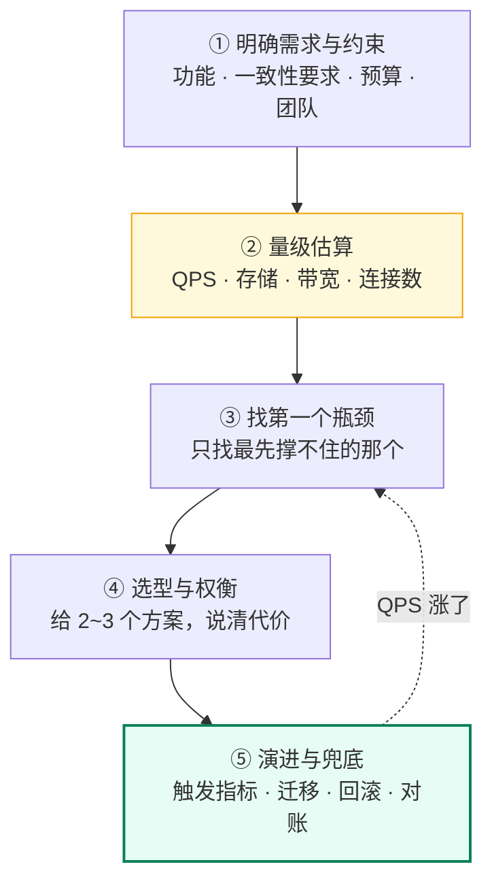
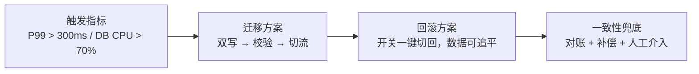
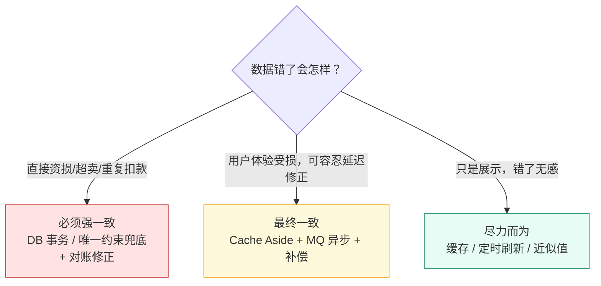

# 00 · 架构师思维与设计方法论

> 属于「架构师修炼」· 方法论第 1 篇 · **先建判断力，再学组件**
> 下一篇：[01 QPS 分级与架构演进地图](./01-QPS分级与架构演进地图)　栏目总览：[架构师修炼](./)

> **这篇解决什么问题**：你知道 Redis 有主从、Kafka 能削峰、MySQL 能分库分表，但拿到一个真实场景（「设计一个 AI 视频生成任务平台」）就不知道从哪开口。**架构师和新手的差别不是知道的组件多少，而是有没有一套稳定的思考顺序**。这一篇给你这套顺序：**五步设计法 + 量级估算公式 + 选型矩阵 + 白板答题模板**。后面 18 篇都在往这套骨架上挂肉。

---

## 一、先立规矩：架构设计的五步法

任何人问你「设计一个 X 系统」，**永远按这五步走，顺序不能乱**：



| 步骤 | 你要产出 | 常见新手错误 |
| --- | --- | --- |
| ① 需求与约束 | 一致性等级、可接受的延迟、可用性目标、团队规模 | 直接开画架构图 |
| ② **量级估算** | **具体数字**：峰值 QPS、日增存储、实例数 | 说「量很大」 |
| ③ 找瓶颈 | 一句话：「当前第一个瓶颈是 XX 的 YY 上限」 | 一次解决所有问题 |
| ④ 选型 | 方案对比矩阵（优点/代价/适用边界） | 「大厂都用这个」 |
| ⑤ 演进与兜底 | 触发阈值 + 迁移步骤 + 回滚 + 一致性兜底 | 只给终态，不给迁移路径 |

> **面试官最看重第 ② 步和第 ⑤ 步**：②证明你会算账，⑤证明你上过线。④只证明你背过八股。

---

## 二、第 ① 步：需求与约束——先问四个问题

不要急着设计。先问清楚，**这是架构师和新手最大的分水岭**：

| 问题 | 为什么必须问 | 答案如何改变设计 |
| --- | --- | --- |
| **数据一致性要求是什么？** | 决定要不要分布式事务、要不要强一致 | 钱/库存 → CP + 对账；点赞数/浏览数 → 最终一致 + 缓存 |
| **可接受的最大延迟？** | 决定同步/异步、缓存层级 | 100ms 内 → 强依赖缓存；秒级 → 可 MQ 异步 |
| **读写比例？** | 决定读写分离与缓存的收益 | 100:1 → 缓存收益巨大；1:1 → 得先解决写 |
| **流量形态：平稳还是尖峰？** | 决定要不要削峰 | 尖峰比均值高 10 倍 → 必须队列削峰 |

**顺势追问（面试加分）**：「这个系统是 To C 还是内部？日活量级？预算是多少台机器？团队几个人维护？」——**问出成本与人力约束，是 A4/A5 级的表现**。

---

## 三、第 ② 步：量级估算——把「很大」变成数字

### 3.1 五个必背公式

```text
① 峰值 QPS   = 日均请求数 / 86400 × 峰值系数（通常取 2~5，秒杀类取 50~100）
② 日增存储   = 日请求数 × 单条数据字节数 × 副本数（含索引膨胀 ×1.5~2）
③ 所需实例数 = 峰值 QPS / 单实例实测 QPS × 安全系数（1.5~2）
④ DB 连接数  = 实例数 × 每实例连接池上限（必须 < DB max_connections / 预留 30%）
⑤ 缓存内存   = 热点数据条数 × 单条大小 × 冗余系数（1.5~2，含 Redis 自身开销）
```

### 3.2 一组你要记住的数量级（背下来，面试直接引用）

| 组件/操作 | 数量级 | 说明 |
| --- | --- | --- |
| 单机内存随机读 | **100 ns** | 基准 |
| 同机房网络 RTT | **0.1~0.5 ms** | 决定「一次 RPC 值不值得」 |
| SSD 随机读 | **0.1 ms** | 比内存慢 1000 倍 |
| MySQL 单机简单查询 | **1k~5k QPS** | 主键/索引点查，8C16G |
| MySQL 单机写入（事务） | **500~2k TPS** | 每事务一次 fsync 的话更低 |
| Redis 单机读 | **8w~10w QPS** | 单线程，受网络往返限制 |
| Redis 单机写 | **5w~8w QPS** | 有 AOF everysec 时下降 |
| Kafka 单分区 | **几万~十几万 msg/s** | 顺序写 + 零拷贝 |
| Kafka 单机（多分区） | **50w+ msg/s** | 受网卡/磁盘限制 |
| Go 单实例（简单 HTTP） | **3w~10w QPS** | 取决于业务逻辑与下游 |
| Nginx/网关单机 | **5w~20w QPS** | 纯转发 |
| 单 MySQL 库表 | **千万级**行较舒适 | 亿级必须分片或归档 |
| 单 MySQL 实例 | **1~2 TB** | 超过后备份/DDL 都是灾难 |

> ⚠️ 这些是**量级**，不是承诺。面试里说「MySQL 单机大概几千 QPS，具体取决于索引和事务大小」比背死数字更专业。

### 3.3 完整算例（AI 剪辑任务平台，后面 [15 篇](./15-案例-AI剪辑任务平台架构)会用到）

**已知**：日活 100 万；人均每天 3 次「一键成片」任务；每次任务产生 1 条任务记录（2 KB）+ 1 个视频结果（100 MB 存对象存储）；读任务列表人均 10 次/天。

```text
① 写峰值 QPS = 100w × 3 / 86400 × 3(峰值系数) ≈ 104  QPS
   读峰值 QPS = 100w × 10 / 86400 × 3        ≈ 347  QPS
   → 结论：任务元数据读写才几百 QPS，MySQL 单机完全够，不需要分库分表！

② 视频推送事件（进度回调）：每任务约 20 次状态回调 → 104 × 20 ≈ 2,000 QPS
   → 结论：回调是真正的高频写，需要 Kafka 削峰 + 合并写

③ 日增视频存储 = 300w × 100 MB ≈ 300 TB/天   ← 真正的瓶颈！
   → 结论：视频必须走对象存储 + CDN，绝不能进 DB；成本控制是第一优先级

④ GPU 推理：单卡生成 1 条 30s 视频约 60s → 需要 300w × 60s / 86400s ≈ 2,083 卡·天（= 5 万卡时/天）
   → 结论：GPU 是最贵资源，架构核心是「排队 + 调度 + 优先级 + 失败重试」
```

**这个算例的教学价值**：估算出来后你会发现，**这个系统真正的瓶颈不是「QPS 高」，而是「存储成本和 GPU 排队」**——新手会去设计分库分表和多级缓存，架构师会去设计**任务队列 + 配额 + 冷热分层 + CDN**。**估算的意义就是把你从"套路"里拽出来，看到真实的瓶颈。**

---

## 四、第 ③ 步：找瓶颈——一张自检清单

按顺序问自己，**第一个答案为"是"的地方就是当前瓶颈**，只解决它：

| 顺序 | 自检问题 | 是 → 瓶颈在哪 | 手段 |
| --- | --- | --- | --- |
| 1 | 有单点吗？（单实例、单库、单机房） | 可用性瓶颈 | 冗余 + 故障转移（[03](./03-MySQL主从与读写分离落地)/[04](./04-Redis高可用与缓存体系落地)） |
| 2 | 单机 CPU/内存/连接数到顶了吗？ | 计算瓶颈 | 加实例（先无状态化）+ Go 侧优化（[02](./02-单体架构的极限与分层)） |
| 3 | 数据库是瓶颈吗？读多还是写多？ | 读 → 缓存/读写分离；写 → 削峰/分片 | [03](./03-MySQL主从与读写分离落地)/[05](./05-Kafka削峰与可靠投递落地)/[06](./06-分库分表与在线迁移双写) |
| 4 | 有热点吗？（单个 key / 单个大 V） | 分片不均 | 热点打散 + 本地缓存（[12](./12-限流熔断降级与背压)） |
| 5 | 依赖的第三方/下游扛得住吗？ | 级联故障 | 限流熔断隔离（[12](./12-限流熔断降级与背压)） |
| 6 | 数据量到单机上限了吗？ | 容量瓶颈 | 归档 → 分片（[06](./06-分库分表与在线迁移双写)） |

> **一句话结论**：**一次只解决一个瓶颈**。同时上五个组件 = 五种新的故障源 = 稳定性下降。

---

## 五、第 ④ 步：选型——方案对比矩阵（这是架构师的核心动作）

任何一个决策，都用这张表输出。**没有"最优方案"，只有"当前约束下的最优"**。

### 5.1 决策矩阵模板

| 维度 | 方案 A | 方案 B | 方案 C |
| --- | --- | --- | --- |
| 一致性强度 | ? | ? | ? |
| 峰值承载 | ? | ? | ? |
| 延迟（P99） | ? | ? | ? |
| **复杂度/运维成本** | ? | ? | ? |
| **故障时的行为** | ? | ? | ? |
| 数据可靠性（丢多少） | ? | ? | ? |
| 适用边界 | ? | ? | ? |

### 5.2 范例：库存扣减的三种方案（真实面试高频）

| 维度 | A 纯 DB 乐观锁 | B Redis Lua 预扣 + MQ 落库 | C 分片库存（Redis 分片 + DB 兜底） |
| --- | --- | --- | --- |
| 一致性 | **强**（DB 事务） | 最终一致（预扣与落库有窗口） | 最终一致 |
| 承载 | ~1k TPS | **10w+ QPS** | **100w+ QPS** |
| P99 延迟 | 5~20 ms | 1~3 ms | 1~3 ms |
| 复杂度 | 低 | 中（要处理丢消息、对账） | 高（分片不均、聚合库存） |
| 故障行为 | DB 挂 → 不可用 | Redis 挂 → 降级走 A；MQ 挂 → 本地消息表 | Redis 挂 → 降级走 B |
| 丢数据窗口 | 无 | 「已扣未落库」窗口，靠对账收敛 | 同 B，另加「分片不均」问题 |
| **适用边界** | < 1k TPS 的活动 | 日常大促（1w~10w） | 秒杀级（>10w） |

**怎么讲这段**（这段本身就是 A4 级的答法）：
> 「如果这个活动日常只有几百 TPS，我直接上 DB 乐观锁，简单可靠；只有峰值确认会到几万以上，Redis 预扣的复杂度才划算。**复杂度是成本，不是能力**。」

---

## 六、第 ⑤ 步：演进与兜底——最容易被忽略、也最能加分

### 6.1 演进路线必须带四件套



| 要素 | 必须说清 | 例 |
| --- | --- | --- |
| **触发指标** | 不看感觉，看监控数字 | 「主从延迟 > 3s 持续 5 分钟」 |
| **迁移方案** | 不停机、可灰度、可回滚 | 「双写 7 天 → 数据校验一致 → 读切新库 1% → 100%」 |
| **回滚方案** | 出问题 5 分钟内切回 | 「切流走配置中心，秒级生效」 |
| **一致性兜底** | 迁移期不一致怎么办 | 「定时对账任务比对双库差异，自动补偿」 |

### 6.2 一致性决策树（面试常问「这里要不要强一致」）



> **关键认知**：**绝大多数业务不需要强一致**。而"要不要强一致"的答案不来自技术，来自业务——**先问「错了会损失什么」，再决定技术方案**。

---

## 七、故障与一致性边界（任何方案都必须能回答的三个问题）

上面所有步骤做完，**还差最后一层：这套架构里每一个组件挂了会怎样**。面试官几乎必问，而这一层也是 A5 与 A4 的分界线。任何方案，逐个组件问三个问题：

| 三问 | 你要给出的答案形式 | 不合格的回答 |
| --- | --- | --- |
| ① **挂了这个组件，现象是什么？** | 哪些接口失败/变慢、用户看到什么 | 「会有影响」 |
| ② **丢什么数据？窗口多长？** | 精确到「已返回成功但未同步的写」，窗口 = 主从延迟 | 「不会丢吧」/「有副本就不丢」 |
| ③ **怎么恢复、怎么发现不一致？** | 降级路径 + 重试/补偿 + **对账任务** + 人工介入阈值 | 「重启就好」 |

**一张通用兜底表（把它套到你的任一方案上）**：

| 组件 | 常见故障 | 降级动作 | 数据影响 | 兜底手段 |
| --- | --- | --- | --- | --- |
| 应用实例 | 崩溃 / 发布 / OOM | 负载均衡摘除，流量转其他实例 | 进行中请求丢失 → 需**幂等重试** | 优雅下线 + 健康检查 + 幂等 |
| 缓存（Redis） | 宕机 / 主从切换 / 雪崩 | 限流后回源 DB（**必须先限流，否则打挂 DB**） | 未同步的写丢失；缓存值不一致 | 对账回补 + TTL 兜底 + 本地缓存 |
| 数据库主库 | 宕机 / 切换 | 半同步切换，写短暂失败 → 客户端重试 | 异步复制下丢未同步事务（[03 篇](./03-MySQL主从与读写分离落地) 可用实验量化） | 半同步 + 唯一约束 + 对账 |
| 数据库从库 | 宕机 / 延迟 | 读流量回主库或另一从库 | 读到旧数据 | 延迟监控 + 业务侧「读主窗口」 |
| 消息队列 | 积压 / broker 故障 | 削峰能力下降 → 排队时长上升，必要时拒绝新请求 | 未 ack 消息会**重复**（通常不是丢失） | 幂等消费 + 死信 + 积压告警 |
| 协调服务（etcd） | 失去多数派 | 选主与配置下发冻结，依赖功能降级 | 元数据不可写（业务数据本就不该放这里） | fencing token 防双写 + 本地缓存配置 |
| 第三方 / 下游 | 超时、不可用 | 限流 + 熔断 + 降级兜底结果 | 降级期间结果不准确 | 恢复后补偿 / 对账 |

> **一句话结论**：**架构设计的最后一步不是画完图，而是把每个组件"弄挂一遍"，说清现象、数据影响和兜底。** 这也是 [18 实验手册](./18-实验手册-Go落地实验)存在的唯一理由。

---

## 八、白板答题模板（背下来，实战见 [17 篇](./17-面试-白板架构设计与追问链)）

面试官：「设计一个 XX 系统」。**按这个顺序讲，永远不慌**：

```text
0) 澄清（30s）  「我先确认几个点：一致性要求？日活量级？读写比？预算？」
1) 估算（60s）  「按日活 X 算，峰值读写各 Y QPS，日增存储 Z，所以第一个瓶颈是 W」
2) 骨架（90s）  「客户端 → 接入层 → 服务层 → 缓存 → 存储 → 异步队列」，画出来
3) 数据（60s）  「核心表设计 + 分片/索引策略 + 缓存策略 + 一致性方案」
4) 演进（60s）  「现在是第 N 坎的架构；QPS 涨十倍我会做 A、B、C，触发指标是 D」
5) 兜底（60s）  「Redis 挂 → 降级走 DB；MQ 挂 → 本地消息表；DB 主挂 → 半同步切换，丢数据窗口为 0」
6) 收尾（30s）  「这套方案的代价是运维复杂度上升，收益是能扛 10 倍流量，取舍在于…」
```

**三个加分句式**（背下来直接用）：

- 「**这里我选择最终一致，因为**这个数据错了只是展示不准，不影响资金，用强一致要付出的延迟和复杂度不划算。」
- 「**这个方案会引入新的故障点**：多了一个 MQ，如果 MQ 挂了我需要 XX 兜底。」
- 「**先不急着上 XX**，现在这个量级单机能扛，等 P99 超过 300ms 再演进，**提前上就是拿复杂度换虚荣心**。」

---

## 九、反面清单：这些回答会被扣分

| 反例 | 为什么扣分 | 改成 |
| --- | --- | --- |
| 「用微服务 + 分库分表 + 多活」 | 没有量级依据，过度设计 | 先算量，说何时才需要 |
| 「用 Redis 保证一致性」 | Redis 主从异步，会丢写 | 说清 Redis 是加速层，DB 是事实源 |
| 「消息队列保证不丢」 | MQ 本身也会丢（acks/ISR） | 讲 acks=all + 幂等消费 + 对账 |
| 「加机器就行」 | 没定位瓶颈，DB 会先挂 | 先找瓶颈再加机器 |
| 「分布式锁用 Redlock」 | 没说清 Redlock 的争议与 fencing | 讲 Lease + fencing token（[10 篇](./10-etcd与Raft选主租约落地)） |
| 只画终态 | 不会迁移 = 没落过地 | 补演进路径 + 回滚 |

---

## 十、面试追问链（自测）

1. **「你怎么决定要不要上缓存？」**
   → 看读多写少 + 热点集中度。QPS < 1k 时 DB 够用，缓存只增加不一致风险；读 QPS 上万或 P99 超标才上，且要接受「缓存与 DB 最终一致」的窗口（[08](./08-缓存与DB一致性落地)）。

2. **「你说要削峰，为什么是 MQ 不是线程池？」**
   → 线程池只是把请求堆在进程内，进程重启就丢，且无背压；MQ 能持久化、能跨机、能按消费能力回压。线程池适合"短时抖动"，MQ 适合"数量级差异"。

3. **「QPS 翻十倍，你的架构哪一步先崩？」**
   → 先给数字（当前瓶颈是 X 的 Y 上限），再说崩的原因（如单库写入 2k TPS），最后给演进路径与触发指标。

4. **「一致性、可用性、延迟，你选哪两个？」**
   → 拒绝三选二式回答：「按数据分级——资金类选 C（一致性优先，牺牲延迟与部分可用性），展示类选 A（可用性与延迟优先，靠对账收敛）」。这就是 [01 篇](./01-QPS分级与架构演进地图)的**数据分级**思想。

5. **「你的方案有什么代价？」**
   → **每篇都必须能答**：多一个组件 = 多一个故障点 + 多一份运维人力 + 一致性链路变长。

## 十一、自测清单

- [ ] 能在 5 分钟内对一个新场景给出峰值 QPS / 存储 / 实例数的估算
- [ ] 能说出 5 个必背估算公式，且知道峰值系数怎么取
- [ ] 能按「找瓶颈清单」6 问定位第一个瓶颈
- [ ] 任何选型都能用对比矩阵输出，且能说出"什么时候不用它"
- [ ] 演进方案一定带：触发指标 + 迁移 + 回滚 + 对账
- [ ] 能背出白板 6 步答题模板，并至少用过 1 次完整讲完

> **下一篇**：[01 QPS 分级与架构演进地图](./01-QPS分级与架构演进地图) —— 把「量级」变成一张可对照的架构选型总表。
