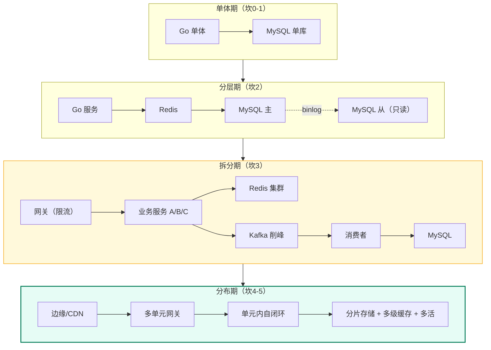
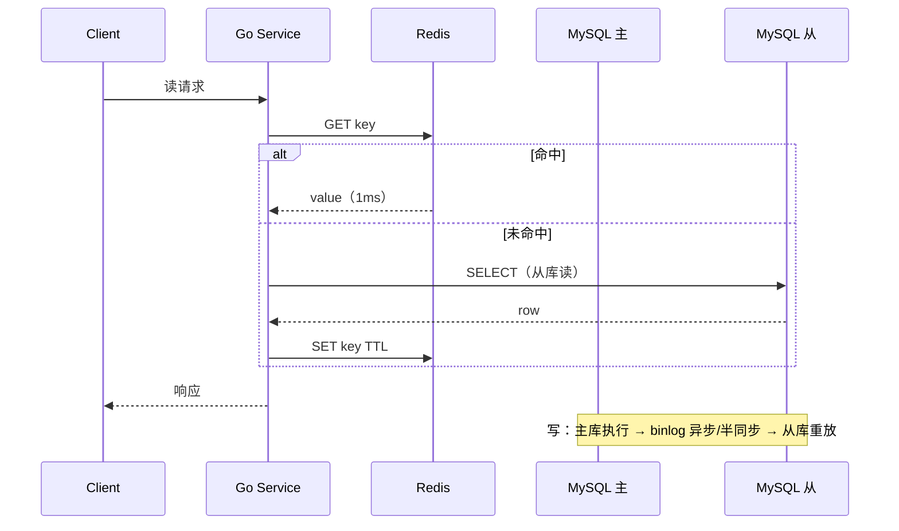

# 01 · QPS 分级与架构演进地图

> 属于「架构师修炼」· 方法论第 2 篇 · **本栏目所有篇章的骨架**
> 上一篇：[00 架构师思维与设计方法论](./00-架构师思维与设计方法论)　下一篇：[02 单体架构的极限与分层](./02-单体架构的极限与分层)

> **这篇解决什么问题**：面试里最值钱的能力是「**同样的业务，我知道 1 万 QPS 和 100 万 QPS 该用完全不同的架构，而且我能说清为什么在第 N 坎才引入某个组件**」。这一篇把 QPS 分成 6 档（六道坎），给出**每一档的量化特征、瓶颈、架构形态、技术选型、代价与触发指标**，并给一张「同一件事在六个量级下的做法」对照表——这张表背下来，架构题你就有了坐标系。

---

## 一、为什么必须按 QPS 分档

因为**架构的复杂度是被 QPS 逼出来的，不是被品味选出来的**：

| 事实 | 说明 |
| --- | --- |
| **同一种业务，量级不同 = 架构不同** | 点赞功能在 100 QPS 是 `UPDATE ... SET cnt=cnt+1`，在 10 万 QPS 是「Redis 计数 + MQ 落库 + 定时对齐」 |
| **提前引入 = 负收益** | 在 100 QPS 上分库分表，会把开发效率砍半，故障率翻倍，而收益是 0 |
| **滞后引入 = 事故** | 在 10 万 QPS 上还单库直连，DB 会在大促时被打挂 |
| **判断"该不该引入"靠指标** | DB CPU > 70%、P99 > 300ms、主从延迟 > 3s、连接池等待 > 10ms |

> **一句话**：**架构是演进的，不是设计的**。面试里能讲出"演进路径 + 触发指标"，比讲出终态架构值钱得多。

---

## 二、六道坎总览

| 坎 | 量级（峰值 QPS） | 典型业务阶段 | 第一个撑不住的 | 架构形态 | 团队/运维 |
| --- | --- | --- | --- | --- | --- |
| **坎 0** | < 100 | 内部工具、MVP、刚上线 | 没人用 | 单体 + 单库 + 单实例 | 1 人，无运维 |
| **坎 1** | ~1,000 | 种子用户、单校/单区 | 单机 CPU/GC/连接数 | 分层单体 + 连接池 + 本地缓存 + 静态化 | 2~3 人，手工发布 |
| **坎 2** | ~10,000 | 产品跑通、日活十万 | **MySQL 读** | Redis 缓存 + MySQL 主从读写分离 | 5 人，有监控告警 |
| **坎 3** | ~100,000 | 增长期、日活百万 | **MySQL 写 + 热点 + 第三方** | 服务拆分 + 主从 + MQ 削峰 + 缓存分片 + 限流熔断 | 10+ 人，有 SRE 意识 |
| **坎 4** | ~1,000,000 | 头部产品、大促 | 单库容量 + 单机房上限 | 分库分表 + 多级缓存 + 单元化 + 全异步 | 数十人，专职中间件 |
| **坎 5** | ~10,000,000 | 国民级、全球产品 | 全局热点 + 跨地域延迟 | 边缘缓存/CDN + 多活 + 读写模型反转 + 预计算 | 百人级，平台化 |

---

## 三、每一坎的展开（量化特征 + 该做什么/不该做什么）

### 坎 0：< 100 QPS —— 先把业务跑通

| 维度 | 做法 |
| --- | --- |
| 架构 | 单体 Go 服务 + 单 MySQL + 单 Redis（可选） |
| 关键决策 | **不要引入任何中间件**；用索引和 SQL 解决问题 |
| 该做 | 表结构设计正确、索引正确、有日志、有备份 |
| **不该做** | ❌ 微服务 ❌ 分库分表 ❌ 多级缓存 ❌ K8s（除非团队已有） |
| 瓶颈 | 无技术瓶颈；瓶颈是**业务没跑通** |

### 坎 1：~1,000 QPS —— 单机的四个天花板

| 天花板 | 量化 | 手段 |
| --- | --- | --- |
| **CPU** | Go 单实例简单逻辑 3w~10w QPS；带 DB 访问降到 1k 级 | 减少序列化/拷贝、复用对象池、pprof 定位热点 |
| **连接数** | `ulimit -n`、DB `max_connections`（默认 151） | 连接池（`SetMaxOpenConns`）+ 复用 HTTP 长连接 |
| **GC** | GOGC 默认 100，堆增长快 → STW 抖动 → P99 飙升 | 减少堆分配、调 GOGC/GOMEMLIMIT、看 `GODEBUG=gctrace=1` |
| **锁竞争** | 全局 mutex、单 key map 写 | 分片锁、sync.Map、atomic、减少临界区 |

| 该做 | 不该做 |
| --- | --- |
| 垂直分层（handler/service/repo）+ 依赖注入；本地缓存（进程内 LRU，TTL 1~10s）；静态资源 CDN；连接池参数调优 | ❌ 拆微服务 ❌ 引入 MQ ❌ 多级缓存 |

> **判断信号**：`ab`/`wrk` 压测下单实例 QPS 到顶、CPU 打满但下游 DB 很闲 → 计算瓶颈，先优化代码再考虑加机器。细节见 [02 篇](./02-单体架构的极限与分层)。

### 坎 2：~10,000 QPS —— 读成为瓶颈

**特征**：读 QPS 上万，MySQL 单机 CPU 打到 70%+，慢查询开始出现，热门接口 P99 从 20ms 涨到 200ms。

| 手段 | 关键参数/决策 | 代价 |
| --- | --- | --- |
| Redis 缓存（Cache Aside） | 缓存 TTL 兜底、空值缓存防穿透、随机 TTL 防雪崩 | 引入**不一致窗口**（[08 篇](./08-缓存与DB一致性落地)） |
| MySQL 主从读写分离 | 主写从读；半同步 `rpl_semi_sync_master_enabled=1`；并行复制 `slave_parallel_workers` | **主从延迟** → 写后立即读会读到旧数据（[03 篇](./03-MySQL主从与读写分离落地)） |
| 慢查询治理 | 慢查询日志 + EXPLAIN + 覆盖索引 | 需要 DDL，注意 Online DDL 与锁 |
| 热点隔离 | 把大表/大查询拆到独立实例 | 运维复杂度 |

**为什么这一步必须先做缓存再做读写分离？** 缓存削掉 80% 的读，读分离才解决剩下的 20%；顺序反了会造出一堆读从库的延迟问题却收益有限。

### 坎 3：~100,000 QPS —— 写成为瓶颈 + 热点 + 依赖治理

**特征**：三大症状同时出现——① 单库写入到顶（InnoDB 单实例 ~2k~5k TPS，含 fsync 更低）；② 出现热点（爆款内容/大 V/单 key）；③ 第三方依赖（支付、模型推理）超时引发级联雪崩。

| 手段 | 关键决策 | 触发指标 |
| --- | --- | --- |
| **MQ 削峰** | Kafka 分区数、`acks=all`+`min.insync.replicas=2`、消费幂等 | 写峰值 > DB 承载的 3 倍 |
| **服务拆分** | 按业务边界拆（用户/内容/订单/通知），先拆读多写少的 | 单体构建/发布成为瓶颈，多人改同一服务冲突 |
| **缓存分片** | Redis Cluster 16384 slot；热点 key 加随机后缀打散 | 单 key QPS > 5w |
| **限流熔断** | 网关层令牌桶 + 服务层自适应限流（BBR）+ 熔断器 | 依赖 P99 抖动 > 3 倍 |
| **异步化** | 非核心链路全部异步（发通知、写日志、统计） | 用户主链路 RT 被非核心拖累 |

> **这一坎的核心心法**：**把"同步的、强依赖的、实时的"东西砍到最少**。凡是"不做也不影响用户拿到结果"的事情，全部异步。

### 坎 4：~1,000,000 QPS —— 单机上限与单机房上限

| 瓶颈 | 手段 | 代价 |
| --- | --- | --- |
| 单库数据量（>1~2 TB） | 分库分表（水平拆分），分片键选「查询必带、分布均匀」的（user_id 通常优于 order_id） | 跨片 JOIN/事务/分页全部变难；需要全局 ID |
| 单表行数（> 亿） | 分表 + 归档（冷热分离） | 运维与迁移复杂 |
| 缓存带宽/单集群 | 多级缓存（本地 L1 + Redis L2）、读写分离从库、Redis Cluster 扩分片 | 本地缓存一致性要靠广播失效 |
| 单机房容量/网络 | 单元化（Set 化）：一个单元内自闭环，用户按 ID 路由到固定单元 | 数据同步跨单元，冲突处理 |
| 同步链路太长 | 全异步、Batch 合并写、CQRS 读写模型分离 | 最终一致、复杂度高 |

**关键量化**：**一次同步调用的预算只有 ~100ms**。串行 5 个下游 × 各 30ms = 150ms，已超预算 → 必须并行（`errgroup`）或异步。

### 坎 5：~10,000,000 QPS —— 全局热点与物理定律

| 手段 | 说明 |
| --- | --- |
| **边缘缓存 + CDN** | 把 90%+ 的读流量在离用户最近的地方消化掉，不打回源 |
| **读写模型反转** | Feed 从「拉」改「推」（写扩散）或混合（大 V 推拉结合），把读成本前置到写 |
| **预计算** | 排行榜/计数/推荐结果定时或触发式预计算，读路径只做 O(1) 取 |
| **多活 + 就近接入** | DNS/GSLB 路由到最近机房；异地多活解决"机房级"故障与延迟 |
| **去中心化热点** | 极热数据本地化 + 请求合并（singleflight） |

> **物理定律兜底**：跨地域光速延迟（北京↔上海 RTT ~30ms，跨太平洋 ~150ms）**无法优化掉，只能靠就近部署和异步复制**。这一条是坎 5 与前面所有坎的本质区别。

---

## 四、核心对照表：同一件事在六个量级下的做法

> **这张表是本栏目最值得背下来的一页**。面试里被问「你这个方案为什么这样做」，用横向对比回答最有说服力。

| 关注点 | 坎 1（1k） | 坎 2（1w） | 坎 3（10w） | 坎 4（100w） | 坎 5（1000w） |
| --- | --- | --- | --- | --- | --- |
| **缓存** | 进程内 LRU（TTL 10s） | 单机 Redis，Cache Aside | Redis Cluster + 热点打散 | L1 本地 + L2 Redis 多级 | CDN 边缘 + 多级 + 请求合并 |
| **数据库** | 单库单表 | 主从读写分离 + 索引优化 | 主从 + 归档 + 慢查询治理 | 分库分表 + 冷热分离 | 单元化多活 + 分片 + 全局表 |
| **一致性** | DB 事务即可 | 缓存最终一致（TTL 兜底） | 缓存 + MQ 最终一致 + 对账 | 分片内事务 + 跨片 Saga + 对账 | 多活冲突合并（LWW/CRDT）+ 单元自闭环 |
| **消息队列** | 不用 | 非核心异步（发通知） | 削峰 + 解耦 + 顺序写入 | 全异步 + 分区扩展 + 端到端幂等 | 多机房 MQ + 跨单元同步 |
| **分布式锁** | 不用（单机 mutex） | SET NX EX（防重复） | Redis 锁 + fencing token | etcd Lease + 选主 + 分片锁 | 单元内选主 + 全局元数据强一致 |
| **限流** | 不做 | 单机令牌桶 | 网关全局限流 + 服务自适应 | 多级限流 + 用户级配额 | 全球调度 + 边缘限流 + 优先级队列 |
| **文件/媒体** | 服务器本地盘 | 对象存储（S3/OSS） | 对象存储 + CDN + 分片上传 | 多区域对象存储 + 生命周期分层 | 边缘转码 + 就近分发 |
| **部署** | 单机 systemd/docker | 多实例 + Nginx | 容器 + K8s + HPA | 多集群 + 单元化发布 | 多活流量调度 + 灰度/蓝绿 |
| **监控** | 日志 | 指标 + 告警（Prometheus） | 全链路 Trace + SLO | 容量水位 + 依赖拓扑 | 全局可观测 + 自动降级 |
| **发布** | 停机发布 | 滚动重启 | 优雅上下线（预热/摘流） | 灰度 + 单元化发布 | 全链路灰度 + 流量染色 |
| **成本关注** | 人力 | 机器数 | DB/缓存规格 | 存储与出口带宽 | GPU/带宽/电力 |

---

## 五、成本表：每一次演进都要付账（面试官喜欢这个意识）

| 坎 | 新增成本 | 量化示意（仅供参考） |
| --- | --- | --- |
| 坎 2 | +2 台 Redis、+2 台从库 | 机器成本 ×1.5，一致性复杂度 ↑ |
| 坎 3 | +Kafka 集群、+ 服务拆分人力 | 机器成本 ×2~3，**故障点 ×2**，排障时间 ↑ |
| 坎 4 | 分库分表中间件/分片、多级缓存、单元化 | 机器 ×3~5，**跨片查询与事务开发成本显著上升** |
| 坎 5 | 多活机房、CDN 流量、全球部署 | 成本 ×5~10，跨机房一致性成为新难题 |

> **一句话**：「这套架构能扛 100 倍流量，代价是运维复杂度和人力投入。如果业务量还没到，我会先用更简单的方案，把复杂度延后。」

---

## 六、如何判断"我现在在哪一坎"（真实监控指标）

| 信号 | 阈值（经验值） | 含义 | 下一步 |
| --- | --- | --- | --- |
| 应用 P99 | **> 300 ms** | 要么下游慢，要么自身热点 | 先 Trace 定位（[13 篇](./13-容量规划压测与故障演练)） |
| DB CPU | **> 70% 持续 5 min** | 读/写压力到顶 | 上缓存/读写分离，再考虑分片 |
| DB 活跃连接 | **> max_connections × 70%** | 连接池泄漏或慢查询堆积 | 查慢查询 + 调池 + 限流 |
| 主从延迟 | **> 1 s（告警）/ > 10 s（事故）** | 从库跟不上或大事务 | 并行复制 + 拆大事务（[03 篇](./03-MySQL主从与读写分离落地)） |
| Redis 单 key QPS | **> 5 w** | 热点 key | 打散 + 本地缓存（[04 篇](./04-Redis高可用与缓存体系落地)） |
| 单表行数 | **> 5000 w** | 索引深度与 DDL 风险 | 归档 → 分区 → 分片（[06 篇](./06-分库分表与在线迁移双写)） |
| Kafka 消费延迟 | **> 1 min 持续** | 消费能力不足 | 扩分区/加消费者（[05 篇](./05-Kafka削峰与可靠投递落地)） |
| 磁盘/存储用量 | **> 70%** | 容量风险 | 冷热分层 + 扩容量 |
| 单实例内存 | 接近 **GOMEMLIMIT** | OOM 风险 | 扩容 + 减少分配 |

> **练习**：把这张表抄进你的项目 README，给自己系统的每个指标填上当前值——**你就有了"我为什么这样设计"的第一手论据**，面试时说出来极有说服力。

---

## 七、数据分级：不同数据走不同的一致性档位（贯穿全栏目）

同一个系统里，不同数据的架构待遇完全不同。**先分级，再设计**：

| 级别 | 数据 | 一致性要求 | 存储选型 | 可容忍丢失 |
| --- | --- | --- | --- | --- |
| **P0 资金级** | 余额、订单金额、支付流水 | 强一致 + 对账 | MySQL 事务 + 唯一约束 + 半同步 | **0** |
| **P1 关键业务** | 库存、优惠券、任务状态 | 强/最终一致 + 补偿 | DB 兜底 + Redis 预占 + MQ | 短暂不一致可容忍 |
| **P2 用户可见** | 帖子、评论、粉丝数 | 最终一致（秒级） | 缓存 + 异步落库 | 秒级延迟可接受 |
| **P3 展示统计** | 播放量、点赞数、热榜 | 最终一致（分钟级） | Redis 计数 + 定时对齐 | 分钟级可接受 |
| **P4 分析类** | 埋点、日志、AB 指标 | 尽力而为 | Kafka + 数仓 | 可以丢少量 |

> **这张表是本栏目所有一致性篇章的共同前提**。下次面试被问「缓存一致性怎么保证」，先答：**「看数据级别——P0 不走缓存或极短 TTL，P2/P3 用 Cache Aside + 失效 + 对账兜底」**，立刻和背八股的人拉开差距。

---

## 八、故障与一致性边界：**每引入一个组件，就多欠一笔"兜底债"**

演进不是纯收益——**坎 2 之后每加一个组件，系统就多一个故障点、多一个一致性缺口**。用这张表和 [00 篇](./00-架构师思维与设计方法论)的三问对齐，就得到全栏目的兜底总纲：

| 坎 | 新引入的组件 | 它的故障会怎样 | 一致性缺口 | 兜底手段 | 详解 |
| --- | --- | --- | --- | --- | --- |
| 1 | 多实例 + 连接池 | 实例挂 → 请求失败 | 进行中请求丢失 | 优雅下线 + 幂等重试 | [02](./02-单体架构的极限与分层) |
| 2 | MySQL 从库 | 从库延迟/挂 → 读到旧数据 | 写后读不一致 | 读主窗口 + 位点等待 | [03](./03-MySQL主从与读写分离落地) |
| 2 | Redis 缓存 | 主从切换丢写；全挂 → 回源打挂 DB | 缓存与 DB 不一致 | 限流回源 + TTL + 对账 | [04](./04-Redis高可用与缓存体系落地)·[08](./08-缓存与DB一致性落地) |
| 3 | Kafka | 积压/ISR 收缩；消费重复 | 业务最终一致窗口 | acks=all + 幂等消费 + 死信 | [05](./05-Kafka削峰与可靠投递落地)·[11](./11-幂等去重与ExactlyOnce) |
| 3 | 服务拆分 | 跨服务调用失败、级联超时 | 跨服务无本地事务 | TCC/Saga/本地消息表 + 对账 | [09](./09-分布式事务与最终一致落地) |
| 4 | 分库分表 | 跨片查询/事务退化 | 跨片无原子性 | 分片内事务 + 跨片补偿 | [06](./06-分库分表与在线迁移双写) |
| 4 | 选主/协调（etcd） | 失去多数派；旧主假死 | **双写导致数据错乱** | Lease + **fencing token** | [10](./10-etcd与Raft选主租约落地) |
| 5 | 多活/多机房 | 专线抖动、双向复制冲突 | 跨地域数据冲突 | 单元化就近写 + LWW/CRDT | [07](./07-多活容灾与全球化架构) |

> **怎么用这张表**：面试里每当你提出一个新组件，**主动补一句它的故障行为与兜底**——「我这里是加 Redis，但它的风险是主从异步会丢写，所以库存这类数据我只把它当预占，DB 唯一约束兜底，再加 TTL 与对账」。这一句话的含金量，胜过后面讲十分钟 Redis 原理。

---

## 九、面试追问链

1. **「你怎么判断系统该演进？」**
   → 给指标不给感觉：DB CPU > 70%、P99 > 300ms、主从延迟 > 1s、单 key > 5w QPS 都是触发信号（见第六节表），并且每次演进只解决一个瓶颈。

2. **「1 万 QPS 和 100 万 QPS 的架构，本质区别是什么？」**
   → 前者瓶颈在**读**（缓存 + 读写分离解决，数据仍是单一事实源）；后者瓶颈在**单机容量与单机房上限**（必须分片 + 单元化，数据被物理拆分，一致性从"事务"退化为"补偿 + 对账"）。**本质是从"一个库"变成"一群库"。**

3. **「听说 100 万 QPS 要上分库分表，为什么不是直接上？」**
   → 成本：跨片事务/JOIN/分页全部退化，全局 ID、迁移、运维都要额外投入。分片是**最后手段**，优先级低于：缓存 → 读写分离 → 归档 → 冷热分离 → 垂直拆表 → 最后水平分片。

4. **「流量涨了 10 倍但预算不变怎么办？」**
   → 先削：把非核心链路异步化、降级、合并请求；再省：热点本地化、减少跨机房流量、提高单机效率（这只是"用算法换机器"）；最后才扩。**架构师先优化流量结构，再买机器。**

5. **「多活和主从的区别？」**
   → 主从是**同一份数据的副本**，解决单机故障；多活是**多地都能独立提供服务**，解决机房级故障 + 地域延迟，代价是数据冲突与一致性模型变复杂（[07 篇](./07-多活容灾与全球化架构)）。

## 十、自测清单

- [ ] 能默写六道坎的量级、瓶颈与架构形态
- [ ] 能对「缓存/DB/消息/锁/限流/部署」六个关注点，说出 1w 与 100w QPS 的做法差异
- [ ] 记得 9 个触发指标阈值，能解释每个阈值背后的原因
- [ ] 能说出 P0~P4 数据分级，并给每级选一致性方案
- [ ] 能回答「为什么不是直接上分库分表」并给出演进优先级
- [ ] 能把第六节表格套到自己的项目上，填出当前水位

> **下一篇**：[02 单体架构的极限与分层](./02-单体架构的极限与分层) —— 从坎 0 开始，先把单机压到极限，再谈分布。
