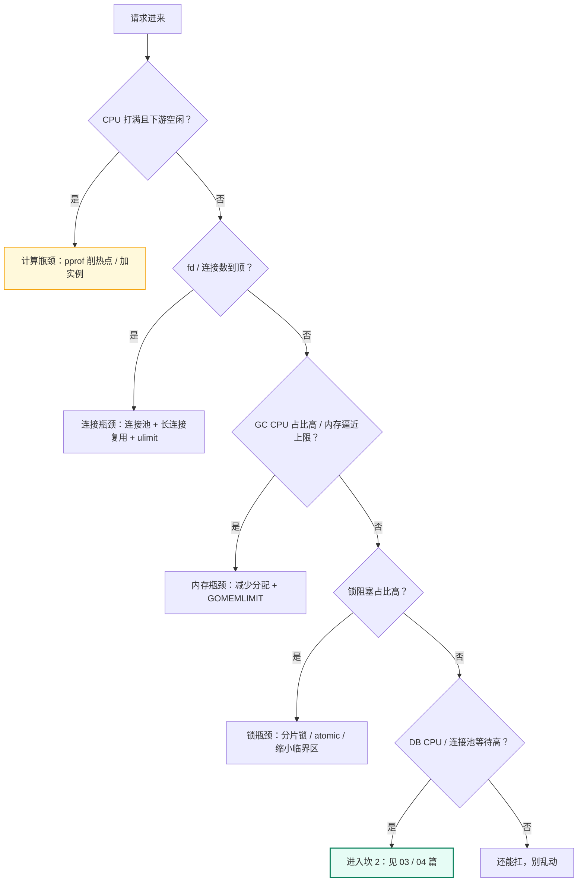
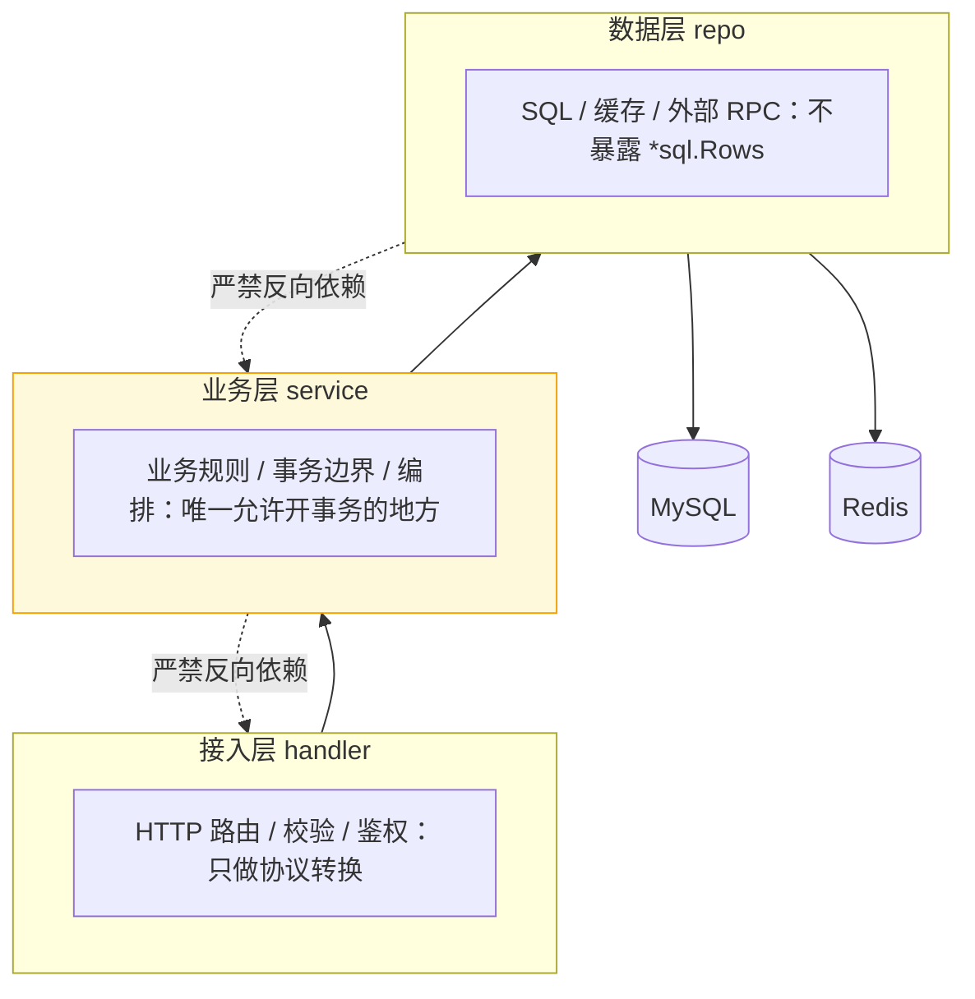

# 02 · 单体架构的极限与分层

> 属于「架构师修炼」· 阶段 0→1（< 100 → 1,000 QPS）· **在拆任何东西之前，先把单机压到极限**
> 上一篇：[01 QPS 分级与架构演进地图](./01-QPS分级与架构演进地图)　下一篇：[03 MySQL 主从与读写分离落地](./03-MySQL主从与读写分离落地)

> **这篇解决什么问题**：你的 Go 单体 QPS 一过几百就开始抖，P99 从 20ms 跳到 500ms，第一反应是「上 Redis / 拆微服务」——**顺序错了**。坎 1 的正确动作是：先用数字算清单机的四个天花板（CPU / 连接数 / 内存与 GC / 锁），用 pprof 把热点削掉，再谈分层与加实例。这一步的收益是「1 台机器省下 5 台 + 三个中间件的运维成本」，代价几乎为零。这一篇给：四个天花板的量化算量、Go 侧优化清单、压测找拐点的方法，以及「什么时候才真的该拆」。

---

## 一、先算账：单机的四个天花板

单机不是「能扛 1 万 QPS」这种笼统概念，它是**四个独立天花板，谁先到谁就是瓶颈**（[00 篇](./00-架构师思维与设计方法论)第 ② 步）。



### 1.1 天花板一：CPU —— 纯逻辑 3w~10w，带 DB 秒降到 1k 级

| 场景（8C16G） | 单实例量级 | 说明 |
| --- | --- | --- |
| 纯内存逻辑（路由 + 计算 + 序列化） | **3w ~ 10w QPS** | 取决于 JSON 大小与拷贝次数 |
| 一次 Redis 访问 | **1w ~ 3w QPS** | 多一次网络 RTT（0.2~1ms）|
| 一次 MySQL 主键点查 | **2k ~ 5k QPS** | 比 Redis 慢 1~2 个数量级 |
| 一次 MySQL 事务写 | **500 ~ 2k TPS** | 每事务一次 fsync 时更低 |
| 串行 3 次下游 RPC（各 30ms）| **300 ~ 500 QPS** | 延迟直接换算成并发上限 |

```text
核心公式（Little's Law，背下来）：
并发数 = QPS × 平均延迟   →   单实例 QPS 上限 ≈ 可用并发数 / 平均延迟
例：下游平均 30ms，单实例可用并发 150 → 上限 ≈ 150 / 0.03 = 5,000 QPS
```

**这就是「带 DB 后降到 1k 级」的数学解释**：不是 CPU 不行，而是**每个请求都在等 IO**，CPU 大部分时间在 `epoll_wait` 睡觉。此时加 CPU 无用，要降延迟（缓存/并行/批量化）或加实例。**水位怎么定**：**40%~60% 是安全水位**，留 2 倍突发余量；`> 80%` 时 Go runtime 调度延迟（goroutine 在 runqueue 等 P）会显著抬升 P99。**要看的是容器 CPU throttling 次数，不是平均利用率**——平均 50% 但周期性被 cgroup 限流，P99 一样烂。

### 1.2 天花板二：连接数 —— fd 与 DB 连接最容易被忽略

| 位置 | 默认/常见值 | 打满现象 | 处理 |
| --- | --- | --- | --- |
| 进程 fd 上限 | `ulimit -n` 常见 1024（容器）/ 65535 | `accept: too many open files` | 提到 65535 + `LimitNOFILE` |
| DB `max_connections` | **MySQL 默认 151** | `ERROR 1040: Too many connections` | 上调 + 连接池收敛（见 2.3）|
| 内核端口/TIME_WAIT | `ip_local_port_range` 约 2.8 万 | `cannot assign requested address` | 长连接复用 + `tcp_tw_reuse=1` |

**关键认知**：**连接数不是越多越好，连接是有成本的**。MySQL 每个连接大约吃掉 **`thread_stack` 256KB + 按需分配的 buffer**，151 个连接轻松占 1~2 GB；连接越多，主库的上下文切换与 mutex 竞争越重，吞吐反而下降（典型拐点）。所以**生产 `max_connections` 通常只设 500~2000，配合连接池严格上限使用**。**TIME_WAIT 的真相**：它是**主动关闭方**的正常状态（2×MSL ≈ 60s）；服务端堆到几万，说明你在频繁主动关连接——大概率是没复用 HTTP 长连接，或 `SetConnMaxLifetime` 设太短导致池子反复建连断连。**先修代码，别急着调内核参数。**

```bash
ss -s                                    # 连接状态汇总；ss -tan state time-wait | wc -l 看 TIME_WAIT
ss -tan state established '( sport = :3306 )' | wc -l   # 到 DB 的真实连接数
cat /proc/<pid>/limits | grep files                     # 进程 fd 上限
```

### 1.3 天花板三：内存与 GC —— P99 抖动最常见的元凶

Go 的 GC 是**并发标记清除**，1.14 之后 STW 通常**亚毫秒级**，「GC 导致暂停」在今天基本不成立。**真正伤 P99 的是另外两件事**：① **GC assist**——goroutine 分配太快会被 runtime 强制拉去帮忙标记，**业务 goroutine 被征用干 GC 的活**，这段延迟随机且分布式，直接体现为长尾；② **后台标记抢 CPU**——GC 目标是把标记控制在 **25% CPU** 以内，CPU 已经 70% 时，这 25% 就是压死 P99 的那一撮。

| 变量 | 默认 | 作用 | 建议 |
| --- | --- | --- | --- |
| `GOGC` | 100 | 堆增长 100% 触发一轮 GC | 内存充裕调 200~400 换 CPU；内存紧调 50 |
| `GOMEMLIMIT` | 无（Go 1.19+）| 堆的**软上限**，逼近时 GC 频率拉满 | 设容器 limit 的 **70%~80%**（1Gi → `800MiB`），防 OOMKilled |
| `GODEBUG=gctrace=1` | 关 | 每轮 GC 打一行 | 压测时开，看 GC CPU 占比与存活堆 |

```text
gc 27 @12.418s 0%: 0.021+1.7+0.003 ms clock, 0.17+0.28/1.4/0.42 ms cpu, 128->131->72 MB, 140 MB goal, 8 P
① 第 27 轮、启动后 12.4s          ② GC 占 CPU 百分比，> 10% 就该优化分配了
③ STW(标记准备)+并发标记+STW(标记终止)，最后一段 > 1ms 则 P99 一定脏
④ assist / 后台标记 / 空闲标记的 CPU 时间；第一项大 = 分配太猛
⑤ 标记前堆 -> 标记后堆 -> 存活堆与下一轮目标；存活堆持续上涨 = 泄漏
```

```bash
GODEBUG=gctrace=1 ./server                                          # ① 看频率与 GC CPU 占比
go tool pprof -http=:8081 http://localhost:6060/debug/pprof/allocs   # ② 谁在制造垃圾（对比 heap 看是"抖"还是"漏"）
go tool pprof -http=:8081 http://localhost:6060/debug/pprof/profile?seconds=30   # ③ CPU 真实热点
go tool pprof -http=:8081 http://localhost:6060/debug/pprof/block     # ④ 阻塞（被忽略的 P99 凶手）
```

> ⚠️ **踩坑提醒**：`allocs`（累计分配）和 `heap`（当前存活）是两回事。**`allocs` 大但 `heap` 小 → GC 压力**（`sync.Pool`、减少拷贝）；**`heap` 持续上涨 → 真泄漏**（全局 map 无 TTL、goroutine 泄漏、循环里的 `time.After`）。**别把这两个搞混然后去调 GOGC，那是白费功夫。**

::: tip 把这四个命令变成可复用的能力（展开篇）
这一节给的是**四个入口**；「拿到现象该敲哪条命令、看到什么算什么、怎么证明改对了」在子栏目 [19 pprof 实战](/架构师修炼/19-pprof实战/) 里展开：8 篇文档 + 8 个可跑实验（`code/architect/pprof-lab/`，零依赖、自带压测器），能亲手造出 CPU 打满（L01）、GC 抖动（L02）、goroutine 泄漏（L03）、锁竞争（L04）、channel 阻塞（L05）、内存滞留（L06）、syscall 高（L07），并用 `-fix` 跑修复版做前后对比。

- 该抓哪个 profile：[01 观测体系与 pprof 原理](/架构师修炼/19-pprof实战/01-观测体系与pprof原理)
- CPU / 内存 GC / 锁与阻塞：[02](/架构师修炼/19-pprof实战/02-CPU火焰图实战) · [03](/架构师修炼/19-pprof实战/03-内存与GC实战) · [04](/架构师修炼/19-pprof实战/04-goroutine与锁阻塞实战)
- 生产怎么安全地开：[06 生产环境 pprof 实践](/架构师修炼/19-pprof实战/06-生产环境pprof实践)
:::

### 1.4 天花板四：锁竞争 —— 同时吃掉 CPU 和 P99

锁竞争的可怕之处：**它不报错，只让 CPU 花在自旋和调度上，P99 悄悄抬升**。

| 反模式 | 现象 | 替换方案 | 适用边界 |
| --- | --- | --- | --- |
| 全局 `sync.Mutex` 保护大 map | mutex profile 里该锁占比 > 10% | **分片锁**：`[256]struct{ mu; m map[K]V }`，按 key hash 取片 | key 空间大、读多写少 |
| 并发读写普通 map | `fatal error: concurrent map writes`（直接崩）| `sync.RWMutex` 或 `sync.Map` | —— |
| 什么都用 `sync.RWMutex` | 写饥饿；读锁高并发时 `atomic` 争抢 cache line | **只读快照用 `atomic.Pointer`** 整体替换不可变 map | 读远多于写、数据量 < 1w 条 |
| 拿 `sync.Map` 当万能缓存 | 未命中多时**比 `RWMutex+map` 更差**（read/dirty 双 map 的 miss 路径）| 读多写少且 key 集合稳定才用 | 注册表、连接池、metric 标签 |
| 临界区里做 IO / 序列化 | 锁持有时间从 µs 变 ms | IO 挪到锁外，锁内只做内存操作 | 通用 |
| 计数器用 mutex | 高频写 cache line 乒乓 | `atomic.Int64`；更强场景分片计数再求和 | metric、QPS 统计 |

```go
// 分片锁：对比全局 mutex，热点场景提升 3~10 倍
const shards = 256

type ShardedCounter struct {
	mu     [shards]sync.Mutex
	values [shards]map[string]int64 // 初始化时每个分片 make(map[string]int64, 64)
}

func (c *ShardedCounter) Incr(key string, delta int64) {
	h := uint32(2166136261) // FNV-1a：避免所有 key 落在同一把锁上
	for i := 0; i < len(key); i++ {
		h ^= uint32(key[i])
		h *= 16777619
	}
	i := h % shards
	c.mu[i].Lock()
	c.values[i][key] += delta
	c.mu[i].Unlock()
}
```

**量化参考**：单把全局 mutex 保护的 map，8 核上约 **50w~100w ops/s** 到顶；分片到 256 片后接近**每核独立**，即 **500w+ ops/s**。这就是「锁竞争天花板」的具体数字。

---

## 二、Go 服务侧优化清单：按 ROI 排序

**优化有顺序**：先做免成本的配置与结构优化（2~10 倍），再做代码级微优化（10%~30%），最后才加机器。反着来就是烧钱。

### 2.1 优化点总表

| # | 优化点 | 做法 | 收益量级 | 代价 |
| --- | --- | --- | --- | --- |
| 1 | **连接池参数** | 三个参数按公式配（见 2.3）| **2~10x**（默认 `MaxIdleConns=2` 是隐藏灾难）| 无 |
| 2 | **消除 N+1 查询** | 一次 `IN (...)` 批量取，别循环单查 | **5~50x**（延迟直接除以 N）| 改 SQL |
| 3 | **pprof 定位热点** | cpu/heap/block/mutex 四件套，先量后调 | 定位准确度 100%（避免瞎猜）| 无 |
| 4 | **singleflight 合并** | 同 key 并发请求只回源一次 | 热点场景 **10~100x** | 需处理共享错误 |
| 5 | **HTTP 超时三件套** | Read / Write / IdleTimeout | 防慢连接耗尽 fd（可用性）| 无 |
| 6 | **减少序列化开销** | 复用 buffer、避免 `interface{}`、预计算长度 | **1.5~3x**（序列化常占 20%~40% CPU）| 换库风险 |
| 7 | **`sync.Pool` 复用** | 复用 request/response 与 `bytes.Buffer` | GC CPU **降 30%~70%** | 用错会状态污染 |
| 8 | **本地缓存** | 进程内 LRU，TTL **1~10s** | **10~100x**（比 Redis 快一档）| 多实例不一致窗口 |
| 9 | **优雅退出 / 批量异步化** | 先摘流 → `Shutdown` → grace；攒批写、非核心链路异步 | 发布期 **0 报错**；**10x+** | 无 / 一致性变最终一致 |

### 2.2 pprof：生产要开，但要会开

```go
runtime.SetBlockProfileRate(100)     // 每 100ns 阻塞采一次；0 = 关闭
runtime.SetMutexProfileFraction(100) // 每 100 次竞争采一次；0 = 关闭
// 必开三个：/debug/pprof/profile(CPU) · /debug/pprof/heap · /debug/pprof/goroutine?debug=1
```

> **生产取舍**：这两个采样开关**本身有 1%~5% 开销**。建议**常态关闭，排障时用配置中心动态打开**，排完再关；debug 端口独立监听 + 只开内网 + 网关鉴权。这是 A5 级细节，面试里说出来很加分。
>
> 这一段的完整落地（独立管理端口的 Go 代码、鉴权与网关拦截、开销自测方法、K8s 采集姿势、持续 profiling 的三档方案）见 [06 生产环境 pprof 实践](/架构师修炼/19-pprof实战/06-生产环境pprof实践)；采集时踩坑（打不开 / 采到空 profile / 全是 `runtime.*` / 符号丢失）见 [05 常见问题排查手册](/架构师修炼/19-pprof实战/05-常见问题排查手册)。

### 2.3 连接池参数怎么算（公式 + 例子）

`database/sql` 有个**著名的坑**：`MaxIdleConns` 默认 **2**。即使你把 `MaxOpenConns` 开到 100，**并发过后空闲连接会被裁到只剩 2 个**，下一个突发流量里 98 个请求要现场 TCP 握手 + MySQL 认证（每次 1~3ms，还耗 DB CPU）。**这是「压测好好的、线上抖」的头号原因。**

```go
db, _ := sql.Open("mysql", dsn)
db.SetMaxOpenConns(10)                    // 硬上限：拿不到就阻塞，这就是背压
db.SetMaxIdleConns(10)                    // 建议 = maxOpen，避免突发时重建连接
db.SetConnMaxLifetime(30 * time.Minute)   // 必须 < wait_timeout 与云 LB 的空闲回收
db.SetConnMaxIdleTime(5 * time.Minute)    // 回收长期空闲连接，给 DB 减压
```

```text
① 单实例所需并发 = 单实例峰值 QPS × 平均 SQL 延迟        （Little's Law）
② SetMaxOpenConns = max(理论并发 × 2, 5)，向上取整到 10 的倍数
③ 全局校验：实例数 × SetMaxOpenConns ≤ max_connections × 0.7
```

| 项 | 值 | 依据 |
| --- | --- | --- |
| 峰值读 QPS / 实例数 / 平均 SQL 延迟 | 2,000 / 10 个 Pod / 4 ms | 每实例 200 QPS，主键点查 |
| 理论并发 | 200 × 0.004 = **0.8** | Little's Law |
| `SetMaxOpenConns` | **10** | 理论并发极低，但慢查询/锁等待时会堆积，10 作为背压上限 |
| `SetConnMaxLifetime` | **30 min** | < MySQL `wait_timeout=28800s`；若云 LB 空闲回收 350s 则取更小 |
| 全局校验 | 10 × 10 = **100** ≤ 151 × 0.7 ≈ **105** ✅ | 卡住上限；扩到 20 个 Pod 必须同步上调 `max_connections` |

> **为什么 `SetMaxOpenConns` 要小？** 它就是**服务端的背压阀**。池子设 500，慢查询爆发时 500 个请求一起打进 MySQL，MySQL 更慢，形成正反馈直到雪崩。**让请求在应用层排队超时，比让 DB 崩掉好得多。**

### 2.4 HTTP 超时与优雅退出

**没有超时的服务端不是健壮，是定时炸弹**：一个客户端建连后不发数据，goroutine 和 fd 就被永久占用。

```go
srv := &http.Server{
	Addr:              ":8080",
	Handler:           mux,
	ReadHeaderTimeout: 5 * time.Second,   // 防 slowloris
	ReadTimeout:       10 * time.Second,  // 上传接口单独放宽
	WriteTimeout:      30 * time.Second,  // SSE / 流式必须设 0 或另起 server
	IdleTimeout:       120 * time.Second, // 必须 > 上游 keepalive idle
	MaxHeaderBytes:    1 << 20,
}

// 优雅退出：顺序错了会丢请求 —— 先摘流，再 Shutdown，最后 Close
go func() {
	ctx, stop := signal.NotifyContext(context.Background(), syscall.SIGINT, syscall.SIGTERM)
	defer stop()
	<-ctx.Done()
	healthy.Store(false)                     // ① 摘流：readiness 置 false，等 LB 停转发（3~5s）
	time.Sleep(5 * time.Second)
	shutdownCtx, cancel := context.WithTimeout(context.Background(), 20*time.Second)
	defer cancel()
	_ = srv.Shutdown(shutdownCtx)            // ② 等在途请求跑完（超时后由 Close 强杀）
}()
```

| 超时 | 建议值 | 设错的后果 |
| --- | --- | --- |
| `ReadHeaderTimeout` / `ReadTimeout` | 3~5s / 10s（上传 60~300s）| 不设 → slowloris 攻击占满 fd；太短 → 大文件上传失败 |
| `WriteTimeout` / `IdleTimeout` | 30s（流式 0）/ 90~120s | 不设 → 慢客户端拖住 goroutine；小于上游 → 上游复用到已关连接报 `EOF`/502 |
| 优雅退出 grace | 15~30s | 太短 → 发布期 499；太长 → 发布慢 |

---

## 三、垂直分层与边界设计

坎 1 说「不拆微服务」，**不等于不设计**。正确姿势是**垂直分层 + 严格依赖方向**，为将来拆分留好接缝。

### 3.1 三层结构与依赖方向



| 层 | 只该做 | 绝不该做 | 违反的代价 |
| --- | --- | --- | --- |
| **handler** | 解析、校验、鉴权、组装响应、状态码映射 | 写业务规则、直接调 `db.Query` | 业务逻辑散落，改一处漏一处 |
| **service** | 业务规则、事务边界、跨 repo 编排、发领域事件 | 拼 SQL、依赖 `http.Request` | 无法被定时任务/消费者复用 |
| **repo** | SQL、缓存读写、外部调用封装 | 返回 `*sql.Rows`、泄露 SQL 细节 | 上层与存储引擎耦合，换 ORM 要全改 |

**依赖只能向内**。**接口定义在使用方**（Go 惯例）：`service` 里定义 `type OrderRepo interface{ Get(ctx, id) (*Order, error) }`，`repo` 提供实现——这样 service 测试直接塞 mock，**不用起数据库**。

### 3.2 为什么这时候不该拆微服务

| 维度 | 单体（坎 1 正确选择）| 微服务（坎 1 错误选择）|
| --- | --- | --- |
| 一次请求的调用 | 函数调用 **~100ns** | 网络 RPC **0.5~3ms**（慢 1 万倍）|
| 事务 | 本地 DB 事务，强一致 | 分布式事务（[09 篇](./09-分布式事务与最终一致落地)），最终一致 |
| 排障 / 发布 | 一个日志流、一个 pprof；一次构建一次发布 | 全链路 Trace + 日志聚合；N 个服务编排发布，成本 ×N |
| 故障点 / 团队适配 | 1 个进程 / 2~3 人 | N 个进程 + 注册中心 + 网关 + 配置中心 / 每服务至少 1 个 owner |
| **收益** | 开发效率最高 | 独立扩缩容、技术异构、故障隔离 |

> **一句话**：**微服务解决的是「组织和伸缩」问题，不是「性能」问题。** 1k QPS 下拆分带来的不是性能收益，而是「RPC 延迟增加 + 分布式事务 + 排障困难」三份成本。**复杂度是成本，不是能力。**

### 3.3 什么时候真的该拆

| 信号 | 阈值 | 说明 |
| --- | --- | --- |
| **团队协作冲突** | 同一服务 **> 8~10 人**同时改，发布排队成常态 | 组织瓶颈，最正当的拆分理由（康威定律）|
| **独立扩缩容诉求** | 某模块 CPU 是其他模块 **5 倍以上** | 如视频转码 vs 用户资料，混部浪费严重 |
| **故障隔离诉求** | 某模块慢查询/内存泄漏会拖垮整体 | 拆出去 + 独立限流熔断（[12 篇](./12-限流熔断降级与背压)）|
| **技术栈异构 / 发布节奏差异** | 需要 Python/GPU 推理；一个模块每天发 10 次另一个每月 1 次 | 如 [15 篇](./15-案例-AI剪辑任务平台架构)的 GPU 调度；发布风险隔离 |
| **数据边界清晰** | 表之间几乎不 JOIN | **前置条件**——边界不清就拆必然变成分布式单体 |

> **反面警告**：**「为了学微服务而拆」是最常见的新手错误**。拆完发现 6 个服务、每个 200 QPS，还多了 3 个中间件要运维，稳定性反而下降。

---

## 四、压测：找到 QPS-延迟拐点

**压测的唯一目的是找拐点**——那个「再加一点并发，QPS 不涨、延迟暴涨」的点。

### 4.1 工具选型与压测铁律

| 工具 | 适用 | 命令 |
| --- | --- | --- |
| **wrk** | HTTP 快速压测，C 实现，单机轻松打万级 | `wrk -t8 -c400 -d60s --latency http://host/api` |
| **vegeta** | 恒定速率压测，精确控 RPS，最适合找拐点 | `vegeta attack -rate=2000 -duration=60s -targets=t.txt \| vegeta report` |
| **k6** | 场景化压测，JS 脚本多阶段 ramp-up，最接近真实 | `k6 run --vus 500 --duration 5m script.js` |
| **go test -bench** | 函数级微基准，看单函数吞吐与分配 | `go test -bench=. -benchmem -cpuprofile=cpu.out` |

**铁律**：① 压测机不能与被压服务同机，且自身 CPU 不能打满；② 必须同规格机器，数字才可迁移；③ 先做 baseline 再优化，否则无法量化收益；④ **流量要阶梯递增**，一上来 1000 并发只能测出「几秒被打崩」；⑤ 测完立刻看服务端指标，否则不知道瓶颈在哪。

### 4.2 拐点示意表（记住这个曲线）

| 并发 | QPS | P50 | **P99** | 现象 | 区间 |
| --- | --- | --- | --- | --- | --- |
| 50 | 8,200 | 5 ms | 12 ms | 线性区：QPS ∝ 并发 | ✅ 健康 |
| 100 | 8,900 | 10 ms | 25 ms | 仍线性，延迟翻倍 | ✅ 健康 |
| 200 | 9,100 | 20 ms | 45 ms | 开始偏离线性 | ⚠️ 接近饱和 |
| **400** | **9,300** | **41 ms** | **180 ms** | **QPS 不涨，P99 涨 4 倍** | 🔴 **拐点** |
| 800 | 8,600 | 90 ms | 900 ms | QPS 反降，长尾出现 | 🔴 过载 |
| 1,600 | 4,200 | 300 ms | 4.2 s | 雪崩：重试叠加，吞吐腰斩 | 💀 崩溃 |

**怎么读**：① **拐点 ≈ 线性区并发的 2 倍**，本例安全容量定为 **拐点 × 0.7 ≈ 6,500 QPS**，而不是 9,300；② **QPS 开始下降 = 已进入拥塞正反馈**（延迟升 → 客户端超时重试 → 流量翻倍 → 更慢），**此时加机器无用，必须先限流**；③ **P99 是最好的探针**——并发 200 时 P99 已涨 3.7 倍，而 P50 涨不到 4 倍，说明**长尾先坏**。

### 4.3 压测必须观测的指标

| 层级 | 指标 | 判断 |
| --- | --- | --- |
| 客户端 | QPS、P50/P90/P99/P999、错误率 | 拐点与长尾 |
| 应用 | CPU 利用率 / **throttling 次数**；**GC 次数与 CPU 占比、存活堆**；goroutine 数 | 是否 CPU/GC/泄漏瓶颈 |
| 应用 | **连接池 WaitCount / WaitDuration** | DB 池是否打满（**最关键**）|
| DB / 下游 | CPU、活跃连接、慢查询数、行锁等待；Redis 与第三方 RPC 的 P99 | DB 是否到顶；是不是别人慢 |

```go
// db.Stats() 是压测时最被忽略的宝藏：直接告诉你瓶颈在不在 DB 连接池
s := db.Stats()
slog.Info("pool", "inUse", s.InUse, "idle", s.Idle,
	"waitCount", s.WaitCount,          // 累计因池满而等待的次数 ← 涨了就是瓶颈
	"maxIdleClosed", s.MaxIdleClosed)  // 因 MaxIdleConns 太小被关掉的连接 ← 调参依据
```

> **经验法则**：`WaitCount` 持续增长 + `WaitDuration/WaitCount > 10ms` → **DB 侧已是瓶颈，进入坎 2**（[03 篇](./03-MySQL主从与读写分离落地)）。`inUse` 长期等于 `MaxOpenConns` 但 `WaitCount` 不涨 → 池子设小了，可适当放大。

---

## 五、静态化与 CDN 前置：把 90% 流量在到达应用前消化

**这是坎 1 性价比最高的一招**——它不是「优化」，而是**让流量根本不打到你的服务上**。

| 手段 | 做法 | 消化的流量 | 关键参数 |
| --- | --- | --- | --- |
| **静态资源强缓存** | 文件名带内容 hash（`app.a3f9c1.js`）| 图片/CSS/JS 的 **95%+** | `Cache-Control: public, max-age=31536000, immutable` |
| **CDN 分发** | 静态资源上对象存储 + CDN | 回源率降到 **< 5%** | 命中率目标 > 95%，`stale-while-revalidate` |
| **HTTP 缓存校验** | HTML 用 `ETag` + `304` | 省带宽，不省应用 CPU | `If-None-Match` → 304（体积 50KB → 0）|
| **接口级边缘缓存** | 榜单/配置等公共只读接口在网关/CDN 缓存 | **60%~90%** | `Cache-Control: public, max-age=10` |
| **SSR 静态生成 / 客户端增量** | 详情页预生成 HTML；版本号拉增量、长轮询或 SSE 替代轮询 | 页面类 **99%**；轮询类 **80%+** | 变更时主动 purge |

```text
改造前请求构成：静态 60% + 公共只读接口 25% + 个性化 15%
改造后打到应用：60%×5%(回源) + 25%×20%(回源) + 15%×100% = 23% → 应用压力降到 1/4
```

> **这比「加机器」强得多**：加机器是线性成本，CDN 是**用别人的边缘机房换你应用服务器的 CPU**。被问「怎么优化首屏 / 怎么降本」，答这个比答「我用了 Redis」高一个层次。

---

## 六、故障与一致性边界

**先记住结论**：坎 1 的所有问题都是**「单机可用性」问题，不是一致性问题**。数据只有一份（单库），不存在副本差异，只存在「这份数据还在不在」。

### 6.1 故障边界表

| 组件 | 故障现象 | 处理 | **一致性边界** |
| --- | --- | --- | --- |
| **Go 单实例** | 崩溃 / `kill -9` / 节点宕机 | K8s 重启 + LB 摘除；优雅退出减少发布期错误 | **内存态数据全丢**：本地缓存、内存队列、未落库计数器。已提交 DB 事务不受影响 |
| **DB 连接池打满** | `WaitCount` 猛涨，P99 从 20ms 到 5s | 池子上限当背压 + 请求级超时 + 限流（[12 篇](./12-限流熔断降级与背压)）| **无数据不一致**，只是大量请求超时失败（可用性降级）|
| **GC 抖动** | P99 从 30ms 突然到 500ms，QPS 掉 30% | `GOMEMLIMIT` 兜底 + profile 定位减少分配 + 降级非核心链路 | **无**（纯 P99 问题）|
| **OOM** | `OOMKilled`，被内核 `kill -9` | `GOMEMLIMIT` = limit × 0.8；限并发；堆 profile 查泄漏 | **内存中未持久化的数据全丢**（本坎最大窗口）|
| **本地缓存** | 多实例数据不一致（A 新 B 旧）| TTL 压到 **1~10s**；写后广播失效 | **TTL 窗口内的读不一致**（最长 = TTL）。P0 资金类禁止进本地缓存 |
| **发布/重启** | 在途请求被中断，客户端 499/502 | 先摘流 → `Shutdown` → grace 20s | **客户端超时但服务端已执行** → 重试可能重复下单，**必须幂等**（[11 篇](./11-幂等去重与ExactlyOnce)）|
| **磁盘写满（DB 所在机）** | MySQL 报 `Disk full`，写入全失败 | 磁盘 > 70% 告警；管理 binlog 保留期 | **无（写直接失败，不会静默丢）**——失败比静默丢可接受 |
| **网络抖动** | 请求超时、连接重置 | 重试（**必须幂等**）+ 熔断 + LB 自动摘除 | 重试导致的**重复执行**窗口（非幂等写的最大风险）|

### 6.2 明确回答：丢数据的窗口在哪

```text
窗口 ①  进程内存 → DB 之间（最大、最常见）
        内存队列 / 本地缓存 / 聚合计数器中已"返回给用户"但尚未落库的数据
        触发：kill -9、OOMKilled、节点宕机     量级：攒批间隔 100ms ~ 5s
        治理：关键写立即落库；非关键写用本地消息表先落一条待发记录
窗口 ②  客户端超时 → 服务端实际成功之间：客户端 3s 超时放弃，服务端 3.5s 时执行成功
        触发：任何超时/重试   量级：无上界（重试几次就有几次）
        治理：幂等键 + 唯一约束（不是"窗口"，是"重复"，危害等价）
窗口 ③  发布期间的连接中断：优雅退出没做 → 在途请求直接被 RST
        触发：滚动发布        量级：一次发布几十到几百个请求
        治理：先摘流 → Shutdown → grace；客户端幂等重试
```

> **面试杀手锏**：**「单机的可用性问题可以用冗余解决；一致性问题只能靠副本协议 + 对账解决。」** 坎 1 你只需关心「进程挂了怎么办」；上了主从/缓存（坎 2）才开始面对「副本间不一致怎么办」——**这是两个完全不同的问题，别混着答**。

---

## 七、演进到坎 2 的触发指标

出现以下**任意两条**，就该进入坎 2（[03](./03-MySQL主从与读写分离落地) · [04](./04-Redis高可用与缓存体系落地)）。

| 触发指标 | 阈值 | 含义 | 动作 |
| --- | --- | --- | --- |
| **应用 P99** | **> 300 ms 持续 5 分钟** | 长尾已伤体验 | 先 Trace；若是 DB 读慢 → 缓存/读分离 |
| **DB CPU** | **> 70% 持续 5 分钟** | DB 处理能力到顶 | 上缓存削 80% 读 → 再读写分离 |
| **连接池等待** | `WaitDuration/WaitCount > 10ms` 或 `WaitCount` 持续涨 | DB 侧排队 | 慢查询治理 → 读分离 |
| **单机 CPU 打满但下游空闲** | 应用 > 80%，DB/Redis < 30% | **纯计算瓶颈** | 先 pprof；无果则**加实例**（不需要中间件）|
| **DB 活跃连接 / 慢查询数** | > `max_connections` × 70% / `Slow_queries` > 10 每分钟（`long_query_time=0.1`）| 连接或慢查询堆积 | 查慢查询 + 收紧池 + 限流；**先治理 SQL 是免费收益** |
| **单表行数** | > 5,000 万 | 索引深度与 DDL 风险 | 归档（未到分片，见 [06 篇](./06-分库分表与在线迁移双写)）|

```text
演进顺序（错了会白干）：
1 优化代码（pprof 削热点 · 连接池 · 本地缓存）   2 治理 SQL（索引 · 慢查询 · 覆盖索引）
3 静态化 + CDN（削掉 60%~90% 流量）             4 加实例（无状态化 + LB，最便宜的扩容）
5 坎 2：缓存优先（Redis 削 80% 读）             6 坎 2：读写分离（解决剩余 20% 读 + 可用性）
```

> **为什么必须先缓存再读写分离？** 缓存削掉 80% 的读，读分离只需解决剩下 20%；**顺序反了，你会为剩余 80% 的流量承担主从延迟的全部复杂度，收益却很小**。这个顺序判断就是 [03 篇](./03-MySQL主从与读写分离落地)的开篇议题。

---

## 面试追问链

1. **「你的单体服务 QPS 上不去，怎么办？」**
   → 「先不猜，先量。按四个天花板依次排查：**① CPU 打满且下游空闲 → 计算瓶颈**，pprof 看 `top -cum` 找热点，常见是 JSON 序列化和锁竞争；**② 连接池 `WaitCount` 涨 → DB 侧**，先查慢查询再收紧池子；**③ gctrace 里 GC CPU 占比 > 10% → 分配太猛**，用 allocs profile 定位，`sync.Pool` + 减少拷贝；**④ 都不是 → 加实例**。**先加机器等于把问题买下来，不是解决它。**」

2. **「你说加实例，为什么不直接上微服务？」**
   → 「加实例解决**容量**，微服务解决**组织和隔离**，是两个问题。1k QPS 下拆微服务，我把函数调用（100ns）换成 RPC（1~3ms）、本地事务换成分布式事务、单流日志换成全链路 Trace，**换来三个新故障点和成倍的排障成本，QPS 一点没涨**。真正该拆的信号是『同一服务 8 人以上同时改』或『某模块 CPU 是其他模块 5 倍以上』——是组织和技术异构逼出来的，不是性能逼出来的。」

3. **「本地缓存和 Redis 有什么区别？为什么不全用本地缓存？」**
   → 「本地缓存是**进程内**的，延迟 ~100ns，比 Redis（0.2~1ms）快一个数量级还省一次往返，热点场景很值。但它有两条硬边界：**① 多实例之间不一致**，只能靠 **TTL（1~10s）** 或写后广播失效收敛；**② 容量受单机内存限制**，装不下全量数据。所以我的用法是 **L1 本地缓存（TTL 10s，只放极热且可容忍陈旧的配置/字典）+ L2 Redis**，P0 资金类数据一律不进本地缓存。」

4. **「GOGC 和 GOMEMLIMIT 你怎么配？」**
   → 「这两个管不同的事：**GOGC 管『多久 GC 一次』，GOMEMLIMIT 管『最多用多少内存』**。容器里先设 `GOMEMLIMIT = limit × 0.8`（1Gi → 800MiB）作为 OOMKilled 的兜底硬安全线；然后内存有余量而 CPU 紧张时把 GOGC 调到 200~400，用内存换 GC 频率，反之调 50。**判断依据是 gctrace 的第二个字段（GC CPU 占比）**——超过 10% 说明 GC 成了成本大头，但**优化分配永远优先于调参**。」

5. **「什么时候你会觉得『单机真的到极限了』？」**
   → 「我给三个数字：**① 全链路优化后（pprof 无热点、池不等待、GC CPU < 5%）单实例压测拐点 9k，按 0.7 安全系数到 6.5k，而业务峰值已到 5k**，余量不足一个峰值周期 → **这时候扩实例，不是上组件**；**② `WaitDuration/WaitCount > 10ms` 持续出现**，说明瓶颈不在应用而在 DB → **该动数据库（缓存/读分离），加应用实例完全无效**；**③ P99 > 300ms 且 Trace 显示 80% 时间在 DB** → 同上。**核心原则：先确认瓶颈在哪一层，再决定加什么；加错层就是纯烧钱。**」

---

## 自测清单

- [ ] 能默写 Little's Law（`并发 = QPS × 延迟`），并用它解释「带 DB 后单机为何从 3w 降到 1k 级」
- [ ] 能说清四个天花板（CPU / 连接数 / 内存GC / 锁）各自的量化阈值与排查命令
- [ ] 能读懂 `GODEBUG=gctrace=1` 输出，指出哪个字段是 GC CPU 占比、哪个是 STW
- [ ] 会算连接池参数，并用「实例数 × SetMaxOpenConns ≤ max_connections × 0.7」校验，知道 `MaxIdleConns` 默认 2 这个坑
- [ ] 能画出 handler → service → repo 的依赖方向，并说出每层「绝不该做什么」
- [ ] 能用 wrk 或 vegeta 压出拐点表，并说明为什么安全容量取拐点 QPS 的 70%
- [ ] 能说出「什么时候才真的该拆微服务」的 3 个触发条件
- [ ] 能明确回答「坎 1 丢数据的三个窗口在哪」，并说明为何此时还没有一致性问题

> **下一篇**：[03 MySQL 主从与读写分离落地](./03-MySQL主从与读写分离落地) —— 应用层已压到极限，瓶颈正式交棒给数据库。
