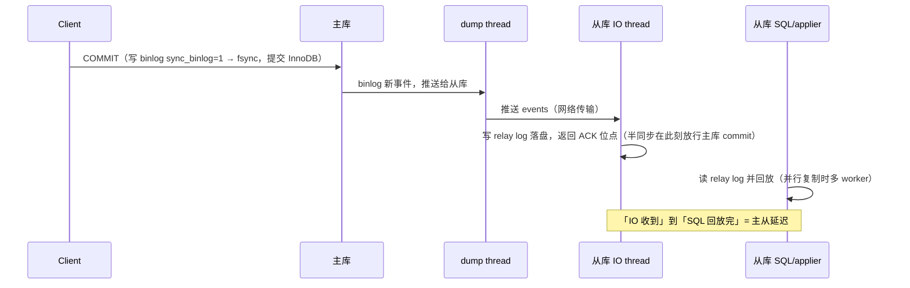
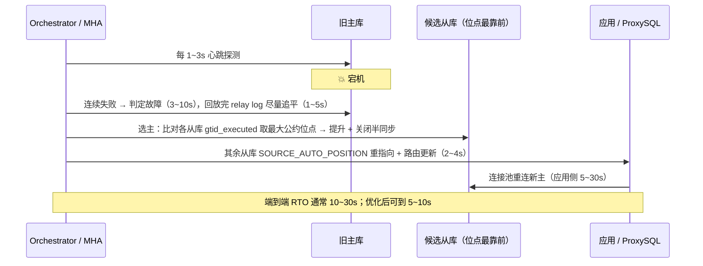

# 03 · MySQL 主从与读写分离落地

> 属于「架构师修炼」· 阶段 1→2（1,000 → 10,000 QPS）· **瓶颈从应用层交棒给数据库，第一个战场是「读」**
> 上一篇：[02 单体架构的极限与分层](./02-单体架构的极限与分层)　下一篇：[04 Redis 高可用与缓存体系落地](./04-Redis高可用与缓存体系落地)

> **这篇解决什么问题**：单机应用优化到拐点、实例加到 10 个之后，**MySQL 主库 CPU 打到 85%，慢查询从每天 3 条变成每分钟 30 条**。所有人都知道要「读写分离」，但动手时会撞上一堆问题：**binlog 用哪种格式、半同步到底防不防丢数据、从库为什么越拖越久、写完立刻读从库读不到怎么办、主库挂了那 30 秒谁在服务**。这一篇不讲「主从复制是什么」（原理见 [MySQL 主从复制与高可用](/后端技术栈强化/01-mysql/主从复制与高可用)），只讲**参数怎么配、延迟怎么监控与治理、切换怎么不断数据、丢数据的窗口到底在哪**。

---

## 一、先做决策：先上缓存，还是先做读写分离？

**顺序反了，你会为 80% 的流量白付主从延迟的复杂度。** 判断依据是三个必须量化的输入：

| 输入 | 怎么量化 | 它决定什么 |
| --- | --- | --- |
| **读的构成** | 按接口统计 QPS 占比，再看 SQL 的 `WHERE` 命中模式（点查/范围/聚合）| 点查+热点集中 → 缓存收益大；范围扫描+分散 → 命中率低 |
| **命中率预估 / 延迟容忍** | `命中率 ≈ 热点请求数 / 总请求数`（`redis-cli --hotkeys` 或采样日志）；写后立即读的请求占比、用户可感知的陈旧窗口 | 命中率 < 50% 时缓存只增加不一致风险；延迟敏感请求 > 30% 时「写后读主」成本吃掉大半收益 |

| 维度 | 先上 Redis 缓存 | 先做读写分离 |
| --- | --- | --- |
| **削掉的读比例 / P99** | **60%~95%**（看热点集中度）/ **0.2~1ms**，比 DB 快 10~100 倍 | 0%（读总量不变只是换机器）/ 与主库相同，**慢查询依然慢** |
| **引入的新问题 / 新增组件** | 穿透/击穿/雪崩、缓存与 DB 不一致窗口（[08 篇](./08-缓存与DB一致性落地)）；Redis 主从或 Cluster，缓存**不是**事实源 | **主从延迟**、写后读不到、切换丢数据；从库 + Orchestrator/ProxySQL，从库是**同一份数据的副本**，也是事实源 |
| **见效时间 / 风险 / 适用边界** | 1~3 天 / 中（可回滚：下线缓存即可）/ 读多写少 + 热点集中 | 1~2 周 / **高**（切换即数据风险，需演练）/ 读分散、大量写后立即读、需要可用性 |

> **结论：缓存优先，读写分离兜底。** 从库跑的还是同样的 SQL，**慢查询在从库一样慢**——缓存解决「根本不用查」，读分离解决「换个地方查」。**先做减法，再做除法。**

---

## 二、MySQL 复制机制的落地选择

原理（三线程、relay log）见 [MySQL 主从复制与高可用](/后端技术栈强化/01-mysql/主从复制与高可用)；这里只讲生产要选的档位。

### 2.1 binlog 三种格式：生产一律 ROW

| 维度 | `STATEMENT` | **`ROW`（生产选择）** | `MIXED` |
| --- | --- | --- | --- |
| 记录内容 / 体积 | SQL 语句 / **最小** | 每行**前后镜像** / **最大**（更新 1 行 = 列数×2；`TEXT/BLOB` 全量）| 自动选择 / 中 |
| 一致性风险 | 🔴 **高**：`NOW()` `UUID()` `RAND()` `@@hostname` 用户变量、无 `ORDER BY` 的 `LIMIT`、触发器 → **主从不一致** | ✅ 无（记录的是结果）| 中（不确定函数走 ROW，边界难预测）|
| 从库回放 / CDC | 重新执行 → 无索引 UPDATE **全表扫**；CDC 解析困难 | 按主键定位行，快且确定，**要求表有主键或唯一非空索引**；CDC 必需 | 中 / 部分可用 |
| 容量代价 | 1 GB/天 | **5~20 GB/天**（100 万行全表 UPDATE ≈ 数 GB 单事务）| 2~5 GB/天 |

关键参数：`binlog_format=ROW`；`binlog_row_image=FULL`（`MINIMAL` 省 30%~70% 体积，但 **CDC 拿不到完整行**）；`binlog_expire_logs_seconds=604800`（7 天，太小会导致切换时无法补数据）；`max_binlog_size=512M~1G`；**`sync_binlog=1`**（`=0` 时崩溃会丢最后 N 个事务）。⚠️ 切到 ROW 后 **binlog 体积涨 5~10 倍**，磁盘与带宽要重算——这是「一致性」明码标价的代价，**别为省磁盘用 STATEMENT**。

### 2.2 复制三线程与时序



**dump thread**（主库）每从库一个，瓶颈是 binlog 读 IO 与网络带宽；**IO thread**（从库）接收并写 relay log，**它是并行的**，网络传输通常不是延迟主因；**SQL/applier thread** 负责回放，**默认单线程 → 延迟的主因**（见 2.6）。

> ⚠️ **半同步 ACK 在 IO 线程落盘后发出，与 SQL 线程回放无关**——这就是「半同步不解决主从延迟」的机制级解释。

### 2.3 GTID 复制：生产必开

```ini
gtid_mode = ON
enforce_gtid_consistency = ON
log_slave_updates = ON   # 从库也写 binlog：级联/并行复制、按位点补数据都依赖它
```

| 维度 | 传统位点复制 | **GTID 复制** |
| --- | --- | --- |
| 指向主库 | `MASTER_LOG_FILE='mysql-bin.000042', MASTER_LOG_POS=193847` | `SOURCE_AUTO_POSITION=1`（自动找差集）|
| 切换主库 | 🔴 逐个从库手工 `CHANGE MASTER` 指新位点，几十个从库极易错 | ✅ **一条命令**自动补齐 |
| 丢数据判定 | 比对 binlog 文件+offset，**跨文件无法比较** | ✅ **GTID 集合差集**（`GTID_SUBTRACT`），精确知道缺哪几个事务 |
| 补数据 / 防误操作 / 代价 | `mysqlbinlog --start-position` 手工算偏移 / 无防护 / 无 | ✅ `mysqlbinlog --include-gtids='<差集>'` 过滤重放 / 同一 GTID 只执行一次 / 事务需满足 GTID 约束 |

> **GTID 是「切换可自动化」的前提**。没有它，Orchestrator 也能切，但每次都是手工位点搬运 + 人工核对，**一次误操作就是数据事故**。新集群一律 `gtid_mode=ON`。

### 2.4 半同步复制：能缩窗口，但会静默降级

```ini
# 主库（8.0.26+ 改名 rpl_semi_sync_source_*；主从都要 plugin_load_add 加载对应 .so）
rpl_semi_sync_master_enabled = 1
rpl_semi_sync_master_timeout = 1000            # ms，默认 10000；超时即降级为异步
rpl_semi_sync_master_wait_point = AFTER_SYNC   # 5.7+ 默认；无损复制的关键
rpl_semi_sync_slave_enabled = 1                # 从库侧
```

| 维度 | `AFTER_COMMIT`（5.6 老默认）| **`AFTER_SYNC`（5.7+ 默认，无损）** |
| --- | --- | --- |
| 等待时机 / 客户端视角 | **先提交 InnoDB + 写 binlog，再等 ACK**；未收到响应但主库已提交 → 可能重复提交 | **先写 binlog，等 ACK，再提交 InnoDB**；事务表现为失败，可安全重试 |
| 主库在等 ACK 期间宕机 | 事务**已在主库提交**但从库可能没有 → **提升从库后永久丢失** | 事务在主库**未提交（回滚）**但 binlog 已在从库 → **提升从库后不丢** |

**半同步的三个坑**：① **超时静默降级为异步**——timeout 触发后主库不再等 ACK，**丢数据窗口重新出现，业务毫无感知**，必须监控 `Rpl_semi_sync_master_status`（`OFF` = 已降级，立即告警）与 `Rpl_semi_sync_master_no_tx`（累计超时次数）；② **不解决主从延迟**——ACK 只代表「从库收到 relay log」，**不代表回放完成**，从库可以收下后慢慢回放几十分钟；③ **从库全挂时**主库会一直等到 timeout 再降级，**这 1 秒阻塞直接传导为业务 P99 拉满**，所以 timeout 要设 **1000ms 而非默认 10000ms**，并对「降级」本身告警。

### 2.5 MGR（组复制）简述

| 维度 | 半同步主从 | **MGR** |
| --- | --- | --- |
| 一致性机制 / 丢数据 / 提交延迟 | 至少一个从库 ACK 即返回；`AFTER_SYNC` 下不丢；+1 次 RTT（0.2~1ms 同机房）| **类 Paxos 多数派认证**；多数派落盘即提交，天然不丢；**+1 次共识（1~5ms 或更高）** |
| 吞吐 / 表与网络要求 / 适用边界 | 高；无特殊要求、网络宽松；**绝大多数场景** | **低 30%~70%**；必须 InnoDB + 主键，RTT 高会触发节点驱逐（`member_expel_timeout` 默认 5s）；强一致要求高 + 写入量不大 + 同城三机房 |

> **决策口吻**：「MGR 的强一致性是**用吞吐和延迟买来的**。写入只有几百 TPS 又要求切换零丢失零脑裂，MGR 很值；要扛 5k TPS 写入，共识开销会直接成为新瓶颈——**那时我选半同步 + Orchestrator，用『切换可能丢最后几个未 ACK 事务』换吞吐**，再靠对账兜底。」

### 2.6 并行复制：从库单线程回放是延迟头号主因

```ini
# 从库（8.0 别名：replica_parallel_workers / replica_parallel_type）
slave_parallel_workers = 8            # 建议 = 从库核数的 50%~100%
slave_parallel_type = LOGICAL_CLOCK   # 5.7+；DATABASE 是 5.6 的库级并行，基本没用
slave_preserve_commit_order = ON      # 保证提交顺序（有 binlog 依赖时必须 ON）
binlog_transaction_dependency_tracking = WRITESET   # 8.0：COMMIT_ORDER(默认)/WRITESET/WRITESET_SESSION
```

| 并行模式 | 并行粒度 | 生效条件 | 收益 | 副作用 |
| --- | --- | --- | --- | --- |
| 单线程（`workers=0`）/ `DATABASE`（5.6）| 无 / 库级 | —— / 不同库事务可并行 | 1x（基准）/ **1~2x**（单库应用几乎无效）| 必然落后 / 已淘汰 |
| `LOGICAL_CLOCK`（5.7）| **组提交组级** | 主库同一 binlog group commit 中的事务可并行 | **3~10x** | 主库写入集中时并行度低 |
| **`WRITESET`（8.0）** | **行级写集合** | 两事务写集合无交集即可并行 | **5~20x** | 内存开销；无主键表退化为串行 |

> **量化直觉**：主库 8 并发写、从库单线程回放，**最大延迟 = 主库吞吐 / 从库回放速率**。主库写 3,000 TPS 而从库单线程只能回放 800 TPS，**从库会以 2,200 TPS 持续落后，永远追不上**。开 `WRITESET` + `workers=8` 后回放通常提到 5,000+ TPS，**这才是治本**（拆大事务只是治标）。

---

## 三、主从延迟专题（面试必问）

### 3.1 成因分类

| # | 成因 | 机制 | 量级 | 可自愈 |
| --- | --- | --- | --- | --- |
| 1 | **从库单线程回放** | 主库并发写，从库串行回放 | 持续累积，**永不自愈** | ❌ 必须开并行复制 |
| 2 | **大事务 / DDL** | 更新 50 万行必须整个回放完（期间 SBM 甚至不涨）；大表 `ALTER` 从库串行且阻塞后续事务 | **几十秒~几十分钟** / 分钟~小时 | ✅ 完成后恢复 |
| 3 | **无索引/无主键更新** | ROW 下按主键定位，无主键则**全表扫**每行变更 | 放大 10~1000 倍 | ❌ 必须补主键/索引 |
| 4 | **从库承担读压力 / 规格低 / 刷盘严 / 网络** | 重查询抢 CPU/IO 饿死回放线程；核数少则并行开不上去；跨机房 binlog 传输 | 波动性延迟；回放降 30%~50%；1~50ms | ⚠️ / ❌ / ⚠️ |

### 3.2 量化与监控：`Seconds_Behind_Master` 为什么不可信

SBM 的定义是「`从库当前时间 − SQL 线程正在执行的 event 时间戳`」，这决定了它 **5 个致命缺陷**：

| 缺陷 | 后果 |
| --- | --- |
| SQL 线程空闲时恒为 0 | 显示 0，其实 relay log 还在堆 |
| IO 线程断开时显示 **NULL**（不是大数）| 监控若只判 `> 3` 告警，**断连反而不告警** |
| 大事务执行期间不增长 / 主库无写入时失去意义 | 延迟 30s 却显示 **0**，事务结束后才跳变；主库停写 1 小时、位点差 10 万事务仍是 0 |
| 依赖主从时钟同步 | NTP 偏差 5s → 读数整体偏移，甚至为负 |

```bash
pt-heartbeat --host=master --create-table --update --daemonize --interval=1   # 主库每秒写心跳
pt-heartbeat --host=slave --monitor --print-master-server-id                  # 从库读心跳算真实延迟
```

```sql
-- GTID 位点差（零额外组件，8.0 首选；主库每 5s 采集 SELECT @@GLOBAL.gtid_executed）
SELECT GTID_SUBTRACT('<主库采集值>', @@GLOBAL.gtid_executed) AS missing;   -- 精确到事务
SELECT WORKER_ID, SERVICE_STATE, TIMESTAMPDIFF(SECOND,                     -- 定位卡住的 worker
       APPLYING_TRANSACTION_START_APPLY_TIMESTAMP, NOW()) AS stuck_seconds
FROM performance_schema.replication_applier_status_by_worker;
```

| 监控方式 | 精度 | 主库无写入 / 大事务中 | 额外组件 | 推荐 |
| --- | --- | --- | --- | --- |
| `Seconds_Behind_Master` | 差 | ❌ 失准 / ❌ 显示 0 | 无 | 只看趋势 |
| **`pt-heartbeat`** | **1s** | ✅ / ✅ | 心跳表 + 守护进程 | **通用首选** |
| **GTID 位点差 / worker `stuck_seconds`** | **事务级 / 秒级** | ✅ / ✅ **直接看到卡住** | 无 | **8.0 首选 / 定位根因** |

> **面试答法**：「SBM 只看趋势，**告警阈值用 `pt-heartbeat`**（全是主库写的时间戳，与时钟无关）；8.0 我直接算 **GTID 差集**，同时看 `stuck_seconds`——**SBM 在大事务期间一直显示 0，这是它最危险的地方**。」

### 3.3 治理手段表（按优先级）

| 优先级 | 手段 | 做法 | 收益 | 代价 |
| --- | --- | --- | --- | --- |
| **1** | **拆大事务** | 批量 `UPDATE ... LIMIT 1000` 循环 + 每批 `sleep 10ms`；单事务控制在 **1 万行 / 100ms 内** | 延迟从**分钟级降到秒级** | 业务改造 |
| **2** | **并行复制** | `LOGICAL_CLOCK` + `workers=8`；8.0 用 `WRITESET` | 回放 **3~20x** | 从库 CPU/内存 |
| **3** | **重查询隔离** | 报表/离线/大分页走**专用只读从库** | 消除波动性延迟 | 额外机器 |
| **4** | **从库规格对齐** | 从库核数 ≥ 主库，同规格 SSD | 并行复制才有意义 | 成本（省这个钱必然后悔）|
| 5 | 从库放松刷盘 / 补主键索引 | `flush_log_at_trx_commit=2`、`sync_binlog=0`；所有表有主键、`UPDATE`/`DELETE` 的 `WHERE` 有索引 | 回放 **+30%~50%**；消除**最严重**的延迟放大 | 从库崩溃丢最后 1s（可重搭）；需 DDL（`gh-ost`）|
| 6 | 延迟自动摘除 + 关键读走主 | 延迟超阈值摘掉该从库；写后立即读强制走主库 | 用户不读到旧数据 | 主库读压力上升 |

```text
改造前：主库 3,000 TPS 写，从库单线程回放 800 TPS → 延迟以 2,200 TPS 持续增长
改造后：① 拆大事务（5 万行拆 50 批 ×1,000 行）→ 单事务回放 40s → 0.5s
② WRITESET + workers=8 → 回放 800 → 6,000 TPS   ③ 报表迁专用从库 → 消除 IO 抖动 → 延迟稳定在 50~300ms ✅
```

---

## 四、读写分离落地：三种方式 + 一致性读

### 4.1 三种落地方式对比

| 维度 | **客户端多数据源** | **中间件/代理** | ORM/框架层路由 |
| --- | --- | --- | --- |
| 代表实现 / 额外网络跳数 | Go `database/sql` 两个 `*sql.DB` / **0** | ProxySQL、MySQL Router、ShardingSphere-Proxy / **+1 跳（+0.2~1ms）** | GORM `dbresolver` / 0 |
| 业务侵入 / 动态调整 / 强制主库读 | 中 / 需重启或热加载 / 代码显式指定 | **零 / 运行时改表即时生效** / 路由规则与注释 | 低 / 有限 / 框架注解 |
| 新增故障点 / 连接数放大 / 适用边界 | **无 / 无** / < 10 万 QPS、服务数少、Go 团队 | ⚠️ **有**（代理挂 = 全站挂，需集群 + VIP）/ ⚠️ 有（代理→DB 也建连接）/ 多语言多服务、需集中治理 | 无 / 无 / 中小项目快速上线 |

```sql
-- ProxySQL 关键配置（10 = 写组，20 = 读组；max_replication_lag 超阈值自动剔除）
INSERT INTO mysql_servers(hostgroup_id,hostname,port,weight,max_replication_lag)
VALUES (10,'10.0.1.10',3306,1,0),(20,'10.0.1.11',3306,1,3),(20,'10.0.1.12',3306,1,3);
INSERT INTO mysql_query_rules(rule_id,active,match_digest,destination_hostgroup,apply)
VALUES (1,1,'^SELECT.*FOR UPDATE',10,1),(2,1,'^SELECT',20,1);  -- 加锁读走主，其余 SELECT 走读组
```

> ⚠️ **必踩的坑**：**`SELECT ... FOR UPDATE` / `LOCK IN SHARE MODE` 绝不能路由到从库**——它们要在主库加锁并在同一事务内读，打到从库既读到旧数据、锁还完全无效。规则里必须显式指向写组。

### 4.2 一致性读：写后立即读从库读不到

**现象**：下单成功（写主库）→ 跳订单详情页（读从库）→ **订单不存在**。窗口 0.1ms~数秒。

| 方案 | 机制 | 一致性 | 代价 | 适用 |
| --- | --- | --- | --- | --- |
| **写后短窗口走主** | 记录「该用户最近写入时间」，**1~3s** 内所有读走主库 | 强（窗口内）| 主库读压力 +5%~15% | ✅ **首选，简单可靠** |
| **GTID 位点等待** | 写入后取 GTID，从库执行 `WAIT_FOR_EXECUTED_GTID_SET(gtid, 2)` | **强**（精确到事务）| 从库多一次等待（1~50ms），超时需兜底 | 关键交易链路 |
| **会话粘性 / 二分法** | 同一 session 全程走主 / 默认走从库、**读自己的写**走主、读别人的数据允许延迟 | 强 / 业务级强一致 | 主库压力大、连接池复用会串味 / 实现成本 | 短会话 / ✅ **生产标准做法** |

> **决策口吻**：「我不会给所有读都加一致性保证——**那等于放弃读写分离**。按『**是否读自己的写**』二分：用户看自己刚提交的数据 → 走主库或 GTID 等待；用户看别人的数据（Feed、列表、排行榜）→ 走从库，**允许秒级延迟，业务上本来就无感**。这样 90% 的读依然享受从库扩展性，只有 10% 付强一致的代价。」

### 4.3 Go 落地：支持 `ReadFromMaster` 标记的 DB 路由

```go
package dbx

import (
	"context"
	"database/sql"
	"sync/atomic"
)

type ctxKey int

const (
	masterKey ctxKey = iota // 标记"这次读必须走主库"（写后读 / 事务内读）
	gtidKey                 // 标记"读从库前先等这个 GTID 位点"
)

func WithMaster(ctx context.Context) context.Context {
	return context.WithValue(ctx, masterKey, true)
}
func WithGTIDWait(ctx context.Context, gtid string) context.Context {
	return context.WithValue(ctx, gtidKey, gtid)
}

// Router：写恒走主库；读按标记/轮询走从库。生产上应先把延迟超阈值的从库摘掉
// （见 4.1 的健康检查），这里只保留最核心的路由逻辑。
type Router struct {
	master *sql.DB
	slaves []*sql.DB
	rr     atomic.Uint64
}

// 写 + DDL 恒走主库；事务也开在主库（`r.master.BeginTx(WithMaster(ctx), opts)`），事务内的读必须走主库
func (r *Router) ExecContext(ctx context.Context, q string, a ...any) (sql.Result, error) {
	return r.master.ExecContext(ctx, q, a...)
}

func (r *Router) QueryContext(ctx context.Context, q string, a ...any) (*sql.Rows, error) {
	target := r.master // 兜底：一致性优先
	if n := uint64(len(r.slaves)); n > 0 {
		target = r.slaves[r.rr.Add(1)%n] // 轮询从库
	}
	if v, _ := ctx.Value(masterKey).(bool); v { // 写后读：强制主库
		target = r.master
	} else if gtid, ok := ctx.Value(gtidKey).(string); ok && gtid != "" {
		if _, err := target.ExecContext(ctx, "SELECT WAIT_FOR_EXECUTED_GTID_SET(?,2)", gtid); err != nil {
			target = r.master // 位点等待超时 → 降级读主库，一致性优先
		}
	}
	return target.QueryContext(ctx, q, a...)
}
```

调用侧：写完成后立刻 `ctx = dbx.WithMaster(ctx)`（或 Redis 记 `wr:<userID>` 3 秒，读时命中则加标记），关键链路用 `dbx.WithGTIDWait(ctx, gtid)`。

> ⚠️ 两个易错点：① **Redis 挂了时必须降级为「读主库」而不是「读从库」**——一致性优先；② 窗口别设太大，**3 秒窗口下主库多承担 5%~15% 读**，设成 30 秒就基本废掉读写分离了。

---

## 五、主库故障切换：把 RTO 与丢数据判明白



| 方案 | 原理 | 切换耗时 | 数据丢失 | 维护 | 适用 |
| --- | --- | --- | --- | --- | --- |
| **MHA** | Manager + Node 脚本，SSH 远程执行 | **10~30s** | 半同步 `AFTER_SYNC` 不丢；异步丢最后未同步事务 | ❌ 2020 已停维护 | 老集群 |
| **Orchestrator** | 拓扑感知 + Raft/Consul，自动选最优从库 | **5~20s** | 同上，且能精确报告丢失 GTID | ✅ 活跃 | **生产首选** |
| **ProxySQL + 半同步** | 代理做健康检查 + 脚本提升从库 | **3~10s** | `AFTER_SYNC` 下为 0 | ✅ 活跃 | 需极短 RTO |
| **MySQL Router + MGR** | MGR 共识自选主，Router 读元数据路由 | **5~30s** | **0** | ✅ 官方 | 强一致要求高 |

> ⚠️ **最容易被忽略的一环**：**应用侧连接池才是 RTO 的大头**。数据库 10 秒切完，但应用池里躺着几十个指向旧主的死连接，每个请求都要先失败一次才发现。对策：`SetConnMaxLifetime` 设 5~10 分钟 + 对 `invalid connection` 快速重试一次 + 切换后主动重建池。

**数据丢失判定：用 GTID 找最大公约位点**

| 复制模式 | 丢失窗口 | 量级 | 能否补回 |
| --- | --- | --- | --- |
| 异步复制 | 主库 commit → 从库 relay log 落盘之间的事务 | 同机房 **0.1~5ms**；跨机房 **1~50ms**；binlog 爆量时秒级 | ✅ 旧主 binlog 未过期即可 `mysqlbinlog` 补 |
| **半同步 `AFTER_SYNC`** | **已返回客户端的事务：0**；超时降级为异步后同异步复制，**且业务无感知** | 0 / 同异步窗口 | 不需要 / 同异步 |
| 旧主磁盘损坏（binlog + redo 双丢）| 未同步事务**永久丢失** | 同异步窗口 | ❌ 只能靠业务对账 + 人工补偿 |

```text
判定流程：① 各从库 gtid_executed：A=1-1000,2000-5000  B=1-1000,2000-5200（最靠前） C=1-1000,2000-4900
② 取公共前缀（最大公约）= 1-1000,2000-4900   ③ 提升 B 为新主；A 因缺口必须重搭
④ 丢失 = 旧主(1-1000,2000-5300) − 新主集合 = 4901-5200, 5201-5300 ≈ 500 个事务 → 捞出并评估补数据
旧主 rejoin（极易出事故）：❌ 直接启动旧主并 CHANGE REPLICATION SOURCE TO 新主 → 旧主有 4901-5300
   这些"幽灵事务" → GTID 冲突报 1236；强行跳过 → 数据永久分叉
✅ 六步：1) 旧主以 read_only=ON 启动，先不做复制   2) 导出差集 GTID_SUBTRACT(旧主, 新主)
   3) mysqlbinlog --include-gtids='<差集>' 捞出这些事务   4) 人工评估：该不该重放？重复执行是否破坏数据？
   5) 旧主重建为新主的从库：xtrabackup 从新主全量恢复 → SET GLOBAL gtid_purged='<新主 gtid_executed>'
   6) pt-table-checksum 全库校验通过后，才允许接回读流量
```

> **一句话**：**主从切换不是「把从库变主库」，而是一次数据一致性事件**。切换后必须做三件事：**核对 GTID 差集、评估丢失事务的业务影响、旧主重搭而非原地回归**。跳过这三步，故障只是延后爆发。

---

## 六、参数与监控清单

| 参数 | 主库 | 从库 | 理由 |
| --- | --- | --- | --- |
| `binlog_format` / `binlog_row_image` / `sync_binlog` / `innodb_flush_log_at_trx_commit` | `ROW`/`FULL`/**`1`/`1`** | 同 / **`2`** | 一致性、CDC 依赖 FULL；主库必须 `sync_binlog=1`，从库放松刷盘换回放提速 30%~50%（可重搭）|
| `gtid_mode` / `enforce_gtid_consistency` / `log_slave_updates` | `ON` | `ON`/`ON`/**`ON`** | 切换自动化；并行复制前置条件 |
| `rpl_semi_sync_master_enabled` / `_timeout` / `_wait_point` | **`1` / `1000`ms / `AFTER_SYNC`** | —— | 缩窗口；默认 10000ms 太长会阻塞提交 |
| `slave_parallel_workers` / `_type` / `_preserve_commit_order` / `binlog_transaction_dependency_tracking` | **`WRITESET`** | **8~16 / `LOGICAL_CLOCK` / `ON`** | 并行回放（主库开 WRITESET 才有效）；保证提交顺序 |
| `relay_log_recovery` / `read_only` / `super_read_only` | `OFF` | **`ON` / `ON` / `ON`** | 从库崩溃自动恢复 relay；防误写从库（`super_read_only` 连 root 都拦）|
| `max_connections` / `wait_timeout` | **实例数 × SetMaxOpenConns ≤ 70%** / **> 连接池 SetConnMaxLifetime** | 同 | 防雪崩；否则池里全是死连接 |
| `binlog_expire_logs_seconds` / `long_query_time` / `slow_query_log` / `innodb_buffer_pool_size` | **7 天** / **0.1** / `ON` / 物理内存 **60%~75%** | 同 | 给切换补数据留窗口；慢查询从 100ms 抓起；DB 性能第一参数 |

| 监控指标 | 采集方式 | 阈值 | 含义 |
| --- | --- | --- | --- |
| **真实主从延迟** | `pt-heartbeat` / GTID 差集 | **> 1s 警告 / > 10s 事故** | 用户读到旧数据 |
| **IO/SQL 线程状态** | `Slave_IO_Running` / `Slave_SQL_Running` | 任一 `No` 立即告警 | 复制中断（比延迟更严重）|
| **半同步是否降级 / 超时次数** | `Rpl_semi_sync_master_status` / `_no_tx` | **= `OFF` 立即告警**；增速 > 0 | 🔴 丢数据窗口已重开 / 从库慢或网络抖动 |
| **主库 CPU / 活跃连接 / 位点差 / worker 卡住 / 磁盘 / 从库 read_only** | 系统监控、`Threads_running`、`Read_Master_Log_Pos` vs `Exec_Master_Log_Pos`、`stuck_seconds`、`df`、`SELECT @@read_only` | > 70% / > `max_connections`×70% / 持续增长 / > 30s / 磁盘 > 70% / 意外 `OFF` | 读或写到顶；慢查询堆积；回放跟不上；大事务或 DDL；binlog 爆量；有人误写从库 |

---

## 七、故障与一致性边界

### 7.1 边界表

| 组件 | 故障现象 | 处理 | **一致性边界** |
| --- | --- | --- | --- |
| **主库宕机** | 所有写失败，报 `2003`/`2013` | Orchestrator 提升位点最靠前的从库（10~30s）；客户端重连新主 | **丢「未同步到任何从库的最后 N 个事务」**；窗口 = 从库 ACK 延迟。`AFTER_SYNC` 下为 **0**；异步下同机房 0.1~5ms、跨机房 1~50ms |
| **从库宕机** | 读少一份；延迟超阈值已被摘除则无感 | 摘除该从库；读分摊到其他从库 | 无数据问题。**若只剩主库 → 主库读压力翻倍 → 可能被读打挂**（连带故障）|
| **从库复制中断** | `Slave_SQL_Running=No`，报 1062/1032/1236 | 主键冲突（1062）多为数据分叉 → **必须重搭，绝不盲目 `SQL_SLAVE_SKIP_COUNTER`** | 中断期间从库数据**持续变旧**；若被误当健康节点提供读 → 读到过期数据 |
| **主从网络分区** | 从库报 2013 重连；跨机房链路抖动 | 复制自动重连（`SOURCE_RETRY_COUNT`），期间从库停止推进 | 主库继续接受写（单主从的优点），恢复后追平 |
| **🔴 双主脑裂** | 两边都写，主键冲突、数据互相覆盖 | **禁止双主写入**；若必须，一端强制 `read_only` + 冲突检测 | **不可自动收敛**：同一行被两边改成不同值，只能人工/LWW 裁决。**这就是「双主 + keepalived VIP」是反模式的原因** |
| **半同步静默降级** | `Rpl_semi_sync_master_status = OFF`，业务无任何异常 | 告警；从库恢复后确认转回 `ON` | 🔴 **丢数据窗口从 0 变回异步窗口，且没有任何业务报错**——最危险的一种故障 |
| **中间件/ProxySQL 挂** | 全站不可用（比 DB 挂更彻底）| ProxySQL 集群（`proxysql_servers`）+ VIP | 路由信息可能陈旧：新主已切但代理还指旧主 → 写打到 `read_only` 从库报 `1290`（**失败而非脏写，是好事**）|
| **连接池指向旧主 / 误写从库** | 大量 `invalid connection`；从库分叉报 1062 | `SetConnMaxLifetime` 设短 + 切换后重建池；`super_read_only=ON` 事前预防，事后**必须重搭** | 前者无数据问题但 **RTO 拉长到 30s+**；后者是 🔴 **人为制造的不可自动收敛分歧**，比任何技术窗口都严重 |

### 7.2 明确回答：丢数据的窗口在哪

```text
【窗口 ①】异步复制的固有窗口（默认状态就在丢的风险里）
   位置：主库 binlog fsync 完成 → 从库 IO 线程 relay log fsync 完成 之间
   量级：同机房 0.1~5ms；跨机房 1~50ms；网络抖动/大 binlog 时秒级
   触发：主库在该窗口内宕机且无法恢复（磁盘损坏）
   消除：AFTER_SYNC 半同步（就"已返回客户端的事务"而言，窗口 = 0）
   兜底：binlog 保留 7 天 + mysqlbinlog 按 GTID 差集补
【窗口 ②】半同步超时降级后的窗口（最隐蔽）——位置/量级同窗口 ①，但在 timeout 触发之后
   触发：任一从库慢或网络抖动 → 主库不再等 ACK；🔴 危险点：业务毫无感知，不告警就永远不知道
   兜底：对 Rpl_semi_sync_master_status 单独告警 + 恢复后自动检查
【窗口 ③】切换过程中的窗口：判定故障 → 新主可写且路由生效之间的 10~30s，写请求全部失败
   （是失败不是丢 —— 可用性损失）；兜底：客户端幂等重试 + 切换演练
【窗口 ④/⑤】旧主 rejoin 的"幽灵事务"：旧主独有的 GTID 集合 → 冲突或数据永久分叉，按第五章六步处理
   缓存与 DB 之间（本坎新增）：DB 已更新、缓存还是旧值（或反之），TTL 内；兜底见 [08 篇](./08-缓存与DB一致性落地)
```

> **面试必答**：**「半同步解决的是『主库宕机时丢不丢已提交数据』，它完全不解决『主从延迟』，也完全不解决『脑裂』。」** 把这三件事混着答，是最典型的减分点。

### 7.3 对账与补偿：切换之后的必修课

| 层次 | 手段 | 频率 | 发现什么 |
| --- | --- | --- | --- |
| **行级 / 表级校验** | `pt-table-checksum`（主库算 checksum，从库对比）；`CHECKSUM TABLE`、`COUNT(*)`+`SUM(id)` | 每天低峰 / 每小时 | 哪些表、哪些行不一致；大范围差异 |
| **业务级对账** | 订单条数、金额汇总、状态机终态分布，与流水表双向核对 | 每 5 分钟 | **业务语义上的丢单/丢钱**（最终防线）|
| **位点级核对 / 补偿** | 切换后立即 `GTID_SUBTRACT` 双向求差；按差集 `mysqlbinlog --include-gtids` 捞出幂等重放，金额类出工单人工核对 | **每次切换后必做** / 按需 | 精确列出丢失/多余的事务集合；补回丢失事务与资损 |

```sql
-- 每日对账：订单与流水双向核对，差异必须为 0（差异 > 0 即出工单人工核对）
SELECT 'orders_not_in_flow' AS diff_type, COUNT(*) FROM orders o
  LEFT JOIN payment_flow p ON p.order_id = o.id WHERE o.status='PAID' AND p.id IS NULL
UNION ALL
SELECT 'flow_not_in_orders', COUNT(*) FROM payment_flow p LEFT JOIN orders o ON o.id = p.order_id WHERE o.id IS NULL;
```

---

## 八、演进触发指标：什么时候进入坎 3

出现任意一条，说明读写分离已走到头，该进入坎 3（[05 Kafka 削峰](./05-Kafka削峰与可靠投递落地) · [06 分库分表与在线迁移双写](./06-分库分表与在线迁移双写)）：

| 触发指标 | 阈值 | 含义 | 动作 |
| --- | --- | --- | --- |
| **主从延迟持续 > 1s** | 持续 5 分钟以上 | 从库回放能力到顶，**加从库没用**（每个从库都一样落后）| 拆大事务 + WRITESET + 专用从库；仍不行 → 写必须削峰 |
| **主库写入 CPU > 70%** | 持续 5 分钟 | 写入到顶（InnoDB 单实例 fsync 上限约 **2k~5k TPS**）| **坎 3：MQ 削峰 / 异步合并写** |
| **写峰值 / 均值 > 5，或主库 QPS 中写占比 > 30%** | 秒杀、大促类 | 按峰值配容量极度浪费；读分离解决不了总量 | **坎 3：削峰填谷 / MQ 削峰（写侧异步化）** |
| **单表 > 5,000 万行 / 单库 > 1 TB，或从库 > 5 台仍不够读，或切换 RTO > 20s（要求 < 5s）** | —— | 索引深度、DDL、备份成灾难；读扩展边际递减；高可用方案到顶 | **坎 4：归档 → 分片**（[06 篇](./06-分库分表与在线迁移双写)）；多级缓存 + 读模型反转；MGR 或多活（[07 篇](./07-多活容灾与全球化架构)）|

> **演进优先级（不要跳步）**：读写分离不够读 → ① 加缓存 → ② 加从库 → ③ 加专用从库隔离重查询 → ④ 写成为瓶颈（本轮触发指标）→ 坎 3 削峰 → ⑤ 写量仍到顶 → 坎 4 分片。

---

## 面试追问链

1. **「读写分离和加缓存，你先做哪个？为什么？」**
   → 「先看**读的热点集中度**。70% 以上的读集中在少数 key/行，我先上缓存——**命中率能到 80%~95%，等于把读压力直接砍掉八成**，且缓存延迟 0.2~1ms，比 DB 快 10~100 倍。只有访问天然分散、或大量请求是『写后立即读自己的数据』时，缓存命中率低、一致性成本还高，我才先做读写分离。**从库跑的还是同样的 SQL，慢查询在从库一样慢**——缓存是『根本不用查』，读分离只是『换个地方查』，**先做减法，再做除法**。」

2. **「半同步能保证不丢数据吗？」**
   → 「能，但要分清 **`AFTER_SYNC` 和 `AFTER_COMMIT`**。`AFTER_COMMIT`（5.6 老默认）先提交 InnoDB 再等 ACK，主库在等 ACK 期间宕机，事务已在主库提交但从库可能没收到——**提升从库后这笔数据永久丢失**。`AFTER_SYNC`（5.7+ 默认）先写 binlog、等 ACK、再提交引擎，主库宕机时事务在主库是回滚的但 binlog 已在从库——**提升后不丢，这叫无损复制**。但两个边界必须说清：**① 它只保证『至少一个从库收到 relay log』，完全不解决主从延迟**，因为 ACK 是 IO 线程落盘时发的，跟 SQL 线程回放无关；**② timeout 一到就静默降级为异步，业务毫无感知**，所以 `Rpl_semi_sync_master_status` 必须单独告警。」

3. **「从库延迟越来越大，你怎么排查和治理？」**
   → 「先分清**持续性落后还是突发性落后**。持续性落后基本就是**回放能力不足**：主库 3,000 TPS 并发写、从库单线程只回放 800 TPS，它永远追不上——**治本是开并行复制**，8.0 用 `WRITESET` + `slave_parallel_workers=8` + `slave_preserve_commit_order=ON`，回放能提 5~20 倍。突发性落后看三个根因：**大事务**（从库必须整个回放完，期间 SBM 甚至显示 0）→ 拆成 1,000 行一批；**大 DDL** → `gh-ost` 或低峰执行；**无主键表的 ROW 回放** → 全表扫，必须补主键。治理按优先级：**拆大事务 → 并行复制 → 重查询隔离到专用从库 → 从库规格对齐**。」

4. **「`Seconds_Behind_Master` 能用来告警吗？」**
   → 「**不能，只能看趋势**。它的定义是『从库当前时间 − SQL 线程正在执行的 event 时间戳』，带来几个致命缺陷：**① SQL 线程空闲时恒为 0**，哪怕 relay log 堆了几十万事务；**② 大事务期间不增长**，一个回放 30 秒的事务全程显示 0，最需要告警时它恰好是 0；**③ IO 线程断了显示 NULL 而不是大数**；**④ 主库长时间无写入时失去意义**；**⑤ 依赖主从时钟同步**。我的做法：SBM 只看大盘趋势，**告警用 `pt-heartbeat`**（全是主库写的时间戳，与时钟无关，主库无写入时也准），8.0 集群直接算 **GTID 差集**，并看 `replication_applier_status_by_worker` 的 `stuck_seconds` 定位哪个 worker 卡住了。」

5. **「主库挂了那 30 秒你怎么保证用户不丢数据？切换完成后还要做什么？」**
   → 「先拆成三件事：**丢数据、写失败、读到旧数据**。**丢数据**靠 `AFTER_SYNC` 半同步压到 0（已返回客户端的事务不存在丢失窗口），降级了则靠 binlog 保留 7 天 + `mysqlbinlog` 按 GTID 差集补；**写失败**是切换期 10~30s 的必然代价，只能靠客户端幂等重试消化——**所以幂等不是可选项，是主从架构的前置条件**；**读到旧数据**靠延迟超 1s 的从库自动摘除 + 写后读走主库。切换完成后**我一定做三件事，不做就是埋雷**：**① 核对 GTID 双向差集**，精确列出丢了哪些事务、旧主上有哪些幽灵事务；**② 评估丢失事务的业务影响**，用对账/补偿补回；**③ 旧主绝不原地回归**——它上面有别人没有的 GTID，直接当从库会冲突甚至分叉，必须走『导出差集 binlog → 人工评估 → xtrabackup 全量重搭 → `pt-table-checksum` 校验通过再接入读流量』。**主从切换不是『把从库变主库』，它是一次数据一致性事件。**」

---

## 自测清单

- [ ] 能说出「缓存优先还是读写分离优先」的决策依据，并用读的构成、命中率预估、延迟容忍三个输入给出数字化选择
- [ ] 能画出 binlog 三格式对比，解释 STATEMENT 在哪些函数/语法下导致主从不一致
- [ ] 能说清 `AFTER_SYNC` 与 `AFTER_COMMIT` 在主库宕机瞬间的数据差异，以及为什么前者叫无损复制
- [ ] 能说出半同步「不解决主从延迟」的机制级原因（ACK 发生在 IO 线程而非 SQL 线程）
- [ ] 能背出并行复制三档参数（单线程 / `LOGICAL_CLOCK` / `WRITESET`）各自的收益与副作用
- [ ] 能列出 `Seconds_Behind_Master` 的至少 4 个失真场景，并给出两种替代监控方案
- [ ] 能写出主库切换后的完整收尾流程（GTID 双向差集 → 影响评估 → 旧主重搭而非原地回归），并说出本坎的 5 个丢数据窗口

> **下一篇**：[04 Redis 高可用与缓存体系落地](./04-Redis高可用与缓存体系落地) —— 读的扩展性由缓存解决，但缓存自己也是一套有主从、有脑裂、有丢写窗口的分布式系统。
