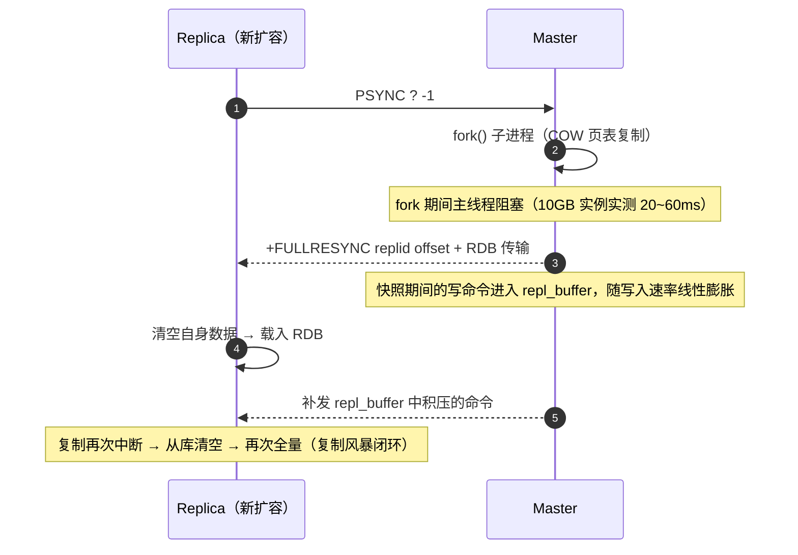
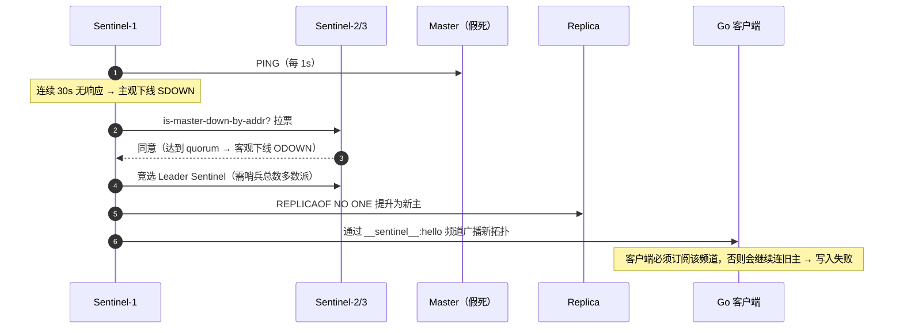
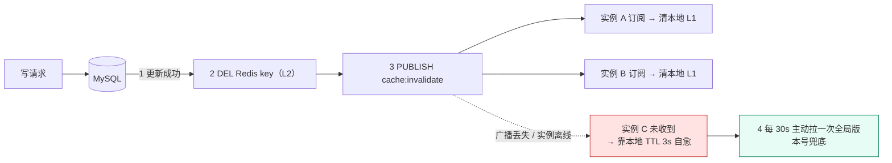

# 04 · Redis 高可用与缓存体系落地

> 属于「架构师修炼」· 阶段二（坎 2 → 坎 3）· **Redis 不是「加个缓存」，是一套高可用 + 丢写边界 + 缓存体系的工程**
> 上一篇：[03 MySQL 主从与读写分离落地](./03-MySQL主从与读写分离落地)　下一篇：[05 Kafka 削峰与可靠投递落地](./05-Kafka削峰与可靠投递落地)

> **这篇解决什么问题**：你已经在坎 2 上了 Redis，但被追问细节时答不出——「命中率多少才值得上缓存」「主从切换会丢多少数据」「哨兵和 Cluster 怎么选」「生产为什么必须配 `min-replicas-to-write`」「缓存雪崩为什么能把 DB 打死」。这一篇不讲 skiplist、不讲 IO 多路复用（那是 [S2 Redis](/后端技术栈强化/02-redis/持久化与高可用) 的事），只讲**演进决策、落地参数、故障边界**：每个配置项都给数字，每个方案都说清「丢数据的窗口在哪」。

---

## 一、为什么坎 2 才上缓存：先算收益，再谈架构

### 1.1 缓存的两个前置条件

缓存不是「性能优化」，是**用内存买 DB 的读压力**。这笔买卖只在两个条件同时成立时才划算：

| 条件 | 量化判断 | 不成立会怎样 |
| --- | --- | --- |
| **读多写少** | 读:写 ≥ 10:1（理想 50:1 以上） | 写比例高时每次写都要失效缓存，命中率被反复打掉，**不一致窗口 × 写频次**，收益归零 |
| **热点集中** | Top 20% 的 key 承载 80%+ 的读 | 均匀访问（如全站随机 ID 遍历）下命中率上不去，内存全用来存只读一次的冷数据 |

坎 0/坎 1（< 1,000 QPS）**不该上缓存**：MySQL 单机点查 1k~5k QPS 就够用，此时上缓存只是白送一个不一致风险 + 一个故障点（见 [00 篇](./00-架构师思维与设计方法论)的反面清单）。层级选择上，坎 1 可用进程内 LRU（延迟 ~100 ns，但多实例间不一致），坎 2 才上集中式 Redis（0.2~1 ms，单机可放数十 GB），坎 4 才是「本地 L1 + Redis L2」多级缓存，坎 5 才是 CDN 边缘。

### 1.2 命中率收益测算（必须给数字）

核心公式只有一个：

```text
DB 承接读 QPS = 原始读 QPS × (1 - 命中率)
回源放大     = miss QPS × 并发合并因子（无 singleflight 时可达 miss QPS 的数倍）
缓存内存     = 热点条数 × 单条大小 × 冗余系数（1.5~2，含哈希表/过期字典/sds 开销）
```

以**原始读 20,000 QPS**（坎 2 典型值）为例：

| 命中率 | DB 承接读 QPS | 相对无缓存 | 判断 |
| --- | --- | --- | --- |
| 0%（缓存没生效） | 20,000 | 100% | 缓存白上，还多了故障点 |
| 50% | 10,000 | 50% | **不划算**：DB 仍在 2 倍过载区，缓存复杂度已经付了 |
| **80%** | **4,000** | **20%** | **临界点**：接近 MySQL 单机简单查询上限（1k~5k），刚好安全 |
| 90% | 2,000 | 10% | 明显划算，DB 有 2 倍余量 |
| 95% | 1,000 | 5% | 单机 Redis 不是瓶颈了，开始看带宽 |
| 99% | 200 | 1% | 进入多级缓存区间（本地 L1 + Redis L2，坎 4） |

> **结论（面试可直接说）**：**命中率低于 80% 时，缓存的收益不足以覆盖不一致风险与运维成本**。上缓存前必须先做一件事——用 `slow log` + 索引治理把可缓存的读挑出来，否则缓存的是一堆本该被优化掉的慢查询。内存成本也要算：100 万条热点 × 单条 5 KB × 冗余 1.8 ≈ **9 GB**，落在 16 GB 实例上、`maxmemory` 设 12 GB（物理内存 75%），刚好是坎 2 的单实例上限。

---

## 二、复制机制落地：异步复制决定了丢写窗口

> 原理（RDB/AOF 格式、复制拓扑）见 [持久化与高可用](/后端技术栈强化/02-redis/持久化与高可用)。这里只讲**参数怎么算、代价在哪**。

### 2.1 PSYNC2：增量重同步的前提是 backlog 够大

Redis 4.0+ 的 **PSYNC2**：从库重连时上报 `replid + offset`，主库检查这段 offset 是否还在 **repl backlog**（环形缓冲区）里——在则返回 `+CONTINUE`（增量补齐，传几 KB），不在则返回 `+FULLRESYNC`（全量重来：fork + 落 RDB + 传数十 GB + 从库清空重放）。所以 `repl-backlog-size` 是**全量同步频率的唯一开关**：

```text
所需 backlog = 主库写入速率 × 允许的最长从库断线时间 × 安全系数(2)

例：峰值写 8 万 QPS × 平均 200 字节 ≈ 16 MB/s
    允许从库断线 60 s 不触发全量 → 16 MB/s × 60 s × 2 ≈ 1.9 GB
    默认 repl-backlog-size 只有 1 MB → 只覆盖 0.06 s！一断线必然全量
```

| 参数 | 推荐值 | 说明 |
| --- | --- | --- |
| `repl-backlog-size` | 256 MB ~ 1 GB（按上式算，宁大勿小） | 只占内存不落盘，是所有高可用方案里最便宜的一笔投入 |
| `repl-backlog-ttl` | 3600 | 最后一个从库断开后 backlog 保留 1 小时，期间重连仍可增量 |
| `repl-ping-replica-period` | 10 | 主库每 10 s 向从库发 PING，用于检测存活 + 维持心跳 |
| `repl-timeout` | 60 | 超过 60 s 无响应判定断开；**必须大于 `repl-ping-replica-period`**，否则正常心跳被误判 |
| `client-output-buffer-limit replica` | `512mb 128mb 60` | 从库消费慢时最多缓存 512 MB，硬限 128 MB/60 s 后主库主动断开该从库 |
| `repl-diskless-sync-delay` | 5 | 无盘复制下等 5 s，让多个从库**共享同一份 RDB**（复制风暴的关键参数） |

### 2.2 全量同步的代价与复制风暴



| 复制风暴形态 | 触发 | 后果 | 解法 |
| --- | --- | --- | --- |
| **同时全量** | N 个从库同时启动/重启 | 主库 fork N 次、CPU 抖动、带宽打满 | `repl-diskless-sync-delay 5` 合并共享一份 RDB；错峰重启；扩容前先拷快照 |
| **全量循环** | backlog 太小 + 网络抖动 | 每次抖动都全量，从库永远追不上 | 加大 `repl-backlog-size`；检查 `client-output-buffer-limit` 是否把从库踢了 |
| **级联放大** | 从库再挂从库 | 主库带宽被上层复制吃掉 | **树状/级联复制**：主 → 从A → {从B, 从C}，把压力下沉到从A |

从库的从库就是普通的 `replicaof <从A的IP> 6379`。**主从拓扑必须显式设计成树状**，否则扩容会从「加读能力」变成「打挂主库」。

### 2.3 从库只读与「读从库」的前提

`replica-read-only yes`（默认）让从库拒绝写命令，防止误写导致主从不一致。

> ⚠️ **从库不是"另一个主库"**：从库读到的数据受**主从延迟**影响，写了立刻读会读到旧值。这既是 [03 篇](./03-MySQL主从与读写分离落地)主从延迟的 Redis 版本，也是 [08 篇](./08-缓存与DB一致性落地)延迟双删必须按主从延迟估 Δ 的原因。

### 2.4 异步复制的丢写窗口量化（本节最重要）

Redis 复制**默认全异步**：主库执行完命令就返回成功，**不等从库**。因此：

```text
丢写窗口 = 从「最后一条成功同步到从库的 offset」到「主库故障时刻」之间的所有写
丢失条数 ≈ 主库写 QPS × 切换感知与同步滞后时间
```

以**写 5 万 QPS** 估算：

| 配置 | 本机持久化窗口 | 主从切换丢写窗口 | 最大丢失条数 | P99 代价 |
| --- | --- | --- | --- | --- |
| 无持久化 + 异步复制 | 全丢（重启即空） | 10~30 s | **50 万~150 万** | 最低 |
| RDB 每 5 分钟 + 异步复制 | ≤ 5 min | 同左 + 主从 lag | 更差 | 低（fork 抖动） |
| `appendfsync everysec` | ≤ 1 s | 10~30 s | 50 万+ | 低（推荐） |
| `appendfsync always` | 0 | 仍为主从 lag | 仍有数十万 | +0.5~2 ms/写 |
| `WAIT 1 100`（同步等待） | 0~1 s | ≈ RTT + 从库执行（1~3 ms） | 数百条 | +0.5~1 ms |
| 云托管多可用区强同步 | 接近 0 | 接近 0（多数派确认） | ~0 | +1~2 ms，成本更高 |

**三个必须讲清的结论**：

1. **持久化不解决切换丢写**。`appendfsync always` 只保证「本机重启不丢」，切换丢写由**复制语义**决定。
2. **`WAIT numreplicas timeout` 只是缩小窗口，不是消除**。它不改变故障转移语义：旧主恢复后仍会被清空做全量同步，那部分数据回不来。
3. **要真正不丢需要多数派共识**（Raft 类）。原生 Redis 没有，只能用云厂商强同步版，或把关键数据放 MySQL 半同步 / etcd（[10 篇](./10-etcd与Raft选主租约落地)）。

---

## 三、高可用选型：主从 + 哨兵 vs Cluster vs 云托管

### 3.1 哨兵：主观/客观下线与切换代价



| 参数 | 推荐值 | 含义与坑 |
| --- | --- | --- |
| `sentinel monitor mymaster <ip> 6379 2` | quorum = 2（3 哨兵） | **quorum 是 ODOWN 的票数门槛，不是多数派**；选举 Leader 仍需哨兵总数的多数派 |
| `sentinel down-after-milliseconds` | 30000 | 判定 SDOWN 的时间；调小 = 切换快但误判多 |
| `sentinel failover-timeout` | 180000 | 同一 master 两次 failover 的最小间隔 + 整个切换流程超时 |
| `sentinel parallel-syncs` | 1 | 切换后让从库**串行**同步新主；调大恢复快但可能把新主压死（同时全量） |
| 哨兵节点数 | **3 或 5（奇数）** | 2 个哨兵无法形成多数派，1 个是单点 |

**切换期间的写不可用时间**（面试必答）：

```text
最坏路径 = down-after-milliseconds(30s) + Leader 选举(1~3s) + 提升与角色切换 + 客户端拓扑刷新
实测典型 10 ~ 30 s；写请求在此期间全部失败（读仍可从旧从库读）
```

**切换后的数据丢失**：新主用的是**它自己已复制的 offset**，旧主上未被复制的写**永久丢失**（5w QPS × 15 s ≈ 75 万条）；更关键的是**旧主恢复后会被降级为从库并清空自己的数据做全量同步，那部分数据不可回收**——这是「Redis 不适合放关键数据」的根本原因。**客户端必须支持哨兵发现**：`redis.NewClient(单地址)` 切换后会一直连旧主（写失败且不自愈），必须用 `redis.NewFailoverClient`。

### 3.2 Cluster：分片 + 重定向

| 机制 | 细节 | 落地注意 |
| --- | --- | --- |
| **16384 槽** | `slot = CRC16(key) mod 16384`，每槽归属一个主分片 | 分片数 = 主节点数（建议 ≤ 1000 节点）；扩缩容以「槽」为最小迁移单位 |
| **MOVED** | 槽永久归属其他节点 → 客户端**更新本地 slot 表**后重试 | 客户端必须实现（go-redis `MaxRedirects`），否则直接报错 |
| **ASK** | 槽**正在迁移** → 本次请求去目标节点，**不更新 slot 表** | 迁移期 MOVED/ASK 同时出现，客户端要能区分 |
| **槽迁移** | 源节点置 MIGRATING、目标置 IMPORTING，逐 key `MIGRATE` | 同一槽的 key 分布在两节点，**多 key 命令可能报 CROSSSLOT** |
| **hash tag** | `{user:1000}:profile` 与 `{user:1000}:cart` 同槽 | 多 key 操作的唯一解法；滥用会让分片不均（整个 key 家族落一个节点） |
| **多 key 限制** | MGET/MSET/Lua/事务要求所有 key 同槽 | 跨槽需求 → 客户端按槽分组并发（Pipeline 分槽）或改数据模型 |
| `cluster-node-timeout` | 15000 | 超过 15 s 判定节点故障；调小切换快但抖动误判 |
| `cluster-require-full-coverage` | yes（默认） | **yes**：任一槽不可用则整个集群拒写（一致性优先）；**no**：部分可用但读到不完整数据 |

### 3.3 选型决策表（A4 级回答就靠这张表）

| 维度 | 主从 + 哨兵 | Redis Cluster | 云托管（多可用区） |
| --- | --- | --- | --- |
| 容量上限 | **单机内存**（建议实例 ≤ 32 GB） | 水平扩展至 TB 级 | 按规格，可在线升配 |
| 单 key QPS 上限 | ~8w~10w（单线程 + 网络） | 分片分摊，单分片仍 ~10w | 同 Cluster，另有代理层 |
| 多 key 事务 / Lua | **完整支持** | 需同槽（hash tag） | 视实现，通常同 Cluster |
| 客户端复杂度 | 需支持哨兵发现 | 需支持 MOVED/ASK | 兼容单机协议（代理模式） |
| 写不可用时间 | 10~30 s | 分片级 3~10 s | 厂商 SLA，通常 < 10 s |
| 运维成本 | 中 | **高**（槽迁移、扩缩容、热点分片） | **低** |
| 丢写窗口 | 切换期未同步写全丢 | 同上，且**单槽迁移期可能顺序错乱** | 强同步版可接近 0 |
| 适用边界 | 数据量 < 单机内存，需多 key 原子性 | 数据量 > 单机内存，或单实例带宽到顶、需在线扩容 | 团队 < 3 人 / 无 Redis 专家 |

**决策顺序**：先问「数据量是否小于单机内存、单实例 QPS 是否低于 8w」——是则选主从 + 哨兵（**默认选择**）；否则进 Cluster。再做第二个判断：**需要多 key 事务 / Lua / 复杂聚合吗**？需要就更要留在主从 + 哨兵（Cluster 下这些能力受同槽限制）。最后问「团队有没有 Redis 专家」——没有就买云托管，用成本换人力。

> **一句话**：**默认选主从 + 哨兵**（简单、能力完整）；只有当「单机内存装不下」或「单实例带宽/QPS 到顶」时才上 Cluster。**分片解决容量与带宽，不解决可用性**——可用性靠副本与哨兵。

---

## 四、防脑裂与持久化参数（生产必配）

### 4.1 两个把「静默丢数据」变成「显式报错」的参数

```ini
# 主库：健康的从库（延迟 ≤ 10s）少于 1 个时，拒绝所有写
min-replicas-to-write 1
min-replicas-max-lag 10
```

**为什么能减少丢写**：网络分区时，少数派那半边的主库仍然活着、也能接写，但它的写**永远不会被复制出去**，旧主回归时全部丢失——最可怕的是**客户端毫无感知**（写返回了 OK）。配上这两个参数后，主库发现自己「联系不上健康从库」就拒绝写，客户端收到 `(error) NOREPLICAS Not enough good replicas to write.`。丢数据从「静默发生」变成「客户端立刻收到错误 → 重试/降级/告警」。**这是生产 Redis 唯一能兜住脑裂丢写的开关**，代价是分区期间本来可用的写也变得不可用——这是一次正确的 CP 取舍。Cluster 场景下每个分片的主节点都要配。

### 4.2 持久化与复制的分工（别混淆）

| 配置 | 解决什么问题 | 丢数据窗口 | P99 影响 | 适用 |
| --- | --- | --- | --- | --- |
| 无持久化 | 无 | 重启即全丢 | 无 | 纯缓存，DB 可完整重建 |
| RDB（`save 300 10`） | 快速重启恢复 | 最多 5 分钟 | fork 抖动（内存越大越明显） | 缓存 + 可容忍重建 |
| **AOF `everysec`** | 本机重启不丢 | **≤ 1 s** | 低（后台 fsync） | **推荐默认** |
| AOF `always` | 本机几乎不丢 | ~0 | +0.5~2 ms/写 | 少量不可丢的 key（会话、队列、计数器） |
| AOF `no` | 交给 OS | ≤ 30 s | 最低 | 不推荐，收益小于风险 |
| 主从复制 | **单机故障时仍可服务** | 切换期未同步写全丢 | 无（异步） | 所有生产环境 |

> **关键认知**：`appendfsync everysec` 的「≤1 s」只描述**本机**；客户端感知的丢写窗口是**切换期（10~30 s）**，由复制语义决定。**优化持久化不会改善切换丢写。**

---

## 五、缓存体系落地：五类问题，一套方案

> 三种「缓存病」的病因见 [缓存问题与一致性](/后端技术栈强化/02-redis/缓存问题与一致性)。这里补上**落地参数、监控阈值与组合拳**。

| 问题 | 触发条件 | 现象 | 落地方案 | 关键参数 |
| --- | --- | --- | --- | --- |
| **穿透** | 查询**不存在**的 key（恶意 ID 遍历） | 命中率骤降、DB 全是查不到的主键查 | ① **空值缓存**（存 `__NULL__`，短 TTL）② **布隆过滤器**（不存在的 key 一定拦掉） | 空值 TTL **60 s**；布隆误判率 0.1% → 1 亿 key 约占 **1.4 GB** 位图（RedisBloom 或本地） |
| **击穿** | **单个热点 key 过期**瞬间 | 该 key 的并发请求全部回源，DB 出现尖刺 | ① **singleflight 合并回源**② **逻辑过期**（不物理过期，后台单飞重建）③ 多实例分布式重建锁 | 回源超时 **200 ms**；重建锁 `SET NX EX 3`；逻辑过期时间 **10 min** |
| **雪崩** | 大量 key **同时过期**或 Redis 整体不可用 | DB 被瞬间打挂，P99 从 20 ms 涨到 10 s | ① TTL **随机抖动 ±20%** ② 多级缓存 ③ **限流兜底** ④ 高可用（哨兵/Cluster） | 基础 TTL 600 s + `rand(0,120)`；网关按 DB 承载能力限流 |
| **热 key** | 单 key QPS > 5w | 单分片/单线程打满，其他 key 被拖慢 | ① **本地 LRU**（TTL 1~3 s）② **key 打散**（`key:{1..8}` 分片后聚合）③ 读走只读从库 | 本地容量 1000~5000 条；打散份数 = 峰值 QPS / 5w（取 8~32） |
| **大 key** | 单 value > 1 MB 或集合 > 5000 元素 | `DEL`/`HGETALL` 阻塞单线程，P99 抖动到秒级 | ① **拆分**（Hash 按 field 分桶）② **压缩**（zstd）③ **`UNLINK` 异步删除**④ `HSCAN`/`SSCAN` 分批 | 告警阈值：String > **10 KB**、集合 > **5000** 元素、单 key > **1 MB** |

**必看监控**：`redis-cli --bigkeys`（基于 SCAN 遍历，只在从库/低峰跑）、`MEMORY USAGE <key>`（单 key 真实内存）、`SLOWLOG`（阈值 10 ms，出现 `DEL`/`HGETALL`/`KEYS` 就是事故前兆，生产**禁用 `KEYS`**）。复制健康看 `INFO replication` 里的 **`master_repl_offset - slave_repl_offset`**——这个字节差除以主库写速率就是主从滞后秒数（滞后 16 MB ÷ 16 MB/s = 1 s），比任何二手指标都直接。

---

## 六、多级缓存与容量规划

### 6.1 本地缓存（L1）+ Redis（L2）的一致性问题

多级缓存收益很大（L1 命中率 60%~90%，把热 key 从 Redis 手里彻底拿走），代价是**本地缓存成了"每实例一份的副本"，失效必须广播**：



| 失效广播方案 | 可靠性 | 延迟 | 代价 |
| --- | --- | --- | --- |
| **Redis Pub/Sub** | **不持久**，实例离线期间消息丢失；主从切换会断订阅 | < 10 ms | 最简单，必须配短 TTL 兜底 |
| Redis Stream（消费组） | 持久 + 位点，可重放 | 10~100 ms | 需维护消费组与裁剪策略 |
| **etcd Watch** | 强一致 + revision 补偿，**不丢事件** | 10~50 ms | 每次失效写 etcd（共识成本），见 [10 篇](./10-etcd与Raft选主租约落地) |
| 版本号轮询 | 最终一定收敛 | 轮询周期 5~30 s | 只能兜底，不能实时 |

**生产组合**：`Pub/Sub 广播（快） + 本地 TTL 3 s（兜底） + 启动时清空 L1 + 每 30 s 拉一次版本号（对抗长连接静默失效）`。**只要用了本地缓存，就必须承认"广播一定会丢"——短 TTL 不是可选项，是必需品。**

### 6.2 容量估算与淘汰策略

```text
内存需求 = 热点条数 × 单条大小 × 1.5~2
例：500 万条 × 2 KB × 1.8 ≈ 18 GB → 32 GB 实例，maxmemory 24 GB（物理内存 75%）
```

| `maxmemory-policy` | 行为 | 适用 | 坑 |
| --- | --- | --- | --- |
| `noeviction` | 内存满**拒绝写**（OOM） | 混布了不能丢的 key（会话、队列、计数器） | 缓存写失败直接抛错到业务 |
| **`allkeys-lru`** | 所有 key 中淘汰最久未用 | **纯缓存首选** | 冷启动命中率低 |
| `allkeys-lfu` | 按访问频率淘汰（4.0+） | **热点集中度高**（长尾访问多）优于 LRU | 需时间积累频次 |
| `volatile-lru` / `volatile-ttl` | 只淘汰**设了 TTL** 的 key | 缓存 + 持久 key 混布 | **没有带 TTL 的 key 可淘汰时退化为 noeviction → 写全部失败**（经典事故） |

其余必看指标：`used_memory / maxmemory` 水位 **< 70%**（> 85% 紧急扩容）；`mem_fragmentation_ratio` 1.0~1.5 健康，**> 2** 且 RSS 持续增长则开 `activedefrag yes` 或主从切换重建；`connected_clients` < 5000/实例（超出用连接池 + 代理聚合）。

---

## 七、Go 落地（go-redis/v9）

### 7.1 客户端：超时与重试是第一优先级

```go
// Cluster：MOVED/ASK 重定向 + 严格超时 + 重试退避
rdb := redis.NewClusterClient(&redis.ClusterOptions{
    Addrs:           []string{"10.0.0.1:6379", "10.0.0.2:6379", "10.0.0.3:6379"},
    MaxRedirects:    3,                      // 槽迁移期必须给重定向留次数
    RouteByLatency:  true,                   // 读路由到延迟最低节点（含从库）
    DialTimeout:     500 * time.Millisecond,
    ReadTimeout:     200 * time.Millisecond, // 必须显式设置！默认 3s 会拖死整条请求链
    WriteTimeout:    200 * time.Millisecond,
    PoolSize:        50,                     // 每节点池大小 ≈ 峰值QPS / 单连接QPS
    MinIdleConns:    10,
    MaxRetries:      2,                      // 只重试网络类错误
    MinRetryBackoff: 8 * time.Millisecond,
    MaxRetryBackoff: 512 * time.Millisecond,
})
```

哨兵模式换成 `redis.NewFailoverClient(&redis.FailoverOptions{MasterName: "mymaster", SentinelAddrs: [...], ReadTimeout: 200ms, PoolSize: 50, MinIdleConns: 10})`——**关键是 `MasterName`**：主库地址由哨兵解析并随切换自动刷新，写死单地址的 `NewClient` 在切换后会一直连旧主。

> ⚠️ **`MaxRetries` 的陷阱**：重试发生在「命令可能已执行但响应超时」的场景，**非幂等命令（`INCR`、`LPUSH`）会被重复执行**。要么用幂等写法（业务幂等键，见 [11 篇](./11-幂等去重与ExactlyOnce)），要么对这类命令把 `MaxRetries` 设为 0。

### 7.2 Pipeline 与 Lua：减少 RTT、保证原子

```go
// Pipeline：把 N 次网络往返压成 1 次（只减少 RTT，不保证原子）
pipe := rdb.Pipeline()
c1 := pipe.Get(ctx, "user:1001:profile")
c2 := pipe.Get(ctx, "user:1002:profile")
_, _ = pipe.Exec(ctx)
v1, _ := c1.Result()

// Lua：原子「计数 + 首次设 TTL」，避免 INCR 后进程崩溃导致 key 永不过期
const script = `
local n = redis.call('INCR', KEYS[1])
if n == 1 then redis.call('EXPIRE', KEYS[1], ARGV[1]) end
return n`
n, _ := rdb.Eval(ctx, script, []string{"hot:cnt:post:1001"}, 600).Int64()
```

> Lua 跑在 Redis 单线程里：**脚本必须短（< 1 ms）、禁止循环大数据、禁止 `KEYS`**，否则阻塞所有请求，等同一次慢查询事故。

### 7.3 singleflight 回源：防击穿的标准写法

```go
var g singleflight.Group

// GetOrLoad：缓存 → 单飞回源 → 回填（含空值缓存 + TTL 抖动）
func GetOrLoad(ctx context.Context, rdb *redis.Client, key string,
    load func(context.Context) (string, error)) (string, error) {

    if v, err := rdb.Get(ctx, key).Result(); err == nil {
        if v == "" { // 空值缓存命中：数据确实不存在
            return "", nil
        }
        return v, nil
    } else if !errors.Is(err, redis.Nil) {
        metrics.Inc("cache_error") // Redis 故障：只记指标，降级策略见「故障与一致性边界」
    }

    // singleflight：同一 key 的并发请求只放一个进回源逻辑（进程内合并，防击穿）
    v, err, _ := g.Do(key, func() (any, error) {
        if val, err := rdb.Get(ctx, key).Result(); err == nil { // 双检：可能已被前一个填好
            return val, nil
        }
        // 回源必须带独立超时：缓存挂了不能把请求链拖死（雪崩的第一道闸门）
        lctx, cancel := context.WithTimeout(ctx, 200*time.Millisecond)
        defer cancel()

        row, err := loadRowFromDB(lctx, key)
        if err != nil {
            return "", err
        }
        if row == nil {
            _ = rdb.Set(ctx, key, "", 60*time.Second).Err() // 空值缓存 60s，防穿透
            return "", nil
        }
        ttl := 600*time.Second + time.Duration(rand.Int63n(120))*time.Second // ±20% 抖动防雪崩
        _ = rdb.Set(ctx, key, row.Value, ttl).Err()                          // 回填失败只记指标
        return row.Value, nil
    })
    if err != nil {
        return "", err
    }
    return v.(string), nil
}
```

> **singleflight 的边界**：它只合并**单进程内**的并发请求。多实例下 N 个实例仍会发起 N 次回源，热点 key 需要补一层分布式重建锁（`SET lock:key 1 NX EX 3`，抢到的实例回源，其余重试或返回旧值）。**锁本身也是故障点，只对确认为热点的 key 启用。**

---

## 八、演进触发指标：什么时候进坎 4

| 指标 | 阈值 | 含义 | 演进动作 |
| --- | --- | --- | --- |
| **单 key QPS** | **> 5w** | 热点 key，单线程到顶 | 本地 L1 缓存 + key 打散（→ 多级缓存） |
| **内存水位** | **> 70% 持续 1 h** | 容量接近上限 | Cluster 扩分片 / 冷热分离 / 缩短 TTL |
| **主从滞后** | `offset` 差 > 16 MB 或 > 500 ms | 从库跟不上 | 加大带宽、拆实例、消灭大 key |
| **切换抖动 / 带宽** | failover > 30 s 或每月 > 2 次；带宽 > 网卡 60% | 哨兵或网络成为瓶颈 | 换 Cluster 或云托管多可用区；分片 |
| **缓存命中率** | < 80% 持续 | 缓存没打中要害 | 重建 key 模型 + 预热 + 检查 key 设计 |

> **演进路径**：单机 Redis →（内存/带宽到顶）→ Redis Cluster →（单 key 热点 + 跨分片聚合）→ 本地 L1 + Redis L2 + 广播失效 →（跨机房）→ 单元内自治 + 就近缓存。

---

## 故障与一致性边界

> **面试的终极问题**：「Redis 这层挂了，你丢什么、丢多少、业务还能不能活？」

| 组件/场景 | 现象 | 处理 | 一致性边界（丢数据的窗口在哪） |
| --- | --- | --- | --- |
| **Redis 主挂** | 写报错/超时，读仍可从从库读 | 哨兵 10~30 s 完成切换；客户端用 `NewFailoverClient` 自动发现；期间写失败 → 业务重试或降级 | **未同步到从库的写全部丢失**：窗口 = 最后一次成功复制到故障时刻（5w QPS × 15 s ≈ 75 万条）。旧主恢复后被清空做全量同步，**数据不可回收** |
| **脑裂（网络分区）** | 少数派主库仍在接写，客户端无感知 | `min-replicas-to-write 1` + `min-replicas-max-lag 10` → 健康从库不足时返回 `NOREPLICAS`；客户端重试/降级/告警 | 不配参数：分区期间写入少数派的**全部数据**在旧主回归时丢失，窗口 = 分区时长（可达分钟级）。**这是 Redis 最危险的静默丢数据** |
| **Redis 全挂** | 命中率跌到 0，请求全部回源 | **必须先限流再降级**：网关按 DB 承载能力放行（如 3,000 QPS）；非核心功能降级返回兜底数据；DB 侧用只读从库分摊 | 缓存数据全丢但 **DB 是事实源 → 数据不丢**，丢的是**可用性**。**绝不能"Redis 挂了就无限直连 DB"** |
| **雪崩 → DB 级联**（最经典事故） | DB CPU 100% → 连接池满 → 慢查询堆积 → 上游超时 → 全链路 5xx | ① 预热 + TTL 抖动 ② 网关限流（真正的闸门）③ 熔断降级 ④ DB 代理快速失败 ⑤ 事后：多级缓存 | 数据不丢，**损失的是整个系统可用性**。链路：缓存失效 → 回源洪峰 → DB 打挂 → 连接堆积无法自愈 → 全站不可用。**缓存的降级路径必须自带限流，否则"降级"就是"自杀"** |
| **Cluster 槽迁移** | 请求返回 `MOVED`/`ASK`，客户端未处理则报错 | 客户端必须支持重定向（`MaxRedirects: 3`）；迁移放低峰；分批控制槽与 key 数 | 迁移期同一槽的 key 分布在两节点，**并发写同一 key 可能后写覆盖先写（顺序错乱）**——不丢数据但可能读到中间态 |
| **大 key 阻塞** | `DEL`/`HGETALL`/`KEYS` 阻塞单线程，P99 抖动到秒级 | `UNLINK` 异步删、`HSCAN` 分批、拆分；`SLOWLOG` 10 ms 告警 | 数据不丢；窗口是**慢查询期间的请求超时**，表现为可用性抖动而非数据错误 |
| **Redis 重启（无持久化）** | 内存全丢，命中率 0 | 有 AOF/RDB 则按 `appendfsync` 策略恢复（≤1 s 丢失）；无持久化按「Redis 全挂」限流处理 | 纯缓存可从 DB 完整重建；若是会话/计数器（无 DB 兜底）→ **永久丢失**，这类 key 必须开 AOF |
| **缓存与 DB 不一致** | 用户读到旧值 | Cache Aside + 延迟双删 + binlog 订阅 + 对账（**详见 [08 篇](./08-缓存与DB一致性落地)**） | 缓存是**派生副本**，不一致 = 「读到旧的」而非「数据丢了」；**DB 永远是事实源，冲突一律以 DB 覆盖缓存** |

---

## 面试追问链

1. **「为什么坎 2 才上缓存，坎 1 为什么不？」**
   → 缓存的前提是读多写少 + 热点集中，且要算命中率收益：`DB 读 QPS = 原始读 QPS × (1 - 命中率)`。命中率低于 80% 时 DB 压力仍在其承载上限附近，而你已经付出了不一致风险和运维成本。坎 1（1,000 QPS）下 MySQL 单机够用，缓存边际收益接近零，属于「拿复杂度换虚荣心」。

2. **「Redis 主从切换会丢数据吗？丢多少？怎么减少？」**
   → 会。复制默认全异步，写返回成功时数据只在主库内存；丢写窗口 = 切换感知 + 同步滞后，实测 10~30 s，5w QPS 下最多丢几十万条，且**旧主恢复后被清空，数据不可回收**。减少手段：① 加大 `repl-backlog-size` 避免抖动触发全量；② `WAIT 1 100` 把窗口压到毫秒级；③ 关键数据不放 Redis，改用 MySQL 半同步或 etcd；④ 要真正不丢只能用多数派共识。

3. **「哨兵和 Cluster 怎么选？」**
   → 默认主从 + 哨兵：运维最简单、支持多 key 事务和 Lua、能力最完整，适合数据量 < 单机内存。只有当「单机内存装不下」或「单实例带宽/QPS 到顶、需要在线扩容」时才上 Cluster，代价是多 key 操作要靠 hash tag 同槽、客户端要处理 MOVED/ASK、槽迁移有运维风险。**分片解决容量与带宽，不解决可用性。**

4. **「缓存雪崩把 DB 打挂了，你怎么防？」**
   → 三层：① 事前——TTL 加 ±20% 抖动、热点预热、多级缓存；② 事中——网关按 DB 承载能力限流（真正的闸门），熔断降级非核心功能；③ 事后——DB 代理层快速失败，避免连接池堆积导致 DB 无法自愈。核心认知：**缓存的降级路径必须自带限流**，因为命中率 80%~99% 意味着 DB 平时只承担 1%~20% 的流量，一旦回源就是 5~100 倍的冲击。

5. **「`min-replicas-to-write` 是干什么的，为什么生产必配？」**
   → 语义是「健康从库（延迟 ≤ `min-replicas-max-lag`）少于 N 个时拒绝写」。作用是把脑裂场景下的**静默丢数据变成显式错误**：分区时少数派主库本来会继续接受写入（客户端收到 OK 但数据永远不会被复制，旧主回归时全丢），配了参数后它直接返回 `NOREPLICAS`，客户端能立刻重试或降级。代价是分区期间牺牲写可用性——一次明确的 CP 取舍，但对「宁可报错，不可静默丢数据」的系统是唯一正确的选择。

## 自测清单

- [ ] 能用公式算出「命中率 80% 时 DB 还剩多少 QPS」，并说出为什么 80% 是临界点
- [ ] 能按「写入速率 × 断线容忍时间 × 2」算出 `repl-backlog-size`，并解释默认 1 MB 为何引发全量同步
- [ ] 能画出写入被异步复制丢掉的时间线，给出 10~30 s 切换窗口并量化丢失条数
- [ ] 能说清哨兵 SDOWN/ODOWN/quorum/Leader 选举四步，以及 `parallel-syncs 1` 为什么这么配
- [ ] 能解释 MOVED 与 ASK 的区别、hash tag 为什么能解决跨槽问题
- [ ] 能说出 `min-replicas-to-write` + `min-replicas-max-lag` 如何减少丢写，代价是什么
- [ ] 能针对穿透/击穿/雪崩/热 key/大 key 各给出一套「参数 + 监控阈值」方案
- [ ] 能讲清「缓存雪崩 → DB 级联 → 全站不可用」的完整链路，并说出限流为什么必须在降级之前

> **下一篇**：[05 Kafka 削峰与可靠投递落地](./05-Kafka削峰与可靠投递落地) —— 当缓存解决不了**写**的压力时，就该把请求先落进 MQ 里排队。
