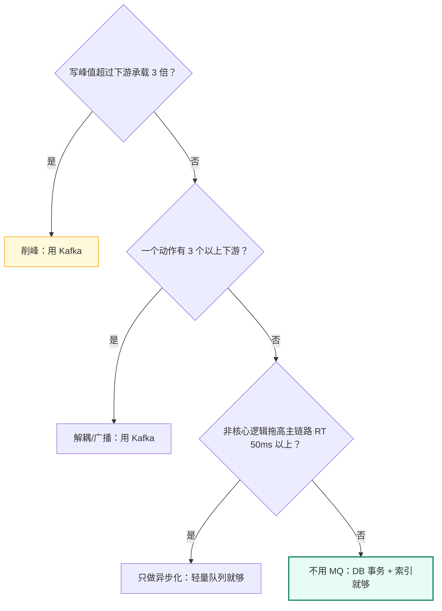
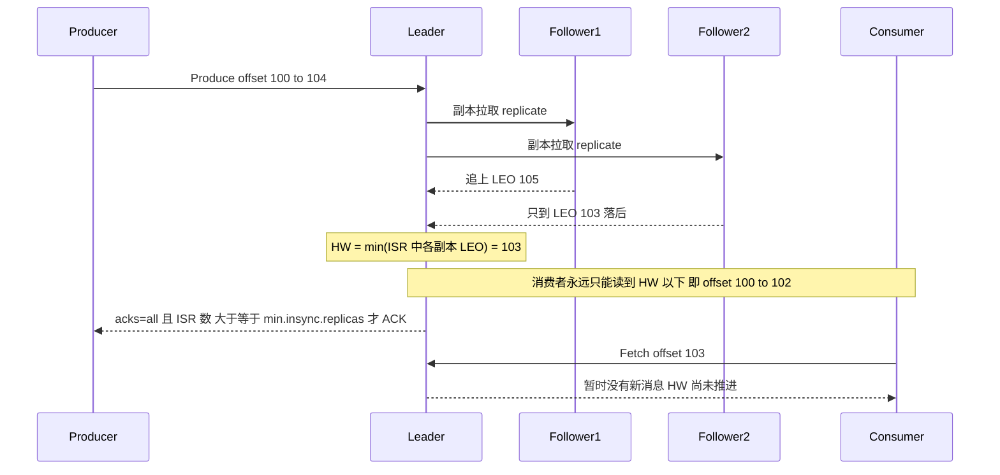
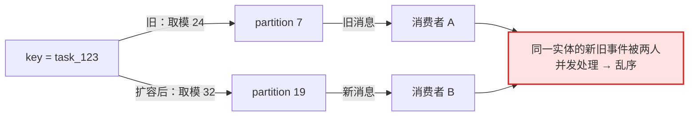
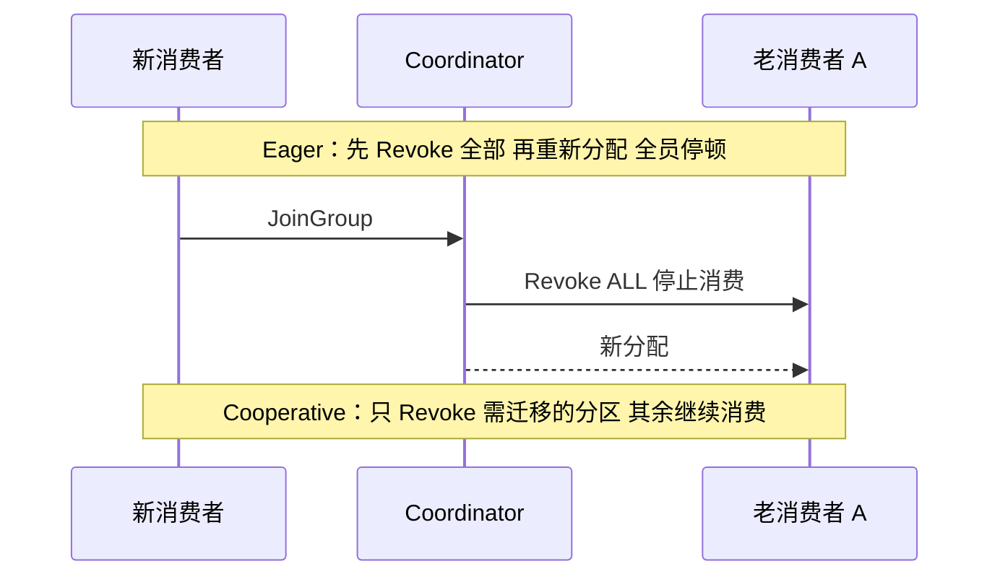

# 05 · Kafka 削峰与可靠投递落地

> 属于「架构师修炼」· 阶段三（坎 3 · 10 万 QPS）· **把写峰值从数据库手里抢过来**
> 上一篇：[04 Redis 高可用与缓存体系落地](./04-Redis高可用与缓存体系落地)　下一篇：[06 分库分表与在线迁移双写](./06-分库分表与在线迁移双写)

> **这篇解决什么问题**：坎 3 第一个撑不住的组件是**写**。MySQL 单实例带事务的写入只有 **2k~5k TPS**，而活动/爆款峰值写能到 3 万 QPS——**加机器救不了单库写**。这一篇不重复 Kafka 的内部原理（原理见 [架构与存储](/后端技术栈强化/03-kafka/架构与存储)），只回答四个落地问题：**① 什么时候才该引入 MQ？② 分区数怎么算出来？③ 哪些参数组合真的不丢数据、代价是什么？④ 积压和 rebalance 真发生了怎么处置？** 每条结论都带参数名、数值和代价。

## 一、先决策：什么时候才该引入 MQ

新手最容易犯的错不是「不会用 MQ」，而是**在对量级用错工具**：把强一致的即时读写塞进 MQ，或者用线程池硬扛数量级差异。所以先立判据。

### 1.1 四种动机，四套判据

| 动机 | 判据（出现任一条才成立） | 量化门槛 | 引入 MQ 的收益 | 如果不引入的后果 |
| --- | --- | --- | --- | --- |
| **削峰**（写峰值 > 下游承载） | 写峰值是 DB 可持续写入能力的 **3 倍以上** | 峰值写 2w TPS，DB 只能吃 2k TPS | 峰值被队列吸收，DB 按自己的节奏消费 | 大促时 DB 打满 → 全站写超时 → 级联雪崩 |
| **解耦**（一次动作触发 N 个下游） | 一个业务动作有 **≥3** 个下游，且下游会持续新增/变更 | 下单后要通知库存/积分/风控/推荐/埋点 | 主干只发一条事件，下游各自订阅 | 主干每加一个下游就改一次代码、多一次同步依赖 |
| **广播**（一个事件多方消费） | 同一条消息需要 **≥2 个互不相关的消费逻辑** | 视频转码完成后：CDN 预热 + 通知用户 + 计费 | 多消费组各自独立进度，互不影响 | 用 RPC 扇出，任何一个下游挂了全链路挂 |
| **异步化/缓冲**（非核心链路不阻塞主链路） | 非核心动作能把主链路 RT 拖高 **> 50 ms** | 发短信、写埋点、刷 Feed | 用户拿到结果即返回，副作用后置 | 主链路 P99 被非核心逻辑绑架 |



### 1.2 明确不该用 MQ 的场景

这一节比上一节更值钱——**能说出「什么时候不用」，才是 A4 级判断**。

| 场景 | 为什么不适用 | 该用什么 |
| --- | --- | --- |
| **写后必须立即读到 / 极低延迟同步查询**（下单后立刻查详情、P99 要求 < 10 ms） | MQ 是异步的，写进队列 ≠ 写进 DB；排队 + 批处理最少也是几十毫秒级 | 同步写 DB（必要时 Cache Aside），异步只做**副作用** |
| **需要强一致的跨表事务**（转账） | MQ 只能做到最终一致，事件与本地事务之间必然有窗口 | 本地事务 + 本地消息表 / [09 分布式事务](./09-分布式事务与最终一致落地) |
| **量级根本没到 / 团队没人能运维** | < 1k QPS 写时单机 MySQL 完全够；而队列挂掉是**全局阻塞**（比 DB 慢更糟） | 先做索引优化；否则先用云服务 / 轻量方案（Redis Stream、云 MQ） |

> **一句话**：**MQ 不是「高级」，它是「拿一致性换吞吐」的交易**。交易的兑价是：多一个故障点、多一条最终一致的链路、多一套积压预案。没有这三样的准备，就不要开这个户头。

## 二、削峰能力量化：分区数怎么定

### 2.1 三条约束，取最大值

| 约束 | 公式 | 方向 |
| --- | --- | --- |
| **生产端吞吐** | 分区数 ≥ ⌈峰值生产吞吐 ÷ 单分区可持续吞吐⌉ | 太少 → 生产者被单分区打满、send 阻塞 |
| **消费端并行度** | 分区数 ≥ 期望消费者实例数 | 太少 → 加消费者也没用（**并行度上限 = 分区数**，面试高频） |
| **rebalance / 元数据成本** | 分区数 ≤ Broker 数 × 2000（ZooKeeper 模式经验值） | 太多 → rebalance 时间线性增长、controller 元数据膨胀、端到端延迟变大 |

**单分区可持续吞吐的量级**：1 KB 消息、`acks=all` + 3 副本，单分区 **1w~10w msg/s**（顺序写 + 零拷贝，见 [架构与存储](/后端技术栈强化/03-kafka/架构与存储)）；整机多分区合计 **50w+ msg/s**。**注意这是量级不是承诺**——副本数、压缩、消息大小、磁盘类型都会改变它，所以必须**先在目标环境压测出单分区实际值**再套公式。

### 2.2 算例：AI 剪辑平台的进度回调

沿用 [00 篇](./00-架构师思维与设计方法论)的算例：每任务约 20 次进度回调，日常回调 2,000 msg/s，爆款日峰值 20,000 msg/s，单条 2 KB。

```text
① 生产端：压测单分区可持续 8,000 msg/s（2KB、acks=all、3 副本）
   → 分区数 ≥ 20000 / 8000 = 2.5 → 取 3
② 消费端：单消费者批量处理 700 msg/s（每批 200 条，批处理 280ms）
   计划部署 24 个消费者实例 → 分区数 ≥ 24
③ 结论：取 max(3, 24) = 24 → 向上取到 32
   （32 便于按 3 副本均匀分布到 4 个 Broker，且留 30% 峰值余量）
④ 验证 rebalance 成本：32 分区，eager 再均衡实测 < 2s，可接受
⑤ 验证容量：32 分区 ÷ 4 Broker = 8 分区/Broker，远低于 2000 上限
```

> **为什么第三步不取 24 而是 32？** 因为**分区数只能增不能减**（Kafka 不支持减少分区），而且**扩分区会改变 key 的路由**（见第五节）。所以定分区数时留 30%~50% 余量，比事后扩容便宜得多。

### 2.3 「消费者组内并行度上限 = 分区数」为什么是硬约束

| 事实 | 原因 | 后果 |
| --- | --- | --- |
| 一个分区只能被组内**一个**消费者消费 | 分区内是**顺序日志**，offset 是单个进度游标，两个消费者共享游标会互相跳过消息 | 32 分区 + 50 个消费者 → 18 个消费者空转（白付机器钱）；分配策略只在分区数 > 实例数时才分配 |
| 加消费者必须在**加分区之后** | 分区数固定时，Consumer Group 协议不会再切出新的消费单元 | 「加了机器但 lag 还涨」的第一大原因，必须同时改分区数与实例数 |

## 三、可靠性落地参数表

可靠性的真相是：**每一档可靠性都有精确的价格，价格就是延迟、吞吐和可用性**。下面三张表是这一篇的核心资产。

### 3.1 Producer 端：acks 的三种丢数据语义

| 参数 | 语义 | 丢数据的窗口 | 吞吐 | 适用 |
| --- | --- | --- | --- | --- |
| `acks=0` | 发出即认为成功，不等任何确认 | **只要网络抖动/Leader 切换就丢**，且生产者完全不知情 | 最高（约 +30%） | 埋点、日志等可丢数据 |
| `acks=1` | Leader 写入本地日志即确认 | Leader 确认后、Follower 同步前 Leader 挂 → **已确认的消息丢失** | 高 | 允许极少丢失的非核心业务 |
| `acks=all`（`-1`） | 所有 ISR 副本写入才确认 | **ISR 收缩到 1 时退化成 `acks=1`** → 靠 `min.insync.replicas` 兜住 | 最低（比 acks=1 低 20%~40%） | 资金、订单、任务状态 |

### 3.2 Producer 端：幂等、重试与超时的联动

| 参数 | 建议值 | 作用 | 代价 / 坑 |
| --- | --- | --- | --- |
| `enable.idempotence` | `true` | 分配 **PID + 每分区单调递增 Sequence**，Broker 记录「每分区已收到的最大序号」，序号 ≤ 已收到的直接丢弃 → **消除重试导致的重复** | 只保证**单生产者会话 × 单分区**内不重；生产者重启后 PID 变、跨会话无效 |
| `acks` | `all` | 幂等的前置条件（不支持 `acks=0`） | 吞吐下降 |
| `retries` | `2147483647`（Kafka 3.0+ 默认） | 允许无限次重试，由超时兜底 | 必须靠 `delivery.timeout.ms` 收口，否则永久卡住 |
| `max.in.flight.requests.per.connection` | `5` | 单个连接上未确认的请求数 | **无幂等时必须设为 1**（重试会乱序：第 2 批重发可能落到第 1 批前面）；**开启幂等后可以 > 1**，因为 Broker 用 Sequence 拒绝乱序/重复，序号出现空洞才会报 `OutOfOrderSequenceException`。Kafka 3.0+ 默认 `enable.idempotence=true`（KIP-679） |
| `delivery.timeout.ms` | `120000` | **真正的放弃边界**：从 `send()` 到成功/失败的硬上限（含 linger + 重试 + 所有请求超时） | 超过即回调失败——**必须处理失败回调**，否则这批消息就是静默丢失 |
| `linger.ms` / `batch.size` / `compression.type` | `5~20` / `65536` / `lz4` | 攒批 + 压缩，换取吞吐 | 直接增加端到端延迟；CPU 换网络与磁盘 |

> **一个必须记住的联动**：`retries` 设为无限 + `delivery.timeout.ms=120000` ⇒ 最坏情况下 `send()` 阻塞 2 分钟才报错。**业务侧必须有超时与本地消息表兜底**（[09 篇](./09-分布式事务与最终一致落地)），不能只依赖 producer 回调。

### 3.3 Broker 端与 Consumer 端

| 端 | 参数 | 建议值 | 含义与代价 |
| --- | --- | --- | --- |
| Broker | `replication.factor` | `3` | 容忍 1 个副本挂；存储成本 ×3 |
| Broker | `min.insync.replicas` | `2` | **ISR 少于 2 个时直接拒绝写入**（`NotEnoughReplicasException`）——用**可用性换零丢失**，这是 `acks=all` 不丢的最后一道保险。ISR 收缩由 `replica.lag.time.max.ms=10000` 触发 |
| Broker | `unclean.leader.election.enable` | `false` | Leader 挂时**只从 ISR 里选**；ISR 全挂则分区不可用。设为 `true` 会选落后副本当 Leader → **HW 回退、已提交数据丢失** |
| Consumer | `enable.auto.commit` + 提交时机 | `false` + **先处理完再提交** | 自动提交的时机不可控（可能在处理前提交）→ 崩溃即丢消息。顺序反了 = 至多一次（可能丢）；正确顺序 = 至少一次（可能重） |
| Consumer | `isolation.level` / `max.poll.records` / `session.timeout.ms` | `read_committed` / `500` / `45000` | 只读**已提交事务**的消息（读到 LSO 为止），代价是长事务**阻塞消费进度**、延迟上升；每批条数决定单批处理时长，直接关联 `max.poll.interval.ms` |

## 四、ISR / HW / LEO：什么叫「已提交」

参数只是旋钮，**语义要靠机制解释**。「消息已经写成功了」这句话在 Kafka 里有三层含义，混了就会答错面试题。

### 4.1 三个游标与「已提交」的真正含义



| 概念 | 定义 | 谁在用 | 关键推论 |
| --- | --- | --- | --- |
| **LEO**（Log End Offset） | 该副本下一条要写入的位置 | 副本复制 | 各副本 LEO 不同步，差值就是积压量 |
| **ISR**（In-Sync Replicas） | 落后时间 < `replica.lag.time.max.ms` 的副本集合 | Leader 选举、`acks=all`、`min.insync.replicas` | ISR 会**收缩**：平时 3 个副本不代表出故障时还有 3 个 |
| **HW**（High Watermark）与「已提交」 | HW = `min(ISR 中各副本 LEO)`，HW 以下才对消费者可见；对 producer 而言「已提交」= **收到 ACK** | 消费者可见性 | 消费者读不到「已写未同步」的数据；`acks=1` 的 ACK ≠ committed，这就是它丢数据的根源 |

### 4.2 Leader 选举与副本追赶

| 事件 | 机制 | 数据后果 |
| --- | --- | --- |
| Leader 挂，ISR 中还有其他副本 | Controller 从 ISR 里选一个当新 Leader（优先挑 LEO 最大的） | **零丢失**已 committed 数据 |
| Leader 挂，ISR 只剩它自己（其他副本都掉队被踢） | `unclean.leader.election.enable=false` → 分区**不可用**，等副本追上来；`=true` → 选落后副本 | 前者：可用性受损；后者：**丢失落后副本没有的数据 + HW 回退导致消费者重复读** |
| Follower 追上来 / 全 ISR 挂（机房断电） | 前者从 Leader 拉取补齐后重新加入 ISR；后者 `unclean=false` 时分区持续不可用 | 追平无影响；全挂时**用可用性换一致性**——CP 式抉择 |

### 4.3 配置组合 × 丢数据可能性（必背对照表）

| 场景 | `RF` | `min.insync.replicas` | `acks` | `unclean.leader.election` | 已 ACK 消息会丢吗 | 不可用风险 |
| --- | --- | --- | --- | --- | --- | --- |
| **资金级推荐配置** | 3 | 2 | `all` | `false` | **不会**（ISR < 2 时直接拒绝写） | 同分区挂 2 副本 → 拒绝写 |
| 常见错误配置 A / B | 3 | 1 或 2 | `all` 或 `1` | `false` | **会**：`min.insync=1` 时 `all` 退化成 `1`，或 `acks=1` 后在同步前 Leader 挂 | 低 |
| 高可用优先配置 | 3 | 1 | `1` | `true` | **会**，且可能 HW 回退造成重复读 | 最低 |
| 可丢数据场景 | 3 | 1 | `0` | `true` | 网络抖动即丢，**生产端无感知**（最危险） | 最低 |

> **一句话收口**：**「不丢」= `acks=all` + `min.insync.replicas=2` + `replication.factor=3` + `unclean.leader.election.enable=false`，四个一起配才有意义**；缺任何一个，前三个都是在自欺欺人。代价是：同分区挂 2 个副本时**宁可拒写**。

## 五、顺序性与分区键

### 5.1 顺序的边界：只保证分区内有序

| 需求 | 做法 | 代价 |
| --- | --- | --- |
| 全局有序 | **单分区**（或无需有序时 key 留空、黏性分区轮询） | 吞吐上限 = 单分区（1w~10w msg/s）；消费者并行度锁死为 1；几乎没人用 |
| **同一实体有序**（最常用） | 用实体 ID 做 key：`order_id` / `user_id` / `task_id` → 哈希到同一分区 | 需要识别「什么是实体」，选错 key 就不保序 |

```go
// 关键：key 决定分区，同一实体的所有事件必须同 key
kafka.Message{
	Key:   []byte(taskID), // ✅ 业务实体 ID，不是随机 UUID
	Value: payload,
	Headers: []kafka.Header{
		{Key: "event_type", Value: []byte("progress")},
		{Key: "version", Value: []byte("7")}, // 版本号，消费端可据此重排
	},
}
```

### 5.2 分区扩容导致 key 路由变化（真实生产坑）

Kafka 默认分区器用 `hash(key) % numPartitions`（Java 客户端为 murmur2，Go 客户端见 `kafka.Murmur2Balancer`）。**`numPartitions` 从 24 改成 32，所有 key 的落点几乎全变**：



**四种缓解手段（按推荐度排序）**：

| 手段 | 做法 | 代价 |
| --- | --- | --- |
| **定数路由**（推荐） | 自定义分区器，**永远按固定 N（如 32）= 当前分区数**取模，扩展时把 N 一次性放大到目标值 | 需要自己实现与运维，且扩分区后仍有一小段迁移期 |
| 换新 Topic 双写 | 建 64 分区的新 Topic，双写 → 消费端切读新 Topic → 迁完下线旧 Topic | 迁移期双倍写入成本（同 [06 篇](./06-分库分表与在线迁移双写)的双写思路） |
| 消费端按版本号重排 | 消息带业务版本号，消费者做窗口内重排；或用**状态机 + 最终状态覆盖**（取最新 `updated_at`） | 前者引入延迟与内存；后者只适用于「可覆盖」的实体，不适用于增减量类操作 |

> **实操建议**：**分区数一次定够**；确实要扩时选低峰期、先停写 30s（或双写切换），并确认消费端对乱序有容忍度。

## 六、Rebalance：消费为什么突然停住

### 6.1 触发条件与代价

| 触发条件 | 典型场景 | 参数关联 |
| --- | --- | --- |
| 消费者加入/退出 | 发布重启、扩容、Pod 漂移 | —— |
| 心跳超时被踢 | 网络抖动、GC STW 过长、CPU 打满 | `session.timeout.ms`、`heartbeat.interval.ms` |
| **处理超时被踢** | 单批处理超过 5 分钟（如批量调用慢下游） | `max.poll.interval.ms`（默认 `300000`） |
| 订阅的 Topic 分区数变化 / 订阅关系变化 | 扩分区、改了 `GroupTopics` | —— |

**代价**：rebalance 期间**组内所有消费者停止消费**（eager 模式下）。32 分区 × 20 个消费者，一次抖动 rebalance 通常要 **2~10 秒**，期间 lag 直接抬升；如果消费者反复被踢（例如处理时长在阈值附近抖动），会陷入 **rebalance 风暴**，lag 持续单调增长。

### 6.2 Eager vs Cooperative



| 维度 | Eager（Range/RoundRobin） | Cooperative（CooperativeStickyAssignor） |
| --- | --- | --- |
| 停顿范围 | **全体消费者全部分区** | 只停需要迁移的分区 |
| 轮次 | 1 轮 | 可能 2 轮 |
| 分区搬家量 | 通常大（洗牌） | 小（Sticky 尽量保留原分配） |
| 客户端支持 | 全部 | Java 客户端 / librdkafka；**kafka-go 目前只提供 Range / RoundRobin / RackAffinity**，Go 侧更依赖静态成员与参数调优 |

### 6.3 减少 rebalance 的六个动作

| 动作 | 参数/做法 | 说明 |
| --- | --- | --- |
| 让每批处理时间稳定 | `max.poll.records` 从 500 降到 100~200 | 单批时长可控，远离 `max.poll.interval.ms` 阈值 |
| 放宽超时与心跳 | `max.poll.interval.ms=600000`、`session.timeout.ms=45000`、`heartbeat.interval.ms=15000` | 抗抖动；代价是真卡死的消费者要 10 分钟才被摘除 |
| **静态成员** | `group.instance.id=<pod-name>` | 重启后保留原分配，**滚动发布不再触发 rebalance**（K8s 场景收益最大） |
| 把慢处理移出 poll 线程 | 拉取与处理解耦（内部队列 + 有界背压） | 注意 poll 必须持续调用，否则依然超时 |
| 保持实例数稳定 | 灰度发布、避免频繁扩缩容 | 变更即 rebalance，把它当「有成本操作」 |

## 七、积压处置：从监控到预案

### 7.1 监控什么、怎么定位

| 指标 | 采集方式 | 告警阈值（经验值） | 含义 |
| --- | --- | --- | --- |
| **consumer lag（条数）** | `kafka-consumer-groups --describe --group X`、kafka_exporter、Burrow | 单分区 > 50 万 或 持续增长 5 分钟 | 消费能力 < 生产速率 |
| **lag 增长速率** | lag 差分/分钟 | > 0 且持续 10 分钟 | 只看绝对值会误判（大促前 lag 大是正常的） |
| 分区 lag 分布 / 消费速率 | 逐分区 lag、消费 offset 增量 vs 生产 offset 增量 | 最大/最小 > 10 倍；消费 < 生产 | 分区不均（hot key）、净积压 |
| rebalance 次数 | consumer group 状态变更事件 | > 5 次/小时 | 消费停滞的隐形元凶 |

**定位顺序**：先看**是不是 rebalance 抖动**（日志里找 `Preparing to rebalance`）→ 再看**分区是否不均**（hot key）→ 再看**单条处理是否变慢**（下游 DB/第三方 P99）→ 最后才是**消费者数量不足**。

### 7.2 处置手段对照表

| 手段 | 做法 | 提升幅度 | 代价 / 限制 |
| --- | --- | --- | --- |
| **扩消费者**（先扩分区） | 分区 32 → 64，实例 24 → 48 | 线性（上限 = 分区数） | **扩分区会改变 key 路由 → 可能乱序**（见 5.2） |
| **批量处理** | `max.poll.records` 200 → 1000，下游改批量写 | **3~10 倍**（通常收益最大） | 单批变长，需同步调 `max.poll.interval.ms`；单条失败要整批重试或逐条降级 |
| **并发处理**（保序取舍） | 分区内 worker pool 并发 | 5~20 倍 | **破坏分区内顺序**；只允许用于「可覆盖/无顺序要求」的消息 |
| **解耦慢业务** | 把慢消费逻辑拆到独立 Topic（如「写数仓」拆出去） | 消除互相拖累 | 需新增 Topic 与消费者，链路变长 |
| **临时 Topic 转储** | 新建大分区 Topic，用搬运消费者转储后并行消费 | 10 倍以上 | 运维成本高，需保证搬运不丢（至少一次 + 幂等） |
| **降级丢弃非核心 / 加下游容量** | 只消费核心消息（如「支付成功」）丢弃埋点；或直接扩容 DB/第三方 | 立即见效 / 根治 | 前者**数据永久丢失**（必须审批 + 记录丢弃区间）；后者成本最高 |

> **积压时最忌的三件事**：① **反复重启消费者**（每次重启触发 rebalance，让情况更糟）；② **临时改订阅/加实例但不加分区**（白折腾）；③ **只扩消费者不看 rebalance 日志**（在风暴里加人只会加剧风暴）。**正确姿势：先止血（暂停非核心发布 + 必要时丢弃非核心），再提升单消费者吞吐，最后才扩分区。**

## 八、Go 落地代码

### 8.1 消费者：手工提交 + 批量处理 + 优雅关闭

```go
package kafkaconsumer

import (
	"context"
	"errors"
	"log/slog"
	"os"
	"os/signal"
	"syscall"
	"time"

	"github.com/segmentio/kafka-go"
)

type Handler func(ctx context.Context, msgs []kafka.Message) error

// Run 至少一次语义：批量拉取 → 处理 → 成功后统一提交
func Run(ctx context.Context, brokers []string, topic, group string, h Handler) error {
	r := kafka.NewReader(kafka.ReaderConfig{
		Brokers: brokers, Topic: topic,
		GroupID:           group,   // 有 GroupID 才是消费组，才能 CommitMessages
		CommitInterval:    0,       // 0 = 关闭自动提交，CommitMessages 走同步提交
		IsolationLevel:    kafka.ReadCommitted,
		MinBytes:       1 << 20, // 1 MiB：攒够再拉，提高吞吐
		MaxWait:        500 * time.Millisecond,
		SessionTimeout: 45 * time.Second, // HeartbeatInterval 默认 = session/3
		MaxAttempts:    5,
	})
	defer r.Close()

	sigCtx, stop := signal.NotifyContext(ctx, os.Interrupt, syscall.SIGTERM)
	defer stop()

	for {
		// 1) 拉一批（不超过 500 条，控制单批处理时长 < max.poll.interval.ms）
		batchCtx, cancel := context.WithTimeout(sigCtx, 10*time.Second)
		m, err := r.FetchMessage(batchCtx)
		cancel()
		if err != nil {
			if errors.Is(err, context.Canceled) || errors.Is(err, context.DeadlineExceeded) {
				return nil // SIGTERM：在途消息不提交，重启后重投（至少一次）
			}
			time.Sleep(time.Second)
			continue
		}
		msgs := []kafka.Message{m}
		for len(msgs) < 500 {
			more, err := r.FetchMessage(sigCtx)
			if err != nil {
				break
			}
			msgs = append(msgs, more)
		}

		// 2) 处理业务（handler 内部必须幂等：唯一索引 / 状态机，见 11 篇）
		procCtx, cancelProc := context.WithTimeout(sigCtx, 60*time.Second)
		err = h(procCtx, msgs)
		cancelProc()
		if err != nil {
			// 不提交 offset：整批重投。要求 handler 幂等，否则重复副作用
			time.Sleep(2 * time.Second)
			continue
		}

		// 3) 处理成功后再提交（顺序颠倒 = 至多一次 = 可能丢消息）
		if err := r.CommitMessages(sigCtx, msgs...); err != nil {
			// 提交失败 = 消息会重复：这是"至少一次"的正常代价，不是事故
			slog.Warn("commit failed, duplicate consumption expected", "err", err)
		}
	}
}
```

### 8.2 生产者：acks=all，以及幂等该用哪个客户端

```go
// 写法一：kafka-go。注意 kafka-go v0.4.x 的 Writer **不暴露 enable.idempotence**，
// 它只保证 acks=all + 重试，重试仍可能重复 → 必须靠消费端幂等兜底。
w := &kafka.Writer{
	Addr:         kafka.TCP(brokers...),
	Topic:        "clip.progress",
	Balancer:     &kafka.Murmur2Balancer{}, // 与 Java 客户端 hash 一致，便于迁移
	RequiredAcks: kafka.RequireAll,         // acks=all
	MaxAttempts:  10,                       // 重试上限（kafka-go 没有 delivery.timeout.ms，靠它兜）
	BatchSize:    500,
	BatchTimeout: 10 * time.Millisecond, // 相当于 linger.ms
}
err := w.WriteMessages(ctx, kafka.Message{Key: []byte(taskID), Value: payload})
// 必须检查 err：写失败就是静默丢消息

// 写法二：需要"重试不重复"时，用 sarama 的幂等生产者
// （kafka-go 不提供；librdkafka / Java 客户端同样支持）
cfg := sarama.NewConfig()
cfg.Version = sarama.V3_6_0_0
cfg.Producer.RequiredAcks = sarama.WaitForAll // acks=all，幂等的前置条件
cfg.Producer.Idempotent = true                // PID + 每分区 Sequence
cfg.Producer.Retry.Max = 2147483647           // 无限重试，由 Net 超时收口
cfg.Net.MaxOpenRequests = 1                   // sarama 的强制约束（吞吐略降）
cfg.Producer.Return.Successes, cfg.Producer.Return.Errors = true, true
// 若还要跨分区原子写，再叠加事务：
// cfg.Producer.Transaction.ID = "clip-tx-1"
// cfg.Consumer.IsolationLevel = sarama.ReadCommitted
```

> **Go 侧的取舍**：`sarama` 幂等的代价是 `Net.MaxOpenRequests=1`（Java/librdkafka 可到 5）；`kafka-go` 则完全没有幂等生产者。**在「至少一次 + 消费端幂等」这套主流方案下，kafka-go 的缺失不致命**——但这正是 [11 篇](./11-幂等去重与ExactlyOnce)存在的理由。

## 九、演进到坎 4：跨机房复制与分区扩容

| 需求 | 方案 | 关键点 | 代价 |
| --- | --- | --- | --- |
| **同城双机房容灾** | 机架感知副本（`broker.rack`）+ 跨机架副本分布 | 3 副本跨 2 机房 → 容忍单机房断电 | 跨机房写延迟上升（同城 +0.5~2 ms） |
| **异地数据同步** | MirrorMaker 2 / 自研复制消费者 | 复制的是**消息**，offset 不复制 → 消费端要重定位 | **异步复制 = 必然有 RPO 窗口**（分钟级） |
| **异地多活写** | 单元化：按用户 ID 路由到固定单元，单元内自闭环；扩分区用定数路由 | 避免双写冲突（[07 篇](./07-多活容灾与全球化架构)） | 架构复杂度剧增；扩分区有乱序风险 + 迁移期 |
| **百万级 QPS** | 多 Topic 分片、消费全异步、端到端幂等 | 队列从「削峰工具」变成「系统的主动脉」 | 队列故障 = 全站故障，必须有多级降级 |

> **演进铁律**：**Kafka 从「旁路削峰」变成「主动脉」的那一刻，它的可用性等级就必须提升到和 DB 同级**——多副本跨机架、监控 lag/ISR/rebalance、积压预案演练、消费端幂等，一个都不能少。

## 故障与一致性边界

| 故障场景 | 现象 | 数据影响 | 兜底手段 |
| --- | --- | --- | --- |
| 单 Broker 挂（RF=3） | 分区 Leader 切换，写入抖动几百 ms | **已 ACK 消息不丢** | ISR 内选主；生产端重试未 ACK 的 |
| 同分区 2 副本挂（ISR 收缩到 1） | `min.insync.replicas=2` → `NotEnoughReplicasException` 拒写；`=1` → 照常成功 | `=2`：**不丢**但业务不可写；`=1`：**会丢**已 ACK 消息 | 告警 + 恢复副本；降级到本地消息表暂存；把 `min.insync.replicas` 调到 2 |
| 全 ISR 挂（机房断电） | 分区不可用 / 或选落后副本 | `unclean=false`：不丢但不可用；`=true`：**丢已提交 + HW 回退导致重复** | `unclean=false` + 跨机架副本 + 多机房集群 |
| Producer 超时后重发 | 同一条消息出现两次 | **重复** | 幂等生产者消除（仅单会话单分区）；消费端幂等兜底全部 |
| Producer 缓冲满 / 超 `delivery.timeout.ms` | 回调报错 | **丢**（消息从未进 Broker） | 必须处理失败回调 + 本地消息表重投（[09 篇](./09-分布式事务与最终一致落地)） |
| 消费处理成功但提交 offset 失败 / 业务写库成功但事务未提交 | 重启后重新读同一批、重投后重复写 | **重复消费**（脏数据风险） | 消费端幂等（[11 篇](./11-幂等去重与ExactlyOnce)）；业务写入与「去重记录」放**同一个本地事务**；提交失败必须告警 |
| 先提交 offset 后处理业务 | 处理中崩溃 | **丢消息**（offset 已跳过） | 严禁这个顺序；`enable.auto.commit=false` |
| Rebalance 时未提交的 offset | 分区被回收给他人 | **重复消费**（批量提交放大重复窗口） | 缩小批次 + 静态成员 + 幂等消费 |
| 分区扩容导致 key 迁移 / 分区内多线程并发 | 同一实体的新旧事件被两个消费者处理 | **乱序**（不是丢/重） | 定数路由 / 双写新 Topic / 状态机覆盖；分区内串行或按实体 ID 二次哈希到 worker |

> **本篇的最终结论（一句话，也是 11 篇的开场白）**：
> **Kafka 在设计上给不了「不重」，它给的是「不丢 + 可能重」；工程上真正可交付的方案是「至少一次投递 + 消费端幂等 = 事实上不重」。** 把幂等做在消费端（唯一索引 + 状态机），比在 Kafka 上追 exactly-once 便宜一个数量级。

## 面试追问链

1. **「你们为什么用 MQ？为什么不是直接写 DB / 用线程池？」**
   → 先给判据：写峰值是 DB 可持续写入的 3 倍以上（我们峰值 3w QPS，单库 2k TPS），加机器救不了单库写；线程池只在进程内排队，**重启即丢、没有背压、不能跨机**，只适合短时抖动，不适合数量级差异。然后立刻给代价：「换来的是多一个故障点 + 一条最终一致链路 + 一套积压预案，这三样我们都有。」

2. **「Kafka 怎么保证消息不丢？」**
   → 分三段答，每段带参数：**生产端** `acks=all` + `enable.idempotence=true` + `retries` 交由 `delivery.timeout.ms=120000` 收口，且必须处理失败回调（否则静默丢）；**Broker 端** `replication.factor=3` + `min.insync.replicas=2` + `unclean.leader.election.enable=false`；**消费端** `enable.auto.commit=false` + 先处理后提交。收尾补一句：「这三段任何一段缺失，另外两段都白设。」

3. **「`acks=all` 就不会丢了吧？」**
   → 会。**ISR 收缩到 1 时 `acks=all` 退化成 `acks=1`**：Leader 确认后自己挂掉，已 ACK 的消息就没了。所以必须配 `min.insync.replicas=2`——ISR 不够 2 个时**直接拒绝写入**（`NotEnoughReplicasException`），用可用性换零丢失。这是「宁可拒写不可丢数据」的典型取舍。

4. **「消费组能不能无限扩容？10 万 QPS 要加多少消费者？」**
   → 不能。**并行度上限 = 分区数**，一个分区只能被一个消费者消费（分区内是顺序日志 + 单一 offset 游标）。所以顺序是：先按「消费吞吐 ÷ 单消费者吞吐」算所需并行度 → 反推分区数（并留 30%~50% 余量，因为**分区只能增不能减**，且扩分区会改 key 路由）→ 再扩实例。实例超过分区数只是白付机器钱。

5. **「线上消息积压了，你怎么处理？」**
   → 按「先止血、再提吞吐、最后扩容」：① 看 lag **增长速率**和**分区分布**，先确认是不是 rebalance 抖动（`Preparing to rebalance` 刷屏）——此时**加机器只会加剧**；② 分区不均 → hot key，做 key 打散或单独 Topic 隔离；③ 单消费者吞吐低 → 批量处理（`max.poll.records` 200→1000，通常 3~10 倍收益）+ 拆慢业务到独立 Topic；④ 仍不够 → 扩分区 + 扩实例（注意乱序风险），极端情况用临时 Topic 转储并行消费；⑤ 万不得已降级丢弃非核心消息（埋点/统计），必须审批并记录丢弃区间。

## 自测清单

- [ ] 能说出引入 MQ 的四种动机各自的**量化判据**，以及三个「不该用 MQ」的场景
- [ ] 能默写分区数公式：`max(生产吞吐 ÷ 单分区吞吐, 消费并行度需求)`，并解释为什么取最大值、为什么留余量
- [ ] 能解释「消费者并行度上限 = 分区数」的机制原因（不是背结论）
- [ ] 能画出 LEO / HW / ISR 的关系图，并说清「已提交」对 producer 和对 consumer 是**两个不同的语义**
- [ ] 能给出一组「配置组合 × 丢数据可能性」的判断，说清 `min.insync.replicas=2` 的代价是可用性，以及为什么 `max.in.flight=5` 在开启幂等后才安全
- [ ] 能说清分区扩容为什么会导致乱序，并给出至少两种缓解手段
- [ ] 能背出减少 rebalance 的六个动作，并知道 `max.poll.interval.ms` 和 `session.timeout.ms` 各自防的是什么
- [ ] 能独立写出「批量拉取 + 手工提交 + 优雅关闭」的消费循环，并说清什么情况下会重复消费

> **下一篇**：[06 分库分表与在线迁移双写](./06-分库分表与在线迁移双写) —— 削峰解决的是「峰值写」，但数据量涨到单库 1~2 TB 时，队列再深也救不了容量：该拆了。
