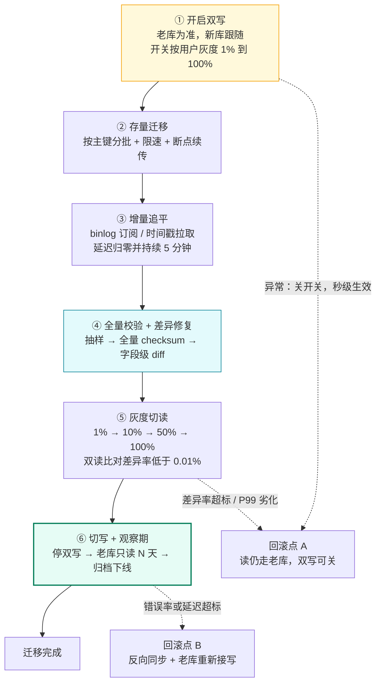

# 06 · 分库分表与在线迁移双写

> 属于「架构师修炼」· 阶段五（坎 4 · 100 万 QPS）· **先论证"该不该分"，再讲"怎么分、怎么不停机地迁"**
> 上一篇：[05 Kafka 削峰与可靠投递落地](./05-Kafka削峰与可靠投递落地)　下一篇：[07 多活容灾与全球化架构](./07-多活容灾与全球化架构)

> **这篇解决什么问题**：分库分表是本栏目**唯一一个"上了就下不来"的架构决策**——数据一旦被物理拆到 1024 张表，跨片 JOIN、跨片事务、跨片分页、全局 ID、DDL、备份、扩容全都要额外投入，而且回退成本极高。所以本篇顺序是：**① 用量化门槛证明"现在该不该分"（多数项目的答案是"不该"）；② 分片键选型与路由算法；③ 把"不停机双写迁移六步法"一步步讲透，每步都给出回滚方案与风险点。** 面试里能讲清 ③ 的人，比会背 ShardingSphere 配置的人值钱得多——**迁移才是真实项目里最难、最容易出事故的部分**。

---

## 一、什么时候才该分：先过门槛，再谈方案

### 1.1 量化门槛（五类信号，有一条持续命中才进入分片评估）

| 信号 | 量化阈值 | 为什么是灾难 | 先试什么 |
| --- | --- | --- | --- |
| **单表行数** | **> 5,000 万行** | B+ 树从 3 层涨到 4 层 → 点查多一次随机 IO；`ALTER TABLE` 数小时；统计信息失准导致执行计划漂移 | 归档 + 冷热分离（[慢查询优化实战](/后端技术栈强化/01-mysql/慢查询优化实战)） |
| **单实例存储** | **> 1~2 TB** | 备份窗口 > 4h、从库重建要一天、磁盘写满风险 | 冷数据下沉到历史库/对象存储 |
| **写入压力** | 单实例 **> 2k~5k TPS**（含 fsync 更低）；SSD IOPS **> 70% 持续打满** | 写是**不能靠加从库解决**的（从库只分摊读）；IOPS 打满时热点页换入换出，P99 从 10ms 飙到 500ms 且**加机器无效**（数据只有一份） | MQ 削峰 + 合并写（[05 篇](./05-Kafka削峰与可靠投递落地)）+ 加 Buffer Pool |
| **DDL / 备份窗口** | **> 2 小时且已影响业务** | 每次加索引/加字段都要停服窗口，迭代速度被锁死 | gh-ost / pt-osc（见第七节），仍不够才分表 |

> **关键区分**：**"读多"几乎永远不该用分片解决**（缓存 + 从库便宜十倍）；**"写多 / 容量大 / DDL 窗口不可接受"才是分片的正当理由**。回答"我们读 QPS 太高所以分库分表"，已经被扣分。

### 1.2 演进优先级：分片是最后一步


| 顺序 | 手段 | 典型收益 | 成本 / 风险 | 什么时候做 |
| --- | --- | --- | --- | --- |
| 0 | **优化 SQL / 索引** | P99 降 5~50 倍，QPS 提升 10 倍以上 | 1 人日；几乎无风险 | **任何时候，永远先做这个** |
| 1 | **归档冷数据** | 表体积降 50%~90%，索引深度回到 3 层 | 迁移脚本 + 历史表；归档期一致性问题 | 表 > 2000 万行，且 80% 数据近乎不再访问 |
| 2 | **冷热分离** | 热库只留 3~6 个月，单实例容量回到舒适区 | 双库查询路由 + 跨库分页 | 单实例 > 1 TB 且查询有明显时间局部性 |
| 3 | **垂直拆表** | 宽表拆窄，Buffer Pool 命中率显著上升 | 改代码；跨表要 JOIN 回来（冗余字段） | 表有 100+ 列或有 TEXT/BLOB 大字段 |
| 4 | **读写分离** | 读容量 ×N（N = 从库数） | 主从延迟（[03 篇](./03-MySQL主从与读写分离落地)） | 读写比 > 10:1 且 CPU 主要消耗在读 |
| 5 | **缓存** | 削掉 80%~95% 读 | 一致性窗口 + 缓存运维（[08 篇](./08-缓存与DB一致性落地)） | 读热点集中、能容忍最终一致 |
| 6 | **水平分片** | 容量与写入线性扩展（1024 片 ≈ 100× 容量） | 跨片 JOIN/事务/分页退化；全局 ID；迁移；运维 | 上面 5 步全做完仍到顶 |

### 1.3 明确写清：过早分片是重大架构错误

代价有五项：① **开发效率腰斩**——"查我的订单"要改 4 层，所有查询先得想"分片键带了没"；② **故障率翻倍**——1024 张表 = 1024 个 DDL 对象、1024 份备份，批量操作要处理部分失败；③ **一致性从"事务"退化为"补偿 + 对账"**（[09 篇](./09-分布式事务与最终一致落地)）；④ **收益为 0**——DB CPU 只有 20%、单表 300 万行时，分片带来的容量收益就是 0；⑤ **不可逆**——分完再合回来的成本比当初分出去还高。

> **面试金句**：**「分库分表不是能力证明，是成本证明。我会先报当前单表行数、单实例容量、写入 TPS 三个数字；如果都没到阈值，我会明确说这里不需要分片——提前上就是以复杂度和故障率换一个用不上的容量。」** 这句话本身就是 A3 + A4 级回答。

---

## 二、分片键选型：一个字段决定后面所有事

### 2.1 三条准则

三条准则：**① 查询必带**——90%+ 的线上查询 WHERE 里必须含分片键，否则查询会广播到全部分片（1024 次查询），**比不分片还慢**；**② 分布均匀**——分片键取值在分片间近似均匀且未来也均匀，否则某分片 10 倍数据量就成了单点瓶颈，分片白做；**③ 尽量避免跨片**——核心实体尽量与分片键同源（订单与用户同片），否则一笔业务要碰 N 个分片，事务全部退化为补偿。

### 2.2 正反例对照（订单表，1024 分片）

| 分片键 | 点查「按订单号」 | 列表「我的订单」 | 列表「商家的订单」 | 分布均匀性 | 结论 |
| --- | --- | --- | --- | --- | --- |
| **user_id** | ✗ 广播 1024 片 | ✓ 单分片 | ✗ 广播 | ✓ 均匀（除非超头部卖家） | **C 端首选**，配"基因法"补上按订单号查 |
| **order_id** | ✓ 单分片 | ✗ 广播 1024 片 | ✗ 广播 | ✓ 均匀 | ✗ 列表查询是主流量，不能广播 |
| **create_time** | ✗ 广播 | ✗ 跨多片范围扫 | ✗ 广播 | ✗✗ **写入全打最新时间片** | ✗ 最差：既热点又跨片 |
| **seller_id** | ✗ 广播 | ✗ 广播 | ✓ 单分片 | ✗ 头部卖家倾斜严重 | 仅适合以商家为中心的 B 端库 |
| **user_id + 基因 order_id** | ✓ 单分片 | ✓ 单分片 | ✗ 广播 | ✓ 均匀 | **✅ 生产常用解** |

> **避免教条**：**分片键不必唯一**。生产的常见组合是「**主分片键 + 异构索引表**」：订单按 `user_id` 分片，商家维度另建按 `seller_id` 分片的 `order_by_seller` 表（由 binlog 同步生成）——一套数据、两套分片，代价是多一条同步链路和一致性兜底。

### 2.3 基因法：把分片位嵌进 ID

**问题**：订单按 `user_id` 分片，但**支付回调只给 `order_id`**——不知道 user_id 就得广播 1024 个分片。

**解法**：雪花 ID 的低 10 位原本是 workerId + 序列，我们把 `user_id % 1024` 直接写进这 10 位：

```text
64 bit 雪花 ID：│ 0 │ 毫秒时间戳(41) │ 基因位(10) + 序列(2) │   ← 基因位 = user_id % 1024
按 order_id 查：基因 = order_id & 1023 → 直接算出 (db, table)，单分片命中
```

| 能力 | 无基因（纯雪花） | 有基因 |
| --- | --- | --- |
| 按 `order_id` 查 | 广播 1024 片（P99 数百 ms） | **单分片（P99 < 5ms）** |
| 按 `user_id` 查 | 单分片 | 单分片 |
| ID 全局唯一性 | ✓（workerId 保证） | ✓（workerId 用剩余位） |
| 单毫秒并发能力 | 4096/ms | 降到 4/ms（只剩 2 位序列）→ **靠提高时间戳精度或改用号段解决** |

> **取舍**：基因位每多 1 bit，分片数翻倍、单毫秒并发减半。**10 bit 基因 + 1024 分片是常见折中**；并发要求高（> 1w/s）时改用号段模式，号段内自带全局有序，基因位不受并发影响。

---

## 三、路由算法与中间件选型

### 3.1 三种路由算法：扩容代价是核心差异

| 算法 | 路由公式 | 扩容时迁移量 | 数据倾斜 | 范围查询 | 适用 |
| --- | --- | --- | --- | --- | --- |
| **hash 取模** | `hash(key) % N` | **N→N+1 时迁移 N/(N+1)≈90%+**；N→2N 约 50% | 均匀 | 不支持 | 分片数**一次定死**不再变（直接上 1024 逻辑分片） |
| **range 分片** | 按区间（id 段 / 时间） | **几乎为 0**（新分片接新数据） | ✗ 新数据全打最后一片 | **支持**（区间裁剪） | 日志/流水/时间序数据；必须解决尾部热点 |
| **一致性哈希** | 哈希环 + 顺时针找节点 | **1/N**（只迁移相邻环区段） | 节点少时倾斜明显 | 不支持 | 节点数会变的存储；**必须配虚拟节点（每物理节点 100~1000 个）** |
| **虚拟槽（推荐）** | 固定 16384 槽 + 槽→节点映射表 | **以槽为单位**，可控、可灰度、可回滚 | 可手动调整槽归属 | 不支持 | **分片数会增长的在线业务**（Redis Cluster / 云原生分布式 DB） |

**讲给面试官的结论**：① **一次性把逻辑分片定够**（例如 1024 片，物理只落地 8 库 × 8 表 = 64 张，其余逻辑分片映射到同一物理实例）——**扩容只改映射表，零数据搬迁**；② 真要搬数据（物理实例 8 → 16）就用**虚拟槽 + 双写迁移**，搬一个槽、校验一个槽、切一个槽，**回滚粒度 = 1 个槽**；③ **"成倍扩容 + 一致性哈希"能减少迁移量，但减不到 0**——把迁移量降到 0 的只有"逻辑分片数远大于物理实例数 + 映射表"。

### 3.2 中间件选型：改造成本 vs 运维成本

| 维度 | ShardingSphere-JDBC | ShardingSphere-Proxy | Vitess | 自研 DAO 层 | 分布式数据库（TiDB / PolarDB-X） |
| --- | --- | --- | --- | --- | --- |
| 形态 | 应用内 SDK | 独立代理（MySQL 协议） | 代理 + 管控（强 K8s 依赖） | 代码里手写路由 | 存算分离 NewSQL |
| 改造成本 | **低**（换数据源 + 配置） | **低**（只改连接串） | 中 | **高**（每个查询都要写路由） | **最低**（SQL 兼容，业务不改） |
| 运维成本 | 中（每服务一份配置） | 中（代理要部署扩容） | 高（组件多，曲线陡） | 低（无额外组件） | 高（自建）/ 低（云上） |
| 跨片 JOIN | 支持（内存归并，性能一般） | 支持 | 有限 | **不支持** | **原生支持** |
| 跨片事务 | 弱（不推荐） | 弱 | 弱 | 自己实现补偿 | **原生分布式事务**（有性能代价） |
| 扩容 | 改配置 + 数据迁移 | 同左 | 内置 resharding | 自己写 | **在线扩缩容** |
| 适用边界 | 中小团队、分片数固定、想快速落地 | 多语言栈、不想改代码 | 超大规模 + K8s 团队 | 分片逻辑极简（只按 user_id 分 4 库） | 预算充足、不想自维护分片 |

> **选型心法**：**分片中间件解决的是"路由"，不解决"一致性"。** 上了 ShardingSphere 之后跨片事务依然是最终一致 + 补偿（[09 篇](./09-分布式事务与最终一致落地)），这一点不要有幻觉。云原生分布式数据库最大的价值就是**把这部分复杂度产品化**——预算允许时它经常比自建分片更便宜（人力也是钱）。

---

## 四、分片后的六大难题与解法

| 难题 | 为什么变难 | 解法 | 代价 / 边界 |
| --- | --- | --- | --- |
| **跨片 JOIN** | 两表分片键不同，DB 层 JOIN 不可用 | ① **冗余字段**（订单冗余 user_name/sku_title，写时固化）② **广播表**（字典/配置类小表，每片一份全量）③ **应用层组装**（先查 A 片，用结果批量查 B 片） | 冗余字段有更新一致性问题；广播表要全片同步；组装增加 RTT |
| **跨片分页** | `LIMIT 100 OFFSET 10000` 每片都要扫 10100 行再归并 | ① 每片取 `LIMIT offset+size` 归并取前 size 条 ② **禁止深分页**：超过 1000 条强制改**游标分页**（带 `last_id`）③ 复杂排序走**异构索引表** | 页越深代价越高；游标分页不能跳页（产品要接受） |
| **跨片聚合** | `COUNT/SUM/GROUP BY` 要汇总所有分片 | **并行查询 + 内存归并**（errgroup + SetLimit）；超大聚合走离线数仓/预计算 | 成本 ≈ 分片数 × 单查询延迟；并发过高会打爆连接池 |
| **跨片事务** | 一个事务不能跨库；XA 性能与可用性不可接受 | **退化为最终一致**：本地事务 + 本地消息表 + 补偿 + 对账（[09 篇](./09-分布式事务与最终一致落地)）；设计上让一笔业务只碰一个分片 | 一致性窗口（秒~分钟）；必须有对账兜底 |
| **全局唯一 ID** | 自增主键在各分片内会重复 | 雪花 / 号段 / Redis INCR（见第五节），**不要用 UUID 做主键** | 雪花有时钟回拨；号段有浪费；都依赖外部组件 |
| **扩容与数据迁移** | 新分片没有历史数据，线上不能停 | **六步法双写迁移**（第六节）+ 虚拟槽 | 迁移期一致性风险、校验成本、回滚复杂度 |

> **分片的本质**：**你用"单机事务 + JOIN + 一条 SQL 解决一切"的自由，换来了"容量与写入的线性扩展"。这笔交易只在 1.1 节门槛命中时才划算。**

---

## 五、全局唯一 ID 方案对比

| 方案 | 唯一性保证 | 性能（单实例） | 趋势递增 | 外部依赖 | 主要坑 |
| --- | --- | --- | --- | --- | --- |
| **雪花算法** | workerId 不重复 + 时钟单调 | **~400 万/s**（理论 4096/ms） | ✓ 按时间 | 时钟 + workerId 分配（etcd/ZK，见 [10 篇](./10-etcd与Raft选主租约落地)） | **时钟回拨**（NTP 校时、虚机迁移）→ 拒绝发号或等待追平；workerId 冲突 → 重复 ID |
| **号段模式**（Leaf-Segment） | DB 单行原子递增 | **1w~10w/s**（内存发号） | ✓ 段内连续、段间递增 | MySQL | DB 抖动时号段耗尽；服务重启**浪费整段**；需要双 buffer 预取 |
| **Redis INCR** | Redis 单点/单分片 | 5w~10w/s | ✓ | Redis | **持久化策略决定会不会重号**（RDB 丢数据后重启 → 号回退）；Cluster 分片后不全局有序 |
| **UUID（v4）** | 概率唯一（122 bit 随机） | 高（无依赖） | **✗ 完全随机** | 无 | **随机写导致 B+ 树页分裂**，插入性能降 30%~50%、索引体积 ×2；16 字节；**不可作聚簇索引主键** |

```sql
-- 号段表只有三列：biz_tag（业务标识，主键）、max_id（已分配到的最大 ID）、step（号段长度）
-- 取号段 = 短事务内两步，UPDATE 行锁串行化多实例，保证不重号（DB 侧 QPS = 业务 QPS / step）
UPDATE leaf_alloc SET max_id = max_id + step WHERE biz_tag = 'order_id';
SELECT max_id, step FROM leaf_alloc WHERE biz_tag = 'order_id';
```

```go
// 双 buffer 号段模式：剩余 10% 时异步预取下一段，业务侧永不阻塞在 DB 上
type segment struct {
	maxID  int64        // 本段最大可分配
	step   int64
	cursor atomic.Int64 // 已分配到的位置
}

type segmentBuffer struct {
	mu      sync.Mutex
	cur     *segment // 当前号段
	next    *segment // 预取号段
	loading bool
	db      *sql.DB
	tag     string
}

func (b *segmentBuffer) NextID(ctx context.Context) (int64, error) {
	b.mu.Lock()
	defer b.mu.Unlock()

	if b.cur.cursor.Load() >= b.cur.maxID { // 当前段耗尽 → 切到预取段
		if b.next == nil { // 极端情况：DB 抖动 + 预取未完成
			return 0, errSegmentExhausted // 宁可失败也不复用已发号（重号 = P0 事故）
		}
		b.cur, b.next = b.next, nil
	}
	id := b.cur.cursor.Add(1)

	if b.next == nil && !b.loading && b.cur.maxID-b.cur.cursor.Load() < b.cur.step/10 {
		b.loading = true
		go func() { // 异步预取：失败不等待，下次请求会重新触发，同时上报监控
			seg, err := b.loadFromDB(context.WithoutCancel(ctx))
			b.mu.Lock()
			defer b.mu.Unlock()
			b.loading = false
			if err == nil {
				b.next = seg
			}
		}()
	}
	return id, nil
}

// 取号段：短事务 + 行锁，DB 侧 QPS = 业务 QPS / step
func (b *segmentBuffer) loadFromDB(ctx context.Context) (*segment, error) {
	tx, err := b.db.BeginTx(ctx, nil)
	if err != nil {
		return nil, err
	}
	defer tx.Rollback() //nolint:errcheck // 已 Commit 时为 no-op

	if _, err = tx.ExecContext(ctx,
		`UPDATE leaf_alloc SET max_id = max_id + step WHERE biz_tag = ?`, b.tag); err != nil {
		return nil, err
	}
	var maxID, step int64
	if err = tx.QueryRowContext(ctx,
		`SELECT max_id, step FROM leaf_alloc WHERE biz_tag = ?`, b.tag).Scan(&maxID, &step); err != nil {
		return nil, err
	}
	if err = tx.Commit(); err != nil {
		return nil, err
	}
	seg := &segment{maxID: maxID, step: step}
	seg.cursor.Store(maxID - step) // 可分配区间 (max_id - step, max_id]
	return seg, nil
}
```

**三个工程细节**：① **step 取值** = 业务 QPS × 期望撑住 DB 抖动的秒数 ÷ 实例数（订单 5000 QPS × 4 实例 × 撑 60s → step ≈ 7.5 万，取 10 万）；② **号段浪费不是问题**：ID 只要求唯一与趋势递增，**不要求连续**，为"不浪费"调小 step 是拿可用性换好看；③ **监控项**：`号段预取失败次数` + `剩余号段可支撑时长（< 30s 告警）`。

---

## 六、不停机数据迁移六步法（本篇重点）

### 6.1 全流程



> **前置动作**：分片方案评审（分片键 · 逻辑分片数 · 路由映射表）必须先定稿——**迁移一旦开始，改分片键等于重来**。

### 6.2 六步的做法

**① 双写：先写哪个库？（结论先给）**

**结论：读还在老库时，先写老库、再写新库；切读 100% 完成后，反转写顺序（先写新库）。**

| 写顺序 | 老库失败 | 新库失败 | 用户视角 | 结论 |
| --- | --- | --- | --- | --- |
| **先老后新**（读在老库阶段） | 整个请求失败，返回错误让用户重试 | 老库已成功、**用户能读到自己的数据**；新库落后由 binlog 追平 + 补偿任务补齐 | 一致、可解释 | ✅ **采用** |
| 先新后老 | 新库有数据、老库没有 → **用户读到"订单不存在"** | 请求失败 | 数据"凭空消失"，最差体验 | ✗ |

> **核心原则**：**"事实源"决定写顺序**。读指向哪个库，哪个库就是事实源，它必须写成功；另一个库允许落后，因为落后是**可修复的偏差**（有追平链路），而"事实源缺数据"是**不可修复的语义错误**。

双写有三种实现：**应用层同步双写**（默认选择，请求 RT +1~5ms，可精确灰度到用户）；**应用层异步双写**（老库成功即返回，新库写放 goroutine/队列，几乎零延迟但有 ms~s 窗口，**必须配补偿 + 对账**）；**binlog 中间件同步**（canal/DTS，业务零改造，延迟 100ms~2s，**双向同步要防回环**）。

**② 存量迁移：分批 + 限速 + 断点续传**

```sql
-- 分批按主键推进（禁止 OFFSET，禁止一次性 SELECT *）
SELECT id, user_id, amount, status, created_at, updated_at
FROM orders_old WHERE id > ? AND id <= ? ORDER BY id LIMIT 1000;
```

| 要点 | 参数建议 | 原因 |
| --- | --- | --- |
| 批次大小 | **500~2000 行/批** | 太大 → 长事务、主从延迟飙升（[03 篇](./03-MySQL主从与读写分离落地)）；太小 → 迁移太慢 |
| 限速 | 目标 **< 主库 CPU 的 20%**（约 2000~5000 行/s） | 迁移是"顺手做的事"，不是"抢资源做的事" |
| 进度记录 | `migration_progress(task, last_id, updated_at)` 每批提交后更新 | **断点续传**：进程挂了从 last_id 继续，不用重来 |
| 执行窗口 / 读源 | 低峰期 02:00~06:00；**从库**读存量 | 减少在线影响；把迁移读压力从主库挪走 |
| 幂等 | 目标表 `INSERT ... ON DUPLICATE KEY UPDATE` | 重跑批不产生重复行；**迁移脚本必须能安全重跑** |

**③ 增量追平：判定"追平"的标准要写死**

| 方式 | 原理 | 优点 | 坑 |
| --- | --- | --- | --- |
| **binlog 订阅**（canal / go-mysql / DTS） | 订阅 ROW 格式 binlog，按位点重放到新库 | 实时（ms 级）、能捕获 DELETE、不依赖业务字段 | 需 ROW 格式；DDL 要处理；中间件挂了要能从**持久化位点**续传 |
| **时间戳增量拉取** | `WHERE updated_at > last_sync_time` 循环拉 | 实现简单、零额外组件 | **物理删除抓不到**（必须软删）；依赖 `updated_at` 索引与时钟；同秒边界要重叠 + 幂等去重 |

**"追平"必须三个条件同时满足**：① **位点差** < 1 秒（GTID 模式差 < 5 个事务）；② **延迟归零且持续 5 分钟**（不是瞬时为零）；③ **无写入积压**（待重放队列 = 0，期间新产生差异 = 0）。三条不齐不许进入 ④⑤——面试被追问"瞬时 0 还是持续 0、期间抖动怎么办"，答不上来就说明没上线过。

**④ 数据校验：全量比对 + 字段级 diff**

```sql
-- 分片区间 checksum：先比"批指纹"，批不一致再下钻；BIT_XOR 与顺序无关，且不像 SUM(CRC32) 会溢出
SELECT COUNT(*) AS cnt,
       COALESCE(BIT_XOR(CRC32(CONCAT_WS('#', id, user_id, CAST(amount AS CHAR), status, UNIX_TIMESTAMP(updated_at)))), 0) AS ck
FROM orders_new WHERE id > 1000000 AND id <= 1002000;   -- 老库同区间执行一次，cnt 与 ck 都相同即通过

-- 定位到具体行：字段级 diff，只查不等的行（NULL 用 <=> 判断）
SELECT o.id, o.amount AS old_amount, n.amount AS new_amount
FROM orders_old o JOIN orders_new n ON n.id = o.id
WHERE o.id > 1000000 AND o.id <= 1002000
  AND ((o.amount <=> n.amount) = 0 OR (o.status <=> n.status) = 0)
LIMIT 200;
```

| 校验层次 | 频率 | 覆盖 | 说明 |
| --- | --- | --- | --- |
| **抽样校验** | 每小时 | 随机 0.1%~1% + **最近 1 小时全量增量** | 快；抓不住长尾差异 |
| **全量 checksum** | 迁移期每天一次，切读前必须全量过一遍 | 100% 主键区间 | 只比批指纹，成本可控 |
| **字段级 diff** | 仅对 checksum 不一致的批 | 具体行 | 定位精度到字段 |

| 差异类型 | 含义 | 处置 |
| --- | --- | --- |
| **A · 只在新库有** | 老库删了 / 迁移多写了 | 以老库为准 → **删除新库多出的行**（或标记软删） |
| **B · 只在老库有** | 增量没追平 / 存量漏迁 | 从老库重推该行 → upsert 到新库 |
| **C · 两库都有但字段不符** | 追平顺序问题 / 映射 bug / 精度差异 | **以老库为准重建整行**，并排查是否是映射 bug（量大则阻塞切流） |
| **D · 数值精度/时区差异** | decimal、timestamp 时区不一致 | 修迁移工具，**不能"自动对齐"掉**——这是系统性 bug |

> **阈值守则**：差异率 > **0.01%** 或单条金额差异 > **100 元** → **暂停迁移流程 + 人工介入**；修复后必须重跑校验，**直到连续两轮全量校验 0 差异**。

**⑤ 灰度切读：双读比对是唯一的真相来源**

| 档位 | 流量 | 观察时长 | 通过条件 | 失败动作 |
| --- | --- | --- | --- | --- |
| 1% | 内部白名单 + 1% 随机 | ≥ 30 min | 差异率 < 0.01%、P99 不劣化 20% | 关闭开关（秒级） |
| 10% | 10% 用户 | ≥ 1 h | 同上 + 无新增告警 | 回到 1% 或关闭 |
| 50% | 50% | ≥ 2 h | 同上 + 校验任务零差异 | 回到 10% |
| 100% | 全部 | ≥ 24 h（含一个业务高峰） | 稳定后进入 ⑥ | 回到 50% 并排查 |

> **影子读**：读请求同时发老库和新库、返回老库结果（用户无感），差异异步落 `diff_log`；**差异率 = diff_log 条数 / 双读总请求数**，这是放量的唯一依据。

> **两个细节**：① 影子读**放大一倍读流量**（对老库有压力，所以按 1%→10% 逐步放开，不能一上来全量双读）；② **写后立即读**会因追平延迟产生假差异 → 对"最近 5 秒内写过的 key"豁免比对，否则差异率永远压不下去。

**⑥ 切写 + 观察期：最后一步，也是最谨慎的一步**

流程：**停双写 → 老库转为只读（拒绝新写，报错可被监控到）→ 观察 24~72h → 老库只读保留 7~30 天（作为回滚点）→ 全量备份归档 → 下线老库**。

| 要点 | 做法 | 原因 |
| --- | --- | --- |
| **切写时机** | 读 100% 稳定 ≥ 24h（含一个业务高峰）之后 | 切写后回滚成本陡增，先把读路径的不确定性消化掉 |
| **停双写顺序** | 不是"先停写老库"再停写新库，而是**先把老库置为只读**，让所有写只走新库 | 避免"老库还在接写、新库不写了"的黑洞 |
| **回滚窗口** | 老库保持可回滚 **7~30 天**（**反向同步**：新库 → 老库） | 反向链路要**提前建好并演练**，不能等出事才搭 |
| **下线** | 全量备份 + 归档冷存储 → 观察期无回滚需求 → 释放实例 | 不可逆操作，必须留证据 |

### 6.3 每一步的回滚方案与风险点

| 步骤 | 回滚方案 | 风险点 | 观测指标 |
| --- | --- | --- | --- |
| ① 双写 | 关开关（配置中心，秒级）；读仍走老库，业务无感 | 绕过 DAO 的写入口（脚本、后台任务、DBA 手工 SQL）→ 新库永久缺失；异步双写吞掉 goroutine panic | 双写失败计数、`biz_sync_fail` 积压 |
| ② 存量 | 停任务 + 清空该批数据（新库无读流量，随便处置） | 迁移期间老库仍在写 → 靠 ③ 兜住；大事务推高从库延迟；字段映射 bug → 靠 ④ 兜住 | 迁移速率、主库 CPU、从库延迟 |
| ③ 增量 | 停订阅；位点持久化后可从位点续传追平 | 位点丢失 → 全量重迁；中间件单点（要主备 + 抢锁选主）；新库唯一键冲突 | 追平延迟、位点差、待重放队列长度 |
| ④ 校验 | 新库无读流量，最坏是**重迁**（代价是时间不是数据） | 校验 SQL 打爆 DB（要限速、低峰、走从库）；校验期间数据仍在变（要比"同一逻辑时间点快照"） | 差异率、diff 明细条数 |
| ⑤ 切读 | 开关切回老库（配置中心 + 本地缓存兜底，秒级）；**新库无需修数据** | 新库连接池/分片数不足 → 打满；SQL 缺分片键 → 广播 1024 片；开关依赖配置中心 → 要本地兜底 + 强制走老库的降级开关 | 差异率、P99、连接池等待、错误率 |
| ⑥ 切写 | 反向同步（新库 → 老库）+ 写开关切回老库 | 遗留脚本仍写老库 → "只进老库"的黑洞；正反向同步**同时开着会打架**（必须互斥，用选主或开关） | 老库拒写报错数、反向同步延迟、错误率 |

### 6.4 迁移期一致性兜底：对账 + 补偿 + 人工阈值

```text
对账任务（每 5 分钟，扫最近 30 分钟变更的主键区间）
   ├─ 比对：老库 vs 新库（checksum + 字段级 diff）
   ├─ 差异 → 自动补偿（以老库为准 upsert 到新库，幂等）
   ├─ 连续 3 次补偿仍不一致 → 告警 + 冻结该主键（进对账问题池）
   └─ 累计差异 > 100 条 或 单条金额差异 > 100 元 → 暂停迁移流程 + 人工工单
```

---

## 七、分片后的日常运维

| 运维动作 | 关键点 | 工具 / 参数 |
| --- | --- | --- |
| **DDL 变更** | 1024 张表**依次执行**，并发度控制在 **2~4**（同时跑打满 IO）；先小分片试跑 → 灰度 10% → 全量 | `gh-ost` / `pt-online-schema-change`；gh-ost 原理 = 建影子表 → 拷存量 → **binlog 追增量** → `RENAME TABLE` 原子切换（锁表 < 1s） |
| **备份恢复** | **按分片并行备份**（并发 2~4），每片 `xtrabackup` + binlog 位点；一致性快照用 `--safe-slave-backup` | **没演练过的备份等于没有备份**（[14 篇](./14-备份恢复与故障复盘)） |
| **扩容再平衡** | **虚拟槽 + 双写迁移**：建新实例 → 双写该槽 → 校验 → 切该槽读 → 切该槽写 → 逐槽推进 | 每次只搬 1 个槽（回滚粒度 = 1 槽）；槽数固定则工程量可控 |
| **慢查询与倾斜治理** | 每条慢 SQL 要乘分片并发数（**50ms × 1024 片广播 = 灾难**）；每片单独监控行数/容量/QPS，**倾斜度 > 1.5 倍即告警** | 上线前用 **SQL 审计**拦截"无分片键"查询（[慢查询优化实战](/后端技术栈强化/01-mysql/慢查询优化实战)） |

---

## 八、Go 落地：分片路由 + 多分片并行聚合

```go
const (
	shardBits   = 10             // 1024 个逻辑分片，必须是 2 的幂
	shardCount  = 1 << shardBits // 1024
	shardMask   = shardCount - 1 // 1023
	tablesPerDB = 8              // 每物理库 8 张表
)

// Route 由分片键算 (物理库下标, 表名)。分片键必须是"查询必带"的字段。
func Route(shardKey int64) (dbIdx int, table string) {
	h := uint64(shardKey)
	h ^= h >> 33
	h *= 0xff51afd7ed558ccd // murmur3 混淆：避免连续 ID 全部落到相邻分片
	h ^= h >> 33
	idx := int(h & shardMask)
	return idx / tablesPerDB, fmt.Sprintf("orders_%04d", idx)
}

// GenOrderID 基因法：把 user_id 低 10 位写进 order_id 低 10 位，让"只拿到 order_id"的
// 支付回调也能算出分片（RouteByOrderID 即 Route(orderID & shardMask)），无需广播 1024 片。
func GenOrderID(snowflakeID, userID int64) int64 {
	return (snowflakeID &^ shardMask) | (userID & shardMask)
}

// QueryByUser 点查走单分片：分片键命中时永远只有一次 DB 往返（预算 100ms）
//   dbIdx, table := Route(userID); r.dbs[dbIdx].QueryContext(ctx, "SELECT ... FROM "+table+" WHERE user_id = ? LIMIT 50", userID)

// CountByStatusAllShards 跨片聚合：并行 + 限流 + 显式降级标记。
// 关键取舍：统计类查询容忍"部分分片失败"，但必须把 degraded 透出给调用方，
// 绝不能把不完整的数字当成准确值返回 —— 那是最隐蔽的数据事故。
func (r *OrderRepo) CountByStatusAllShards(ctx context.Context, status int8) (int64, bool, error) {
	ctx, cancel := context.WithTimeout(ctx, 200*time.Millisecond)
	defer cancel()

	g, ctx := errgroup.WithContext(ctx)
	g.SetLimit(8) // 并发上限：防止 1024 路并发打爆 DB 连接池

	var total, failed atomic.Int64
	for i := 0; i < shardCount; i++ {
		i := i
		g.Go(func() error {
			var n int64
			db := r.dbs[(i/tablesPerDB)%len(r.dbs)]
			err := db.QueryRowContext(ctx,
				fmt.Sprintf("SELECT COUNT(*) FROM orders_%04d WHERE status = ?", i), status).Scan(&n)
			if err != nil {
				if ctx.Err() != nil {
					return ctx.Err() // 整体超时：立刻取消其余分片，别拖死上游
				}
				failed.Add(1) // 单分片失败不中断聚合，最后统一标记 degraded
				return nil
			}
			total.Add(n)
			return nil
		})
	}
	if err := g.Wait(); err != nil {
		return 0, true, err
	}
	return total.Load(), failed.Load() > 0, nil
}
```

> **跨片分页的规则**（比代码更重要）：页浅（offset ≤ 1000）时每片查 `LIMIT offset+size` 归并取前 size 条；超过就**禁止深分页**，改**游标分页**（`WHERE id < last_id ORDER BY id DESC LIMIT size`），深分页成本恒定；复杂排序（销量/评分）走预排序的**异构索引表**。绝不能每片全量拉回应用层排序。

---

## 九、故障与一致性边界

| 故障 | 现象 | 影响面 | 处置 | 一致性边界 |
| --- | --- | --- | --- | --- |
| **迁移中途某个分片失败** | 该分片任务报错退出，其余正常 | 只影响该分片 | 保留其余进度，**该分片从 last_id 断点续传**；失败分片不参与切流 | 新库该片数据不完整 → **禁止对该片切读**，以老库为准 |
| **双写只成功一边** | 老库成/新库败，或反之 | 出现单边数据 | ① 老库成、新库败：用户无感，记 `biz_sync_fail` + 追平补写；② 老库败、新库成（仅异步双写）：按 order_id **幂等回滚新库那条写** | 窗口 = 追平延迟（ms~s）；`biz_sync_fail` 积压 > 1000 告警 |
| **校验发现不一致** | 差异率超阈值 | 追平或映射有 bug | 暂停切流 → 按 A/B/C/D 分类修复 → **重跑全量校验直到连续两轮 0 差异** | 修复只以**老库为唯一事实源**；不修完不进 ⑤ |
| **切流后新库性能不达标** | P99 从 30ms 涨到 300ms、连接池等待 > 50ms | 用户可见的慢 | ① 秒级回滚读开关；② 排查缺分片键导致广播、连接池配置、实例规格、慢 SQL 随分片放大 | 回滚零一致性损失（读不改数据） |
| **回滚时增量数据处理** | 新库已单写一段时间，老库落后 | 回滚需把新库增量搬回 | 开**反向同步**（新库→老库）→ 追平 + 校验 → 写切回老库；**正反向同步必须互斥** | 回滚窗口 = 反向同步延迟；未演练过就会变成数小时人工事故 |
| **ID 生成组件故障** | 号段预取失败 → 发号报错、无法创建新订单；雪花时钟回拨 → 新 ID 比历史 ID 小或重复 | 主键冲突 / 写入失败 | 号段剩余 < 30s 预警，耗尽则**返回错误**；回拨 < 5ms 等待追平，> 5ms **拒绝发号 + 告警** | ID 唯一性优先于可用性：**重号 = P0 事故**；绝不"回拨后用旧时间戳继续发号" |

---

## 十、面试追问链

1. **「为什么不该一开始就分库分表？」** → 先报三个数字：单表行数、单实例容量、写入 TPS。都低于阈值（5000 万行 / 1~2 TB / 2k~5k TPS）时分片收益为 0，代价是跨片 JOIN/事务/分页全退化、开发效率腰斩、故障率翻倍，而且**几乎不可逆**。正确顺序：SQL/索引 → 归档 → 冷热分离 → 垂直拆表 → 读写分离 → 缓存 → **最后**水平分片。
2. **「分片键怎么选？」** → 三条准则：**查询必带、分布均匀、尽量避免跨片**。C 端订单选 `user_id`（列表查询是主流量），并用**基因法**把 `user_id % 1024` 嵌进雪花 ID 低位，让"只给 order_id"的支付回调也能单分片命中；商家维度另建按 `seller_id` 分片的异构索引表（一套数据两套分片，代价是同步链路与一致性兜底）。
3. **「跨片分页怎么办？」** → `LIMIT offset, size` 在每片都要扫 `offset+size` 行再归并，深分页是 O(分片数 × offset)。所以：页浅（offset ≤ 1000）用每片查 `LIMIT offset+size` 归并；超过就**禁止深分页**，改**游标分页**（`WHERE id < last_id ORDER BY id DESC LIMIT size`），成本恒定；复杂排序用预排序的异构索引表。**产品上"不能跳页"可以谈，"查询打爆 DB"不能谈。**
4. **「迁移怎么保证不停机、不丢数据？」** → 六步法：① 双写（**读在老库时先写老库**，老库是事实源）② 存量分批 + 限速 + 断点续传 ③ binlog 增量追平（**判定标准 = 位点差 < 1s 且延迟持续 5 分钟为 0**）④ 全量 checksum + 字段级 diff，差异以老库为准修复 ⑤ 灰度切读 1%→10%→50%→100% + 影子读比对（差异率 < 0.01% 才放量）⑥ 切写 + 老库只读保留 7~30 天。**每阶段都有独立回滚点，切读阶段回滚无损（读不改数据）——这就是为什么先切读、后切写。**
5. **「扩容怎么做到不重分布？」** → 关键是**逻辑分片数远大于物理实例数**：一次定死 1024 个逻辑分片（如 128 库 × 8 表），扩容只改"逻辑分片 → 物理实例"的**映射表**，零数据搬迁；真要物理搬迁就用**虚拟槽 + 双写迁移**，一次搬一个槽、校验一个槽、切一个槽，回滚粒度 = 1 槽。绝不能等 8 个库满了再用 `hash % 8 → % 16` 硬扩——那要搬一半数据。
6. **「双写时一边失败怎么办？」** → 分方向：**读还在老库的阶段，老库写失败 = 整个请求失败**（返回错误让用户重试，两边都没写、无偏差）；**新库写失败 = 不阻塞用户**，记 `biz_sync_fail` + 告警，由 binlog 追平与对账任务幂等补写。原则是**"事实源必须写成功，非事实源允许落后"**——落后是可修复的偏差，事实源缺数据是不可修复的语义错误。切读 100% 后写顺序要**反转**为先写新库。

## 十一、自测清单

- [ ] 能背出 5 条分片门槛的量化阈值，并说清"什么时候**不**该分"
- [ ] 能按优先级排出 7 步演进路径，并给每步的成本收益
- [ ] 能对一张订单表，说出 `user_id` / `order_id` / `create_time` 作分片键的各自后果
- [ ] 能讲清基因法原理，并算出"1024 分片 → 基因占 10 bit → 剩余并发能力"的取舍
- [ ] 能画出迁移六步法流程图，并说出每步的**回滚方案**与**风险点**
- [ ] 能写出 checksum 校验 SQL，并知道为什么不能用 `SUM(CRC32)`

> **下一篇**：[07 多活容灾与全球化架构](./07-多活容灾与全球化架构) —— 数据被拆到 1024 个分片之后，下一个问题是：**其中一个机房整体挂了呢？**
