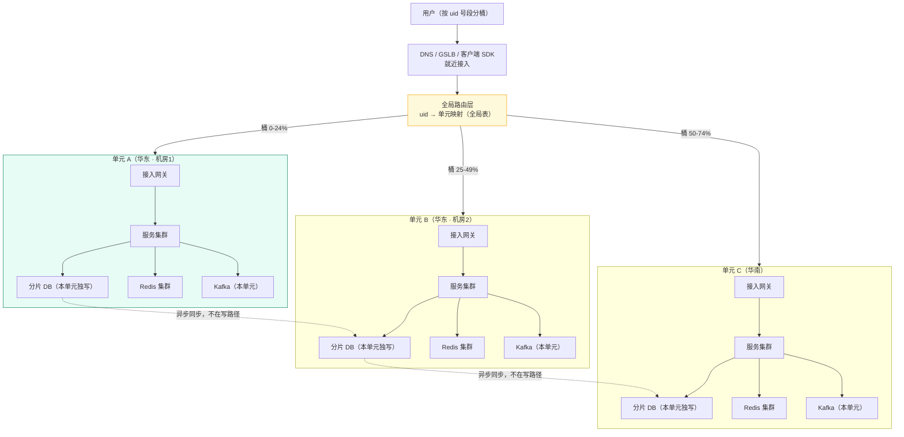
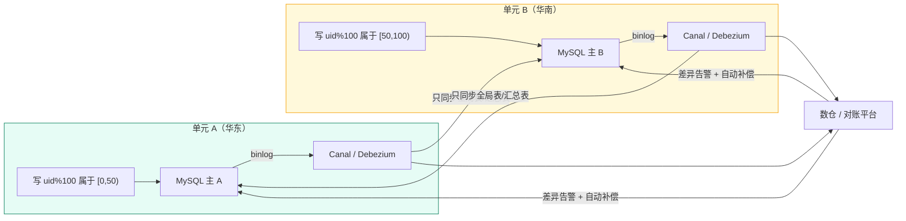
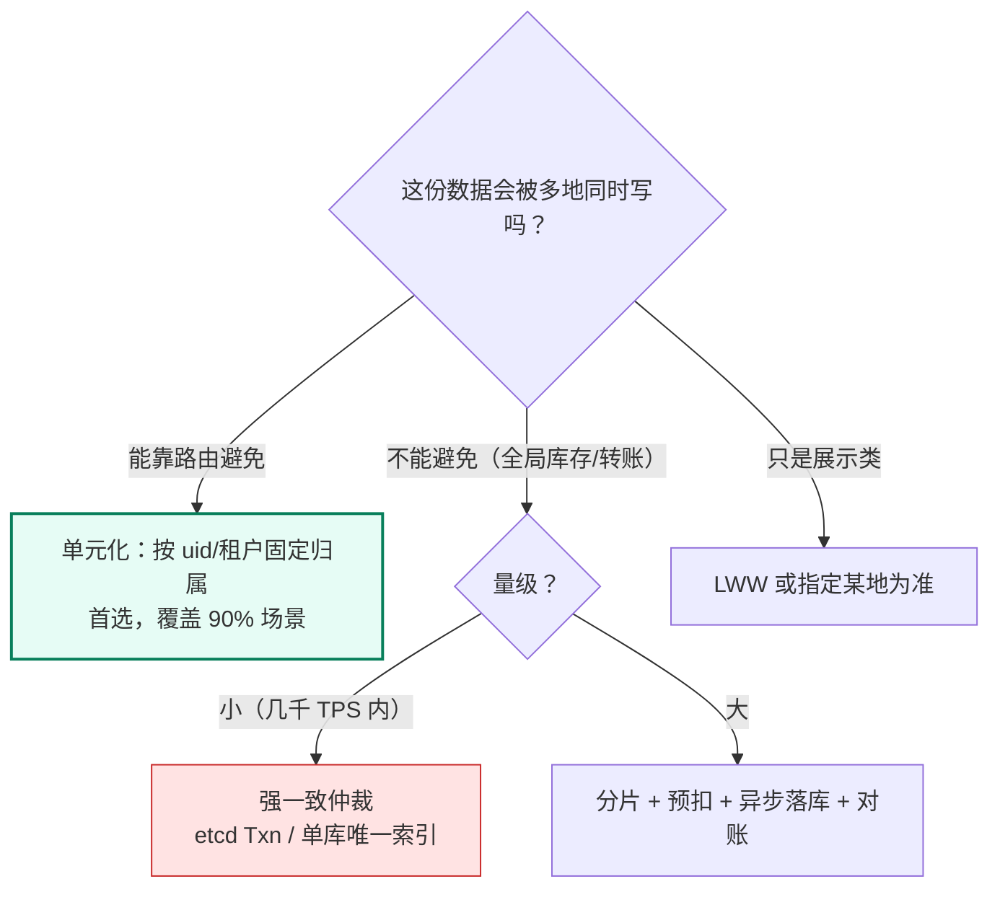
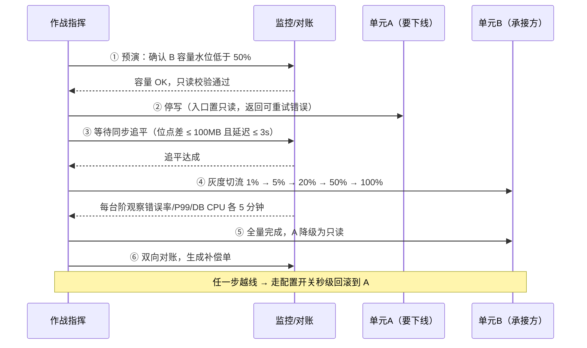

# 07 · 多活容灾与全球化架构

> 属于「架构师修炼」· 阶段六（坎 4~5 · 100 万~1000 万 QPS）· **多活不是"多部署一套"，而是"数据怎么在多地写"**
> 上一篇：[06 分库分表与在线迁移双写](./06-分库分表与在线迁移双写)　下一篇：[08 缓存与 DB 一致性落地](./08-缓存与DB一致性落地)

> **这篇解决什么问题**：面试里一说到高可用，很多人张口就是「同城双活 + 异地多活 + 单元化」，但一问「**两地同时改同一个用户的数据，以谁为准**」就断了。这一篇只讲真话：**多活的 90% 失败都出在数据层，不在流量层**——接入层切流是简单的，难的是让数据在多地写对。你会拿到：① 七种容灾形态的 RTO/RPO 量化对照；② 单元化解决什么、又留下什么全局难题；③ 数据同步与冲突处理的选型矩阵；④ 能直接抄的机房级演练剧本与成本清单。

---

## 一、先给结论：多活的难点全在数据层

> **多活的技术动作只有两个：把流量调度过去（简单）、把数据在多地写对（困难）。** 事故里 90% 不是「切流没切过去」，而是「切过去了，但数据错乱 / 读到旧数据 / 双向复制把好数据覆盖成坏数据」。

| 层次 | 要解决的问题 | 难度 | 手段 | 常见误区 |
| --- | --- | --- | --- | --- |
| **接入层** | 请求打到哪个机房 | ★★ | DNS/GSLB、Anycast、客户端 SDK | 「多活 = 多地部署同一套服务」——无状态服务多部署理所当然，**难的永远是有状态的数据** |
| **服务层** | 每个机房是否自闭环 | ★★★ | 单元化、无状态化、依赖就地可用 | 「机房建好就万无一失」——证书/密钥/风控没就地可用，切过去照样全挂 |
| **数据层** | **多地怎么写同一份数据** | ★★★★★ | 单向主从、双向复制、binlog 同步、CRDT、单元固定写 | 「多活 = 更高可用」——它同时新增了「跨机房不一致」这一故障源 |

### 1.1 可用性等级 → 架构手段 → 成本（面试直接引用）

| 可用性等级 | 年停机 | 架构形态 | 典型 RTO / RPO | 相对成本 |
| --- | --- | --- | --- | --- |
| **99.9%（1 个 9）** | ~8.76 h | **单机房** + 主从 + 备份 | RTO 30 min~数小时 / RPO 分钟级 | ×1 |
| **99.99%（2~3 个 9）** | ~52.6 min | **同城双活**（同城双写 + 存储层同步） | RTO < 1 min / RPO ≈ 0 | ×2~2.5 |
| **99.99%（3 个 9）** | ~52.6 min | **两地三中心**（生产 + 同城灾备 + 异地灾备） | RTO 分钟~十分钟 / RPO 秒级 | ×3~4 |
| **99.99%~99.999%（4~5 个 9）** | 52.6 min~5.26 min | **异地多活**（多地都可写）/ **单元化** | RTO ≈ 0（秒级切流）/ RPO ≈ 0，**但有冲突** | ×5~10 |
| **99.999%（5 个 9）** | ~5.26 min | **单元化 + 异地多活 + 边缘接入**（全球化） | RTO ≈ 0 / RPO ≈ 0（单元内强一致，跨单元最终一致） | ×10+ |

> ⚠️ 这张表的价值不是「5 个 9 就要多活」，而是让你能说清**「每个 9 都是花钱买的，越往上边际成本越陡」**。业务只要 99.9%，单机房 + 好备份就是**正确**选择。

---

## 二、概念澄清：七种形态，RTO/RPO 差一个数量级

### 2.1 形态对照表（背结论）

| 形态 | 数据怎么算 | 流量怎么走 | RTO | RPO | 成本 | 适用 |
| --- | --- | --- | --- | --- | --- | --- |
| **冷备** | 定期备份到异地，平时不启动 | 灾难时手工恢复 | **小时~天级** | 小时级 | ×1.1 | 内部系统、可容忍长停机 |
| **热备** | 备机实时异步同步，平时不接流量 | 手工/DNS 切 | 10~30 min | 秒~分钟级 | ×1.5 | 中小业务兜底 |
| **主备（同城）** | 主写、备同步（半同步/异步） | 主挂切备 | **30 min~数小时**（大头是**决策时间**） | 半同步 ≈ 0 / 异步秒级 | ×2 | 绝大多数创业公司的**正确选择** |
| **同城双活** | 同城两机房都接流量，存储层同步复制 | GSLB 分流 | **< 1 min** | **≈ 0** | ×2~2.5 | 同城双 AZ，性价比最高的 4 个 9 |
| **两地三中心** | 生产 + 同城灾备（同步）+ 异地灾备（异步） | 灾难时切灾备 | 分钟~十分钟 | 秒级 | ×3~4 | 金融/政企合规 |
| **异地多活** | **多地都能写**，靠复制或路由收敛 | 就近接入 | **≈ 0** | ≈ 0，**但存在冲突** | ×5~10 | 国民级产品、跨地域延迟敏感 |
| **单元化（Set 化）** | 用户按 uid 固定归属一个单元，**单元内数据只有该单元写** | 按 uid 路由到固定单元 | ≈ 0 | ≈ 0，**冲突被架构消除** | ×5~10 | 超大规模 + 容灾 + 全球化三合一 |

> **本篇最重要的结论**：**异地多活的"数据冲突"不是被某种算法解决掉的，而是被"单元化"这种架构设计消除掉的**——只要同一用户的写只落一个机房，就根本不存在写冲突。

### 2.2 RTO/RPO 是商业指标，不是技术指标

**决策链**：`业务问"停机 1 小时损失多少" → 推出可接受 RTO → 倒推备用系统要多热 → 成本 ×1/×2/×10 → 成本大于损失就退回上一档，成本小于损失就落地并演练验证`。

**A4/A5 级答法**：RTO/RPO **从业务倒推，不从技术倒推**。订单停机 1 小时损失 X，那 RTO 5 min / RPO 0 就划算，值得付同城双活的成本；日志分析停机一天无所谓，RPO 1 h、用备份就够，**上多活是纯浪费**。演进顺序是 `备份异地 → 同城双活 → 单元化 → 异地多活`，**每一级的触发条件都是业务/合规，不是"别人都做了"**。

---

## 三、单元化（Set 化）：机房级故障 + 跨地域延迟的正解

### 3.1 三种做法的本质差异

| 做法 | 数据归属 | 冲突 | 扩容方式 | 故障影响面 |
| --- | --- | --- | --- | --- |
| 同城双活（共写一份库） | 无归属 | 靠存储层同步避免 | 加机器 | 受跨机房复制延迟影响 |
| 异地多活（双向复制） | 无归属 | **必然冲突**，要 LWW/CRDT | 加机器 | 需冲突合并 |
| **单元化（Set 化）** | **每份数据有唯一归属单元** | **架构上消除** | 建新单元 + 迁号段 | 只影响该单元用户 |

**定义（背下来）**：把系统按用户切成 N 个**自闭环单元**，每个单元内部有自己的**接入层 + 服务 + 数据库 + 缓存 + MQ**；同一用户永远路由到同一个单元，**单元之间不共享写路径**。它一次解决三件事：**① 机房级故障**（挂一个单元只影响 1/N 用户）；**② 跨地域延迟**（就近落本地单元）；**③ 无限扩容**（加容量 = 建新单元 + 迁号段，不动老单元）。

### 3.2 单元化拓扑



> **看图两点**：① 单元之间**没有同步写**，只有异步同步（用于全局数据聚合/灾备）；② 路由表本身是**全局数据**，它挂了谁都找不到自己的单元，必须有本地缓存兜底。

### 3.3 路由表下发：三级兜底 + 一道安全闸门

| 级别 | 载体 | 生效速度 | 挂了怎么办 |
| --- | --- | --- | --- |
| **L1 内存快照** | 进程内原子快照（秒级刷新） | 实时 | 继续用旧快照服务 |
| **L2 配置中心** | etcd/Nacos 存号段规则（`uid % 100 < 25 → unit-A`） | 秒级 | 读本地持久化快照 |
| **L3 内置规则** | 进程内置一致性哈希/号段表 | 即时 | 与共识规则一致，允许极少量漂移 |

**下发流程**：路由服务生成版本 V → 写配置中心（etcd `Put` + Watch 推送）→ 各单元拉全量 → **双读比对** → 原子切换。**必须带版本号 + 影响面闸门**：一次变更超过 30% 槽位直接拒绝并告警，否则一次误下发就是全站流量错乱（代码见 3.6）。

### 3.4 单元自闭环：就地可用的清单

- **计算/存储/缓存/MQ**：网关、服务、分片 DB、单元内 Redis 与 Kafka 全部单元内闭环；**定时任务必须在单元内选主**，否则多单元重复执行（[10 篇](./10-etcd与Raft选主租约落地)）；对象存储用区域级 bucket。
- **配置与中间件**：配置中心本地快照、注册中心与日志采集的**本单元实例**；最常见的坑是启动时强依赖远端配置中心——配置中心一挂，服务连启动都起不来。
- **凭证（最容易被漏）**：证书、密钥、加密机、风控规则必须**同步到每个单元**——机器全都好了但证书取不到，切过去整个单元 TLS 全失败。

### 3.5 单元化之后仍然存在的全局数据（唯一"后门"）

| 全局数据 | 例子 | 落地做法 |
| --- | --- | --- |
| **路由映射表** | `uid → 单元`、号段分配 | 强一致 KV（etcd/ZK）+ 各单元本地缓存 |
| **全局唯一 ID** | 订单号、任务号 | 号段模式：中心分配区间（每次 1 万），单元内本地发号（[06 篇](./06-分库分表与在线迁移双写)） |
| **全局唯一约束** | 手机号注册、用户名占用 | **必须强一致**：单库唯一索引或 etcd Txn CAS |
| **全局库存/配额** | 秒杀库存、活动预算 | 库存分片（各单元一份 + 中心兜底）或全局预扣（[00 篇](./00-架构师思维与设计方法论) 5.2） |
| **配置与跨单元统计** | 灰度名单、限流阈值；全站 DAU、总榜 | 配置中心 + Watch（秒级延迟）；统计走异步上报 + 聚合，**不进写路径** |

> 面试追问「你这套单元化还有什么必须走全局？」——答不出这张表，说明只背了拓扑图。

### 3.6 Go 代码：uid → 单元路由 + 三级兜底

```go
package route

import (
	"context"
	"fmt"
	"log/slog"
	"sync"
	"sync/atomic"
)

// Unit：一个自闭环单元（含本单元 DB/缓存/MQ 入口）。
type Unit struct {
	Name    string // cn-east-1a
	DBShard string // order_db_3
}

// Table：号段 → 单元的映射快照，带版本号以便双读比对与回滚。
type Table struct {
	Version int64
	Slots   [100]string // 槽位 → 单元名
	units   map[string]Unit
}

func (t *Table) Pick(uid int64) Unit { return t.units[t.Slots[uid%100]] }

type ConfigCenter interface {
	GetRouteTable(ctx context.Context) (*Table, int64, error) // 全量 + revision
	WatchRoute(ctx context.Context) (<-chan int64, error)     // 变更通知
}

// Router：三级兜底 = 内存原子快照(L1) → 配置中心(L2) → 内置规则(L3)。
type Router struct {
	snap    atomic.Pointer[Table] // L1：热路径零锁、零网络
	builtin *Table                // L3：永不为空
	cli     ConfigCenter          // L2：可能不可用
	mu      sync.Mutex            // 只保护 Refresh，不在热路径
}

// Locate 是请求热路径：不访问配置中心、不加锁。
func (r *Router) Locate(uid int64) Unit { return r.snap.Load().Pick(uid) }

// Refresh：拉全量 → 影响面闸门 → 原子切换；失败一律保留旧快照（宁可旧不可无）。
func (r *Router) Refresh(ctx context.Context) error {
	r.mu.Lock()
	defer r.mu.Unlock()
	next, rev, err := r.cli.GetRouteTable(ctx)
	if err != nil {
		slog.WarnContext(ctx, "route refresh failed, keep old snapshot", "err", err)
		return err
	}
	old := r.snap.Load()
	if old != nil && rev <= old.Version {
		return nil // 防旧版本覆盖新版本（revision 回退时保护）
	}
	if old != nil && diffSlots(old, next) > 30 { // 影响面闸门：变更超 30% 槽位
		return fmt.Errorf("route change too large, rev=%d", rev)
	}
	r.snap.Store(next)
	return nil
}

// 后台 Run：先 Store(builtin) 保证永不为空，再 Refresh 拉全量；
// 随后 Watch 循环 + 指数退避重连（上限 30s），收到事件即 Refresh，ctx.Done() 退出。
```

**三个工程要点**：① **热路径零依赖**（`Locate` 只有一次 `atomic.Load`，配置中心抖动不影响请求）；② **宁可旧不可无**（刷新失败留旧快照，启动失败用内置规则）；③ **拒绝大幅变更**（30% 闸门是防配置误操作引发全站错乱的最后一道闸）。

---

## 四、数据同步方案：一致性强度决定 RPO

### 4.1 五种方案对照表（面试必背）

| 方案 | 机制 | 一致性 | 延迟 | RPO | 代价与边界 |
| --- | --- | --- | --- | --- | --- |
| **单向主从（同城）** | 主库写，binlog 同步/半同步到从库 | 半同步=强，异步=弱 | 同城 1~5 ms | 半同步 ≈ 0 / 异步秒级 | 从库只读，**不能承接写**；跨城同步复制会把写延迟拉到几十 ms |
| **双向复制** | 两地互为主（双主/multi-source） | 弱（写完即返回） | 异步秒级 | 秒级 | **必然冲突**：同行两地并发改 → 覆盖。必须有冲突策略或架构规避 |
| **基于 binlog 的异步同步** | 单元 A binlog → MQ（Canal/Debezium）→ 单元 B 重放 | 最终一致 | **秒级（1~10 s）** | 秒级 | 可重放、可对账、可按表过滤；**顺序性与幂等要自己做**（[05 篇](./05-Kafka削峰与可靠投递落地)/[11 篇](./11-幂等去重与ExactlyOnce)） |
| **消息同步（业务层事件）** | 本地库提交后发领域事件给对端 | 最终一致 | 秒~分钟级 | 秒级 | 同步字段可控，但需事件表 + 重试 + 对账，**代码侵入大** |
| **分布式数据库多副本** | TiDB/PolarDB/OceanBase 用 Raft/Paxos 跨城多副本 | 强一致（多数派确认） | 同城 2~10 ms；**跨城 30~150 ms** | 多数派内 ≈ 0 | **写延迟随距离线性上升**；跨城强一致让写 P99 上百毫秒，通常只在同城做强一致 |

### 4.2 数据流全景



> **要点**：**用户数据不同步（各有归属），只同步全局表/汇总数据**。一旦发现自己在同步用户订单表，就说明单元化没做干净，冲突迟早发生。

### 4.3 跨机房同步带宽估算（给数字的加分题）

```text
① 同步量 = 峰值写 TPS × 单条变更字节 × binlog 放大系数(1.5~2)
   例：5 万 TPS × 1 KB × 1.8 ≈ 90 MB/s
② 单元出口 = 同步量 × 同步方向数（3 单元全互联时每单元 2 个方向）→ 90 × 2 = 180 MB/s
③ 冗余系数 1.5~2（binlog 积压追赶、DDL 全表变更、大促尖峰）→ 180 × 1.8 ≈ 324 MB/s ≈ 2.6 Gbps
④ 结论：单机房出方向需 ≥ 5 Gbps 专线（留 50% 余量）；跨城专线 1 Gbps ≈ 1~3 万元/月（经验值）
   → 3 单元全互联仅专线 ≈ 10~30 万元/月，这笔账才是多活的真实成本
```

### 4.4 同步延迟导致「读到旧数据」——比冲突更常见

最常见的不是冲突，而是**写后读走了另一个单元**：用户在 A 单元写完立刻查 B → 查到"没有订单"。解法是**写后读粘滞**（同 uid 短期强制回源归属单元，TTL 30~60 s）；切流场景的判据见 6.2（位点差 < 100 MB 且延迟 < 3 s）。

---

## 五、数据冲突处理：四种策略 + 一种"消除冲突"的架构

### 5.1 冲突分类（先分清，才能选对策略）

| 冲突类型 | 例子 | 能否用算法解决 |
| --- | --- | --- |
| 同字段并发写 / 增量计数类 | 并发改同一昵称；两地各 +1 点赞 | 能（LWW；CRDT 计数器天然可合并） |
| **业务约束类** | 两地各扣一次余额，总额扣超 | **不能**，只能靠路由（单元化）或全局串行 |
| **唯一约束类** | 两地同时注册同一手机号 | 不能，只能强一致仲裁 |
| 删除 vs 更新 | A 删除、B 更新 → 数据"复活" | 需墓碑（tombstone）+ 版本比较 |

### 5.2 策略对照表

| 策略 | 原理 | 一致性 | 优点 | 致命边界 |
| --- | --- | --- | --- | --- |
| **LWW** | 比时间戳/版本，大者胜 | 最终一致 | 实现最简单，无需协调 | **依赖时钟**；漂移会让较早的真实写入胜出，**静默丢数据**；不可用于资金/库存 |
| **版本向量** | 每副本维护 `{副本: 版本}` | 最终一致 | 能**准确检测"真并发"** | 只检测不解决；向量随副本数增长 |
| **CRDT** | 可交换/可结合/幂等的结构（G-Counter、PN-Counter、OR-Set） | 强最终一致（可收敛） | 乱序到达也收敛，适合计数/集合 | 仅适用于**有数学性质的类型**；元数据膨胀；删除语义复杂 |
| **业务规避（单元固定写）** | 同 uid 的写永远只落一个单元 | **无冲突** | 根治，且延迟最优（就近写） | 需单元化改造；跨单元业务（转账、全局库存）依然存在 |
| **中心仲裁（强一致单点）** | 关键写走 etcd Txn / 单库唯一索引 | 强一致 | 正确性最强 | 吞吐受限（etcd 单集群写入几千 TPS），只适合"量小但必须对"的数据 |

### 5.3 LWW 的坑：时钟不是你想的那样

| 坑 | 后果 | 量化 |
| --- | --- | --- |
| **NTP 校时跳变** | 时间戳回退，新数据被判旧而丢弃 | 一次性校正可跳变数百 ms~秒级 |
| **时钟漂移** | 两机时间缓慢分叉 | 公网 NTP 约 **几十~几百 ms/天**，虚拟机更差 |
| **时区/闰秒；用 `time.Now()` 排序** | 排序异常；同机多次调用也可能非单调 | 必须统一 UTC；用 monotonic 时钟或 HLC/Lamport |

**正确做法**：用 **HLC（混合逻辑时钟）**，或直接取强一致组件的单调值——**etcd 的 `revision` 天然单调递增，可直接当全局版本号 / fencing token**（见 [10 篇](./10-etcd与Raft选主租约落地)）。

### 5.4 结论：优先「消除冲突」，而不是「合并冲突」



---

## 六、流量调度与切流

### 6.1 三种调度方式对比

| 方式 | 原理 | 生效速度 | 粒度 | 边界 |
| --- | --- | --- | --- | --- |
| **DNS / GSLB** | 按地域/运营商/健康检查返回不同 IP | **分钟级**（受 TTL 与 LocalDNS 缓存影响，可能 10~30 min） | 机房级 | 通用首选，但**不能做秒级切流**；TTL 30~60 s 已是极限 |
| **Anycast** | 多地宣告同一 IP，BGP 就近选路 | 秒级（BGP 收敛） | 网络级 | 全球加速好；但**连接可能被路由到不同机房**，长连接需重建；回程不对称，排障难 |
| **客户端 SDK 路由** | SDK 内置规则 + 服务端下发，直连指定单元 | **秒级~实时** | 用户级 | 最精准（可按 uid 路由），代价是**要发版/维护 SDK**，首次启动仍需 DNS 兜底 |

**生产组合拳**：`GSLB（定地域）+ 客户端 SDK（定单元）+ 服务端路由兜底（uid → 单元）`。

### 6.2 切流六步法（不丢单的核心）



| 步骤 | 量化判定标准 | 越线处置 |
| --- | --- | --- |
| ① 预演 | B 单元 CPU 低于 50%、DB 连接低于 60%、预留 ≥ 1.5 倍承接量 | 先扩容再说 |
| ② 停写 | 入口返回 `503 + Retry-After`，**不静默丢** | 异步任务在途则等 30 s 排空 |
| ③ 追平 | 位点差 < 100 MB 且延迟 < 3 s | 超时放弃切换（不带脏数据切） |
| ④ 灰度 | 每台阶错误率 < 0.1%、P99 < 基线 1.5 倍 | 自动回滚上一台阶 |
| ⑤ 全量 | 观察 30 min 无异常 | 回滚 |
| ⑥ 对账 | 自动补偿后差异条数 = 0 | 人工介入，保留差异快照 |

> **「切流怎么保证不丢单」的标准答法**：**先停写 → 等追平 → 灰度切 → 再全量 → 最后对账**。核心是「**先让两边数据一致，再让流量过去**」，绝不是「流量先打过去、指望复制追上」。

### 6.3 脑裂在跨机房的表现与防范

| 表现 | 根因 | 防范 |
| --- | --- | --- |
| 两地都认为自己是主，各自接受写 | 专线抖动后**两边都判定对方挂了** | **多数派仲裁**：只有含多数派（第三方故障域/同城第 3 机房）的一侧能当主 |
| 旧主继续写业务库 | 旧主只是"失去资格"，进程还活着、还连着自己的 DB | **fencing token**：写请求带单调递增 epoch，存储端拒绝小 token（[10 篇](./10-etcd与Raft选主租约落地)） |
| 切换后"时空倒流" | 新主数据比旧主旧，已删数据复活 | 切换前位点校验；关键表带版本号/墓碑，合并时丢弃旧版本 |
| 仲裁节点本身挂 | 无法判多数派，切主停滞 | 仲裁点放**第三个独立故障域**，心跳走多链路（专线 + 公网 VPN） |

**跨机房超时阈值的算法（加分）**：

```text
判定"对方挂了"的阈值 T 必须：T > 2 × 专线抖动 P99 + 应用 GC STW 上限
例：抖动 P99 = 200 ms，STW P99 = 50 ms → T > 450 ms，取 1 s 作心跳失效阈值
T 太大 → 切换慢（RTO 变大）；T 太小 → 抖动即误判脑裂
结论：跨机房 T 通常取 1~3 s（比同机房毫秒级大 1~2 个数量级）
```

---

## 七、容灾落地清单与演练剧本

### 7.1 五项必做清单（缺一项，多活就不成立）

| # | 项目 | 具体要求 | 验收方式 |
| --- | --- | --- | --- |
| 1 | **数据备份异地** | 全量 + 增量备份存到**第三个地域**（与生产、与副本都不同域），每季度真实恢复一次 | 恢复演练报告里的 RPO 实测值 |
| 2 | **配置与镜像同步** | 镜像多 Region 复制；配置中心多单元部署 + 本地快照；manifest 版本一致 | 断网拉镜像/拉配置成功 |
| 3 | **依赖就地可用** | 中间件、证书、密钥、风控规则在每个单元本地可用（见 3.4） | 单单元隔离运行 24 h 无外部依赖失败 |
| 4 | **演练机制** | 每季度 ≥ 1 次机房级演练，**在生产环境做** | 演练报告 + 改进项闭环 |
| 5 | **值班与预案** | 一线可执行的 runbook（谁决策、几步操作、判定标准、回滚命令）+ 授权链 | 桌面推演 + 真实切流演练 |

### 7.2 机房级故障演练剧本（可直接抄）

| # | 注入故障 | 预期行为 | 判定标准 | 常见失败 |
| --- | --- | --- | --- | --- |
| 1 | **单机房整体断电** | 流量 30 s 内切到备用单元 | 全站成功率 > 99%，RTO < 60 s | 路由快照过期，客户端重试 3 次卡 9 s |
| 2 | **专线抖动**（丢包 30%、+200 ms） | 同步积压但**不切主**，写仍在本单元完成 | 单元内 P99 涨幅 < 20%，同步延迟 < 30 s 且不误切 | 心跳阈值太小 → 误判脑裂、双主写入 |
| 3 | **单元内 DB 主库宕机** | 单元内主从切换（半同步，RPO ≈ 0） | RTO < 30 s，切换后位点比对无丢数据 | 从库延迟大导致丢数据；连接池未重连新主 |
| 4 | **Redis/Kafka 挂一台** | 副本提升，业务无感 | 错误率 < 0.01%，消费无重复（幂等生效） | 客户端未重连；位点回退导致重复消费 |
| 5 | **配置中心不可用 / 证书失效** | 用本地快照继续运行；证书提前 30 天告警 + 热加载 | 业务无感；无 TLS 失败 | 重启强依赖配置中心 → **起不来（高危）**；证书硬编码进镜像 |
| 6 | **路由表下发错误 / 脑裂演练** | 大幅变更被闸门拒绝；旧主写被存储端拒绝 | 拒绝生效、无流量错乱；对账差异 = 0 | 无变更审核；存储端不校验 token → 数据静默分叉 |

> **黄金准则**：演练不是「看系统多强」，而是「把预案变成肌肉记忆」。每次演练必须产出**1 个 P0 改进项 + 完成人 + 截止时间**，否则就是走过场。

---

## 八、成本与代价：10 倍成本换 10 倍可用性

| 成本项 | 量化 | 说明 |
| --- | --- | --- |
| **跨机房带宽** | 3 单元全互联 ≈ 2.6 Gbps/单元出口 → 专线 10~30 万元/月 | 见 4.3 估算公式 |
| **资源冗余** | 每个单元都要按「能承接全量流量」规划 | 集群利用率从 60~70% 掉到 **20~30%**，等效 ×3 资源 |
| **一致性与流程复杂度** | 全局表、路由、对账、冲突处理系统全部新建；新增租户/加单元 = 改路由表 + 数据迁移 + 双跑验证 | 新增 2~4 个服务；**一次扩容 = 一次迁移项目**，不是加机器 |
| **运维人力与排障** | 多机房部署、演练、值班、证书治理 | 人力 ×2~3；**MTTR 可能反而变长**（事故类型变成"数据静默错乱"） |

> **必须记住的一句话**：**多活是 10 倍成本换 10 倍可用性。业务量级和可用性要求没到，做多活就是拿复杂度换虚荣心**——正确顺序是 `备份异地 → 同城双活 → 单元化 → 异地多活`，每一级都要有明确的触发条件（RTO/RPO 目标、合规要求、跨地域延迟指标）。

---

## 故障与一致性边界

| 故障 | 现象 | 机制解释 | 降级/兜底 | 一致性边界 |
| --- | --- | --- | --- | --- |
| **机房断电** | 该单元用户全不可用，其余正常 | 单元自闭环失效 | 切到备用单元（先确认容量与数据归属） | 归属该单元的用户切换前无主，**未同步写入可能丢失（RPO = 同步延迟）** |
| **跨机房专线抖动** | 同步延迟上升，异地读到旧数据 | 异步复制积压 | 暂停切流决策，写仍在本单元完成 | 跨单元数据**秒级~分钟级不一致**，不得依赖异地做实时读 |
| **同步延迟导致读到旧数据** | 用户刚写完就看到旧值 | 写后读走了另一单元/从库 | 写后读粘滞（同 uid 回源，TTL 30~60 s） | 最终一致；**不能用"读异地"证明写成功** |
| **切流后新机房容量不足** | 切换瞬间大量超时、DB 连接打满 | 未按全量预留资源；冷缓存回源放大 3~5 倍 | 分批灰度 + 秒级回滚 + 本单元限流（[12 篇](./12-限流熔断降级与背压)） | 部分请求失败（可重试），**不产生数据错误** |
| **双向复制冲突** | 同一行被覆盖，或计数少算 | 两地并发写，LWW 静默丢更新 | 版本向量检测 + 对账补偿 + 改造为单元固定写 | **强一致不可达**，只能最终一致，必须接受"某次写入被丢弃" |
| **路由表下发错误/过期** | 用户被路由到错误单元，写入落到错误的库 | 全局路由数据本身失效 | 本地快照 + 大幅变更闸门 + 秒级回滚 | 路由正确性是**多活的元级前提**，错了直接造成数据分叉 |
| **全局唯一约束冲突** | 两地同时注册同一手机号 | 唯一性本质需要全局串行 | 中心化唯一索引 / etcd Txn CAS 仲裁 | **必须强一致**，不存在最终一致方案 |
| **仲裁节点故障** | 无法判定多数派，切主停滞 | 单点仲裁 | 仲裁点放第三故障域 + 多链路心跳 | 宁可短暂无主（保 Safety），不可双主 |

> **用法**：被问「你的多活方案挂了怎么办」，永远按「**现象 → 机制 → 降级 → 一致性边界**」四段回答，一段都不少。

---

## 面试追问链

1. **「同城双活和异地多活的本质区别是什么？」**
   → **同城双活是"一份数据的两地副本"，异地多活是"多地都能写"**。同城靠存储层同步复制（1~5 ms）做到 RPO ≈ 0 且**不产生写冲突**，因为本质仍是"一个写点"；异地多活的跨城延迟（30~150 ms）不允许同步复制，必须允许两地各自写，**于是产生数据冲突**。代价上同城 ×2，异地 ×5~10，且异地必须额外解决冲突、对账、路由。

2. **「多活下数据冲突怎么办？」**
   → ① **先分类**：同字段并发写、计数类、业务约束类、唯一约束类，前两类可合并，后两类**不可合并**；② **优先消除而非合并**——单元化按 uid 固定归属，让同一用户的写只落一个单元（最推荐的答案）；③ 无法消除的（全局库存、转账、唯一注册）用**强一致仲裁**（etcd Txn / 单库唯一索引）；④ 展示类用 LWW，但要讲清 NTP 跳变/漂移的坑（用 HLC 或 etcd revision）；⑤ 最后一定要说**跨单元冲突靠对账收敛**。

3. **「切流怎么保证不丢单？」**
   → **六步：预演容量 → 停写 → 等同步追平 → 灰度切流 → 全量 → 对账**。核心是「**先让数据一致，再让流量过去**」，绝不能"流量先打过去、指望复制追上"。判定标准：停写后入口返回可重试错误（不静默丢）；追平判据是位点差 < 100 MB 且延迟 < 3 s；灰度 1%→5%→20%→50%→100%，每台阶观察 5 分钟、错误率 < 0.1%；任何一步越线立即回滚（配置开关，秒级生效）。

4. **「RTO/RPO 怎么定？」**
   → **从业务倒推**。先问"停机 1 小时损失多少"定 RTO，再问"丢 1 分钟数据什么后果"定 RPO。例：订单 RTO 5 min / RPO 0（值得上同城双活 + 半同步）；日志分析 RTO 24 h / RPO 1 h（备份就够）。然后用**演练实测**验证而不是口头承诺，最后补成本：每提升一档，成本约翻 2 倍。

5. **「为什么大多数公司不做异地多活？」**
   → ① **成本 ×5~10**：专线 10~30 万元/月 + 集群利用率从 60% 降到 20~30% + 专职 SRE；② **复杂度**：要新增路由、全局表、对账、冲突处理，**排障 MTTR 反而变长**，事故类型从"服务挂了"变成"数据静默错乱"；③ **收益有限**：绝大多数业务用「同城双活（4 个 9）+ 异地冷备」已超出需求。正确姿势是讲清**触发条件**：RTO 目标 < 1 min 且异地用户占比高，或有数据主权/合规硬要求。

---

## 自测清单

- [ ] 能默写「可用性等级 → 架构形态 → RTO/RPO → 成本倍数」对照表，并说清每个 9 的边际成本
- [ ] 能区分冷备/热备/主备/同城双活/两地三中心/异地多活/单元化七种形态的定义与量化差异
- [ ] 能画出单元化拓扑，并说出**至少 4 类必须走全局的数据**
- [ ] 能给出跨机房同步带宽估算公式，并算出一次真实量级的专线需求与月成本
- [ ] 能说出 LWW 依赖时钟的三个坑，并给出 HLC / etcd revision 的替代方案
- [ ] 能背出切流六步及每步量化判定标准（追平阈值、灰度台阶、回滚条件）
- [ ] 能独立设计一次机房级故障演练，并产出可闭环的 P0 改进项

> **下一篇**：[08 缓存与 DB 一致性落地](./08-缓存与DB一致性落地) —— 多活解决"机房级不一致"，下一篇解决每天都会遇到的"缓存与 DB 不一致"。
