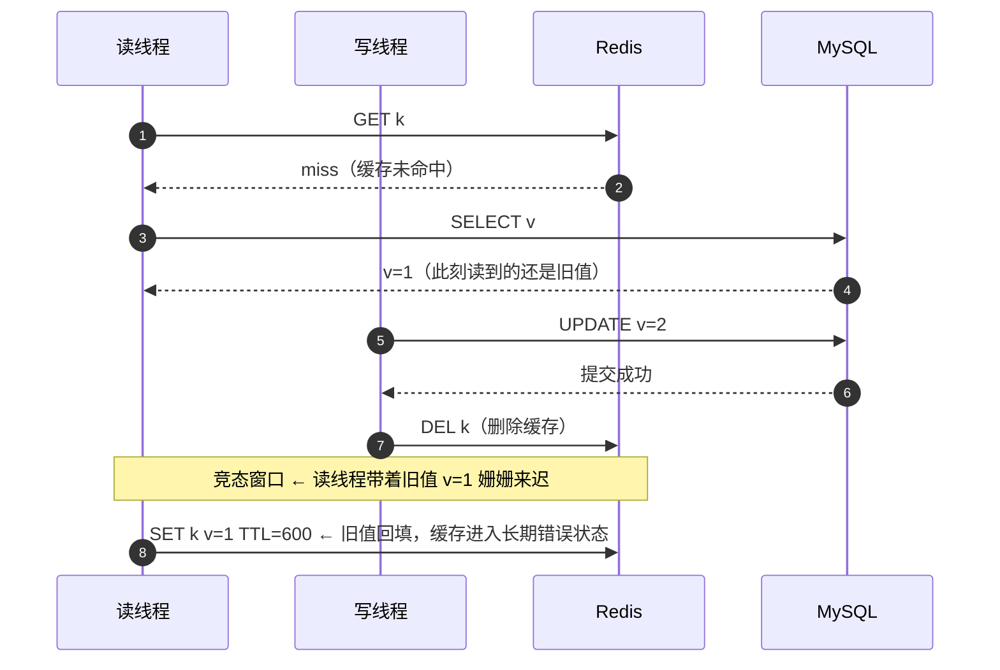
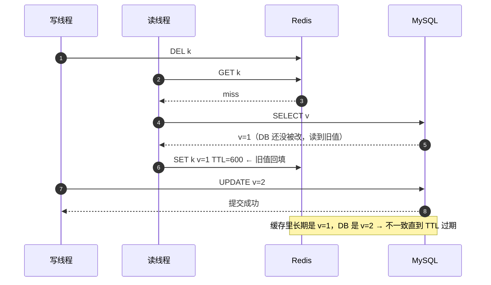
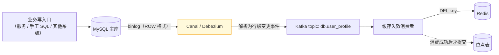

# 08 · 缓存与 DB 一致性落地

> 属于「架构师修炼」· 阶段三（一致性专题第 1 篇）· **跨组件没有强一致，只有「分档 + 缩小窗口 + 兜底修正」**
> 上一篇：[07 多活容灾与全球化架构](./07-多活容灾与全球化架构)　下一篇：[09 分布式事务与最终一致落地](./09-分布式事务与最终一致落地)

> **这篇解决什么问题**：这是面试重灾区。「先删缓存还是先更新 DB」「延迟双删延迟多久」「能不能保证强一致」「binlog 订阅挂了怎么办」「不一致了以谁为准、怎么发现」——五个问题里能答全的人不到 10%。这一篇不重复讲 Cache Aside 的定义（那是 [缓存问题与一致性](/后端技术栈强化/02-redis/缓存问题与一致性) 的事），而是把**每种写策略的并发失败窗口画出来、量化窗口长度、给出兜底手段与对账方案**，最后落到一段可用的 Go 封装。

---

## 一、先立框架：跨组件没有强一致，只有分档 + 兜底

### 1.1 三个物理事实（决定了「强一致」不可能）

| 事实 | 说明 | 后果 |
| --- | --- | --- |
| **没有跨组件事务** | Redis 与 MySQL 是两个独立事务域，无法原子提交；即便硬上 2PC，也会把延迟从 ms 拖到秒级并引入协调者单点 | 「DB 成功 = 缓存成功」永远不成立 |
| **复制都是异步的** | MySQL 主从、Redis 主从都异步（[03 篇](./03-MySQL主从与读写分离落地) / [04 篇](./04-Redis高可用与缓存体系落地)的丢写窗口） | 「提交成功」≠「所有副本可见」 |
| **并发是交错的** | 读与写在毫秒级交错，任何「先 A 后 B」的序列在并发下都存在窗口 | 窗口只能**缩小**，不能**消除** |

所以工程上真正能做的只有三件事：**① 缩小窗口**（顺序选择 + 延迟双删 + binlog 订阅）、**② 容忍窗口**（TTL 兜底，让不一致自动收敛）、**③ 修正窗口**（对账 + 补偿，发现并修复长期不一致）。本篇后面所有方案，都只是这三件事的不同组合。

### 1.2 按数据分级选一致性档位（这是本篇的主线结论）

一致性档位不是技术选型，是**产品决策**（分级表来源见 [01 篇](./01-QPS分级与架构演进地图)第七节）：

| 级别 | 数据 | 缓存策略 | 一致性档位 | 兜底 |
| --- | --- | --- | --- | --- |
| **P0 资金级** | 余额、订单金额、支付流水 | **权威路径不上缓存**；只能缓存不可变快照，读走主库 | 强一致（DB 事务 + 唯一约束） | 对账 + 人工介入 |
| **P1 关键业务** | 库存、优惠券、任务状态 | 缓存只做「预占 / 展示」；扣减以 DB 原子操作为准 | 强一致 + 短 TTL 展示 | 补偿 + 对账 |
| **P2 用户可见** | 帖子、评论、粉丝数 | Cache Aside + 主动失效 + TTL 兜底 | 最终一致（秒级） | binlog 订阅 + 对账 |
| **P3 展示统计** | 播放量、点赞数、热榜 | 只写缓存 + 定时对齐覆盖 | 最终一致（分钟级） | 定时对账 |
| **P4 分析类** | 埋点、日志、AB 指标 | 不做一致性要求 | 尽力而为 | 无 |

> **主线结论**：被问「缓存一致性怎么保证」时，先答这一句——**「先看数据级别：P0 不走缓存，P1 只做预占，P2/P3 用 Cache Aside + 失效 + TTL + 对账。」** 这一句本身就证明你知道「一致性是分档的」，而不是在追求一个不存在的强一致。

---

## 二、Cache Aside 四种写策略：并发窗口逐个拆

> 前提：**缓存是派生副本，DB 是事实源**。所有策略的目标都不是「让不一致消失」，而是「让窗口更短、影响更小、能被兜住」。

### 2.1 策略 A：先更新 DB，再删缓存（推荐）



**窗口分析**：要触发这个竞态，读请求必须**在写线程 `DEL` 之后才完成回填**。窗口长度 = 读线程「SELECT 完成 → SET 回填」的耗时，典型 **1~5 ms**（一次网络往返 + 序列化）。触发条件苛刻（读 miss + 恰好交错 + 回填晚于删除），所以**概率低**；但一旦命中，缓存会一直错到 TTL 过期（**影响时长远大于窗口本身**）。

**为什么它仍然是最优选择**：因为窗口是**窗口期的收尾动作**（回填），而不是整个写事务；而策略 B 的窗口是整个业务写过程。**窗口长度差一个数量级。**

### 2.2 策略 B：先删缓存，再更新 DB（不推荐）



**窗口分析**：窗口 = 从「删除缓存」到「DB 更新提交」的**整个业务写耗时**，包含参数校验、下游 RPC、事务提交，典型 **5~50 ms**，如果中间夹了一次外部调用甚至可达**秒级**。窗口期内**所有并发读都会 miss 回源并回填旧值**，于是「回填旧值」的概率比策略 A 高出一个数量级。**这是它被淘汰的根本原因**——不是理论缺陷，而是窗口太宽。

### 2.3 策略 C：先更新 DB，再更新缓存（特定场景可用）

看似最直观，但有两个硬伤：

| 问题 | 说明 | 是否能修 |
| --- | --- | --- |
| **并发写覆盖** | 写 1 提交 v=2、写 2 提交 v=3；写 2 的 `SET` 先到、写 1 的 `SET` 后到 → 缓存 = v=2，DB = v=3，**无 TTL 时永久错误** | **不能**：你无法保证「后提交的 SET 后到达」（网络与调度都不保证顺序） |
| **值无法从单行算出** | 缓存里往往是聚合/列表/联表结果，更新 DB 一行推不出新缓存值 | 只能退化为「删除缓存」 |

**唯一适用场景**：缓存值就是 **DB 单行字段的直接映射**、写并发极低、且想省掉一次 cache miss（读写比极高但写极少，如配置表）。**除此之外一律用「删」不用「更新」**——`DEL` 是幂等的、可重复执行的，而 `SET` 不是。

### 2.4 策略 D：延迟双删（延迟多久？为什么？）

流程：**① `DEL` 缓存 → ② 更新 DB → ③ 等 Δ → ④ 再 `DEL` 一次**。

**二次删除的意义**：专门删掉「在步骤 ② 完成之前读到旧值、却在 ② 之后才回填」的那批脏数据——也就是策略 A 的竞态窗口留下的产物。第一次删除无法覆盖它，因为它发生在删除之后。

**Δ 该怎么估**（面试必答）：

```text
Δ ≥ 主从延迟 P99 + 读请求「SELECT → SET 回填」的耗时
  为什么按主从延迟算：读通常走从库，主库提交 → binlog → 从库重放 = 延迟 L（10~200ms，大事务可达秒级）
  若 Δ < L：读线程读到的还是旧值，第二次删除时它可能还没回填 → 白删
  若 Δ 过大：不影响正确性，但多一次 DEL + 缓存空窗期变长（回源压力上升）
工程取值：Δ = 主从延迟 P99（监控动态取值）+ 100ms 余量，实践常用 500ms ~ 1s
```

**失败处理**：第二次 `DEL` 失败必须进**重试队列**（3 次退避：100 ms / 500 ms / 2 s），最终由 TTL 兜底。**代价也要说清**：每个写请求多一次 `DEL`（Redis 写 QPS 翻倍），且 Δ 期间缓存处于空窗（回源压力上升）——所以**高写入量场景（> 1w TPS）更该用 binlog 订阅，而不是延迟双删**。

```go
// 延迟双删：Δ 取自主从延迟监控的 P99（此处示意 800ms）
func UpdateWithDoubleDelete(ctx context.Context, rdb *redis.Client, id int64, v int) error {
    key := "user:profile:" + strconv.FormatInt(id, 10)
    if err := rdb.Del(ctx, key).Err(); err != nil {
        metrics.Inc("cache_del_fail_first") // 首次删失败不中断：更新后还会再删一次，TTL 兜底
    }
    if err := db.UpdateProfile(ctx, id, v); err != nil {
        return err // DB 未改成功，缓存已删是安全的（下次读会回填正确值）
    }
    delay := time.Duration(atomic.LoadInt64(&replLagP99MS)+100) * time.Millisecond // 动态 Δ
    time.AfterFunc(delay, func() { // 用 AfterFunc 而非 Sleep，不占用请求 goroutine
        dctx, cancel := context.WithTimeout(context.Background(), 200*time.Millisecond)
        defer cancel()
        if err := rdb.Del(dctx, key).Err(); err != nil {
            retryQueue.Push(key) // 进重试队列，TTL 是最后防线
        }
    })
    return nil
}
```

### 2.5 五种方案对照表（本节最该背下来的一张）

| 方案 | 不一致窗口长度 | 触发概率 | 影响范围 | 兜底手段 |
| --- | --- | --- | --- | --- |
| **A 先更新 DB 再删缓存** | 读线程「SELECT→SET 回填」耗时，**1~5 ms** | 低（需读 miss 且精确交错） | 单 key，持续到 TTL 过期 | TTL + 版本号 + 对账 |
| **B 先删缓存再更新 DB** | 整个写事务耗时，**5~50 ms（含 RPC 可达秒级）** | **中高** | 窗口内**所有并发读**都会回填旧值，单 key | 只有 TTL，窗口太宽 → **不推荐** |
| **C 更新 DB 后更新缓存** | 并发写覆盖窗口，可 > 1 s，**无 TTL 则永久** | 中（写并发高时上升） | 单 key，可能长期错误 | TTL（必须有）；顺序无法保证 |
| **D 延迟双删** | Δ 内完成二次删除即清零；Δ 估错则退化为 A | 低 | 单 key；代价是 Redis 写 QPS 翻倍 + 缓存空窗 | TTL + 重试队列 |
| **binlog 订阅** | binlog 到消费完成的延迟，**100 ms ~ 2 s** | 低（只要订阅链不挂） | 单 key，且**覆盖所有写入口**（含手工 SQL） | 位点重放 + 全量对账 |
| **TTL 兜底（最后防线）** | 0 ~ TTL（必然自愈） | 100% | 单 key | —— |

---

## 三、落地增强方案：把「删缓存」变成一件不会丢的事

### 3.1 binlog 订阅（Canal / Debezium）：生产首选



| 维度 | 说明 |
| --- | --- |
| **优点** | ① **解耦**：业务代码完全不关心缓存；② **可靠**：binlog 是 MySQL 的既成事实，不会「漏发」，可重放；③ **全覆盖**：任何写入口（其他服务、手工 SQL、数据订正脚本）都会触发失效；④ 天然串行（按主键 hash 分区消费可保序） |
| **代价** | ① 延迟 **100 ms ~ 2 s**（binlog → Canal → MQ → 消费）；② 新增 Canal + MQ 两个故障点；③ 要求 `binlog_format=ROW` 且 `binlog_row_image=full`（否则拿不到完整旧值）；④ DDL 与大事务会放大事件量 |
| **可靠性要点** | ① **位点持久化在消费成功之后提交**（至少一次语义）；② 失效动作必须是**幂等的 `DEL`**（重复消费无害）；③ 大事务（一次 UPDATE 100 万行）会产生海量事件 → MQ 削峰 + **同 key 变更合并为一次 DEL**；④ 消费延迟必须监控告警 |

> **面试加分点**：binlog 订阅相对「业务侧发消息」的本质优势是——**业务侧发消息会在「DB 提交成功但发消息失败」时丢事件；而 binlog 是 DB 提交的副产品，天然不会漏**，所以它才能做到「可重放、可对齐」。

### 3.2 消息队列 + 本地消息表（业务侧主动通知）

如果不想引入 Canal，也可以由业务侧发消息删缓存，但**必须解决「DB 提交成功、消息发送失败」这个丢事件窗口**，标准解法是本地消息表：

```text
① 同一个 DB 事务内：更新业务表 + INSERT 一条待投递消息（本地消息表）
② 事务提交后，由独立投递器（或定时轮询）把消息发到 MQ，成功后标记 sent
③ 消费者收到消息 → DEL 缓存（幂等）
④ 定时补偿：扫描超过 N 分钟仍未 sent 的记录重投
```

| 对比 | binlog 订阅 | MQ + 本地消息表 |
| --- | --- | --- |
| 覆盖面 | **所有写入口** | 只有本服务实现了这套逻辑的写入口 |
| 延迟 | 100 ms~2 s | 10~200 ms（更快），但每个写路径都要加代码 + 一张消息表 |
| 可靠性 | 高（binlog 不丢，可重放） | 高（本地消息表兜住「提交成功但发消息失败」） |

### 3.3 版本号 / CAS：为什么不主流

思路是「缓存里存 version，DB 更新时 version 自增，读时比对」。它的**致命问题**是：读时要做比对，就必须知道 DB 当前的 version——那就得查 DB，**缓存的意义被抵消**。所以它只在两处成立：**① 本地缓存场景**——Redis 里维护全局递增版本号，本地缓存存 `(value, ver)`，每次读只比对 Redis 里的 ver（一次 RTT），发现变化才拉全量；**② 乐观锁写路径**——`UPDATE ... SET v=?, version=version+1 WHERE id=? AND version=?` 保证并发写不互相覆盖（这是 DB 层的一致性，与缓存无关）。

**结论**：**版本号是多级缓存的兜底手段，不是缓存与 DB 一致性的主方案**。主线仍然是「Cache Aside + 失效 + TTL + 对账」。

### 3.4 TTL 兜底：把 TTL 当作最后防线（而不是主要手段）

TTL 的唯一职责是：**保证不一致一定会在有限时间内自愈**。所以 TTL 的选法不是拍脑袋，而是问业务一句：

| 业务数据 | 建议 TTL | 判断依据 |
| --- | --- | --- |
| 用户资料、商品详情（变化少） | **30 min ~ 2 h** | 改了半小时后才生效，用户大概率无感 |
| 帖子 / 评论内容 | **5 ~ 30 min** | 编辑后短时间看到旧版本可接受 |
| 库存 / 优惠券（P1） | **5 ~ 30 s，或干脆不缓存** | 一致性要求高，TTL 越短越安全，但 DB 压力大 |
| 会话 / Token | 与业务过期时间一致 | 不能提前失效 |
| 统计计数（P3） | **1 ~ 60 min** | 靠定时对齐，而不是靠缓存过期 |

**两条纪律**：① **TTL 必须加随机抖动（±20%）**，否则同一批写入的 key 会在同一秒集体过期（雪崩）；② **TTL 越短 ≠ 越安全**：TTL 缩短会把压力转移给 DB，真正的问题用「主动失效」解决，而不是用「缩短 TTL」硬扛。

### 3.5 读请求合并（singleflight）：减少回源放大

无论用哪种失效策略，都会出现「缓存刚被删 → 并发读全部 miss → 全部回源」的放大效应。**singleflight 把同一进程内同 key 的并发回源合并成一次**（多实例还需一层 `SET lock:key 1 NX EX 3` 的短锁）。实现与参数见 [04 篇](./04-Redis高可用与缓存体系落地)第七节 7.3 ——**它是所有一致性方案的前置保护**：没有它，任何「删缓存」的动作都可能变成一次 DB 小尖刺。

---

## 四、什么时候不能用缓存（权威路径的自检）

| 场景 | 为什么不能缓存 | 替代方案 |
| --- | --- | --- |
| **账户余额 / 资金类（P0）** | 缓存是异步副本，读到旧余额会导致超支、重复扣款、直接资损 | **直接读主库**；扣减用 DB 事务 + 行锁 / 乐观锁 + 唯一约束兜底 |
| **秒杀库存扣减** | 「缓存与 DB 不一致」直接被放大成**超卖**，是不可逆的业务事故 | Redis + Lua **原子预扣**（把扣减做成 Redis 内的单命令原子操作）+ MQ 异步落库 + **对账回补**；本质上是把一致性要求转移到 Redis 的原子性上 |
| **写后读自己的写** | 主从延迟 + 缓存延迟，用户刚提交就看得到旧值 | 写后 N 秒内该用户的读**走主库**（会话级一致性），或「读自己的写」强制读主 |
| **权限 / 风控判断** | 权限撤销后存在窗口期 = 安全漏洞 | 直接查（或极短 TTL 10s + 版本号强校验） |
| **高价值低频查询** | 缓存收益（省下的 DB 压力）远小于不一致风险 | 直接查主库；若结果**不可变**（历史订单快照、已生成报告）则可以缓存 |

**一句判断标准**：**问自己「这个数据错了，会不会直接造成资损或不可逆后果？」** 会 → 就不该把缓存放在权威路径上；不会 → 用 Cache Aside 大胆缓存。

---

## 五、对账与修复：不一致最终怎么被发现

**三个阶段缺一不可**：**① 实时**——删除失败立刻进重试队列（3 次退避 100 ms / 500 ms / 2 s）；**② 近实时**——binlog 订阅兜底，所有变更最终都会再触发一次失效；**③ 离线对账**——定时扫描比对，**这是唯一能发现「整条失效链路静默失效」的手段**。

**对账的核心难点是「全量比对不可行」**（几十亿行），所以正确做法是**只比对「最近变更窗口」**：

```sql
-- 思路：按 updated_at（或自增 id）做增量扫描，只挑最近变更过的行
-- 注意：加上 LIMIT 与索引，务必在从库执行
SELECT id, version, updated_at
FROM user_profile
WHERE updated_at > NOW() - INTERVAL 10 MINUTE
ORDER BY updated_at DESC
LIMIT 1000;
```

```go
// 对账任务：每 5 分钟一批，比对「最近变更的行」与缓存，不一致就删缓存（DB 是事实源）
func Reconcile(ctx context.Context, db *sql.DB, rdb *redis.Client) {
    rows := queryRecentChanged(ctx, db, 10*time.Minute, 1000)
    var mismatch, repaired int
    for _, r := range rows {
        key := "user:profile:" + strconv.FormatInt(r.ID, 10)
        v, err := rdb.Get(ctx, key).Result()
        if errors.Is(err, redis.Nil) { // 缓存里没有 → 下次读自然回源，无需修复
            continue
        }
        if err != nil {
            metrics.Inc("reconcile_redis_err")
            continue
        }
        if v != r.Raw { // 以 DB 为准：不一致就删缓存
            mismatch++
            if rdb.Del(ctx, key).Err() == nil {
                repaired++
            }
        }
    }
    ratio := float64(mismatch) / float64(len(rows))
    metrics.Gauge("cache_mismatch_ratio", ratio)
    if len(rows) > 0 && ratio > 0.01 {
        alert("缓存不一致率 > 1%，疑似失效链路故障") // 告警阈值 1%
    }
}
```

| 告警阈值 | 含义 | 处置 |
| --- | --- | --- |
| 不一致率 **> 1%** | 失效链路可能部分失效 | 告警 + 人工排查 Canal / 消费延迟 |
| 不一致率 **> 5%** | 链路整体故障 | 触发**缓存整体重建**（按 key 前缀批量 `DEL`，让流量回源）——**必须同时限流**，否则重建洪峰会打挂 DB |
| 单条 key 持续不一致 > 3 轮对账 | 存在「反复回填旧值」的逻辑缺陷 | 排查是否有绕过失效的写路径（手工 SQL、离线任务） |

> **回答「以谁为准」**：**DB 永远是事实源，缓存是派生数据**。冲突一律由 DB 覆盖缓存（`DEL` 让其回源），**绝不允许反向覆盖**——反向覆盖就是数据损坏。

---

## 六、多级缓存下的一致性（本地 L1 + Redis L2）

引入进程内本地缓存后，「失效」不再是一次 `DEL`，而是一次**广播**，而广播一定会丢：

| 广播方式 | 可靠性 | 延迟 | 代价 | 适用 |
| --- | --- | --- | --- | --- |
| **Redis Pub/Sub** | **不持久**：实例离线期间消息丢失；主从切换会断开订阅 | < 10 ms | 最简单 | 主力方案（必须配短 TTL） |
| Redis Stream（消费组） | 持久 + 位点，可重放 | 10~100 ms | 需维护消费组与裁剪 | 要求不漏事件的场景 |
| **etcd Watch** | 强一致 + revision 补偿，**不丢事件** | 10~50 ms | 每次失效要写 etcd（共识成本），见 [10 篇](./10-etcd与Raft选主租约落地) | 配置类、元数据类 |
| 版本号主动拉取 | 最终一定收敛 | 轮询周期 5~30 s | 有固定 RTT 成本 | 兜底手段 |
| **本地短 TTL（1~3 s）** | 无条件收敛 | ≤ TTL | 命中率略降 | **最后防线，必须开** |

**生产组合**（与 [04 篇](./04-Redis高可用与缓存体系落地)第六节一致，此处强调一致性视角）：

```text
写路径：更新 DB → DEL Redis(L2) → PUBLISH cache:invalidate:{key}；各实例订阅后清本地 L1
丢失兜底：本地 TTL 3s（自动收敛，是整个方案的最后防线）
静默失效兜底：每 30s 主动拉一次全局版本号；实例启动时清空全部 L1
跨机房：不做跨机房广播（延迟不可控）→ 各机房独立 TTL 兜底 + 定期全量刷新
```

**顺序很重要**：**先 `DEL` L2，再广播清 L1**。反过来的话，在广播与 `DEL` 之间到达的读请求会「清空 L1 → 从 L2 读到旧值 → 又写回 L1」，刚刚清掉的本地缓存立刻被旧值复活。

---

## 七、Go 落地：一个可用的 Cache Aside 封装

```go
const nullSentinel = "\x00null" // 空值哨兵：选中不含 \x00 的字符串作标记，避免与真实值冲突

type Cache struct {
    rdb *redis.Client
    g   singleflight.Group
    ttl time.Duration // 基础 TTL，实际写入时加 ±20% 抖动
}

// GetOrLoad：读缓存 → 单飞回源 → 回填；覆盖空值缓存（防穿透）与逻辑过期（防击穿）
func (c *Cache) GetOrLoad(ctx context.Context, key string,
    load func(ctx context.Context) (string, error)) (string, error) {

    if v, err := c.rdb.Get(ctx, key).Result(); err == nil {
        if v == nullSentinel { // 空值缓存命中 → 数据确实不存在，直接返回
            return "", nil
        }
        return v, nil
    } else if !errors.Is(err, redis.Nil) {
        metrics.Inc("cache_error") // Redis 故障：计指标；是否降级直连 DB 见「故障与一致性边界」
    }

    v, err, _ := c.g.Do(key, func() (any, error) {
        if val, err := c.rdb.Get(ctx, key).Result(); err == nil { // 双检：可能已被前一个填好
            if val == nullSentinel {
                return "", nil
            }
            return val, nil
        }
        lctx, cancel := context.WithTimeout(ctx, 200*time.Millisecond) // 回源独立超时，防拖死
        defer cancel()

        val, err := load(lctx)
        if err != nil {
            return nil, err // 注意：回源失败不要写空值缓存，否则会把故障"缓存"成数据不存在
        }
        if val == "" {
            _ = c.rdb.Set(ctx, key, nullSentinel, 60*time.Second).Err() // 空值 60s
            return "", nil
        }
        ttl := c.ttl + time.Duration(rand.Int63n(int64(c.ttl/5))) // ±20% 抖动防雪崩
        _ = c.rdb.Set(ctx, key, val, ttl).Err()                   // 回填失败只记指标，不影响本次返回
        return val, nil
    })
    if err != nil {
        return "", err
    }
    return v.(string), nil
}

// Invalidate：写路径的唯一出口 = 先更新 DB，再删缓存；删除失败进重试队列
func (c *Cache) Invalidate(ctx context.Context, key string, update func(ctx context.Context) error) error {
    if err := update(ctx); err != nil {
        return err // DB 失败：缓存保持原样（旧值），不会引入新的不一致
    }
    if err := c.rdb.Del(ctx, key).Err(); err != nil {
        c.enqueueRetry(key) // 3 次退避重试；TTL + 对账是最终兜底
        metrics.Inc("cache_del_fail")
    }
    return nil
}
```

**逻辑过期实现**（热点 key 防击穿：不物理过期，值里带逻辑过期时间；过期后返回旧值 + 后台单飞重建）：

```go
type entry struct {
    Value    string `json:"v"`
    ExpireAt int64  `json:"e"` // 逻辑过期时间（unix 秒）
}

func (c *Cache) rebuildIfExpired(ctx context.Context, key string, e entry,
    load func(context.Context) (string, error), logicTTL time.Duration) {
    if time.Now().Unix() < e.ExpireAt {
        return // 逻辑未过期，直接用缓存值
    }
    c.g.Do(key+":rebuild", func() (any, error) { // 单飞：并发请求只触发一次重建
        v, err := load(ctx)
        if err != nil {
            return nil, err // 重建失败保留旧值，下一轮再试 → 逻辑过期不会导致不可用
        }
        b, _ := json.Marshal(entry{Value: v, ExpireAt: time.Now().Add(logicTTL).Unix()})
        return nil, c.rdb.Set(ctx, key, b, 24*time.Hour).Err() // 兜底物理 TTL 24h 防泄漏
    })
}
```

> **两个易踩的坑**：① 逻辑过期必须配 `maxmemory-policy allkeys-lru` 与一个**兜底物理 TTL（如 24h）**，否则「不被重建的 key」会永久占内存；② 回源失败**绝不能写空值缓存**，否则一次 DB 抖动会把「数据不存在」写进缓存 60 s，放大成业务故障。

---

## 故障与一致性边界

| 组件/场景 | 现象 | 处理 | 一致性边界（窗口在哪，以谁为准） |
| --- | --- | --- | --- |
| **删缓存失败** | DB 已更新，缓存仍是旧值 | 重试队列（3 次退避）+ binlog 订阅兜底 + TTL 自愈 + 对账发现 | 窗口 = 重试/兜底生效时间（秒级）；**以 DB 为准**，缓存最终被 `DEL` 覆盖 |
| **binlog 订阅（Canal）挂** | 事件不再触发失效，不一致开始累积 | ① 位点保留，重启后**从位点重放，不丢事件**；② 监控消费延迟并告警；③ 故障超过 5 分钟 → 降级为「业务侧同步删缓存 + 缩短 TTL」；④ 恢复后跑全量对账 | 窗口 = 故障时长，但 **binlog 还在就能完全重放恢复**——这是它优于业务侧发消息的根本原因。注意：binlog 过期（`expire_logs_days`）后无法重放，只能靠对账 |
| **MQ 挂（消息链路）** | 删除消息丢失，缓存长期为旧值 | 本地消息表定时重投 + 消费幂等 + TTL 兜底 | 窗口 = 重投延迟；若本地消息表也损坏 → 只能靠离线对账收敛 |
| **Redis 挂** | 全部 miss，请求回源 | 必须先限流再降级（见 [04 篇](./04-Redis高可用与缓存体系落地)）；恢复后缓存为空 → 冷启动回源洪峰 → 预热 + 限流 | **不产生不一致**（缓存为空 = 一切以 DB 为准），丢的是**可用性** |
| **DB 主挂 / 主从切换** | 写入失败，或写入旧主后丢失 | 未提交事务回滚（不丢）；**已提交但未同步到从库的写丢失**（[03 篇](./03-MySQL主从与读写分离落地)的窗口） | 上游丢写会让缓存「领先」于 DB → **切换后必须跑一次对账**。这提醒你：缓存一致性的前提是 DB 自己一致 |
| **主从延迟放大不一致** | 写主库 → 删缓存 → 读从库（尚未同步）→ 回填旧值 | 延迟双删 Δ ≥ 主从延迟 P99；关键读走主库（写后读一致性） | 窗口 = 主从延迟（10 ms~秒级）。**这是延迟双删存在的唯一理由** |
| **网络分区下的「双写」幻觉** | 以为「DB 和缓存都成功了」，其实一边超时（结果 Unknown） | 删缓存超时可安全重试（幂等）；**DB 写超时不可盲目重试**（需幂等键 / 查证，见 [11 篇](./11-幂等去重与ExactlyOnce)） | 窗口 = 超时判定的不确定性。结论：**永远不要把"两边都成功"当作正确性前提**，要靠幂等 + 对账收敛 |
| **本地缓存广播丢失** | 某实例的 L1 长期是旧值，且无人感知 | 本地 TTL 1~3 s 自动收敛 + 每 30 s 拉版本号 + 启动清空 L1 | 窗口 = 本地 TTL；影响范围 = **单个实例**（不是全站），这是多级缓存可接受它的原因 |

---

## 面试追问链

1. **「先删缓存还是先更新 DB？」**
   → 先更新 DB，再删缓存。原因是**窗口长度相差一个数量级**：先删缓存时，窗口 = 整个写事务耗时（含 RPC 可达秒级），期间所有并发读都会 miss 回源并回填旧值；而先更新 DB 时，窗口只有「读线程 SELECT→SET 回填」的 1~5 ms，且需要精确交错才触发。更要紧的是**写缓存用 `DEL` 而不是 `SET`**——`DEL` 幂等，`SET` 会带来「后提交的写先到达」的覆盖问题。

2. **「延迟双删延迟多久？」**
   → Δ ≥ **主从延迟 P99 + 读请求回填耗时**，工程取值通常 **500 ms ~ 1 s**，并且应该从监控的主从延迟动态取值（写延迟固定的 sleep 是最常见的错误）。之所以要按主从延迟算：读请求走从库，主库提交后 binlog 重放到从库需要 L，若 Δ < L，读线程在第二次删除时可能还没回填，白删。二次删除的作用是清掉「在 DB 更新前读到旧值、在更新后才回填」的脏数据。代价是 Redis 写 QPS 翻倍 + 缓存空窗期，所以高写入量场景应改用 binlog 订阅。

3. **「能不能保证缓存与 DB 强一致？」**
   → 不能，因为三件物理事实：没有跨组件事务（无法原子提交）、复制都是异步的（主从丢写窗口）、并发是交错的（任何顺序都有窗口）。工程目标是「缩小窗口 + 容忍窗口 + 兜底修正」，并且**按数据分级**：P0（资金）不走缓存权威路径，P1（库存）只做预占，P2/P3 用 Cache Aside + 失效 + TTL + 对账。说「能保证强一致」会被立刻追问「那你怎么跨 Redis 和 MySQL 提交一个事务」。

4. **「binlog 订阅挂了怎么办？」**
   → 分三层：① **位点保住了就不丢**——Canal 重启后会从上次位点重放 binlog，所以恢复即追平；② 故障期间用降级手段顶住——业务侧同步删缓存 + 缩短 TTL；③ 恢复后跑一次增量对账收敛残余不一致。**真正的风险是 binlog 被清理（`expire_logs_days` 到期）导致位点无法重放**，所以位点滞后必须告警，且必须保留「离线对账」这最后一道防线。

5. **「缓存和 DB 不一致了以谁为准、怎么发现？」**
   → **以 DB 为准**：DB 是事实源，缓存是派生副本，冲突一律 `DEL` 缓存让其回源，绝不允许反向覆盖。发现手段分三层：实时（删缓存失败进重试队列）、近实时（binlog 订阅兜底触发失效）、离线（定时对账只比对「最近变更窗口」，不一致率 > 1% 告警、> 5% 触发缓存整体重建并限流）。**只有离线对账能发现「整条失效链路静默失效」这种最危险的情况。**

## 自测清单

- [ ] 能画出策略 A 与策略 B 的并发时序图，并指出各自旧值回填的窗口
- [ ] 能说出「先更新 DB 再删缓存」优于「先删缓存再更新 DB」的量化理由（1~5 ms vs 5~50 ms+）
- [ ] 能解释为什么更新缓存（而非删除）会带来「无法修复的写覆盖」
- [ ] 能按主从延迟算出延迟双删的 Δ，并说清二次删除到底删的是什么
- [ ] 能说清 binlog 订阅的三层可靠要点（位点、幂等、可重放），以及它与业务侧发消息的本质差别
- [ ] 能举出 3 个「不能用缓存」的场景，并给出替代方案
- [ ] 能写出对账任务的增量扫描思路（不能全量比对），并给出告警阈值
- [ ] 能回答「以谁为准、怎么发现」，并说出本地缓存广播丢失为什么是可接受的

> **下一篇**：[09 分布式事务与最终一致落地](./09-分布式事务与最终一致落地) —— 当不一致跨越的不只是「缓存与 DB」，而是「订单服务与库存服务」时，就该上 TCC / Saga / 本地消息表了。
