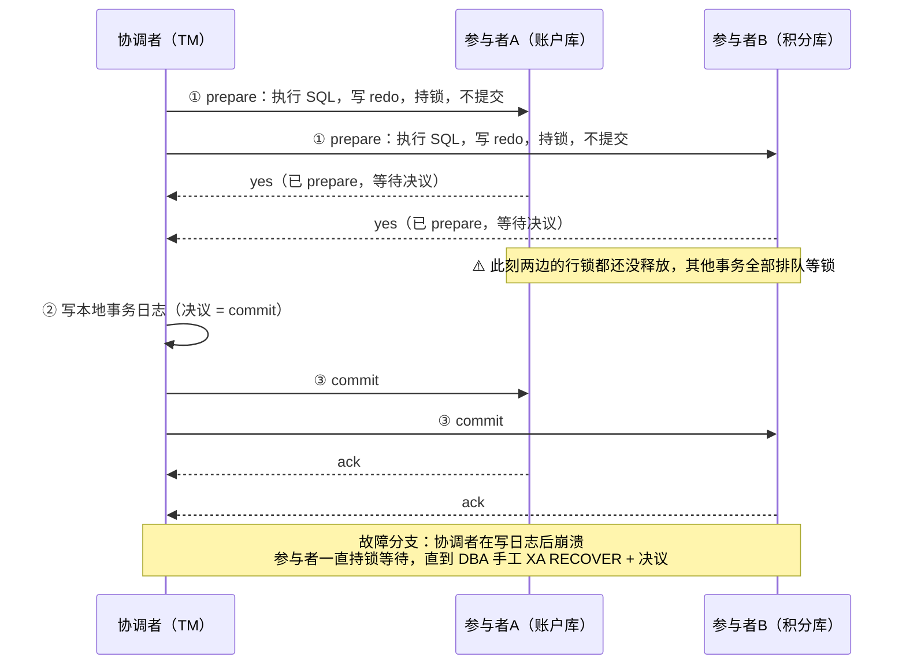
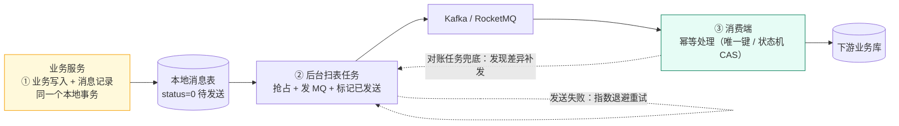
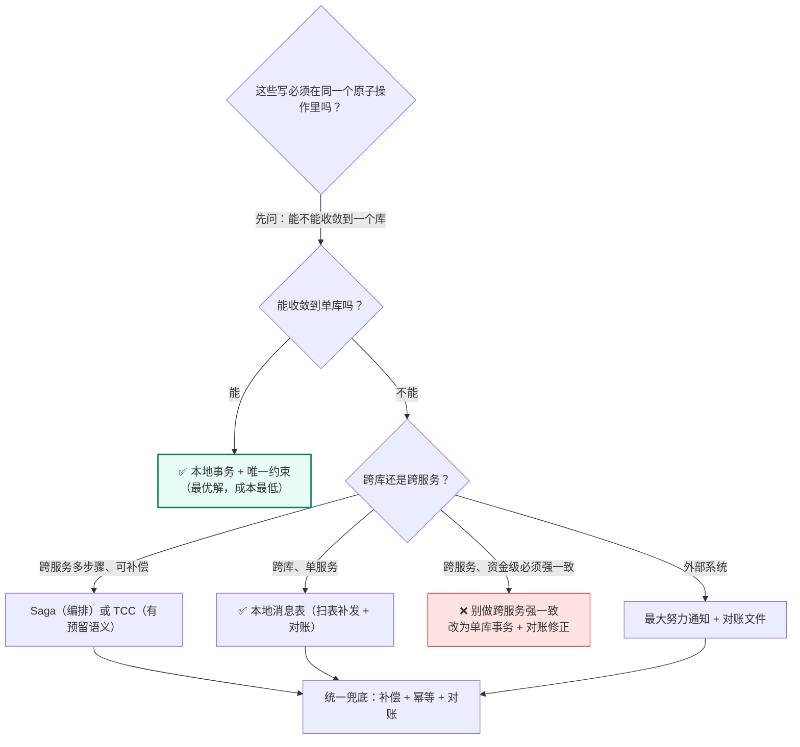
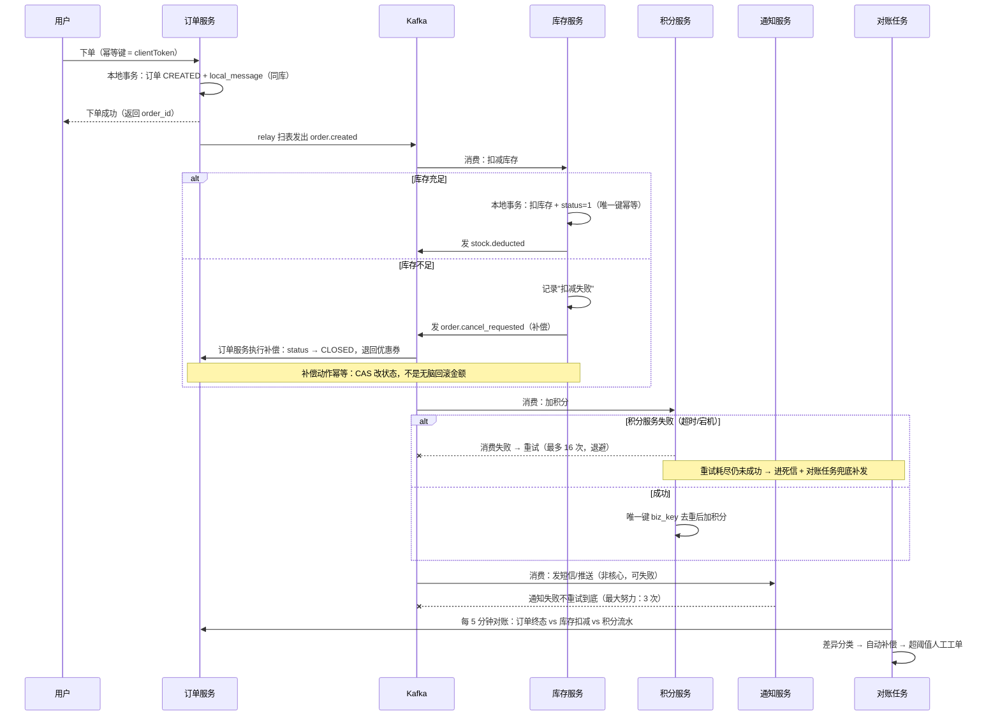

# 09 · 分布式事务与最终一致落地

> 属于「架构师修炼」· 一致性专题（坎 4 的代价 · 跨服务数据一致性）· **先论证"能不能不做分布式事务"，再讲"真要做怎么做"**
> 上一篇：[08 缓存与 DB 一致性落地](./08-缓存与DB一致性落地)　下一篇：[10 etcd 与 Raft 选主租约落地](./10-etcd与Raft选主租约落地)

> **这篇解决什么问题**：面试官问「订单扣了库存、加了积分、发了通知，中间挂了怎么办」，90% 的人会背 TCC 三个阶段，然后就答不下去了——因为他讲不出**空回滚和悬挂具体怎么防**、**补偿失败了谁来兜底**、**最终一致到底多快能一致**。这一篇的顺序是：**① 先立判据（这笔数据值不值得引入分布式事务，能不能用架构手段根本绕开它）；② 讲清 2PC 为什么死了；③ 逐个对齐六种主流方案的一致性/性能/侵入性/失败处理；④ 给出终极答案：补偿 + 幂等 + 对账三件套；⑤ 把订单链路完整走一遍，每一步的失败与对账都写清楚。**

---

## 一、先立判据：需不需要分布式事务

### 1.1 判据来自数据分级（不是来自技术偏好）

按 [01 篇](./01-QPS分级与架构演进地图)的数据分级，直接查表：

| 分级 | 数据 | 分布式事务的必要性 | 实际落地方案 |
| --- | --- | --- | --- |
| **P0 资金级** | 余额、订单金额、支付流水 | **必须强一致，但绝不用跨服务强一致** | **单库本地事务 + 唯一约束**（把余额与流水放在同一个库）+ 跨系统只做**最终一致 + T+1 对账** |
| **P1 关键业务** | 库存、优惠券、任务状态 | 不需要强一致，需要**可补偿 + 可收敛** | 本地消息表 / Saga / TCC；状态机 + 唯一键幂等 |
| **P2 用户可见** | 帖子、评论、粉丝数 | 不需要 | MQ 异步 + 幂等消费 + 定时对齐 |
| **P3 / P4 统计与分析** | 播放量、点赞数、热榜、埋点日志 | 完全不需要 | Redis 计数 + 定时落库（[08 篇](./08-缓存与DB一致性落地)）；埋点走 Kafka + 数仓，允许丢少量 |

> **判据一句话**：**问「这笔数据错一次，业务损失是什么」**。答案是"钱错了/超卖了" → 强一致，但**想办法把它塞进一个库**；答案是"用户会看到不一致，但几分钟后能修好" → 最终一致 + 对账；答案是"只是不好看" → 异步就行，别加复杂度。

### 1.2 架构上避免分布式事务，比解决它更高级

这是本篇最重要的一句话。**分布式事务是"设计失误的补偿手段"，不是"能力的象征"**。三条收敛手段，优先级从高到低：

| 反模式（把问题留给分布式事务） | 正解（在架构上消灭它） | 收益 |
| --- | --- | --- |
| 为了"微服务纯洁"，把**余额**和**流水**拆到两个服务两个库 | **同库同事务**：余额、流水、账户明细必须在同一个库、同一个事务里；服务边界按**事务边界**划 | 拿到 ACID，零分布式事务成本（这是财务系统的铁律） |
| 订单服务和库存服务**同步 RPC 扣减**，要求"要么都成功要么都失败" | 把"必须原子"的写（订单 + 库存预占）放在**同一个服务的同一个库里**；跨服务的部分改成**异步 + 补偿** | 消除跨服务强依赖，延迟从 150ms 降到 20ms |
| 用"查一次 + 判断 + 插入"防重复提交，或用分布式锁保证"同一笔业务只处理一次" | `UNIQUE KEY` 唯一约束 + `INSERT ... ON DUPLICATE KEY`；幂等键 + 去重表（[11 篇](./11-幂等去重与ExactlyOnce)） | 用 DB 的原子性代替分布式事务，**成本几乎为 0**；从"防止重复"变成"重复了也无害" |
| 多步骤链路要求"全成功，失败就整体回滚" | 设计成**状态机**：中间态可查询、可重入、可续跑 | 不需要原子回滚，只需要"继续往前跑" |

> **面试金句**：**「分布式事务的第一个答案，是重新划事务边界——把必须强一致的写收敛到一个库。如果画完边界还有跨服务的强一致需求，那多半是服务拆错了，而不是缺一个 Seata。」**

---

## 二、2PC / XA：原理与致命缺陷

### 2.1 两阶段提交流程



### 2.2 致命缺陷与 MySQL XA 的具体坑

| 缺陷 | 具体表现 | 工程后果 |
| --- | --- | --- |
| **同步阻塞** | prepare → commit 之间，参与者**持有行锁不放** | 热点行锁等待；并发一上来就是**锁超时 / 死锁** |
| **协调者单点** | 协调者崩溃后参与者不知道 commit 还是 abort | 只能等协调者恢复/查日志，**资源长期被占**，需要 DBA 介入 |
| **性能差** | 两轮网络 RTT + 两次日志 fsync + 长事务 | 单事务 P99 从 10ms 涨到 100ms+；吞吐降一个数量级 |
| **不一致窗口** | commit 阶段部分参与者提交后网络断了 | 需要"推测中止/推测提交"+ 人工核对，**2PC 本身不保证分区容忍下的收敛** |
| **MySQL XA 特有坑** | ① `max_prepared_transactions` **默认 0**，不开根本用不了 ② 连接异常断开 → 事务**悬挂在 prepared 状态**，要 `XA RECOVER` 手工 `ROLLBACK` ③ `XA START` 只读事务不能 `XA END`/`COMMIT`（XA-1 报错）④ 与 binlog 两阶段提交的协调（group commit）让崩溃恢复更复杂 ⑤ 长事务推高 `innodb_lock_wait_timeout` 触发频率 | 运维复杂度剧增，**故障时只能靠 DBA 手工救** |

> **结论（背下来）**：**2PC/XA 只适合"低并发、跨库、可容忍秒级阻塞"的内部批处理场景**（如日终账务调账）。**任何在线高并发链路都不该用 XA。** 面试里说"我们用 XA 保证跨库一致性"，等于说"我们没上过线"。

---

## 三、六种主流方案逐一对齐

### 3.1 TCC（Try-Confirm-Cancel）

| 阶段 | 职责 | 幂等要求 | 失败处理 |
| --- | --- | --- | --- |
| **Try** | **预留**资源（冻结余额、预占库存、锁定券），不真正生效 | 必须幂等（重复 Try 只预留一次） | 失败 → 由协调者对该事务所有分支发 Cancel |
| **Confirm** | 确认使用预留资源（真正扣减、真正占用） | **必须幂等**（网络重试会重复到达） | 失败 → **重试 + 对账**（此时业务已生效，不能回滚） |
| **Cancel** | 释放预留资源（解冻、释放库存） | **必须幂等** | 失败 → 重试 + 告警 + 人工 |

**TCC 的三大坑（面试必考，一定要讲具体机制）**：

| 坑 | 怎么发生的 | 正确解法 | 错误解法（会被追问打穿） |
| --- | --- | --- | --- |
| **空回滚** | Try 请求**根本没到达**（网络丢包/超时未执行），协调者却发了 Cancel → Cancel 执行"解冻"，**账上凭空多出钱** | ① 建**事务控制表**，Cancel 时先查 Try 记录；② 查不到 → 判定为空回滚，**插入一条状态为 CANCEL 的控制记录**（为防悬挂留痕），直接返回成功，**不做任何资源操作** | "Cancel 只更新余额表，影响行数为 0 就当成功"——如果余额已经被别的逻辑改过，这里会算错 |
| **悬挂** | Try 超时 → 协调者发 Cancel（执行成功）→ **Try 才姗姗来迟**并执行成功 → 资源被预留，但**永远不会有人 Confirm**（该分支已结束）→ **资源永久冻结** | Cancel 时的"空回滚留痕"（状态=CANCEL）**就是防悬挂的关键**：Try 执行前先 `INSERT` 控制记录（`UNIQUE KEY`），**插入冲突说明已被 Cancel → 直接拒绝 Try** | 只靠"Cancel 时留痕"但不校验 Try 的插入——那还是挡不住迟到的 Try |
| **幂等** | Confirm / Cancel 被网络重试重复调用多次 | 控制表状态判断：只有 `TRY → CONFIRM` / `TRY → CANCEL` / `空 → CANCEL` 这三个**单向迁移**才产生副作用；重复到达的状态直接返回成功 | "靠 Try 的预留余额够不够"来判断——不可靠 |

```sql
-- TCC 事务控制表：空回滚 / 悬挂 / 幂等三大坑全靠它兜住
CREATE TABLE tcc_branch (
  tx_id     BIGINT        NOT NULL COMMENT '全局事务 ID',
  branch_id VARCHAR(64)   NOT NULL COMMENT '分支 ID（服务名 + 业务键）',
  status    TINYINT       NOT NULL COMMENT '1=TRY 2=CONFIRM 3=CANCEL（只允许单向迁移）',
  amount    DECIMAL(18,2) NOT NULL DEFAULT 0 COMMENT '预留金额，便于对账',
  PRIMARY KEY (tx_id, branch_id),
  UNIQUE KEY uk_biz (branch_id)          -- 防悬挂：Try 插入冲突 = 该分支已被 Cancel
) ENGINE=InnoDB;

-- Try（防悬挂）：先抢控制记录，唯一键冲突说明已被 Cancel，直接拒绝
INSERT INTO tcc_branch(tx_id, branch_id, status, amount) VALUES (?, ?, 1, ?);
UPDATE account SET frozen = frozen + ? WHERE user_id = ? AND balance - frozen >= ?;
-- Cancel（含空回滚）：查不到 TRY 记录 → 插入 CANCEL 留痕后直接返回，不做任何资源操作
UPDATE tcc_branch SET status = 3 WHERE tx_id = ? AND branch_id = ? AND status = 1; -- 影响 0 行 = 重复 Cancel 或空回滚
```

| TCC 评价 | 说明 |
| --- | --- |
| 一致性强度 | **准强一致**（资源在 Try 阶段就被预留，业务侧不会超卖） |
| 性能 | 中（3 次 RPC/分支，但无长事务持锁；比 XA 好一个数量级） |
| **侵入性** | **最高**：每个参与方都要实现 Try/Confirm/Cancel 三个接口 + 控制表，业务代码改动 3 倍 |
| 适用场景 | 资金冻结解冻、库存预占、券锁定这类**天然有"预留"语义**的业务 |
| 失败处理 | Confirm/Cancel 重试 + 控制表状态机 + 对账；**Confirm 阶段失败不能让业务回滚**，只能重试 |

### 3.2 Saga：正向链路 + 反向补偿

| 维度 | 编排式（Orchestration） | 协同式（Choreography） |
| --- | --- | --- |
| 结构 | 中央协调器按状态机依次调用各服务 | 各服务监听事件，自行决定下一步 |
| 可观测性 | **好**（协调器有完整状态机，一眼看到卡在哪一步） | 差（链路散在各服务的事件订阅里） |
| 耦合度 / 复杂度 | 协调器知道所有步骤，且它是单点（要 HA） | 服务间松耦合，但**谁都不知道全局**，事件环路/重复消费风险高 |
| 适用 | 步骤 3~10 个、需要人工介入兜底的业务（订单、履约） | 步骤少、参与方稳定、已有成熟事件总线 |

**Saga 的三个必答点**：① **补偿必须幂等**——补偿本身也会重试（`UPDATE ... SET status='CANCELLED' WHERE id=? AND status='CREATED'`，靠状态 CAS 而不是无脑扣减）；② **不可逆操作怎么办**——短信已发、券已核销、货已出库，补偿要设计成**对冲操作**（发一条更正短信、补发一张券），或**把不可逆步骤放到链路最后一步**；③ **Saga 没有隔离性**——中间态对外可见，要用**语义锁**（状态标 `PENDING`，读方按状态分支渲染）+ 前端友好文案（"处理中"）。

### 3.3 本地消息表（最实用，工程首选）

**核心思想**：**把"发消息"变成"写本地一行数据"**——业务写入与消息记录在**同一个本地事务**里，于是"业务成功但消息丢了"这个经典问题被 DB 的原子性消灭了。



```sql
CREATE TABLE local_message (
  id            BIGINT      NOT NULL AUTO_INCREMENT,
  biz_key       VARCHAR(96) NOT NULL COMMENT '业务唯一键，如 order_created:10086，用于幂等去重',
  topic         VARCHAR(64) NOT NULL,
  payload       JSON        NOT NULL,
  status        TINYINT     NOT NULL DEFAULT 0 COMMENT '0=待发送 1=发送中 2=已确认',
  retry_count   INT         NOT NULL DEFAULT 0,
  next_retry_at DATETIME(3) NOT NULL DEFAULT CURRENT_TIMESTAMP(3),
  PRIMARY KEY (id),
  UNIQUE KEY uk_biz (biz_key),
  KEY idx_scan (status, next_retry_at)   -- 扫表必须走这个索引，否则表一大就退化成全表扫
) ENGINE=InnoDB;
-- 消费端幂等另建去重表 consumed_message(biz_key PRIMARY KEY)：插入冲突 = 已处理过，直接返回成功
```

```go
// ① 业务写入与消息记录：同一个本地事务（这是本地消息表的全部前提）
func (s *OrderService) CreateOrder(ctx context.Context, req CreateOrderReq) (*Order, error) {
	tx, err := s.db.BeginTx(ctx, nil)
	if err != nil {
		return nil, err
	}
	defer tx.Rollback() //nolint:errcheck // Commit 后为 no-op

	orderID := s.idGen.Next()
	if _, err = tx.ExecContext(ctx,
		`INSERT INTO orders(id, user_id, amount, status) VALUES(?, ?, ?, ?)`,
		orderID, req.UserID, req.Amount, StatusCreated); err != nil {
		return nil, fmt.Errorf("insert order: %w", err)
	}

	// 消息与业务同事务落库：要么都在，要么都不在 —— 不存在"扣了钱没发消息"
	payload, _ := json.Marshal(OrderCreatedEvent{OrderID: orderID, UserID: req.UserID, Amount: req.Amount})
	if _, err = tx.ExecContext(ctx,
		`INSERT INTO local_message(biz_key, topic, payload, status, next_retry_at)
		 VALUES(?, ?, ?, 0, NOW(3)) ON DUPLICATE KEY UPDATE biz_key = biz_key`, // 重复提交不报错 = 幂等
		fmt.Sprintf("order_created:%d", orderID), TopicOrderCreated, payload); err != nil {
		return nil, fmt.Errorf("insert local message: %w", err)
	}
	if err = tx.Commit(); err != nil {
		return nil, fmt.Errorf("commit: %w", err)
	}
	return &Order{ID: orderID, Status: StatusCreated}, nil
}
```

```go
// ② 后台扫表发消息：CAS 抢占 + 指数退避，天然支持多实例并行
func (s *MessageRelay) relayOnce(ctx context.Context) (int, error) {
	rows, err := s.db.QueryContext(ctx, `
		SELECT id, topic, payload, retry_count FROM local_message
		WHERE status = 0 AND next_retry_at <= NOW(3) ORDER BY id LIMIT 200`)
	if err != nil {
		return 0, err
	}
	defer rows.Close()

	var sent int
	for rows.Next() {
		var id int64
		var topic string
		var payload []byte
		var retry int
		if err := rows.Scan(&id, &topic, &payload, &retry); err != nil {
			return sent, err
		}
		// CAS 抢占：多实例并发扫表时，只有一个能把 status 0 → 1
		res, err := s.db.ExecContext(ctx,
			`UPDATE local_message SET status = 1 WHERE id = ? AND status = 0`, id)
		if err != nil {
			return sent, err
		}
		if n, _ := res.RowsAffected(); n == 0 {
			continue // 被别的实例抢到了
		}
		// 发送：生产端必须 acks=all + 幂等 producer（见 05 篇）
		if err := s.producer.Send(ctx, topic, payload); err != nil {
			backoff := time.Duration(1<<min(retry, 8)) * time.Second // 1s→2s→…→256s，上限 5min
			if backoff > 5*time.Minute {
				backoff = 5 * time.Minute
			}
			_, _ = s.db.ExecContext(ctx, `
				UPDATE local_message SET status = 0, retry_count = retry_count + 1,
				       next_retry_at = NOW(3) + INTERVAL ? SECOND WHERE id = ?`,
				int(backoff.Seconds()), id)
			if retry+1 >= 10 { // 超过 10 次转人工告警，绝不无限重试
				s.alert.Warnf("local message retry exhausted id=%d topic=%s", id, topic)
			}
			continue
		}
		// 发送成功 → 标记已确认（归档任务清理 7 天前的 status=2 记录，防表膨胀拖慢扫表）
		if _, err := s.db.ExecContext(ctx, `UPDATE local_message SET status = 2 WHERE id = ?`, id); err != nil {
			return sent, err
		}
		sent++
	}
	return sent, rows.Err()
}
```

| 参数 | 建议值 | 理由 |
| --- | --- | --- |
| 扫表间隔 | **200ms ~ 1s**（或"本地事务提交后立即触发 + 定时兜底"） | 间隙越小延迟越低，但空扫浪费 DB；**积压时按积压量自适应缩短间隔** |
| 批大小 | 200 条 | 太大 → 单轮耗时长、失败重试代价高 |
| 退避 | 1s → 2s → 4s → … 上限 **5min** | 应对 MQ 短暂不可用，避免打爆 MQ |
| 重试上限 | 10 次 | 超过即**告警 + 人工**（绝不无限重试，会掩盖故障） |
| 退避 / 重试上限 | 1s → 2s → 4s → … 上限 **5min**；最多 10 次 | 应对 MQ 短暂不可用且不打爆 MQ；超过 10 次即**告警 + 人工**（绝不无限重试，那会掩盖故障） |
| 清理 / 监控 | 归档 `status=2` 且 7 天前的记录；看**待发送条数 + 最老待发送消息的年龄** | 表膨胀正是"扫表变慢→积压"的根因；这两个指标比"扫表是否在跑"重要得多 |

### 3.4 事务消息（RocketMQ 半消息 + 回查）

| 阶段 | 动作 | 失败处理 |
| --- | --- | --- |
| ① 发半消息 | 消息写入 Broker 但**对消费者不可见** | 发送失败 → 直接失败，业务不执行 |
| ② 执行本地事务 → commit / rollback | 半消息发送成功后执行本地事务；成功则 commit 投递 | 本地事务失败 → 发 rollback，消息丢弃；commit 请求丢失 → Broker **回查** |
| ③ 回查 | Broker 定时回查生产者"这笔本地事务到底成没成" | 生产者必须能**查本地事务状态表**回答；回查默认最多 15 次，仍无结论 → **消息丢弃（要告警）** |

> **事务消息 vs 本地消息表**：事务消息把"消息表"搬进了 MQ（少一张表、少一个扫表任务），但**回查逻辑必须依赖本地事务状态记录**，本质上还是"要有一张表能回答事务结果"。**没有 MQ 事务能力时，本地消息表是更可控的选择。**

### 3.5 最大努力通知（对账兜底型）

适合**外部系统**（第三方支付回调、外部履约平台）：不可能和它共享事务，也不可能让它实现 TCC。

| 环节 | 做法 |
| --- | --- |
| 通知 / 退让 | 收到外部事件后**最多重试 N 次**（如 5 次，间隔 1min/5min/10min/30min/60min）；重试耗尽**不阻塞业务**，标记为"待对账" |
| 兜底 / 幂等 | **主动查询接口 + T+1 对账文件**（真正的保证来自对账，不是来自重试）；通知与查询共用同一套幂等键（外部单号） |

> **关键认知**：最大努力通知**不承诺可靠**，它的承诺是"**最终一定会被对账发现并修复**"。所以它必须和对账系统一起设计，单独讲最大努力通知等于没讲。

### 3.6 Seata AT：全局锁 + undo log

| 环节 | 机制 |
| --- | --- |
| 一阶段 | 拦截业务 SQL，生成 **before image / after image** 存入 `undo_log`；**本地事务直接提交**（释放本地行锁）；同时向 TC 注册分支并申请**全局行锁** |
| 二阶段 | 提交 → TC 通知后**异步删除** `undo_log`（极快）；回滚 → 用 before image 反向补偿，且**回滚前校验 after image 与当前数据一致**（不一致 = 被脏写，要人工） |
| 代价 | ① 全局锁按**行**加，热点行（如秒杀库存）上全局锁竞争 → **吞吐显著下降** ② `undo_log` 表增长快，要定期清理 ③ 需要独立部署 TC（Seata Server，要 HA，又引入 Raft/DB 存储）④ 脏写检测失败要人工 |

> **适用边界**：已有 Java/Seata 生态、**并发不高**、想用最小改造拿到"可回滚"能力的系统。**高并发在线链路不要用 AT**。

### 3.7 选型矩阵与决策树

| 方案 | 一致性强度 | 单链路额外延迟 | 侵入性 | 适用场景 | 失败处理 | 推荐度 |
| --- | --- | --- | --- | --- | --- | --- |
| **本地事务 + 唯一约束** | 强（单库） | 0 | 无 | **一切能收敛到单库的场景** | DB 自己保证 | ★★★★★ |
| **本地消息表** | 最终一致（秒级） | 0（异步） | 低（一张表 + 一个任务） | 跨库单服务、事件驱动、已有 MQ 或可加 | 扫表重试 + 对账 | ★★★★★ |
| **事务消息** | 最终一致（秒级） | 0（异步） | 低 | 已有 RocketMQ 且会用回查 | MQ 回查 + 对账 | ★★★★ |
| **Saga** | 最终一致（秒~分钟） | 1 次协调 RTT/步 | 中（每步要写补偿） | 跨服务多步骤、可补偿（订单履约、审批流） | 补偿重试 + 人工 | ★★★★ |
| **TCC** | 准强一致（预留语义） | 2~3 次 RPC/分支 | **高**（3 接口 + 控制表） | 资金冻结、库存预占、券锁定 | Confirm/Cancel 重试 + 对账 | ★★★ |
| **最大努力通知** | 最终一致（分钟~T+1） | 0 | 低 | 外部系统交互 | **对账文件兜底** | ★★★ |
| **Seata AT** | 准强一致（可回滚） | 全局锁等待（不确定） | 低（框架代劳） | 低并发、Seata 生态内 | 二阶段自动回滚 | ★★ |
| **2PC / XA** | 强（理论） | 高（持锁阻塞） | 中 | 离线批处理、跨库日终 | DBA 手工介入 | ★（在线禁用） |



**决策树一句话版**：**跨库单服务 → 本地消息表；跨服务多步可补偿 → Saga/TCC；资金强一致 → 不做，改成单库事务 + 对账；已有 MQ → 事务消息；外部系统 → 最大努力通知 + 对账。**

---

## 四、一致性的终极答案：补偿 + 幂等 + 对账

### 4.1 三件套的分工（背下来）

| 件 | 解决什么 | 靠什么实现 | 缺了会怎样 |
| --- | --- | --- | --- |
| **本地事务** | **原子性**（单个库内） | DB ACID | 自己库内都不一致，无从谈起 |
| **补偿** | 跨服务**回滚/推进** | Saga 反向操作 / 状态机续跑 / 重试 | 中间态永久卡住 |
| **幂等** | **重复执行无害** | 唯一键 / 状态机 CAS / 去重表（[11 篇](./11-幂等去重与ExactlyOnce)） | 重试导致重复扣款、重复发货 |
| **对账** | **发现并修复**任何漏掉的差异 | 定时比对两端 + 自动补偿 + 人工工单 | **最终一致变成"永远不一致"** |

> **一句话**：**原子性靠本地事务，跨服务靠最终一致，最终一致靠对账收口。没有对账的最终一致 = 裸奔。**

### 4.2 完整链路：订单 → 库存 → 积分 → 通知



| 步骤 | 幂等键 | 失败表现 | 补偿动作 | 对账方式 | 一致性窗口 |
| --- | --- | --- | --- | --- | --- |
| 创建订单 | `clientToken`（客户端生成，唯一键） | 用户重试 → 命中唯一键返回原订单 | 无需补偿（本地事务已保证） | 订单表自身状态一致 | 0（强一致） |
| 发 MQ | `biz_key = order_created:{id}` | 扫表重试，退避到 5min | 无（重试即补偿） | 待发送条数 / 最老消息年龄 | 秒级（通常 < 1s） |
| 扣库存 | `biz_key = stock_deducted:{order_id}` | 库存不足 → **业务性失败**；宕机 → 技术性失败重试 | 库存不足 → 发起取消订单；技术失败 → 重试 | 订单已支付数 vs 库存扣减记录数 | 秒级 |
| 加积分 | `biz_key = points_added:{order_id}` | 重试耗尽 → 死信 | 对账发现后补发 | 已支付订单数 vs 积分流水数 | 分钟级（对账周期） |
| 发通知 | `biz_key = notify:{order_id}` | 3 次后放弃 | 无（用户可主动查询） | 不参与资金对账 | 分钟~T+1 |

**要讲清的三句关键话**：① **前一步的"成功"要落成状态记录，后一步靠状态记录驱动**——这就是下面第五节的状态机思想；② **业务性失败（库存不足）和技术性失败（超时/宕机）必须分开处理**：前者要补偿（取消订单），后者只能重试（不能因为超时就取消用户订单）；③ **通知类步骤不参与资金对账**，不要为了"全都成功"把非核心步骤做成强依赖——那是把可用性送给非核心链路。

---

## 五、状态机与超时：把"回滚"变成"续跑"

### 5.1 状态机只允许单向迁移（用 CAS，不用读-改-写）

| 状态 | 含义 | 允许迁移到 | 触发者 |
| --- | --- | --- | --- |
| `CREATED` | 订单已创建，等待扣库存 | `STOCK_DEDUCTED` / `CLOSED` | 库存服务回调 |
| `STOCK_DEDUCTED` | 库存已扣，等待支付 | `PAID` / `CLOSING` | 支付回调 / 超时任务 |
| `PAID` | 已支付，等待履约与积分 | `FULFILLED` | 履约服务 |
| `FULFILLED` | 终态 | —— | —— |
| `CLOSED` | 终态（未支付关闭 / 库存不足取消） | —— | 超时任务 / 补偿 |

```sql
-- 所有状态迁移都用 CAS：影响行数为 0 说明"状态已被别人改过"，直接放弃（这就是幂等）
UPDATE orders SET status = 'STOCK_DEDUCTED', updated_at = NOW(3)
WHERE id = ? AND status = 'CREATED';   -- RowsAffected == 0 → 已迁移过，返回成功即可
```

### 5.2 超时回查与"悬挂"的通用解法

| 问题 | 通用解法 |
| --- | --- |
| **中间态卡住**（如订单停在 `CREATED` 超过 15 分钟） | 定时任务扫描中间态：`WHERE status IN ('CREATED','STOCK_DEDUCTED') AND updated_at < NOW() - INTERVAL 15 MINUTE`；**主动向对端查询真实状态**，再决定"补推进"还是"补偿" |
| **中间态堆积**（扫描出 10 万条） | 说明下游持续故障 → **先告警止损**（阈值：单次扫描 > 1000 条 或 最老中间态 > 30 分钟），不要指望任务自己扫完 |
| **悬挂（迟到的 Try / 迟到的消息）** | 三件套：① **先落状态记录再执行动作**（write-ahead intent：先写"我要做这件事"再去做）② **唯一键**让迟到者无法插入 ③ **状态机单向迁移**让迟到者发现"状态已终态"而拒绝执行 |
| **超时时间怎么定** | 业务可接受的最长等待 —— 支付回调超时取 15 分钟（覆盖用户支付全流程），库存扣减超时取 30 秒（内部 RPC P99 × 10 倍）；**超时值必须写进配置**，不能散落在代码里。回查本身会重复执行（可能多实例并发），必须用 CAS / 唯一键保证只生效一次 |

> **核心心法**：**「不要问『怎么回滚』，要问『现在这个状态，我下一步该做什么』」**——只要每一步都能从当前持久化状态重新推导出下一步，链路就永远不会卡死，也就不需要分布式事务的"原子回滚"。

---

## 六、对账系统设计：最终一致的最后一道防线

### 6.1 T+1 全量对账 vs 准实时对账

| 维度 | T+1 全量对账 | 准实时对账（每 5 分钟） |
| --- | --- | --- |
| 数据源 | **对账文件**（第三方/银行/渠道下发）+ 内部账（DB 流水表） | 双方**接口查询**或增量宽表 |
| 覆盖 | 100% 全量，能发现任意长尾差异 | 只覆盖最近窗口（如近 30 分钟变更） |
| 时效 / 成本 | 差异最早 T+1 才发现；低（离线跑，可慢慢跑） | 差异 5 分钟内发现并修复；高（要限速、避免打爆在线库） |
| 关系 | **准实时对账不能替代 T+1 全量对账**：前者抓不到"从未进入增量窗口"的脏数据 | 两者都要有，准实时先跑，T+1 做终审 |

### 6.2 差异分类与处置

| 类型 | 名称 | 成因 | 处置 | 时限 |
| --- | --- | --- | --- | --- |
| **A** | **单边账** | 我方有、对方无（消息丢了/补偿多发）；对方有我方无（回调丢了） | 自动补偿：我方多 → 发起冲正；我方少 → 补录流水（**必须带人工审批标记**） | 5 分钟自动，超阈值转工单 |
| **B** | **金额不符** | 精度/币种/手续费计算差异、部分退款 | **禁止自动修复**（金额差异可能是系统性 bug）→ 立即告警 + 人工核查 | 立即 |
| **C** | **状态不符** | 状态机漂移（我方 PAID、对方 CLOSED） | 以**权威方（通常是渠道/资金方）为准**推进状态机；记录原因 | 15 分钟 |
| **D** | 时间不符 | 时区、`updated_at` 语义（创建时间当成更新时间） | 修工具/修语义，**不是数据问题** | 排查即可 |

### 6.3 工程要点

| 要点 | 做法 |
| --- | --- |
| **解析与修复都必须幂等** | 对账文件按 `(biz_date, channel)` 唯一键**重跑覆盖**而不是追加；修复动作按 `(batch_id, diff_id)` 去重，允许**整批重跑**且无副作用 |
| **diff 结果落库 + 可重放** | 每次对账生成一个 `reconcile_batch`，差异明细挂在其下，可追溯、可重放 |
| **自动补偿上限** | 单批自动补偿 ≤ 100 条且单条金额 ≤ 100 元，超过即 **暂停自动补偿 + 人工工单**（防"自动补偿掩盖系统性 bug"） |
| **对账任务自身的监控 + 工单闭环** | 心跳 + 最近成功时间（**"对账任务没跑"是最危险的故障**）；差异 → 工单 → 处理 → **回报状态到对账系统**（否则下次对账又报同一条，形成噪声） |

---

## 七、故障与一致性边界

| 故障 | 现象 | 影响 | 处置 | 一致性边界 |
| --- | --- | --- | --- | --- |
| **补偿失败** | Cancel/反向操作报错或超时；TCC Confirm 无法确认 | 业务停在中间态 / 资源冻结但不生效 | 重试（退避）+ 死信 + 对账兜底；重试超限 → 告警 + 人工。**Confirm 失败不能回滚**（Try 已对外承诺），只能重试 + 对账 | 补偿失败 = **链路卡在中间态**，业务侧要能容忍（展示"处理中"），不能当成功 |
| **消息重复** | 消费端收到同一消息多次 | 重复扣款/重复发货 | 唯一键 + 状态机 CAS，重复执行返回成功（**幂等不是"尽量避免重复"，而是"重复了也无害"**） | 幂等失效 = 资损；所以幂等键必须是**业务唯一键**而不是消息 ID |
| **中间态堆积** | 扫描出大量 `CREATED` / `PENDING` | 用户看到大量"处理中"；资金/库存被长期占用 | 阈值告警（> 1000 条）→ 定位下游 → 补推进或批量补偿 | 堆积期间一致性未收敛；**堆积本身要当成一次小故障来处理并复盘** |
| **对账任务挂了** | 无异常日志，但差异在累积 | **一致性的最后防线失效** | 心跳告警 + 下次运行补跑全量窗口；差异累积 = 必须手工确认无资损 | 对账停了多久，就意味着有多久"没人知道是否一致" |
| **MQ 整体不可用** | 消息发不出去 | 下游全部停更 | 本地消息表扫表重试（退避到 5min）+ 积压监控；**业务主链路不受影响**（写本地库 + 消息表在同事务里） | 窗口 = MQ 恢复时间；恢复后按序重放，靠幂等去重 |
| **事务回查无结论** | 半消息回查 15 次仍失败 | 消息被丢弃 | 告警 + **对账任务补偿**（这就是为什么回查必须能查本地事务状态表） | 该消息对应的业务可能已成功 → 靠对账发现 |

---

## 八、面试追问链

1. **「跨服务转账怎么做？」** → 第一层先否定题型：「**先问能不能不做成跨服务**——把付款方和收款方的账户放在同一个库，就是一个本地事务，这是财务系统的标准做法。」第二层如果确实要跨系统（比如跨行），那不是"分布式事务问题"而是"**最终一致 + 对账**问题"：本地事务记流水 + 本地消息表发出（同库同事务）→ 对端幂等入账 → **T+1 全量对账 + 准实时增量对账**，差异分级（单边账/金额不符）自动补偿或人工工单；**金额类差异绝不自动修复**。
2. **「TCC 的空回滚和悬挂是什么？」** → 空回滚：**Try 没执行**（丢包/超时未到达），Cancel 却到了，若无脑执行解冻就会**凭空加钱**；解法是 Cancel 先查事务控制表，查不到 Try 记录就判为空回滚，**插入一条 CANCEL 状态记录留痕**并直接返回成功。悬挂：Try 超时 → Cancel 先执行成功 → **迟到的 Try 又执行了**，资源被预留但永远没人 Confirm，**永久冻结**；解法就是靠空回滚留下的那条 CANCEL 记录——Try 执行前先 `INSERT` 控制记录（唯一键），**冲突即说明已被 Cancel，直接拒绝 Try**。两者是同一个控制表的两个方向，缺一不可。
3. **「为什么不用 XA？」** → 三个硬伤：① **同步阻塞**——prepare 后到 commit 前参与者一直持行锁，热点行直接排队，并发一上来就锁超时；② **协调者单点**——协调者挂了参与者不知道该提交还是回滚，资源被长期占用，要 DBA 手工 `XA RECOVER`；③ **性能**——两轮 RTT + 两次 fsync，P99 从 10ms 涨到 100ms+。加上 MySQL 的具体坑（`max_prepared_transactions` 默认 0、连接断开导致事务悬挂、只读 XA 不能提交）。所以 XA 只用于离线低并发场景；在线链路用本地消息表/Saga 这类"**非阻塞 + 可补偿**"的方案。
4. **「本地消息表的扫表间隔与积压怎么处理？」** → 间隔取 **200ms~1s**，并且做成自适应：**积压越多扫得越勤**（空扫时拉长间隔省 DB）。积压处理分三层：① **定位**——是 MQ 挂了（看 MQ 健康度）还是下游消费太慢（看消费延迟，[05 篇](./05-Kafka削峰与可靠投递落地)），还是扫表任务自己挂了（心跳告警）；② **止损**——加大 relay 并发（CAS 抢占天然支持多实例）、提高批大小到 500~1000、必要时临时直连下游；③ **治理**——`status=2` 的记录定期归档（**表膨胀正是扫表变慢的常见根因**，索引 `(status, next_retry_at)` 必须建）。监控最重要的是**"最老待发送消息的年龄"**，不是"任务在不在跑"。
5. **「最终一致到底多久才能一致？」** → 必须给分层的数字，而不是笼统的"最终会一致"：**正常路径**——本地事务提交后 200ms~1s 被 relay 扫出发出，消费端处理 10~100ms → **P99 在 2 秒内**；**MQ 抖动/下游故障**——退避重试到 5 分钟一次，**恢复后 5 分钟内追平**；**重试耗尽（超过 10 次）**——进死信，靠对账收口 → **准实时对账 5 分钟、T+1 全量对账兜底**。完整答案是：**"P99 秒级，异常情况 5 分钟内，最坏情况靠 T+1 对账修复——这几个数字要能分别报出来，并说明每一档的触发条件。"**

## 九、自测清单

- [ ] 能按数据分级（P0/P1）判断"要不要分布式事务"，并说出为什么 P0 也应尽量收敛到单库
- [ ] 能说出至少三条"用架构手段避免分布式事务"的具体做法（同库同事务/唯一约束/状态机）
- [ ] 能画出 2PC 时序图，并说出三个致命缺陷 + MySQL XA 的两个具体坑
- [ ] 能讲清 TCC 的空回滚与悬挂，并写出事务控制表的关键字段与状态迁移
- [ ] 能手写本地消息表（建表 SQL + 同事务写入 + 扫表重试 + 消费幂等），并说出扫表间隔/批大小/退避/清理参数
- [ ] 能在选型矩阵里给「跨库单服务 / 跨服务可补偿 / 资金强一致 / 外部系统」四类场景各选一个方案并说明理由
- [ ] 能背出"补偿 + 幂等 + 对账"三件套，并说清缺了任何一件会发生什么
- [ ] 能设计一个对账系统：T+1 与准实时分工、差异分类 A/B/C/D 的处置、自动补偿上限与工单闭环

> **下一篇**：[10 etcd 与 Raft 选主租约落地](./10-etcd与Raft选主租约落地) —— 补偿任务、对账任务、扫表任务都需要"**同一时刻只有一个实例在跑**"，这就轮到 etcd 的租约与选主上场了。
