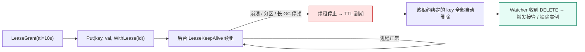
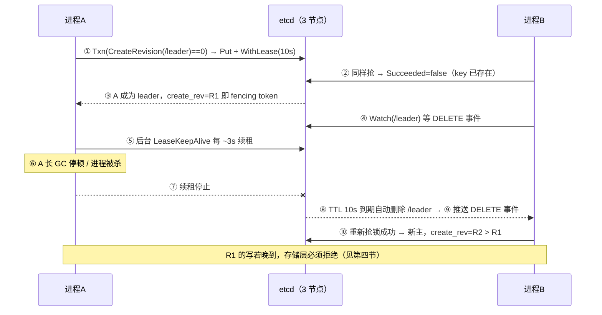

# 10 · etcd 与 Raft 选主租约落地

> 属于「架构师修炼」· 阶段六（坎 4~5 · 100 万~1000 万 QPS）· **etcd 是"元数据强一致 + 选主 + 配置下发"的底座，本篇只讲怎么用、怎么配、怎么防双写**
> 上一篇：[09 分布式事务与最终一致落地](./09-分布式事务与最终一致落地)　下一篇：[11 幂等去重与 Exactly-Once](./11-幂等去重与ExactlyOnce)

> **这篇解决什么问题**：Raft 算法你能背出来，但一到工程落地就出问题：「TTL 设多少？」「leader 假死后旧主还在写怎么办？」「etcd 挂了选主是不是就废了？」这一篇**不讲算法本身**（原理见 [Raft 算法详解](/后端技术栈强化/08-distributed/Raft算法详解) 与 [选主机制详解](/后端技术栈强化/08-distributed/选主机制详解)），只讲**怎么用、怎么配、怎么防坑**：Lease/Revision/Watch/Txn 的工程含义、选主的两版 Go 实现、**脑裂与 fencing token**、Raft 参数与容量边界、运维六大坑、分布式锁选型决策表。

---

## 一、定位：etcd 在架构里到底解决什么

### 1.1 五件事（每件都有"必须 CP"的理由）

| 用途 | 存什么 | 为什么必须强一致 | 本篇 |
| --- | --- | --- | --- |
| **元数据强一致** | 路由表、号段分配、分片映射 | 元数据写错 = 全站路由错乱（[07 篇](./07-多活容灾与全球化架构) 3.3） | 1.3 |
| **选主** | `/elections/xxx` 下一把带租约的 key | 双主 = 两个写入口 = 数据分叉 | 三、四 |
| **服务注册发现 / 配置下发** | `/services/<svc>/<ip:port>` + Lease；限流阈值、灰度开关 | 列表可容忍短暂陈旧（常配 AP 兜底），**配置错 = 全站行为错**，且每次变更要可追溯、可回滚 | 八 |
| **分布式锁** | 对账任务、DDL、唯一性仲裁 | 锁丢了 = 两个进程同时干同一件事 | 七 |

**一句话定位**：etcd 是**控制面（Control Plane）的存储**，不是**数据面（Data Plane）的存储**——控制面写少读多、量小但必须对；数据面写入量巨大，用 MySQL/Redis/Kafka。

### 1.2 quorum 与故障容忍：为什么偶数节点不划算

| 集群规模 | quorum | 能容忍挂几个 | 成本 | 结论 |
| --- | --- | --- | --- | --- |
| 1 节点 | 1 | 0 | ×1 | 只能开发环境用 |
| 2 节点 | 2 | **0** | ×2 | **最差选择**：任一节点挂 → 只剩 1 < quorum 2 → 整个集群不可写 |
| **3 节点** | 2 | **1** | ×3 | **生产默认**，性价比最高 |
| 4 节点 | 3 | 1 | ×4 | 多花一份钱，容忍度与 3 节点相同 → **不划算** |
| **5 节点** | 3 | **2** | ×5 | 容忍两个节点同时挂（跨 3 机房 2+2+1 部署） |

> **规律**：`quorum = ⌊N/2⌋ + 1`，`容忍故障数 = N − quorum = ⌊(N−1)/2⌋`。**N 从 3 增到 4，写延迟上升（要多等一个副本）而容忍度不变**——这就是用奇数节点的全部理由。
> ⚠️ **失去多数派后集群只读不可写**，依赖它的选主、配置下发、路由变更**全部冻结**（见「故障与一致性边界」）。

### 1.3 什么不该放 etcd（容量边界）

| 维度 | 安全区间 | 超限后果 |
| --- | --- | --- |
| 数据量 | **几百 MB ~ 2 GB**（默认 `--quota-backend-bytes=2147483648`） | 超 quota → **集群只读告警（NOSPACE）**，写全部失败 |
| key 数量 / value 大小 | **几十万 key**；value < 100 KB（`--max-request-bytes=1.5 MB`） | 百万级 key + 大 value 放大 MVCC、apply 与 watch 开销 |
| 写入量 | **单集群几千写 TPS**（每次写都要多数派 fsync） | 写抖动、apply 延迟上升、选举风险 |

> **面试金句**：「**etcd 是控制面存储，不是业务数据库**。它每次写都要多数派 fsync，所以我只用它存元数据、选主和配置——把订单表放进 etcd，几百 TPS 就把集群写崩。」

---

## 二、关键机制与工程含义

### 2.1 机制 → 含义 → 工程用法（面试背这张表）

| 机制 | 一句话含义 | 工程用法（关键点） |
| --- | --- | --- |
| **MVCC + Revision** | 每次修改产生全局单调递增的 **revision**，历史版本可读 | ① `Get(key, WithRev(n))` 读历史快照；② **revision 单调 → 可直接当 fencing token / 全局版本号**；③ 事务用 `CreateRevision`/`ModRevision` 做 CAS |
| **Lease 租约** | `Grant(ttl)` 得到 leaseID，key 可绑定；**到期自动删除 key** | `Put(k, v, WithLease(id))` + 后台 `KeepAlive`：**进程崩溃/分区/长 GC → 续租停 → key 自动消失**，这是"自动故障转移"的基础 |
| **Watch 监听** | 长连接事件流（PUT/DELETE + 新 revision），可从任意 revision 起 | 断线续传用 `WithRev(lastRev+1)`；**revision 被 compact 后必须全量重拉**；watch 粒度要小（防风暴） |
| **Txn 事务 CAS** | `If(compare) Then(ops) Else(ops)` 原子执行，线性一致 | 抢占：`Compare(CreateRevision(k), "=", 0)`（key 不存在）；释放防误删：`Compare(Value(k), "=", token)` |
| **Compact + Defrag** | Compact 删旧版本（**逻辑**回收）；Defrag 重整 bbolt 文件（**物理**回收） | **两个都要做**：只 compact 不 defrag 文件不会缩小，仍会撞 quota（见 2.3） |
| **Quota** | 后端 db 上限，默认 2 GB | 超限集群只读并告警（`etcd_server_alarms`）→ 监控 `etcd_mvcc_db_total_size_in_bytes` |

### 2.2 Lease 生命周期（"自动故障转移"的全部秘密）



### 2.3 Compact / Defrag 不做会怎样（真实事故）

- **长期不 compact**：bbolt 里历史版本累积 → db 涨到 quota → **集群转只读**；`Get` 要遍历更多版本 → P99 上升。做法：`--auto-compaction-retention=1h` 或应用侧定时 `Compact`。
- **只 compact 不 defrag**：逻辑删除后**文件不缩小**（bbolt 只标记空闲页），空间无法复用给新写 → 仍会撞 quota。做法：每节点滚动 `etcdctl defrag`（**会阻塞该节点读写**）。
- **compact 太激进**：断线续传的客户端 watch 到已删 revision → `ErrCompacted`。做法：保留窗口 ≥ 最长断连恢复时间（建议 ≥ 1 h）+ 客户端"全量重拉"兜底（8.2）。

---

## 三、选主落地：两版 Go 实现

### 3.1 先讲清"谁是 leader"

**选主 = 抢同一把带租约的 key**：同一前缀下所有候选都 `Put` 自己的 key，**`CreateRevision` 最小者即 leader**（先到先得，天然公平）；其余候选 **Watch 排在自己前一位的 key**（不 watch 整个前缀，避免惊群）。

| 要点 | 说明 |
| --- | --- |
| 谁是 leader | 同一 election 前缀下 **create revision 最小**的 key 的持有者 |
| leader 怎么让位 | ① 主动 `Resign`（删 key，最快）；② 租约过期（崩溃场景，延迟 = TTL） |
| 候补怎么等待（防惊群） | Watch **前一位** key 的 DELETE 事件 → 被推举为 leader；**不要轮询抢锁、不要 watch 整个前缀** |

### 3.2 时序：A 抢到 → KeepAlive → 崩溃 → 租约过期 → B 抢到



### 3.3 推荐写法：`concurrency` 包（生产直接用）

```go
import (
	"context"
	"errors"
	"time"

	clientv3 "go.etcd.io/etcd/client/v3"
	"go.etcd.io/etcd/client/v3/concurrency"
)

var ErrLostLeadership = errors.New("lost leadership")

// RunScheduler：抢主 → 干活 → 失去主导权立刻退出。
func RunScheduler(ctx context.Context, cli *clientv3.Client, nodeID string) error {
	// Session = LeaseGrant(TTL) + 后台 KeepAlive 协程；会话失效 == 租约过期。
	sess, err := concurrency.NewSession(cli, concurrency.WithTTL(10), concurrency.WithContext(ctx))
	if err != nil {
		return err
	}
	defer sess.Close() // 主动撤销租约 → 立刻让位，比等 TTL 快一个数量级

	ele := concurrency.NewElection(sess, "/elections/clip-scheduler")
	if err := ele.Campaign(ctx, nodeID); err != nil { // 阻塞，直到当选
		return err
	}
	defer func() { _ = ele.Resign(context.WithoutCancel(ctx)) }() // 优雅让位
	return leaderLoop(ctx, ele, nodeID)                          // 只有 leader 走到这里
}

// leaderLoop：主循环三条铁律 —— ① 每秒自检"我还是主吗"；② 带本任期 fence 写；
// ③ 自检失败或写失败立即退出（把主位交给 etcd 和下一个候补）。
func leaderLoop(ctx context.Context, ele *concurrency.Election, nodeID string) error {
	for {
		select {
		case <-ctx.Done():
			return ctx.Err()
		case <-time.After(time.Second):
			resp, err := ele.Leader(ctx)
			if err != nil || len(resp.Kvs) == 0 || string(resp.Kvs[0].Value) != nodeID {
				return ErrLostLeadership // 可能只是 GC 停顿导致租约悄悄过期
			}
			if err := doWorkWithFence(ctx, resp.Kvs[0].CreateRevision); err != nil {
				return err
			}
		}
	}
}
```

### 3.4 手写版：Lease + Txn（理解原理用）

```go
// campaign：手写选主，等价于 concurrency.Election 的核心三步。
func campaign(ctx context.Context, cli *clientv3.Client, key, nodeID string) (int64, error) {
	lease, err := cli.Grant(ctx, 10) // ① TTL=10s：故障感知延迟 ≈ TTL
	if err != nil {
		return 0, err
	}
	// ② 原子占坑：CreateRevision == 0 表示 key 不存在（不能"先 Get 再 Put"，那样并发全过）
	resp, err := cli.Txn(ctx).
		If(clientv3.Compare(clientv3.CreateRevision(key), "=", 0)).
		Then(clientv3.OpPut(key, nodeID, clientv3.WithLease(lease.ID))).
		Commit()
	if err != nil || !resp.Succeeded { // 抢失败：key 已被别人创建
		_, _ = cli.Revoke(ctx, lease.ID)
		return 0, ErrLostLeadership
	}
	fence := resp.Header.Revision // 本任期 fencing token，单调递增（见第四节）
	// ③ 续租：KeepAlive 返回的 channel 关闭 = 租约失效 → 必须立即停写。
	//    ka, _ := cli.KeepAlive(ctx, lease.ID)
	//    go func() { for range ka {}; slog.Error("lost lease, step down"); stopWriting() }()
	slog.Info("became leader", "node", nodeID, "fence", fence)
	return fence, nil
}
```

**TTL 与续租频率（必背参数）**：

| TTL | 故障感知延迟 | 误切换风险 | 续租频率 | 适用 |
| --- | --- | --- | --- | --- |
| 1~2 s | 秒级切换 | **高**（网络抖动/GC 就被换掉） | TTL/3 ≈ 0.5 s，心跳压力大 | 对切换速度极敏感、网络很稳 |
| **5~10 s（生产默认）** | 5~10 s | 低 | **TTL/3 ≈ 2~3 s**（同 Session 批量续租） | 绝大多数场景 |
| 30~60 s | 分钟级 | 极低 | TTL/3 | 能容忍长时间无主/双主空窗 |

---

## 四、脑裂与 fencing：本篇最值钱的一节

### 4.1 为什么「选主 + 心跳」不足以防双写

因为**旧主不需要通过 etcd 也能写数据**：① 它可能发生**长 GC / STW**（Go 里几百 ms~几秒常见），KeepAlive 没发出去 → 租约过期 → 新主产生；② 它**恢复后并不知道自己已不是主**，业务循环还在往 MySQL 写；③ 或者它落在网络分区的少数派一侧，**既连不上 etcd，也收不到"你已被换掉"的通知**。

> **面试金句**：**租约只决定"谁有资格"，它无法阻止一个失去资格的进程继续写业务库。** 真正防住双写的是**存储层的 fencing 校验**。

### 4.2 完整事故链路：主节点假死 → 双写 → 数据错乱

```text
T+0.0s   A 是 leader（fence=R1=1000），正在把"剪辑任务出库"结果写进 MySQL
T+0.2s   A 发生长 GC 停顿 8s（或宿主机 CPU 被打满 / 被 cgroup 限流）
T+0.5s   A 的 KeepAlive 协程停摆，etcd 侧租约开始倒计时
T+10.5s  租约到期 → /leader 自动删除 → B 抢锁成功（fence=R2=1001）成为新 leader
T+11.0s  B 开始处理同一批任务（相同幂等键的任务被 B 重新拉起）
T+8.2s   A 从 GC 恢复，"以为"自己还是 leader，继续把 R1 的任务状态写进 MySQL：
         ├─ 若 MySQL 只做普通 UPDATE：A 的旧状态覆盖 B 的新状态 → 状态回退/重复交付
         └─ 若 MySQL 按 (task_id, fence) 校验：A 带 fence=1000 的写被拒绝 → 数据不脏
```

**关键**：这次事故里 etcd 完全正常、选主完全正确——**错的是存储层没有校验 fence**。

### 4.3 fencing token 落地：三道防线

| 防线 | 解决什么 | 局限 |
| --- | --- | --- |
| 租约过期 + 主循环自检 | 旧主"没资格"继续自称 leader | 旧主可能还不知道自己过期了（GC、分区） |
| **fencing token（单调 epoch）** | 旧主的写请求**被存储端拒绝** | 需要写路径带 token + 存储端校验 |
| 业务幂等 + 对账 | 兜住"双主期间重复执行" | 兜不住"旧值覆盖新值"，只能事后发现 |

**落地方式（极简单，却常被忽略）**：① token 来源 = **etcd 的 revision**（抢锁成功时的 `create_revision` / `Header.Revision`，天然全局单调）；② 写路径每次带 fence：`UPDATE task SET status=?, fence=? WHERE id=? AND fence < ?`；③ 存储端拒绝小于已记录 fence 的写（影响行数 = 0 即"我已不是主"，客户端应立即自杀退出）；④ 新主 fence 必然更大，所以新主的写永远能覆盖旧主。

> ⚠️ 别用应用自己 `time.Now()` 生成版本号当 fence——时钟会漂移、会回退，**单调性就不成立了**。

### 4.4 为什么 Redis 分布式锁更难做（面试高频对比）

| 维度 | Redis `SET NX EX` | etcd Lease + Txn |
| --- | --- | --- |
| 一致性 | 主从**异步**复制：主写入后未同步就宕机 → **锁随主丢失** → 双持有 | 多数派确认后才返回，**不会因单点故障丢锁** |
| 租约续期 | 有 TTL，但无"续租成功/失败"的明确信号 | `KeepAlive` channel 关闭 = 明确的失效信号 |
| **fencing token** | **不提供单调 token**（要自建）；Redlock 还依赖各节点时钟 | revision 天然单调，**直接当 token** |
| 性能 | 高（万级~十万级 ops） | 低一个数量级（每次写多数派 fsync） |

> **结论**：调度去重这类「双主了顶多多跑一次」→ Redis 够用；**元数据、写入口、资金**这类「双主 = 数据分叉」→ etcd/ZK，且**无论用哪种，都要有 fencing token 兜底**。

---

## 五、Raft 工程参数与性能边界

### 5.1 必调参数（默认值 + 何时改）

| 参数 | 默认值 | 工程含义 | 何时调整 |
| --- | --- | --- | --- |
| `--heartbeat-interval` | **100 ms** | leader 发心跳的间隔 | 跨机房可放大到 200~300 ms，减少无效心跳 |
| `--election-timeout` | **1000 ms** | follower 多久没收到心跳就发起选举；**经验值 = 心跳 × 10** | 跨机房（RTT 30~150 ms）放大到 **2000~5000 ms**，否则抖动就频繁选举 |
| `--snapshot-count` | **100000** | 累积多少条日志后打快照 | 大 value / 高频写场景下调（2 万~5 万），避免 WAL 过大 |
| `--max-request-bytes` | **1.5 MB** | 单请求上限 | 保持小值；需要更大说明你在往 etcd 塞业务数据（该改架构） |
| `--quota-backend-bytes` | **2 GB** | db 上限，超限只读 | 保持 2~8 GB；接近上限前必须 compact + defrag 或拆集群 |
| `--auto-compaction-retention` | 0（关闭） | 历史版本保留时长 | **生产必开**（如 `1h`） |

> **选举超时的量化依据**：`election-timeout > 2 × 跨机房 RTT P99 + 磁盘/GC 抖动`。跨机房 RTT P99 = 80 ms 时，超时至少 160 ms 起；取 2~5 s 是给"网络抖动 + 磁盘抖动 + GC"留余量——**频繁的无谓选举（leader 抖动）比切换慢更伤**。

### 5.2 性能边界与容量建议（面试给数字）

| 指标 | 量级 | 原因 |
| --- | --- | --- |
| 单集群写 | **几千 TPS** | 每次写都要等多数派 fsync |
| 单集群读（线性一致） | 万级 QPS | 串行读要 leader 确认；`WithSerializable` 可读本地副本 |
| Watch 连接 | 数千~数万 | 每个 watcher 占内存 + 事件推送放大 |
| 数据量 / key 数 | **几百 MB ~ 2 GB / 几十万 key** | 默认 quota 2 GB；bbolt 需 mmap 整文件，太大也拖慢启动 |

### 5.3 跨机房部署

3 节点同机房（RTT < 1 ms）最稳但只防机器故障；3 节点跨 3 机房（2 同城 + 1 异地）能容忍一个机房挂，但**每次写都要跨城 fsync**（写 P99 从 10 ms 涨到 30~150 ms）。**实践常见做法：etcd 集群同城 3 节点保性能，异地用异步快照做容灾**，而不是让 etcd 自己跨城同步写。

---

## 六、常见配置与运维坑

### 6.1 六大坑对照表（都是真实事故）

| 坑 | 现象 | 根因 | 处置 |
| --- | --- | --- | --- |
| **磁盘不是 SSD / 云盘 IOPS 不足** | 偶发 apply 超时、leader 频繁变更、写 P99 飙到几百 ms | WAL fsync 慢 → 心跳延迟 → follower 误判 leader 挂了 | 换本地 SSD/NVMe；`etcd_disk_wal_fsync_duration_seconds` P99 **应 < 10 ms**，> 100 ms 必出故障 |
| **时钟不同步** | 频繁选举、日志时间线错乱、TLS 校验失败 | 选举超时依赖本地时钟，漂移大就误判 | 全集群 NTP/chrony，成员间偏差 **< 1 s** |
| **成员变更一次加减多个** | 变更期间集群不可用甚至数据不一致 | Raft 要求**一次只变更一个成员** | 严格串行：加一个 → 等同步完成 → 再加下一个 |
| **value 太大 / key 太多** | db 迅速涨到 quota，集群转只读 | 把业务数据写进 etcd | 迁走业务数据 + compact + defrag + 拆集群 |
| **不监控关键指标** | 出事时才发现 leader 一直在换 | 无告警 | 见 6.3，全部配上告警 |

### 6.2 备份与恢复：revision 回退是最容易踩的雷

```bash
etcdctl --endpoints=$EP snapshot save /backup/etcd-$(date +%F-%H).db   # 定时备份 + 记录 revision
etcdctl --endpoints=$EP endpoint status --write-out=table              # 关注 RAFT INDEX / DB SIZE
etcdutl snapshot restore /backup/etcd.db --name node1 --initial-cluster node1=$IP1,node2=$IP2,node3=$IP3 --data-dir /var/lib/etcd-restore
```

| 恢复后的坑 | 后果 | 兜底 |
| --- | --- | --- |
| **revision 回退**（快照是 1 小时前的） | 客户端 `lastRev` 大于当前 revision → `Watch` 报 `ErrCompacted`/`ErrFutureRev`，**watch 静默失效 → 配置永久不更新** | 客户端必须"报错即全量重拉"（8.2）；恢复后重启消费端也可解 |
| 快照间隔内的变更 | RPO = 备份间隔（如 1 h） | 缩短备份间隔；关键配置变更同时写审计日志可重放 |
| 恢复后 key 缺失导致选主真空 | 锁丢失 → 重新选主（通常可接受） | 恢复后立刻观察 leader 是否正常产生 |

### 6.3 必配监控指标

| 指标 | 含义 | 告警阈值（经验值） |
| --- | --- | --- |
| `etcd_server_leader_changes_seen_total` | leader 变更次数 | **1 小时内 > 3 次** → 查磁盘/网络/时钟 |
| `etcd_disk_wal_fsync_duration_seconds`（P99） | WAL 落盘延迟 | **> 10 ms 告警 / > 100 ms 严重** |
| `etcd_disk_backend_commit_duration_seconds` / `etcd_server_apply_duration_seconds`（P99） | bbolt 提交 / apply 到状态机耗时 | > 25 ms / > 100 ms 持续 |
| `etcd_mvcc_db_total_size_in_bytes` | db 大小 | **> quota 的 70%** → compact + defrag |
| `etcd_network_peer_round_trip_time_seconds` | 成员间 RTT | 接近 `election-timeout` 的 1/10 就要放大超时 |

---

## 七、分布式锁落地：四种方案与选型决策

### 7.1 对比表

| 方案 | 原理 | 一致性 | 性能 | 丢锁风险 | 适用 |
| --- | --- | --- | --- | --- | --- |
| **Redis `SET NX EX` + Lua 解锁** | 原子占坑 + TTL + token CAS 删除 | AP（主从异步） | **最高** | 主从切换/主宕机时**可能丢锁 → 双持有** | 防重复执行、可容忍极小概率并发 |
| **Redis Redlock** | 多数派 Redis 节点加锁，依赖各节点时钟 | 争议大 | 高 | 时钟跳变、GC 停顿可致双持有 | 一般不推荐；若用必须配 fencing |
| **etcd Lease + Txn** | 租约 + CAS 占坑 + KeepAlive 自检 | **CP（多数派）** | 低一个数量级 | 仅"GC 停顿误让位"（**不会双持有**） | 元数据、写入口、选主、唯一性仲裁 |
| **DB 唯一约束** | 唯一索引插入即加锁（或 `FOR UPDATE`） | 强一致（依赖 DB） | 低 | 几乎无（但 DB 成为单点） | 小规模、已有 DB、不想引新组件 |

### 7.2 什么时候用哪个（决策表）

| 你的问题 | 首选 | 理由 |
| --- | --- | --- |
| 定时任务只跑一次，多跑一次无大碍 | **Redis SET NX EX（TTL 10~60 s）** | 简单、快；丢锁代价可接受 |
| 集群里只有一个实例能写元数据/做调度 | **etcd 选主（Election / Lease + Txn）** | 双主 = 数据分叉，必须 CP |
| 同一订单不能被两个进程同时处理，且不能重复扣款 | **etcd 锁 + 业务幂等 + fencing token** | 锁只减少并发，**幂等才是正确性保证** |
| 已经用 MySQL，规模不大 | **DB 唯一索引 / 行锁** | 零新增组件，最省事 |

> **必须记住的一句话**：**分布式锁不是正确性的终点，最后一道防线永远是 fencing token + 业务幂等 + 对账。** 所有"锁一定不会丢"的说法都是幻觉——网络分区和 GC 停顿会打破它。

---

## 八、服务注册与配置下发落地

### 8.1 服务注册：Lease 绑定 key，实例下线自动摘除

| 步骤 | 动作 | 关键点 |
| --- | --- | --- |
| 注册 | `Put("/services/clip/"+addr, meta, WithLease(id))` | key 绑定租约，进程崩溃 → key 自动消失 |
| 续租 | 后台 `KeepAlive`（频率 TTL/3，如 TTL=15 s → 每 5 s） | TTL 太短 → 抖动误摘除；太长 → 摘除慢（调用方打到死实例） |
| 发现 | 先 `Get(prefix, WithPrefix)` 建全量快照，再 `Watch(prefix, WithRev(rev+1))` 收增量 | **拉取 + 订阅**，不能只 watch（首次可能没有事件） |
| 优雅下线 | 先 `Delete(key)` → 停流量 → 再退出进程 | 主动注销比等 TTL 快；配合 K8s `preStop` |

### 8.2 配置热更新：Watch 循环 + 断线重连 + revision 续传 + 全量兜底

```go
// WatchConfig：健壮的配置订阅循环 —— 断线重连、revision 续传、全量重拉三层兜底。
func WatchConfig(ctx context.Context, cli *clientv3.Client, key string,
	apply func(rev int64, val string)) error {

	var lastRev int64
	for { // 外层循环 = 重连循环；每一轮都以"全量拉取"开头
		// ① 全量拉取：首轮拿初值；revision 失效/断连后靠它兜底
		resp, err := cli.Get(ctx, key)
		if err != nil {
			if ctx.Err() != nil {
				return ctx.Err()
			}
			time.Sleep(time.Second) // 生产用指数退避
			continue
		}
		if len(resp.Kvs) > 0 {
			lastRev = resp.Header.Revision
			apply(resp.Kvs[0].ModRevision, string(resp.Kvs[0].Value))
		}

		// ② 从 lastRev+1 订阅：既保证不漏事件，又避免重复推送历史事件
		wch := cli.Watch(ctx, key, clientv3.WithRev(lastRev+1))
		for wresp := range wch {
			if wresp.Canceled { // 断连，或服务端返回 ErrCompacted（revision 太旧）
				slog.Warn("watch canceled, will full-reload", "err", wresp.Err())
				break // 回到 ① 全量重拉 —— "配置永不丢变更"的关键兜底
			}
			for _, ev := range wresp.Events {
				lastRev = ev.Kv.ModRevision
				apply(ev.Kv.ModRevision, string(ev.Kv.Value))
			}
		}
		// 循环末尾直接进入下一轮全量拉取；生产应加指数退避（1s→2s→…→30s）。
	}
}
```

**三个必须做到的兜底**：① **revision 续传** `WithRev(lastRev+1)`——少了它，断线期间的事件永久丢失；② **`ErrCompacted` → 全量重拉**——revision 被 compact 或快照恢复回退后，增量订阅不可用；③ **定期对账**——每分钟全量拉取比对（值 + revision），防"事件流静默失效"这种最难查的问题。

### 8.3 配置版本化：灰度与回滚

| 做法 | 说明 |
| --- | --- |
| **配置带版本号** | 每次变更写新 key（`/config/clip/v17`）或递增版本字段，**永不原地覆盖** |
| **灰度与回滚** | `/config/clip/active` 指向生效版本，灰度名单控制哪些实例先加载；回滚 = 把 `active` 指回上一版本 → watch 推送 → **秒级生效**（旧版本 key 因为不删所以还在） |
| **本地快照** | 实例持久化最后一次成功加载的配置（含版本号），启动先用快照再连 etcd（[07 篇](./07-多活容灾与全球化架构) 3.3） |

---

## 故障与一致性边界

| 故障 | 现象 | 机制解释 | 降级/兜底 | 一致性边界 |
| --- | --- | --- | --- | --- |
| **集群失去多数派** | 写全部失败（`etcdserver: no leader`） | Raft 只在多数派存活时提交日志 | 选主/配置/路由变更**全部冻结** → 业务用本地快照与原 leader 继续跑；恢复多数派后自动恢复 | **不产生数据错误**，但**控制面能力暂停**（不能切主、不能改配置、不能注册新实例） |
| **watch 断连期间错过配置变更** | 某实例一直用旧配置 | 事件流断了，没收到 PUT | `WithRev(lastRev+1)` 续传；`ErrCompacted` → 全量重拉；**再加定期全量对账** | 配置**最终一致**；窗口 = 重连 + 全量拉取耗时（秒级） |
| **Lease 误过期**（长 GC/STW） | 主让位、锁被他人获得，旧主可能还在写 | 租约只证明"有资格"，不阻塞旧主写业务库 | **fencing token**：存储端拒绝旧 token 的写；业务幂等 + 对账 | **可能出现短暂双主执行**（重复执行可容忍）；**旧值覆盖新值不可容忍** → 必须 fencing |
| **快照恢复导致 revision 回退** | watch 报 `ErrCompacted`/`ErrFutureRev`，配置永久不更新 | 恢复后 revision 小于客户端持有的 lastRev | 客户端"报错即全量重拉"；恢复后重启消费端 | 备份间隔内的元数据变更**丢失（RPO = 备份间隔）** |
| **写入超 quota（2 GB）** | 集群转只读，告警 `NOSPACE` | bbolt 达上限，etcd 拒绝写 | `compact` + `defrag`，或临时提 quota，再从根因迁走业务数据 | 期间所有控制面写入失败；**已存数据不丢** |
| **旧主在分区少数派侧继续服务** | 少数派侧读到陈旧元数据 | 少数派无法提交日志，也感知不到新 leader | 客户端只信任多数派侧的线性一致读；旧主侧的写被 fencing 拒绝 | **少数派侧数据必然陈旧**，必须保证它不能写 |

> **一句话总结**：etcd 的边界是「**要么精确一致，要么明确不可用**」——它不会给你"看起来一致但其实是错的"数据。**代价是失去多数派时控制面直接冻结，所以业务必须能靠本地快照与本单元既有状态继续跑。**

---

## 面试追问链

1. **「etcd 为什么能保证强一致？」**
   → ① 写走 Raft：**多数派复制并 fsync 落盘后才提交**，返回即已持久化；② 读默认是**线性一致读**（leader 确认 read index），不会读到陈旧数据；③ `Txn` 的比较与写入在多数派上原子完成，所以 `CreateRevision == 0` 这种 CAS 可靠。代价是**写延迟高（多一次多数派往返）、吞吐低（单集群几千写 TPS）**——这正是它只能做控制面存储的原因。

2. **「选主之后旧主还在写怎么办？」**
   → **租约只能让旧主"失去资格"，不能阻止它写业务库**。真正的防线是 **fencing token**：每任 leader 产生一个**单调递增**的 token（抢锁成功时的 etcd `create_revision` 天然满足），写业务库时带上它，存储层只接受"不小于已记录 fence"的写 → 旧主的写被拒绝（影响行数 = 0 时应立刻自杀退出）。再叠加**业务幂等 + 对账**兜住重复执行。三件套缺一不可。

3. **「Lease 续不上会发生什么？」**
   → ① **进程崩溃** → 续租停 → TTL 到期 → 绑定 key 全删 → watch 推送 DELETE → 新主接管（这就是自动故障转移）；② **网络分区** → 少数派侧续租失败、锁被多数派侧抢走，**本地必须立即停写**；③ **长 GC/STW** → 出现"误让位"（自己没死但锁没了），代价是**短暂双主**，靠 fencing 挡住脏写。所以 TTL 取 5~10 s、续租 TTL/3，并且业务侧必须有"发现自己不是主就退出"的自检循环。

4. **「etcd 能存业务数据吗？」**
   → **不能**。给数字：每次写都要多数派 fsync，**单集群写入通常只有几千 TPS**；默认 quota 只有 2 GB，数据量超几百 MB 就要 compact/defrag；大 value 与百万级 key 会拖垮 apply 和 watch。etcd 定位是**控制面存储**（元数据、选主、注册、配置），业务数据放 MySQL/Kafka/对象存储——K8s 用 etcd 也正因为里面只有集群状态。

5. **「三节点和五节点怎么选？」**
   → 看**要容忍几个故障**：3 节点 quorum=2，容忍挂 1 个，生产默认；5 节点 quorum=3，容忍挂 2 个（跨 3 机房 2+2+1 部署）。**偶数节点永远不划算**——4 节点 quorum=3 只能容忍 1 个，却多付一份成本与写延迟。另两个约束：节点越多**每次写要等的副本越多**（延迟上升）；**跨机房成员会让 fsync 走跨城 RTT**，所以常见做法是"同城 3 节点保性能 + 异地异步快照做容灾"，而不是让 etcd 自己跨城同步写。

---

## 自测清单

- [ ] 能说出 `quorum = N/2+1` 与 1/3/4/5 节点的容忍度，并解释偶数节点为什么亏
- [ ] 能讲清 MVCC/Revision、Lease、Watch、Txn、Compact+Defrag、Quota 六个机制的**工程用法**（不只是定义）
- [ ] 能用 `concurrency.Election` 写出选主代码，并说清 `Campaign/Resign/Leader` 各自的语义
- [ ] 能手写 `Grant + Txn(CreateRevision==0) + KeepAlive`，并解释为什么不能"先 Get 再 Put"
- [ ] 能完整讲出「主假死 → 双写 → 数据错乱」的事故链路，并指出 fencing token 该落在哪一层
- [ ] 记得关键参数默认值（heartbeat 100 ms / election-timeout 1000 ms / snapshot-count 100000 / quota 2 GB）与调整原则
- [ ] 能列出 etcd 必配监控指标，并说出 wal fsync P99 与 leader 变更次数的告警阈值

> **下一篇**：[11 幂等去重与 Exactly-Once](./11-幂等去重与ExactlyOnce) —— 有了选主与 fencing，"重复执行"还剩最后一块拼图：**幂等与去重**。
