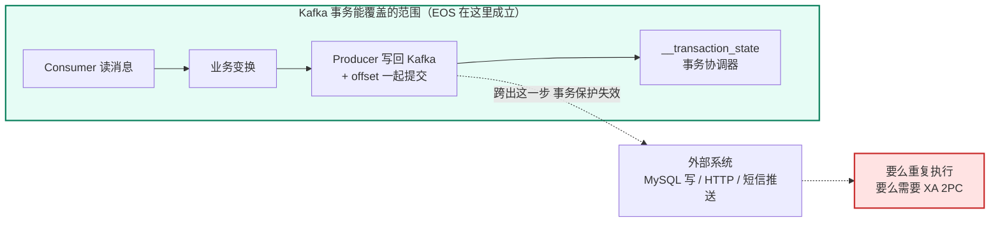
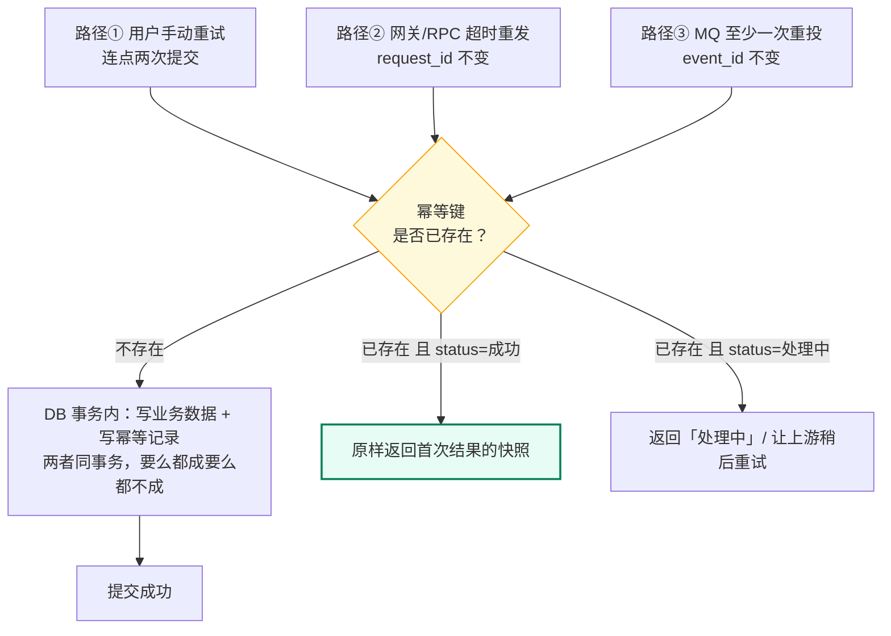
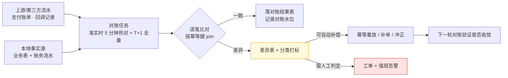

# 11 · 幂等去重与 Exactly-Once

> 属于「架构师修炼」· 阶段三（坎 3 · 10 万 QPS）· **重复不可避免，那就让它重了也没事**
> 上一篇：[10 etcd 与 Raft 选主租约落地](./10-etcd与Raft选主租约落地)　下一篇：[12 限流熔断降级与背压](./12-限流熔断降级与背压)

> **这篇解决什么问题**：[05 篇](./05-Kafka削峰与可靠投递落地)的结论是「至少一次 + 消费幂等 = 事实上不重」——**把最难的活推给了这一篇**。面试官最爱追的也正是这一句：你们怎么做到不重复扣款？Kafka 的 exactly-once 到底是不是真的？幂等键重复了会不会误伤正常请求？这一篇不写空话，只给三样东西：**① exactly-once 的真实边界（哪些链路成立、哪些纯属幻想）；② 幂等键怎么选 + 五种落地手段的对照与失效场景；③ 幂等 + 重试 + 对账的完整收尾。**

## 一、先给结论：端到端 Exactly-Once 的真实边界

### 1.1 第一句话就说结论

**跨系统的端到端 exactly-once 在工程上几乎不存在。** 可交付的公式只有一条：

```text
端到端不重不丢 = 至少一次投递（at-least-once） + 消费端幂等（唯一约束/状态机） + 定时对账兜底
```

Kafka 的 exactly-once（事务）**只在 Kafka 自身闭环内成立**：consume → transform → produce 且 offset 提交也在同一个 Kafka 事务里。一旦链路里出现**外部系统**（MySQL 写、HTTP 调用、短信推送），事务立刻失效——因为 Kafka 的事务协调器管不到别人。

### 1.2 三种投递语义的真实可达性

| 语义 | 机制 | 真实可达？ | 代价 | 适合 |
| --- | --- | --- | --- | --- |
| **至多一次**（可能丢） | 先提交 offset 再处理 / `acks=0` | 可达（但你要的通常不是它） | 丢数据 | 埋点、可丢日志 |
| **至少一次**（可能重） | `acks=all` + 先处理后提交 | **可达且是工程默认** | 必须做消费端幂等 | 99% 的业务 |
| **精确一次**（Kafka 内） | 幂等生产者 + 事务 + `read_committed` | **仅 Kafka→Kafka 链路可达** | 吞吐降 20%~40%、延迟上升、复杂度高 | 流式 ETL、实时聚合写回 Kafka |
| **精确一次**（端到端跨系统） | 需要 2PC/XA 把 MySQL 也拉进 Kafka 事务 | **现实几乎不可达** | 跨系统协调、锁持有、性能崩塌 | 教科书里存在 |



> **面试口径**：「Kafka 的 exactly-once 是真的，但只在 Kafka 闭环内真。它的意思是『消息不重、offset 与输出同事务提交』；它**不包括**你写在 MySQL 里的那一行、也不包括你发出去的那条短信。所以我的方案是至少一次 + 唯一约束幂等，而不是去追一个跨系统的 EOS。」

## 二、幂等键设计

### 2.1 怎么选键：三条原则

1. **由产生方生成、在重试中不变**——重试链路里必须一路透传，中途重新生成就等于没做幂等；
2. **全局唯一且可定位到「同一件事」**——键相同 ⇒ 业务上只应执行一次；
3. **不参与业务计算**——键只用于去重，不要拿它当主键之外的第二业务语义。

| 场景 | 推荐幂等键 | 为什么 | 反例（会误伤或失效） |
| --- | --- | --- | --- |
| 支付/第三方回调 | `out_trade_no`（商户订单号） | 外部系统重试时透传不变，天然唯一 | 用回调流水号：同一次支付可能被回调多次、流水号不同 |
| 内部服务重试 | `request_id`（网关或调用方生成） | 同一次用户操作的所有重试共享 | 服务端自己生成 UUID → 每次重试都是新键，完全失效 |
| 用户重复提交（表单/下单） | `user_id + biz_type + 业务日期` 或前端一次性 token | 拦住「用户连点两次」 | 只用 `user_id`：会吃掉用户当天所有合法请求（严重误伤） |
| MQ 消费 | 生产端生成的 `event_id`（或业务唯一键），放入消息头 | 重投/重放时不变 | 用 offset 当键：分区重平衡后 offset 会变 |
| AI 剪辑任务 | `task_id`（平台生成后回传客户端） | 任务创建与进度回调共享同一实体 | 用「用户+时间戳」：同秒并发创建会互撞 |

> **「会不会误伤」的标准答法**：**幂等键的粒度 = 业务上「只允许发生一次」的最小单位。** 粒度太粗（只用 user_id）会吞掉合法请求；太细（每次重试都新生成）等于没做。所以键里必须包含「业务对象标识 + 动作类型」，通常**不包含时间戳**——时间戳是粒度的敌人。

### 2.2 幂等键的生命周期与清理

幂等记录不能永久保留（会无限膨胀），但**保留期必须覆盖所有可能重复到达的窗口**：

| 重复来源 | 最坏延迟 | 对保留期的要求 |
| --- | --- | --- |
| 同步重试（RPC 层） | 秒~分钟 | 分钟级 |
| MQ 重投（消费失败重试/位点回退） | 小时~天 | ≥ 3 天 |
| 人工重放、故障后补数据 / 对账补偿周期 | 可能跨周；通常 T+1 | ≥ 30 天；**保留期 ≥ 对账周期 + 1 个缓冲周期** |

**清理方式**：

| 方式 | 做法 | 优点 | 缺点 |
| --- | --- | --- | --- |
| **分区表 + DROP PARTITION**（推荐） | 去重表按 `created_at` 天分区，保留 30 个分区 | 秒级清理，无大事务 | 需要按月/日维护分区 |
| 就地用业务表唯一索引 | 幂等键就是业务表上的唯一键（如 `out_trade_no`） | **永不清理、永不失效**，最可靠 | 依赖业务表设计，键必须在业务上有意义 |
| TTL 定期 DELETE | 定时任务按时间删 | 实现简单 | 大事务、锁竞争、删除期间性能抖动 |
| Redis TTL 过期 | 交给 Redis 过期 | 零维护 | **丢了就是丢了**（见 3.2），不能作为唯一防线 |

### 2.3 幂等放在哪一层

| 层 | 手段 | 优势 | 局限 | 定位 |
| --- | --- | --- | --- | --- |
| **网关** | 请求指纹（方法+路径+body hash）、客户端 token | 挡掉重复流量，省下游资源 | 拿不到业务语义键；对 MQ 重投无效 | 第一道（性能） |
| **服务** | Redis SETNX/去重缓存 | 快（<1 ms）、省 DB | 丢写、TTL 到期即失效 | 第二道（优化） |
| **数据库** | 唯一索引 + 唯一约束冲突 | **强一致、不依赖任何额外组件** | 需要一次 DB 往返 | **最终防线（正确性）** |
| 业务语义 | 状态机（只允许合法状态迁移） | 天然幂等，连去重表都省了 | 只适用于有生命周期状态的实体 | 与唯一索引配合最佳 |

> **铁律**：**可以没有网关去重、可以没有 Redis 去重，但不能没有数据库唯一约束。** 前三层被绕过时，唯一约束是那个「无论如何都拦得住」的东西。

## 三、落地手段对照表

### 3.1 唯一索引 + 冲突即返回（最可靠，首选）

```sql
-- 通用幂等记录表：既是去重表，也是"结果快照表"
CREATE TABLE idempotency_record (
  idem_key   VARCHAR(128) NOT NULL COMMENT '幂等键：业务唯一标识',
  biz_type   VARCHAR(32)  NOT NULL COMMENT '业务类型，防止不同业务撞键',
  status     TINYINT      NOT NULL DEFAULT 0 COMMENT '0处理中 1成功 2失败',
  result     JSON         NULL COMMENT '首次执行的返回快照，重复请求原样返回',
  created_at DATETIME(3)  NOT NULL DEFAULT CURRENT_TIMESTAMP(3),
  updated_at DATETIME(3)  NOT NULL DEFAULT CURRENT_TIMESTAMP(3) ON UPDATE CURRENT_TIMESTAMP(3),
  PRIMARY KEY (idem_key),
  KEY idx_created (created_at)
) ENGINE=InnoDB;

-- 业务侧的另一种写法：把唯一约束直接建在业务表上（更推荐，键天然有意义）
ALTER TABLE payment_flow ADD UNIQUE KEY uk_out_trade_no (out_trade_no);

-- 状态机幂等：只允许 待支付 -> 已支付 一次
UPDATE order_tab SET status = 'PAID', paid_at = NOW()
 WHERE order_id = ? AND status = 'PENDING';
-- RowsAffected = 0 ⇒ 已经支付过 ⇒ 直接返回成功，不重复扣款
```

```sql
-- 去重判断：INSERT 决定谁赢，不用先 SELECT（先查后插有并发窗口）
INSERT INTO idempotency_record (idem_key, biz_type, status) VALUES (?, ?, 0);
-- 成功 = 首次执行；报 1062 Duplicate entry = 已经有人在做/做过
```

```go
// 捕获唯一约束冲突：不要向上游返回错误，要返回首次执行的结果
res, err := tx.ExecContext(ctx,
	`INSERT INTO idempotency_record (idem_key, biz_type, status) VALUES (?, ?, 0)`, key, biz)
if err != nil {
	var me *mysql.MySQLError
	if errors.As(err, &me) && me.Number == 1062 { // 重复到达
		return loadExisting(ctx, db, biz, key) // 原样返回首次结果（见第八节）
	}
	return err
}
```

| 做法 | 判定方式 | 注意点 |
| --- | --- | --- |
| `INSERT`（裸插入） | 报错 `1062 Duplicate entry` | 最直观，Go 侧判 `mysql.MySQLError.Number == 1062` |
| `INSERT IGNORE` | `RowsAffected() == 0` 表示重复 | 会**吞掉其他错误**（如字段超长也变 0），要谨慎 |
| `ON DUPLICATE KEY UPDATE idem_key=idem_key` | `RowsAffected() == 0` 表示重复 | 语义清晰、不吞错误，推荐 |

### 3.2 Redis SETNX + TTL 去重的四个局限

**用它可以，但只能当优化，不能当正确性保证。**

| 局限 | 机制原因 | 后果 | 缓解 |
| --- | --- | --- | --- |
| **丢写** | Redis 主从是**异步复制**，主挂切换后刚写入的去重键可能消失 | 去重失效 → 重复放行 | 必须叠加 DB 唯一约束兜底（[04 篇](./04-Redis高可用与缓存体系落地)） |
| **TTL 过期** | 键到期自动删除，之后同键请求会被当成首次 | 长窗口重复（人工重放）拦不住 | TTL 设得 ≥ 最大重试窗口（如 3 天） |
| **并发窗口** | `SETNX` 成功 ≠ 业务成功；若业务失败又没有删除键，键会「锁死」合法重试 | 合法的重试被误判为重复 | 业务失败要显式删除键 + 用「处理中/成功」双状态而非简单存在性 |
| **语义混淆** | 去重（永久/长 TTL、不释放）与分布式锁（短 TTL、释放）是两回事 | 锁 TTL 到期后重复执行 | 两者分开实现，别复用同一套 key |

### 3.3 状态机 / 乐观锁 / 去重流水表

| 手段 | 写法要点 | 幂等强度 | 适用 |
| --- | --- | --- | --- |
| **状态机**（推荐与唯一索引并用） | `UPDATE ... WHERE id=? AND status='PENDING'`，`RowsAffected=0` 即已处理 | 强（同一迁移只成功一次） | 订单、支付、任务状态流转 |
| **乐观锁 version** | `UPDATE ... SET v=v+1, ... WHERE id=? AND v=?` | 强（防并发覆盖） | 更新型操作，需读改写 |
| **去重流水表** | 专门记录 `(biz_id, event_type)`，业务写入与去重插入**同一本地事务** | 最强（可回放、可审计） | 资金流水、跨服务事件消费 |
| Redis 计数器/位图 | `INCR` 判断是否首次 | 弱（丢写、过期） | 限流、粗略去重 |

### 3.4 五种手段总对照表

| 手段 | 一致性 | 性能 | 能拦住什么重复 | 失效场景 | 数据级别 |
| --- | --- | --- | --- | --- | --- |
| **DB 唯一索引** | 强 | 1 次写入（~1 ms） | 任意窗口的重复 | 无（除非键选错） | P0 资金级 |
| **状态机** | 强 | 1 次 UPDATE | 状态迁移类重复 | 无状态实体不适用 | P0~P1 |
| 去重流水表 | 强 | +1 次写入 | 任意重复 + 可审计 | 表膨胀需分区 | P0 |
| Redis SETNX | 弱（异步复制） | ~0.2 ms | 短窗口并发重复 | 主从切换、TTL 到期 | P2 以上作为优化 |
| 网关请求指纹 | 弱 | ~0.1 ms | 同 body 的快速重试 | 语义相同但 body 不同（如带时间戳） | 防刷、性能优化 |

> **组合姿势（生产推荐）**：**Redis SETNX 挡 99% 的重复（省 DB）→ DB 唯一约束/状态机兜住剩下的 1%（保正确）→ 定时对账兜住双方都漏掉的极端情况。**

## 四、并发场景时序分析

### 4.1 三条重复路径，同一道闸门



**关键点**：三条路径的重复**形态完全不同**，但都收敛到「用同一个幂等键做一次原子判断」。所以设计顺序是：**先定义键 → 再选判定载体（DB 唯一索引）→ 最后才是加缓存优化**。

### 4.2 并发同键：谁赢由数据库决定

```mermaid
sequenceDiagram
    participant A as 请求 A
    participant B as 请求 B
    participant DB as MySQL
    A->>DB: BEGIN; INSERT idempotency_record(K)
    B->>DB: INSERT idempotency_record(K)
    Note over DB: B 阻塞在唯一索引的行锁上 等 A 提交
    A->>DB: 写业务数据; COMMIT
    DB-->>B: 1062 Duplicate entry
    B->>DB: SELECT result FROM idempotency_record WHERE idem_key=K
    DB-->>B: 返回 A 的结果快照
    Note over A,B: 两个请求对外返回同一结果 业务只执行了一次
```

| 反模式 | 会发生什么 | 正确做法 |
| --- | --- | --- |
| 先 `SELECT` 判断存在、再 `INSERT` | 两个请求同时 SELECT 都为空 → 都执行 → **100% 双执行** | 直接 INSERT 靠唯一索引裁决，或 `SELECT ... FOR UPDATE` |
| 幂等记录与业务数据**不在同一事务** | 记录写入成功、业务失败 → 请求被永久「锁死」 | 同一本地事务；或引入「处理中」状态 + 超时清理 |
| 幂等键只在网关生成、服务内重新生成 | 重试变成新请求 | 键一路透传（header/message header） |
| 幂等记录只在业务成功后写入 | 业务成功、写记录失败 → 下次重试**再执行一次** | 先占位（处理中）再执行；或用业务表唯一键兜底 |

## 五、Kafka 端到端语义矩阵

### 5.1 生产端能力 × 消费端提交时机

| 生产端配置 | 消费端提交时机 | 消息重复？ | 消息丢失？ | 端到端语义 | 代价 |
| --- | --- | --- | --- | --- | --- |
| 幂等生产者 | **先处理，后提交** | 可能重（提交前崩溃/rebalance） | 不丢 | **至少一次**（推荐） | 消费端必须幂等 |
| 幂等生产者 | **先提交，后处理** | 不重 | **可能丢**（处理中崩溃，offset 已跳过） | 至多一次 | 不可接受 |
| 幂等生产者 | 处理与提交**不在**同一事务 | 可能重 | 不丢 | 至少一次 | 同上 |
| 事务生产者 | offset 提交**纳入同一事务**（`sendOffsetsToTransaction`） | 不重 | 不丢 | **Kafka 内精确一次** | 吞吐降 20%~40%，仅 Kafka→Kafka |
| 事务生产者 | 处理含 MySQL 写入，或 offset 提交不在事务内 | 可能重（事务不覆盖外部系统） | 不丢 | 退回**至少一次** | 必须给 MySQL 加唯一约束 |

### 5.2 生产端三种能力边界

| 配置 | 消除重试重复 | 跨分区原子 | 跨会话/跨重启 | 备注 |
| --- | --- | --- | --- | --- |
| 默认（`acks=1`，无幂等） | ❌ | ❌ | ❌ | `max.in.flight>1` 时重试还会**乱序** |
| `enable.idempotence=true` | ✅（**单会话 × 单分区内**） | ❌ | ❌ | 生产者重启 PID 变 → 跨会话失效（[05 篇 3.2](./05-Kafka削峰与可靠投递落地)） |
| `transactional.id` + `beginTransaction` | ✅ | ✅ | ✅ | 用 epoch 做 **fencing**：旧实例再写入会被 broker 拒绝 |

## 六、Kafka 事务落地要点与代价

### 6.1 参数与限制

| 项 | 建议/默认值 | 说明与限制 |
| --- | --- | --- |
| `transactional.id` | 业务唯一且**固定**（如 `clip-eos-1`） | 同一 ID 重启会 abort 上一个未完成事务（fencing 僵尸生产者）；多实例须用不同 ID |
| `isolation.level`（消费者） | `read_committed` | 只能读到 **LSO（Last Stable Offset）**；有长事务在飞时，**消费进度会被卡住** |
| `transaction.timeout.ms` / `transaction.max.timeout.ms` | `60000` / `900000` | producer 超时后 broker 主动 abort 事务；请求值不能超过 broker 侧 15 分钟上限 |
| `transaction.state.log.replication.factor` / `.min.isr` | `3` / `2` | 事务状态 topic（`__transaction_state`）的副本与最小同步数，**不要用默认值**，否则事务状态自己会丢 |
| `enable.idempotence` | 必须 `true` | 事务建立在幂等之上 |

### 6.2 性能代价（经验数量级，必须压测确认）

| 维度 | 无事务（幂等 + acks=all） | 开事务 | 量级差异 |
| --- | --- | --- | --- |
| 吞吐 | 基准 | 下降 **20%~40%** | 批越小降得越多 |
| 端到端延迟 | 基准（含 linger 5~20 ms） | **+1~5 ms/批**（同机房事务协调往返） | 跨机房再 ×2~5 |
| 消费端可见性 | HW 推进即可见 | 需等 LSN/LSO 推进 | 长事务会**阻塞整个消费组** |
| 运维复杂度 | 低 | 高（事务超时、悬挂事务排查） | —— |

> **结论**：**只有 Kafka→Kafka 的流式链路（ETL、实时聚合写回）才值得上事务。** 一旦链路要落到 MySQL，用「唯一索引 + 状态机」的至少一次方案，成本和风险都低一个数量级——**别为了一个不存在的端到端 EOS 付出真实的事务代价**。

## 七、三大件收尾：幂等 + 重试 + 对账

**单独任何一个都不够**：重试会放大重复（幂等兜住）、幂等会掩盖失败（重试补上）、两者都出错时（对账救回来）。

### 7.1 重试必须与幂等配对

| 要素 | 做法 | 反例 |
| --- | --- | --- |
| 区分错误类型 | 网络超时/5xx/`NotEnoughReplicas` → 可重试；参数错误/4xx/唯一约束冲突 → **不可重试** | 无脑重试所有错误 → 把业务错误重试 10 次 |
| 重试上限与退避 | 3~5 次，指数退避 + 抖动：`100ms → 200ms → 400ms ...`，上限 5s | 无限重试 → 请求悬挂；固定 100ms 重试 → 打爆下游 |
| **幂等键不变** | 重试时透传同一 key，并在 header 里带 `retry_count` | 重试时重新生成 key → 幂等失效 |
| 重试可观测 | 记录 `retry_count`、重试原因，接入监控 | 静默重试 → 事后无法复盘 |

### 7.2 对账：最后一道防线



| 差异类型 | 典型原因 | 自动处置 | 备注 |
| --- | --- | --- | --- |
| 上游有、本地无（漏单） | 消息丢失、消费失败、回调未处理 | **幂等重放上游流水**（重放本身靠唯一约束去重） | 最常见，多数可自动收敛 |
| 本地有、上游无（多单） | 用户重复扣款、异常重试成功 | 冲正 + 工单，**必须人工复核** | 涉及资损，禁止自动退款 |
| 状态不一致（金额同、状态卡中间态） | 消费中断、事务悬挂 | 查阻塞点后重推事件 | 需要状态机允许的安全迁移 |
| 金额/数量不一致 | 计算错误、并发覆盖 | 报警 + 人工 | 严重 bug，必须复盘 |

**对账任务自身的四条要求**：① **只读比对**（不修改源数据）；② **可重复执行**（跑十次结果一样，补偿动作幂等）；③ **有水位**（记录「对账到哪个时间点」，避免重复跑或漏跑）；④ **有存活监控**——对账任务自己挂了，比业务出错更可怕，因为它是最后一道防线。

## 八、Go 落地：基于唯一索引 + 状态机的幂等装饰器

语义：**同一个幂等键重复到达时，返回与首次执行完全相同的结果**（而不是报「重复请求」）。

```go
package idempotent

import (
	"context"
	"database/sql"
	"encoding/json"
	"errors"
	"fmt"
)

var (
	ErrInProgress = errors.New("idempotent: 同一请求正在处理中")
	ErrKeyReused  = errors.New("idempotent: 幂等键已被不同业务占用")
)

type Result struct {
	Data   json.RawMessage
	Status int // 1 成功 2 失败
}

type Handler func(ctx context.Context, tx *sql.Tx) (json.RawMessage, error)

// Do：把「占位 → 执行 → 记录结果」放在同一个本地事务里，保证不重也不丢
func Do(ctx context.Context, db *sql.DB, bizType, idemKey string, h Handler) (*Result, error) {
	tx, err := db.BeginTx(ctx, &sql.TxOptions{Isolation: sql.LevelReadCommitted})
	if err != nil {
		return nil, err
	}
	defer tx.Rollback() // 已提交时为 no-op

	// ① 原子占位：不先 SELECT（先查后插有并发窗口，见 4.2）
	res, err := tx.ExecContext(ctx, `
		INSERT INTO idempotency_record (idem_key, biz_type, status)
		VALUES (?, ?, 0)
		ON DUPLICATE KEY UPDATE idem_key = idem_key`, idemKey, bizType)
	if err != nil {
		return nil, fmt.Errorf("占位失败: %w", err)
	}
	affected, _ := res.RowsAffected()
	if affected == 0 { // 键已存在：读已有结果，原样返回
		_ = tx.Rollback()
		return loadExisting(ctx, db, bizType, idemKey)
	}

	// ② 首次执行：业务写入与幂等记录同事务，一起提交或一起回滚
	data, err := h(ctx, tx)
	if err != nil {
		// 事务回滚 → 占位记录一并消失 → 上游可以安全重试
		return nil, err
	}
	_, err = tx.ExecContext(ctx, `
		UPDATE idempotency_record SET status = 1, result = ? WHERE idem_key = ?`, data, idemKey)
	if err != nil {
		return nil, err
	}
	if err := tx.Commit(); err != nil {
		return nil, err // 提交失败：占位与业务都没生效，重试即可
	}
	return &Result{Data: data, Status: 1}, nil
}

// loadExisting：重复请求的返回路径，语义必须与首次一致
func loadExisting(ctx context.Context, db *sql.DB, bizType, idemKey string) (*Result, error) {
	var r Result
	var storedBiz string
	err := db.QueryRowContext(ctx, `
		SELECT biz_type, status, COALESCE(result, '{}') FROM idempotency_record WHERE idem_key = ?`,
		idemKey).Scan(&storedBiz, &r.Status, &r.Data)
	if err != nil {
		return nil, err
	}
	if storedBiz != bizType { // 键被不同业务复用：宁可报错，也不能返回别人的结果
		return nil, ErrKeyReused
	}
	if r.Status == 0 { // 上一个请求还在处理中，或已经崩溃留下悬挂记录
		return nil, ErrInProgress // 由调用方决定：让上游稍后重试 / 查超时清理
	}
	if r.Status == 2 { // 首次执行失败：返回同样的失败语义，避免上游误以为成功
		return nil, fmt.Errorf("首次执行失败，结果已缓存: %s", r.Data)
	}
	return &r, nil
}
```

**这段代码里三个必须能解释的设计点**：

| 设计点 | 为什么这么做 | 如果做错会怎样 |
| --- | --- | --- |
| `ON DUPLICATE KEY UPDATE idem_key=idem_key` + `RowsAffected==0` 判重 | 一条 SQL 完成「原子占位 + 判重」，没有并发窗口 | 用 `INSERT IGNORE` 会把字段超长等错误也当成「重复」 |
| 业务写入与幂等记录**同一事务** | 要么都成功，要么都回滚；失败后上游重试是安全的 | 分开写 → 记录成功业务失败 → 请求被永久锁死 |
| `biz_type` 校验 + 缓存失败结果 | 防止不同业务撞键误伤；重复请求拿到与首次一致的语义 | 不校验 → 返回别人的结果（数据泄漏）；不缓存失败 → 上游看到「成功」而实际没做 |

## 九、与前后篇的衔接

[05 篇](./05-Kafka削峰与可靠投递落地) 负责「不丢 + 至少一次」，本篇负责把「重」消化掉，两篇合起来才是可交付的链路；[09 篇](./09-分布式事务与最终一致落地) 的每一步补偿动作都必须幂等，否则补偿本身会制造脏数据；[08 篇](./08-缓存与DB一致性落地) 的缓存失效消息也会重投，失效操作要设计成幂等；[12 篇](./12-限流熔断降级与背压) 里被限流的上游会重试，重试风暴必须靠幂等 + 抖动退避一起扛。

## 故障与一致性边界

| 故障场景 | 现象 | 数据影响 | 兜底手段 |
| --- | --- | --- | --- |
| Redis 挂 / 主从切换丢写 | 去重缓存失效 | **重复放行**（去重层失效） | DB 唯一约束兜底；Redis 只做优化，绝不做唯一防线 |
| 去重表 / DB 不可用（资金类） | 无法判定是否已处理 | 若「放行」= 可能重复扣款 | **fail-closed：返回失败让上游重试**，宁可暂时不可用也不重复扣钱 |
| 唯一约束冲突 | 报 1062 | 无（这正是期望行为） | 捕获 1062 → 查已有结果**原样返回**，不要让上游看到「失败」而重试 |
| 幂等记录成功、业务失败（非同事务） | 键被占死，后续合法请求全被拒 | 业务永久卡住 | 幂等记录与业务**同事务**；或引入「处理中」状态 + 超时清理任务（如 5 分钟） |
| Kafka 事务超时被 abort | 消息对 `read_committed` 消费者不可见 | 业务少处理一批数据 | 悬挂事务告警 + 业务侧重放（重放靠幂等去重） |
| `read_committed` 遇到长事务 | LSO 不推进，消费 lag 持续上涨 | 不丢不重，但**延迟上升** | 控制事务时长（`transaction.timeout.ms=60000`），避免事务里做慢 IO |
| 重复消费触发副作用（短信/推送/扣款） | 用户收到两条短信、被扣两次 | **重复副作用**（最容易被忽略） | 副作用单独幂等：`(biz_id, action_type)` 唯一键，或把副作用移出消费主链路 |
| 幂等键选错（粒度太细） | 每次重试都是新键 | **幂等完全失效**，重复执行 | 键由**产生方**生成并透传；禁止在服务内重新生成 |
| 幂等键选错（粒度太粗） | 把用户当天所有请求当成同一次 | **合法请求被吞** | 键 = 业务对象 + 动作类型，通常不含时间戳；用 `biz_type` 隔离不同业务 |
| 对账任务没跑 / 延迟 | 差异持续累积无人发现 | 错误数据长期存在 | 监控「对账任务最后成功时间」+ 对账水位告警；对账任务本身要能重跑 |

> **本篇的最终结论**：
> **① 不要追跨系统的 exactly-once，追「至少一次 + 幂等 + 对账」；**
> **② 幂等键的粒度决定成败，唯一约束是唯一不可绕过的防线；**
> **③ Kafka 事务只在 Kafka 闭环内成立，且要为它付出 20%~40% 的吞吐；不到必须，就不要付。**

## 面试追问链

1. **「消息重复消费怎么办？」**
   → 先说结论：**重复是至少一次语义的必然产物，不能消除，只能消化**。做法三层：① 幂等键 + DB 唯一约束（最终防线，任何窗口的重复都拦得住）；② 状态机（`UPDATE ... WHERE status='PENDING'`，重复执行 `RowsAffected=0` 天然安全）；③ 业务写入与去重记录放**同一个本地事务**，避免「记录成功、业务失败」把请求锁死。再补一句：「削峰链路里我会在网关/Redis 加一层快速去重省 DB 往返，但它只是优化，正确性由唯一约束保证。」

2. **「你们怎么做到不重复扣款？」**
   → 分四层讲：① **幂等键用 `out_trade_no`**（第三方回调时透传不变，而不是重新生成）；② **唯一索引落在账务流水表上**（`uk_out_trade_no`），重复插入直接 1062，捕获后**返回首次结果**而不是报错；③ **扣款动作改成状态机**（`待支付 → 已支付` 只允许一次），连去重表都不依赖；④ **T+1 对账兜底**，与第三方账单逐笔比对，漏单自动重放、多单人工冲正。最后给一句面试官爱听的：「不重复扣款不是某一层做到的，是**唯一约束 + 状态机 + 对账**三层叠加的结果。」

3. **「Kafka 的 exactly-once 是真的吗？」**
   → 「**在 Kafka 闭环内是真的，跨系统就不是。**」机制上：幂等生产者消除重试重复（PID + Sequence），事务把「多个分区的写入」和「offset 提交」放进同一个事务，消费者 `read_committed` 只读已提交数据——这是实打实的 EOS。但**事务协调器管不到 MySQL、管不到你发的短信**，一旦链路里有外部系统，就只能退回至少一次。所以我们的流式 ETL 用事务，业务链路一律「至少一次 + 唯一约束幂等」。另外要主动说代价：事务让吞吐降 20%~40%，长事务还会卡住 `read_committed` 消费者的 LSO。

4. **「幂等键怎么选，会不会误伤？」**
   → 原则是「**幂等键的粒度 = 业务上只允许发生一次的最小单位**」。用 `out_trade_no`（支付）、`request_id`（内部重试）、`task_id`（任务）这类**由产生方生成、重试中透传不变**的标识，而不是服务端临时生成的 UUID。误伤主要来自粒度太粗：只用 `user_id` 会吞掉用户当天的所有合法请求；所以键里要带「业务对象 + 动作类型」，并且用 `biz_type` 隔离不同业务、读到别人的结果时直接报错。反过来粒度太细（每次重试新生成键）等于完全没做幂等。

5. **「对账多久跑一次，跑出来不一致怎么办？」**
   → 分两档：**准实时热对每 5 分钟**（只看最近 N 分钟窗口，快发现漏单）+ **T+1 全量对账**（覆盖全部、可审计）。不一致先**分类**：上游有本地无 → 幂等重放补单（重放靠唯一约束去重，可安全重跑）；本地有上游无 → 冲正 + 工单，**涉及资金禁止自动退款**；状态卡中间态 → 查阻塞点后重推事件；金额不一致 → 报警 + 人工复盘。对账任务自身必须只读比对、可重复执行、有对账水位，并且**监控它的最后成功时间**——它是最后一道防线，它自己挂了是最危险的故障。

## 自测清单

- [ ] 能一句话说清「跨系统端到端 exactly-once 几乎不存在」，并画出 Kafka 事务覆盖的边界
- [ ] 能针对支付、内部重试、用户重复提交、MQ 消费四个场景，分别给出合适的幂等键并解释为什么
- [ ] 能说清幂等键粒度太粗/太细各自的后果，以及为什么键里通常不放时间戳
- [ ] 能说清 Redis 去重的四个局限，并回答「为什么它不能当唯一防线」
- [ ] 能说出「先 SELECT 再 INSERT」为什么会双执行，以及 DB 唯一索引如何裁决并发
- [ ] 能默写 offset 提交三种时机的语义结果（至少一次 / 至多一次 / Kafka 内精确一次）与各自代价
- [ ] 能解释 `read_committed` 的 LSO 与长事务对消费延迟的影响
- [ ] 能说清对账的差异分类与处置，并知道对账任务自身需要被监控

> **下一篇**：[12 限流熔断降级与背压](./12-限流熔断降级与背压) —— 幂等解决「重了没事」，但前提是系统还活着；当流量超过承载能力时，先得把不该进来的请求挡在门外。
