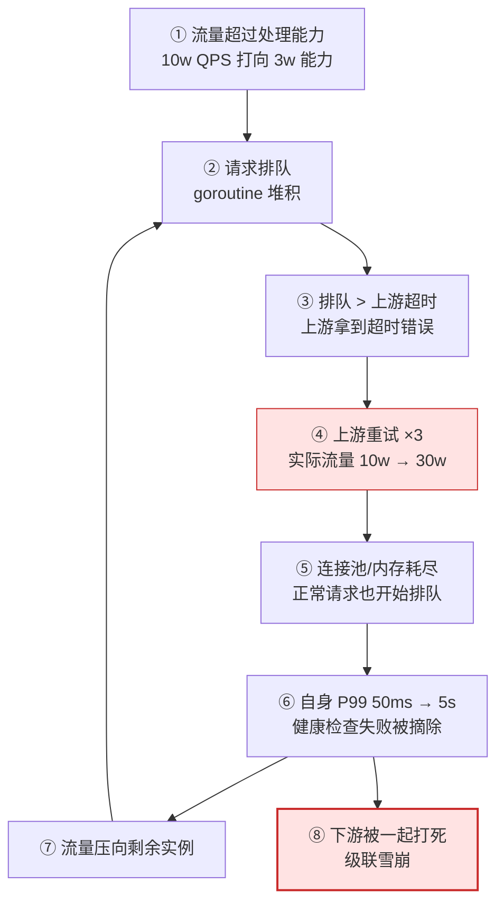
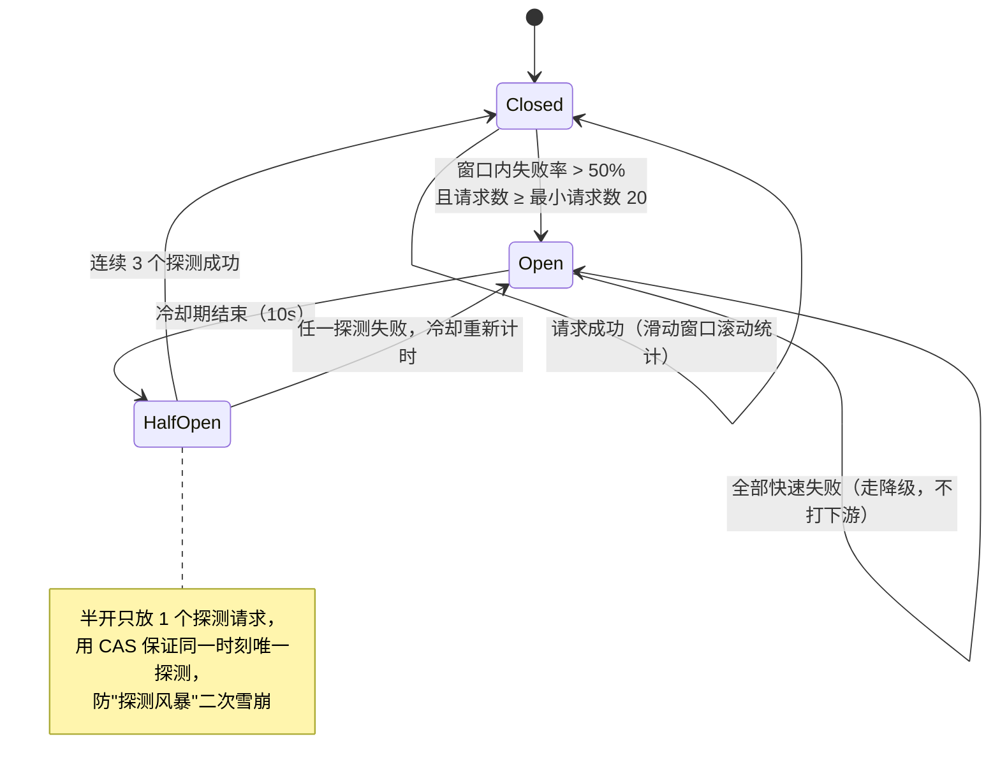

# 12 · 限流熔断降级与背压

> 属于「架构师修炼」· 稳定性工程 · **把「过载」挡在系统外面的四道闸**
> 上一篇：[11 幂等去重与 Exactly-Once](./11-幂等去重与ExactlyOnce)　下一篇：[13 容量规划压测与故障演练](./13-容量规划压测与故障演练)

> **这篇解决什么问题**：算法定义你都见过（原理在[限流与熔断](/后端技术栈强化/08-distributed/限流与熔断)），但线上要回答的是另外几个问题：**阈值定多少？为什么 QPS 涨 10 倍固定阈值还拦不住？重试怎么把下游打死的？降级时写请求该返回什么？无限队列是不是等于没限流？** 本篇只讲**演进决策 + 落地参数 + 故障边界**：限流（二/三/四）→ 熔断（五）→ 隔离（六）→ 降级（七）→ 背压（八）。

---

## 一、过载是怎么变成雪崩的

### 1.1 一条正反馈链条



切断任何一环，雪崩都不会发生：① 限流（二/三/四）② 背压（八）③ 超时预算递减（[网络通信与降级方案](/后端技术栈强化/08-distributed/网络通信与降级方案)）④ 重试预算 + 退避 + 熔断优先（5.4）⑤ 隔离（六）⑥ 熔断（五）⑦⑧ 降级（七）。

### 1.2 本质与拒绝策略

**限流的本质是保护下游和自身，不是拒绝用户**：不拦则 10w 个请求**全部** 5s 超时；拦到 3w 则 3w 个 50ms 成功 + 7w 个立刻失败——**后者整体体验更好**，快速失败可重试，慢超时不可挽回。注意**入口限流保护自身进程，出站限流保护下游**（见 3.2）；且**拒绝不是终点**，`429 + Retry-After` 才是。

| 拒绝策略 | 行为 | 用户体验 | 适用 | 代价 |
| --- | --- | --- | --- | --- |
| **快速失败** | 立刻 429/503 + `Retry-After` | 「稍后再试」，确定性强 | 入口限流、非幂等写 | 需客户端配合 |
| **有界排队** | 最多等 50~200ms | 大部分无感 | 抖动型流量、读请求 | **等待时间 = P99 增量** |
| **无限排队** | 一直等 | 30s 超时以为卡死 | ❌ 任何场景 | 等于没限流，最终 OOM（见八） |
| **降级优先** | 返回旧数据/默认值 | 无感 | 非核心读（推荐位、计数） | 数据陈旧，需定上限 |


---

## 二、限流算法：选型要点与 Go 落地

### 2.1 五种算法对照

| 算法 | 允许突发 | 实现成本 | 适用场景与实现要点 |
| --- | --- | --- | --- |
| **固定窗口** | 边界突刺（最坏 2×） | 1 个计数器 | 粗粒度配额（日调用量、短信条数）；**不能保护下游** |
| **滑动窗口** | 小 | 窗口/格子数 | 网关精确限速（IP/用户）；格子越细越准也越贵 |
| **令牌桶** | **允许**（桶容量） | 2 个字段 | **后端默认选择**；只需定 `rate` 与 `burst` |
| **漏桶** | 不允许 | 队列 | 保护下游吞吐（给第三方限速）；不吸收突发 |
| **自适应** | 由实测 RT 决定 | 几个统计量 | 弹性扩容、RT 波动大的服务；固定阈值的补丁 |

**固定窗口的临界问题**：配额 100 次/分钟时，窗口 A 尾部（第 59.9s）放行 100 次、窗口 B 头部（第 60.1s）再放行 100 次，**0.2 秒内放行 200 次 = 瞬时 1000 QPS，是配额均值的 600 倍**。真实漏出量是最坏 `2 × limit` 集中在边界：对写配额无害，对保护下游就是事故。

### 2.2 单机令牌桶：`rate.Limiter`

```go
import "golang.org/x/time/rate"

// 稳态 100 QPS，桶容量 200：静默 2 秒后可一次性放行 200 个（吸收突发）
var limiter = rate.NewLimiter(rate.Limit(100), 200)

// ① 非阻塞快速失败（写接口与入口网关的默认姿势）
if !limiter.Allow() {
	w.Header().Set("Retry-After", "1") // 明确重试时间，避免客户端立刻重试形成风暴
	http.Error(w, "too many requests", http.StatusTooManyRequests)
	return
}
// ② 有界排队：等 50ms 拿不到就放弃（等待时间计入 P99 预算）
ctx50, cancel := context.WithTimeout(ctx, 50*time.Millisecond)
defer cancel()
err := limiter.WaitN(ctx50, 1)
// ③ 抢占式：ReserveN 拿"未来某刻的令牌"；超预算必须 Cancel 归还，否则令牌被凭空吞掉
if r := limiter.ReserveN(time.Now(), 1); !r.OK() || r.Delay() > maxWait {
	r.Cancel()
	return false
}
```

**参数定法**：`limit` = 单实例实测安全 QPS × 0.7（实测 4k → 限 2800）；`burst` = 允许吸收的突发秒数 × limit（允许 2s → 5600），且不超过下游能承受的瞬时并发（下游连接池 100 就取同量级）；只有抖动型流量才排队，写接口一律不排队。

**常见错误**：`NewLimiter(2000, 2000)` + `Allow()`——均值仍是 2000 QPS，但**每秒开头瞬间吐出 2000 个请求**，等于每天准时打一次下游。

### 2.3 分布式令牌桶：Redis + Lua

单机限流在 10 台机器上等于**总量 10 倍**（10 × 2800 = 28000，业务只允许 10000），因此必须集中计数，而**集中计数必须原子**。

```lua
-- KEYS[1]=桶 key（rl:{clip:create}:{user_id}） ARGV=rate, burst, need
local key, rate, burst, need = KEYS[1], tonumber(ARGV[1]), tonumber(ARGV[2]), tonumber(ARGV[3])
local t = redis.call('TIME') -- ① 时间取自 Redis：节点漂移 500ms 就差 500ms×rate 的令牌
local now = tonumber(t[1]) * 1000 + math.floor(tonumber(t[2]) / 1000)
local d = redis.call('HMGET', key, 'tokens', 'ts'); local tokens, ts = tonumber(d[1]), tonumber(d[2])
if tokens == nil then tokens, ts = burst, now end -- 首次访问 = 满桶
-- ② 惰性补令牌：不跑后台定时器，按时间差一次算够，上限 burst
tokens = math.min(burst, tokens + math.max(0, now - ts) * rate / 1000)
local allowed = 0
if tokens >= need then tokens, allowed = tokens - need, 1 end -- 够则扣减
-- ③ 写回 + TTL 兜底：key 空置后自动回收，避免海量用户 key 永久占内存
redis.call('HSET', key, 'tokens', tokens, 'ts', now)
redis.call('PEXPIRE', key, math.floor(burst / rate * 1000) + 1000)
return {allowed, math.floor(tokens)}
```

```go
// Script 内部先 EVALSHA，遇 NOSCRIPT 自动回退 EVAL；不要手拼 EVAL 字符串（注入 + 无法复用脚本缓存）
var tokenBucket = redis.NewScript(luaSource)

func Allow(ctx context.Context, rdb *redis.Client, key string, rate, burst, need int64) (bool, error) {
	res, err := tokenBucket.Run(ctx, rdb, []string{key}, rate, burst, need).Slice()
	if err != nil {
		return false, err // 由调用方决定降级策略
	}
	return res[0].(int64) == 1, nil
}
```

**原子性的四个层次**（面试深挖点）：① **脚本内**——「读→比较→扣减→写回」若不是原子的，并发请求会读到同一批令牌，Redis 单线程执行 Lua 保证整段原子，**绝不拆成 GET + SET**；② **时间来源**——各节点用本地 `time.Now()` 补令牌会因时钟漂移导致配额不均，故在脚本内 `redis.call('TIME')`；③ **精度**——Lua number 是 double，只做比较与减法、返回时 `math.floor`，**不做浮点相等判断**；④ **Redis 挂掉**——**降级为本地限流**（配额 = 总量/实例数），宁可多拦不可漏拦，绝不放行也不全站拒绝。分层限流与时钟不同步的完整边界见 [限流与熔断](/后端技术栈强化/08-distributed/限流与熔断) 二 2.6。

---

## 三、多层次限流落点：每一层到底限什么

### 3.1 限流维度 × 落点 × 阈值来源

| 落点 | 限什么维度 | **阈值来源（关键）** | 超限行为 |
| --- | --- | --- | --- |
| **网关** | 全局 QPS、单 IP、单用户、单接口 | **集群总容量 × 0.7**（总 30w → 限 20w） | 429 + Retry-After |
| **服务层** | 实例级 / 接口级 QPS | **单实例实测安全值 × 0.7** | 429 或降级 |
| **服务层（自适应）** | 在途并发数 | **实测 RT 动态反推**（Little's Law） | 快速失败 |
| **依赖层（出站）** | 对下游的**并发数**（信号量） | **下游能承受并发 × 0.8** | 快速失败，绝不排队 |
| **DB 层** | 连接数 | `max_connections × 0.7 ÷ 实例数` | 池阻塞 → 超时 |
| 第三方 API | 调用速率 | **对方合同约定**（如 600 RPM） | 本地排队或拒绝 |

### 3.2 四个落点的实现要点

- **网关**：阈值 = 压测总容量 × 0.7，**不按「实例数 × 单机阈值」算**（扩容后实例数会变，业务总量不变）；维度分级：白名单（内部/付费）> 普通用户 > 匿名 IP，一刀切会误杀大客户。
- **服务层**：固定阈值（防尖峰）+ 自适应（跟容量）双保险，**取 min**。
- **依赖层：限并发，不限 QPS**——下游压力来自在途并发（`并发 = QPS × RT`），下游越慢压得越狠，限 QPS 完全防不住：

```go
var clipSem = semaphore.NewWeighted(50) // 最多 50 个并发打向推理服务

func CallInference(ctx context.Context, req *Request) (*Result, error) {
	if !clipSem.TryAcquire(1) { // ① 非阻塞：拿不到立刻失败；排队会把自己的 goroutine 也拖住
		return nil, ErrDownstreamBusy // → 触发降级
	}
	defer clipSem.Release(1)
	ctx, cancel := context.WithTimeout(ctx, 3*time.Second) // ② 出站必须有独立超时
	defer cancel()
	return doCall(ctx, req)
}
```

- **DB 层：连接池本身就是限流器**（第 `MaxOpenConns+1` 个请求在池上排队）：`SetMaxOpenConns` 每实例 20~50 且 **实例数 × 该值 < `max_connections` × 0.7**（设太大 → 扩容时打满 DB 连接，全站挂）；`SetMaxIdleConns ≈ MaxOpenConns`；`SetConnMaxLifetime = 30min` 必须小于 DB `wait_timeout`。**池等待 P99 > 10ms 就告警——它比 CPU 更早报过载。**

---

## 四、自适应限流：固定阈值为什么会失真

### 4.1 弹性扩容下的失真与 Little's Law

以单实例安全能力 4k QPS、HPA 按 CPU 扩容为例：**扩到 20 实例**时真实容量 8w，固定阈值仍按老值 → **只用了 7% 容量，白白拒绝用户**；**缩到 3 实例**时容量 1.2w，阈值没变 → **超载 3 倍，照样被打挂**；**实例变慢**（下游抖动致单机 1.5k，总容量 3w）时阈值依旧没变 → **过载，限流形同虚设**。

```text
Little's Law：并发（在途请求） = QPS × RT  →  允许并发 L ≈ 目标 QPS × 实测 RT
每 1s 一个窗口：有拒绝 → 已饱和：允许并发 = 窗口成功数 × 0.9（主动收缩），下限 minLimit
                无拒绝 → 有余量：est = 窗口QPS × 实测RT；允许并发 = max(当前, est) × 1.05（试探上调）
```

### 4.2 Go 实现与调参

```go
type AdaptiveLimiter struct {
	inflight, limit    int64 // 在途请求数 / 允许并发上限（atomic：热路径只做原子读）
	pass, block, rtCnt int64 // 窗口统计：放行数 / 拒绝数 / RT 样本数
	rtSum              time.Duration
	winStart           time.Time
	minLimit, maxLimit int64
	mu                 sync.Mutex
}

// Allow：请求入口；热路径不加锁
func (l *AdaptiveLimiter) Allow() bool {
	if atomic.LoadInt64(&l.inflight) >= atomic.LoadInt64(&l.limit) {
		atomic.AddInt64(&l.block, 1)        // 记录拒绝，供后台收缩
		metrics.Inc("adaptive_block_total") // 拒绝率是核心观测指标
		return false
	}
	atomic.AddInt64(&l.inflight, 1)
	atomic.AddInt64(&l.pass, 1)
	return true
}

// Done(rt) 在请求结束时 defer 调用：inflight--，并累加 rtSum/rtCnt（★ 只统计成功请求的 RT）

func (l *AdaptiveLimiter) adjust() { // 每秒由后台 goroutine 调用一次
	limit := atomic.LoadInt64(&l.limit)
	switch {
	case l.block > 0: // 有拒绝 = 已饱和：按真实处理量收缩，留 10% 余量
		if limit = int64(0.9 * float64(l.pass)); limit < l.minLimit {
			limit = l.minLimit // 下限兜底，避免收缩到 0 后永远无法恢复
		}
	case l.rtCnt > 0: // 无拒绝 = 有余量：Little's Law 估容量（QPS × RT）并试探 +5%
		qps := float64(l.pass) / time.Since(l.winStart).Seconds()
		est := qps * (l.rtSum.Seconds() / float64(l.rtCnt))
		if limit = int64(math.Max(float64(limit), est) * 1.05); limit > l.maxLimit {
			limit = l.maxLimit
		}
	}
	atomic.StoreInt64(&l.limit, limit)
	metrics.Gauge("adaptive_limit", float64(limit)) // ★ 必须打点，否则没人知道限到了多少
	l.pass, l.block, l.rtSum, l.rtCnt, l.winStart = 0, 0, 0, 0, time.Now()
}
```

调参四条：① 窗口 ≥ 1s 且上调系数 ≤ 1.1（**慢涨快跌**），否则 limit 会随 RT 抖动震荡；② **只统计成功请求的 RT**（被拒请求 RT≈0 会拉低均值，导致误判有余量）；③ 冷启动初始 limit = 压测值 × 0.5 或预热期放行，否则上线初期大量拒绝；④ 自适应**只保护自身**，RT 上升可能来自下游，**下游保护必须靠出站信号量**（3.2）。

---

## 五、熔断：把打不通的下游从调用链上摘掉

### 5.1 状态机



### 5.2 触发判据与半开控制

| 判据 | 典型值 | 优点 | 坑 |
| --- | --- | --- | --- |
| **错误率** | 窗口 10s 内 > 50% | 兼顾流量大小，最常用 | 低流量时波动大 |
| **慢调用率** | RT > 1s 占比 > 30% | **早于错误率触发**（慢是挂的前兆） | 阈值要按 P99 定，定错天天误熔断 |
| **连续失败数** | 连续 10 次 | 实现最简单 | 高并发下 10 次可能只占 10ms，过于敏感 |
| **前提：最小请求数** | 窗口内 ≥ 20 才计算 | **防误判** | 3 请求错 2 个就熔断 = 事故 |

半开探测四条纪律：① 冷却结束**只放 1 个**探测；② 用 `atomic.CompareAndSwap` 保证**同一时刻唯一探测**（否则 100 个探测 = 一次小洪峰）；③ **连续 3 个**成功才回 Closed（偶尔能成 ≠ 恢复）；④ 探测要**短、轻、无副作用**（否则失败时分不清是谁的问题）。

### 5.3 gobreaker 落地

```go
var inferenceCB = gobreaker.NewCircuitBreaker(gobreaker.Settings{
	Name:        "inference.generate", // ★ 按「下游+接口」粒度建，不要全局一个
	MaxRequests: 1,                    // 半开最多放 1 个探测（防探测风暴）
	Interval:    10 * time.Second,     // Closed 态统计窗口
	Timeout:     10 * time.Second,     // Open 持续 10s 后转 Half-Open
	ReadyToTrip: func(c gobreaker.Counts) bool { // 最小请求数：样本不足不熔断，防误判
		return c.Requests >= 20 && float64(c.TotalFailures)/float64(c.Requests) > 0.5
	},
	// ★ 业务错误（参数非法、额度不足）必须判为“成功”，否则正常流量会把熔断器打误判：
	// IsSuccessful: func(err error) bool { return err == nil || errors.Is(err, ErrInvalidParam) },
	OnStateChange: func(n string, f, t gobreaker.State) { metrics.Inc("breaker_switch_total", n, t.String()) },
})

func Generate(ctx context.Context, req *Request) (*Result, error) {
	v, err := inferenceCB.Execute(func() (any, error) { return doGenerate(ctx, req) })
	if errors.Is(err, gobreaker.ErrOpenState) || errors.Is(err, gobreaker.ErrTooManyRequests) {
		return degradedResult(ctx, req) // ★ 熔断必须配降级，否则只是把错误提前了
	}
	if err != nil {
		return nil, err
	}
	return v.(*Result), nil
}
```

### 5.4 熔断与重试的冲突：重试会放大故障

下游已挂（承载能力 ≈ 0）→ 上游重试 3 次 → 流量 ×4 → 客户端自动重试 / 用户刷新 → 再 ×3 → **实际打到下游 = 正常流量的 12 倍**，下游「恢复期」被无限延长，从慢变成彻底不可用。

| 规则 | 落地参数 | 为什么 |
| --- | --- | --- |
| **① 熔断优先于重试** | 重试前先查熔断器；`Open` 直接降级不重试 | 下游明确挂了，重试是纯浪费 + 加重伤害 |
| **② 重试预算** | 重试量 ≤ 总请求 **10%**（滑动窗口统计） | 硬性限制放大倍数 ≤ 1.1，从根上防放大 |
| **③ 指数退避 + 抖动** | `100 → 200 → 400ms`；sleep = `随机(0, 退避值)` | 无抖动时所有客户端同时重试，形成重试波峰 |
| **④ 只重试幂等错误** | 重试：连接失败/超时/欠载 5xx；不重试：4xx、非幂等写 | 重试非幂等写 = 重复扣款（见 [11 篇](./11-幂等去重与ExactlyOnce)） |

---

## 六、隔离：别让一个慢依赖拖垮整个进程

**隔离的本质是给每个依赖划一条资源红线，让它再慢也只能慢在自己的预算里**——旁路业务（封面图生成）与核心业务（任务提交）共用一个池时，旁路占满即**核心业务全部排队**，这就是「一个非核心功能拖垮全站」的机制。

**信号量隔离**（并发数）是 **Go 首选**，轻量无额外协程，代价是不能中断、需自配 ctx 超时；**线程池隔离**（线程）是 Java 生态做法，Go 等价于固定 worker 池 + 有界队列，池大小难定；**连接池隔离**（连接）要求**核心与旁路用不同池**，代价是连接稀有、单池更小；**实例/队列隔离**（进程、队列）把重要依赖单独部署、MQ 按优先级分队列，成本最高。

```go
// 带缓冲 channel 做并发闸门：核心 80 并发、旁路 20 并发，物理隔离
func Acquire(ctx context.Context, gate chan struct{}) error {
	select {
	case gate <- struct{}{}: // 拿到闸门
		return nil
	case <-ctx.Done(): // 到达超时预算就放弃，绝不无限等待
		return ctx.Err()
	}
}
```

**慢依赖拖垮进程的量级**：下游 RT 从 50ms 变成 5s（100 倍）而入口 QPS 2000 时，在途并发从 `2000×0.05s = 100` 涨到 `2000×5s = 10,000`；10,000 个在途 goroutine ≈ **栈 80MB+**（初始 8KB/个）+ **对象 160MB**（16KB/请求）+ **下游连接 10,000 条及缓冲 80MB+** → GC 压力上升 → STW 变长 → 健康检查失败被摘除 → 流量砸向剩余实例 → 雪崩。观测信号：在途 goroutine **持续增长不回落**（有协程在等下游）、池 `WaitDuration` P99 **> 10ms**（池已饱和）、内存**阶梯式上涨**（积压对象未释放）、出站连接数随 QPS 线性上涨（没复用或没限并发）。

---

## 七、降级：打不通的时候给什么

### 7.1 降级分级表

| 级别 | 手段 | 用户感知 | 适用 | 数据影响 |
| --- | --- | --- | --- | --- |
| **L1** | 返回兜底值（默认/空列表/0） | 内容变少但可用 | 推荐位、榜单、计数 | 展示类可接受 |
| **L2** | 返回旧缓存（标注可能延迟） | 基本无感 | 任务列表、详情 | 陈旧，需定上限（如 30min） |
| **L3** | 关闭非核心功能（评论/点赞/埋点） | 有感知，主链路正常 | 附属功能 | 功能缺失，无数据错误 |
| **L4** | 只读模式 | 能看不能提交 | 全站写入口 | **必须明确报错，不能假成功** |
| **L5** | 写 MQ 排队「稍后生效」 | 延迟生效 | 积分、通知 | 最终一致，需幂等 + 对账 |

### 7.2 降级开关与演练

**开关四条硬要求**：① **动态生效**——写配置中心（etcd/Nacos），Watch 推送，秒级生效，不重启不发版；② **双向可回滚**——开通与关闭都能秒级执行（开关本身也会出错）；③ **可灰度**——1% 实例 → 观察 5 分钟 → 50% → 100%，一次全量打开开关 = 一次全量故障；④ **可观测**——开关状态必须上大盘（「当前 L3 降级」），自动开关必须配自动恢复或人工确认，否则「打开的开关没人关」。

**没演练过的降级不是降级**，演练要验证四件事：**能生效**（打开后 5s 内监控上降级计数上升；配置没 Watch、值被缓存是常见失败）、**兜底数据正确**（结构不变、字段齐全，否则前端崩）、**降级路径快**（P99 < 20ms；降级逻辑里又查 DB 是常见失败）、**能恢复**（关了开关流量正常回来，单向开关要靠重启是事故）。常态化：每月抽 1 个开关练一次。

---

## 八、背压：把「排队」变成「信号」

### 8.1 消息积压 vs 请求堆积

**消息积压**待在 Broker 磁盘上——**可持久化，数据不丢只是变慢**，靠加消费者/扩分区事后追平，背压信号是消费者**主动暂停拉取**（`Pause`、降 `MaxPollRecords`）；**请求堆积**待在进程内存里——**重启即丢**，内存涨到 OOM 时进程一挂全丢，只能重启且重启流量砸向剩余实例，背压信号是入口**拒绝新请求**（429/503）。


### 8.2 Go 的背压手段

| 手段 | 实现 | 适用 | 注意 |
| --- | --- | --- | --- |
| **非阻塞 send + 丢弃** | `select { case ch<-v: default: drop++ }` | 埋点/日志等**可丢**数据 | 必须打点 `drop_total` |
| **非阻塞 send + 拒绝** | 同上但返回 `ErrBusy` | 可拒绝的入口请求 | 429 + `Retry-After` |
| **Kafka 消费端限速** | `Pause`/`Resume`、降 `MaxPollRecords` | 消费能力不足 | 同时调大 `MaxPollInterval`，否则被踢出组 |

```go
// 模式 ①：可丢数据（埋点）——非阻塞 send，满了直接丢并打点
select {
case ch <- e:
default:
	if n := dropped.Add(1); n%1000 == 0 { // 千分之一打日志，避免日志本身成为瓶颈
		log.Warn("backpressure drop", "dropped_total", n)
	}
	metrics.Inc("pipeline_dropped_total") // ★ 丢了多少必须可见
}
// 模式 ③：限速消费——令牌桶把"洪水"变成"稳定水流"打给 DB（DB 只接受 500 TPS）
var dbWriter = rate.NewLimiter(rate.Limit(500), 100)
if err := dbWriter.Wait(ctx); err != nil { return } // 等令牌 = 给上游背压（队列变长）
```

**无限排队 = 把故障延迟到 OOM**：无背压时（无界 channel/goroutine），QPS 2000 而处理从 50ms 涨到 5s（能力降到 200 QPS），在途以 `(2000-200)/s` 累积，**90 秒后 ≈ 16 万个在途 ≈ 数 GB → OOM Kill → 重启 → 流量砸向剩余实例 → 雪崩**；用户看到「超时」，运维看到「OOM」，根因是「没有背压」。有背压时（有界队列 1000，满了立刻 429），90 秒后 200 成功、1800 拿到明确的 429，**内存几十 MB，进程健康，指标清晰**。

---

## 故障与一致性边界

| 边界场景 | 现象 | 处理原则 | 兜底与验证 |
| --- | --- | --- | --- |
| **限流误杀正常用户** | 大客户/内部调用被 429 | 阈值 = 实测容量 × 0.7，**按维度分级**（白名单/付费/匿名） | 每日复盘 429 分布，头部用户被拦立即调配额 |
| **熔断期间的写请求** | 用户提交后收到「不可用」，不知是否成功 | **绝不静默丢弃**：快速失败 + 明确错误码 + 可安全重试 | 幂等键 + 去重表；提供状态查询接口 |
| 响应超时但实际成功 | 用户重试 → 重复建任务 | 写请求必须带[幂等键](./11-幂等去重与ExactlyOnce)，唯一索引兜底 | 对账「幂等键提交数 vs 实际任务数」，差异应为 0 |
| **降级导致数据不一致** | 降级到只读后前端仍提示「提交成功」 | **写请求必须明确失败**，禁止假成功 | 前端文案与错误码对齐，灰度验证 |
| Redis 限流器故障 | 限流判断失败 | **降级为本地限流**（总量/实例数），宁可多拦不可漏拦 | 演练 kill Redis，看 429 率是否符合本地配额 |

---

## 面试追问链

1. **「你怎么定限流阈值？」** → ① 压测找拐点（P99 明显上涨前的 QPS）；② 打 7 折留余量；③ 按维度分层（全局/用户/接口），且**扩容时全局阈值不变**。加分句：「阈值是压测数据 × 安全系数，而且限流指标必须可见，否则改了阈值没人知道效果。」
2. **「限流和熔断的区别？」** → **方向不同**：限流管**入口**（保护自己），熔断管**出口**（保护下游、防放大）；**依据不同**：限流看流量（QPS/并发），熔断看**结果质量**（错误率/慢调用率）；**动作不同**：限流是拒绝，熔断是快速失败 + 降级。两者串联而非互斥。
3. **「重试为什么会打挂系统？」** → 故障时重试是**乘法器**：3 次重试 = ×4，叠加客户端重试与用户刷新可达 ×10 以上，而下游承载能力此时趋近 0 → 恢复期被无限延长。解法：**熔断优先 + 重试预算 ≤10% + 指数退避带抖动 + 只重试幂等错误**。
4. **「降级时写请求怎么处理？」** → **绝不静默丢弃，也绝不假成功**：① 返回明确错误码（`503` + 可读文案）；② 携带[幂等键](./11-幂等去重与ExactlyOnce)保证重试安全；③ 提供状态查询接口确认。若业务允许，用 L5「写 MQ 排队」并明确告知稍后生效。
5. **「单机限流和全局限流怎么配合？」** → **全局定总量**：网关按集群总容量限（如 20w），Redis + Lua 集中计数，保证不超总量；**单机兜底**：每实例限 `总量/实例数 × 1.5`，防流量倾斜（权重不均、发布期摘流、热点用户）打死单实例；**再叠自适应**应对容量波动。三层取 **min**，Redis 挂掉降级为单机配额。「全局准但不抗 Redis 故障，单机准但总量失控，所以两个都要。」

## 自测清单

- [ ] 能画出「过载 → 雪崩」链条，并说出每一环的切断手段
- [ ] 能解释固定窗口边界突刺的最坏倍数（2×），说明为什么保护下游不能用它
- [ ] 能写出 `rate.Limiter` 三种用法（Allow / WaitN+ctx / ReserveN+Cancel）与 burst 的定法
- [ ] 能背出限流维度 × 落点 × 阈值来源表，解释依赖层要限并发而非 QPS 的原因
- [ ] 能用 Little's Law 解释自适应限流，说出「只统计成功请求 RT」的理由
- [ ] 能默画熔断三态状态机，说出最小请求数、慢调用率、半开单探测的作用

> **下一篇**：[13 容量规划压测与故障演练](./13-容量规划压测与故障演练) —— 限流的阈值不是拍出来的，是压出来的。
