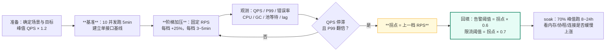
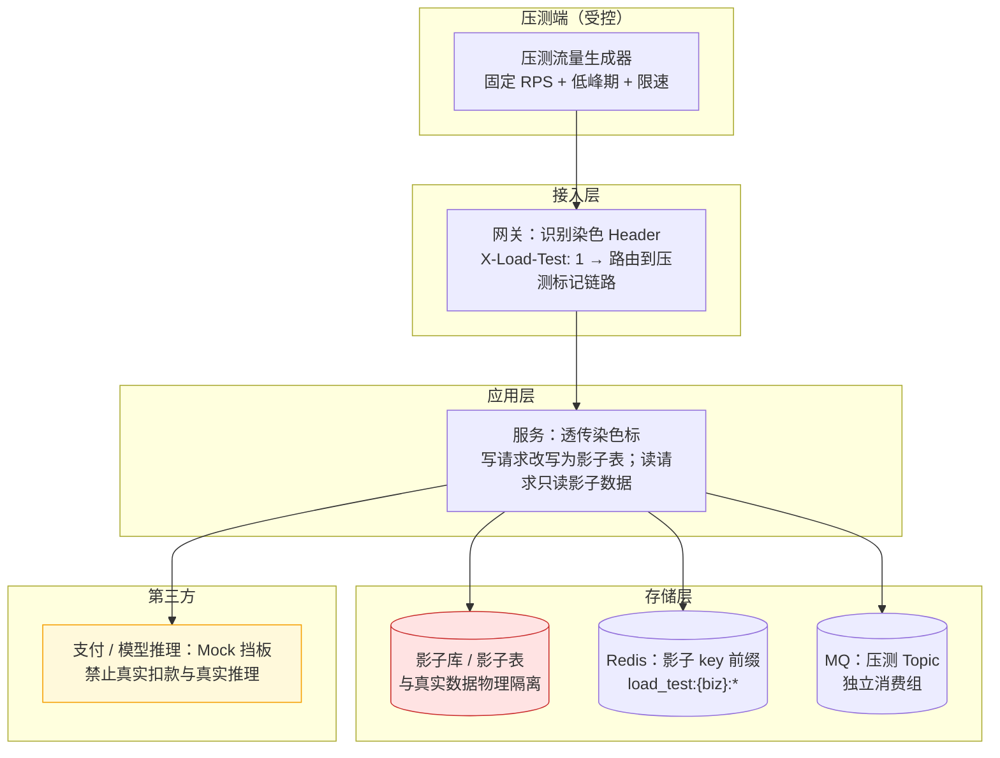

# 13 · 容量规划压测与故障演练

> 属于「架构师修炼」· 稳定性工程 · **把「能扛多少」从感觉变成数字，再把数字变成预案**
> 上一篇：[12 限流熔断降级与背压](./12-限流熔断降级与背压)　下一篇：[14 备份恢复与故障复盘](./14-备份恢复与故障复盘)

> **这篇解决什么问题**：面试官问「你这个系统能扛多少 QPS」，答「压测过，单实例 3600，集群 12 台打 7 折约 3 万」和答「应该没问题」是两个人。这一篇解决三件事：**① 容量怎么算**（业务指标 → 资源指标 → 水位与冗余度）；**② 拐点怎么找**（压测类型、开/闭模型、QPS-延迟曲线）；**③ 预案怎么验**（全链路压测的流量染色与影子库、Chaos 演练剧本、常态化机制）。

---

## 一、容量规划：把业务指标换成资源指标

### 1.1 换算公式与算例

沿用 [00 篇](./00-架构师思维与设计方法论)的五步法公式，容量规划要的是**从业务量推到「每一个资源项的水位」**：

```text
峰值 QPS   = 日均请求数 / 86400 × 峰值系数（一般 2~5，秒杀类 50~100）
实例数     = 峰值 QPS / 单实例拐点 QPS × 安全系数（1.5~2）
DB 连接数  = 实例数 × 每实例连接池上限  （必须 < max_connections × 0.7）
缓存内存   = 热点条数 × 单条大小 × 1.5~2（含 Redis 自身开销）
带宽       = 峰值 QPS × 平均响应体大小 × 8（bit）÷ 网卡上限
```

**算例（AI 剪辑任务平台，与 [15 篇](./15-案例-AI剪辑任务平台架构)同一场景）**：日活 100 万、人均 3 次任务提交、读列表人均 10 次：

```text
写峰值 = 100w × 3 / 86400 × 3 ≈ 104 QPS      → MySQL 单机足够
读峰值 = 100w × 10 / 86400 × 3 ≈ 347 QPS     → 缓存即可，不需要分片
状态回调 = 104 × 20 ≈ 2,000 QPS              → 真正的写入热点，需要 Kafka 削峰
视频存储 = 300w × 100MB ≈ 300 TB/天          → 真正的瓶颈是存储成本与 GPU 排队
GPU：300w 任务 × 60s / 86400s ≈ 2,083 卡时   → 容量规划的主角是 GPU 队列，不是 QPS
```

### 1.2 容量水位表（告警线写死，不要凭感觉）

| 资源 | 关注指标 | **告警水位** | **危险水位** | 超了怎么办 |
| --- | --- | --- | --- | --- |
| CPU | 5 分钟均值 | **60%** | 80% | 扩实例；先看是不是 GC/锁造成的假高 |
| 内存 | RSS / limit | **60%** | 80%（接近 GOMEMLIMIT） | 排查泄漏（见本文第五节）；扩容 |
| 连接池 | 使用率 & 等待时间 | **60% / P99 > 10ms** | 80% / P99 > 50ms | 调池 + 查慢查询 + 限流，**不要只调大池** |
| DB 连接 | `Threads_connected / max_connections` | **60%** | 80% | 减实例侧池上限，或加中间件 |
| 磁盘 | 使用率 & 写入延迟 | **60%** | 80% | 冷热分层、归档、扩容 |
| 带宽 | 出口带宽使用率 | **60%** | 80% | CDN/压缩/减少跨机房回源 |
| QPS | 相对拐点的比例 | **≤ 拐点 70%** | 拐点 90% | 触发扩容或限流降级 |
| MQ | 消费 lag | **> 1 分钟** | **> 10 分钟** | 加消费者/扩分区/降级非核心消息 |

> **为什么水位是 60% 而不是 90%**：故障时的**双活接管、重试放大、突发流量**都需要余量。一个跑在 90% 的系统，任何一次抖动都是雪崩起点。**60% 是稳态线，80% 是应急线。**

### 1.3 冗余度：N+1、N+2 与「峰值水位 ≤ 50%」

| 冗余度 | 含义 | 能容忍的故障 | 适用 |
| --- | --- | --- | --- |
| **N** | 刚好够用 | 无 | ❌ 只用于离线任务、非核心 |
| **N+1** | 多一份 | 挂 1 个实例/1 个节点 | 日常业务底线 |
| **N+2** | 多两份 | 挂 2 个（如挂一整个可用区、发布期滚动的 2 台） | 核心业务、有发布影响的系统 |
| **2N** | 双份 | 整个机房 | 金融级、双活 |

**「峰值水位 ≤ 50%」的含义**：N+1 意味着**只要有一台挂了，其余实例就要多扛 1/N 的量**。若日常峰值已到 80%，挂一台后瞬间过载。所以容量验收的标准是：**按实际峰值流量压测，全集群水位不超过 50%**——这样挂掉一台后水位 ≈ 55%，仍在安全区。

---

## 二、压测类型：六种压测，目标完全不同

| 类型 | 目标 | 方法 | **判定标准** |
| --- | --- | --- | --- |
| **基准测试** | 建立单接口基线 | 低并发（如 10 并发）跑固定时长 | 记录 P50/P99、单实例 QPS，作为后续回归基线 |
| **负载测试** | 验证预期峰值是否达标 | 按规划峰值 × 1.2 施加 **30~60 min** | P99 达标（如 < 200ms）、错误率 < 0.1%、资源水位 ≤ 60% |
| **压力测试** | **找拐点**（最大承载） | 固定 RPS 阶梯递增（每档 3~5 min），直到吞吐停滞/错误率上升 | 找出「QPS 不再增长而延迟飙升」的拐点值 |
| **稳定性测试（soak）** | 找泄漏与长尾 | 70% 峰值流量**连续跑 8~24 h** | 内存/goroutine/连接数**曲线平稳**，无缓慢上涨 |
| **容量测试** | 确定扩容比例 | 多档压力 × 多实例数组合 | 得出「线性扩展比」与「每实例贡献 QPS」 |
| **全链路压测** | 验证端到端（含下游/DB/MQ） | 生产环境 + 流量染色 + 影子库 | 全链路无条件达标，且**真实数据零污染** |

> **绝大多数团队只做第 2 种**（负载测试），于是线上依然会出两种事故：**拐点未知**（大促一冲就挂）与**慢泄漏**（跑 6 小时后 OOM）。**压力测试与 soak 测试才是架构师该推动的那两个。**

---

## 三、压测方法与工具

### 3.1 工具对比

| 工具 | 并发模型 | 优势 | 局限 | 适用 |
| --- | --- | --- | --- | --- |
| `wrk` / `wrk2` | 固定连接（闭模型）；wrk2 支持固定 RPS | 极高吞吐、脚本 Lua 扩展 | 统计粗、场景编排弱 | 单接口极限 QPS |
| `vegeta` | 固定 RPS（开模型） | 命令行简单、可出延迟分位图 | 复杂场景编排弱 | 找拐点、CI 回归 |
| `k6` | 支持开/闭模型、分阶段 | 脚本化（JS）、场景丰富、可集成 CI | 单机压不极限（需分布式） | 场景化压测、回归门禁 |
| `hey` | 固定并发（闭模型） | 参数少、上手快 | 功能极少 | 快速冒烟 |
| **自研 Go 压测器** | 可控（推荐固定 RPS） | 完全贴合业务（带签名、幂等键、埋点） | 需要自己实现统计与分布式 | 生产全链路压测 |

```bash
# vegeta：固定 500 RPS 打 60s，输出分位报告（开模型，适合找拐点）
vegeta attack -rate=500 -duration=60s -targets=targets.txt | vegeta report -type='hdrplot'
```

### 3.2 自研 Go 压测客户端（固定 RPS + 分位数统计）

```go
// 固定 RPS 的开模型压测器：客户端不因服务端变慢而降速——这才是找拐点该用的模型
func main() {
	target := flag.String("url", "http://127.0.0.1:8080/api/task", "target")
	rps := flag.Int("rps", 500, "目标 RPS")
	dur := flag.Duration("d", 60*time.Second, "持续时间")
	flag.Parse()

	var mu sync.Mutex
	lat := make([]time.Duration, 0, 1<<20) // 采样用于算分位数；生产用 HDR Histogram
	var ok, fail, dropped int64
	client := &http.Client{Timeout: 3 * time.Second, Transport: &http.Transport{
		MaxIdleConnsPerHost: 500, // ★ 与并发量匹配，否则连接复用不足会先卡住压测器自己
	}}
	ctx, cancel := context.WithTimeout(context.Background(), *dur)
	defer cancel()

	sem := make(chan struct{}, *rps) // 在途上限：服务端卡死时压测器自己不能 OOM
	tick := time.NewTicker(time.Second / time.Duration(*rps))
	defer tick.Stop()
	var wg sync.WaitGroup
	for {
		select {
		case <-ctx.Done():
			wg.Wait()
			report(lat, ok, fail, dropped)
			return
		case <-tick.C:
			select {
			case sem <- struct{}{}:
			default:
				atomic.AddInt64(&dropped, 1) // 发不动了 = 服务端已经慢到极限，必须记录
				continue
			}
			wg.Add(1)
			go func() {
				defer wg.Done()
				defer func() { <-sem }()
				start := time.Now()
				resp, err := client.Get(*target)
				mu.Lock()
				lat = append(lat, time.Since(start))
				mu.Unlock()
				if err != nil {
					atomic.AddInt64(&fail, 1)
					return
				}
				io.Copy(io.Discard, resp.Body) // 必须读完并关闭，否则连接无法复用
				resp.Body.Close()
				if resp.StatusCode >= 500 {
					atomic.AddInt64(&fail, 1)
					return
				}
				atomic.AddInt64(&ok, 1)
			}()
		}
	}
}

// 分位数：排序取点（真实压测器用 HDR Histogram，避免高基数内存放大）
func report(lat []time.Duration, ok, fail, dropped int64) {
	sort.Slice(lat, func(i, j int) bool { return lat[i] < lat[j] })
	p := func(q float64) time.Duration {
		if len(lat) == 0 {
			return 0
		}
		return lat[int(float64(len(lat)-1)*q)]
	}
	fmt.Printf("成功 %d 失败 %d 丢弃 %d | P50 %v P95 %v P99 %v\n",
		ok, fail, dropped, p(0.5), p(0.95), p(0.99))
}
```

### 3.3 闭模型 vs 开模型：为什么找拐点必须用固定 RPS

| 模型 | 行为 | 后果 | 适用 |
| --- | --- | --- | --- |
| **闭模型**（固定并发，wrk/ab 默认） | 每个虚拟用户**等上一个响应回来**才发下一个 | 服务端变慢时客户端**自动降速**，永远测不出「排队崩溃」 | 测单机极限吞吐、稳定性 |
| **开模型**（固定 RPS，vegeta/自研） | 不管服务端多慢，**按固定速率持续发压** | 能真实复现「流量不变而系统变慢」的过载过程，**能找出拐点** | **压力测试、容量验证** |

> 一句话：**闭模型测的是「能力上限」，开模型测的是「过载行为」**。线上流量是开模型（用户不会因为你慢就不点），所以找拐点必须用开模型。

### 3.4 怎么读 QPS-延迟曲线（同一压测、阶梯加压）



**一次真实的阶梯加压数据（示意，单实例 Go 服务 + MySQL 读写）**：

| 并发/RPS | 实际吞吐 QPS | P50 | **P99** | 错误率 | 现象与判定 |
| --- | --- | --- | --- | --- | --- |
| 500 RPS | 498 | 12 ms | **45 ms** | 0% | 线性区，资源水位 25% → 安全 |
| 1000 RPS | 995 | 14 ms | **52 ms** | 0% | 仍线性，CPU 45% → 安全 |
| 2000 RPS | 1,980 | 18 ms | **90 ms** | 0% | 效率略降，CPU 62% → 接近告警线 |
| 3000 RPS | 2,850 | 31 ms | **210 ms** | 0.2% | **拐点区**：吞吐增速放缓、P99 翻倍 |
| 4000 RPS | 3,050 | 180 ms | **1,400 ms** | 3.1% | 过载：吞吐停滞、P99 涨 6 倍 |
| 6000 RPS | 2,700 | 900 ms | **5,200 ms** | 18% | **吞吐反降**（重试/GC/锁竞争） |

**结论与参数回填**：拐点取 **3000 RPS**（保守取 P99 第一次翻倍的前一档）；告警阈值 = `3000 × 0.6 = 1800`；限流阈值 = `3000 × 0.7 = 2100`；扩容触发 = P99 > 200ms 持续 3 分钟。**注意最后一档：吞吐反降是过载的确定信号，比延迟更有诊断价值。**

---

## 四、全链路压测：在生产上安全地打流量



| 关键机制 | 落地做法 | 不做会怎样 |
| --- | --- | --- |
| **流量染色** | 网关按 Header（`X-Load-Test: 1`）打标，**全链路透传**（HTTP header / gRPC metadata / MQ header） | 压测流量混入真实流量，污染监控与告警 |
| **影子库/影子表** | 同一实例下 `task_shadow` 表或独立影子库，应用按标自动改写表名 | **压测数据写进真实表**，用户看到假订单 |
| **缓存隔离** | 影子 key 加统一前缀 + 独立 DB index；绝不写真实业务 key | 缓存被压测数据覆盖，用户读到脏数据 |
| **MQ 隔离** | 独立 Topic（或独立消费组 + 标签过滤），消费者只处理压测消息 | 压测消息被真实消费者处理 → 真实用户收到假通知 |
| **第三方 Mock** | 支付/推理/短信全部挡板返回固定结果，**绝不打真实第三方** | 真实扣款、真实 GPU 消耗、触发第三方风控 |
| **数据清理** | 压测结束按标批量删除影子数据（TTL + 定时任务双重保障） | 影子表无限增长，磁盘告警 |
| **影响面控制** | **低峰期**执行、总 RPS ≤ 生产余量 50%、白名单放行、可一键停止 | 压测把线上打挂（这是最常见的压测事故） |
| **压测开关** | 配置中心的总开关，中途异常可立即熔断压测流量 | 只能等压测跑完，损失扩大 |

> **原则**：**全链路压测的第一目标是「不影响真实用户」，第二目标才是「数据准」**。任何一条隔离机制缺失，就不压生产——先在预发做（预发做不了的部分用生产影子环境）。

---

## 五、压测要观测的指标清单

**只看 QPS 和 P99 = 只看了结果，没看到原因。** 压测时必须同时盯住应用、DB、缓存、MQ 四层：

| 层 | 指标 | **异常阈值（经验）** | 可能原因 |
| --- | --- | --- | --- |
| 应用 | QPS、P99 | P99 > 300ms | 下游慢、锁竞争、GC |
| 应用 | **GC 暂停（STW）** | 单次 > 10ms 或频率骤增 | 分配过多、`GOGC` 过高、堆过大 |
| 应用 | **goroutine 数** | 持续上涨不回落 | 协程泄漏（等下游无超时） |
| 应用 | 连接池等待 P99 | **> 10ms** | 池过小或下游慢（**最灵敏的过载信号**） |
| 应用 | 错误率 / 重试率 | 错误 > 0.1%；重试 > 15% | 下游故障被重试放大 |
| DB | QPS / TPS | 接近拐点 70% | 需读写分离或缓存 |
| DB | **慢查询数** | > 1 条/秒 | 缺索引、隐式转换、大表扫描 |
| DB | `Threads_running` | > CPU 核数 × 2 | 并发事务过多，锁/IO 等待 |
| DB | 锁等待（`Innodb_row_lock_waits`） | 持续增长 | 热点行更新、长事务 |
| DB | **主从延迟** | > 1s 告警 / > 10s 事故 | 大事务、并行复制不足（[03 篇](./03-MySQL主从与读写分离落地)） |
| 缓存 | 命中率 | < 90% | key 设计问题 / 缓存被击穿 |
| 缓存 | 带宽 / 大 key | 单 key > 10KB、带宽接近上限 | 大 value 序列化成本高（[04 篇](./04-Redis高可用与缓存体系落地)） |
| MQ | 生产/消费速率、**lag** | lag > 1 分钟且增长 | 消费能力不足、消费逻辑变慢 |
| 系统 | 网络重传、TIME_WAIT | 重传 > 0.1% | 丢包、连接未复用 |

> **压测报告必须包含「拐点 + 每个资源项的水位」**，而不是只给一个 QPS 数字——面试里说「我们压到 3000 QPS 拐点，此时 CPU 62%、池等待 4ms、DB 慢查询 0」，这就是 A3 级的表达。

---

## 六、故障演练（Chaos）：验证预案，而不是验证「系统不会挂」

### 6.1 演练目标与故障注入清单

**演练不是找 bug，是回答三个问题**：① 故障发生时**谁先发现**（监控覆盖了吗）？② 系统**行为是否符合预期**（熔断/切换/降级生效了吗）？③ 人**能不能在承诺时间内恢复**（预案、权限、回滚脚本齐备吗）？

| 故障域 | 注入方式 | 观察点 |
| --- | --- | --- |
| 进程 | `kill -9` / 容器驱逐 | 优雅退出、流量摘除耗时、是否有请求失败 |
| CPU | `stress-ng --cpu 8`（50%~100%） | 自适应限流是否生效、P99 是否可控 |
| 内存 | 压力进程占满 / 触发 OOM Killer | 是否有 OOM 保护、重启后的雪崩防护 |
| 网络延迟 | `tc netem delay 200ms` | 超时设置是否合理、熔断是否触发 |
| 网络丢包/分区 | `tc loss 20%` / 隔离一个可用区 | 重试预算、多数派可用性（etcd/DB） |
| 磁盘 | 填满 `/data` / 只读挂载 | 日志与临时文件处理、是否影响核心链路 |
| 时钟 | 偏移 NTP（±5min） | 令牌桶/租约/证书是否受时钟影响（[10 篇](./10-etcd与Raft选主租约落地)） |
| 依赖超时 | toxiproxy / mock 注入延迟 | 熔断阈值、降级是否给出兜底结果 |
| 依赖错误 | 注入 5xx / 连接拒绝 | 熔断判据、重试预算是否真的拦住放大 |
| 主从切换 | 手动 `failover` / 杀主库 | RTO、丢数据窗口、应用是否自动重连 |
| 机房断网 | 摘除机房流量 / 断专线 | 多活切换时间与数据冲突处理 |

| 工具 | 特点 | 适用 |
| --- | --- | --- |
| **Chaos Mesh** | K8s 原生 CRD，Pod/网络/IO/时间/HTTP 全类型故障 | 容器化生产/预发，最推荐 |
| **ChaosBlade** | 阿里开源，主机 + 容器，命令简单、场景库丰富 | 虚拟机与物理机混布环境 |
| **toxiproxy** | 代理型故障注入，专注网络延迟/中断 | 本地与 CI 里模拟依赖抖动 |
| **手写开关** | 代码里的 `if chaosMode { return err }` | 依赖级故障（最有性价比，且**零额外组件**） |

### 6.2 三个演练剧本（场景 / 注入 / 预期 / 判定 / 回滚）

**剧本 ①：Redis 主库宕机**

| 项 | 内容 |
| --- | --- |
| 场景 | 主库进程被 kill（模拟机器宕机），哨兵在 10s 内完成切换 |
| 注入 | `kubectl delete pod redis-master`（Chaos Mesh PodChaos） |
| 预期表现 | ① 5s 内出现连接错误；② 业务侧命中本地兜底/降级（L2 返回旧缓存）；③ 哨兵 10s 内切换，客户端 30s 内恢复；④ 短窗口内出现「缓存未命中 → 直接查 DB」的读放大 |
| **判定标准** | P99 < 300ms（降级期间）、错误率 < 1%、切换后 60s 内指标回落到基线；**DB QPS 上升不超过 50%**（读放大受控） |
| 回滚 | 恢复 Redis 主库 → 观察主从同步完成 → 关闭降级开关 |
| 常见失败 | 没配哨兵客户端重连超时 → 应用 5 分钟不恢复；无本地兜底 → 错误率 100% |

**剧本 ②：MySQL 主库切换**

| 项 | 内容 |
| --- | --- |
| 场景 | 主库不可用，MHA/Orchestrator 提升从库为新主（或云 RDS 自动切换） |
| 注入 | 杀主库进程 + 阻断 VIP（Chaos Mesh + 网络规则） |
| 预期表现 | ① 写请求 10~30s 内失败（明确错误码，不是静默丢弃）；② 从库提升后应用自动重连新主；③ **未同步的 binlog 事务丢失**，对账任务发现差异 |
| **判定标准** | **RTO ≤ 30s**；**RPO = 0**（半同步 `AFTER_SYNC` 下）或明确记录丢失窗口；切换后数据校验脚本一致；写请求在切换期返回可重试错误（配合[幂等键](./11-幂等去重与ExactlyOnce)） |
| 回滚 | 原主库以从库身份重新加入（**绝不能直接顶回主**，会造成双写分裂） |
| 常见失败 | 应用用固定 IP 不重连 → 永久不可用；半同步配置错误导致丢数据；切换后未降级仍走读写分离，从库压力翻倍 |

**剧本 ③：下游依赖 P99 从 50ms 涨到 2s**

| 项 | 内容 |
| --- | --- |
| 场景 | 推理服务（或支付、第三方 API）响应从 50ms 恶化到 2s，但**不报错**（最危险的一种故障） |
| 注入 | `tc netem delay 1900ms` 于目标依赖，或 toxiproxy 注入延迟 |
| 预期表现 | ① 出站信号量在 3s 内被占满 → 快速失败（`ErrDownstreamBusy`）；② 慢调用率 > 30% 触发熔断；③ 降级返回兜底结果（如「任务排队中」）；④ 本服务 P99 涨幅 < 50%（**隔离成功**） |
| **判定标准** | 本服务 P99 ≤ 300ms、错误率 ≤ 1%、在途 goroutine 不持续上涨、熔断状态切换 ≤ 2 次（不震荡） |
| 回滚 | 移除延迟注入 → 熔断进入半开 → 连续成功 → 回 Closed；关闭降级开关 |
| 常见失败 | 没设出站超时 → goroutine 与连接被占满 → 本服务雪崩；限 QPS 而不限并发 → 完全防不住；重试 3 次 → 依赖压力 ×3 |

---

## 七、演练的组织与常态化

| 阶段 | 产出 | 检查点 |
| --- | --- | --- |
| **计划** | 演练清单（场景、时间、参与人、影响面） | 每个季度覆盖所有 P0 依赖；**每月至少 1 次小演练** |
| **影响面评估** | 影响用户数、是否低峰、是否需要公告、是否走灰度 | 生产演练必须在低峰期 + 有值班 + 有回滚人 |
| **预案与值班** | 回滚步骤（可执行的命令/脚本）、决策人、止损线 | 回滚脚本**必须在演练前跑通过**（不能现场写） |
| **执行** | 时间线记录（谁在什么时刻做了什么、观察到什么） | 只注入**单一故障**，避免多故障叠加难以归因 |
| **复盘** | 演练报告：预期 vs 实际、发现的问题、改进项（Owner + Deadline） | **对事不对人**；改进项要可验证（见 [14 篇](./14-备份恢复与故障复盘)） |
| **常态化** | 每月小演练 + 每季度全链路演练 + 演练纳入发布流程 | 新服务上线前必须演练其降级路径 |

**演练报告模板（6 段，控制在 1 页内）**：① 场景与目标；② 时间线（注入时刻、现象出现、判定、回滚）；③ 预期 vs 实际差异；④ 暴露的问题（监控盲区/预案缺陷/代码 bug）；⑤ 改进项（Owner + Deadline + 验证方式）；⑥ 结论（预案是否有效，能否上生产）。

---

## 故障与一致性边界

| 边界场景 | 现象 | 处理原则 | 兜底与验证 |
| --- | --- | --- | --- |
| **压测把线上打挂** | 压测期间真实用户报错 | 总 RPS ≤ 生产余量 50%、低峰期执行、压测开关一键停 | 压测前记录基线，实时盯 P99 与错误率，超阈值立即停 |
| 演练中真的发生故障 | 注入的故障与真实故障叠加，影响扩大 | **决策人有权立即终止演练**，止损线前置（如错误率 > 5%） | 回滚脚本预演过；演练期间不加其他变更 |
| **压测数据污染** | 真实用户看到压测订单/通知 | 影子库 + 影子 key 前缀 + Mock 第三方，**三重隔离** | 压测后按标清理 + 与真实数据对账（差异必须为 0） |
| 影子库与真实数据混用 | 压测结果失真（读到真实热点数据） | 影子库冷数据会导致缓存命中率失真，需**预热影子数据** | 压测前预热；报告中标注「缓存命中率不代表线上」 |
| 压测流量进入真实 MQ | 真实消费者处理压测消息 | 独立 Topic 或消费组标签过滤 | 消费端断言染色标，遇到非压测消息告警 |
| 容量规划偏乐观 | 按「单实例峰值 × 实例数」估算，实际不线性 | 必须做**多实例容量测试**（扩展比通常 0.7~0.9） | 报告里写明扩展比，扩容按 0.8 折算 |
| 拐点前无预警 | 流量缓慢增长到 90% 才告警 | 告警阈值定在**拐点 × 0.6**，并监控「距拐点比例」 | 每周更新拐点基准（版本变更后重新压测） |
| 演练发现的问题不闭环 | 报告写完就归档，下次同样的坑 | 改进项必须有 Owner + Deadline + 验证方式 | 下次演练**首先回验上次的改进项** |

---

## 面试追问链

1. **「你怎么评估系统容量？」** → 四步：① 业务指标换算（DAU × 人均请求 × 峰值系数 → 峰值 QPS）；② **压测找拐点**（开模型、阶梯加压，取 P99 第一次翻倍的前一档）；③ 打折配置（告警 = 拐点 × 0.6、限流 = 拐点 × 0.7、实例数按 0.8 扩展比折算）；④ 冗余度按 N+1 且**峰值水位 ≤ 50%**。加分句：「容量不是算出来的，是压出来的，而且要在版本变更后重压——代码一变，拐点就变。」

2. **「压测怎么找拐点？」** → 用**固定 RPS 的开模型**（vegeta/自研）阶梯加压，每档 3~5 分钟；同时盯四层指标。拐点信号是「**QPS 不再增长而 P99 翻倍**」，再往上会出现**吞吐反降**。闭模型（固定并发）会因客户端自动降速而测不出过载，只能测能力上限。

3. **「怎么保证压测不影响线上？」** → 八条隔离：低峰期、总流量 ≤ 余量 50%、流量染色全链路透传、影子库/影子表、影子缓存前缀、独立 MQ Topic、第三方 Mock、一键停止开关 + 实时监控止损。**并且改表名/写库必须由框架按染色标自动改写，不能靠人记得改。**

4. **「你们做过故障演练吗？」** → 做过，并且给结构和数字：「每季度全链路演练 + 每月 1 次小演练；剧本覆盖 Redis 宕机、MySQL 切换、依赖延迟；判定标准事先写明（如主从切换 RTO ≤ 30s、RPO = 0）；回滚脚本演练前跑通，决策人可随时终止。」

5. **「演练发现的问题怎么闭环？」** → 报告 6 段（场景/时间线/预期 vs 实际/问题/改进项/结论），**改进项必须带 Owner、Deadline 和验证方式**，并进入下次演练的**回验清单**；同时对事不对人，只讨论机制不追责个人。

## 自测清单

- [ ] 能在 5 分钟内把「DAU × 人均请求」换算成峰值 QPS、实例数、连接数与带宽
- [ ] 能背出容量水位表（60% 告警 / 80% 危险），并解释为什么是 60% 而不是 90%
- [ ] 能说清 N+1/N+2 与「峰值水位 ≤ 50%」的关系
- [ ] 能区分六种压测类型，并说出各自判定标准（尤其 soak 与压力测试）
- [ ] 能写出固定 RPS 压测器的关键点（连接池匹配、在途上限、读完 body、分位数统计）
- [ ] 能解释闭模型与开模型的区别，说明为什么找拐点要用固定 RPS
- [ ] 能对全链路压测列出至少 6 条隔离机制，并说明缺哪条会出什么事
- [ ] 能默写「Redis 宕机 / MySQL 切换 / 下游延迟」三个剧本的判定标准与回滚方式

> **下一篇**：[14 备份恢复与故障复盘](./14-备份恢复与故障复盘) —— 压测和演练解决「不出事」，备份和复盘解决「出了事能回来」。
