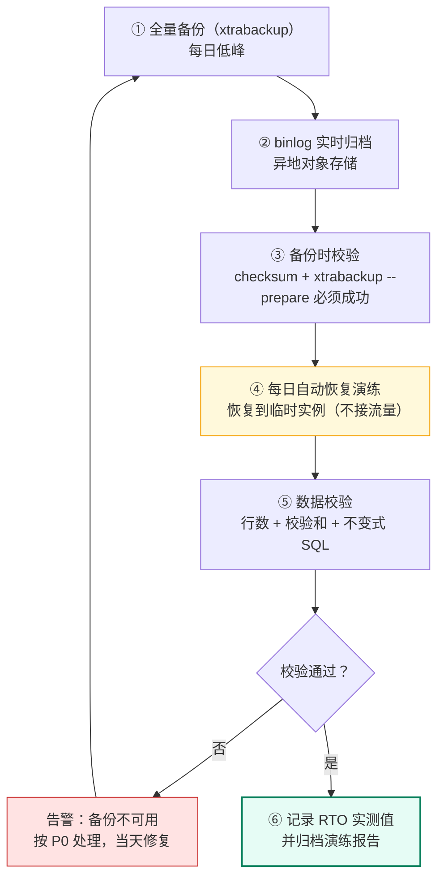
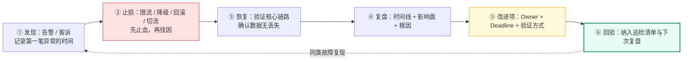

# 14 · 备份恢复与故障复盘

> 属于「架构师修炼」· 稳定性工程 · **「出事之后」的两件事：数据回得来，教训留得下**
> 上一篇：[13 容量规划压测与故障演练](./13-容量规划压测与故障演练)　下一篇：[15 案例：AI 剪辑任务平台架构](./15-案例-AI剪辑任务平台架构)

> **这篇解决什么问题**：前面 13 篇都在讲「怎么不出事」，这一篇讲**出事之后**——① **数据能不能回来**（备份策略、RPO/RTO、PITR 到秒、恢复演练）；② **人能不能不乱**（SLO 与错误预算、告警分级、值班）；③ **教训能不能留下**（故障复盘模板与两个真实案例）。一句核心：**没验证过的备份等于没有备份，没写 Owner 的改进项等于没有改进。**

---

## 一、备份策略：先定 RPO，再定备份

### 1.1 全量 + 增量 + binlog：频率与 RPO 的关系

| 备份类型 | 内容 | 频率 | 恢复方式 | 对 RPO 的贡献 |
| --- | --- | --- | --- | --- |
| **全量备份** | 某一时刻的完整数据快照 | 每天 1 次（低峰期） | 直接恢复 | 提供**基线**，决定恢复起点 |
| **增量备份** | 自上次全量/增量以来的变化页（xtrabackup） | 每 1~6 小时 | 全量 + 依次应用增量 | 缩短恢复时间和存储占用 |
| **binlog / WAL** | 逻辑变更日志（MySQL）/ AOF（Redis） | 持续 | 全量后**重放**到指定时间点 | **决定 RPO（可做到秒级）** |
| 快照备份 | 云盘快照 / 存储层快照 | 每天或每小时 | 挂载快照盘 | 恢复最快（分钟级），依赖云厂商 |

**核心结论**：**RPO 由「变更日志的连续性」决定，不由全量备份频率决定。** 每天全量 + 连续 binlog ⇒ RPO 可以做到秒级；每天全量且 binlog 只留 1 小时 ⇒ RPO 就是 1 小时。

| 业务等级 | 数据 | RPO 目标 | RTO 目标 | 备份方案 |
| --- | --- | --- | --- | --- |
| **P0 资金级** | 订单、支付、余额 | **≈ 0**（秒级） | ≤ 30 min | 半同步复制 + 每日全量 + binlog 实时归档 + 异地 |
| **P1 关键业务** | 任务状态、库存 | ≤ 5 min | ≤ 1 h | 每日全量 + 增量 + binlog 7 天 |
| **P2 用户可见** | 帖子、评论、资料 | ≤ 1 h | ≤ 4 h | 每日全量 + binlog 3 天 |
| P3 展示统计 | 计数、热榜 | ≤ 1 天 | ≤ 1 天 | 每日全量即可 |

### 1.2 3-2-1 原则与异地备份

**3-2-1**：**3 份数据**（1 生产 + 2 备份）、**2 种介质**（如本地 SSD + 对象存储）、**1 份异地**（不同机房/区域）。

| 层级 | 落地 | 防的是什么 |
| --- | --- | --- |
| 生产 | 主库 + 从库 | 单机故障 |
| 本地备份 | 本地 NAS / 备份服务器 | 逻辑错误（误删表）、小范围故障 |
| 异地备份 | 对象存储跨区域复制（S3 CRR / OSS 跨区域） | **机房级灾难、勒索软件**（勒索软件会加密挂载的备份盘） |
| 离线/不可变备份 | 对象存储**合规保留 + 版本控制 + MFA Delete** | 误删、内部恶意删除 |

> **一个残酷的现实**：大量「备份齐全」的事故报告里，最后发现**备份在同一机房的同一存储上**——机房一断电，生产和备份一起没了。**异地 + 不可变，才是备份的最后一道防线。**

### 1.3 备份验证：没验证过的备份等于没有备份



**备份脚本（全量 + binlog 归档 + 校验 + 异地，失败即告警）**：

```bash
#!/usr/bin/env bash
# MySQL 每日备份：xtrabackup 全量 + binlog 归档 + 可恢复性校验 + 异地同步
set -euo pipefail

DATE=$(date +%F_%H%M); DIR="/backup/mysql/$DATE"; KEEP_DAYS=14
trap 'echo "backup FAILED at $DATE" | mail -s "[P0] MySQL 备份失败" sre@example.com; exit 1' ERR

mkdir -p "$DIR/full"
# ① 在线热备：不锁表；--slave-info 记录 binlog 位点（= PITR 的起点）
xtrabackup --backup --target-dir="$DIR/full" --slave-info --compress --parallel=4

# ② binlog 归档：RPO 的上限就是 binlog 的保留时长，绝不能只靠本机
mysql -N -e "SHOW BINARY LOGS" | awk '{print $1}' | while read -r f; do
  mysqlbinlog --read-from-remote-server --raw --host=127.0.0.1 -u backup -p"$PW" "$f" > "$DIR/$f"
done
sha256sum "$DIR"/full/* > "$DIR/checksums.sha256"

# ③ 可恢复性校验：--prepare 成功才说明备份可用（这一步最容易被跳过）
xtrabackup --prepare --target-dir="$DIR/full" >/dev/null

# ④ 异地 + 低频存储（3-2-1 的第二介质与异地）
aws s3 sync "$DIR" "s3://backup-prod/mysql/$DATE/" --storage-class STANDARD_IA

# ⑤ 保留策略 + 成功打点（备份体积突变往往是数据事故的第一信号）
find /backup/mysql -maxdepth 1 -type d -mtime +"$KEEP_DAYS" -exec rm -rf {} +
echo "backup_ok{date=\"$DATE\",size=\"$(du -sh "$DIR" | cut -f1)\"} 1" | tee -a /var/log/backup.log
```

**恢复后校验 SQL（行数 + 校验和 + 不变式，三者缺一不可）**：

```sql
-- ① 关键表行数与校验和：与备份时记录的基线比对（基线表由备份脚本写入）
SELECT b.biz_date,
       b.rows_cnt - c.rows_cnt AS row_diff,   -- 必须为 0
       b.crc      - c.crc      AS crc_diff    -- 必须为 0
FROM backup_baseline b
JOIN (
  SELECT DATE(created_at) AS biz_date, COUNT(*) AS rows_cnt,
         COALESCE(SUM(CRC32(CONCAT_WS('#', id, user_id, status, amount))), 0) AS crc
  FROM `order` WHERE created_at >= '2025-08-01' GROUP BY DATE(created_at)
) c ON c.biz_date = b.biz_date
WHERE b.biz_date = '2025-08-01';

-- ② 不变式检查：非 0 即判定「恢复出来的数据不可信」，必须继续排查
SELECT COUNT(*) AS orphan_items  FROM task_item i LEFT JOIN task t ON t.id = i.task_id WHERE t.id IS NULL;
SELECT COUNT(*) AS negative_bal  FROM account WHERE balance < 0;
SELECT COUNT(*) AS pay_mismatch  FROM `order` o LEFT JOIN payment p ON p.order_id = o.id
 WHERE o.status = 'PAID' AND p.id IS NULL;
```

> **验证必须包含「演练恢复」而不仅是「文件存在」**：每日把最新备份恢复到临时实例（30 分钟内可完成），跑上面的校验 SQL，把 **RTO 实测值**记录进报表。**只有被恢复过的备份才是备份。**

---

## 二、MySQL 备份落地：工具取舍与 PITR

### 2.1 mysqldump vs xtrabackup

| 维度 | `mysqldump` | `xtrabackup` | 云 RDS 快照 |
| --- | --- | --- | --- |
| 锁与影响 | 逻辑导出；`--single-transaction` 下 InnoDB 不锁表，但 **DDL 会被阻塞** | 物理热备，几乎无锁，DDL 也无影响 | 存储层快照，影响最小 |
| 备份速度 | 慢（单线程导出，100GB 数小时） | 快（并行 + 只拷贝数据页） | 秒级发起，后台完成 |
| 备份体积 | 大（含 SQL 文本 + 索引重建成本） | 小（压缩后接近数据文件） | 与数据盘相同 |
| 恢复速度 | **很慢**（要重放 SQL 与建索引） | 快（`--copy-back` 后启动即用） | 快（挂盘回滚） |
| 增量支持 | ❌ 只能全量 | ✅ 增量（`--incremental-lsn`） | ✅ 增量快照 |
| 跨版本恢复 | 兼容性好（SQL 层） | 弱（物理页格式绑版本） | 绑云厂商 |
| **适用** | 小库（< 10GB）、跨版本迁移、单表恢复 | **生产主力**（> 50GB、要求 RTO 短） | 云上首选 |

### 2.2 binlog 保留与 PITR（恢复到任意时间点）

| `binlog_expire_logs_seconds` | 能恢复到 | 代价 |
| --- | --- | --- |
| 3 天 | 只能恢复到 3 天内任意时间点 | 误操作 4 天后才被发现 = 数据永久丢失 |
| **7 天（生产推荐）** | 7 天内任意时间点 | 磁盘占用（高峰期约 10~50 GB/天） |
| 30 天 | 30 天内 | 需配合归档到对象存储 |

> **必须背下来的一句**：**binlog 保留 7 天，就等于「只能恢复到 7 天内」**——全量备份再新也没用，因为全量之后的所有变更都靠 binlog 重放。**误删表在 8 天后被发现，是数据永久丢失，不是「恢复慢」。**

**PITR 标准步骤（面试要给得出命令）**：

```bash
# ① 恢复最近一次全量（xtrabackup：prepare → copy-back）
xtrabackup --prepare --target-dir=/backup/full
systemctl stop mysqld && rm -rf /var/lib/mysql/* && xtrabackup --copy-back --target-dir=/backup/full
chown -R mysql:mysql /var/lib/mysql && systemctl start mysqld

# ② 从全量记录的位点开始，重放 binlog 到「事故前一秒」（--stop-datetime 是关键）
mysqlbinlog --start-position=1948 --stop-datetime="2025-08-01 14:32:59" \
  /backup/binlog/mysql-bin.0000{1,2,3} | mysql -u root -p

# ③ 校验（行数/校验和/不变式），确认无误后再开放流量；同时确认自增 ID 未被回退覆盖
mysql -e "CHECK TABLE \`order\`; SHOW MASTER STATUS;"
```

**PITR 的三个坑**：① `--stop-datetime` 必须**早于事故操作**，晚一秒就把误删也重放了；② 恢复期间**业务必须停写**（或只读），否则新写入与重放冲突；③ 恢复后**自增 ID / 主键顺序可能回退**，依赖「ID 单调递增」的业务要做兼容（如重新校准发号器）。

---

## 三、Redis / Kafka / etcd 的备份

| 组件 | 备份方式 | 恢复流程 | 关键坑 |
| --- | --- | --- | --- |
| **Redis** | RDB 快照（`save 900 1`）+ AOF（`appendonly yes`，`everysec`） | 停机 → 替换 `dump.rdb` / `appendonly.aof` → 启动（AOF 优先于 RDB） | **RDB 是时间点快照，最多丢「上一个 save 点之后」的数据；AOF everysec 最多丢 1 秒**；主从复制≠备份 |
| **Kafka** | **副本而非备份**（`replication.factor=3`、`min.insync.replicas=2`），另外**备份 topic 元数据与配置** | 建 topic（同名同分区数）→ 副本自动同步；元数据丢失时用备份的 `topic 配置 + ACL` 重建 | **删 topic 会连数据一起删**；副本只在「有 broker 存活」时有效，误删/磁盘损坏需靠外部备份 |
| **etcd** | `etcdctl snapshot save`（每 1~6 h）+ 备份 **TLS 证书与集群成员信息** | `etcdctl snapshot restore` 到新数据目录 → 用新集群启动 | **restore 会把 revision 回退**（[10 篇](./10-etcd与Raft选主租约落地)）：watch 从旧 revision 续不上会报 `ErrCompacted`，所有 watcher 必须**重新全量拉取** |
| **对象存储** | 版本控制 + 跨区域复制 + 生命周期 | 直接读历史版本 / 从副本区域读 | 生命周期误配会把「唯一副本」转成归档并延迟解冻（解冻要分钟到小时） |

**etcd restore 后的三个必做动作**：① 所有基于 watch 的组件（K8s 控制器、注册中心客户端、配置订阅）**重新建立 watch 并做一次全量同步**；② 核对**租约与选主状态**——restore 可能让旧 leader 的租约「复活」，必须做 fencing（[10 篇](./10-etcd与Raft选主租约落地)）；③ 校验集群成员列表与 revision，确认没有回退到很久以前。

---

## 四、对象存储与归档：成本与保护

| 策略 | 做法 | 效果 |
| --- | --- | --- |
| **生命周期分层** | 热（标准）→ 30 天转低频 → 90 天转归档 → 365 天删除 | 存储成本可降 60%~80%（AI 剪辑的视频结果必须走这条路） |
| **跨区域复制（CRR）** | 主区域写入自动复制到异地桶 | 机房级故障可切换，满足 3-2-1 的「异地」 |
| **版本控制** | 开启后每次覆盖都保留历史版本 | **防误删、防勒索加密**（可取回被覆盖前的版本） |
| **MFA Delete** | 删除版本或关闭版本控制需二次认证 | 防内部/凭证泄露后的恶意删除 |
| **合规保留（Object Lock）** | 指定期限内**任何人不可删除**（WORM） | 满足等保/审计要求，勒索软件无解 |
| 归档解冻 | 归档类存储读取需先解冻（分钟~小时） | ⚠️ **不要把唯一备份放归档**，否则恢复时间变成小时级 |

---

## 五、RTO / RPO 拆解与恢复时间估算

### 5.1 定义与量化目标

- **RPO（Recovery Point Objective）**：能容忍**丢多少数据**（时间维度），由**复制方式与备份间隔**决定。
- **RTO（Recovery Time Objective）**：能容忍**停多久**，由**切换/恢复方式**决定（不是由备份决定！）。

| 架构方式 | 典型 RTO | 典型 RPO | 说明 |
| --- | --- | --- | --- |
| 备份恢复 | **小时级**（1~12 h） | 分钟~小时 | 最便宜；恢复时间 = 数据量 / 恢复速度 + 验证时间 |
| 主从切换（半同步） | **分钟级**（30 s~5 min） | **≈ 0** | 生产标准；切换需人工或自动仲裁 |
| 主从切换（异步） | 分钟级 | 秒级（丢未同步事务） | 便宜但有丢数据窗口 |
| 同城双活 | **秒级~分钟级** | ≈ 0 | 需双写或同步复制，复杂度高 |
| 异地多活 | **秒级** | 秒级（跨地域异步） | 解决机房级灾难（[07 篇](./07-多活容灾与全球化架构)） |

### 5.2 恢复时间估算公式（面试用来算账）

```text
RTO ≈ 数据量 / 恢复速度 + 准备时间 + 验证时间

算例：500 GB 全量备份，恢复带宽 100 MB/s，prepare 10 min，校验 15 min
  数据恢复 = 500 × 1024 MB / 100 MB/s = 5,120 s ≈ 85 分钟
  RTO ≈ 85 + 10 + 15 ≈ 110 分钟
  → 若业务要求 RTO ≤ 60 分钟：必须提高带宽（并行/多线程恢复到 300MB/s ≈ 28min）
    或改用「从库提升为主」的分钟级方案（备份恢复只作为最后兜底）
```

> **这段话的面试价值**：把「我们每天备份」升级为**「我们的 RPO 是秒级（半同步+binlog 归档）、RTO 是 30 分钟（从库提升），备份恢复路径 110 分钟只作最后兜底，且每月实测一次」**——这才是 A5 级的表达。

---

## 六、SLO / SLI / 错误预算

### 6.1 三个概念与定义方式

| 概念 | 定义 | 例 |
| --- | --- | --- |
| **SLI（指标）** | 可测量的服务质量指标 | 请求成功率、P99 延迟、数据正确率（对账差异为 0） |
| **SLO（目标）** | SLI 的目标值 + 时间窗口 | 「30 天窗口内成功率 ≥ 99.9%」「P99 ≤ 300ms ≥ 99% 的时间」 |
| **错误预算** | `1 - SLO` 允许的失败量 | 99.9% ⇒ 30 天允许 **43.2 分钟**不可用 |

**SLI 怎么采集**：在**服务端**统计（客户端埋点会漏掉网络失败）；成功率要含**超时与 5xx**，但排除客户端 4xx（参数错误不算服务故障）；延迟用**分位数**而不是均值（均值会被长尾掩盖）。

### 6.2 错误预算的用法与 burn rate 告警

| 场景 | 动作 |
| --- | --- |
| 预算充足（剩余 > 50%） | 正常发布，鼓励迭代 |
| 预算消耗过半 | 冻结非必要变更，优先修稳定性 |
| **预算耗尽** | **冻结发布**，只允许修复类变更，直到预算回补 |
| 突发大量消耗 | 立即回滚最近发布 + 启动复盘 |

**为什么 burn rate 告警优于阈值告警**：

| 方式 | 逻辑 | 缺点 |
| --- | --- | --- |
| 阈值告警 | 错误率 > 1% 就报警 | 慢速劣化（错误率 0.5% 持续 3 天）不报警，但预算已烧光 |
| **多窗口 burn rate** | 长窗口（1h）+ 短窗口（5min）**同时**超阈值才告警 | 既快（5min 抓到突发）又准（1h 过滤噪声），**告警量与误报大幅下降** |

```text
示例规则（30 天 SLO 99.9%，预算 43.2 min）：
  快烧：5 分钟窗口 burn rate > 14.4  → 2 小时内将烧掉 2% 预算 → P1 告警（可能马上全挂）
  慢烧：1 小时窗口 burn rate > 6     → 3 天内将烧掉 5% 预算 → P2 工单（劣化趋势）
```

---

## 七、监控告警分级与值班

| 级别 | 判定 | 响应时间 | 通知方式 | 例 |
| --- | --- | --- | --- | --- |
| **P0** | 核心业务不可用 / 资损 / 数据丢失 | **5 分钟内**响应，立刻拉群 | 电话 + 全员群 | 支付失败率 100%、DB 主库宕机 |
| **P1** | 核心功能受损但有降级 / 快速劣化 | 15 分钟内 | 电话/IM 强提醒 | P99 超 SLO、错误率突增、burn rate 快烧 |
| **P2** | 非核心功能异常 / 容量预警 | 1 小时内（工作时间） | IM 群 + 工单 | 水位 60%、慢查询增多、lag 增长 |
| **P3** | 观察项 | 下一个工作日 | 邮件/看板 | 单次 GC 抖动、单个 5xx |

**告警治理三条**：① **告警风暴**——同一根因产生几百条告警时按「聚合 + 抑制」处理（DB 挂了就不要同时报 50 个业务接口）；② **静默**——发布期与演练期必须静默对应告警，否则值班会麻木；③ **每条告警必须有 Runbook 链接**，没有处置动作的告警就是噪声，**应删除而不是忍受**。

**看板设计：四大黄金指标**——**延迟（Latency）、流量（Traffic）、错误（Errors）、饱和度（Saturation）**。每个核心服务一张大盘，四行各一组曲线；饱和度再叠加**水位线（60%/80%）**与**距拐点比例**（[13 篇](./13-容量规划压测与故障演练)）。

---

## 八、故障复盘方法论与两个案例

### 8.1 复盘模板（六段，对事不对人）

| 段 | 内容 | 质量要求 |
| --- | --- | --- |
| ① 时间线 | 从「第一笔异常」到「恢复」的时间戳序列 | **精确到分钟**，含「谁在什么时候做了什么、观察到什么」 |
| ② 影响面 | 受影响用户数、请求数、金额、持续时间 | 用数据说话，不用「部分用户」 |
| ③ 根因 | **技术根因 + 流程根因**（为什么没在更早发现） | 至少追问 3 层「为什么」，直到落在机制上 |
| ④ 处置过程 | 每一步操作与效果（含**走过的弯路**） | 弯路最有价值，是下次的捷径 |
| ⑤ 改进项 | **Owner + Deadline + 验证方式** | 每条都必须可验证（有指标/有测试/有演练） |
| ⑥ 可复用检查项 | 提炼成 checklist，进入其他服务的巡检 | 「对事不对人」：改成机制，不改成人 |

> **两条铁律**：**① 对事不对人**——复盘的目标是修机制，追责会让下一次没人敢说真话；**② 改进项要可验证**——「加强监控」不是改进项，「在 X 服务加 Y 指标并在 Z 阈值告警，V 日前上线，D 日演练验证」才是。



### 8.2 案例 A：缓存雪崩打挂 DB

| 段 | 内容 |
| --- | --- |
| 时间线 | 10:00 一批热点 key 同时过期（TTL 全写 3600s）→ 10:01 缓存命中率 98% → 12%，请求全打到 DB → 10:03 DB CPU 100%、连接池打满 → 10:05 全站 P99 8s、错误率 40% → 10:08 人工限流 + 打开「返回旧缓存」降级 → 10:20 缓存逐步回填 → 10:35 恢复 |
| 影响面 | 全站不可用 30 分钟（10:05~10:35），失败请求约 120 万，无数据丢失 |
| 技术根因 | ① 热点 key 的 TTL 统一为 3600s，**同时失效**；② 缓存为空时没有互斥回源（无 singleflight），**穿透放大**；③ DB 连接池上限 200，远小于穿透并发 |
| 流程根因 | ① 压测只测了缓存命中场景，**没测「缓存全失效」场景**；② 没有「缓存命中率骤降」告警，靠人工从 DB CPU 发现；③ 降级开关存在但从未演练，10:08 才想起用它 |
| 处置弯路 | 先扩容 DB（无效，因为瓶颈是连接池排队）→ 后限流（有效）→ 最后打开降级（最有效） |
| 改进项 | ① TTL 加 ±10% 随机抖动 + 热点 key 永不过期由后台刷新（Owner：A，7 日内）；② 回源加 singleflight（Owner：A，7 日内）；③ 新增「缓存命中率 5 分钟降幅 > 20%」P1 告警（Owner：SRE，3 日内）；④ 补「缓存全失效」压测场景，纳入季度演练（Owner：B，30 日内） |
| 可复用检查项 | 所有缓存写入必须带随机 TTL；所有回源路径必须评估是否需要 singleflight；降级开关每季度演练一次 |

### 8.3 案例 B：主从延迟导致读到旧数据，引发资损

| 段 | 内容 |
| --- | --- |
| 时间线 | 14:00 大促开始，批量导入任务（单事务 50 万行）→ 14:02 主从延迟从 0.1s 涨到 42s → 14:03 用户 A 支付后从**从库**读到订单状态仍为「待支付」，重复支付第 2 次 → 14:06 支付回调对账发现重复入账 → 14:10 关闭从库读（全部走主库，主库 CPU 75%）→ 14:25 大事务结束、延迟归零 → 14:40 人工退款 3 笔，对账一致 |
| 影响面 | 3 笔重复支付（合计 ¥2,340），已全额退款；资损 0（靠对账兜住） |
| 技术根因 | ① 写后立即读的路径走从库（未做「写后读主」路由）；② 大事务（50 万行）导致从库单线程重放卡住，`slave_parallel_workers` 未按写入模式配置；③ 缺少「主从延迟超阈值自动摘除从库」的机制 |
| 流程根因 | ① 支付链路没有强制「读主」规范（属于 P0 数据却按普通读处理）；② 大促前未评估批量导入的事务大小；③ 主从延迟告警阈值设为 60s，太宽 |
| 改进项 | ① 支付相关读强制走主库（中间件层按表名路由）（Owner：A，3 日内）；② 批量导入拆分为 ≤ 1 万行/事务（Owner：B，7 日内）；③ 延迟 > 3s 自动摘除从库 + 告警降至 P1（Owner：SRE，3 日内）；④ 支付链路加**幂等键 + 对账**（已存在，本次生效，补自动化对账日报）（Owner：A，14 日内） |
| 可复用检查项 | P0 数据的「写后读」必须走主；任何批量任务上线前评估事务大小；延迟阈值按业务容忍延迟定（不是按「看起来没事」定） |

---

## 故障与一致性边界

| 边界场景 | 现象 | 处理原则 | 兜底与验证 |
| --- | --- | --- | --- |
| **备份文件损坏** | 恢复时 `--prepare` 失败 / checksum 不匹配 | 备份时即校验（prepare + sha256），失败按 P0 报警 | 保留**上一份可用备份**；异地副本可回退 |
| **恢复后数据比预期旧（RPO 未达标）** | 少了最近 N 小时的数据 | 用 binlog 重放到目标时间点；若 binlog 已过期则**不可恢复** | 恢复前先确认 binlog 保留区间；演练时实测 RPO |
| **恢复过程中线上仍在写** | 重放 binlog 与新写入冲突，双写分裂 | 恢复期间**业务停写或切只读**，写入口加开关 | 恢复完成后校验自增 ID/发号器，必要时重新校准 |
| **恢复演练影响生产** | 演练实例抢占生产资源 | 演练实例独立资源 + 限速恢复（如限 100MB/s）+ 低峰期 | 演练账号只读权限；不与生产共用存储带宽 |
| **binlog 被清理** | 想 PITR 却发现日志已过期 | binlog 归档到对象存储（保留 30 天），本机只留 7 天 | 每周校验归档完整性；恢复演练覆盖「用归档 binlog 恢复」 |
| etcd restore 后 revision 回退 | watch 报 `ErrCompacted`、控制器不工作 | 所有 watcher 重新全量拉取 + 重建 watch | 核对租约与 leader，做 fencing 防双主（[10 篇](./10-etcd与Raft选主租约落地)） |
| Kafka 误删 topic | 数据随 topic 一起消失，副本无效 | 元数据/配置备份 + 关键流另存对象存储 | 删 topic 权限收口（生产禁止直接删）+ 审计日志 |
| 对象存储生命周期误配 | 唯一副本被转归档并延迟解冻 | 归档前必须有「另一份热数据」；生命周期策略先 dry-run | 策略变更走评审 + 监控归档数量突增 |
| SLO 定得过高 | 99.99% 无预算可用，团队被预算绑架 | SLO 按**用户实际感知**定（核心 99.9%、非核心 99%），并留出发布余量 | 每季度回顾 SLO，与实际投诉量对齐 |
| 错误预算耗尽仍发布 | 稳定性持续劣化，事故叠加 | **冻结发布**，只允许修复类变更 | 发布门禁自动读取预算余量（CI 卡口） |
| 复盘改进项不闭环 | 同样的事故半年后重演 | 改进项 Owner + Deadline + 验证方式，进看板跟踪 | 下次复盘**首先回验上次改进项** |

---

## 面试追问链

1. **「RTO/RPO 怎么定？」** → **反向定**：先问业务「停多久、丢多少数据是不能接受的」（资金类 RPO ≈ 0、RTO ≤ 30min；展示类 RPO 1h、RTO 4h），再选架构——备份恢复是小时级 RTO，主从/半同步切换是分钟级 + RPO≈0，双活是秒级。加分句：「RTO 不是备份决定的是架构决定的，500GB 备份按 100MB/s 恢复就要 85 分钟，所以资金链路必须靠从库提升而不是靠恢复备份。」

2. **「binlog 删了怎么恢复？」** → 诚实回答边界：**只能恢复到最近一次全量备份的那个时间点，全量之后的变更永久丢失**。所以生产必须把 binlog 归档到对象存储（本机 7 天 + 归档 30 天），并且**保留时长就意味着可恢复窗口**——「binlog 保留 7 天 = 只能恢复到 7 天内」是必须背下来的一句话。

3. **「恢复演练多久做一次？」** → **每日自动验证 + 每季度人工演练**：每日把最新备份恢复到临时实例并跑校验 SQL（行数/校验和/不变式），记录实测 RTO；每季度做一次「不预告」的完整演练（含业务方参与、切流与回切）；**没验证过的备份等于没有备份**。

4. **「SLO 定多少合适？」** → 按用户感知与成本定：**核心链路 99.9%（30 天允许 43.2 分钟）**，非核心 99%；不要一上来 99.99%（预算只有 4.3 分钟，任何一次发布都能烧光，团队会被迫造假）。同时用**错误预算**驱动决策：预算充足就发版，耗尽就冻结发布；告警用**多窗口 burn rate**（5min 快烧 + 1h 慢烧）而不是单阈值。

5. **「出过线上故障吗，怎么复盘的？」** → 按模板讲：时间线（精确到分钟）→ 影响面（用户数/请求数/金额）→ **技术根因 + 流程根因**（追问到机制层）→ 处置过程（含弯路）→ **改进项带 Owner/Deadline/验证方式** → 可复用检查项。最后补一句：「我们的文化是**对事不对人**，而且下次复盘会先回验上次的改进项。」

## 自测清单

- [ ] 能说清 3-2-1 原则，并解释为什么「备份在同一机房」等于没有异地备份
- [ ] 能背出「binlog 保留 7 天 = 只能恢复到 7 天内」并说明 RPO 由什么决定
- [ ] 能给出一条合格的备份脚本（校验 + 异地 + 失败告警）与恢复后校验 SQL
- [ ] 能说清 mysqldump 与 xtrabackup 的取舍，以及各自的适用边界
- [ ] 能写出 PITR 步骤并说出三个坑（stop-datetime、停写、自增 ID 回退）
- [ ] 能用「数据量 / 恢复速度」估算 RTO，并解释为什么不能只靠备份恢复
- [ ] 能定义 SLI/SLO/错误预算，并说明 burn rate 告警优于阈值告警的原因
- [ ] 能默写复盘六段模板，并说出「对事不对人」和「改进项可验证」的具体含义

> **下一篇**：[15 案例：AI 剪辑任务平台架构](./15-案例-AI剪辑任务平台架构) —— 把限流、容量、演练、备份这套稳定性工程，落到目标岗位的真实场景里。
