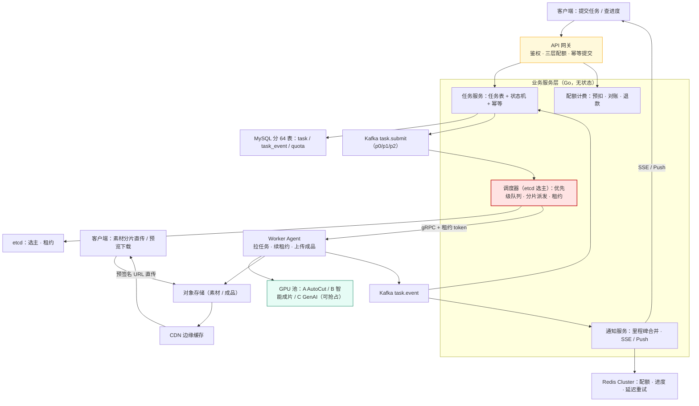
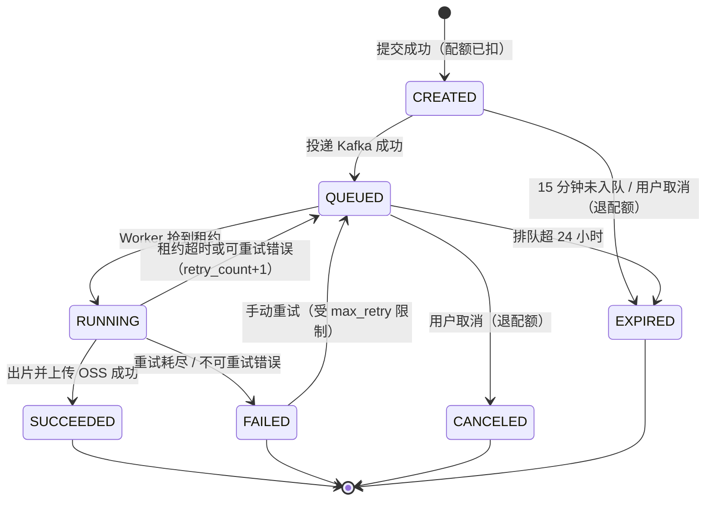
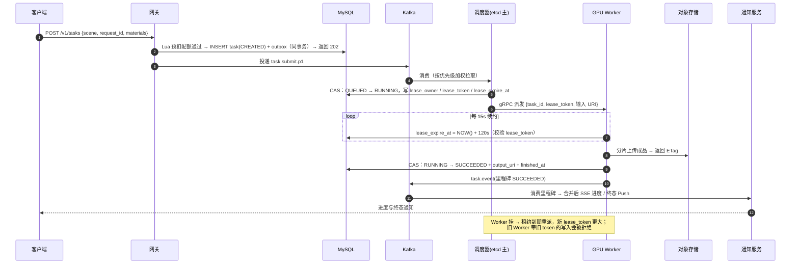
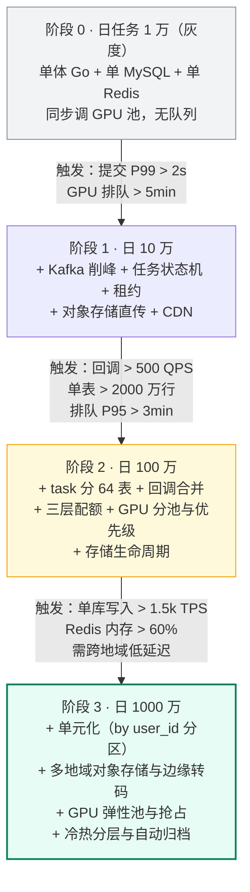

# 15 · 案例：AI 剪辑任务平台架构（0 → 千万级任务）

> 属于「架构师修炼」· 综合实战 · 案例一
> 上一篇：[14 备份恢复与故障复盘](./14-备份恢复与故障复盘)　下一篇：[16 案例：Feed 与社区互动架构](./16-案例-Feed与社区互动架构)

> **这篇解决什么问题**：你会背 Kafka 削峰、Redis 限流、分库分表，但拿到「设计一个 AI 剪辑任务平台」就无从下手——尤其当算完量发现 **QPS 只有几百、却要烧掉千万级月成本**时，套路全部失效。这一篇按[00 篇五步法](./00-架构师思维与设计方法论)走完全程：**任务状态机 + 优先级队列 + GPU 租约调度 + 三层配额 + 回调合并 + 存储生命周期**，每步给数字、给 DDL、给故障边界。

---

## 一、第 ① 步 需求澄清：模拟一场需求评审

> **你**：对外提供哪些任务？
> **产品**：一键成片（AutoCut）、智能成片、GenAI 特效。上传素材 → 提交任务 → 异步出片 → 预览/下载/发布。
> **你**：一致性呢？状态错了、积分扣错了会怎样？
> **产品**：状态必须准，用户看得见；**配额绝对不能超扣**，那是钱。
> **你**：那是 **P0 资金级（配额）+ P1 关键业务（状态）**。延迟和读写比呢？
> **产品**：提交 1 秒内响应，出片分钟级；读远多于写。
> **你**：流量形态？成本上谁最贵？团队几人？
> **产品**：平时平稳，节日模板会让提交涨 5~10 倍、集中一两小时；GPU 最贵，带宽存储也贵；后端 3 人。

| 澄清项 | 结论 | 对架构的强制约束 |
| --- | --- | --- |
| 功能边界 | 三类剪辑任务，异步出片 | 任务类型是**调度维度**：不同模型走不同 GPU 池 |
| 一致性：任务状态 | 必须准确，可取消、可重试 | 状态机 + DB 为事实源 + 非法迁移拒绝 |
| 一致性：配额/积分 | **强一致，禁止超扣** | DB 唯一约束兜底 + Redis 原子预扣 + 每日对账 |
| 延迟 | 提交 P99 < 1s；出片分钟级，允许排队 | 提交只做「落库 + 入队」即返 202 |
| 读写比 | 约 10:1 | 元数据 MySQL 够用，**不需要分库分表** |
| 流量形态 | 活动期 5~10 倍尖峰 | Kafka 削峰 + 用户级配额 + 排队 SLO |
| 成本 | **GPU ≫ 带宽 > 存储** | 成本是第一约束：优先级、生命周期、转码分级 |
| 团队 | 3 人 | 不引入自研中间件，能用托管就用托管 |

> 加分句：「这个系统的**元数据 QPS 很低**，我怀疑瓶颈不在数据库，而在 GPU 排队和存储成本——让我先算一下再定架构。」

---

## 二、第 ② 步 量级估算：把「很大」算成数字

直接复用 [00 篇 3.3 节口径](./00-架构师思维与设计方法论)：日活 100 万、人均 3 次任务、单任务 2 KB 记录 + 100 MB 成品、人均读 10 次、峰值系数 3、单卡 60 s/条、卡时 6 元。

```text
① 提交：100w × 3 / 86400 × 3 ≈ 104 QPS；列表：100w × 10 / 86400 × 3 ≈ 347 QPS
   → 元数据总峰值不到 500 QPS，MySQL 单机（1k~5k QPS）绰绰有余。
     "分库分表"在这里是纯负债；真到 3000 万行再加归档/分表。
② 回调：每任务约 20 次推送 → 104 × 20 ≈ 2,000 QPS。关键不是"扛住"而是
   "根本没这么多写"：合并降频后压到 ~10 QPS（见 4.7）。
③ 存储：300w × 100 MB ≈ 300 TB/天 → 30 天留存 9 PB。视频绝不进 DB。
④ GPU：300w × 60s ≈ 2,083 卡·天 = 5 万卡时/天。按 70% 利用率常驻约 3,000 卡；
   峰值系数 3 → 峰值需 ~9,000 卡。要"零排队"就得买 3 倍机器，架构师的选择
   是不追求零排队，把 SLO 定成「P95 排队 < 3 分钟 + 高优任务插队」。
⑤ 成本（日）：GPU 5 万卡时 × 6 元 ≈ 30 万元；存储 300TB × 0.12 元/GB/月
   留存 30 天 ≈ 3.7 万元/天；出流量 600 TB × 0.2 元/GB ≈ 12 万元
   → 日成本 ≈ 45.7 万元，单条约 0.15 元：GPU 65% / 带宽 26% / 存储 8%
```

> **量纲更正**：00 篇写作「2,083 卡时」，严格算下来是 2,083 **卡·天**（= 5 万卡时/天）。面试里说「三千卡常驻、峰值九千卡」比说「2,083 卡时」更难被追问倒。

| 排序 | 瓶颈 | 量化证据 | 对应手段 |
| --- | --- | --- | --- |
| **1** | **GPU 排队与利用率** | 峰值需 9,000 卡，预算只够 3,000~5,000 | 优先级队列、分池、抢占、超时重派、排队 SLO |
| **2** | **存储与带宽成本** | 300 TB/天写、600 TB/天出，月成本千万级 | 生命周期分层、CDN 预热、转码分级 |
| **3** | **进度回调风暴** | 2,000 QPS 高频写、20 次/任务 | Kafka 削峰 + 里程碑合并 + 通知分级 |
| 假瓶颈 | 元数据 QPS | 仅 ~450 QPS | **什么都不用做**，分表延后 |

> 新手看到「AI + 视频」就去设计分库分表和多级缓存；架构师看到的是**排队、成本、事件风暴**。**估算的意义就是把你从套路里拽出来。**

---

## 三、第 ③ 步 找瓶颈：按自检清单过一遍

| 顺序 | 自检问题 | 答案 | 判定 |
| --- | --- | --- | --- |
| 1 | 有单点吗？ | 调度器、GPU 池、MySQL 主库 | ⚠️ **是**：调度器要选主，GPU 池要分池冗余 |
| 2 | 单机 CPU/连接数、数据库到顶了吗？ | 单实例轻松扛 3w QPS；含回调写入 ~500 TPS（上限 2k） | 否 |
| 4 | 有热点吗？ | **有**：活动期单个爆款模板被 10 万人同时用 | ⚠️ **是**：模型级配额 + 池级隔离 |
| 5 | 下游扛得住吗？ | **GPU 是硬约束资源，不是弹性资源** | ⚠️ **是**：排队 + 背压 + 快速失败 |
| 6 | 数据量到单机上限了吗？ | 任务表 3,000 万行/年，MetaDB < 1 TB | 否（归档即可） |

**一句话**：第一个瓶颈是 **GPU 这一硬约束资源的排队与公平性**，第二个是**存储与带宽成本**。后面所有设计都在回答两件事——**卡怎么分得公平、成本怎么降**。

---

## 四、第 ④ 步 架构设计与选型

### 4.1 整体架构



### 4.2 接入层：四道闸门决定后端生死

网关只做四件事：**鉴权**（JWT + 设备指纹 + 风控标记）、**三层配额限流**（用户/租户/模型级令牌桶 + 周期配额）、**幂等提交**（`request_id` 落唯一索引，重复请求回读原结果）、**素材校验**（存在性、时长、分辨率上限）。放网关的理由只有一个：**在入口快速失败，绝不占 GPU 排队位**——让用户等 5 分钟才被告知没积分，是队列无效堆积与体验事故的共同根源。

### 4.3 任务编排：状态机 + 优先级队列 + 分片调度



**迁移白名单**（代码里就是这张表，非法迁移显式拒绝）：

| from \ to | QUEUED | RUNNING | SUCCEEDED | FAILED | CANCELED | EXPIRED |
| --- | --- | --- | --- | --- | --- | --- |
| **CREATED** | ✅ 入队 | ❌ | ❌ | ❌ | ✅ 退配额 | ✅ 超时 |
| **QUEUED** | ❌ | ✅ 抢租约 | ❌ | ❌ | ✅ 退配额 | ✅ 排队超时 |
| **RUNNING** | ✅ 租约超时重派 | ❌ | ✅ 上传成功 | ✅ 重试耗尽 | ✅ 尽力终止 | ❌ |
| **SUCCEEDED / CANCELED / EXPIRED** | ❌ | ❌ | ❌ | ❌ | ❌ | ❌ |
| **FAILED** | ✅ 手动重试 | ❌ | ❌ | ❌ | ❌ | ❌ |

| Topic | 分区键 | 分区数 | 说明 |
| --- | --- | --- | --- |
| `task.submit.p0`（高优：会员/付费） | `task_id` | 24 | 独立消费者组，优先被吃掉 |
| `task.submit.p1`（普通） | `task_id` | 64 | 主力。`task_id` 含 user_id 后 6 位 → 与 DB 分片对齐 |
| `task.submit.p2`（低优：批量/免费额度） | `task_id` | 16 | 拥塞时可暂停消费 |
| `task.event` | `task_id` | 64 | **必须按 task_id 保序**，进度不能乱序 |
| `task.dlq` | `task_id` | 8 | 死信，自动巡检 + 人工 |

> **为什么分区键选 `task_id` 而不是 `user_id`？** 选 `user_id` 会让大客户独占分区；而同一用户的任务本身不要求顺序。`task_id` 哈希更均匀，**保序粒度只需到单任务级别**。

### 4.4 队列选型：四种方案的真实取舍

| 维度 | A Kafka | B Redis Stream | C 自研 Redis 队列 | D 云厂商队列 |
| --- | --- | --- | --- | --- |
| 吞吐 | **50w+ msg/s** | 数万~十几万 | 十万级 | 万级（受 API 限流） |
| 持久化 | 磁盘 + 多副本，可回溯 | 内存 + AOF，**主从切换可能丢** | 内存，**丢消息是常态** | 托管持久化 |
| 延迟 | 毫秒级（攒批） | 亚毫秒 | 亚毫秒 | 十毫秒~百毫秒 |
| 顺序 | 分区内有序 | 单 stream 有序 | ZSet 按 score 有序 | 标准队列**不保证** |
| 延迟消息/优先级 | ❌ 需多 topic 模拟 | ❌ 需自己实现 | ✅ ZSet score 天然支持 | ✅ 延迟队列 |
| 回溯重放 / 运维成本 | ✅ 按 offset；中（有托管） | 有限；**低** | ❌；低但**故障自己扛** | ❌；**极低** |
| 适用边界 | **提交与事件流主力** | 轻量内部队列 | 延迟重试小队列 | 跨云 / 低运维 |

**结论**：① **主链路选 Kafka**——任务是"用户已扣积分"的资产，需要多副本、按 offset 重放、加分区扩消费，这三点 Redis 系都给不了（[积压预案](/后端技术栈强化/03-kafka/可靠性与积压)）；② **延迟重试与定时扫描用 Redis ZSet**——「15 分钟未入队」「租约过期」都是**按时间点捞**，`score = 触发时间戳` 比 Kafka 延迟 topic 简单得多；③ **不用云厂商标准队列做主链路**——优先级、保序、回溯三者不能同时满足。**代价：多一个 Kafka 集群 = 多一个故障点 + 一份必须背的积压预案。**

关键参数：生产端 `acks=all + enable.idempotence=true + compression=zstd`，broker `min.insync.replicas=2 + unclean.leader.election.enable=false`。取舍是**"已知会丢，但绝不静默丢"**：副本不足时生产者直接报错 → 写本地消息表重试，而不是悄悄丢任务。

### 4.5 GPU 集群：分池、优先级、抢占与重试

| 池 | 硬件 | 场景 | 单任务耗时 | 单卡并发 | 抢占 | 优先级 |
| --- | --- | --- | --- | --- | --- | --- |
| **A** | L20 / 4090 | AutoCut（解析+拼接+转码） | 15~25 s | 4~8 | 不抢占 | p0~p2 |
| **B** | A100 40G | 智能成片（模板+特效） | 45~90 s | 2 | 不抢占 | p0~p1 |
| **C** | H20 / A100 80G | GenAI 特效（扩散模型） | 120~300 s | 1 | **可被高优抢占** | p0~p2 |
| **C-spot** | 弹性竞价实例 | 低优批量 / 回填 | 同 C | 1 | **随时回收** | p2 |

**调度三原则**：① **优先级 = 用户等级权重 − 等待时长/10**，等待越久权重越高，**防饿死**；② **池级配额而非全局配额**——GenAI 池堵了不影响 AutoCut，**拥塞必须隔离**；③ **抢占只对可重启任务做**——不支持 checkpoint 的任务被抢占，已烧卡时全白费。

| 错误类型 | 例子 | 策略 | 退避 |
| --- | --- | --- | --- |
| 可重试·瞬时/资源 | GPU OOM、网络抖动、OSS 5xx、池满 | 自动重试 `retry_count++`；池满则**换池或降规格重试一次** | 10s → 30s → 120s（指数+抖动） |
| 不可重试·输入/审核 | 素材损坏、时长超限、内容安全命中 | **直接 FAILED + 退配额** | 不重试 |
| 重试耗尽 | `retry_count >= 2` | 进 `task.dlq` + 告警 + 自动退款 | —— |

**四个监控指标**：排队时长 P95（p0 < 30s / p1 < 3min）、GPU 利用率（目标 65%~80%，< 55% 空转、> 90% 无缓冲）、任务失败率（< 1%，超标熔断该池切备用池）、单任务卡时（基线 ±10%）。

### 4.6 存储分层

| 数据 | 存储 | 保留策略 | 成本相对值 | 一致性要求 |
| --- | --- | --- | --- | --- |
| 原始素材 | 对象存储（标准） | 30 天未引用转低频 | 1.0 | 最终一致，ETag 校验 |
| 成品视频（热） | 对象存储 + CDN | 7 天内热存 | 1.0 + CDN | 写入成功才置 SUCCEEDED |
| 成品视频（温 / 冷） | 低频 → 归档 / 删除 | 7~30 天 → 30 天后删 | 0.4 → 0.1 | **删除前写墓碑，防 Feed 裂图** |
| 任务元数据 | MySQL 分 64 表 | 热 3 个月后归档 OLAP | —— | **强一致，事实源** |
| 进度事件 | Kafka + 时序聚合 | Kafka 7 天 / 指标 90 天 | —— | 事件可丢（有里程碑兜底） |
| 配额与流水 | MySQL 单表 | 永久 | —— | **P0 强一致 + 每日对账** |

> **为什么分表而不是分库？** 峰值写入含回调约 500 TPS、年增 3,000 万行，**按 user_id 取模 64 分表就够**；分库会引入跨库查询与分布式事务。`task_id` 内嵌 user_id 分片位（后 6 位），使**按 task_id 查询也能一次定位表**。

### 4.7 回调与通知：把 2,000 QPS 压到 10 QPS

| 方案 | 实时性 | 服务端成本 | 客户端成本 | 弱网/后台 | 结论 |
| --- | --- | --- | --- | --- | --- |
| 客户端长轮询 | 3~10 s | 连接占用高 | 耗电耗流量 | 好 | **降级兜底** |
| WebSocket | 亚秒级 | 需独立接入层 + 心跳 | 需框架支持 | 好 | 双向需求才用，此处**不必要** |
| **SSE** | 秒级 | HTTP 长连接，网关友好 | 简单，自动重连 | 好（`Last-Event-ID` 续传） | ✅ **进度下发首选** |
| **Push（APNs/FCM）** | 秒~分钟 | 便宜（无长连接） | 无 | **App 被杀也能收** | ✅ **终态通知必用** |

```text
合并降频（本案例最值钱的设计）：
原始：20 次进度回调/任务 × 104 QPS = 2,000 QPS 写 DB + 2,000 QPS 下发
改造：① Worker 只上报里程碑（10%/30%/60%/90%/100%）→ 5 次
      ② 中间进度只写 Redis（SETEX 10s，天然合并），不写 DB
      ③ 通知服务按 task_id 做 1s 窗口合并，同一用户多任务合并为一次下发
      ④ 只有终态才写 DB + 发 Push
结果：DB 写入 2,000 → ~10 QPS（降 200 倍）；下发 2,000 → ~300 QPS
代价：进度不是逐帧（用户可接受）；Redis 丢进度会"跳变"（终态由 DB 保证）
```

### 4.8 关键表 DDL

```sql
CREATE TABLE `task_00` (  -- 按 user_id 取模 64 分表，task_id 末 6 位 = user_id 分片位
  `id`              BIGINT UNSIGNED NOT NULL AUTO_INCREMENT,
  `task_id`         CHAR(32)        NOT NULL COMMENT '对外任务号',
  `user_id`         BIGINT UNSIGNED NOT NULL,
  `request_id`      VARCHAR(64)     NOT NULL COMMENT '客户端幂等键',
  `scene`           VARCHAR(32)     NOT NULL COMMENT 'autocut/smart/genai',
  `priority`        TINYINT         NOT NULL DEFAULT 5 COMMENT '0 最高，9 最低',
  `status`          TINYINT         NOT NULL DEFAULT 0 COMMENT '见状态机常量',
  `retry_count`     TINYINT         NOT NULL DEFAULT 0,
  `lease_owner`     VARCHAR(64)     NOT NULL DEFAULT '' COMMENT '持有租约的 Worker',
  `lease_token`     BIGINT UNSIGNED NOT NULL DEFAULT 0 COMMENT 'fencing token，单调递增',
  `lease_expire_at` DATETIME(3)     NULL,
  `input_uri`       VARCHAR(512)    NOT NULL,
  `output_uri`      VARCHAR(512)    NOT NULL DEFAULT '',
  `quota_cost`      INT             NOT NULL DEFAULT 0 COMMENT '消耗积分，退款依据',
  `created_at`      DATETIME(3)     NOT NULL DEFAULT CURRENT_TIMESTAMP(3),
  `finished_at`     DATETIME(3)     NULL,
  PRIMARY KEY (`id`), UNIQUE KEY `uk_user_request` (`user_id`, `request_id`),  -- 幂等的事实保证
  UNIQUE KEY `uk_task_id` (`task_id`), KEY `idx_user_status` (`user_id`, `status`, `id`),
  KEY `idx_lease_expire` (`status`, `lease_expire_at`), KEY `idx_finished_gc` (`status`, `finished_at`)
) ENGINE=InnoDB DEFAULT CHARSET=utf8mb4 COMMENT='任务主表（分 64 表）';

CREATE TABLE `task_event_00` (  -- 只存里程碑与状态变更；按 task_id 哈希分 32 表，TTL 7 天
  `id`         BIGINT UNSIGNED NOT NULL AUTO_INCREMENT,
  `task_id`    CHAR(32)        NOT NULL,
  `seq`        INT UNSIGNED    NOT NULL COMMENT '同一任务内单调递增',
  `event_type` TINYINT         NOT NULL COMMENT '10 进度 20 里程碑 30 状态变更 40 错误 50 退款',
  `payload`    JSON            NOT NULL,
  `created_at` DATETIME(3)     NOT NULL DEFAULT CURRENT_TIMESTAMP(3),
  PRIMARY KEY (`id`), UNIQUE KEY `uk_task_seq` (`task_id`, `seq`)  -- 事件幂等，重复消费不产生脏数据
) ENGINE=InnoDB DEFAULT CHARSET=utf8mb4 COMMENT='任务事件（分 32 表，保留 7 天）';

CREATE TABLE `quota_account` (  -- 三层配额（user / tenant / model）× 周期
  `id`           BIGINT UNSIGNED NOT NULL AUTO_INCREMENT,
  `subject_type` TINYINT         NOT NULL COMMENT '1 用户 2 租户 3 模型 4 全局',
  `subject_id`   BIGINT UNSIGNED NOT NULL,
  `scene`        VARCHAR(32)     NOT NULL DEFAULT '' COMMENT '按场景/模型细分',
  `period`       CHAR(10)        NOT NULL COMMENT '2026-03 / 20260318，按周期滚动',
  `limit_value`  BIGINT          NOT NULL DEFAULT 0 COMMENT '0 表示不限',
  `used_value`   BIGINT          NOT NULL DEFAULT 0,
  `reserved`     BIGINT          NOT NULL DEFAULT 0 COMMENT '已扣未完成（在跑任务占用）',
  PRIMARY KEY (`id`),
  UNIQUE KEY `uk_subject_scene_period` (`subject_type`, `subject_id`, `scene`, `period`)
) ENGINE=InnoDB DEFAULT CHARSET=utf8mb4 COMMENT='配额账户（量小，不分表）';
```

---

## 五、关键机制实现

### 5.1 幂等提交与状态机 CAS

```go
// Submit：配额原子预扣 → 落库（唯一索引兜底）→ 异步入队
func (s *TaskService) Submit(ctx context.Context, req *SubmitReq) (*SubmitResp, error) {
	// 1) 三层配额原子预扣（Redis Lua：user / tenant / model 任一不足即整体不改）
	keys := []string{QKeyUser(req.UserID, req.Scene), QKeyTenant(req.TenantID, req.Scene), QKeyModel(req.Model)}
	ok, err := s.quota.Reserve(ctx, keys, req.Cost)
	if err != nil {
		return nil, err // Redis 不可用 → 见「故障与一致性边界」降级路径
	}
	if !ok {
		return nil, ErrQuotaExceeded // 网关转 429，不占 GPU 排队位
	}
	task := NewTask(req) // 生成 task_id（雪花 + 分片位），status = CREATED
	err = s.tx(ctx, func(tx *sqlx.Tx) error {
		if err := s.repo.InsertTask(tx, task); err != nil {
			if IsDuplicateKey(err) { // 命中 uk_user_request
				return ErrDuplicateRequest
			}
			return err
		}
		return s.repo.InsertOutbox(tx, "task.submit", task.TaskID, task.Payload())
	})
	if errors.Is(err, ErrDuplicateRequest) { // 重复提交 → 回读并返回原任务
		old, err := s.repo.GetByRequestID(ctx, req.UserID, req.RequestID)
		if err != nil {
			return nil, err
		}
		return &SubmitResp{TaskID: old.TaskID, Status: old.Status, Deduplicated: true}, nil
	}
	if err != nil {
		_ = s.quota.Release(ctx, keys, req.Cost) // 落库失败必须退配额，否则用户白扣
		return nil, err
	}
	s.outbox.Poke(task.TaskID) // 3) 异步投递；投递成功才 CREATED → QUEUED
	return &SubmitResp{TaskID: task.TaskID, Status: StatusCreated}, nil
}

// Transition：带前置状态的 CAS 迁移，并发下至多一个写成功，非法迁移直接拒绝
func (r *TaskRepo) Transition(ctx context.Context, taskID string, from, to Status) error {
	if !allowedTransition(from, to) { // 状态机白名单，见 4.3
		return ErrIllegalTransition
	}
	res, err := r.db.ExecContext(ctx,
		`UPDATE task_00 SET status=?, updated_at=NOW(3) WHERE task_id=? AND status=?`, to, taskID, from)
	if err != nil {
		return err
	}
	if n, _ := res.RowsAffected(); n != 1 {
		return ErrTransitionConflict // 已被别的 Worker 推进过 → 幂等，不视为错误
	}
	return nil
}
```

### 5.2 任务派发与租约：绝不重复出片

单机「抢锁」在分布式下不够：**抢到锁的 Worker 可能已经在 GC 停顿或网络分区中变成僵尸**。方案是 **DB CAS 抢租约 + Lease 续约 + fencing token**，细节见 [10 etcd 与 Raft 选主租约落地](./10-etcd与Raft选主租约落地)。



**租约三要素**：① **到期时间** `lease_expire_at = NOW(3) + 120s` 且每 15s 续约——否则 Worker 挂掉后任务永远卡在 RUNNING；② **fencing token** `lease_token` 单调递增（DB 自增 / etcd revision）——否则僵尸 Worker 恢复后写结果，**同一任务出两个片**；③ **续约失败即自杀**——否则僵尸继续烧 GPU（成本泄漏 + 覆盖正确结果）。

```sql
-- 调度器每 10s 扫一次，走 idx_lease_expire，limit 500 避免长事务
SELECT task_id, lease_token, retry_count FROM task_00
WHERE status = 2 AND lease_expire_at < NOW(3) ORDER BY lease_expire_at LIMIT 500;
```

### 5.3 三层配额与限流：防刷、防超扣、防羊毛

| 层级 | 维度 | 粒度 | 存储 | 超限行为 |
| --- | --- | --- | --- | --- |
| **L1 用户级** | `uid + scene + 周期` | 每分钟 5 次 / 每天 20 次 / 每月 300 积分 | Redis + DB 账户 | 429 + 明确提示剩余额度与重置时间 |
| **L2 租户级** | `tenant + scene` | 按合同总额 | Redis + DB | 429 + 通知租户管理员 |
| **L3 模型/池级** | `model + pool` | 每秒并发任务上限 | Redis + 网关令牌桶 | **排队或降级到低优队列**（不报错） |
| **L4 风控级** | 设备指纹 + IP + 行为特征 | 异常速率阈值 | 风控服务 | 加入灰名单，需验证码或人工审核 |

Redis Lua 一次调用完成多层校验（逐层 `used + reserved + cost <= limit`，全通过才逐层 `INCRBY`，任一不过则不改任何值），**避免"扣一半"**。这里 Redis 只做**预占 + 快速失败**，DB `quota_account` 是事实源、靠**每 5 分钟对账**收敛。架构上**宁可少扣不可多扣**——少扣是营收损失，超扣是投诉与退款事故。

### 5.4 大文件上传：分片 + 断点续传 + 秒传

- **预签名直传**：服务端只签 URL，素材不经业务服务 → 省掉 300 TB/天 的服务器带宽。
- **分片上传 + 断点续传**：5 MB/片、Multipart Upload 最多 10000 片；客户端上报已完成 part，服务端 `ListParts` 比对 → 弱网可重传单片，1 GB 素材成功率 70% → 99%。
- **秒传（hash 去重）**：`sha256(内容) → object_uri` 映射，命中直接复用 → 同模板/同素材省 10%~20% 存储与上传流量。
- **上传完成事件**：OSS 事件 → Kafka → 校验 size / ETag，防止"声明成功但对象不存在"。

---

## 六、成本控制：架构师的另一半工作

成本不是运维的事，是**架构决策的直接结果**。日成本约 45.7 万元，按 ROI 排序逐项压：

| 杠杆 | 具体动作 | 预期收益 | 代价 |
| --- | --- | --- | --- |
| **GPU 利用率** | 提升单卡并发（batch / 多实例）、按池混跑填空隙 | 55% → 75%，等效省 ~26% GPU 成本 | 调度复杂度上升，需监控 OOM |
| **规格分级转码** | 预览 720p / 2 Mbps，仅"发布/下载"才转 1080p | CDN 出流量降 40%~60% | 画质感知差，需产品确认 |
| **结果生命周期 + CDN 预热** | 7 天热 → 30 天低频 → 到期删除；发布/分享链接与热点模板预取到边缘 | 存储降 60%~80%；回源降 50%，首帧时间降 60% | 需明确留存政策（删除不可逆）；预热错的流量是浪费 |
| **抢占式 GPU + 合并回调 + 不追求零排队** | 低优跑竞价实例；见 4.7 的里程碑合并；SLO 定成 P95 < 3 min | 低优单元成本降 50%~70%；DB/Kafka/通知降 200 倍；卡数 9,000 → 3,000（**成本 ÷3**） | 任务必须可中断；进度粒度变粗；用户等待需产品接受 |

> **一句话**：「单条成本每降 1 分钱，一个月就是 900 万元。**所以我把成本指标当成和 P99 一样的 SLO 来管**：单条视频成本、GPU 利用率、CDN 命中率、存储冷热比，四个指标每天看。」

---

## 七、第 ⑤ 步 演进路径与兜底



| 阶段 | 日任务 | 峰值提交 | 峰值回调 | 新增组件与触发指标 | 单日成本量级 |
| --- | --- | --- | --- | --- | --- |
| **0** | 1 万 | ~1 QPS | ~20 QPS | 无（起点） | ~0.15 万元 |
| **1** | 10 万 | ~10 QPS | 200 → 合并后 1 | Kafka、对象存储、CDN（提交 P99 > 2s、排队 > 5min） | ~1.5 万元 |
| **2** | 100 万 | ~104 QPS | 2,000 → 合并后 10 | 分表、调度器 + etcd、通知服务（回调 > 500 QPS、单表 > 2,000 万行） | **~45.7 万元** |
| **3** | 1,000 万 | ~1,040 QPS | 合并后 ~100 QPS | 单元化网关、多地域对象存储、GPU 弹性池（单库写入 > 1.5k TPS、跨地域延迟 > 100ms） | ~450 万元 |

**每步都带四件套**（[00 篇 6.1](./00-架构师思维与设计方法论)），以阶段 1 → 2 为例：

```text
① 双跑：新调度器只接 5% 流量，旧同步链路继续，观察 2 周
② 校验：比对两种链路的成功率、卡时、排队时长分布
③ 切流：1% → 10% → 50% → 100%，每档观察 24h，开关在配置中心
④ 回滚：任意档异常即把任务路由权重切回旧链路（新链路已入队任务由其消化完）
⑤ 兜底：outbox 扫表补发保证「落库未投递」不丢；每日对账「DB 中 SUCCEEDED 任务数」vs「OSS 中成品数」，差异重派或退款
```

---

## 故障与一致性边界

| 挂的组件 | 现象 | 处理 | 一致性边界 |
| --- | --- | --- | --- |
| **GPU 节点 / Worker 挂** | 任务卡在 RUNNING，进度停更 | 租约到期后调度器 CAS 重派（新 `lease_token` 更大）；旧 Worker 带旧 token 的写入被拒 | **不重复出片**（fencing 保证只有最新租约的结果能落库）；已烧卡时白费是成本损失，不是正确性损失 |
| **调度器（etcd 主）挂 / etcd 不可用** | 新任务不再派发，队列积压，有双主风险 | etcd Lease 到期后 10s 内选新主；新主从 DB 重建内存队列（`status=QUEUED ORDER BY priority, id`）。etcd 全挂则**自降级为只读停止派发** | 派发**停顿 10~30s**；已 RUNNING 不影响（租约在 Worker 手上）。**宁可停派，不可双派**；重复派发由 DB CAS + fencing 挡住 |
| **Kafka 积压** | 排队 P95 从 2min 涨到 20min | ① 扩消费者/分区 ② 暂停 p2 消费（低优牺牲）③ 仍不够 → **网关 429 + 提示预计恢复时间** | **宁可明确拒绝，不可静默堆积**。已提交任务一定在队列里（`acks=all` + outbox），不会丢；被拒用户退配额或稍后重试 |
| **对象存储故障** | 上传失败、成品取不到 | 上传指数退避 + 换区域端点；**生成成功但上传失败 → 任务 FAILED，成品在 Worker 本地暂存 1h 后重传**，超时释放 | **"跑完了但没存住"等于没跑**，必须退配额或重跑；CDN 已缓存的成品继续服务（读到旧数据不影响正确性） |
| **MySQL 主库切换** | 任务状态短暂不可写（秒~30s） | ① 接入层熔断写，返回 503 + 可重试标记 ② 客户端带同一 `request_id` 重试 ③ 半同步 `rpl_semi_sync_master_wait_for_slave_count=1` 保证已提交事务不丢 | 窗口内**写不可用但读可继续**；唯一索引 + 幂等重试保证不重复建任务、不重复扣配额 |
| **Redis 配额丢 / 重复扣配额** | 计数归零有**超扣**风险；用户投诉"提交一次扣两次" | 熔断预扣 → **降级为 DB 直接扣**（`UPDATE ... WHERE used + cost <= limit`，扛量降到 ~500 TPS 但仍能承接 104 QPS 提交），Redis 恢复后从 DB 重建；重复扣由 `uk_user_request` + 配额流水唯一键（`task_id + 变更类型`）拦截并立即退款 | 账户是 P0：**DB `quota_account` 是唯一事实源**，Redis 丢了最坏是"少扣"，每日对账补差额，**不允许多扣**；幂等键必须**在网关生成并透传**，**退款也必须幂等** |
| **通知服务挂 / 回调风暴** | 用户看不到进度（任务仍在跑）；下发 QPS 飙到 2,000 把连接打满 | SSE 自动重连 + **终态通知补偿任务**扫「SUCCEEDED 且未通知」补推；按 `task_id` 做 1s 窗口合并，连接超阈值降级为 30s 长轮询 | 通知是**尽力而为**，不是一致性环节：事实源是 DB + OSS，用户重进 App 拉列表即修正。进度属 P3 展示级，**可降频可丢** |
| **内容安全审核超时** | 任务卡住或成品不可下载 | 审核走独立异步链路，超时按"待审"处理（只给预览不给下载）；不通过 → FAILED + 退配额 + 记录原因 | 审核不通过属**不可重试**错误；审核慢**不能阻塞 GPU 池**，否则整池被"待审"任务占死 |

> **贯穿全局的原则**：**"已扣配额但未出片"和"已出片但未通知"是两类完全不同的问题**——前者是资金一致性（必须对账 + 退款），后者是体验问题（补推即可）。**架构师的第一反应是给故障分类，而不是给故障找方案。**

---

## 面试追问链
1. **任务表为什么用 MySQL 而不是 Redis？**
   → ① 任务是钱换来的资产，不能因为 Redis 主从异步丢写就消失；② 元数据 QPS 仅 ~450，Redis 的性能优势在这里是浪费；③ 需要状态机 CAS、唯一索引幂等、范围分页——Redis 都要自己造且更难保证正确。Redis 只做**配额预扣、进度缓存、延迟重试 ZSet**，全是"丢了能重建"的角色。
2. **进度回调 2,000 QPS，为什么不直接写 DB？**
   → 先承认"能扛"（500 TPS 写入 < 2k 上限），再说**不该扛**：① 2,000 QPS 中 95% 是用户不需要看的中间态；② 每次写都要更新 `task` 行 + 写事件表，放大锁与 binlog，伤真正重要的状态迁移；③ 合并成 5 个里程碑后 DB 写入降到 ~10 QPS，**成本与风险同降 200 倍**。
3. **GPU 排队怎么保证公平？**
   → 三层：① **优先级公式** `用户等级权重 − 等待时长/10`，等待越久权重越高，**防饿死**；② **池隔离**——GenAI 池堵了不影响 AutoCut；③ **配额前置**——超配额在网关 429，不进队列。再把排队时长 SLO（P95 < 3min）做成可观测指标：**公平性是数字，不是感觉**。
4. **任务超时怎么处理？Worker 假死怎么办？**
   → 分三种：① **租约超时**（心跳断）→ 调度器 CAS 重派，fencing token 让旧 Worker 的写入被拒；② **执行超时**（真跑了 10 分钟仍未完）→ Worker 自主终止并上报 FAILED（可重试）；③ **假死**（进程卡在 GC/IO 但连接还在）→ 靠"续约必须成功"判定，续约失败即自杀。**核心原则：任何超时都不能让任务永久卡在 RUNNING。**
5. **生成成功但用户没收到通知，怎么办？**
   → 这是体验问题不是一致性问题，但要闭环：① 状态迁移**先落 DB 再发通知**（通知失败不回滚状态）；② 独立**通知补偿任务**扫「SUCCEEDED 且 `notified_at IS NULL`」补推（限次 + 告警）；③ 客户端进 App 拉列表天然修正。**"通知"永远不是事实源，"DB + OSS"才是。**
6. **怎么防止用户刷任务占满 GPU？**
   → 四层：① **网关三层配额** + 秒级令牌桶 + 周期积分，超限 429；② **风控**（设备指纹、行为速率、异常相似素材聚类）自动降级到 p2 队列；③ **池级并发硬上限**——任何用户都不可能占满整池；④ **成本归因**——按 uid 出成本报表，异常用户在计费侧先冻结后申诉。要点是**"在入口拒绝"远比"在队列里排队"便宜**。
7. **成本怎么降？给你一周，先动哪三个？**
   → 按 ROI 排序：① **CDN 出流量**（占 26%，预览降 720p 立竿见影，出流量降 40%~60%）；② **GPU 利用率**（占 65%，提并发 + 混跑，55% → 75% 等效省 1/4）；③ **结果生命周期**（7 天热 → 30 天删，存储降 60%+）。**不动"任务元数据"，因为它占比不到 1%。** 成本优化永远先看占比最大的那一项。
8. **重做一次，哪些决定会变？**
   → ① 一开始就把**成本纳入 SLO**（否则到阶段 2 才发现单价 0.15 元，回旋空间小）；② 第一天就做**回调合并**（后加会让客户端体验回退，需要灰度）；③ **租约 + fencing token 一开始就上**——"单机 mutex + DB 状态"在阶段 0 够用，但它带来的重复出片排查成本远高于提前实现的成本。

---

## 自测清单

- [ ] 能不看文档说出三个真瓶颈，并给出量化证据（2,083 卡·天 / 300 TB/天 / 2,000 QPS 回调）
- [ ] 能默画任务状态机，并说出**四类非法迁移**分别为什么必须拒绝
- [ ] 能把「20 次回调/任务」合并到 5 个里程碑，并说清 DB 写入 2,000 → 10 QPS 的每一步
- [ ] 能说出三层配额的维度，并解释「**宁可少扣不可多扣**」为什么是架构原则
- [ ] 能画出日 1 万 → 1,000 万的演进路径，每一步带触发指标 + 迁移 + 回滚 + 对账

> **下一篇**：[16 案例：Feed 与社区互动架构](./16-案例-Feed与社区互动架构) —— 换成读放大 100 倍的场景，看「推 vs 拉」如何反转读写模型。
