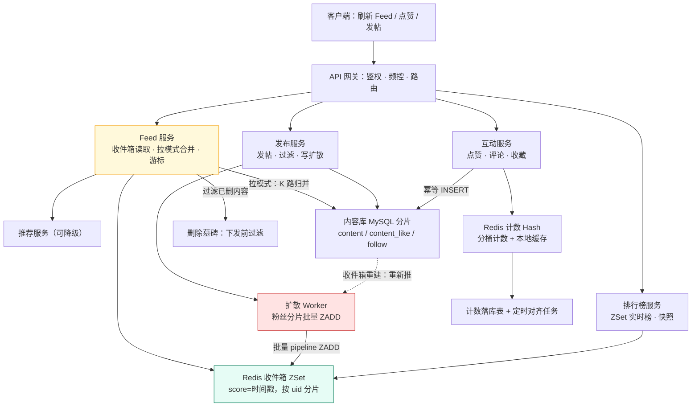
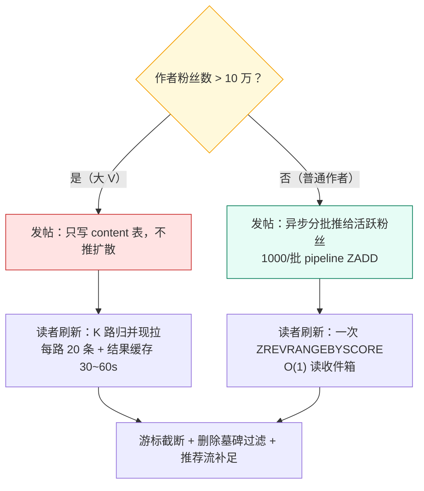
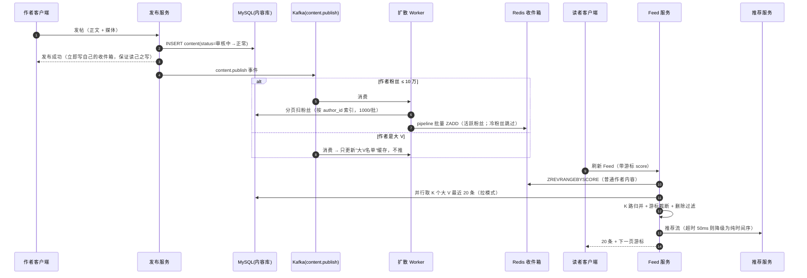
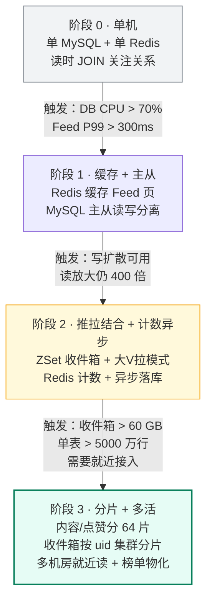

# 16 · 案例：Feed 与社区互动架构（500 万日活下的读写模型反转）

> 属于「架构师修炼」· 综合实战 · 案例二
> 上一篇：[15 案例：AI 剪辑任务平台架构](./15-案例-AI剪辑任务平台架构)　下一篇：[17 面试：白板架构设计与追问链](./17-面试-白板架构设计与追问链)

> **这篇解决什么问题**：Feed 是**唯一一类「QPS 不算高、但读放大上百倍」**的系统——同一个业务的读量是写量的几千倍，于是架构的第一性问题不是"怎么扛 QPS"，而是**「读写模型往哪边反转」**：内容该在发帖时推给粉丝，还是粉丝刷新时现拉？这一篇按[00 篇五步法](./00-架构师思维与设计方法论)走完：**推拉结合阈值 + ZSet 收件箱 + 游标分页 + 计数异步化 + 收件箱重建**，并给出「大 V 怎么办、点赞 10 万怎么存、收件箱丢了怎么恢复」的标准答案。

---

## 一、第 ① 步 需求澄清

> **你**：Feed 有几种？关注流和推荐流是一回事吗？
> **产品**：三种——关注流（时间序）、推荐流（算法序）、个人主页（作者维度）。互相独立，可以合并展示。
> **你**：**一致性**要求呢？点赞数错了、Feed 里出现刚删的帖子会怎样？
> **产品**：Feed 和计数**可以最终一致**，晚几秒没关系；但**用户自己发的帖必须立刻在自己主页可见**。
> **你**：那就是 **P2 用户可见（Feed、计数，秒级收敛）+ 一条硬要求「读己之写」**，不需要强一致。
> **你**：**深分页**要支持吗？用户能翻到第 50 页吗？
> **产品**：不需要，滑动刷新为主，最多翻十几页。
> **你**：那就不做 offset 分页，**只做游标**——这条决定省掉一大堆深分页问题。**@ 大 V 有多少粉丝？**
> **产品**：头部作者上千万，普通作者几十到几百。**排行榜**要实时，热榜按小时滚。

| 澄清项 | 结论 | 对架构的强制约束 |
| --- | --- | --- |
| 数据分级 | Feed / 计数 = **P2 最终一致（秒级）** | 允许异步、允许缓存兜底、允许近似值 |
| 例外：读己之写 | 自己发帖**必须立刻可见** | 自己主页走 DB 合并，或发帖后直接写自己收件箱并返回 |
| 深分页 | 不需要（最多十几页） | **只用游标分页**，不做 offset |
| 粉丝分布 | 极端不均（几十 ~ 千万） | **必须推拉结合**，纯推或纯拉都会死 |
| 排行榜 | 实时榜 + 小时/日快照 | ZSet 实时 + 定时快照 + 差分更新 |
| 删除语义 | 删帖后 Feed 里不能再出现 | 下发时过滤 + 删除标记（墓碑） |

---

## 二、第 ② 步 量级估算：读放大系数

| 参数 | 取值 | 说明 |
| --- | --- | --- |
| 日活 DAU | 500 万 | 全球版按区域错峰 |
| 人均刷新次数 | 50 次/天 | 含下拉刷新与冷启动 |
| 每次返回条数 | 20 条 | 首页一屏 |
| 发帖率 / 人均发帖 | 10% / 1.2 条 | 约 60 万条新内容/天 |
| 点赞率 / 人均点赞 | 20% / 3 次 | 约 300 万次点赞/天 |
| 平均粉丝数 | 200（中位数 ~50） | 头部作者千万级 |

```text
① 读请求：500w × 50 / 86400 ≈ 2,894 QPS 均值；× 3（峰值系数）≈ 8.7k QPS
   读条数：日 500w × 50 × 20 = 50 亿条/天 → 均值 5.8 万条/s，峰值 ≈ 17.4 万条/s
② 发帖：60w / 86400 ≈ 6.9 QPS 均值；峰值 ≈ 21 QPS（活动期可达 100 QPS）
   点赞：300w / 86400 ≈ 35 QPS 均值；峰值 ≈ 104 QPS
③ 读放大（同一个系统，三个口径都能算，面试要会挑口径）：
   · 请求级 = 8.7k 读请求 / 21 写请求 ≈ 414 倍
   · 行级   = 17.4 万条/s / 21 条/s ≈ 8,300 倍
   · 内容级 = 50 亿条读取 / 60 万条新内容 ≈ 8,333 次/条
   → 结论：无论哪个口径都在**百倍以上**，这就是"Feed 是读放大 100 倍系统"的由来。
     所以架构的第一目标是**把读成本前置到写**（写扩散）或用缓存把读吃掉。
④ 收件箱内存：500 万活跃 × cap 300 条 × ≈40 B/元素 ≈ 60 GB
   → 需 3 台 32 GB Redis 分片（或按 uid 哈希分 8 节点，留 2 倍冗余）
⑤ 推扩散写量：60w 条 × 200 粉丝 = 1.2 亿次 ZADD/天 ≈ 1,389/s 均值、~4,200/s 峰值
   → Redis Cluster 完全够；但大 V 一个人就能把这条曲线打爆（见 4.2 阈值）
```

**结论**：Feed 的第一个瓶颈**不是 QPS，而是读放大 + 热点不均**——读放大约 400~8,000 倍，粉丝分布又是极端长尾。所以后面所有设计都在回答三件事：**读怎么用 O(1) 拿到、热点怎么写得不炸、计数怎么不锁行**。

---

## 三、第 ③ 步 找瓶颈

| 顺序 | 自检问题 | 答案 | 判定 |
| --- | --- | --- | --- |
| 1 | 有单点吗？ | 收件箱 Redis、内容库 | ⚠️ **是**：收件箱必须可重建，内容库要分片冗余 |
| 2 | 单机到顶了吗？ | 17.4 万条/s 的读，若每次查 DB 必然打挂 | ⚠️ **是**：**读放大是 1 号瓶颈** |
| 3 | 数据库瓶颈在哪？ | 读：Feed 聚合；写：点赞对同一行的更新 | ⚠️ **是**：**行锁热点是 2 号瓶颈** |
| 4 | 有热点吗？ | **有**：千万粉大 V 发一条要写千万次；单条 10 万赞 | ⚠️ **是**：**长尾分布是 3 号瓶颈** |
| 5 | 依赖下游扛得住吗？ | 推荐服务超时会拖死 Feed | ⚠️ **是**：推荐必须可降级为时间序 |
| 6 | 数据量到上限了吗？ | 内容表 60 万条/天 → 2 亿条/年 | 否（先归档，亿级再分片） |

**一句话**：**读放大 → 写扩散（推拉结合）；行锁热点 → 计数异步化；长尾分布 → 阈值切拉模式。**

---

## 四、第 ④ 步 架构设计与选型

### 4.1 整体架构



### 4.2 核心决策：推 vs 拉（本案例的分水岭）

| 维度 | A 纯拉（读扩散） | B 纯推（写扩散） | C **推拉结合**（本项目选型） |
| --- | --- | --- | --- |
| 读路径 | 聚合所有关注者的最新内容 | O(1) 读收件箱 | 普通用户走收件箱，大 V 走现拉合并 |
| 写成本 | O(1)（发帖只写内容表） | **O(粉丝数)**，1 亿粉 = 1 亿次写 | 普通用户 O(粉丝数)，大 V O(1) |
| 读延迟 | 关注多则慢（要归并几百路） | 快且稳定（一次 ZRANGE） | 快（≤ 十几路归并） |
| 热点问题 | 大 V 被反复拉取（读热点） | **大 V 发帖写风暴** | 热点被推给少数活跃粉丝、其余拉取 |
| 存储成本 | 低 | 高（N 份收件箱副本） | 中 |
| 实时性 | 天然实时 | 有扩散延迟（秒级） | 秒级（普通作者也基本实时） |
| 适用边界 | 粉丝少、关注少、读少 | 粉丝分布均匀、写少读多 | **粉丝分布极端长尾的真实社交产品** |



**阈值与混合策略（要能报出具体数字）**：

```text
阈值：粉丝数 > 10 万 → 该作者进入"大V名单"，发帖**不推**，粉丝刷新时**现拉**
     粉丝数 ≤ 10 万 → 发帖时**异步推**给粉丝收件箱（分片批量 ZADD）
依据：① 10 万粉丝 × 每天发 3 条 = 30 万次 ZADD/条帖子，尚可接受；
      ② 1 亿粉丝 × 1 条 = 1 亿次 ZADD，按 Redis 单机 5~8 万写 QPS
         （pipeline 约 20 万）需 500~2000 秒，且内存与成本不可接受；
      ③ 粉丝多的人通常发帖频繁 → 写量呈平方级放大，必须切断。
落库方式：
      · 普通作者：发布 → 写 content 表 → 异步分批（按粉丝 uid 分片，1000/批）
        推给"活跃粉丝"（近 30 天登录）的收件箱 ZSet，score = 发帖时间戳
      · 大 V：发布 → 只写 content 表 + 更新"大V名单"缓存；
        粉丝刷新时，Feed 服务取自己关注的大 V（通常 ≤ 50 个），
        对每个大 V 取"最近 N 条"做 **K 路归并**（见 4.4），结果缓存 30~60 s
      · 冷粉丝：不推（离线超过 30 天），下次登录时走"冷启动重建"再补推
```

### 4.3 Feed 存储：ZSet + 游标（为什么必须用游标）

```text
收件箱：Redis ZSet   key = inbox:{uid}   member = feed_id   score = 时间戳（或权重）
        · 容量上限 cap = 300 条（ZREMRANGEBYRANK 裁掉尾部）→ 控内存
        · 写：ZADD（幂等，重复推同一 feed_id 只是覆盖 score）
        · 读：ZREVRANGEBYSCORE inbox:{uid} +inf (last_score LIMIT 0 20
        · 游标 = 本页最后一条的 score（+ feed_id 做 tie-break），而非 offset
```

**为什么 Feed 必须用游标、不能用 offset 分页？**

| 问题 | offset 分页（`LIMIT 20 OFFSET 1000`） | 游标分页（`score < last_score`） |
| --- | --- | --- |
| 深翻成本 | **O(offset)**，Redis ZSet 与 MySQL 都要跳过前 N 条，第 50 页慢 50 倍 | O(log N + 20)，翻到第几页都一样快 |
| 新内容插入 | 列表头部插入 1 条，用户上一页的内容被"挤走" → **重复或漏读** | 以 score 为锚点，**新内容只出现在下一页之前，不会错位** |
| 列表删除 | 前面的条目被删 → 后续整体前移 → 漏读 | 不受影响 |
| 一致性 | 无稳定顺序保证 | 稳定：分页序列由 score 决定 |

> **一句话**：offset 分页是"往前数第 N 个"，游标分页是"从锚点往后再取 20 个"。**Feed 是持续插入的高频变化列表，只有后者不重不漏。**

**内容详情与关注关系**（跨表设计要点）：

| 数据 | 存储 | 分片键 | 说明 |
| --- | --- | --- | --- |
| 内容正文 | MySQL `content` 分 64 片 | `author_id` | 大 V 会单表热点，作者维度分片便于"取某作者最近 N 条" |
| 收件箱 | Redis ZSet | `uid` 哈希 | 只存 `feed_id`（8B），不存正文，正文靠详情批量取 |
| 关注关系 | MySQL `follow` | `follower_id` | 需要"我关注的都有谁"（写扩散时反向查粉丝） |
| 内容详情缓存 | 本地 LRU + Redis Hash | `content_id` | 一次刷新 20 条 → 一次 MGET，命中率 > 95% |

### 4.4 大 V 拉取：K 路归并（Go）

```go
// 拉模式：把 K 个大 V 的"已按时间降序"的内容流做 K 路归并，取最新 N 条。
// 每个大 V 的流来自本地/Redis 缓存，避免 N 次独立 DB 往返。
type stream struct {
	authorID  int64
	items     []FeedItem // 按 score 降序
	idx       int
}
type mergeHeap []*stream

func (h mergeHeap) Len() int { return len(h) }
func (h mergeHeap) Less(i, j int) bool {
	return h[i].items[h[i].idx].Score > h[j].items[h[j].idx].Score // 最大堆：score 大者优先
}
func (h mergeHeap) Swap(i, j int)      { h[i], h[j] = h[j], h[i] }
func (h *mergeHeap) Push(x interface{}) { *h = append(*h, x.(*stream)) }
func (h *mergeHeap) Pop() interface{} {
	old := *h
	n := len(old)
	it := old[n-1]
	*h = old[:n-1]
	return it
}

// MergeBigV 从 K 路有序流中取 top-N（N=20，K=关注的大 V 数，通常 ≤ 50）
func MergeBigV(ctx context.Context, streams []*stream, limit int) ([]FeedItem, error) {
	h := make(mergeHeap, 0, len(streams))
	for _, s := range streams {
		if len(s.items) > s.idx {
			h = append(h, s)
		}
	}
	heap.Init(&h)
	out := make([]FeedItem, 0, limit)
	for len(out) < limit && h.Len() > 0 {
		top := h[0]
		out = append(out, top.items[top.idx])
		top.idx++
		if top.idx < len(top.items) {
			heap.Fix(&h, 0) // 该流还有数据：原位下沉
			continue
		}
		heap.Pop(&h) // 该流取完：换下一个
	}
	// 关键：结果按 (uid, 关注大V集合指纹) 缓存 30~60s，
	// 让同一用户 1 分钟内的多次刷新只做一次归并（Feed 预生成）
	return out, nil
}
```

**拉模式的三个必做优化**：① **每路只取 20 条**（`LIMIT 20` per author），归并总输入 ≤ K×20 条；② **缓存归并结果**（TTL 30~60s，key 带关注列表版本号，关注变化即失效）；③ **并行取数**用 `errgroup`，K 路同时发（K=50 时串行 50×5ms=250ms → 并行 ~10ms）。

### 4.5 计数与互动：点赞 10 万怎么不把行锁打死

**问题量化**：单条爆款 10 万赞集中在 1 小时 ≈ 28 QPS；明星官宣 10 分钟 50 万赞 ≈ **833 QPS 打在同一个 InnoDB 行上**。同一行的 `UPDATE` 是**串行**的（行锁 + undo + redolog 顺序写），实测单行热点更新约 1k~3k TPS——**833 QPS 虽然没到上限，但每次更新都进 binlog → 从库重放压力 + 事务持有时间上升，P99 直接爆炸**。

| 层级 | 做法 | 说明 |
| --- | --- | --- |
| **幂等** | `content_like` 唯一约束 `(content_id, user_id)`，`INSERT IGNORE` | 重复点赞天然去重，是"点没点过"的事实源（也即 user_id + content_id 唯一） |
| **计数** | Redis Hash **分桶**：`cnt:{content_id}` 的 field `b0..b9`，按 `uid % 10` 打散 | 单 key 的 833 QPS 被摊成 10 个 field，每桶 83 QPS |
| **展示** | 读时 `HGETALL` 求和（10 个 field 一次取回），本地缓存 1s | 展示用近似值，允许秒级延迟 |
| **落库** | MQ 异步，按 `content_id` 分区，每 5s 或每 1000 次 flush 一次 `UPDATE ... SET like_cnt = ?`（**绝对值覆盖，不累加**） | 绝对值覆盖天然幂等，重放不重复计数 |
| **对齐** | 每 10 分钟用 `content_like` 的真实 `COUNT(*)` 校准 Redis 与落库值 | 小误差（1 万赞以上用估算）时不影响展示与推荐 |
| **防刷** | 网关频控（同 uid 点赞 20 次/分钟）+ 风控（设备指纹、异常速率、批量相似行为） | 单 uid 的无效点赞在入口就拦掉，不消耗计数资源 |

**关键 DDL**：

```sql
CREATE TABLE `content` (                    -- 分 64 片，分片键 author_id
  `content_id`  BIGINT UNSIGNED NOT NULL,
  `author_id`   BIGINT UNSIGNED NOT NULL,
  `body`        TEXT            NOT NULL,
  `media_uri`   VARCHAR(512)    NOT NULL DEFAULT '',
  `visibility`  TINYINT         NOT NULL DEFAULT 0 COMMENT '0 公开 1 粉丝 2 私密',
  `status`      TINYINT         NOT NULL DEFAULT 0 COMMENT '0 正常 1 已删 2 审核中',
  `created_at`  DATETIME(3)     NOT NULL DEFAULT CURRENT_TIMESTAMP(3),
  PRIMARY KEY (`content_id`), KEY `idx_author_time` (`author_id`, `created_at`)
) ENGINE=InnoDB DEFAULT CHARSET=utf8mb4;

CREATE TABLE `content_like` (               -- 幂等的事实源；分 64 片，分片键 content_id
  `content_id` BIGINT UNSIGNED NOT NULL,
  `user_id`    BIGINT UNSIGNED NOT NULL,
  `created_at` DATETIME(3)     NOT NULL DEFAULT CURRENT_TIMESTAMP(3),
  PRIMARY KEY (`content_id`, `user_id`),    -- 重复点赞直接冲突，天然幂等
  KEY `idx_user_time` (`user_id`, `created_at`)
) ENGINE=InnoDB DEFAULT CHARSET=utf8mb4;

CREATE TABLE `content_counter` (            -- 计数落库：绝对值覆盖，分桶抗热点
  `content_id` BIGINT UNSIGNED NOT NULL,
  `shard`      TINYINT         NOT NULL DEFAULT 0,
  `like_cnt`   INT             NOT NULL DEFAULT 0,
  `comment_cnt` INT            NOT NULL DEFAULT 0,
  `collect_cnt` INT            NOT NULL DEFAULT 0,
  `version`    BIGINT UNSIGNED NOT NULL DEFAULT 0,  -- 乐观锁，防旧值覆盖新值
  `updated_at` DATETIME(3)     NOT NULL DEFAULT CURRENT_TIMESTAMP(3) ON UPDATE CURRENT_TIMESTAMP(3),
  PRIMARY KEY (`content_id`, `shard`)
) ENGINE=InnoDB DEFAULT CHARSET=utf8mb4;

CREATE TABLE `follow` (                     -- 写扩散的反向查询：谁关注了我
  `follower_id` BIGINT UNSIGNED NOT NULL,
  `author_id`   BIGINT UNSIGNED NOT NULL,
  `created_at`  DATETIME(3)     NOT NULL DEFAULT CURRENT_TIMESTAMP(3),
  PRIMARY KEY (`follower_id`, `author_id`),
  KEY `idx_author_follower` (`author_id`, `follower_id`)   -- 扫粉丝推送用
) ENGINE=InnoDB DEFAULT CHARSET=utf8mb4;
```

### 4.6 排行榜：ZSet 实时榜 + 定时快照

```text
实时榜：ZSet  key = rank:hot:{period}   member = content_id   score = 热度分
        热度分 = 点赞数 × w1 + 评论数 × w2 + 完播次数 × w3，按小时窗口滑动
        滑动窗口：维护"当前小时"与"上一小时"两个 ZSet，按时间衰减加权求和，
        读时用 ZUNIONSTORE ... WEIGHTS 合并成展示榜（不做逐条重算）
快照：每整点把榜单前 1000 名固化到 MySQL（榜单**不可变**，只做差分更新），
      用户看到的"昨日榜"读快照，避免 ZSet 与展示口径不一致
```

> **要点**：榜单**不要做成"每次读都重算"**——热榜读 QPS 也是万级，重算会把 Redis CPU 打满。**实时榜只做 O(log N) 的 ZINCRBY，展示榜按分钟级定时物化。**

### 4.7 读路径优化与游标一致性

| 手段 | 做法 | 效果 |
| --- | --- | --- |
| 多级缓存 | 本地 LRU（feed 页 1~2s）+ Redis（收件箱 60s 级） | 单用户连续刷新几乎不打后端 |
| Feed 预生成 | 活跃用户每 5 分钟后台预生成首页 20 条，写入 `feed:pre:{uid}` | 冷启动/高峰首屏 P99 降 60% |
| 空 Feed 兜底 | 关注为空 → 推荐流兜底 → 再空 → 热门内容 | 新用户永不"白屏"，是留存关键 |
| 批量取详情 | 20 条 feed_id → 一次 MGET/Hash 批量 | 20 次 RTT → 1 次，命中率 > 95% |
| 已删内容过滤 | 下发前用删除墓碑（`status=1` 的 content_id 集合）过滤 | Feed 里不出现已删内容 |
| 游标一致性 | 翻页过程中新内容**只影响"最新一页"**，不插入已翻过的区间 | 不重不漏（见 4.3 的对比表） |

### 4.8 发帖与刷新的完整时序



---

## 五、第 ⑤ 步 演进路径与兜底



| 阶段 | 规模（DAU） | 读 QPS | 读放大约 | 新增组件 | 触发指标 |
| --- | --- | --- | --- | --- | --- |
| **0** | 1 万 | ~17 | 400 倍 | 无 | 起点 |
| **1** | 50 万 | ~870 | 400 倍 | Redis 缓存、MySQL 从库 | DB CPU > 70%、Feed P99 > 300ms |
| **2** | 500 万 | ~8.7k | 400 倍（被收件箱吃掉） | ZSet 收件箱、扩散 Worker、计数 Hash、Kafka | 收件箱内存 > 60 GB、单表 > 5,000 万行 |
| **3** | 5,000 万 | ~87k | 同上 | 分片库、Redis Cluster、多活、榜单物化 | 单集群 QPS 上限、跨机房延迟 > 100ms |

**迁移与回滚（阶段 1 → 2 的关键一步）**：先对新用户开启收件箱（双读：收件箱 + 旧聚合，比对差异率 < 0.1% 才放量），再按 uid 哈希灰度 1% → 10% → 50% → 100%；异常时开关切回"读时聚合"，**收件箱数据保留不删（回滚后仍是可用的加速层）**。

---

## 故障与一致性边界

| 挂的组件 | 现象 | 处理 | 一致性边界 |
| --- | --- | --- | --- |
| **Redis 收件箱丢数据 / 分片挂** | 用户刷新后 Feed 变空或只剩大 V 内容 | **重建 = 从 DB 重新推**：按 `follow` 扫关注作者 → 取每人最近 300 条 → 批量 ZADD；重建**必须限速**（每 shard 每秒 ≤ 5 万次写，避免重建流量打爆 Redis）；重建期间降级为**纯拉模式**（读时聚合，慢但不空） | 收件箱是**缓存不是事实源**：丢了不丢数据，只是变慢；重建期间 Feed 可能"变旧"（不推的内容缺失），文案上按"加载更多"处理 |
| **计数与真实值不一致** | 点赞数显示 9.8 万而真实 10 万 | ① 定时对齐任务用 `content_like` 的 `COUNT(*)` 校准 Redis 与落库表；② 展示层对 > 1 万的值用"万"为单位（**容错设计**：误差 1% 用户感知不到）；③ 落差超阈值（> 5%）才告警 | 计数是 P3 展示级：**允许最终一致**（分钟级收敛），事实源是 `content_like`；**"用户有没有点过赞"必须准确**（走主键唯一） |
| **大 V 发帖引发写风暴** | 扩散 Worker 消费延迟飙升，收件箱写入打满 Redis | ① 名单前置：粉丝 > 10 万直接不推（主线策略）；② 若名单判定延迟，Worker 端**二次校验粉丝数**再决定推/拉；③ 异步分批推 + 限流（每 Worker 每秒限量）+ 只推活跃粉丝 | **推扩散是尽力而为**：漏推的粉丝靠下次刷新的拉模式补齐（大 V 内容永远走拉），**普通作者的漏推由"冷启动重建"补齐** |
| **Feed 出现已删内容** | 用户投诉"我删了还能被看到" | ① 删除时写**墓碑**（`status=1` + 墓碑集合缓存）；② 下发前**逐条过滤**墓碑命中的 feed_id；③ 收件箱里的僵尸条目由后台任务按墓碑批量 ZREM；④ 详情接口对已删内容返回 404 而不是旧缓存 | **内容可见性的判定必须在读路径上做**（下发时过滤），不能只依赖"推送时是对的"；缓存里的旧值靠墓碑 + TTL 收敛 |
| **推荐服务超时** | Feed 首屏被拖慢，P99 从 80ms 涨到 2s | 超时 50ms 即**降级为纯时间序**（不要空 Feed）；熔断推荐依赖，用上一版缓存结果兜底 | 推荐是**尽力而为**：降级只影响"排序好看程度"，不影响"有没有内容" |
| **Redis 整体不可用** | Feed 全部走 DB 聚合 | 熔断收件箱读 → 降级为**拉模式**（按关注列表现聚合，限制最多 100 个关注作者，超出部分只取最近）；同时网关限流保护 DB | **降级可接受但必须限流**：纯拉模式 QPS 承载力只有正常的 1/10，所以要"降级 + 限流"一起上，不能让 DB 被打死 |
| **MySQL 主库切换** | 发帖/点赞写失败 | 发帖：客户端带幂等键重试（`(author_id, request_id)` 唯一）；点赞：唯一主键冲突即视为成功（幂等） | 切换窗口**写不可用、读可用**；点赞与发帖都要幂等（重复提交 = 同一条内容/同一次点赞） |

> **贯穿全局的原则**：Feed 与计数这一层，**"事实源"和"展示层"必须分开**——事实源是 MySQL（内容、点赞关系），展示层是 Redis（收件箱、计数）。**任何展示层的丢失都只能导致"变慢/变旧"，绝不能导致"数据丢失"。** 这条线划定后，"收件箱丢了怎么办"就不再是难题。

---

## 面试追问链

1. **推 vs 拉怎么选？**
   → 看三个变量：**读放大、粉丝分布、实时性要求**。读放大百倍以上 + 粉丝分布均匀 → 纯推（O(1) 读）；粉丝极端长尾 → 推拉结合，阈值定在**粉丝 10 万**（依据是大 V 一条帖子的 ZADD 次数会到千万~亿级，Redis 需要几分钟且成本不可接受）。任何情况下我都不会选纯拉作为终态，因为读放大几百倍时它必然把 DB 打挂。
2. **大 V 到底怎么办？**
   → 三层：① **不推**（粉丝 > 10 万进名单，写只落 content 表）；② **拉时不重算**——每路只取 20 条 + K 路归并 + 结果缓存 30~60 s；③ **关注列表管理**——限制单用户关注上限（如 5000），并对"关注的大 V 数"做分层，超阈值时只拉最近活跃的 N 个 + 推荐流补足。**核心是让大 V 的成本从"粉丝数 × 发帖数"变成"活跃读者数 × 刷新次数"。**
3. **Feed 为什么不能用 offset 分页？**
   → 两个原因：**成本 O(offset)**（第 50 页要跳过 1000 条，Redis ZSet 与 MySQL 都慢几十倍）和**一致性**（Feed 头部持续插入新内容，offset 会整体位移，导致同一页重复或漏读）。游标以 score 为锚点，翻页成本恒定 O(log N + 20)，且插入/删除都不影响已翻过的区间。
4. **点赞数 10 万怎么存？**
   → 分三层：① **关系**入 `content_like`，主键 `(content_id, user_id)` 保证幂等；② **计数**进 Redis Hash **分 10 桶**（按 `uid % 10` 打散），把单 key 833 QPS 摊成每桶 83 QPS；③ **落库**异步批量、**绝对值覆盖**（`SET like_cnt = ?` 而非 `+1`，重放幂等），每 10 分钟用 `COUNT(*)` 对齐。**绝对不能在点赞主链路上 `UPDATE content SET like_cnt = like_cnt + 1`**——单行热点写会把行锁、binlog、从库重放全部拖垮。
5. **收件箱丢了怎么恢复？**
   → **重建 + 降级**并行：① 立即切到**纯拉模式**（读时聚合，用户不白屏）；② 后台按 `follow` 扫粉丝/关注关系，分片重建 ZSet，写入**限速**（每分片 ≤ 5 万次/s）避免重建把 Redis 打满；③ 重建完成按 uid 灰度切回。因为**收件箱是缓存不是事实源**（事实源是 `content` + `follow`），所以重建一定能收敛，最坏结果是"短暂变慢 + 部分内容变旧"。
6. **怎么保证用户发帖自己立刻可见（读己之写）？**
   → 不要把希望寄托在"扩散延迟小"上，而是**发帖成功后同步写自己的收件箱**（一次 ZADD，成本 O(1)），或者自己主页走"DB 直读 + 收件箱合并"。**读己之写是硬需求，必须走确定性路径**，不能用"异步扩散通常很快"来赌。
7. **计数和服务端真实值不一致时，展示以谁为准？**
   → 展示用**服务端近似值**（Redis 分桶求和 + 1s 本地缓存），事实源是 `content_like`。差异靠定时对账收敛；**只要"我有没有点过赞"是准的（主键唯一），数字差几百用户感知不到**。所以我把计数设计成"可对账、可容错、不阻塞主链路"，而不是"强一致"。
8. **Feed 缓存怎么保证不会发旧内容？**
   → 用**版本号 + 墓碑**而不是"只靠 TTL"：① 关注关系变化 → 该用户缓存 key 的版本号 +1，立即失效；② 内容删除 → 写墓碑，下发前逐条过滤，后台任务批量 ZREM 收件箱；③ 收件箱缓存 TTL 短（秒级）+ 详情缓存 TTL 长（分钟级），但详情命中已删内容时返回 404。**TTL 只是最后兜底，不能当正确性机制。**

---

## 自测清单

- [ ] 能算出本题的读放大系数（三个口径），并说出为什么"读放大"比"QPS"更能定义 Feed 的架构
- [ ] 能默写推 / 拉 / 推拉结合三方案对比，并给出**粉丝 10 万**这个阈值的量化依据
- [ ] 能说清 Feed 必须用游标而不是 offset 的**两个**原因（成本 + 一致性）
- [ ] 能写出收件箱的 key / member / score / cap 设计与 `ZREVRANGEBYSCORE` 游标用法
- [ ] 能解释点赞为什么要"Redis 分桶 + 异步绝对值覆盖 + 定时对账"，以及单行热点写的上限
- [ ] 能说出收件箱重建方案的三个要素（降级为纯拉、限速重建、缓存非事实源）
- [ ] 能对故障表任意一行，30 秒内给出「现象 → 处理 → 一致性边界」
- [ ] 能背出「读己之写」的确定性实现方式，并解释为什么不能靠"扩散很快"

> **下一篇**：[17 面试：白板架构设计与追问链](./17-面试-白板架构设计与追问链) —— 把这两篇案例的方法论压缩成白板 6 分钟答题模板。
