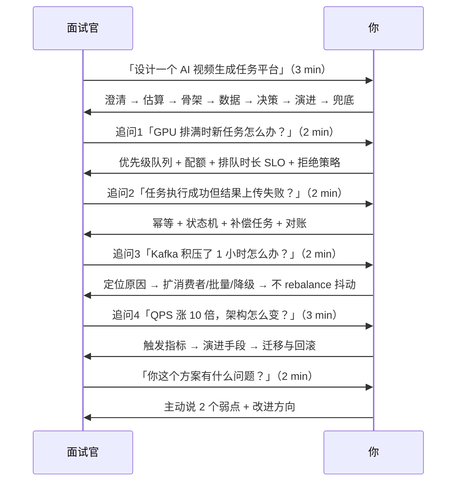

# 17 · 面试：白板架构设计与追问链

> 属于「架构师修炼」· 综合实战 · 面试收口篇
> 上一篇：[16 案例：Feed 与社区互动架构](./16-案例-Feed与社区互动架构)　下一篇：[18 实验手册：Go 落地实验](./18-实验手册-Go落地实验)

> **这篇解决什么问题**：你已经读完了演进、一致性、稳定性三个专题，但坐到面试官面前，还是要现场从零讲清一个系统。这一篇把前面所有篇章**压缩成一套可复用的答题流程 + 6 道高频题的完整拆解 + 10 类追问的应对模板**。目标：任何架构题，你都能在 30 秒内开口，6 分钟内讲完，并且经得起三轮追问。

---

## 一、白板答题的黄金 7 步（背到能条件反射）

| 步 | 你说什么（可直接照读） | 面试官听到什么 |
| --- | --- | --- |
| ① 澄清 | 「我先确认四点：一致性要求、日活量级、读写比、可接受延迟」 | 有工程意识，不莽 |
| ② 估算 | 「按 DAU X 算，峰值写 Y QPS、读 Z QPS、日增存储 W，所以第一个瓶颈是…」 | **会算账（A3）** |
| ③ 骨架 | 「分五层：接入 / 服务 / 缓存 / 存储 / 异步」，边画边说职责 | 结构清晰 |
| ④ 数据 | 「核心表 + 分片键 + 索引 + 缓存 key 设计 + 一致性方案」 | 真写过代码 |
| ⑤ 决策 | 「这里有三个方案，我选 B，因为它…，代价是…」 | **会选型（A4）** |
| ⑥ 演进 | 「现在这版能扛 1 万，到 10 万我做 A/B/C，触发指标是 D」 | **会演进（A5）** |
| ⑦ 兜底 | 「Redis 挂 → 降级走 DB + 限流；MQ 挂 → 本地消息表；主库挂 → 半同步切换」 | 上过线 |

> **30 秒开场万能句**：「我先澄清需求，再估算量级，然后从最简单的可行架构开始，逐步演进——**我不想一上来就上重型组件，那是拿复杂度换虚荣心。**」这句话讲完，面试官对你的定位就从"候选人"变成"能设计的人"。

**画图规范（白板上也要有结构）**：
- 从左到右：客户端 → 接入 → 服务 → 缓存/存储 → 异步；
- **每个组件旁标数字**（QPS、容量、副本数）——这是你和别人最大的差别；
- 用箭头标方向（同步实线、异步虚线）；
- 边画边说，不要沉默超过 10 秒。

---

## 二、六道高频题的完整拆解

### 2.1 设计短链系统

| 步骤 | 内容 |
| --- | --- |
| 澄清 | 读写比（1000:1）、是否需要自定义短码、是否统计点击、过期策略 |
| 估算 | 写 100 QPS、读 10 万 QPS → **典型的读多写少 + 读极高频** |
| 骨架 | 写入：发号 → base62 → 存 KV；读取：缓存（本地 + Redis）→ DB → 302 |
| 数据 | `short_code(PK) / long_url / uid / created_at / expire_at`；读缓存 key=`short:{code}`，长 TTL + 空值缓存 |
| 关键决策 | ① 发号器：**号段模式**（DB 批量取号 + 内存发号）优于 Redis INCR（少一次网络往返）与雪花（短码太长）；② 存储：读 QPS 10 万 → 必须缓存挡在前面，DB 只做冷数据；③ 跳转用 302（可统计）还是 301（浏览器缓存，省流量）——**给取舍，别给答案** |
| 演进 | 10 万读 → 加本地缓存 + CDN 边缘跳转；1 亿条 → 分片（按 code hash），冷数据归档 |
| 兜底 | 缓存穿透（空值缓存 + 布隆过滤器）、发号器挂（号段本地缓冲扛几千个）、DB 挂（缓存里的热点仍可跳转） |

**加分点**：「短链的读是极热的幂律分布——**前 1% 的链接可能占 90% 的点击**，所以我会在应用进程内加一层 LRU 缓存，把最热的几万个短码放本地，这样单实例能到几十万 QPS 而 Redis 压力很小。」

### 2.2 设计秒杀系统

| 步骤 | 内容 |
| --- | --- |
| 澄清 | 库存量、参与人数、是否公平、能否接受超卖 |
| 估算 | 峰值 50 万 QPS，库存 1000 件 → **99.8% 的请求必然失败，架构目标是"快速、正确地拒绝"** |
| 骨架 | 多层过滤漏斗：静态化/CDN → 网关限流（丢弃大部分）→ 答题/验证码（打散脚本）→ Redis Lua 扣库存（原子）→ MQ 异步下单 → DB 兜底唯一约束 |
| 关键决策 | ① 库存放 Redis + Lua：原子扣减，10 万 QPS；② 单 key 热点 → **库存分片**（`stock:{id}:{0..9}`，请求随机分片，Redis 单 key 上限 5w QPS）；③ 削峰用 MQ：抢到名额 ≠ 下单成功，把 DB 写入从 50 万降到 1000；④ 一致性：**Redis 预扣 + DB 唯一约束 + 对账**，接受"超卖一点点由 DB 拦住" |
| 演进 | 1 万 QPS 直接 DB 乐观锁；10 万加 Redis 预扣；100 万加库存分片 + 网关多级限流 |
| 兜底 | Redis 挂 → 熔断降级直连 DB（限流保护）；MQ 挂 → 本地消息表；Redis 丢写（主从异步）→ 对账回补，DB 为准 |

**加分点**：「秒杀的关键不是"扛住 50 万"，而是**在漏斗最前面就把 49.9 万请求干掉**——静态页面 + CDN + 网关限流 + 答题，成本最低的一层干掉最多流量。」

### 2.3 设计 IM 消息系统（或"在线消息推送"）

| 步骤 | 内容 |
| --- | --- |
| 澄清 | 单聊/群聊、消息必达性、离线消息、消息顺序、已读回执 |
| 估算 | 在线 500 万长连接 → **单机长连接数（10 万~100 万）与内存是瓶颈**；消息量 10 万 QPS |
| 骨架 | 接入网关（长连接 + 心跳）→ 消息服务（路由到接收方所在网关）→ 存储（最近消息 + 离线队列）→ 推送 |
| 数据 | 消息表按 `session_id` 分片（保证同一会话单分片内自增序）；会话序用**单分片自增 seq**（不要用时间戳，会给重复） |
| 关键决策 | ① 心跳与连接保活（TCP 假连接、NAT 超时 → 心跳 + 断线重连 + 增量拉取）；② **消息可靠性**：服务端先落库再推送（推失败要能重推）+ 客户端 ACK + 服务端重发；③ 顺序：同一会话单分片 + 单消费者保证；④ 在线状态与路由表（uid → gateway 的映射，放 Redis，网关变更要清理） |
| 演进 | 长连接网关水平扩展 → 多机房就近接入（跨机房消息路由） → 单元化 |
| 兜底 | 网关挂 → 客户端重连到其他网关 + 拉取增量；路由表脏 → 推送失败回退到离线拉取；消息重复 → 客户端按 seq/msg_id 去重 |

**加分点**：「IM 的核心是**用"拉"兜住"推"的失败**——推是优化，拉是保证。所以设计上一定要有一条 `sync(seq)` 增量拉取接口，这样任何推送失败都能最终收敛。」

### 2.4 设计 Feed 流（详见 [16 篇](./16-案例-Feed与社区互动架构)）

白板速答：**推拉结合**。普通用户发帖写入粉丝收件箱（Redis ZSet）；大 V 走拉模式（粉丝读时实时拉取大 V 内容并与收件箱归并）；分页用**游标（score）而非 offset**；计数用 Redis 异步落库 + 对账；收件箱丢了从 DB 重建（限速重推）。

**一句话结论**：「Feed 的本质是**把读放大换成写放大**——因为读比写多 100 倍，所以宁愿在写的时候多干活。」

### 2.5 设计分布式 ID 发号器

| 方案 | 一致性/唯一性 | 性能 | 缺点 | 适用 |
| --- | --- | --- | --- | --- |
| 雪花算法 | 本地生成，趋势递增 | 极高（无网络） | 时钟回拨、workerId 分配 | 绝大多数场景 |
| 号段模式（DB 批量取号） | 依赖 DB，本地缓冲 | 高（一次取一批） | 发号器挂要靠本地号段撑 | 订单号等 |
| Redis INCR | 原子 | 高 | 每次一次 RTT、Redis 挂就停 | 小规模 |
| UUID | 唯一但随机 | 高 | **作主键导致页分裂** | 仅作请求 ID |

**加分点**：「我会用雪花 + 时钟回拨容忍窗口，workerId 用 etcd Lease 分配；但**唯一性最终靠 DB 唯一索引兜底**——发号器再怎么设计也不能假设它不出错。」

### 2.6 设计"缓存 + DB 一致性"方案（详见 [08 篇](./08-缓存与DB一致性落地)）

标准答案结构：
1. **先分级**：P0 资金类不走缓存（或极短 TTL + 读主库）；P2/P3 展示类走 Cache Aside；
2. **主方案**：先更新 DB → 再删缓存，失败重试；
3. **加强**：binlog 订阅（Canal）兜底删缓存 + TTL 兜底；
4. **并发窗口**：讲清「读线程回填旧值」的时序与延迟双删如何覆盖；
5. **兜底**：定时对账扫描版本不一致的 key 并修复；
6. **诚实结论**：**做不到强一致，只能把不一致窗口压到毫秒~秒级并对账兜底**。

---

## 三、10 类追问的应对模板（面试官的第二、三刀）

> 面试官问完初版方案，一定会有追问。**追问不是刁难，是给你展示深度的机会**。下面每类都给"识别信号 + 应对模板"。

| # | 追问类型 | 典型问法 | 应对模板 |
| --- | --- | --- | --- |
| 1 | **量级放大** | 「如果 QPS 翻 10 倍呢？」 | 先给当前瓶颈数字 → 说它为什么先崩 → 给演进手段 + 触发指标（[01 篇](./01-QPS分级与架构演进地图)） |
| 2 | **组件故障** | 「Redis 挂了怎么办？」 | 现象 → 降级路径 → 数据影响 → 兜底（对账/补偿）→ **明确不能假成功** |
| 3 | **一致性质疑** | 「你说的最终一致，多久一致？」 | 给窗口长度（毫秒/秒/分钟）+ 靠什么收敛（TTL / 重试 / 对账）+ 不一致时的业务表现 |
| 4 | **选型质疑** | 「为什么不用 XX？」 | 承认可选 → 用对比矩阵给 2 个方案 → 说清我选的边界与代价（**不要否定别人**） |
| 5 | **成本质疑** | 「这套要多少机器/多少钱？」 | 给估算：实例数、存储、带宽、GPU 卡时（[13 篇](./13-容量规划压测与故障演练)） |
| 6 | **迁移质疑** | 「线上正在跑，你怎么切过去？」 | 双写 → 校验 → 灰度 → 回滚四件套（[06 篇](./06-分库分表与在线迁移双写)） |
| 7 | **数据错乱** | 「发现数据不一致了怎么查？」 | 对账任务定位 → 差异分类 → 自动补偿 → 人工介入阈值 → 复盘加监控 |
| 8 | **极端场景** | 「机房断电 / 时钟回拨 / 网络分区」 | 用"多数派 + fencing + 幂等 + 对账"四件套回答（[10 篇](./10-etcd与Raft选主租约落地)） |
| 9 | **业务权衡** | 「用户体验和一致性冲突时怎么选？」 | 按数据分级决策 + 明确告诉用户（"处理中"而不是假成功） |
| 10 | **反套路** | 「你觉得这个设计有什么问题？」 | **主动认错**：说出方案的 2 个真实弱点 + 改进方向（这题考的是自我批判能力，硬撑必扣分） |

> **第 10 类最重要**：面试官问「有什么问题」时，回答「我觉得挺完善的」是灾难。正确回答：「有两个隐患：一是 binlog 订阅引入了新组件，它挂了我只能靠 TTL 兜底，窗口会从秒级变分钟级；二是我把热点数据放本地缓存，一致性靠广播失效，广播丢失时会短暂读到旧值——如果这个数据是 P0 级，我会改成不走本地缓存。」

---

## 四、评分维度：面试官在给你打什么分

| 维度 | 权重 | 看什么 | 怎么拿分 |
| --- | --- | --- | --- |
| 需求澄清 | 10% | 是否主动问约束 | 每次开口先澄清 |
| **量级估算** | 20% | 有没有数字 | 背公式，给区间而不是"很大" |
| 架构完整性 | 20% | 层次是否清楚、是否覆盖异步/缓存/存储 | 五层骨架 + 每层职责 |
| **深度（追问耐受）** | 25% | 能不能扛住 3 轮追问 | **每个组件都准备"挂了怎么办"和"为什么不用 XX"** |
| **权衡意识** | 15% | 是否说清代价 | 每个决策都给"代价 + 适用边界" |
| 表达与画图 | 10% | 是否条理、图是否标数字 | 边画边说，标 QPS/容量 |

**结论**：深度（25%）+ 权衡（15%）+ 估算（20%）= **60% 的分数在"数字 + 代价 + 故障"上**，而不是你记得多少组件名。

---

## 五、模拟面试脚本（30 分钟，找人一起练或自问自答录音）

**自练方法**：手机录音，讲完回放，按下表打分，每周练 2 道题。

| 检查项 | 达标标准 | 自评 |
| --- | --- | --- |
| 开场 30 秒内说出澄清问题 | 4 个问题 | ☐ |
| 3 分钟内说出峰值 QPS/存储数字 | 有计算过程 | ☐ |
| 画出的架构图每个组件标了数字 | ≥5 处标注 | ☐ |
| 说清 3 个以上的"代价" | 每处都有 | ☐ |
| 每个组件都能答"挂了怎么办" | 无卡壳 | ☐ |
| 结尾主动给出演进路径与触发指标 | 完整 | ☐ |
| 全程无"应该/大概/应该没问题" | 用数字和条件句 | ☐ |

---

## 六、六个高频"翻车点"（每个都会让面试官扣分）

| 翻车点 | 面试官的真实想法 | 纠正 |
| --- | --- | --- |
| 一上来就微服务 + 分库分表 | 「没算账，背过八股」 | 先算量，说明何时才需要 |
| 「Redis 保证强一致」 | 「不懂复制是异步的」 | Redis 是加速层，DB 是事实源 |
| 「用 MQ 就不丢了」 | 「没考虑 acks/幂等/积压」 | 讲层级：acks=all + min.insync + 幂等消费 + 对账 |
| 「加机器就行」 | 「不会定位瓶颈」 | 先找瓶颈（[01 篇第六节](./01-QPS分级与架构演进地图)） |
| 只画终态不给迁移 | 「没落地过」 | 补双写/校验/灰度/回滚 |
| 被质疑就改口 | 「没主见，也不懂自己的方案」 | 先讲清取舍依据，再承认边界 |

---

## 七、故障与一致性边界速查：任何方案都要能立刻答上来的表

**面试官提出的每一个组件，你都要能立刻说出它挂了会怎样**。这张表是「闭卷必背」——前四列全是你可以直接说出口的句子：

| 组件 | 挂了的现象 | 降级动作 | 丢什么数据 / 一致性边界 | 怎么发现不一致 |
| --- | --- | --- | --- | --- |
| 应用实例 | 该实例请求失败，LB 摘除 | 流量自动转其他实例（需无状态 + 优雅下线） | 进行中请求丢失 → **必须幂等** | 错误率 + 健康检查 |
| **Redis** | 缓存穿透到 DB；主从切换期间写失败 | 限流后回源 DB（**不限流就打挂 DB**） | 异步复制丢未同步写；缓存是**加速层不是事实源** | TTL 兜底 + 对账任务 |
| **MySQL 主库** | 写失败；半同步下切换秒级~几十秒 | 切从库为主，写短暂失败 → 客户端重试 | 异步复制丢未同步事务（**窗口 = 主从延迟**） | GTID 比对 + 行数/校验和对账 |
| **MySQL 从库** | 读流量回主库 → 主库压力翻倍 | 摘除故障从库 + 限制读流量 | 读到旧数据（写后读） | 主从延迟监控 + 读主窗口 |
| **Kafka** | 积压增长、消费延迟上升 | 排队时长上升 → 拒绝新请求或降级非核心消息 | 未 ack 会**重复**（至少一次），极少丢 | lag 监控 + 消费幂等 + 对账 |
| **etcd** | 失去多数派 → 只读，选主/配置冻结 | 依赖它的能力降级；配置用本地缓存兜底 | 元数据不可写；**旧主假死会双写** | 选主事件告警 + fencing token |
| 下游 / 第三方 | 超时、错误率上升 | 限流 + 熔断 + 兜底值 | 降级期间结果不准，恢复后补偿 | 依赖成功率 + 对账 |
| 机房 / 网络 | 跨机房延迟、分区 | 就近接入 / 切流到其他单元 | 多活下数据冲突 | 跨机房同步延迟 + 演练 |

> **答题模板**（把任意组件套进去，8 秒答完）：
> 「**X 挂了 → 现象是 Y，我会 Z 降级，数据影响是 W，靠 V 发现和修复。**」
> 例：「Kafka 挂了 → 削峰没了、下单链路从异步退回同步会打爆 DB，所以我会先拒绝新请求而不是硬扛，已抢到名额的靠本地消息表补发，数据影响是会重复不会丢，靠消费幂等和对账修复。」

---

## 八、面试前 7 天冲刺清单

| 天 | 任务 | 产出 |
| --- | --- | --- |
| D-7 | 通读 [00](./00-架构师思维与设计方法论) + [01](./01-QPS分级与架构演进地图)，默写五步法与六道坎 | 手写一页提纲 |
| D-6 | [03 MySQL 主从](./03-MySQL主从与读写分离落地) + [04 Redis 高可用](./04-Redis高可用与缓存体系落地)，背参数 | 参数速查卡 |
| D-5 | [05 Kafka](./05-Kafka削峰与可靠投递落地) + [11 幂等](./11-幂等去重与ExactlyOnce)，讲清"丢"与"重"的窗口 | 丢重矩阵 |
| D-4 | [08 缓存一致性](./08-缓存与DB一致性落地) + [09 分布式事务](./09-分布式事务与最终一致落地)，画三个时序图 | 三张手绘图 |
| D-5 | [10 etcd 与选主](./10-etcd与Raft选主租约落地) + [12 限流熔断](./12-限流熔断降级与背压) | 追问链背熟 |
| D-3 | [15](./15-案例-AI剪辑任务平台架构) + [16 案例](./16-案例-Feed与社区互动架构)，各讲一遍录音 | 两道题录音 |
| D-2 | 本文第二节 6 道题，每道讲 6 分钟（计时） | 计时记录 |
| D-1 | [13 容量压测](./13-容量规划压测与故障演练) + [14 复盘](./14-备份恢复与故障复盘)，准备"我遇到过的故障"故事 | 一个真实故障故事 |

> **准备一个真实故障故事**（STAR 结构）：现象 → 定位过程（看了哪些指标）→ 根因 → 修复 → 改进（加监控/加对账/加演练）。**这题几乎必问，也是最能证明你"上过线"的一题。**

---

## 九、面试追问链（自测用）

1. **「你怎么看待"过度设计"？」** → 过度设计 = 组件复杂度超过业务量级。判据：引入的组件解决的问题，在当前 QPS 下是否真实存在；代价是故障点数量与人力。我会把演进**延后到触发指标出现时**。

2. **「你做过最难的架构决策是什么？」** → 按 STAR 讲：约束（成本/时间/一致性）× 方案对比 × 选择的代价 × 结果验证（有数据）。

3. **「如果面试官否定了你的方案？」** → 先确认他关心的是哪个维度（成本还是可靠性），再用对比矩阵重新论证；如果他给了更好的方案，**当场承认并说出它的代价**——这是加分不是减分。

4. **「你怎么保证方案真的能落地？」** → 迁移四件套 + 验收标准（压测指标、监控告警、对账任务）+ 回滚预案。

5. **「你觉得架构师最重要的能力是什么？」** → **在信息不全、资源受限时做出可回滚的决策，并让团队能一致地执行下去**。技术只是其中一半，另一半是让方案能被落地和演进。

## 十、自测清单

- [ ] 7 步答题流程能默写，且 30 秒内能开口
- [ ] 6 道高频题各讲一遍，**全程计时**，无卡壳
- [ ] 10 类追问模板能对应到具体话术
- [ ] 能对任意方案说出 2 个真实弱点（第 10 类追问）
- [ ] 准备好 1 个真实故障故事（STAR）与 1 个最难决策故事
- [ ] 画图时自觉标注 QPS/容量/副本数

> **最后一句**：面试考的不是"你知道多少组件"，而是"**你能不能为一个业务，在给定的约束下做出可解释、可回滚、可演进的决策**"。这也是本栏目从 [00](./00-架构师思维与设计方法论) 到 [18](./18-实验手册-Go落地实验) 一直在练的唯一一件事。
