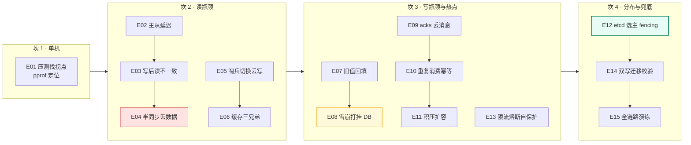
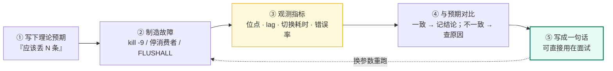

# 18 · 实验手册：Go 落地实验

> 属于「架构师修炼」· 综合实战 · 动手篇（**本栏目唯一的验收方式**）
> 上一篇：[17 面试：白板架构设计与追问链](./17-面试-白板架构设计与追问链)　栏目总览：[架构师修炼](./)

> **这篇解决什么问题**：架构能力不能靠读文档获得。**面试官问「你做过吗」，只有亲手制造过故障、亲眼看到过丢数据窗口的人答得出来**。这一篇给你 15 个可复现的实验，每个实验都对应一条面试话术——做完之后，你说的每句话背后都有一次真实的观察。

---

## 一、环境准备

编排文件：[`code/architect/docker-compose.yml`](https://github.com/Bin-hy/go-campus/blob/main/code/architect/docker-compose.yml)（本仓库 `code/architect/`）

```bash
cd code/architect
docker compose up -d          # 起 MySQL 主从 / Redis 主从+哨兵 / etcd 三节点 / Kafka
docker compose ps             # 确认全部 healthy
docker compose down -v        # 玩坏了想重来（会清空数据）
```

| 服务 | 地址 | 用途 | 对应实验 |
| --- | --- | --- | --- |
| `mysql-master` | `127.0.0.1:3306` | 主库（binlog ROW + GTID + 半同步） | E02–E04 |
| `mysql-replica` | `127.0.0.1:3307` | 从库（只读） | E02–E04 |
| `redis-master` | `127.0.0.1:6380` | Redis 主 | E05–E09 |
| `redis-replica` | `127.0.0.1:6381` | Redis 从（异步复制） | E05, E09 |
| `sentinel-1/2/3` | `127.0.0.1:26379~26381` | 哨兵（quorum=2） | E05 |
| `etcd-1/2/3` | `127.0.0.1:12379~12381` | 三节点 Raft 集群 | E13 |
| `kafka` | `127.0.0.1:9092` | KRaft 单节点（3 副本用 `--profile cluster`） | E10–E12 |

> 默认账号：MySQL `root/root123`；etcd 无认证；Kafka 无认证。**所有实验都在本机跑，随时可 `down -v` 重来。**

**每个实验请按这个模板记录**（一个实验一份，攒够了就是你简历上的项目经历）：

```markdown
## 实验编号 / 名称
- 目标：
- 步骤（命令）：
- 观察到的现象（贴数据/截图）：
- 与理论预期是否一致：
- **面试可用的一句话结论**：
- 遗留疑问：
```

---

## 二、实验总表（15 个）

15 个实验按「坎」递进，建议**按顺序做**——前面实验建立的观测能力（看指标、造故障、记录窗口）是后面实验的前提：



| # | 实验 | 验证的核心认知 | 对应篇章 |
| --- | --- | --- | --- |
| E01 | Go 服务压测找拐点 | 单机 QPS 上限与 P99 拐点，pprof 定位（**展开版见[19 pprof 实战](./19-pprof实战/)**） | [02](./02-单体架构的极限与分层) |
| E02 | MySQL 主从搭建 + 复现延迟 | binlog → 从库重放，大事务导致延迟 | [03](./03-MySQL主从与读写分离落地) |
| E03 | 写后读不一致复现与治理 | 主从延迟下的读己之写 | [03](./03-MySQL主从与读写分离落地) |
| E04 | 半同步 vs 异步丢数据对比 | **主库宕机的丢数据窗口** | [03](./03-MySQL主从与读写分离落地) |
| E05 | Redis 哨兵切换与丢写 | 故障切换耗时 + 未同步写的丢失 | [04](./04-Redis高可用与缓存体系落地) |
| E06 | 缓存三兄弟复现 | 穿透/击穿/雪崩的可观测表现 | [04](./04-Redis高可用与缓存体系落地) |
| E07 | 缓存与 DB 旧值回填 | Cache Aside 的并发窗口 | [08](./08-缓存与DB一致性落地) |
| E08 | 缓存雪崩打挂 DB 与限流保护 | 级联故障链路与保护手段 | [08](./08-缓存与DB一致性落地)·[12](./12-限流熔断降级与背压) |
| E09 | Kafka acks 丢消息对比 | acks/min.insync 组合的实际语义 | [05](./05-Kafka削峰与可靠投递落地) |
| E10 | Kafka 重复消费与幂等改造 | 至少一次语义的落地拦法 | [11](./11-幂等去重与ExactlyOnce) |
| E11 | Kafka 积压与扩容 | lag 监控、分区数与并行度 | [05](./05-Kafka削峰与可靠投递落地) |
| E12 | etcd 选主 + Lease 过期 + fencing | 防双写的完整链路 | [10](./10-etcd与Raft选主租约落地) |
| E13 | 分布式限流 + 熔断 | 依赖变慢时的自保护 | [12](./12-限流熔断降级与背压) |
| E14 | 两库双写迁移 + 校验 | 不停机迁移与对账 | [06](./06-分库分表与在线迁移双写) |
| E15 | 全链路故障演练 | 预案有效性验证 | [13](./13-容量规划压测与故障演练) |

---

## 三、实验卡片

> **每个实验都走同一条闭环**——重点是第 ③④ 步，而不是"跑通了"：



### E01 · Go 服务压测找拐点（坎 1）

**目标**：亲眼看到「QPS 不再涨、P99 开始飙」的拐点，并学会用 pprof 找原因。

```bash
# 1) 起一个带 DB 查询的 Go 服务（100 行以内），开 pprof
go run ./cmd/api &        # 监听 :8080，/debug/pprof 已注册
# 2) 固定并发压测，逐级加并发
docker run --rm --network host williamyeh/wrk -t4 -c50  -d30s http://localhost:8080/api/item/1
docker run --rm --network host williamyeh/wrk -t4 -c200 -d30s http://localhost:8080/api/item/1
# 3) 拐点出来后抓火焰图
go tool pprof -http=:9090 http://localhost:8080/debug/pprof/profile?seconds=30
```

| 并发 | QPS | P99 | 观察 |
| --- | --- | --- | --- |
| 50 | ? | ? | 线性区 |
| 200 | ? | ? | 接近饱和 |
| 400 | ? | ? | **QPS 停滞 + P99 起飞 = 拐点** |

**观察**：`go tool pprof` 里 top 函数是 DB 等待、JSON 序列化还是锁竞争；`GODEBUG=gctrace=1` 看 GC 频率随 QPS 的变化。

> **面试话术**：「我压测过我写的服务，单机在 400 并发时到拐点，QPS 停在 8k，火焰图显示 60% 时间在 JSON 序列化和 DB 等待——**所以瓶颈不在 Go 而在下游和序列化**，这说明加机器的收益有限。」

> **展开版（E01 的完整链路）**：E01 只是入口。从「造问题 → 采集 → 读图 → 定位到行 → 修复 → 量化前后」的完整链路在子栏目 [19 pprof 实战](./19-pprof实战/) 里：8 个可跑样例（**L01** CPU 打满 · **L02** GC 抖动 · **L03** goroutine 泄漏 · **L04** 锁竞争 · **L05** channel 阻塞 · **L06** 内存滞留 · **L07** syscall 高，业务端口 `1808N` / pprof 端口 `1908N`，加 `-fix` 直接跑修复版对比），配套 [07 实战案例集](./19-pprof实战/07-实战案例集) 把这 8 个样例写成 7 个面试级别的排障故事。

---

### E02 · MySQL 主从搭建 + 复现主从延迟（坎 2）

**目标**：看到 binlog 位点推进、`Seconds_Behind_Master` 变化，并**亲手造出主从延迟**。

```sql
-- 主库：确认 GTID 与格式
SHOW VARIABLES LIKE 'binlog_format';       -- ROW
SHOW VARIABLES LIKE 'gtid_mode';           -- ON
-- 主库：造一个 20 万行的大事务（这是延迟的头号杀手）
UPDATE big_table SET status = 1 WHERE id < 200000;   -- 单事务，从库要整段重放
```

```sql
-- 从库：观察延迟
SHOW REPLICA STATUS\G
-- 关注：Seconds_Behind_Master / Retrieved_Gtid_Set vs Executed_Gtid_Set / Slave_SQL_Running_State
```

| 场景 | 延迟表现 | 结论 |
| --- | --- | --- |
| 1000 条小事务 | < 1s | 正常 |
| 单事务更新 20 万行 | 秒级~十几秒跳变 | **大事务 = 延迟黑洞**（从库串行重放，且期间不可中断） |
| 开 `slave_parallel_workers=4` 重跑 | 延迟明显下降 | 并行复制对**多事务并发**有效，对单大事务无效 → 必须拆事务 |

**面试话术**：「主从延迟的头号原因是**大事务和从库单线程重放**；并行复制只能加速并发事务，对单个大事务无效，所以真正的解法是**业务侧把批量更新拆成小批次**——这是我们线上治理延迟最有效的手段。」

---

### E03 · 写后读不一致复现与治理（坎 2）

**目标**：亲手复现「刚写完立刻读从库，读到旧数据」。

```go
// 复现：写主库 → 立刻读从库 → 断言失败
_, _ = master.Exec("UPDATE account SET balance = balance + 1 WHERE id = 1")
var bal int
_ = replica.QueryRow("SELECT balance FROM account WHERE id = 1").Scan(&bal) // 读到旧值
```

**三种治理手段，逐个验证效果**：

| 手段 | 做法 | 效果 | 代价 |
| --- | --- | --- | --- |
| 写后 N 秒读主 | 会话标记 `readFromMasterUntil = now+2s` | 简单有效 | 强制读主，主库压力上升 |
| GTID 位点等待 | 记录写操作的 GTID，读前等从库 `Executed_Gtid_Set` 覆盖它 | 精确 | 复杂度高 |
| 会话粘性 | 同一用户路由固定到主库 | 一致 | 主库读写压力大 |

**面试话术**：「读写分离必然带来'写后读'的不一致。我们不是靠猜延迟，而是**在会话里标记一个"读主窗口"，窗口内直接路由主库**——比等位点简单，效果也够。」

---

### E04 · 半同步 vs 异步：主库宕机丢数据对比（**最有价值的一个实验**）

**目标**：量化「主库挂掉时到底丢多少数据」。

```bash
# 场景 A：异步复制
#   1) 主库关闭半同步：SET GLOBAL rpl_semi_sync_master_enabled = OFF;
#   2) 从库停掉 SQL 线程：STOP REPLICA IO_THREAD;（模拟从库落后）
#   3) 主库写入 100 条事务并全部返回成功
#   4) docker kill -s KILL mysql-master   ← 模拟主库断电
#   5) 提升从库，数一数丢了多少条
# 场景 B：半同步（AFTER_SYNC）
#   重复上述步骤，观察：写入在第 N 条时开始阻塞（等待从库 ACK），丢数据窗口 = 0
```

| 场景 | 写入是否全部成功 | 主库挂后从库有多少数据 | 结论 |
| --- | --- | --- | --- |
| 异步 | 全部成功 | **少（丢已返回成功的事务）** | AP，丢数据窗口 = 主从延迟 |
| 半同步（AFTER_SYNC） | 从库停后**阻塞或超时降级** | 不丢已提交 | 近 CP，代价是写延迟 + 可用性 |

**必须观察到的两个细节（面试深挖点）**：
1. `rpl_semi_sync_master_timeout`（默认 10s）超时后会**静默降级为异步**——此时丢数据窗口又回来了，必须监控 `Rpl_semi_sync_master_status` 并告警；
2. `AFTER_SYNC`（默认）vs `AFTER_COMMIT`：后者会在提交后才等 ACK，崩溃时仍可能丢；**生产用 AFTER_SYNC**。

> **面试话术**：「我在本机做过主库 `kill -9` 的实验：异步复制的丢数据窗口就是主从延迟窗口，半同步能把已提交的写保住，但要注意超时降级和 AFTER_SYNC 的选择——**所以我们的资金表用半同步 + 唯一约束兜底 + T+1 对账，三层防护。**」

---

### E05 · Redis 哨兵切换与丢写（坎 2/3）

```bash
# 1) 写持续流量
while true; do redis-cli -p 6380 INCR counter; sleep 0.01; done
# 2) 观察复制状态
redis-cli -p 6380 INFO replication | grep -E "role|slave[0-9]"
# 3) 杀掉主库
docker kill -s KILL redis-master
# 4) 观察哨兵日志与切换耗时
docker logs -f sentinel-1     # +sdown → +odown → +switch-master，记录耗时
# 5) 切换完成后，对比切换前主库最后写入的 counter 与切换后新主库的值
```

| 观察项 | 典型值 | 结论 |
| --- | --- | --- |
| 哨兵判定主库下线 | ~5s（down-after-milliseconds + 主观→客观） | 定位故障有延迟 |
| 完成 failover | 数秒~十几秒 | **这段时间写全部失败**，客户端必须能重试 |
| counter 差值 | 通常丢几条 | **异步复制的丢写是真实的**，别把它当数据库 |

**加分实验**：在哨兵配置里加 `min-replicas-to-write 1` + `min-replicas-max-lag 10`，重跑观察「主库无人同步时主动拒绝写入」——这就是减少丢写的手段。

> **面试话术**：「Redis 主从切换期间的写会失败和丢失——所以我把 Redis 定位成**加速层，从不作为事实源**；关键数据（库存/金额）是 DB 事务 + 唯一约束兜底，Redis 丢的靠对账回补。」

---

### E06 · 缓存三兄弟复现（坎 2/3）

| 故障 | 复现方法 | 观察到的现象 | 修复与验证 |
| --- | --- | --- | --- |
| **穿透** | 用不存在的 key 打 1 万次 | 每次都打到 DB（DB QPS 涨满） | 空值缓存（`SET key "" EX 60`）→ DB QPS 归零；进阶布隆过滤器 |
| **击穿** | 热 key 过期瞬间并发 1 万请求 | DB 瞬间收到并发 1 万次同查询 | `singleflight` 合并回源 → DB 只收到 1 次 |
| **雪崩** | 批量预热 key 全部同 TTL，等它们同时过期 | DB 在那一秒被打满、P99 起飞 | 随机 TTL（基础值 ±20%）+ 逻辑过期（异步刷新） |

**跑完请贴出**：修复前/后 DB 的 QPS 曲线对比。**这张图就是面试里最有说服力的截图。**

---

### E07 · 缓存与 DB 的「旧值回填」复现（一致性核心实验）

**目标**：亲眼看到 Cache Aside 的经典并发窗口。

```text
时序（用两个 goroutine 加 sleep 精确制造）：
T1: 读线程 GET cache → miss
T2: 读线程 SELECT db → 得到旧值 v1（此时还没有人更新）
T3: 写线程 UPDATE db = v2
T4: 写线程 DEL cache
T5: 读线程 SET cache = v1     ← 缓存里现在是旧值，且没有 TTL 兜底就永久错
```

**三个对照实验**：

| 变体 | 结果 | 结论 |
| --- | --- | --- |
| 先更新 DB，再删缓存 | 复现出短暂的旧值（直到 TTL） | 概率低但真实存在 → 需要**延迟双删**或 binlog 订阅 |
| 先删缓存，再更新 DB | 窗口明显更大 | **这就是为什么推荐"先更新库再删缓存"** |
| 加延迟双删（500ms 后二次 DEL） | 旧值被覆盖纠正 | 延迟时长要 ≥ 主从延迟 + 业务读耗时 |

> **面试话术**：「我复现过 Cache Aside 的旧值回填：先删缓存再更库的窗口明显更大，所以我用**先更库再删缓存 + 删除失败重试 + binlog 订阅兜底 + TTL 兜底**；同时明确告诉业务：**缓存一致性只能做到秒级最终一致，不能保证强一致。**」

---

### E08 · 缓存雪崩打挂 DB（级联故障全景）

```bash
# 1) 预热 1 万个 key，全部 TTL 同时到期（或者直接 FLUSHALL 模拟 Redis 宕机）
redis-cli -p 6380 FLUSHALL
# 2) 同时压测读接口 1 万 QPS，观察 MySQL：SHOW PROCESSLIST / CPU / QPS
# 3) 加上保护：应用层单机限流（rate.Limiter）+ 回源并发闸门（semaphore）+ 空值缓存
# 4) 重跑，观察 DB 是否被打挂
```

| 阶段 | DB 表现 | 应用表现 |
| --- | --- | --- |
| 无保护 | 连接数打满、CPU 100%、出现大量慢查询 | P99 从 20ms → 超时 |
| 加限流 + 并发闸门 | DB QPS 被钳制在安全水位 | 部分请求被快速失败（**这正是我们想要的**） |

> **面试话术**：「**缓存挂掉从来不是最严重的，缓存挂掉把 DB 打挂才是最严重的。** 所以我的降级方案里，回源必须过限流和并发闸门——宁可快速失败 20% 的用户，也不能让数据库崩掉让 100% 的用户受影响。」

---

### E09 · Kafka acks 与丢消息对比（坎 3）

**目标**：验证 `acks` / `min.insync.replicas` / `unclean.leader.election` 组合的真实语义。

```bash
# 建 3 副本 topic
kafka-topics.sh --bootstrap-server localhost:9092 --create --topic t-reliability \
  --partitions 3 --replication-factor 3 --config min.insync.replicas=2

# A) acks=0：发 1000 条 → kill -9 leader → 计数实际落盘条数
# B) acks=1：同上 → 观察丢多少
# C) acks=all + min.insync.replicas=2：同上 → 已 ack 的不丢；但当 ISR 收缩到 1 时，生产端开始报错（NotEnoughReplicas）
```

| 配置 | 主挂后丢失 | 可用性 | 适用 |
| --- | --- | --- | --- |
| acks=0 | 大量丢（发出去就不管） | 最高 | 埋点/日志 |
| acks=1 | 丢未同步的 | 高 | 可丢的场景 |
| acks=all + min.insync=2 | **已 ack 不丢** | 降低（ISR 不足时报错） | 订单/任务状态 |

> **面试话术**：「acks=all 不等于不丢——只有当 `min.insync.replicas >= 2` 且 ISR 足够时，已 ack 的消息才不丢；ISR 塌到 1 个副本时，broker 会拒绝写入，**这时业务必须能接受'暂时不可写'而不是静默丢数据**。这个取舍我们是通过 topic 分级来做的。」

---

### E10 · Kafka 重复消费与幂等改造

```text
1) 消费端：处理业务后 sleep 10s，再提交 offset（故意制造"处理成功但提交失败"）
2) 过程中 kill -9 消费者 → 重启后从旧 offset 重新消费 → 同一条消息被处理两次
3) 观察副作用被放大：给一个 count 表 +1，最终 count = 2
4) 改造：消费处理包在「唯一索引 INSERT + 事务」里（msg_id 唯一）
5) 重跑：重复消息被唯一约束拦住，count = 1
```

| 阶段 | 结果 | 结论 |
| --- | --- | --- |
| 自动提交 + 先提交后处理 | 消息丢失风险 | 至多一次 |
| 手动提交 + 先处理后提交 | 重复消费（实测复现） | 至少一次 ← **工程默认选择** |
| 手动提交 + 消费幂等 | 重复消息不影响结果 | **事实上的"不重"** |

> **面试话术**：「端到端 exactly-once 在跨系统场景不存在，工程上的正解是**至少一次投递 + 消费端幂等 + 对账兜底**——我在本机复现过重复消费导致的计数翻倍，加上唯一索引后就干净了。」

---

### E11 · Kafka 积压与扩容（观测 + 处置）

```bash
# 1) 造积压：生产者 5 万/秒，消费者每次处理 sleep 50ms（单分区单消费者）
# 2) 观察 lag
kafka-consumer-groups.sh --bootstrap-server localhost:9092 --describe --group g1
# 3) 处置一：扩消费者到 3 个（分区数=3）→ lag 增速变缓
# 4) 处置二：批量处理（一次拉 500 条，合并写库）→ 吞吐提升一个量级
# 5) 反例：消费者扩到 6 个（>分区数）→ 多出的消费者空闲，lag 无改善
```

| 观察 | 结论 |
| --- | --- |
| 消费者数 > 分区数 | 多出的实例空转 → **并行度上限由分区数决定** |
| 单条处理 vs 批量处理 | 批量吞吐显著提升，但**顺序性/失败重试粒度变粗** |
| 积压时频繁 rebalance | 消费者心跳/处理时长设置不当，需要在 `max.poll.interval.ms` 与处理耗时之间留足余量 |

---

### E12 · etcd 选主 + Lease 过期 + fencing token（架构师必做）

```go
// 骨架（Go 官方 clientv3）：
// 1) concurrency.NewSession(cli, concurrency.WithTTL(5)) → Lease
// 2) election.Campaign(ctx, "my-service") → 抢主；非主阻塞
// 3) 主循环里定期做"受保护的操作"：写 MySQL 时带上 fencing token（= election 返回的 lease/rev）
// 4) 模拟假死：让主进程 sleep 20s（模拟 GC 长停顿），观察 Lease 过期、备用节点接管
// 5) 关键验证：主进程醒来后继续写 → 存储层因为 token 过期而拒绝（这就是防双写）
```

| 现象 | 预期 |
| --- | --- |
| 主进程 GC 停顿超过 TTL | Lease 过期 → 备节点接管（**主自己不知道**） |
| 旧主恢复后继续写 | 若无 fencing，双写发生 → 数据错乱（这就是真实故障的根源） |
| 存储层校验 token | 旧主的写被拒绝 → 保证同一时刻只有一个主在写 |

> **面试话术**：「选主 + 心跳不足以防双写，必须引入 **fencing token**——旧主在 GC 停顿或网络分区后以为自己还是主，但它的 token 已经过期，存储层会拒绝它的写。这是我在 etcd 上亲手复现过的场景。」

---

### E13 · 分布式限流 + 熔断（依赖变慢时的自保护）

```text
1) 起一个依赖服务，提供一个可调延迟的接口（50ms / 500ms / 2s 三档）
2) 调用方：无限并发调用，先不加保护 → 观察 goroutine 数、内存、P99、错误率
3) 加保护：单机 rate.Limiter（QPS）+ semaphore（并发闸门）+ gobreaker（错误率熔断）
4) 把依赖延迟切到 2s，观察：
   - 未加保护：goroutine 从 100 涨到几万，内存飙升，最终 OOM/全部超时
   - 加保护：并发被钳制，熔断在错误率超阈值后打开，快速失败，依赖恢复后 half-open 自动恢复
```

| 指标 | 无保护 | 有保护 |
| --- | --- | --- |
| 并发 goroutine | 无上限增长 | 被闸门钳制 |
| 依赖恢复后 | 长时间雪崩难以恢复 | 数秒内自动恢复 |

> **面试话术**：「我亲眼见过**无限并发把进程打 OOM**；也验证了熔断 half-open 的自动恢复。结论是：**任何跨进程调用都必须有限流、超时、熔断三件套，否则一个慢依赖就能拖垮整个服务。**」

---

### E14 · 两库双写迁移 + 数据校验（不停机迁移预演）

```text
用两个 MySQL 库模拟「旧库 → 新库（分片）」迁移：
1) 双写：业务写旧库 + 写新库（先写新库还是旧库？自己验证两种顺序在"一边失败"时的后果）
2) 存量迁移：分批（每批 1000 行）+ 限速 + 断点续传
3) 增量追平：定时任务按 updated_at 拉取增量（真实场景用 binlog 订阅）
4) 校验：比对每批主键的字段 checksum，输出差异清单
   SELECT COUNT(*) FROM (
     SELECT id, MD5(CONCAT_WS('|', name, status, updated_at)) h FROM old.t
     UNION ALL
     SELECT id, MD5(CONCAT_WS('|', name, status, updated_at)) h FROM new.t
   ) x GROUP BY id, h HAVING COUNT(*) = 1;   -- 单边存在的就是差异
5) 灰度切读 1% → 100%（双读比对，差异立即告警并回滚）
6) 切写 + 保留旧库读 N 天 + 回滚开关
```

**必须写下的结论**：每一阶段的**回滚动作**是什么、**不一致如何被发现**、**谁来修复**。

> **面试话术**：「我完整演练过不停机迁移的六步：双写 → 存量 → 增量追平 → 校验 → 灰度切读 → 切写观察。其中最关键的不是迁移速度，而是**校验与回滚**——发现不一致能立刻切回，数据差异有对账任务兜底。」

---

### E15 · 全链路故障演练（从实验到工程）

按 [13 篇](./13-容量规划压测与故障演练) 的剧本，逐个注入并记录：

| 剧本 | 注入方式 | 预期 | 判定 |
| --- | --- | --- | --- |
| Redis 主库宕机 | `docker kill redis-master` | 哨兵切换；应用降级直连 DB **且被限流保护** | DB 未被打挂 |
| MySQL 主库切换 | `docker kill mysql-master` | 半同步不丢已提交；应用写失败可重试（幂等） | 无重复扣减 |
| 下游依赖变慢 | 依赖 sleep 调成 2s | 熔断打开 + 快速失败 | 本服务 P99 不劣化超过 2 倍 |
| Kafka 积压 | 停消费者 5 分钟 | 告警触发 + 恢复后追平 | lag 归零且无重复副作用 |

> **面试话术**：「我们做过故障演练，**目的不是证明系统不会挂，而是证明预案有效**——比如我演练 Redis 主库宕机时发现降级流量会打挂 DB，于是加了限流闸门，这才是演练的真正价值。」

---

## 四、把实验变成简历项目（关键一步）

做完 E04/E07/E08/E12/E14 之后，你就有了一条可写的项目经历。**别写"熟悉 Redis"，写成这样**：

> **高可用订单链路与数据一致性落地（个人项目）**
> - 用 Go 实现订单写入链路：MySQL 半同步主从 + Redis 预热 + Kafka 异步落库，压测单机 8k QPS / P99 42ms；
> - **量化验证数据可靠性**：`kill -9` 主库实测异步复制丢 X 条、半同步 AFTER_SYNC 丢 0 条，据此确定资金表配置；
> - 复现并修复 Cache Aside 旧值回填问题，落地「先更库再删缓存 + 删除重试 + TTL 兜底」，不一致窗口从永久收敛到秒级；
> - 基于 etcd Lease + fencing token 实现任务调度选主，验证 GC 停顿导致假死时旧主写被拒绝，杜绝双写；
> - 完成两库不停机迁移演练（双写 → 增量追平 → checksum 校验 → 灰度切流 → 回滚演练），校验发现 N 条差异并自动修复。

**这五条每一条背后都是一个你亲手做过的实验**，任何一条都能引出 3 轮追问，而你都答得出来。

---

## 五、常见坑

| 坑 | 表现 | 解法 |
| --- | --- | --- |
| macOS Docker 网络 | 容器互相访问要用服务名，不是 localhost | 在 compose 网络内用服务名；宿主机访问用映射端口 |
| MySQL 8 认证插件 | Go 驱动报 `this authentication plugin is not supported` | 建用户时 `IDENTIFIED WITH mysql_native_password`（或升级驱动） |
| Kafka advertised listener | 宿主机能连、容器内连不上（或反之） | 明确 advertised.listeners 用宿主机可达地址 |
| 主从复制起不来 | `Slave_IO_Running: Connecting` | 检查 `server_id` 唯一、GTID、复制账号权限、`CHANGE REPLICATION SOURCE TO` 地址 |
| etcd 单节点 vs 三节点 | 单节点无法验证"失去多数派" | 用 compose 里的三节点，`docker stop etcd-2 etcd-1` 观察只读 |
| 时区/时间 | 主从时间不一致导致对账误判 | 统一 UTC 存储 + 容器时区配置 |
| 忘了清环境 | 端口冲突、数据污染 | 每个实验前 `docker compose down -v` 重来 |

---

## 六、故障与一致性边界：实验要亲手确认的边界总表

做完实验后，这张表应该是**你自己填出来的**（每一行都能指向一次真实的观察）。它也是全栏目 [00 篇](./00-架构师思维与设计方法论)「兜底三问」与 [01 篇](./01-QPS分级与架构演进地图)「兜底债」的落地证据：

| 组件 | 注入的失效 | 实验 | 你要确认的边界结论 |
| --- | --- | --- | --- |
| MySQL 主库 | `kill -9`（异步复制） | E04 | 已返回成功的写会丢，**窗口 = 主从延迟** |
| MySQL 主库 | `kill -9`（半同步 AFTER_SYNC） | E04 | 已提交不丢；但超时（`timeout`）后**静默降级为异步**，窗口回来了 |
| MySQL 从库 | 大事务 / 停 SQL 线程 | E02 E03 | 延迟期间读从库读到旧数据 → 必须「读主窗口」 |
| Redis 主库 | `kill -s KILL` | E05 | 切换期间写失败 + 未同步写丢失 → Redis **不是事实源** |
| Redis（整组） | `FLUSHALL` | E06 E08 | 缓存失效会把压力全部转给 DB → **回源必须限流** |
| 缓存与 DB | 并发读写 | E07 | Cache Aside 存在「旧值回填」窗口，只能收敛不能消除 |
| Kafka broker | 停 broker / 看 ISR | E09 | `acks=all` 只有在 ISR 足够时才不丢；ISR 不足会拒写而不是静默丢 |
| Kafka 消费者 | 处理成功但提交失败 | E10 | 至少一次语义 → **重复是常态，靠幂等消化** |
| Kafka 消费者 | 消费者数 > 分区数 | E11 | 并行度上限 = 分区数，扩容有天花板 |
| etcd | 主进程长 GC 停顿 / 分区 | E12 | 选主 + 心跳不足以防双写，**必须有 fencing token** |
| 下游依赖 | 延迟 50ms → 2s | E13 | 无限并发会打 OOM；限流 + 熔断是自保护底线 |
| 迁移中的双库 | 一边写失败 | E14 | 双写必然有不一致，**校验 + 回滚**才是迁移的核心 |

> **面试价值**：这张表可以直接背成一段话——「我做过一轮故障实验，确认下来的边界是：**MySQL 异步复制丢未同步写、半同步不丢但会静默降级、Redis 切换一定丢写所以不能当事实源、Kafka 是重复不丢、etcd 选主必须配 fencing**。所以我们资金类走半同步 + 唯一约束 + 对账，展示类才走缓存。」

---

## 七、面试追问链（自测）

1. **「你做过的实验里，哪个结论最出乎意料？」** → 例如「半同步超时静默降级为异步，所以**丢数据窗口会自己回来**，必须监控 `Rpl_semi_sync_master_status`」——这类"反直觉细节"最加分。
2. **「如果让你把这些实验搬到线上验证，你会怎么做？」** → 影子库 + 流量染色 + 故障演练平台（Chaos Mesh）+ 影响面评估 + 一键回滚。
3. **「实验环境和线上有什么差别，结论还成立吗？」** → 成立的是**机制与窗口的方向**（丢/不丢、快/慢），不成立的是绝对值（网络延迟、磁盘 fsync、规格）。诚实说明是加分。
4. **「你怎么证明你的方案是对的？」** → 用数据说话：压测曲线、丢数据条数、切换耗时、对账差异数——**每个结论都要有一个可复现的实验**。

## 八、自测清单

- [ ] 环境能一键起、一键清（`docker compose up -d` / `down -v`）
- [ ] E04 亲手做出来并记录了丢数据条数（异步 vs 半同步）
- [ ] E07 复现出旧值回填，并验证延迟双删有效
- [ ] E08 看到过「缓存雪崩 → DB 被打挂」的完整链路，并验证限流保护有效
- [ ] E09/E10 说清 acks 与重复消费的边界，且用唯一索引解决
- [ ] E12 完成选主 + 假死 + fencing 拒绝旧主写的全链路验证
- [ ] E14 跑完迁移六步，输出差异清单与回滚方案
- [ ] 至少 5 个实验写进简历项目描述，且每条都能撑住 3 轮追问

> **回到开头**：[00 篇](./00-架构师思维与设计方法论)说架构师的能力阶梯是 **A3 会算量 → A4 会选型 → A5 会演进与兜底**。算量靠公式，选型靠对比，而**"会兜底"只能靠在这里亲手把系统弄挂过一次**。做完这 15 个实验，你就有了。
