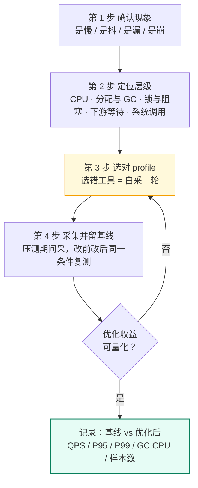
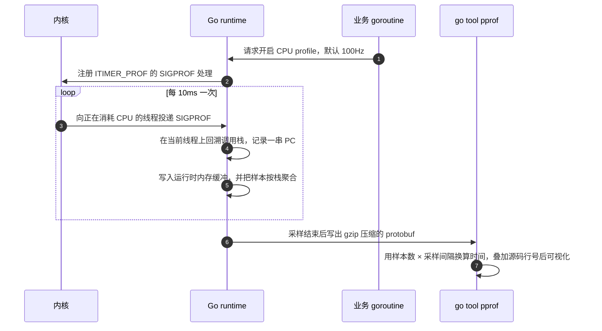
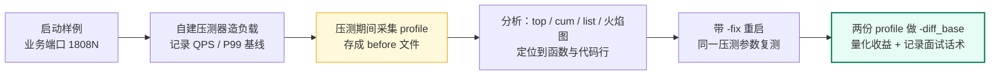

# 19-01 · 观测体系与 pprof 原理

> 属于「架构师修炼」· 19 pprof 实战 · 第 1 篇：建立观测体系，先量后调
> 上一篇：[栏目总览](./)｜下一篇：[02 CPU 火焰图实战](./02-CPU火焰图实战)｜所属主线：[架构师修炼](../)

> **这篇解决什么问题**：线上 P99 从 20ms 跳到 500ms，多数人的第一反应是「上缓存」「加机器」「调 GOGC」——**在搞清楚时间花在哪一层之前，这些动作都是赌博**。性能调优唯一可靠的开局是「先量后调」：用现象选定 profile，把瓶颈钉在某一层（应用 CPU / 分配与 GC / 锁与阻塞 / 下游等待 / 系统调用与 IO），再动手改。这一篇给：分层判定表、Go 四种观测能力的定位、11 种 profile 的采样机制与默认开关、火焰图读法、可复制的命令速查表，以及本栏目 8 个实验样例的全景图。后面 7 篇都建立在这套共同语言上。

---

## 一、先量后调：性能问题的第一步不是猜代码

### 1.1 四步定位法



四条纪律，后面每一篇都复用：

1. **空载不采**：没有流量时采出来的 profile 只是一次进程启动的快照，没有分析价值。必须「压起来再采」。
2. **先存基线**：改动之前先把 profile 存成文件（`cpu-before.pb.gz`），否则无法证明优化有效。
3. **一次只改一个变量**：改代码、调参数、加缓存不要同时做，否则归因不成立。
4. **换层要换工具**：CPU 上找不到热点不等于没问题，可能根本不在 CPU 这一层（见 1.3）。

### 1.2 五个瓶颈层与各自的证据

| 层 | 症状指纹 | 关键证据 | 首选工具 |
| --- | --- | --- | --- |
| L1 应用 CPU（计算 / 序列化 / 反射 / 拷贝） | CPU 使用率贴近核数上限，下游空闲，QPS 不再随并发增长 | 进程 CPU 打满、P99 随 QPS 线性上升 | CPU profile |
| L2 分配与 GC | GC CPU 占比高、P99 呈锯齿抖动、RSS 缓慢上涨 | `GODEBUG=gctrace=1` 里 GC 周期变密、heap goal 抬高 | allocs → heap |
| L3 锁与同步原语阻塞 | 并发升高吞吐不涨、goroutine 堆积在 Lock / chan | block 的 delay、mutex 的 contentions 与持锁者栈 | mutex + block |
| L4 下游等待（DB / Redis / RPC） | 应用 CPU 低但 P99 高、连接池 WaitCount 上涨 | 依赖的延迟分布、超时与重试计数 | 下游指标 + runtime/trace |
| L5 系统调用与 IO（文件 / 网络 / 日志） | 单请求耗时长但 CPU 极低、write/read 等待明显 | syscall 等待时间、fd 与线程数 | block + runtime/trace |

> 关键认知：**CPU profile 只统计「在 CPU 上运行」的时间**，L4 / L5 的等待在 CPU profile 里几乎不出现。所以「CPU profile 一片平地」是结论，不是失败——它说明瓶颈不在 L1。

### 1.3 现象 → 第一反应 → 该抓哪个 profile

| 现象 | 常见的第一反应（往往是错的） | 正确的第一个动作 | 该抓哪个 profile / 工具 |
| --- | --- | --- | --- |
| CPU 打满、下游空闲、QPS 不涨 | 加机器 | `-top -cum` 看应用自耗最大的函数 | CPU profile（`/debug/pprof/profile`）|
| 延迟抖动、GC CPU 高、日志里 GC 频繁 | 调大 `GOGC`、加内存 | 看「谁在制造垃圾」 | allocs（累计分配）→ heap |
| 内存只涨不降、逼近 limit 或 OOM | 重启、加内存 | 同一压测下间隔取两份快照做 diff | heap 的 `inuse_space` + `-diff_base` |
| P99 高但 CPU 不高 | 怀疑网络抖动 | 看阻塞次数与等待时长、看调度延迟 | block（同步原语）+ runtime/trace |
| goroutine 数只增不减 | 调大 `GOMAXPROCS` | 按栈聚合看协程都卡在哪一行 | goroutine（`?debug=1` / `?debug=2`）|
| 并发升高吞吐不涨、锁等待明显 | 换语言、加实例 | 看「谁持锁太久」 | mutex（先开采样）+ block |
| 逐行写文件 / 输出大 JSON 很慢 | 换 Redis、换序列化库 | 看分配量与系统调用等待 | allocs + block/trace（CPU profile 常常什么都没）|
| 下游 DB / Redis 变慢 | 立刻去改 SQL | 先确认应用侧等待发生在哪个调用 | 下游指标 + trace，应用侧看连接池 WaitCount |
| 版本升级后吞吐下降 | 直接回滚 | 同条件采同一份 profile 做对比 | 任意 profile + `-diff_base` |

---

## 二、Go 观测能力全景：四件套各回答一个问题

| 工具 | 一句话定位 | 信息粒度 | 采集开销 | 线上能不能开 | 典型问题 |
| --- | --- | --- | --- | --- | --- |
| `runtime/metrics` | 进程级数值指标 | 聚合数值（计数器 / 直方图），约上百项 | 极低（读运行时计数器）| 可以常开 | 需自己暴露；指标名带单位后缀（`:bytes` / `:cpu-seconds`），累计值要自己算速率 |
| `expvar` | 一行代码暴露业务计数器 | 键值 JSON（`/debug/vars`）| 极低 | 可以常开 | 注册表全局共享，输出无采样无历史；只适合少量关键变量 |
| `runtime/trace` | 事件级时间线（调度 / GC / syscall / block / 用户 task） | 纳秒级事件 | 高（官方定位为短时间排障采集）| 只在排障时短开数秒到数十秒 | 文件很大、必须落盘再用 `go tool trace` 打开；对时序有观测者效应 |
| `net/http/pprof` + `runtime/pprof` | 函数与代码行级画像 | 采样栈（函数 / 行）| 低（CPU 100Hz 采样、heap 平均每 512KB 采样）| 可以常开，但要隔离与管控 | block / mutex 默认不采；goroutine `?debug=2` 输出巨大；CPU profile 看不到 IO 等待 |

### 2.1 三层下钻：发现 → 定位 → 根因


### 2.2 与 OpenTelemetry / APM 的关系

| 你已有的能力 | 它回答的问题 | Go 原生对应物 |
| --- | --- | --- |
| Prometheus / OTel metrics | 哪台机器、哪个接口、什么时间开始变慢 | `runtime/metrics`、`expvar` |
| OTel traces / Jaeger | 一次请求慢在哪个服务、哪个 span | `runtime/trace`（单进程视角）|
| APM 的「慢接口 TopN」 | 哪个接口慢 | pprof 的分析入口（但要靠 CPU / heap profile 落到行）|
| 持续 profiling（Pyroscope / Parca / OTel profiling）| 长期带标签地采样 pprof，做版本对比 | 就是 pprof 数据 + 时间维度 |

结论一句话：**metrics 回答「是不是变慢了」，trace 回答「慢在哪一段调用链」，pprof 回答「慢在哪一行代码」**。APM 能告诉你「哪个服务慢」，只有 pprof 能告诉你「哪一行慢」——这也是面试里区分「会用工具」和「会调性能」的分水岭。

---

## 三、profile 类型总表

| 端点（`/debug/pprof/` 之后）| 采集什么 | 采样机制 | 默认是否开启 | 典型用途 | 常见误用 |
| --- | --- | --- | --- | --- | --- |
| `profile`（CPU）| on-CPU 时间的函数 / 行分布 | SIGPROF，默认 100Hz（每 10ms 一次）栈回溯 | 否，按需采（默认 30 秒）| 找计算热点 | 拿它分析 IO / 等待类问题（看不到）|
| `heap` | 存活对象的内存分配点 | 平均每 `MemProfileRate`=512KB 分配采一次 | 是（采样常开，开销低）| 内存占用、OOM、泄漏 | 把采样值当精确账本 |
| `allocs` | 自启动以来所有分配（含已回收）| 与 heap 同一份数据，默认视图不同 | 是 | GC 压力、分配速率 | 与 heap 混用视图，结论自相矛盾 |
| `goroutine` | 当前所有 goroutine 的栈 | 全量快照（不是采样）| 是 | 协程泄漏、卡死在哪一行 | 直接 `?debug=2` 拉全栈（线上可能几十 MB）|
| `block` | 阻塞在同步原语上的栈与时长 | 按 `SetBlockProfileRate` 阈值概率采样，默认关 | **否** | channel / select / 锁等待、P99 抖动 | 以为它能看到网络或文件 IO 等待（看不到）|
| `mutex` | 锁竞争：持锁者栈与竞争次数 | 按 `SetMutexProfileFraction` 分频采样，默认关 | **否** | 锁竞争定位到代码行 | 忘开采样，采出一份空 profile |
| `threadcreate` | 创建 OS 线程的栈 | 全量 | 是 | 线程爆炸（cgo、阻塞式 syscall）| 在纯 Go 服务上过度关注 |
| `cmdline` | 进程启动参数 | 纯文本 | 是 | 确认线上二进制版本与 flag | 拿它当配置中心用 |
| `symbol` | PC 地址到函数名 | 查表 | 是 | 无符号二进制 / 裁剪栈的补救 | 正常带符号二进制上没必要 |
| `trace` | 执行时间线（默认 1 秒）| 事件记录（非采样）| 否 | 调度延迟、GC、syscall、goroutine 阻塞 | 采太久导致文件巨大 |
| `goroutineleak` | 泄漏的 goroutine 栈 | 全量（实验特性：需以 `GOEXPERIMENT=goroutineleakprofile` 构建的工具链，旧版本没有该端点）| 否 | 增量识别「一定不会退出的协程」| 在未带该实验特性的版本上找这个端点 |

打开采集开关的代码（进程启动时调用一次）：

```go
// 采样开关：默认值必须先搞清楚，否则会采到空 profile
runtime.MemProfileRate = 512 * 1024   // 默认就是 512KB，平均每 512KB 分配采一次
runtime.SetBlockProfileRate(1)        // 默认 0 表示不采；1 = 纳秒阈值 = 每次阻塞都记
runtime.SetMutexProfileFraction(1)    // 默认 0 表示不采；n 表示平均每 n 次竞争记 1 次
```

两条必须记住的语义：

- `SetBlockProfileRate(rate)` 的 `rate` 单位是**纳秒**：阻塞时长 ≥ `rate` 的必定被记录，更短的按 `cycles/rate` 的概率抽查。所以 `rate=1` 是全量（开销最大），生产上更常见的是给一个阈值，只记明显阻塞。**单位换算一定要算对**：`1_000` = 1µs、`1_000_000` = 1ms、`10_000_000` = 10ms —— 想「只记 10ms 以上的阻塞」要写 `10_000_000`，写成 `10000` 其实只过滤掉了 10µs 以下的抖动，几乎等于全采样。
- `mutex` profile 记录的是**持锁者的栈**（运行时把这次竞争「记在导致延迟的那次 Unlock 上」，同时把后面排队者的等待也一并算进去），所以它直接指向「临界区代码写得太大」的位置；`block` profile 记录的则是**等待者的栈**。一个定位元凶，一个定位受害者，配合使用。

> 生产环境的开关策略、鉴权与采多久，统一放在 [06 生产环境 pprof 实践](./06-生产环境pprof实践)；本篇只讲清机制。

---

## 四、CPU profile 采样原理

### 4.1 采样链路



`runtime/pprof` 里这段逻辑的开头注释写得很直白：操作系统触发信号的频率很难超过约 500Hz，而且处理信号本身不便宜（主要是抓栈），**100Hz 是「足够有用、又不至于拖慢系统」的折中**，而且是好算的整数——1 个样本 ≈ 10ms。所以：

- 30 秒 ≈ 3000 个样本，10 秒 ≈ 1000 个样本；
- `SetCPUProfileRate(hz)` 必须在 `StartCPUProfile` **之前**调用，profile 已经开启时改速率无效，必须先停。

### 4.2 采多久才有结论

| 采集时长 | 样本数（@100Hz）| 结论可信度 | 适用场景 |
| --- | --- | --- | --- |
| 1~3 秒 | 100~300 | 只能看「最大的那一坨」，噪声大 | 快速确认是不是 CPU 问题 |
| 10 秒 | 约 1000 | 前 10 名函数基本可信 | 日常排查的下限 |
| 30 秒 | 约 3000 | 前 30 名、行级定位都可信 | **本篇与后续实战的默认值** |
| 60 秒以上 | 6000+ | 长尾函数（占 1% 以下）也能看见 | 优化收益进入「个百分点」阶段 |

经验规则：**目标至少 1000 个样本，默认 30 秒，并且必须在压测期间采集**。一次 2 秒、没有流量的 profile，属于无效数据。

### 4.3 两个最容易误解的点

**（1）「短于 10ms 的函数看不见」这句话只对一半。**
采样是按时间加权的：一个只跑 1ms 的函数，如果每秒被调用 1000 次，它每秒照样占满 1 秒 CPU，样本会非常充裕。真正看不见的是**总 CPU 时间占比很小**的代码，以及被内联而合并到调用方的帧（这种情况下要看 `-list` 的行级标注，或注意火焰图上「没有边框分隔」的内联合并）。

**（2）CPU profile 只统计在 CPU 上跑的时间。**
网络等待、`time.Sleep`、channel 阻塞、等待 DB 返回、被调度器挂起、写文件阻塞，全都不产生 CPU 样本。所以 CPU 打满与否，与「请求慢」是两件事。IO 密集 / 等待密集的问题要靠 `block`、`runtime/trace` 或自己打的 wall time 埋点。

### 4.4 在 CPU profile 里识别「症状」与「根因」

| profile 里出现 | 说明什么 | 该转去哪里 |
| --- | --- | --- |
| `runtime.gcDrain` / `gcBgMarkWorker` / `scanobject` | CPU 被 GC 标记吃掉 | 去 [03 内存与 GC 实战](./03-内存与GC实战) 看 alloc_space |
| `runtime.mallocgc` 占比高 | 分配太频繁，分配器本身成了热点 | 同上 |
| `runtime.lock2` / `sync.(*Mutex).Lock` / `sync.(*RWMutex)` | 锁竞争，CPU 花在自旋与调度上 | 去 [04 goroutine 与锁阻塞实战](./04-goroutine与锁阻塞实战) |
| `encoding/json` / `reflect.*` / 字符串拼接 | 真·业务热点，改这里收益最直接 | [02 CPU 火焰图实战](./02-CPU火焰图实战) |
| `syscall.Syscall` / `internal/poll` | 往往是系统调用的进入退出成本，不是等待本身 | [07 实战案例集](./07-实战案例集) |

一句话：**火焰图上 `cum` 高但 `flat` 极低的这些运行时函数是「症状」，不是「病灶」**，顺着它们去对应的 profile 找根因。

---

## 五、heap profile 的采样机制

### 5.1 默认是采样，不是全量

`runtime.MemProfileRate` 默认 `512 * 1024`，含义是**平均每分配 512KB 采一次**（在分配路径上按大小加权地决定是否采样，采样值再乘以采样率还原成估计值）。由此推出三个实用结论：

- 大分配（MB 级）几乎必然被采到，定位很准；
- 小对象（几十字节）被采中的概率低，**同一类小对象的绝对字节数只能看量级**，不要拿去当账单；
- 真正的可靠性来自**对比两次快照**（见 5.3），而不是读某一次的绝对值。

> 想让采样更精细可以调小 `MemProfileRate`（例如改成 `1`），代价是分配路径变慢、内存占用上升——只在本地定位时用，别在线上改。改了之后要在 `main` 最开头**只改一次**：处理 profile 的工具假设该值在进程生命周期内恒定。

### 5.2 四个视图各看什么

| 视图 | 含义 | 什么时候看 | 对应直觉 |
| --- | --- | --- | --- |
| `inuse_space` | 当前存活对象占用的字节（快照）| 内存占用高、OOM、RSS 只涨不降 | 「现在堆里有什么」|
| `inuse_objects` | 当前存活对象的个数（快照）| 怀疑对象数泄漏，字节数却不明显 | 「现在堆里有多少个」|
| `alloc_space` | 自进程启动累计分配的字节（累积）| GC CPU 高、P99 抖动、想知道谁在造垃圾 | 「一共造了多少垃圾」|
| `alloc_objects` | 自进程启动累计分配的对象个数 | 循环里的小对象、过多的临时对象 | 「分配得有多频繁」|

心智模型：**内存占用看 `inuse_*`，GC 压力看 `alloc_*`**。`heap` 与 `allocs` 是同一份采样数据的两个默认视图（heap 默认 `inuse_space`，allocs 默认 `alloc_space`），用 `-sample_index` 可以在同一份数据里切换，不必重新采集。

### 5.3 增量、强制 GC 与两次快照对比

| 手段 | 写法 | 语义 |
| --- | --- | --- |
| 强制 GC 后再快照 | `?gc=1` | 先跑一次 GC，把「待回收垃圾」清掉，快照更接近真实存活（会有一次 STW，线上慎用）|
| 拿「这段时间的增量」 | `?seconds=20` | 对 heap / allocs / block / mutex / goroutine：先取一份、等 N 秒、再取一份，返回**两者之差**（不是「采集 20 秒」）|
| 对比两次快照（看增长，也看收缩）| `-diff_base=before.pb.gz` | 百分比相对 base 总量，可能出现负值；火焰图宽度 = 子树增减绝对值之和，红色 = 净增、绿色 = 净减 |
| 从一个累积 profile 里做减法 | `-base=before.pb.gz` | 用于同一程序的累积型 profile（alloc_space / block / mutex），百分比相对「源减 base」的差值总量 |
| 两份采集时长不同要对齐 | `-normalize` | 先把源 profile 缩放到与 base 同总量再相减 |

泄漏判定范式（后面 [03 篇](./03-内存与GC实战) 会用 L06 完整演示）：同一进程、同一压测参数下，间隔 10~30 分钟取两份 `inuse_space`，做 `-diff_base`；**依然持续正增长的那条调用路径就是泄漏点**。如果 diff 没有任何增长点而 RSS 仍在涨，说明问题不在 Go 堆内（栈、goroutine、cgo、内存碎片），转到 [05 常见问题排查手册](./05-常见问题排查手册)。

---

## 六、火焰图怎么读

```text
        宽度 = 该函数占的样本比例（不是时间轴！）
   ┌──────────────────────────────────────────────────────┐
   │                     main.main                        │  <- 根在上
   ├───────────────────────┬──────────────────────────────┤
   │   http handler        │        gcBgMarkWorker        │
   ├───────────┬───────────┼──────────────┬───────────────┤
   │ json.Marshal          │  render 自耗 │  gcDrain      │  <- 被调用者在下
   ├───────────┴─────┬─────┴──────────────┴───────────────┤
   │  reflect.Value  │  strings 拼接（宽而"平" = 真热点）  │
   └─────────────────┴────────────────────────────────────┘
```

三条读图规则（先记结论）：

1. **横轴是样本占比的堆叠，不是时间轴**；pprof 里同一父节点下的子框按占比从大到小、从左到右排列，所以横向相邻位置没有时间含义。
2. **纵轴是调用栈深度**；pprof Web UI 的根节点在上、被调用者在下方（与 Brendan Gregg 原版火焰图上下相反）。没有黑色边框分隔的两层 = 发生了内联。
3. **宽度就是占比**。宽而「平」（自己这一层就宽，`flat` 高）= 这个函数自己在耗 CPU；宽而「深」（宽度主要来自下层子框）= 真正的热点在更下面，继续下钻。

| 指标 | 定义 | 用途 | 陷阱 |
| --- | --- | --- | --- |
| `flat` | 该函数自身消耗的样本（不含被调函数）| 找真正要改的那几行 | `flat` 小就说明改它没收益，哪怕它在图上很显眼 |
| `cum` | 该函数 + 其全部被调函数的样本 | 判断整条调用链的占比、定位入口 | `cum` 高不等于它慢（它可能只是「调度者」）|
| 采样值（如 `1.23s`）| 样本数 × 采样间隔换算出的估计时间 | 估算优化收益上限 | 是 CPU 时间，不含等待；不要拿去对应用户体感的 P99 |

常用报告命令各自的用途：

| 命令 | 输出 | 什么时候用 |
| --- | --- | --- |
| `-top` | 按 `flat` 排序的函数表（含 flat / cum / 占比）| **第一眼永远先看它**，拿到前 10 个热点 |
| `-top -cum` | 按 `cum` 排序 | 找入口级占比，看清「哪条链路最贵」|
| `-list=函数名` | 该函数逐行标注（两个数字：本行自耗 / 含被调）| 定位到具体代码行，准备动手改 |
| `-peek=正则` | 该函数及其调用者 / 被调用者，不裁剪 | 确认「谁在调它、它又调了谁」|
| `-traces` | 每个样本一条完整调用栈 | 找偶发但特征明显的栈，配合 `grep` 统计 |
| `-tree` | 每个节点的前驱与后继 | 想要文本版调用树时 |

---

## 七、采集入口与命令速查

### 7.1 挂载方式

`net/http/pprof` 的处理器默认注册在 `http.DefaultServeMux` 上，所以最简单的挂法是把 pprof 服务放在**独立端口**，业务端口完全不暴露 `/debug/pprof`——本栏目所有样例都遵循这个两端口约定（业务 `1808N`、管理 `1908N`）：

```go
import (
	"log"
	"net/http"
	_ "net/http/pprof" // 只导入副作用：把 /debug/pprof/* 注册到 DefaultServeMux
)

func main() {
	// 管理端口只监听回环地址，业务端口不要复用 DefaultServeMux
	go func() {
		log.Println(http.ListenAndServe("127.0.0.1:19081", nil))
	}()
	// ... 业务 mux 与 18081 端口
}
```

要完全掌控暴露面，可以显式注册到一个专用 mux（`pprof.Index` 负责分发 `/debug/pprof/<name>` 这些命名 profile）：

```go
pprofMux := http.NewServeMux()
pprofMux.HandleFunc("/debug/pprof/", pprof.Index)
pprofMux.HandleFunc("/debug/pprof/cmdline", pprof.Cmdline)
pprofMux.HandleFunc("/debug/pprof/profile", pprof.Profile)
pprofMux.HandleFunc("/debug/pprof/symbol", pprof.Symbol)
pprofMux.HandleFunc("/debug/pprof/trace", pprof.Trace)
```

### 7.2 命令速查表（可直接复制）

| 目标 | 命令 |
| --- | --- |
| 打开交互 Web UI（火焰图 / Graph / Source）| `go tool pprof -http=:9090 'http://127.0.0.1:19081/debug/pprof/profile?seconds=30'` |
| 文本版热点 TopN | `go tool pprof -top -nodecount=20 'http://127.0.0.1:19081/debug/pprof/profile?seconds=30'` |
| 按 cum 排序看调用链 | `go tool pprof -top -cum 'http://127.0.0.1:19081/debug/pprof/profile?seconds=30'` |
| 定位到代码行 | `go tool pprof -list='render' 'http://127.0.0.1:19081/debug/pprof/profile?seconds=30'` |
| 用 `-seconds` 代替 URL 参数 | `go tool pprof -seconds=30 -top 'http://127.0.0.1:19081/debug/pprof/profile'` |
| 查看存活内存（默认视图）| `go tool pprof -top 'http://127.0.0.1:19081/debug/pprof/heap'` |
| 查看 GC 压力（累计分配）| `go tool pprof -top -sample_index=alloc_space 'http://127.0.0.1:19081/debug/pprof/allocs'` |
| 对比两次内存快照 | `go tool pprof -top -sample_index=inuse_space -diff_base=heap-before.pb.gz heap-after.pb.gz` |
| 协程数按栈聚合 | `curl -s 'http://127.0.0.1:19083/debug/pprof/goroutine?debug=1'` |
| 协程全栈（等于 panic 格式）| `curl -s 'http://127.0.0.1:19083/debug/pprof/goroutine?debug=2'` |
| 阻塞画像（需先开采样）| `go tool pprof -top 'http://127.0.0.1:19085/debug/pprof/block'` |
| 锁竞争画像（需先开采样）| `go tool pprof -top -contentions 'http://127.0.0.1:19084/debug/pprof/mutex'` |
| 保存离线 profile 文件 | `curl -o cpu.pb.gz 'http://127.0.0.1:19081/debug/pprof/profile?seconds=30'` |
| 采集执行 trace | `curl -o trace.out 'http://127.0.0.1:19085/debug/pprof/trace?seconds=5'` |
| 打开 trace | `go tool trace trace.out` |
| 先看 GC 是否异常（最便宜的观察）| `GODEBUG=gctrace=1 go run ./cmd/l02-alloc-gc` |
| 符号化选项 | `go tool pprof -symbolize=none -top cpu.pb.gz`（`none` / `local` / `fastlocal` / `remote`，细节与坑见 [05 篇](./05-常见问题排查手册)）|

三点使用说明：

- `?seconds=N` 在 `profile` 与 `trace` 上是**采集时长**（`profile` 不写默认 30 秒，`trace` 不写默认 1 秒）；在 `heap` / `allocs` / `block` / `mutex` / `goroutine` 上是**增量快照的间隔**，返回的是差值 profile。
- `/debug/pprof/heap?gc=1` 会先强制一次 GC；`?debug=1` 让响应变成可读文本（默认是二进制 protobuf，给工具读）。
- 若执行时报 `no such tool "pprof"`：先查 `go env GOCACHE` 是否可写（Go 1.26 起 `go tool` 是**按需从 `$GOROOT/src/cmd/pprof` 源码构建**，构建缓存不可写就会报这个错），`GOCACHE=$(mktemp -d) go tool pprof ...` 通常立刻可用；确实需要独立二进制时再 `go install github.com/google/pprof@latest`（需要网络，二进制落在 `$GOPATH/bin`）。完整的三种成因与修法见 [05 常见问题排查手册 · F27](./05-常见问题排查手册)。

---

## 八、实验清单总表

本栏目**所有实例都在 `code/perf/pprof-lab/`**（独立 go module：`module gocampus/perf/pprof-lab`，`go 1.22`，仅标准库、零第三方依赖）。统一约定：

- **业务端口 `1808N`，pprof 管理端口 `1908N`（= 业务端口 + 1000）**，`N` 为样例编号；
- flag：`-addr`（默认 `127.0.0.1:1808N`）、`-pprof-addr`（默认 `127.0.0.1:1908N`）、`-fix`（默认 `false`，开启后使用修复实现）；
- 对比方式：同一压测参数下，`-fix=false` 采一份基线，`-fix=true` 采一份优化后，两份 profile 做 `-diff_base` 对比。

| ID | 目录 | 启动命令 | 业务端点 | 制造的问题 | 该抓哪个 profile | 对应篇章 |
| --- | --- | --- | --- | --- | --- | --- |
| L01 | `cmd/l01-cpu-hotspot` | `go run ./cmd/l01-cpu-hotspot` | `GET /api/render?n=2000` | CPU 打满：反射 + JSON 序列化 + 字符串拼接 | CPU profile（`profile`）| [02 CPU 火焰图实战](./02-CPU火焰图实战) |
| L02 | `cmd/l02-alloc-gc` | `go run ./cmd/l02-alloc-gc` | `GET /api/thumb?id=1` | 每请求 MB 级分配 → GC CPU 高、P99 抖 | `allocs`（谁在造垃圾）→ `heap` | [03 内存与 GC 实战](./03-内存与GC实战) |
| L03 | `cmd/l03-goroutine-leak` | `go run ./cmd/l03-goroutine-leak` | `GET /api/task/start`、`GET /api/task/count` | goroutine 只增不减（Ticker 未停、无退出信号）| `goroutine?debug=1/2`（+ trace）| [04 goroutine 与锁阻塞实战](./04-goroutine与锁阻塞实战) |
| L04 | `cmd/l04-lock-contention` | `go run ./cmd/l04-lock-contention` | `GET /api/counter?k=hot` | 全局 mutex 竞争 | `mutex`（先开采样）+ `block` | [04 goroutine 与锁阻塞实战](./04-goroutine与锁阻塞实战) |
| L05 | `cmd/l05-channel-block` | `go run ./cmd/l05-channel-block` | `GET /api/pipeline` | 无缓冲 channel 串行阻塞 | `block` + `runtime/trace` | [04 goroutine 与锁阻塞实战](./04-goroutine与锁阻塞实战) |
| L06 | `cmd/l06-memory-retention` | `go run ./cmd/l06-memory-retention` | `GET /api/cache/put`、`GET /api/cache/stats` | 全局 map/slice 长期持有 → heap 只涨不降 | `heap` 两次快照 `inuse_space` + `-diff_base` | [03 内存与 GC 实战](./03-内存与GC实战) |
| L07 | `cmd/l07-io-serialization` | `go run ./cmd/l07-io-serialization` | `GET /api/export` | 逐行 `fmt.Fprintf` + 未预分配 | `allocs` + `block`/`trace`（CPU profile 基本看不到）| [07 实战案例集](./07-实战案例集) |
| load | `cmd/load` | `go run ./cmd/load -url=http://127.0.0.1:18081/api/render?n=2000 -c=50 -d=20s` | 自建压测器（不依赖 wrk）| 输出 QPS / P50 / P95 / P99 / 错误数 | 不采 profile（它是负载源）| [13 容量规划压测与故障演练](/架构师修炼/13-容量规划压测与故障演练) |

### 8.1 一次完整闭环（以 L01 为例）

```bash
cd code/perf/pprof-lab

# 终端 A：启动被测服务（业务 18081 + pprof 管理 19081）
go run ./cmd/l01-cpu-hotspot

# 终端 B：把负载压起来，20 秒并发 50
go run ./cmd/load -url=http://127.0.0.1:18081/api/render?n=2000 -c=50 -d=20s

# 终端 C：压测进行中采集 30 秒 CPU profile，并留作基线
curl -o cpu-before.pb.gz 'http://127.0.0.1:19081/debug/pprof/profile?seconds=30'

# 分析：先 top，再按 cum，最后定位到行
go tool pprof -top -nodecount=20 cpu-before.pb.gz
go tool pprof -top -cum cpu-before.pb.gz
go tool pprof -list='render' cpu-before.pb.gz

# 打开火焰图看整体形状
go tool pprof -http=:9090 cpu-before.pb.gz
```

### 8.2 实验闭环示意



> 这些样例只是「可控的故障源」，不是生产实践：真实线上还要考虑采样开关、鉴权、采集窗口与并发采集的相互干扰，见 [06 生产环境 pprof 实践](./06-生产环境pprof实践)。

---

## 九、与架构学习的衔接

### 9.1 四个天花板 = 四类 profile 的落点

[02 单体架构的极限与分层](/架构师修炼/02-单体架构的极限与分层) 给的「单机四个天花板（CPU / 连接数 / 内存与 GC / 锁）」，正是本篇 profile 体系的落点：

| 天花板（02 篇）| 症状 | 本篇对应 profile | 深入实战 |
| --- | --- | --- | --- |
| CPU | CPU 打满、下游空闲、QPS 停滞 | CPU profile | [02 CPU 火焰图实战](./02-CPU火焰图实战) |
| 连接数 | fd / 连接数到顶、连接池等待 | `goroutine` + `runtime/metrics` | [04 goroutine 与锁阻塞实战](./04-goroutine与锁阻塞实战) |
| 内存与 GC | GC CPU 高、RSS 上涨、P99 锯齿 | `heap` / `allocs` | [03 内存与 GC 实战](./03-内存与GC实战) |
| 锁 | 并发升高吞吐不涨、等待明显 | `mutex` / `block` | [04 goroutine 与锁阻塞实战](./04-goroutine与锁阻塞实战) |

### 9.2 与主线篇章的三处接口

- **优化顺序与 QPS 量级**：[01 QPS 分级与架构演进地图](/架构师修炼/01-QPS分级与架构演进地图) 给出的顺序是「先把应用内热点削掉 → 再上本地缓存 → 再读分离 / 缓存 → 再分片」。pprof 只负责第一段，但它是**性价比最高**的一段：改几行代码往往就能把单机吞吐抬升数倍，而中间件要付出机器与运维成本。
- **压测找拐点**：[13 容量规划压测与故障演练](/架构师修炼/13-容量规划压测与故障演练) 里「固定 RPS 阶梯加压、QPS 停滞而 P99 翻倍即为拐点」的方法，需要本栏目这个自建压测器（`cmd/load`）作为最小实现；采集 profile 必须发生在加压期间，否则数据无效。
- **容量规划的口径**：优化前后都要用**同一套压测参数**复测，QPS 拐点与 P99 才有可比性；这也是本栏目每个实验都要求记录「基线 vs 优化后」的原因。

---

## 十、本篇小结

- 性能问题的第一步是**确认瓶颈在哪一层**，不是猜代码；五层判定表和「现象 → profile」对照表是后面所有篇章的公共入口。
- 四种观测能力各回答一个问题：**metrics 是否变慢、trace 慢在哪一段、pprof 慢在哪一行**；APM/OTel 负责发现，pprof 负责落到代码行。
- 采样是理解一切 pprof 结论的前提：**CPU 是 100Hz 信号采样且只统计 on-CPU 时间，heap 是平均每 512KB 分配采样，block/mutex 默认不采**。
- 火焰图读的是「占比」：`flat` 高才是热点，`cum` 高只是链路贵；顶部宽而平自己改，宽而深继续下钻。
- 下一篇进入第一个战场：[02 CPU 火焰图实战](./02-CPU火焰图实战)，用 L01 把这张图真正读一遍。

---

## 面试追问链（带答案）

1. **「线上接口变慢了，你的第一步是什么？」**
   → 先量后调：① 用现象确认层级（CPU 打满？GC 高？锁等待？下游慢？）；② 按判定表选 profile——CPU 高且下游空闲抓 CPU profile，GC CPU 高抓 allocs/heap，P99 抖但 CPU 低抓 block/mutex，CPU 极低且单请求耗时长抓 trace；③ **在压测期间采集**并把当前 profile 存成基线；④ 改完用同一压测参数复测对比。一句话背诵：**「先确认瓶颈在哪一层，再决定改什么；选错工具比不采还糟。」**

2. **「pprof、trace、metrics 怎么分工？」**
   → metrics 回答「是不是变慢了、什么时候开始」，trace 回答「慢在哪一段调用链、是调度还是 IO」，pprof 回答「慢在哪一行代码」。一句话背诵：**「metrics 发现异常，trace 定位环节，pprof 定位代码行——APM 只能说哪个服务慢，pprof 才能说哪一行慢。」**

3. **「CPU profile 的原理是什么？为什么有时候看不到热点？」**
   → 运行时注册 `SIGPROF`，默认 100Hz（每 10ms）中断线程并回溯调用栈，样本数 × 采样间隔换算成时间；它**只统计在 CPU 上运行的时间**，所以 IO / DB / channel 等待类问题在图上几乎空白。一句话背诵：**「100Hz 信号采样 + 栈回溯，只统计 on-CPU 时间——CPU 图一片平地就说明瓶颈不在 CPU，要去 block 和 trace。」**

4. **「为什么你的 block / mutex profile 是空的？」**
   → 因为两者**默认 rate=0 不采样**，必须先 `runtime.SetBlockProfileRate(rate)`（单位**纳秒**，`1` = 全采，生产常用 `1_000_000` = 1ms 阈值，注意别把 10ms 写成 `10000`）和 `runtime.SetMutexProfileFraction(n)`（平均每 n 次竞争记 1 次）。另外 block profile 只覆盖同步原语（channel / select / 信号量 / 锁），`time.Sleep`、网络与文件 IO 的等待不在里面。一句话背诵：**「没开采样就是空 profile；block 只认同步原语，IO 等待要上 trace。」**

5. **「heap profile 的数字准吗？」**
   → 不准，它是采样：默认平均每 512KB 分配采一次，样本再按采样率缩放成估计值，小对象的绝对量只能看量级、大分配定位很准。所以实践上不读单次绝对值，而是**取两份快照做 diff 看增长**。一句话背诵：**「heap 是采样估计值，大分配准、小对象看排名；要下结论就对比两次快照。」**

6. **「`inuse_space` 和 `alloc_space` 分别什么时候看？」**
   → 内存占用、OOM、RSS 只涨不降看 `inuse_space`（配 `inuse_objects` 看对象数）；GC CPU 高、P99 抖动、想知道谁在造垃圾看 `alloc_space`（配 `alloc_objects` 看分配频次）。一句话背诵：**「占用看 inuse，GC 压力看 alloc；heap 和 allocs 是同一份数据的两个默认视图。」**

7. **「mutex profile 和 block profile 都能看锁，区别是什么？」**
   → block 记录**等待者**的栈与阻塞时长（谁在等、等在哪），mutex 记录**持锁者**的栈与竞争次数（谁持有太久，运行时把竞争记在导致延迟的那次 Unlock 上）。一句话背诵：**「block 找受害者，mutex 找元凶，两个一起看才能既知道谁在等、又知道谁该缩小临界区。」**

8. **「火焰图怎么看？」**
   → 横轴是样本占比的堆叠（不是时间轴，pprof 里同一父节点下按占比从大到小排列），纵轴是栈深度（pprof 根在上），宽度是该函数的占比；**宽而平 = 这个函数自己在耗 CPU，宽而深 = 热点在更下层继续下钻**；再结合 `flat`/`cum` 判断「自己耗」还是「链路贵」。一句话背诵：**「先看顶部最宽的那一块，flat 高才是真热点；运行时函数 flat 极低却 cum 很高，那只是症状。」**

## 自测清单

- [ ] 能说出「先量后调」的四步，并解释为什么第一步不是猜代码
- [ ] 能背出五个瓶颈层（应用 CPU / 分配与 GC / 锁与阻塞 / 下游等待 / 系统调用与 IO）各自的症状指纹
- [ ] 给定 5 种线上现象，能立即说出该抓哪个 profile（含两个「默认采不到」的坑）
- [ ] 能说清 metrics / trace / pprof 各回答什么问题，以及 APM 与 pprof 的边界
- [ ] 能背出 CPU profile 的采样机制（SIGPROF、100Hz、栈回溯）与「至少 1000 样本 / 30 秒 / 压测期间」的规则
- [ ] 能解释为什么 CPU profile 看不到 IO 与等待，以及该换成什么工具
- [ ] 能说出 `MemProfileRate` 的默认值、含义，以及为什么小对象统计有偏差
- [ ] 能区分 `inuse_space` / `alloc_space` / `inuse_objects` / `alloc_objects` 的适用场景
- [ ] 能写出 `-base` 与 `-diff_base` 的区别，并说明泄漏排查为什么用 `-diff_base`
- [ ] 能解释 block profile 的 rate 语义与 mutex profile 记录「持锁者栈」的原因
- [ ] 能说出 pprof 火焰图的横轴含义，并用 `flat` / `cum` 判断真热点
- [ ] 能不看文档写出 `go tool pprof -top -cum`、`-list`、`?seconds=`、`?gc=1` 这四条最常用命令
- [ ] 能说清本栏目 8 个实验样例各制造什么问题、该抓哪个 profile、用 `-fix` 对比什么
- [ ] 能解释「四个天花板」与四类 profile 的对应关系，并说出优化顺序为什么先削应用内热点

> **下一篇**：[02 CPU 火焰图实战](./02-CPU火焰图实战) —— 用 L01 把 `top / cum / list / 火焰图` 走一遍，把「CPU 打满」从现象变成一行行可改的代码。
