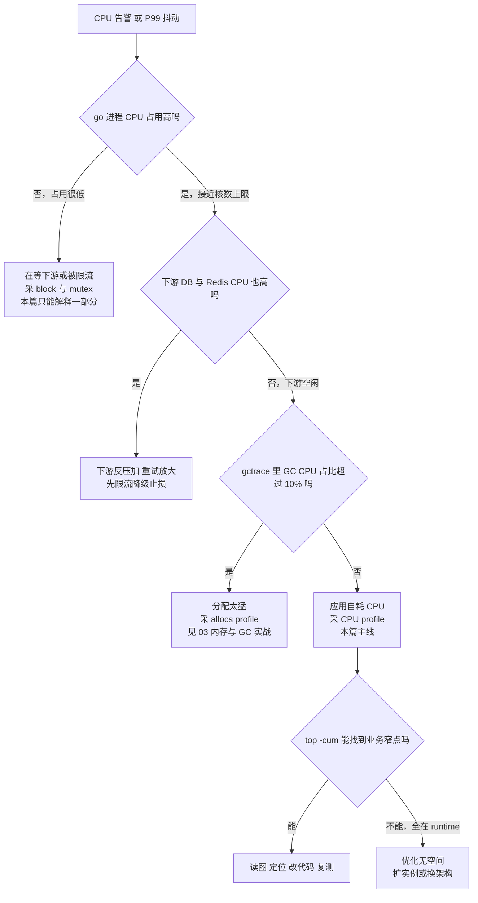
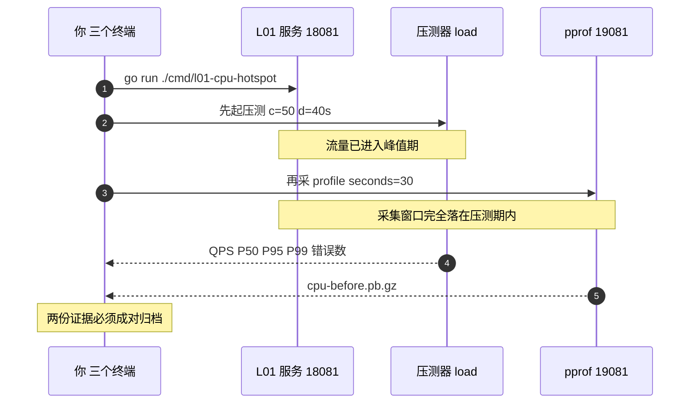
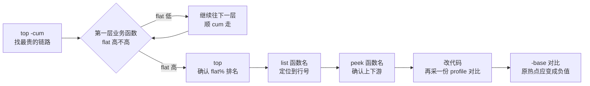
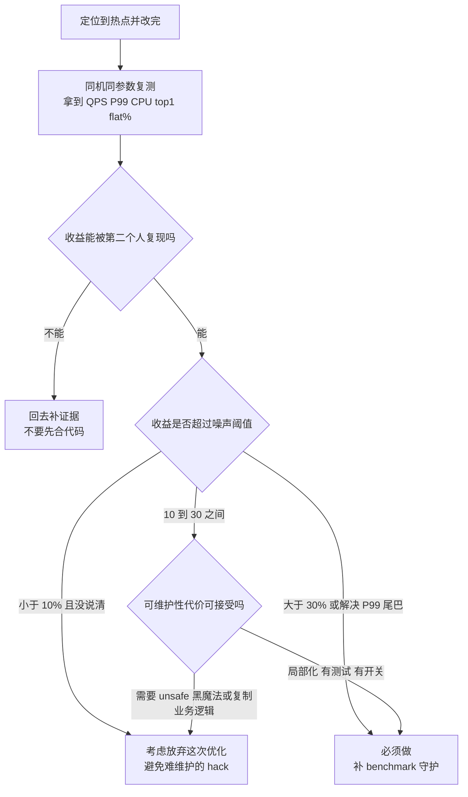
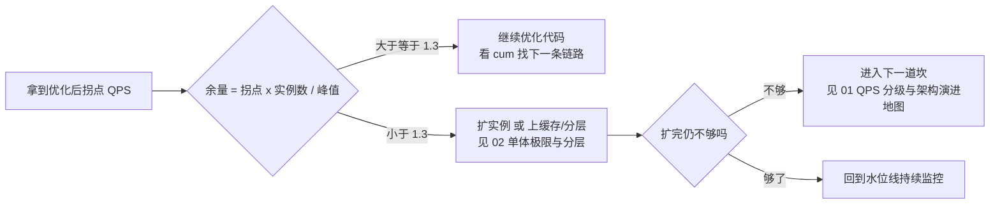

# 19-02 · CPU 火焰图实战：把热点定位到一行代码

> 属于「架构师修炼」· 19 pprof 实战 · 第 2 篇：CPU 火焰图定位热点
> 上一篇：[01 观测体系与 pprof 原理](./01-观测体系与pprof原理)｜下一篇：[03 内存与 GC 实战](./03-内存与GC实战)｜栏目总览：[架构师修炼](../)

> **这篇解决什么问题**：CPU 打到 90%，P99 从 30ms 涨到 800ms，你把业务代码从头读了一遍——「逻辑没问题啊」。这一篇给一条**可复现的四步流程**：**① 分诊**（应用自耗还是等下游）→ **② 采集**（拿一份可信的 CPU profile）→ **③ 读图**（先 cum 找链路，再 flat 找自耗，最后 list 到行号）→ **④ 修复对比**（用同一套压测证明收益）。全程只用标准库 + `go tool pprof`；实验代码对应冻结清单里的 `code/perf/pprof-lab/`（独立 module `gocampus/perf/pprof-lab`，仅标准库），**本文只引用清单里的端口、flag 与命令，不虚构任何文件与输出**。

---

## 一、先分诊：CPU 高是「应用自耗」还是「在等下游」

**结论先行**：CPU 类问题只有两类成因，判错了后面全白做。**先花 5 分钟分诊，再决定采哪种 profile**——采错 profile 等于白烧 30 秒线上算力。

| 现象组合 | 判定 | 第一动作 | 采什么 |
| --- | --- | --- | --- |
| go 进程 `%CPU` 高（接近核数 × 100%），下游 DB/Redis `%CPU` 低，QPS 上不去 | **应用自耗 CPU**（计算瓶颈） | 本篇主线：CPU 火焰图 | `/debug/pprof/profile` |
| go 进程 `%CPU` 不高（< 30%），但 P99 高、并发上不去 | **在等下游 / 被限流** | 看等待链路，别再看 CPU 图 | `/debug/pprof/block` + `/debug/pprof/mutex` |
| go 进程 `%CPU` 高，且 `gctrace` 里 GC CPU 占比 > 10% | **分配太猛，CPU 花在 GC 上** | 先减少分配，再谈算法 | `/debug/pprof/allocs` |
| go 进程与下游 `%CPU` 同时高 | **下游反压 + 重试放大** | 先限流/降级止损，再查下游 | `/debug/pprof/block` + 下游自身监控 |
| `%CPU` 高但 `top -H` 里 CPU 集中在一两个线程 | **锁自旋或串行化** | 分片锁/atomic/减少临界区 | `/debug/pprof/mutex` + CPU 图交叉看 |



### 1.1 三条判别命令

```bash
# ① 看进程整体 CPU（top 里 100% = 1 个核；8 核机器要 800% 才叫打满）
#    go run 的进程名形如 .../exe/l01-cpu-hotspot，用 pgrep 找 PID
pgrep -fl l01-cpu-hotspot

# Linux 生产机：-p 指定 PID，-H 打开线程视图（看是不是 GC 线程/单个 worker 在烧）
top -H -p "$PID"

# macOS 本地实验：没有 -H，用 -pid
top -pid "$PID"

# ② 单进程 CPU 分解：%usr 应用态 / %system 内核态 / %wait 等待（Linux，需 sysstat）
pidstat -p "$PID" 1

# ③ GC 是否在偷 CPU：让服务把 gctrace 打到 stderr（默认写 stderr）
GODEBUG=gctrace=1 go run ./cmd/l01-cpu-hotspot
```

`gctrace` 一行怎么读（字段含义固定）：

```text
gc 14 @12.345s 5%: 0.12+1.3+0.008 ms clock, 0.96+2.1/3.4/2.2+0.064 ms cpu, 120->145->80 MB, 160 MB goal, 8 P
   │      │    │                              │                        │                │          └ 参与并行的 P 数
   │      │    │                              │                        │                └ 下次 GC 触发目标堆大小
   │      │    │                              │                        └ GC 前堆 -> GC 峰值堆 -> GC 后存活堆
   │      │    │                              └ 各阶段 CPU 时间：标记准备/标记/标记终止
   │      │    └ GC 占总 CPU 的比例 —— 大于 10% 说明分配太猛，不要继续调算法
   │      └ 距进程启动的时间
   └ 第几次 GC
```

> **判定标准**：`5%` 这一列持续 > 10%，或 `-> 80 MB` 这个**存活堆**数字一路单调上涨，都不是 CPU 算法问题——前者去看 [03 内存与 GC 实战](./03-内存与GC实战)，后者是内存滞留（样例 L06 的场景）。

### 1.2 为什么必须先分诊：四个天花板里 CPU 只占一个

单机的极限是**四个独立天花板**（CPU / 连接数 / 内存与 GC / 锁），谁先到谁才是瓶颈——详见 [02 单体架构的极限与分层](/架构师修炼/02-单体架构的极限与分层)。用 pprof 削 CPU 热点只对第一个天花板有效：**如果瓶颈是连接池 `WaitCount` 上涨或锁竞争，CPU 火焰图会给你一张漂亮的、但完全无关的图**。所以分诊表不是流程装饰，它是「别做无用功」的闸门。

---

## 二、采集三件套：一份可信 CPU profile 的三个前提

**前提一：命令写对。前提二：采集窗口覆盖压测峰值。前提三：知道 CPU profile 的统计口径。**

### 2.1 三条采集命令

```bash
cd code/perf/pprof-lab

# ① 一条命令搞定：采集 + 直接拉起浏览器 UI（本地实验最常用）
go tool pprof -http=:9090 'http://127.0.0.1:19081/debug/pprof/profile?seconds=30'

# ② 离线保存：先落盘再分析（生产推荐，避免网络 RTT 抖动影响采集与后续复盘）
curl -o cpu-before.pb.gz 'http://127.0.0.1:19081/debug/pprof/profile?seconds=30'
go tool pprof -http=:9090 cpu-before.pb.gz

# ③ 终端里快速看（不启 UI，SSH 到生产机时最有用）
go tool pprof -top -cum cpu-before.pb.gz
```

三个要点：

| 要点 | 说明 | 反例 |
| --- | --- | --- |
| `seconds` 与压测时长**必须重叠** | 规则：**先起压测，再采 profile，采集窗口覆盖峰值期**。压测跑 20s、profile 采 30s 且晚 2~3s 开始，则至少 17s 采样落在真实负载上 | 压测跑完再采 → 采到的是空闲服务，火焰图全是 runtime 后台栈 |
| 采样频率固定 100Hz | Go CPU profile 用 `SIGPROF` 以 **100Hz** 采样，1 个样本 ≈ 10ms on-CPU。30s ≈ 3000 样本；**短于 10s 的 profile 噪声大**，1% 级别的差异不可信 | 采 3s 就说「这个函数只占 1%，可以忽略」 |
| 端口约定 | 业务口 `1808N`，pprof 管理口 `1908N = 1808N + 1000`。L01：业务 `18081` / pprof `19081`；L07：`18087` / `19087` | 把业务口当 pprof 口，`curl` 拿到 404 |

```bash
# 覆盖峰值期的推荐做法：压测时长 = 采集时长 + 缓冲（40s 压测覆盖 30s 采集窗口）
go run ./cmd/load -url='http://127.0.0.1:18081/api/render?n=2000' -c=50 -d=40s
```

### 2.2 采集与压测的时序（必须重叠）



### 2.3 CPU profile 只统计 on-CPU 时间

这是本篇最重要的一句话：**CPU profile 的样本只落在「正在 CPU 上执行」的时刻**，goroutine 睡着等锁、等 IO、等 channel、等下游响应的时间**一个样本都没有**。所以 CPU 火焰图的「总宽度」不等于请求耗时构成，它只是**CPU 时间构成**。

| profile | 统计对象 | 典型用途 | 看不见什么 |
| --- | --- | --- | --- |
| `profile`（CPU） | on-CPU 时间，100Hz 采样 | 定位计算热点（本篇主线） | 一切等待（IO/锁/channel/下游） |
| `allocs` | 累计分配的对象与字节 | 谁在制造垃圾 | 存活对象（那要看 heap） |
| `heap` | 采样时刻的存活堆 | 泄漏与内存滞留 | 分配速率 |
| `block` | 阻塞在同步原语上的等待时间 | 「CPU 不高但慢」的元凶 | 纯 CPU 计算 |
| `mutex` | 锁竞争的等待与争用次数 | 锁热点 | 无锁的串行化（如单 worker） |
| `trace`（`runtime/trace`） | goroutine 时间线、GC、syscall 阻塞 | 端到端还原「时间都去哪了」 | 细粒度函数级占比 |

> **环境前提**：`go tool pprof` / `go tool trace` 都随 Go 发行版一起提供。从 Go 1.26 起，它们**不再预编译**到 `$GOROOT/pkg/tool`，而是由 `go tool` **按需从 `$GOROOT/src/cmd/pprof` 源码构建**（`go tool` 不带参数列出的名字，只是当前已经存在的工具）。
>
> 所以当执行报 `go: no such tool "pprof"` 时，**不要以为 Go 移除了 pprof**，按顺序查这三件事：
>
> 1. **`GOCACHE` 是否可写**（最常见）：`go env GOCACHE`，确认该目录存在且可写；容器/CI/受限沙箱里换个可写目录即可，例如 `GOCACHE=$(mktemp -d) go tool pprof -http=:9090 ...`。
> 2. **Go 安装是否完整**：`ls "$(go env GOROOT)/src/cmd/pprof"` 应该有源码；没有说明是被裁剪的发行版，重装官方包。
> 3. **需要独立二进制时**（比如服务器上只放一个 pprof）：`go install github.com/google/pprof@latest`（**需要网络**），之后用 `"$(go env GOPATH)/bin/pprof"`，参数与本篇完全一致。
>
> **实验用的 module 固定 `go 1.22`，与本机工具链版本无关。**

---

## 三、读图方法论：先 cum 找链路，再 flat 找自耗

**结论先行**：**`top -cum` 找「哪条链路贵」，`top` 找「链路里谁自耗」，`list` 找「哪一行」，`peek`/`traces` 找「上下游与完整栈」，`-http` 的三种视图负责把这一切可视化。**顺序不能反：先看 flat 会陷进 `runtime.memmove` 这种底层叶子，改不了它。

### 3.1 `top` 五列逐列解释

```bash
go tool pprof -top cpu-before.pb.gz        # 按 flat 排序：谁自耗 CPU
go tool pprof -top -cum cpu-before.pb.gz   # 按 cum 排序：哪条链路贵
```

| 列 | 含义 | 怎么用 |
| --- | --- | --- |
| `flat` | **本函数自己**消耗的样本数（不含它调用的子函数） | 数值大 = 真热点，改它最划算 |
| `flat%` | `flat / 总样本数` | **决定优化优先级**：top1 的 flat% 就是收益上限 |
| `sum%` | 从第一行到当前行 `flat%` 的累计 | 看「多少行覆盖 80%」，通常 5~15 行就够 |
| `cum` | 本函数**及其所有被调用者**的样本数 | 大 = 这条链路贵，但不代表本函数该改 |
| `cum%` | `cum / 总样本数` | 用来估算「整条链路 + 自己」的总收益 |

**为什么先看 cum**：cum 高而 flat 低的函数（如 HTTP handler、`json.Marshal` 的调用方）是**入口**，顺着它往下的第一层「cum 高、flat 也开始高」的函数才是嫌疑人。**一个 flat% 只有 2% 但 cum% 有 60% 的 handler，不是让你改 handler，而是让你沿着它往下走。**

### 3.2 读图顺序（固定四步）



### 3.3 四个定位命令的用途

```bash
cd code/perf/pprof-lab

# 行级定位：哪个函数的哪一行在烧（正则匹配函数名）
go tool pprof -list=render cpu-before.pb.gz

# 只看这个函数的上下游（不打印全栈，比 traces 好读）
go tool pprof -peek='encoding/json.Marshal' cpu-before.pb.gz

# 完整调用栈 + 样本数（栈很深时先 head 截断）
go tool pprof -traces cpu-before.pb.gz | head -60

# 缩小范围：只看含 json 的栈 / 忽略 runtime 内部栈
go tool pprof -top -focus='json' cpu-before.pb.gz
go tool pprof -top -ignore='runtime\.' cpu-before.pb.gz
```

| 命令 | 回答的问题 | 输出怎么读 |
| --- | --- | --- |
| `list 函数名` | **具体哪一行** | 左侧是源码行号，右侧每行标注该行样本数与 flat 值；`Total:` 是函数总样本。热点行往往在**循环体内**或**每次请求都重复执行的语句**上。若源码不可见（编译时去了符号或路径不匹配），pprof 会退化为**汇编视图**——此时看 `CALL` 指令周围的采样，仍在烧的函数名往往出现在调用目标上 |
| `peek 函数名` | 谁调它、它调谁、各占多少 | 上半部分是调用方（callers），下半部分是被调方（callees），数字即样本数；上下都宽的中间函数就是「二传手」 |
| `traces` | 完整调用栈长什么样 | 每个栈一段，首行是样本数；用来确认「同一个热点的路径是否有多条」，多条路径要分别修 |
| `-focus` / `-ignore` | 排除干扰 | `-ignore='runtime\.'` 后剩下的就是「人写的代码」占比，一眼看出优化空间 |

### 3.4 `-http` 三种视图各管什么

```bash
go tool pprof -http=:9090 cpu-before.pb.gz
```

| 视图 | 形态 | 用它回答 | 注意 |
| --- | --- | --- | --- |
| **Graph**（调用图） | 节点 + 箭头，框越大越热 | 「谁调用谁、成本怎么汇聚」，适合找**链路** | 节点多时会糊，先 `-focus` |
| **Flame Graph**（火焰图） | 横轴按样本占比分块，纵轴是调用深度 | 「整条调用栈的宽度分布」，适合找**自耗** | 横轴**是样本占比，不是时间** |
| **Source**（源码/汇编） | 函数内逐行标注 | 「到底哪一行」，等价于 `list` 的图形版 | 需要能定位到源码 |
| Peek / Top / Traces | 文本 | 与命令行 `peek`/`top`/`traces` 一致 | 生产复盘可直接截图存档 |

### 3.5 火焰图四条读法铁律

| 铁律 | 含义 | 操作 |
| --- | --- | --- |
| **宽而平 = 自耗** | 一个框自己就占了很宽的一整条 | 直接改这个函数，收益 ≈ 它的宽度 |
| **宽而深 = 下层才是热点** | 上层宽是因为下层堆出来的 | 继续往下点，直到找到「宽而平」的那层 |
| **横轴是样本占比，不是时间** | 宽度 = 该分支占 CPU 时间的比例 | 不要读成「这个函数跑了 1.2 秒」 |
| **忽略 runtime 底层叶子** | `runtime.memmove`、`runtime.mapaccess1`、`runtime.mallocgc`、`runtime.typedmemmove` 本身基本改不动 | **往上看它的调用方**：是序列化在拷贝？是 map 查太频繁？是分配太猛？ |

> **实战口诀**：**看到 `runtime.*` 不要骂 runtime，要问「谁在用 runtime」。** `runtime.concatstring3` 宽 → 有人在循环里拼字符串；`runtime.mallocgc` 宽 → 有人分配太猛；`reflect.*` 宽 → 有人在用反射做编解码。

---

## 四、八类常见 CPU 热点的「成因 → pprof 特征 → 修法」

**用法**：先在火焰图上找到特征函数名，再查这张表定类别，最后按修法改。**顺序永远是先定位类别，再动代码。**

| # | 类别 | pprof 火焰图特征（函数名） | 典型 cum 高的调用方 | 修法 | 代价 / 风险 | 延伸 |
| --- | --- | --- | --- | --- | --- | --- |
| 1 | **反射** | `reflect.Value.Interface`、`reflect.Value.Field`、`reflect.unsafe_New`、`reflect.Type.Method` 宽而平 | `encoding/json.Marshal`、`mapstructure` 类解码、任何 `interface{}` 入参的框架层 | 手写 `MarshalJSON`/`UnmarshalJSON`；用具体结构体替代 `interface{}`；**缓存反射结果**（包级 `reflect.Type` + 字段索引表）而非每次重建 | 手写代码量上升；代码生成引入构建步骤 | [07](./07-实战案例集) |
| 2 | **JSON 序列化** | `encoding/json.*`（`Marshal`、`(*encodeState).marshal`、`(*decodeState).object`），常与 `reflect.*` 同时宽 | handler → 组装响应 → `json.Marshal` | ① **先问「是不是序列化次数太多/结构太大」**：合并多次 `Marshal`、不要 `Marshal` 完再 `Marshal`、`omitempty` 减字段、避免 `map[string]any` 中转；② 再考虑换编码器（`easyjson`/`sonic`/`goccy/go-json`） | 换库有行为差异（HTML 转义、`nil` 语义、`NaN` 处理），必须先比压测 | [05](./05-常见问题排查手册) |
| 3 | **分配过猛 → GC** | `runtime.gcBgMarkWorker`、`runtime.mallocgc`、`runtime.scanobject` 占据 top，`gctrace` 的 GC CPU 占比 > 10% | 高频 handler 里的 `make`、`fmt.Sprintf`、`+` 拼接、`map` 临时对象 | `sync.Pool` 复用 buffer；`make([]T, 0, n)` 预分配；热路径去掉 `fmt.*`，改 `strconv.Append*` | Pool 会长期占内存；预分配容量估错会退化 | [03](./03-内存与GC实战) |
| 4 | **字符串拼接 / 反复 `[]byte ↔ string`** | `runtime.concatstring2/3/4`、`runtime.stringtoslicebyte`、`runtime.slicebytetostring` | 日志拼装、SQL 拼装、CSV/JSON 手工拼装、循环里 `[]byte(s)` | `strings.Builder` + `Grow`（或复用 `bytes.Buffer`）；`strconv.AppendInt` 直接追加到 `[]byte`，避免中间 string | 基本无代价，属于「必做」 | [03](./03-内存与GC实战) |
| 5 | **正则表达式** | `regexp.(*machine).match`、`(*Regexp).FindStringSubmatch` 异常宽，且宽度**不随输入线性增长** | 参数校验、文本提取、路由匹配 | ① `regexp.MustCompile` 提到**包级变量**，绝不在请求内 `Compile`；② 改写正则消除 `(a+)+` 类灾难性回溯；③ 超热路径手写扫描 | 手写解析可读性差；正则改写需补测试 | [05](./05-常见问题排查手册) |
| 6 | **锁竞争（被 CPU profile 表现为自旋/调度）** | `runtime.lock2`、`runtime.futex`、`runtime.osyield`、`sync.(*Mutex).Lock`，且 CPU 集中在少数线程 | 全局计数器、全局 map 缓存、`sync.Map` 写多读少、大临界区 | 分片锁（按 key 哈希到 N 把 mutex）；简单计数用 `atomic`；缩短临界区（锁内不做 IO/序列化） | 分片数需压测选；`atomic` 无法保护复杂不变量 | [04](./04-goroutine与锁阻塞实战) |
| 7 | **重复计算 / 排序 / 深拷贝** | `sort.*`、`slices.SortFunc`、`encoding/gob`、`copier` 类深拷贝、业务内 N² 嵌套循环 | 每次请求都重建同一份静态数据；列表每个元素都全量重算 | memoization（`sync.Once` 或惰性缓存 + 明确失效点）；增量更新替代全量重算；用索引/引用替代深拷贝 | 缓存必须定义失效策略，否则换一种 bug | [03](./03-内存与GC实战) |
| 8 | **syscall / 网络写（CPU 图上常常「看不见」）** | 只有少量 `syscall.Syscall`、`internal/poll.(*FD).Write`，**总样本数低但延迟高** | 逐行 `fmt.Fprintf`、小包频繁写、同步日志 | 用 `bufio.Writer` 合并写、批量提交；这类问题的证据在 **wall time / `runtime/trace` 的 Syscall blocking 视图 / syscall 计数**（`strace -c`），**不在 CPU 图上、也不在 block profile 上**（block 只记同步原语，见 [04](./04-goroutine与锁阻塞实战)）——见实验二 | 缓冲带来内存与延迟权衡（要 `Flush`） | [04](./04-goroutine与锁阻塞实战) |

**修法示意（Go，通用写法，实验里的 `-fix` 就是这类改动）**：

```go
// 反例：循环里 + 拼接 + 每请求 fmt.Sprintf + 每次 Compile 正则
func bad(items []Item) string {
    out := ""
    for _, it := range items {
        re := regexp.MustCompile(`\d+`)          // 每请求编译，日志/校验都在烧 CPU
        out += fmt.Sprintf("%s=%s;", it.Key, re.FindString(it.Val))
    }
    return out
}

// 正例：包级预编译 + Builder 预分配 + 复用 []byte，避免中间 string
var digitsRe = regexp.MustCompile(`\d+`)

func good(items []Item) string {
    var b strings.Builder
    b.Grow(len(items) * 16)                                  // 预估容量，避免多次扩容拷贝
    buf := make([]byte, 0, 16)                               // 复用 []byte 缓冲，避免每轮新分配
    for _, it := range items {
        b.WriteString(it.Key)
        b.WriteByte('=')
        if m := digitsRe.FindStringIndex(it.Val); m != nil {  // 只取下标，不产生临时子串
            buf = append(buf[:0], it.Val[m[0]:m[1]]...)
            b.Write(buf)
        } else {
            b.WriteString(it.Val)
        }
        b.WriteByte(';')
    }
    return b.String()
}
```

---

## 五、实验一：L01 反射 + JSON + 字符串拼接（18081 / 19081）

**目标**：完整走一遍「采集 → 读图 → 定位到行 → 修复 → 对比」，并把反射/序列化/拼接三类宽栈亲眼看到。

### 5.1 完整命令（三个终端）

```bash
# 终端 1：进入实验模块并起被测服务
cd code/perf/pprof-lab
go run ./cmd/l01-cpu-hotspot

# 终端 2：先起压测（50 并发；40s 是为了完整覆盖 30s 的采集窗口）
go run ./cmd/load -url='http://127.0.0.1:18081/api/render?n=2000' -c=50 -d=40s

# 终端 3：压测跑起来 2~3 秒后，再采 30s CPU profile（落盘 + 直接开 UI 二选一）
curl -o cpu-before.pb.gz 'http://127.0.0.1:19081/debug/pprof/profile?seconds=30'
go tool pprof -http=:9090 cpu-before.pb.gz

# 终端 3（更省事，采集完自动开浏览器）
go tool pprof -http=:9090 'http://127.0.0.1:19081/debug/pprof/profile?seconds=30'
```

### 5.2 预期观察（看形态，不看逐字输出）

| 视图 | 预期形态 | 判定标准（实测填写） |
| --- | --- | --- |
| Flame Graph | 从 handler 往下一路宽到底的**三条链**：`reflect.*`、`encoding/json.*`、字符串相关（`concatstring*` / 转换函数） | 三条链宽度合计 ≥ 50% 即为「典型 L01 形态」：______ |
| `top -cum` | 前几行是 HTTP 入口 → render 逻辑 → `json.Marshal` / 反射 / 拼接 | 第一条非 runtime 业务函数的 cum% > 50%：______ |
| `top`（按 flat） | flat 最高的是反射/序列化/字符串类，而不是业务分支逻辑 | top1 属上述三类之一：______ |
| `list` | 热点行落在**循环体**内（每轮都 `Marshal`/拼接/转换） | 该行样本数与请求内循环次数正相关：______ |
| Source 视图 | 同一函数内多行同时有色块（说明是批量重复执行，而不是某一行偶发慢） | 是 / 否：______ |

**如果三条链都没看到**，按顺序自查：① 压测和采集窗口是否真的重叠（终端 2 还是否在跑）？② `-c` 是否太低，服务根本没吃满？③ 采的是不是 `19081`（pprof 口）而不是 `18081`（业务口）？

### 5.3 修复实现对比

```bash
# 停掉默认实现的服务，用同一个端口族起修复实现（端口不变：18081 / 19081）
go run ./cmd/l01-cpu-hotspot -fix

# 完全相同的压测参数，再采一份 profile
go run ./cmd/load -url='http://127.0.0.1:18081/api/render?n=2000' -c=50 -d=40s
curl -o cpu-after.pb.gz 'http://127.0.0.1:19081/debug/pprof/profile?seconds=30'

# 直接看「优化掉了什么」：原热点在新 profile 里应变成负值
go tool pprof -http=:9090 -base cpu-before.pb.gz cpu-after.pb.gz
```

| 指标 | 采集方式（复制即用） | 优化前（默认实现） | 优化后（`-fix`） | 判定标准 |
| --- | --- | --- | --- | --- |
| QPS | `go run ./cmd/load -url='http://127.0.0.1:18081/api/render?n=2000' -c=50 -d=40s` 输出的 QPS | 实测填写 | 实测填写 | 提升 ≥ 30% 才算显著；< 10% 属于噪声范围（100Hz 采样 + 单机抖动） |
| P99 | 同一份压测输出 | 实测填写 | 实测填写 | P99 明显下降，且 P99/P50 比值不恶化 |
| CPU 占用 | 压测进行中 `top -pid "$PID"` 或 `top -H -p "$PID"` | 实测填写 | 实测填写 | **同 QPS 下 CPU 更低**；若 CPU 没降但 QPS 涨了，也是有效优化 |
| top1 热点 | `go tool pprof -top cpu-before.pb.gz` 第一行函数名 | 实测填写 | 实测填写 | 优化后应**换人**（反射/序列化 → 业务逻辑或 runtime） |
| top1 `flat%` | 同上第一行的 flat% | 实测填写 | 实测填写 | 原热点 flat% 应显著下降，且总量不再集中于单点 |
| 火焰图形状 | `-base` 视图观察正负值 | 实测填写 | 实测填写 | 原宽链在 `-base` 视图里为**负值**（被削掉） |

> **两条纪律**：① 两次压测必须**同机、同参数、同 duration**，否则数字不可比；② 优化前后各留一份 profile 文件，**结论要能被第二个人用同一份文件复现**。

---

## 六、实验二：L07「CPU 不高但慢」（18087 / 19087）

**目标**：亲手验证「CPU 火焰图会骗你」——逐行 `fmt.Fprintf` + 未预分配切片导致的慢，在 CPU 图上只有很窄的一条。

### 6.1 完整命令

```bash
cd code/perf/pprof-lab

# 终端 1：起 L07 服务（业务 18087 / pprof 19087）
go run ./cmd/l07-io-serialization

# 终端 2：压测导出接口
go run ./cmd/load -url='http://127.0.0.1:18087/api/export' -c=50 -d=40s

# 终端 3：先看 CPU profile —— 会「看起来没问题」
go tool pprof -http=:9090 'http://127.0.0.1:19087/debug/pprof/profile?seconds=30'

# 终端 3：再看 block profile —— 真相在这里
go tool pprof -http=:9090 'http://127.0.0.1:19087/debug/pprof/block'

# 可选：需要「时间都去哪了」的完整时间线时用 trace（秒级就够，trace 文件很大）
curl -o trace.out 'http://127.0.0.1:19087/debug/pprof/trace?seconds=5'
go tool trace trace.out

# 修复实现对比：同一个端口族
go run ./cmd/l07-io-serialization -fix
```

### 6.2 两条命令的差异结论（这就是要背下来的部分）

| 维度 | `/debug/pprof/profile`（CPU） | `/debug/pprof/block`（阻塞） |
| --- | --- | --- |
| 统计对象 | 只统计 **on-CPU** 时间，100Hz 采样 | 统计 goroutine **阻塞在同步原语上的等待时间**（写文件/网络写等阻塞会在其中体现） |
| L07 上的典型表现 | 总样本偏少；只有很窄的一条落在 `fmt.Fprintf` / 少量 `syscall` 上；火焰图看着「很健康」 | 等待栈清晰可见：写出路径 → 内核写 → 阻塞；并发越高等待越长 |
| 能回答的问题 | 「CPU 时间花在哪个函数」（**计算**问题） | 「goroutine 卡在哪」（**等待**问题） |
| 不能回答的 | 等待、IO、锁、channel（**一个样本都没有**） | 纯 CPU 计算热点 |
| 修完 `-fix` 后应看到 | CPU 图上 `fmt.Fprintf` 相关宽度下降（因为批量写减少了调用次数） | 等待时间大幅缩短（`bufio.Writer` 合并写 + 预分配减少批量） |
| 结论一句话 | CPU 火焰图只解释「忙」的部分 | 「CPU 不高但慢」必须靠 block / mutex / `runtime/trace` |

> **前置条件（block profile 是空的时候先查这里）**：`net/http/pprof` **不会**自动打开阻塞采样——服务端必须先调用 `runtime.SetBlockProfileRate(1)`（看锁竞争则还需 `runtime.SetMutexProfileFraction(1)`），否则 `/debug/pprof/block` 拿到的是一份空样本。CPU profile 没有这个前置条件：注册了 `net/http/pprof` 就能采。这也是「实验二为什么必须由被测服务配合」的原因。

> **为什么逐行 `fmt.Fprintf` 特别坏**：每行写出都要走「格式化 + 可能一次 syscall」。格式化烧的是 CPU（所以 CPU 图上有一点），而 syscall 的**等待不进 CPU 图**。于是「耗时 800ms、CPU 只占 20%」这种最容易被误判成「代码没问题」的形态就出现了。修法：`bufio.Writer` 合并写 + 切片预分配（`make([]T, 0, n)`）+ 批量提交。

---

## 七、变体对比与回归防护：让优化可复现

**优化不是一次性动作，是一个带着证据的闭环**：采集 → 改 → 再采集 → 对比 → 写记录 → 加回归。

### 7.1 用 `-base` / `-diff_base` 对比两份 profile

```bash
cd code/perf/pprof-lab

# 最常用：看「优化前后差了什么」。负值 = 被削掉的成本，正值 = 新增成本
go tool pprof -http=:9090 -base cpu-before.pb.gz cpu-after.pb.gz

# 另一个 flag：-diff_base 与 -base 互斥、不能同时指定；它会给基线 profile 打上
# pprof::base 标签，UI 里按「差分视图」呈现（适合两份 profile 互为基线的场景）
go tool pprof -http=:9090 -diff_base cpu-before.pb.gz cpu-after.pb.gz

# 只在终端看结论
go tool pprof -top -base cpu-before.pb.gz cpu-after.pb.gz
```

| 对比场景 | 命令 | 看什么 |
| --- | --- | --- |
| 优化前后（本实验） | `-base before after` | 原热点是否为负值；有没有「按下葫芦起了瓢」的新增热点 |
| 两个分支/两个版本 | `-base v1.pb.gz v2.pb.gz` | 发布前后的热点形态差异 |
| 变体参数对比（如同端点不同 `n`） | `-base n2000.pb.gz n20000.pb.gz` | 热点是否随规模迁移（O(n) → O(n²) 的信号） |
| 交叉 profile 对比 | `-base alloc.pb.gz cpu.pb.gz` | 慎用：样本口径不同（分配次数 vs CPU 时间），结论会误导 |

### 7.2 把压测与火焰图对比写进优化记录

**没有记录的优化等于没做**——三个月后没人知道这个改动为什么存在，也没人敢删。最小模板：

| 字段 | 内容 |
| --- | --- |
| 优化项 / 提交 | 一句话 + commit（示例：L01 手写编码替代反射路径） |
| 压测命令 | 完整命令原文 + 机器核数与 `GOMAXPROCS` |
| 优化前 | QPS / P50 / P95 / P99 / 错误数 / CPU 占用 / top1 flat% |
| 优化后 | 同上口径，**同机同参数** |
| 证据文件 | `cpu-before.pb.gz` 与 `cpu-after.pb.gz` **随 PR 一起归档** |
| 代价 | 新增代码行数、新增维护点、行为变化（字段转义/精度等） |
| 回滚方式 | 开关名或 revert 提交；确认回滚不需要数据迁移 |

### 7.3 用 benchmark 做回归防护（防止「优化」被后续需求吃回去）

```bash
cd code/perf/pprof-lab

# 只跑 benchmark，不跑单元测试：-run='^$' 跳过所有 Test；-benchmem 带上分配次数与字节数
go test -run='^$' -bench=. -benchmem ./...

# 只看与热点函数相关的用例（-bench 支持正则）
go test -run='^$' -bench=Render -benchmem ./...
```

基准对比三件事：**`ns/op`（耗时）、`B/op`（每次分配字节）、`allocs/op`（每次分配次数）**。**优化反射/拼接类热点时，`allocs/op` 的下降往往比 `ns/op` 更能说明「方式变了」**（例如从「每请求 N 次分配」变成「复用 1 个 buffer」）。

> **跨版本对比才可靠**：单次 `go test -bench` 抖动可达 ±5%。要下结论就 `-count=10` 跑多轮，用 `benchstat` 看差异显著性（`go install golang.org/x/perf/cmd/benchstat@latest`，需要网络与模块下载）。**本栏目不依赖它**：只用标准库 `-benchmem` + 多轮 `-count` + 手工记录，同样能看出「是不是真的变了」——这也是面试时最扎实的说法。

---

## 八、收尾纪律：先量化收益，再判断值不值（A4「会给代价」）

**结论先行**：优化只有两种结局——**收益大到值得，或者代价大到不值得**。中间地带要用数字裁决，不能用「代码更优雅了」裁决。



| 收益区间（QPS 或 P99） | 代价特征 | 裁决 |
| --- | --- | --- |
| > 30%，或显著改善 P99 尾巴 | 任意（只要可回滚） | **必须做**，并补 benchmark 与优化记录 |
| 10% ~ 30% | 改动局部化、有测试、不改变对外语义 | **做**，PR 里附 profile 对比 |
| 10% ~ 30% | 需要复制业务逻辑、引入第二套编码路径 | **权衡后做**，必须写清维护责任与失效条件 |
| < 10% | 需要 `unsafe`、反射黑魔法、手写汇编式微优化 | **不做**：这就是「为了 5% 的火焰图宽度引入一个难维护的 hack」 |
| < 10% | 只是去掉一次 `Sprintf`、加一次 `Grow` | 顺手做，属于代码卫生，不用写论文 |

**「值不值得」的三条判据**：① **收益是否 > 噪声**（同机同参数、多轮复测仍成立）；② **代价是否局部**（不改对外语义、不加隐式契约、不引入第二套真源）；③ **是否可守护**（有 benchmark 或压测脚本能在 CI/回归里发现退化）。**三条都满足才叫优化，缺一条就叫"改动"。**

---

## 九、衔接：什么时候该加机器，而不是继续优化代码

**判据（可直接背）**：

```text
余量 = 优化后单实例拐点 QPS × 实例数 / 峰值 QPS

余量 ≥ 1.3  → 还有空间，继续优化代码（成本仍然低于扩机器 + 运维）
余量 < 1.3  → 停止微优化，扩实例 / 加缓存层 / 拆服务
```

**为什么要 1.3 而不是 1.0**：拐点 QPS 是「再往上就排队」的位置，不是「安全运行」的位置；再叠加发布滚动、单实例故障接管、突发流量，**必须留 30% 以上余量**。这与 [13 容量规划压测与故障演练](/架构师修炼/13-容量规划压测与故障演练)里「峰值水位 ≤ 50% / 相对拐点 ≤ 70%」的水位线是同一套逻辑。



三个衔接点：

| 场景 | 该做的事 | 去哪一篇 |
| --- | --- | --- |
| 单机 CPU 是瓶颈，优化后仍不够 | 垂直分层、连接池、本地缓存，再考虑加实例 | [02 单体架构的极限与分层](/架构师修炼/02-单体架构的极限与分层) |
| 不知道自己在六道坎的哪一档、下一步该加什么组件 | 用 QPS 分档的触发指标对齐 | [01 QPS 分级与架构演进地图](/架构师修炼/01-QPS分级与架构演进地图) |
| 优化有收益但说不清能不能扛住峰值 | 用压测找拐点、算冗余度、定水位告警 | [13 容量规划压测与故障演练](/架构师修炼/13-容量规划压测与故障演练) |
| 热点是 GC/内存而不是 CPU | 转内存与 GC 专题 | [03 内存与 GC 实战](./03-内存与GC实战) |
| 火焰图里全是 `lock2` / `futex`，或 CPU 根本不高 | 转 goroutine 与锁专题 | [04 goroutine 与锁阻塞实战](./04-goroutine与锁阻塞实战) |
| 想知道生产环境怎么安全开 pprof、怎么留证据 | 生产实践篇 | [06 生产环境 pprof 实践](./06-生产环境pprof实践) |

> **顺序感**：**先削热点（本篇）→ 再分层加缓存 → 最后才加机器/拆服务**。反过来做，你会花三个中间件的运维成本，去买一个「本来就该改掉的字符串拼接」。

---

## 面试追问链（带答案）

**Q1：线上 CPU 90%，你怎么判断是应用自己烧的还是下游慢？**
A：先分诊再采图——**看 go 进程 `%CPU` 与下游 `%CPU` 的组合**：进程高、下游低 = 应用自耗，采 CPU profile；进程低但 P99 高 = 在等下游或被限流，采 block/mutex。一句话：**「CPU 高不高决定采哪种 profile，下游忙不忙决定要不要看 CPU 图。」**

**Q2：为什么火焰图要「先看 cum 再看 flat」？**
A：**cum 找链路、flat 找自耗**。cum 高的入口函数（handler、`json.Marshal`）告诉你「哪条路贵」，但它自己往往改不动；顺着 cum 往下找到第一个 flat 也高的函数，才是真正的优化点。一句话：**「cum 决定往哪走，flat 决定改哪个。」**

**Q3：火焰图的横轴是时间吗？**
A：**不是，是样本占比**。Go 以 100Hz 采样 on-CPU 时间，宽度 = 该分支占 CPU 时间的比例。所以「这个框占了 30% 宽」的意思是「这段代码吃了 30% 的 CPU」，不是「它跑了 30 秒」。一句话：**「横轴是 CPU 时间的份额，不是墙钟时间。」**

**Q4：CPU profile 能看见等锁、等 IO、等下游的时间吗？**
A：**看不见**。CPU profile 只统计 on-CPU 时间，等待期间一个样本都没有——这就是「CPU 不高但很慢」的根源。这类问题要采 `block`、`mutex`，或直接上 `runtime/trace`。一句话：**「CPU 火焰图只解释忙的部分，时间的另一大半要去 block 和 trace 里找。」**

**Q5：反射和 JSON 序列化慢，换个快库就行了吗？**
A：**换库之前先看是不是用得不对**：序列化次数太多（重复 `Marshal`）、结构太大（中间 DTO、`map[string]any`）、字段没瘦身——这些改完往往比换库收益大且零风险。换库要接受行为差异（转义、`nil` 语义），必须带压测对比。一句话：**「先减少工作量和结构体积，再考虑换工具；顺序反了就是把问题从一个库搬到另一个库。」**

**Q6：火焰图里 `runtime.memmove` / `runtime.mallocgc` 很宽，怎么办？**
A：**不要改 runtime，往上找调用方**：`runtime.*` 是结果不是原因。`mallocgc` 宽 → 有人在热路径疯狂分配（`sync.Pool`、预分配、去 `fmt.*`）；`memmove` 宽 → 有人在反复拷贝（减少 `[]byte↔string` 转换、避免大结构体值传递）。一句话：**「runtime 的宽度是别人的账单，顺着栈往上就能找到付账的人。」**

**Q7：怎么证明你这次优化真的有效？**
A：**同机、同参数、同 duration 再压一遍，用 `-base` 对比两份 profile**：原热点应变成负值，QPS 提升要超过噪声（100Hz 采样下 < 10% 基本算噪声），并把两份 profile 与压测命令一起归档进优化记录。一句话：**「优化不是一个提交，是一对 profile 加一份可复现的压测命令。」**

**Q8：什么时候该停止优化代码，改成加机器？**
A：**算余量**：`优化后单实例拐点 QPS × 实例数 / 峰值 QPS < 1.3` 就停止微优化，转向扩实例或加缓存分层。因为继续优化已经进入边际递减区，而机器是线性的。一句话：**「余量不到 1.3 就扩机器，1.3 以上继续削热点——用数字决定，不用感觉决定。」**

---

## 自测清单

- [ ] 能在 5 分钟内用「进程 `%CPU` + 下游 `%CPU` + `gctrace`」判定问题属于应用自耗 / 等待下游 / GC 过重 / 下游反压四类中的哪一类
- [ ] 能背出 pprof 端口约定：业务 `1808N`、管理 `1908N`；实验一用 `18081/19081`，实验二用 `18087/19087`
- [ ] 能默写采集三件套：`-http` 在线采集、`curl -o` 离线保存、`-top -cum` 终端速查，且命令可直接执行
- [ ] 能说清「先起压测再采 profile、采集窗口覆盖峰值」的原因，并知道 `-seconds` 默认值与 100Hz 采样导致的精度边界
- [ ] 能逐列解释 `flat / flat% / sum% / cum / cum%`，并说明为什么先看 cum 再看 flat
- [ ] 会使用 `list 函数名` 定位到行，知道源码缺失时会退化为汇编视图，并知道热点行通常在循环体内
- [ ] 会使用 `peek` 看上下游、`traces` 看完整调用栈、`-focus`/`-ignore` 排除 runtime 噪声
- [ ] 能说清 Graph / Flame Graph / Source 三种视图各自的用途，且知道火焰图横轴是样本占比不是时间
- [ ] 能凭火焰图特征函数名识别至少 6 类热点：`reflect.*`、`encoding/json.*`、`runtime.mallocgc`、`concatstring*`、`regexp.(*machine).match`、`runtime.lock2`/`futex`
- [ ] 实验一能完整跑通：L01 默认实现 → 压测 → 采集 → 读图 → `-fix` 重跑 → 用 `-base` 对比，并填出 QPS/P99/top1 flat% 对比表
- [ ] 能解释实验二的结论：为什么「CPU 不高但慢」必须靠 block / mutex / `runtime/trace`，CPU 火焰图只能看到一部分，并知道 block profile 需要服务端先开 `runtime.SetBlockProfileRate`
- [ ] 能用 `go test -run='^$' -bench=. -benchmem` 做回归，并知道 `B/op` 与 `allocs/op` 的含义；能说明 `benchstat` 是可选项
- [ ] 会写优化记录（命令原文、前后指标、profile 归档、代价、回滚方式），并能用「收益 > 噪声 / 代价局部 / 可守护」三条判据拒绝 5% 的 hack
- [ ] 能用 `余量 = 拐点 QPS × 实例数 / 峰值 QPS < 1.3 → 扩实例` 的判据，把话题从「调代码」推进到「架构演进」，并链到 01 / 02 / 13 三篇
