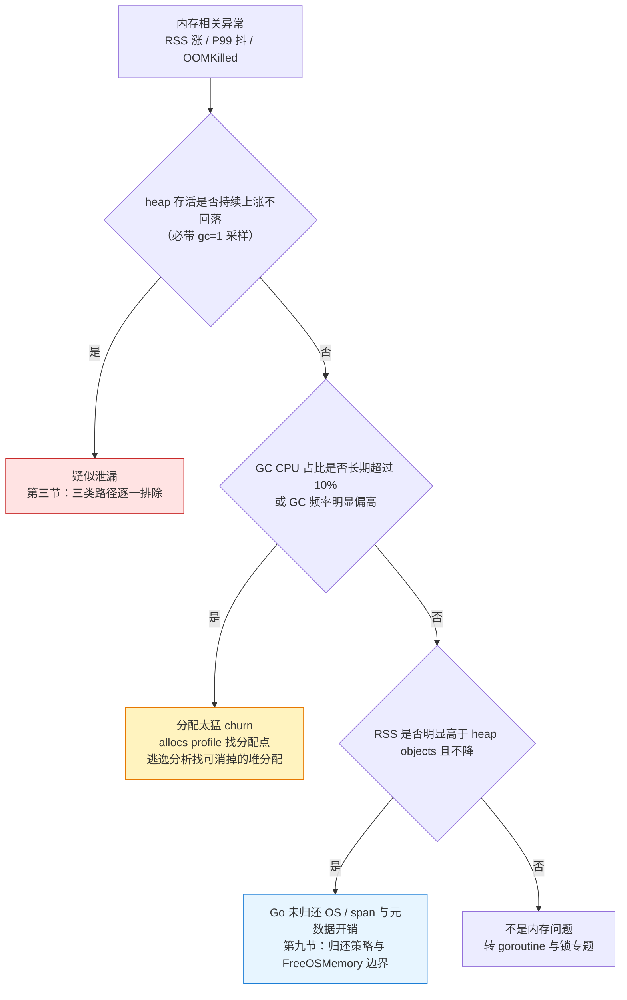
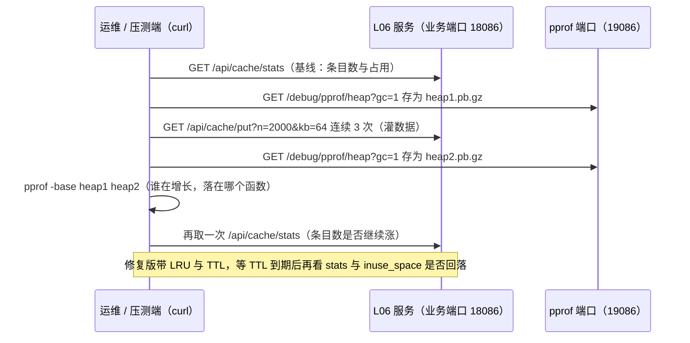
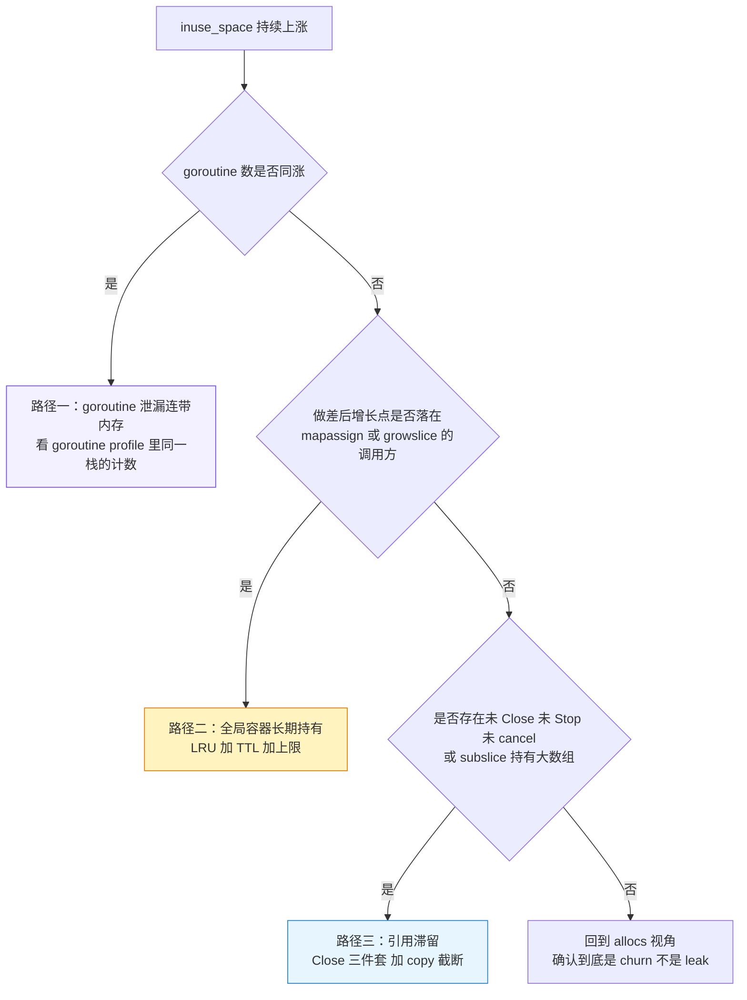
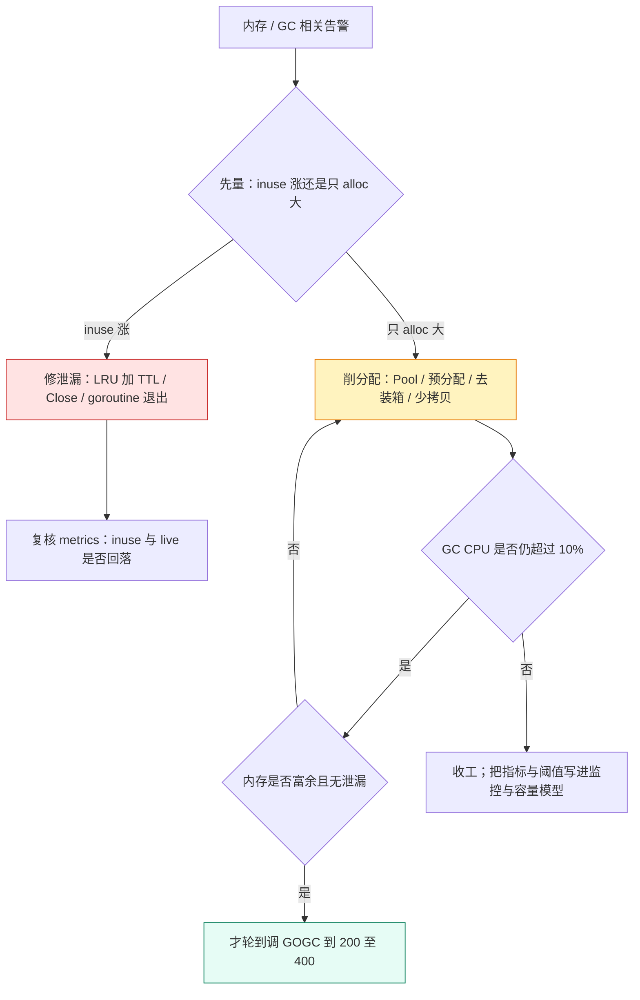

# 19-03 · 内存与 GC 实战：分清泄漏、churn 与「没还内存」

> 属于「架构师修炼」· 19 pprof 实战 · 第 3 篇：内存与 GC 问题定位
> 上一篇：[02 CPU 火焰图实战](./02-CPU火焰图实战)｜下一篇：[04 goroutine 与锁阻塞实战](./04-goroutine与锁阻塞实战)｜栏目总览：[架构师修炼](../)

> **这篇解决什么问题**：RSS 涨、P99 抖、容器被 OOMKilled——内存异常看起来是一个问题，其实是三个：**① 不是泄漏，是 Go 没有把内存还给 OS；② 真泄漏；③ 不是泄漏，是分配太猛（churn）**。判错的代价是白干一整晚：拿 `heap` profile 去查 churn 什么都查不到，拿 `GOGC` 去治泄漏只是把 OOM 推后两小时。本篇只给一条固定顺序：**先判类型**（判定表 + `gctrace` + `runtime/metrics`）→ **再定位**（heap/allocs 四个视图、两次快照做差、三类泄漏路径）→ **最后才调参**（先削分配，再动 `GOGC`/`GOMEMLIMIT`）。实验部分跑冻结清单里的 L02（分配过猛）与 L06（只涨不降），命令可以直接复制执行。

---

## 一、先判类型：三种表现，三种结论

### 1.1 判定表（先看这张，再看后面的机制）

| # | 你观察到的现象 | 该看什么 | 结论 | 第一动作 |
| --- | --- | --- | --- | --- |
| ① | RSS 高（近似 `/memory/classes/total:bytes`），但 heap 存活稳定 | `heap/objects` 与 `total` 之间的差额：`heap/free`、`heap/unused`、`stacks`、`metadata/*`、`other` | **不是泄漏**：Go 未归还 OS、span/arena 缓存、runtime 元数据，或 cgo/大页 | 不用改代码；先确认 `GOMEMLIMIT` 与容器 limit（见 6.3、第九节） |
| ② | `heap inuse` 持续上涨、不回落 | 两次 `?gc=1` 快照 `-base` 做差 + goroutine profile 交叉验证 | **泄漏** | 按第三节三条路径排查：LRU+TTL / context 退出 / Close 三件套 |
| ③ | heap 存活稳定，但 GC CPU 占比高、GC 频率高 | `/debug/pprof/allocs` 的 `alloc_space` + `go build -gcflags='-m -m'` | **分配太猛（churn），不是泄漏** | 削分配：`sync.Pool`、预分配、去接口装箱（第五节）；实验一 L02 |

> **一句话记忆**：看 **inuse 涨不涨** 分「泄漏 / 非泄漏」，看 **alloc 大不大** 分「churn / 不需要优化」。

### 1.2 判定树



### 1.3 读懂 `GODEBUG=gctrace=1`

```bash
cd code/perf/pprof-lab
GODEBUG=gctrace=1 go run ./cmd/l02-alloc-gc 2>&1 | tee /tmp/l02-gc-bug.log
```

每轮 GC 打一行到 stderr（官方文档明确说「格式随时可能变」）：

```text
gc 27 @12.418s 2%: 0.021+1.7+0.003 ms clock, 0.17+0.28/1.4/0.42 ms cpu, 128->131->72 MB, 140 MB goal, 0 MB stacks, 0 MB globals, 8 P
```

| 字段 | 例子 | 含义 | 怎么判读 |
| --- | --- | --- | --- |
| `gc #` | `gc 27` | 第几轮 GC | 除以时长就是 **GC 频率**；实验一里这是第一个对比指标 |
| `@#s` | `@12.418s` | 距进程启动的秒数 | 把 GC 尖峰和压测阶段对齐（「压测开始后 GC 频率翻了几倍」） |
| `#%` | `2%` | **自程序启动以来** GC 消耗的 CPU 占比（累计值） | 持续超过 **10%** = 分配太猛（与 [02 单体架构的极限与分层](../02-单体架构的极限与分层) 的阈值一致）；刚启动时噪声大，要看稳定之后的数值 |
| `#+#+# ms clock` | `0.021+1.7+0.003` | 三段**墙钟**耗时：STW 清扫终止 + 并发标记扫描 + STW 标记终止 | 第 1、3 段是真 STW；第 3 段长期超过 1ms，P99 一定脏 |
| `#+#/#/#+# ms cpu` | `0.17+0.28/1.4/0.42` | 三段 **CPU** 时间，中间一段再拆成 **assist / 后台标记 / 空闲标记** | **第一项 assist 大 = 分配太猛**：业务 goroutine 被 runtime 征用去帮忙标记，直接变成随机长尾 |
| `#->#-># MB` | `128->131->72` | GC 开始时的堆 → 结束时的堆 → **标记后的存活堆** | 存活堆单调上涨 = 泄漏；存活堆稳定但起始堆一路抬高 = 分配量大 |
| `# MB goal` | `140 MB goal` | 本轮 GC 的目标堆 | 目标 ≈ 存活堆 ×（1 + GOGC/100），调 `GOGC` 就是在调这个数 |
| `# MB stacks` / `# MB globals` / `# P` | `0 MB stacks, 0 MB globals, 8 P` | 可扫描的栈、全局变量大小（Go 1.20 起在这一行）与 P 数量 | 对应 `/gc/scan/stack:bytes`、`/gc/scan/globals:bytes`、`/sched/gomaxprocs:threads`；栈一直变大要交叉 `goroutine` profile |
| 行尾 `(forced)` | — | 这轮是被 `runtime.GC()` 强制触发的 | 线上看到 `(forced)` 就去搜代码里谁在手动 GC |

**把日志变成数字**（字段位置对应上面示例行的空格分割）：

```bash
grep -c '^gc ' /tmp/l02-gc-bug.log                                                      # GC 总次数（再除以压测时长 = 次数/秒）
awk '/^gc /{s+=$4+0; n++} END{printf "平均 GC CPU 占比 %.2f%%，共 %d 次\n", s/n, n}' /tmp/l02-gc-bug.log
awk '/^gc /{split($11,a,"->"); print $2" 轮存活堆 "a[3]" MB"}' /tmp/l02-gc-bug.log | tail -5   # 存活堆趋势：涨 = 泄漏
```

### 1.4 `runtime/metrics`：该盯哪几个指标

`gctrace` 只适合压测时看；线上要的是**可告警的指标**。`runtime/metrics` 是稳定接口，命名规范 `<路径>:<单位>`，建议按 Prometheus 抓这几个（`Gauge` 直接画，`Counter` 求导，`Histogram` 取 P99）：

| 指标 | 类型 | 含义 | 判读 |
| --- | --- | --- | --- |
| `/memory/classes/heap/objects:bytes` | Gauge | 活对象 + 尚未清扫的死对象占用（就是常说的 heap inuse） | **泄漏的主指标**；带 `gc=1` 看时更干净 |
| `/memory/classes/heap/free:bytes`、`/memory/classes/heap/unused:bytes`、`/memory/classes/heap/released:bytes` | Gauge | 空闲未归还（span 缓存）、已保留未使用的 span 空间、已归还 OS 的内存 | `total - released` 才是真正占物理内存的量；`free` 高且不降 = span 缓存 |
| `/memory/classes/heap/stacks:bytes` | Gauge | goroutine 栈占用 | goroutine 泄漏的第二信号（第一信号是 goroutine 数） |
| `/memory/classes/metadata/*:bytes`（`mspan` / `mcache` / `other`） | Gauge | runtime 元数据与 OS 线程栈 | 对象数暴涨时同步涨；P 越多 mcache 越多；cgo 程序里 OS 线程栈非 0 |
| `/memory/classes/total:bytes` | Gauge | runtime 映射的读写内存总量（Go 视角的 RSS，不含 cgo/syscall 映射） | 与容器 limit 对比定水位 |
| `/gc/cycles/total:gc-cycles` | Counter | 完成的 GC 轮数 | 求导 = GC 频率；与 QPS 一起看是「每多少请求一次 GC」 |
| `/gc/heap/live:bytes`、`/gc/heap/goal:bytes` | Gauge | 上轮标记出的存活堆、下一轮的目标堆 | 泄漏判定的核心序列；目标堆解释 GC 频率为何高 |
| `/gc/heap/allocs:bytes` | Counter | 累计分配字节 | **求导 = 分配速率**；除以 QPS = 每请求分配量 |
| `/gc/gogc:percent`、`/gc/gomemlimit:bytes` | Gauge | 当前生效的 GOGC 与内存上限 | 用来确认「参数真的生效了」，避免调了个寂寞 |
| `/gc/pauses:seconds`（Go 1.20 起改名 `/sched/pauses/total/gc:seconds`，同名同义） | Histogram | GC STW 停顿分布 | 看 P99/max；亚毫秒是常态，超过 1ms 要找出原因 |
| `/sched/latencies:seconds` | Histogram | goroutine 在 runnable 队列里等 CPU 的延迟分布 | 与业务 P99 同步变差 = CPU 饱和（GC 抢 CPU 的证据） |
| `/cpu/classes/gc/mark/assist:cpu-seconds` | Counter | 业务 goroutine 被征用做 GC 的时间 | 这项大 = churn 的确凿证据，比 `gctrace` 的 assist 更细 |
| `/sched/goroutines:goroutines` | Gauge | 存活 goroutine 数 | 与 heap 同涨 → 走泄漏路径 ①（[04 篇](./04-goroutine与锁阻塞实战)） |

```go
// 独立片段：把内存问题变成可告警的数字（仅标准库）
var names = []string{
	"/memory/classes/heap/objects:bytes", // inuse：泄漏主指标
	"/memory/classes/total:bytes",        // Go 视角的 RSS
	"/gc/heap/live:bytes",
	"/gc/heap/allocs:bytes",      // Counter：求导 = 分配速率
	"/gc/cycles/total:gc-cycles", // Counter：求导 = GC 频率
}
ss := make([]metrics.Sample, len(names))
for i, n := range names {
	ss[i].Name = n
}
metrics.Read(ss) // Gauge / Counter 取 Value.Uint64()
// 直方图类（/sched/latencies:seconds、/sched/pauses/total/gc:seconds）不能 Uint64()，
// 要取 Value.Float64Histogram() 按桶累计算 P99（桶区间是 Buckets[i] ~ Buckets[i+1]）。
```

---

## 二、heap vs allocs：四个视图、采样特性与命令速查

**结论先行**：`heap` 与 `allocs` 是**同一份内存采样数据**的两个入口，区别只在默认的 `sample_index`。查泄漏看 `inuse_space`，查 GC 压力看 `alloc_space`——**看错了视图，结论会完全相反**。

### 2.1 四个视图怎么选

| 视图 | 含义 | 什么时候看 | 陷阱 |
| --- | --- | --- | --- |
| `inuse_space`（heap 默认） | 采样时刻**仍存活**对象占的字节 | 查泄漏：谁没被释放 | 不带 `gc=1` 会把「已死但未清扫」的对象算进来，看起来像泄漏 |
| `alloc_space` | 启动以来**累计分配**的字节 | 查 GC 压力 / churn：谁在造垃圾 | 与泄漏无关；它巨大不代表内存高 |
| `inuse_objects` | 存活对象**个数** | 查「小对象太多」「map 条目爆炸」 | 小对象采样概率低，偏差最大，只能看量级 |
| `alloc_objects` | 累计分配**次数** | 查高频小分配点（每请求几百次 `make`） | 同上；次数多但总量小的时候，优化收益也有限 |

### 2.2 采样特性：profile 不是账本，是抽样调查

- `runtime.MemProfileRate` 默认 **512 × 1024 = 512KB**：**平均每分配 512KB 采样一次**，不是每次分配都记录；采样概率与对象大小成正比，**大于 512KB 的分配基本必被采到**，几十字节的小对象命中概率极低。
- 两个直接推论：① `alloc_objects` / `inuse_objects` 的**小对象计数偏差最大**，别拿它做精确对比；② 短时间、高频的小对象分配点可能**压根不出现在 top 里**——所以先用 `alloc_space` 排序，而不是先怀疑「profile 坏了」。
- 需要精确时：`GODEBUG=memprofilerate=1`（每次分配都记录，CPU 与内存开销巨大，只在本地/预发短时诊断用）；代码里等价写法是 `runtime.MemProfileRate = 1`，**必须在程序启动早期设置且只设一次**（处理 profile 的工具假设采样率在整个生命周期恒定）。关掉采样是 `GODEBUG=memprofilerate=0`。生产常开默认 `heap` 是安全的，开销大的是全采样与 CPU profile。

### 2.3 命令速查表（实验一、二都会用到）

| 目的 | 命令 |
| --- | --- |
| 交互式看存活堆（默认 inuse_space） | `go tool pprof -http=:9090 'http://127.0.0.1:19082/debug/pprof/heap'` |
| 只看分配，找 churn 来源 | `go tool pprof -sample_index=alloc_space -top 'http://127.0.0.1:19082/debug/pprof/allocs'` |
| 两次快照做差，找「谁在增长」 | `go tool pprof -http=:9090 -base heap1.pb.gz heap2.pb.gz` |
| 先触发 GC 再看存活（判泄漏必用） | `curl -s 'http://127.0.0.1:19082/debug/pprof/heap?gc=1' -o heap.pb.gz` |
| 精确到代码行 | `go tool pprof -sample_index=inuse_space -list='handleThumb' heap.pb.gz` |
| 看对象数增长（小对象/条目爆炸） | `go tool pprof -sample_index=inuse_objects -top heap.pb.gz` |
| 保留负值，看「谁被释放了」 | `go tool pprof -http=:9090 -diff_base heap1.pb.gz heap2.pb.gz` |

三点说明，避免踩坑：

1. **`?gc=1` 是判泄漏的前提**：`heap` 端点支持 `gc` GET 参数，含义是「采样前先跑一次 GC」。不带它时，inuse 里混着大量已死未清扫对象，很容易把正常的分配波动误判成泄漏。
2. `-base` 与 `-diff_base` 的区别：`-base` 做差后主要体现**增长**（更干净，适合「谁在涨」）；`-diff_base` **保留负值**（适合同时看「谁被释放了」）。
3. 如果本机报 `go: no such tool "pprof"`：先查 `go env GOCACHE` 是否可写——Go 1.26 起 `go tool` 是**按需从 GOROOT 源码构建** pprof，构建缓存不可写时会直接报这个错，换个可写缓存即可：`GOCACHE=$(mktemp -d) go tool pprof ...`；确实需要独立二进制时再 `go install github.com/google/pprof@latest`（需要网络）。详见 [05 常见问题排查手册 · F27](./05-常见问题排查手册)。

### 2.4 快照做差的时序（实验二的骨架）



---

## 三、三类内存泄漏的判别与修法

### 3.1 分类总表

| 类型 | 特征（怎么认出来） | 关键证据 | 修法 | 样例 |
| --- | --- | --- | --- | --- |
| ① goroutine 泄漏连带内存 | heap 涨的同时 goroutine 数、栈内存一起涨；同一段栈在 `goroutine` profile 里出现成千上万份 | `/sched/goroutines:goroutines`、`heap/stacks`、`goroutine` profile | 给 goroutine 明确的退出信号（context / stop channel）+ `WaitGroup` 收敛 + `Ticker.Stop` | L03、L05 |
| ② 全局容器长期持有 | `inuse_space` 单调上涨，做差后增长点挂在 `mapassign` / `growslice` / `append` 的调用方 | 两次 `?gc=1` 快照 `-base`；`inuse_objects` 同涨 | LRU（条数 + 字节双上限）+ TTL + key 归一化 + 定期清理 | **L06** |
| ③ 资源未释放造成引用滞留 | 不是「忘了 free」，而是对象**还被引用**所以 GC 不敢回收；量与请求数/数据量成正比 | 增长点落在 `io.ReadAll`、`bytes.Buffer`、`growslice`、`newobject` 的调用方 | `Close` / `Stop` / `cancel` 三件套；大 slice 截断用 `copy` 落到新数组 | L06 的读路径、任意 HTTP 客户端代码 |

### 3.2 类型 ①：goroutine 泄漏连带内存

**机制**：goroutine 不会泄漏数据，但它会**一直持有栈上、堆上的引用**——一个阻塞在 `for range ch` 的 goroutine 会让整个 buffer 链活着。所以「goroutine 数上涨」和「heap 上涨」经常同时出现。

```bash
# 交叉验证：heap 涨的时候，goroutine 是不是也在涨（同一时刻取两份）
go tool pprof -http=:9090 'http://127.0.0.1:19082/debug/pprof/goroutine'
curl -s 'http://127.0.0.1:19082/debug/pprof/goroutine?debug=1' | head -40   # 文本形态更直观，看同一个栈的计数
```

**判读**：`debug=1` 的文本里，同一段栈反复出现且计数很大 → 泄漏点就是这段栈的第一个业务帧。修法固定三步：`ctx.Done()` 退出分支、`WaitGroup` 等待收敛、`defer ticker.Stop()`。完整形态清单与修法见 [04 goroutine 与锁阻塞实战](./04-goroutine与锁阻塞实战)。

### 3.3 类型 ②：全局容器长期持有（最常见的「只涨不降」）

**机制**：`map`/`slice` 只增不减、缓存没有淘汰、key 无限增长（把用户 ID、请求 ID、时间戳拼进 key）。它们都是**可达对象**，GC 看到的是「还有人引用」，永远不回收。

```bash
# 1) 两次快照（中间灌数据），看「谁在增长」
curl -s 'http://127.0.0.1:19086/debug/pprof/heap?gc=1' -o /tmp/heap1.pb.gz
# （此处灌数据，见实验二）
curl -s 'http://127.0.0.1:19086/debug/pprof/heap?gc=1' -o /tmp/heap2.pb.gz
go tool pprof -http=:9090 -base /tmp/heap1.pb.gz /tmp/heap2.pb.gz
```

**火焰图判读**：增长点会落在这类底层函数上，顺手往上看一层调用方就是你的缓存实现：

| 底层栈帧 | 说明 | 真正的锅 |
| --- | --- | --- |
| `runtime.mapassign_faststr` / `runtime.mapassign` | 往 map 写新 key | 无上限的 `map[string]X` 缓存 |
| `runtime.growslice` / `runtime.makeslice` | slice 扩容 | 只 `append` 从不清理的列表 |
| `runtime.newobject` | 分配新对象（被容器收下） | 缓存里存了指针/结构体而不是小值 |

**修法**：`LRU`（`container/list` 或成熟库）+ `TTL` + **字节上限**（只限条数不够：一条 64KB × 10 万条 = 6.4GB）。样例 L06 的 `-fix` 就是用 LRU + TTL + 显式释放。

### 3.4 类型 ③：资源未释放造成的引用滞留

| 反模式 | 泄漏的是什么 | 正确写法 |
| --- | --- | --- |
| `resp, _ := http.Get(...)` 不 Close | 连接、读缓冲、`Body` 后方整条链路 | `defer resp.Body.Close()`；想复用连接还要**读完**到 EOF（`io.Copy(io.Discard, resp.Body)`） |
| 每请求 `http.Client{}` 新建 | 连接池无法复用（连接持续新建，TIME_WAIT 堆积） | 全局复用一个 `http.Client`，配好 `Transport` |
| `ticker := time.NewTicker(d)` / `context.WithTimeout` 不释放 | goroutine + runtime timer + 子 context + 闭包捕获的一切 | `defer ticker.Stop()`；`defer cancel()`（即使正常返回也要调）；循环里别用 `time.After` |
| `io.ReadAll(resp.Body)` 读一个不设限的响应 | 大对象瞬间进堆 | 用 `io.LimitReader` 设上限 |
| 大 slice 的 subslice 长期持有 | 底层大数组整块无法回收 | 见下方「截断」的正确姿势 |

**关于「大 slice 的 subslice」——一个必须说准的细节**：

```go
func keepTail(buf []byte) []byte {
	s := buf[:64]      // 只想留前 64 字节，但底层数组还是那个几 MB 的 buf
	return s[:64:64]   // 三索引切片：把容量钉死为 64
}
```

- `s[:n:n]` 的第三个数把**容量**钉死为 `n`，作用是**防止后续 `append` 复用底层大数组（写坏原数据）**——这是防别名 bug 的经典手法。
- 但它**不释放内存**：slice 头仍指向同一个底层数组，GC 保留的是整个数组对象。**真要把大数组还给 GC，必须 copy 到新 slice**：`out := make([]byte, n); copy(out, s)`（或 Go 1.21+ 的 `slices.Clone(s)`）。
- 一句话：**三索引切片治「写坏」，`copy` 治「占着不放」——线上「只涨不降」的元凶通常是后者被漏掉了。**

### 3.5 定位路径（三条路都要走到）



---

## 四、逃逸分析：把对象留在栈上

**结论先行**：栈上分配不产生 GC 压力，堆上分配要。看一个函数有没有堆分配，不用猜——编译器会告诉你。

### 4.1 `go build -gcflags='-m -m'` 怎么读

```bash
cd code/perf/pprof-lab
go build -gcflags='-m -m' -o /dev/null ./cmd/l02-alloc-gc 2>&1 | head -40   # 诊断输出走 stderr，必须 2>&1
go build -gcflags='-m -m' -o /dev/null ./... 2>&1 | grep 'moved to heap'    # 只看「变量被搬到堆」
go clean -cache && go build -gcflags='-m -m' -o /dev/null . 2>&1 | head     # 没输出时先清缓存再试
```

| 输出片段（逐字） | 含义 | 该做什么 |
| --- | --- | --- |
| `can inline Point.String with cost 69 as: ...` | 该函数可被内联（附内联成本） | 内联后很多「假逃逸」会消失，所以**先看内联结论再看逃逸结论** |
| `cannot inline main: function too complex: cost 140 exceeds budget 80` | 内联预算 80 不够（函数太复杂） | 想验证内联影响可用 `-gcflags='-l'` 关掉内联对照 |
| `p.X escapes to heap in Point.String` / `escapes to heap` | 这个值进了堆 | 往下看 `flow:` 行，它会告诉你**经哪条路径**逃逸 |
| `moved to heap: y` | 局部变量 `y` **本身**被搬到堆（地址被外部持有） | 典型是 `return &y`、被存进全局/接口 |
| `leaking param: r`（完整形如 `parameter r leaks to {heap} for store with derefs=0`） | 该函数把参数泄露到堆 | 调用方传进来的对象会在堆上；给它加 `//go:noinline` 单独观察 |
| `... argument does not escape` / `does not escape` | 不逃逸 | 负向结论同样重要：证明优化已经成功 |

### 4.2 常见逃逸原因

| 原因 | 代码形态 | 能否消掉 | 怎么消 |
| --- | --- | --- | --- |
| 返回指针 / 地址被外部持有 | `return &T{}` | 能 | 改返回值类型；或让调用方传缓冲 `func fill(dst *T)` |
| 接口装箱 | `append([]any{}, n)`、`fmt.Sprintf` 的 `...any` 参数 | 能 | 用具体类型切片；`strconv.AppendInt` / `strconv.Itoa` 替 `fmt.Sprintf` |
| 闭包捕获且闭包本身逃逸 | 局部变量被存进 `[]func()`、注册成回调 | 多数能 | 改为显式传参，减少捕获；避免把闭包存进长生命周期容器 |
| 经「泄露参数」传递 / 存进容器 | 参数被存进全局、`map`、`channel`、接口字段 | 能 | 传值（小结构体）、或明确只在栈内使用、或复用对象 |
| 编译期无法确定大小 | `make([]byte, n)`（n 运行时才知道）、`new(T)` | 不能 | 无法避免，但可以**复用**（`sync.Pool`）或预分配容量 |

### 4.3 「改一行消掉逃逸」的对照示例

下面是一个可以单独编译验证的片段（存成任意 `main.go`，例如 `/tmp/esc/main.go`，`go mod init esc` 后运行，**不依赖仓库里任何文件**）：

```go
package main

//go:noinline
func idsA(ns []int) []any { // 版本 A：每个元素被装箱成 any
	out := make([]any, 0, len(ns))
	for _, n := range ns {
		out = append(out, n) // ← 这一行把 n 搬上堆
	}
	return out
}

//go:noinline
func idsB(ns []int) []int { // 版本 B：只改返回类型与切片类型，其余不动
	out := make([]int, 0, len(ns))
	for _, n := range ns {
		out = append(out, n) // ← 不逃逸
	}
	return out
}

func main() { _ = idsA(nil); _ = idsB(nil) }
```

```bash
go build -gcflags='-m -m' -o /dev/null . 2>&1 | grep 'escapes to heap'
# 版本 A 会打印 n escapes to heap（并给出 flow: {heap} ← append(out, n) 这条路径）
# 版本 B 没有 n escapes to heap，只有 append(...) escapes to heap —— 那是返回的切片本身，必要逃逸
```

**这就是为什么 `[]any`、`map[string]any`、到处传 `interface{}` 的代码 GC 压力大**：每次装箱都是一次堆分配 + 一个 GC 要扫描的指针。`[]any` 里每个元素、`fmt.Sprintf` 的每个参数，都算钱。注意 `//go:noinline` 是为了让结论干净（否则内联后调用点会直接告诉你 `does not escape`）。

### 4.4 栈分配与堆分配对 GC 的差别

| 维度 | 栈上 | 堆上 |
| --- | --- | --- |
| 谁来回收 / 成本 | 函数返回自动弹栈；分配只是一条指针加法；**不参与 GC 标记** | GC 标记 + 清扫；`mallocgc` 要找 size class、可能加锁、可能触发 assist |
| 能不能共享 | 不能（随栈帧消失） | 能 |
| 优化手柄 | 逃逸分析（编译器自动） | `sync.Pool` / 复用 / 预分配 |

> **判断口径**：热路径函数（每请求执行、QPS 上千）里的**任何一次堆分配**都值得看一眼；冷路径（启动、定时任务、管理接口）就别费劲了。优化也要讲 ROI。

---

## 五、减少分配的实战手段

**结论先行**：先削分配，再谈调参。分配速率降 10 倍，GC 频率、GC CPU、P99 会一起改善；把 `GOGC` 从 100 调到 200 只是把问题延后。

| 手段 | 适用场景 | 代价与陷阱 |
| --- | --- | --- |
| `sync.Pool` 复用临时大对象 | 跨请求复用「大且无状态」的缓冲（`*bytes.Buffer`、`[]byte`、编码器） | GC 会**清空 Pool**（不能当缓存用）；不能放有状态对象；取出后必须 `Reset()`；`Put` 前要清掉内部引用（否则 Pool 自己成为滞留源）；Pool 里的对象会在任意 GC 后消失，别假设它一直在 |
| 预分配容量 `make([]T, 0, n)` | 已知量级（`len(rows)`、预计 4KB 输出） | 估太大浪费内存、估太小照样扩容；`n` 来自用户输入时必须设上限 |
| `strings.Builder`（配 `Grow`） | 拼接字符串、拼 SQL、拼日志行 | 用过一次就不能再写（`Builder` 复制会 panic）；跨 goroutine 共享要自己加锁；`Grow` 只是提示，别依赖它精确 |
| 复用 `bytes.Buffer`（Pool + `Reset`） | 序列化输出、HTTP body 拼装；批量/流式替代全量（`io.Copy` 替 `io.ReadAll`、`bufio` 替逐行写） | `Reset` 后底层数组还留着（这正是复用目的）；忘记 `Reset` 会串数据；`bufio.Writer` 必须 `Flush` |
| 避免 `interface{}` 装箱；数字转字符串用 `strconv.AppendInt` / `AppendFloat` | `[]any`、`map[string]any`、到处传 `any` 的中间层；格式化热点 | 改具体类型会牺牲一点便利（Go 1.18+ 可用泛型兼顾）；`Append*` 需要自己管 `[]byte` 生命周期 |
| `[]byte` 与 `string` 零拷贝（`unsafe.String` / `unsafe.Slice`，Go 1.20+） | 只读、短生命周期、热路径上的转换 | **风险三项**：① 共享底层数组，改一边变另一边；② string 会**钉住**整个底层数组（小的 string 拖住大 buffer）；③ 与 `sync.Pool` 复用时极易出现「string 指向了已被复用的 buffer」这种幽灵 bug；除非有 profile 证据 + 充分评审，否则老老实实转换 |
| 结构体传值 vs 传指针 | 小的（几个字长内）按值，避免堆分配与指针追逐；大的、要改的、要共享的按指针 | 大结构体按值传会复制，CPU 与栈都吃亏；「一律传指针」反而制造逃逸与 GC 压力 |
| 减少 map 的 key 字符串分配 | 热点 map 用 `int`/定长数组做 key，或在入口把 key 归一化一次 | `map[string]X` 每次查找若 key 由拼接产生，就是每请求一次分配；键空间别无限增长（回到泄漏路径 ②） |

```go
// 复用缓冲的标准写法（独立片段）：有状态的东西不能进 Pool，取出来先 Reset
var bufPool = sync.Pool{New: func() any { return new(bytes.Buffer) }}

func encodeRow(dst *bytes.Buffer, id int, name string) {
	dst.Reset()                       // ★ 必须先清
	dst.Grow(64)                      // ★ 预分配，减少 growslice
	dst.WriteString(`{"id":`)
	dst.WriteString(strconv.Itoa(id)) // 比 fmt.Sprintf 少一次装箱 + 少一次分配
	dst.WriteString(`,"name":"`)
	dst.WriteString(name)
	dst.WriteString(`"}`)
}

func handle(id int, name string) string {
	b := bufPool.Get().(*bytes.Buffer)
	defer func() { bufPool.Put(b) }() // 注意：Put 回去的对象内容仍被 Pool 引用，必要时重置字段
	encodeRow(b, id, name)
	return b.String()                 // String() 会拷贝，所以 Put 回去是安全的
}
```

> **`sync.Pool` 的正确预期**：它**只削 churn，不治泄漏**。如果 heap 存活堆本身在涨，加 Pool 一点用都没有——先确认是哪种问题（回到 1.1 判定表）。

---

## 六、GC 调优：参数、时机与边界

### 6.1 三个参数各管什么

| 参数 | 默认 | 语义 | 什么时候动 | 陷阱 |
| --- | --- | --- | --- | --- |
| `GOGC` | `100` | 堆从上轮 GC 后的存活堆再增长 `GOGC%` 就触发下一轮 | 内存富余、CPU 紧张、**且已确认没有泄漏** → 调 200~400 换 CPU；内存紧张 → 调 50 | 调大只是把 GC 推后：存活堆本身大时，更快撞上限；`GOGC=off` 只应与 `GOMEMLIMIT` 一起用 |
| `GOMEMLIMIT` | 不设（Go 1.19+） | **软**内存上限，作用对象是「runtime 映射总量 − 已归还」；逼近时 GC 频率拉满、scavenger 更积极归还 | 容器里设成 memory limit 的 **70%~80%**（1Gi → `800MiB`），防 OOMKilled | 设得**低于真实存活堆**会导致 GC 空转（thrashing）：CPU 打满、吞吐崩且不报错；`GOGC=off` + `GOMEMLIMIT` 是「用满内存换吞吐」的组合，要明确知道代价 |
| `GOMAXPROCS` | 逻辑核数 | 影响后台标记的并行度、assist 压力、调度延迟 | 容器 CPU limit 小于宿主核数时，按 CPU 配额显式设置（样例用的 Go 1.22 不会自动感知 cgroup CPU 配额） | 设得远小于核数，标记跟不上分配 → assist 暴涨，长尾更糟 |

`GOMEMLIMIT` 可以运行时调整（返回旧值），适合「启动脚本从 cgroup 读 limit 再算」：

```go
// 独立片段：按容器 limit 的 80% 设软上限（Go 1.19+）
b, _ := os.ReadFile("/sys/fs/cgroup/memory.max") // cgroup v2；v1 是 memory/memory.limit_in_bytes
if n, err := strconv.ParseInt(strings.TrimSpace(string(b)), 10, 64); err == nil && n > 0 {
	debug.SetMemoryLimit(n * 8 / 10)
}
```

### 6.2 什么时候调哪个（判断表）

| 观察到的 | 该做的 | 明确不该做的 |
| --- | --- | --- |
| GC CPU 占比高 + `alloc_space` 巨大，存活堆稳定 | **削分配**：Pool / 预分配 / 去装箱 / 少拷贝 | 调 `GOGC`（治不了根，还多占内存） |
| 存活堆稳定但进程内存逼近容器 limit | 设 `GOMEMLIMIT = limit × 0.8` 兜底 | 设得远低于存活堆（GC 空转） |
| 存活堆本身很大（本地缓存占主导） | 给缓存加**字节上限** + LRU/TTL；再考虑 `GOGC=50` 更早回收 | 靠加大内存硬扛（下次流量涨还得崩） |
| 全链路已优化、GC CPU 仍高，且 CPU 富余、内存富余 | `GOGC` 调 200~400，换更少的 GC 轮数 | 在压测机上试出来的值直接上生产（要按生产存活堆重新估） |
| `heap inuse` 单调上涨 | **先修泄漏**（第三节） | 任何调参（只是把 OOM 推后） |
| 容器被 OOMKilled 且 heap 不高 | 查 cgroup 总内存：goroutine 栈、cgo、`syscall.Mmap`、GC 元数据都不在 `heap/objects` 里 | 只盯 `heap/objects` 一个指标 |
| 单实例 QPS 到顶、资源水位却不高 | 先确认瓶颈在不在这一层（[02 篇](../02-单体架构的极限与分层)四个天花板），再谈加实例 | 一上来就加机器（把问题买下来） |



> **一句话立场**：**调参是止痛药，删代码才是解药。** 先削分配，再谈 `GOGC`；先修泄漏，再谈 `GOMEMLIMIT`。

### 6.3 容器化：`GOMEMLIMIT` 与 memory limit 的关系

- `GOMEMLIMIT` 是**Go runtime 自己**的软上限，**不知道**容器 limit 是多少，也不会自动去读 cgroup——必须显式设（或用启动脚本算）。
- 关系式：`GOMEMLIMIT ≈ memory limit × 0.8`。留 20% 给：goroutine 栈、runtime 元数据、`other`（trace 缓冲 / finalizer 等）、二进制与只读段，以及 **cgo / `syscall.Mmap` 映射的内存（`GOMEMLIMIT` 根本不管这些）**。
- 典型事故链：不设 `GOMEMLIMIT` → runtime 认为内存无限 → 堆涨到容器 limit → kubelet OOMKilled → 重启后继续 → CrashLoopBackOff。相关细节（探针、重启策略、cgroup 水位告警）见 [K8s 高可用与故障排查](/后端技术栈强化/07-k8s/高可用与故障排查)。
- 反向事故更隐蔽：`GOMEMLIMIT` 设成 limit 的 100%（或低于真实存活堆）→ GC 无休止地跑 → CPU 打满、P99 爆炸，**但没有 OOM**。

---

## 七、实验一：L02 · 分配过猛（churn）

**场景**：`GET /api/thumb?id=1` 每请求产生 MB 级分配 → GC 频率飙升、GC CPU 占比高、P99 抖动。`-fix` 用 `sync.Pool` + 复用 `bytes.Buffer`。

### 7.1 冻结的实验约定（只引用，不虚构）

| 项 | 值 |
| --- | --- |
| 代码目录 | `code/perf/pprof-lab/`（独立 module `gocampus/perf/pprof-lab`，go 1.22，仅标准库） |
| 启动命令 / 修复开关 | `go run ./cmd/l02-alloc-gc`；`-fix` 默认 false，开启后用 Pool 复用的修复实现 |
| 业务端口 | `18082`（`-addr`，默认 `127.0.0.1:18082`） |
| pprof 管理端口 | `19082`（`-pprof-addr`，默认 `127.0.0.1:19082`，= 业务端口 + 1000） |
| 业务端点 | `GET /api/thumb?id=1` |
| 压测器 | `go run ./cmd/load`（flag：`-url` 目标、`-c` 并发、`-d` 时长；输出 QPS / P50 / P95 / P99 / 错误数） |

### 7.2 完整演练（两个终端 + 三个终端都行）

```bash
cd code/perf/pprof-lab

# 终端 A：带 gctrace 启动 bug 版，日志落盘
GODEBUG=gctrace=1 go run ./cmd/l02-alloc-gc 2>&1 | tee /tmp/l02-gc-bug.log

# 终端 B：压测 30s，记录 QPS 与分位数
go run ./cmd/load -url='http://127.0.0.1:18082/api/thumb?id=1' -c=50 -d=30s

# 终端 C：压测进行中取分配 profile（窗口内取两次，看增长与总量）
go tool pprof -sample_index=alloc_space -top 'http://127.0.0.1:19082/debug/pprof/allocs'
curl -s 'http://127.0.0.1:19082/debug/pprof/heap?gc=1' -o /tmp/l02-heap-bug.pb.gz
go tool pprof -http=:9090 -sample_index=alloc_space /tmp/l02-heap-bug.pb.gz   # 火焰图里找分配点

# 换修复版重跑同一套（务必重新读一遍 gctrace 与 load 输出）
GODEBUG=gctrace=1 go run ./cmd/l02-alloc-gc -fix 2>&1 | tee /tmp/l02-gc-fix.log
```

### 7.3 预期观察（定性，数值自己填）

| 观察点 | bug 版预期 | fix 版预期 |
| --- | --- | --- |
| `gctrace` 行密度 | 行与行间隔**毫秒级**，一条压测日志里几千行 | 明显稀疏，间隔拉大一个数量级以上 |
| `#%`（GC CPU 占比） | 逐行走高，稳定后远超 10% | 明显回落，稳定在 10% 以内 |
| `#->#-># MB` 的存活堆与 assist | **存活堆稳定**（不是泄漏）；assist 大（业务 goroutine 被拉去标记） | 存活堆稳定且更低；assist 小 |
| `alloc_space` top | 分配点集中在 thumb 处理链路的 `make` / `Buffer` / 编码 | 分配量下降，热点转移到别处或大幅缩小 |
| `load` 输出 | QPS 偏低、P99 明显高 | QPS 上升、P99 收紧 |

### 7.4 bug vs fix 对比表（数值列「实测填写」，最后一列是测量方法）

| 指标 | bug 版 | fix 版 | 提升 | 测量方法 |
| --- | --- | --- | --- | --- |
| GC 次数/秒 | 实测填写 | 实测填写 | 实测填写 | `grep -c '^gc ' /tmp/l02-gc-bug.log` ÷ 压测时长 |
| GC CPU 占比（`#%`） | 实测填写 | 实测填写 | 实测填写 | `awk '/^gc /{s+=$4+0;n++} END{print s/n}' /tmp/l02-gc-*.log` |
| 存活堆（MB） | 实测填写 | 实测填写 | 实测填写 | `awk '/^gc /{split($11,a,"->"); print a[3]}' /tmp/l02-gc-*.log \| tail -5` |
| 每请求分配量 | 实测填写 | 实测填写 | 实测填写 | `alloc_space` 总量 ÷ 压测总请求数（QPS × 时长）；或用 `/gc/heap/allocs:bytes` 求导 ÷ QPS |
| QPS | 实测填写 | 实测填写 | 实测填写 | `cmd/load` 输出 |
| P99 | 实测填写 | 实测填写 | 实测填写 | `cmd/load` 输出 |

> 记录实验时把两行 gctrace 抄进笔记（bug 一行、fix 一行），面试时这就是「我量过，不是我感觉」的硬材料。

---

## 八、实验二：L06 · 只涨不降（泄漏）

**场景**：全局 `map`/`slice` 长期持有 → heap 只涨不降。`-fix` 用 **LRU + TTL + 显式释放**。

| 项 | 值 |
| --- | --- |
| 启动命令 / 修复开关 | `go run ./cmd/l06-memory-retention`；`-fix` 开启 LRU + TTL + 显式释放 |
| 业务端口 | `18086`（`-addr`，默认 `127.0.0.1:18086`） |
| pprof 管理端口 | `19086`（`-pprof-addr`，默认 `127.0.0.1:19086`） |
| 端点 | `GET /api/cache/put?n=2000&kb=64`、`GET /api/cache/stats` |

**灌入量心算**：一次 `n=2000&kb=64` ≈ 2000 × 64KB ≈ **128MB**；跑 2~3 次就有几百 MB 的明显增长。机器内存紧张时把 `kb` 调到 8（每次约 16MB）同样能看到趋势。

### 8.1 完整观测序列（按顺序执行，每步都留证据）

```bash
# 1) 启动 bug 版（新终端；如果要做 RSS 对比，可同时记 RSS）
cd code/perf/pprof-lab
go run ./cmd/l06-memory-retention

# 2) 记录基线：条目数与占用；3) 快照 1：先 GC 再看存活（?gc=1 是判泄漏的前提）
curl -s 'http://127.0.0.1:18086/api/cache/stats'
curl -s 'http://127.0.0.1:19086/debug/pprof/heap?gc=1' -o /tmp/l06-heap1.pb.gz
go tool pprof -sample_index=inuse_space -top -nodecount=10 /tmp/l06-heap1.pb.gz

# 4) 灌数据：3 次约 384MB（每行之间可再取一次 stats，看条目数单调上涨）
curl -s 'http://127.0.0.1:18086/api/cache/put?n=2000&kb=64' > /dev/null
curl -s 'http://127.0.0.1:18086/api/cache/put?n=2000&kb=64' > /dev/null
curl -s 'http://127.0.0.1:18086/api/cache/put?n=2000&kb=64' > /dev/null

# 5) 快照 2 + 做差：谁在增长；6) 再取一次 stats（只增不减 = 泄漏已证实）
curl -s 'http://127.0.0.1:19086/debug/pprof/heap?gc=1' -o /tmp/l06-heap2.pb.gz
go tool pprof -http=:9090 -base /tmp/l06-heap1.pb.gz /tmp/l06-heap2.pb.gz
go tool pprof -sample_index=inuse_space -top -base /tmp/l06-heap1.pb.gz /tmp/l06-heap2.pb.gz
go tool pprof -sample_index=inuse_objects -top -base /tmp/l06-heap1.pb.gz /tmp/l06-heap2.pb.gz
curl -s 'http://127.0.0.1:18086/api/cache/stats'

# 7) 换修复版（LRU + TTL + 显式释放）后重复步骤 2~6：条目数应被上限压住；
#    等 TTL 到期（TTL 常量/flag 以样例实现为准）后再看 stats 与 inuse_space 是否回落
go run ./cmd/l06-memory-retention -fix
```

### 8.2 判读要点

| 证据 | 含义 |
| --- | --- |
| `/api/cache/stats` 的条目数单调上涨、从不下降 | 容器**没有淘汰机制**（不是采样问题、不是内存没还） |
| `-base` 做差后 `inuse_space` 增长点落在 `mapassign_faststr` / `growslice` 的调用方 | 增长点在**缓存写入路径**，顺着调用方看一层就是缺 LRU/TTL |
| `inuse_objects` 同步增长 | 条目数在涨（不是单条变大），进一步坐实路径 ② |
| `/gc/heap/live:bytes` 与 `/memory/classes/heap/objects:bytes` 一起单调上涨 | 存活堆真的在长 → 泄漏，而不是 span 缓存；修复版灌同样数据后条目数被封顶、TTL 到期后回落，即为修法有效 |

> 判完这条链，你就有了一个**能讲 8 分钟**的排障故事：现象 → 假设 → 两次快照做差 → 定位到调用方 → LRU+TTL → 复测回落。案例化的写法见 [07 实战案例集](./07-实战案例集)（[index](./index.md) 的清单里 L02/L06 的「对应篇章」就是本篇）。

---

## 九、判不出来但很常见：heap 稳定、RSS 不降

这是最容易被误判成泄漏的一类：`/memory/classes/heap/objects:bytes` 平得像一条直线，RSS 却高居不下。原因是 **Go 的堆内存 ≠ RSS**：

| 内存去向 | 对应指标 | 为什么会「占着不还」 |
| --- | --- | --- |
| 活对象 + 未清扫死对象 / 空闲但未归还的 span | `/memory/classes/heap/objects:bytes`、`/memory/classes/heap/free:bytes` | 活对象正常回落；空闲 span 被分配器保留以便复用（归还再申请很贵），scavenger 按 1% CPU 目标**逐步、按需**归还 |
| 已保留未使用的 span | `/memory/classes/heap/unused:bytes` | size class 与 arena 预留 |
| goroutine 栈 | `/memory/classes/heap/stacks:bytes` | goroutine 不清，栈就一直在 |
| runtime 元数据 / OS 线程栈 / cgo / `syscall.Mmap` | `/memory/classes/metadata/*`、`/memory/classes/os-stacks:bytes` | 对象数与 P 越多元数据越多；cgo 与 `Mmap` **不受 Go 堆管理，也不受 GOMEMLIMIT 约束** |

**`runtime/debug.FreeOSMemory()` 的边界**：

```go
// 它会「强制一次 GC + 尽量把内存还给 OS」，语义很重，不要当成定时任务
debug.FreeOSMemory()
```

- 它做的是：强制 GC（同步、可能 STW）→ 触发 scavenger 全量归还。**不建议线上定期调用**，原因有四：
  1. **抖动**：一次同步 GC + 大量 `madvise` 系统调用，CPU 尖峰与延迟抖动都落在业务请求上；
  2. **震荡**：刚还回去的内存很快又被申请回来 → 又一轮 page fault 与系统调用，来回折腾比留着更贵；
  3. **掩盖问题**：RSS 降下来了，但分配速率或泄漏本身还在，监控上反而「看起来好了」；
  4. **打乱自适应**：runtime 的 GC 与 scavenger 有自己的节奏与目标（`GOGC`/`GOMEMLIMIT`），人为插队属于反调优。
- 可以用的场景：**一次性批处理/离线任务收尾**、压测结束后恢复基线、容器内存逼近 limit 时人工应急止损（并且要知它只管 Go 自己映射的内存，cgo 那部分管不了）。
- **正确姿势**：容器里设 `GOMEMLIMIT`（6.3），让 runtime 在逼近上限时**自动**更积极地 GC 与归还——这是「机制」而不是「定时补救」。
- 额外冷知识：Linux 上 Go 默认用 `MADV_DONTNEED` 归还内存，RSS 会较快下降；若有人显式设了 `GODEBUG=madvdontneed=0`，就会改用 `MADV_FREE`——更省 CPU，但 **RSS 只在系统内存紧张时才掉**，于是监控上「RSS 不降」，这是一个纯配置造成的假象。

---

## 十、与架构学习的衔接：把分配量算进容量

### 10.1 架构级估算公式

```text
每秒分配速率 = 每请求分配量 × QPS
GC 轮数/秒   ≈ 每秒分配速率 ÷ (存活堆 × GOGC/100)      ← 目标堆 ≈ 存活堆 ×(1+GOGC/100)
```

**算例（AI 剪辑场景，与 [15 篇](../15-案例-AI剪辑任务平台架构)同一语境）**：缩略图/预览图接口每请求分配 2MB（图片解码缓冲 + 编码中间态），峰值 5k QPS：

```text
每秒分配速率 = 2MB × 5,000 = 10 GB/s
假设存活堆 500MB、GOGC=100 → 目标堆 1GB → 每分配 500MB 触发一轮
GC 频率 ≈ 10 GB/s ÷ 500MB ≈ 20 轮/秒
每轮都要重新扫描 500MB 存活堆 → 每秒 10GB 量级的标记工作量
```

**结论**：10GB/s 的分配速率下，`GOGC` 怎么调都救不回来——GC 会成为 CPU 的主要消费者，assist 还会把业务 goroutine 拉去干 GC，P99 随机拉长。**唯一的出路是把每请求 2MB 削到 200KB 量级**（复用缓冲、流式处理、别把整图读进内存），这一刀让 GC 频率、GC CPU、P99 同时改善一个数量级，**比调参有效得多**。

### 10.2 阈值与水位（与架构篇对齐）

| 判据 | 阈值 | 出处与动作 |
| --- | --- | --- |
| GC CPU 占比 | **超过 10%** 就当作「分配太猛」处理 | [02 单体架构的极限与分层](../02-单体架构的极限与分层)：先削分配，再谈加机器 |
| 内存水位 | 告警 60%、危险 80%（逼近 `GOMEMLIMIT`） | [13 容量规划压测与故障演练](../13-容量规划压测与故障演练)：水位与冗余度 |
| 每请求分配量与存活堆趋势 | 进容量模型 `实例数 × (存活堆 + 峰值分配裕量)`；存活堆在 8~24h soak 内必须平稳 | [13 容量规划压测与故障演练](../13-容量规划压测与故障演练)：内存估算；慢泄漏只有长跑才暴露，这是 soak 存在的第一理由 |

> **面试口径**：内存问题在架构层的价值不是「会调 GOGC」，而是**能把「每请求分配量 × QPS = 每秒分配速率」算出来，并说出这个数量级下 GC 撑不撑得住**。这条算式把「性能优化」变成「容量规划」的一部分。

---

## 面试追问链（带答案）

1. **「RSS 高是不是内存泄漏？」**
   → 不是，先分三类。**可背诵**：「RSS 高看三件事：heap inuse 涨不涨、GC CPU 高不高、`total` 与 `heap/objects` 的差额大不大；只有 heap inuse 持续上涨才是泄漏，其余是 span/元数据缓存、goroutine 栈或 cgo、以及没归还给 OS 的空闲内存。」

2. **「怎么一眼区分『泄漏』和『分配太猛』？」**
   → 看两个视图。**可背诵**：「inuse_space 单调上涨 = 泄漏，去修引用；inuse_space 平稳而 alloc_space 巨大 = churn，去削分配；两个都大就先修泄漏再削分配——顺序反了整个结论都是错的。」

3. **「heap 和 allocs profile 有什么区别？四个视图怎么选？」**
   → 同一份采样数据的不同 `sample_index`。**可背诵**：「查泄漏用 `inuse_space`（配合 `?gc=1`），查 GC 压力用 `alloc_space`（或 `alloc_objects` 找高频小分配点）；`inuse_objects` 用来看条目数爆炸，小对象偏差最大。」

4. **「内存 profile 是精确的吗？」**
   → 不是。**可背诵**：「默认 `MemProfileRate=512KB`，平均每分配 512KB 采一次，采样概率与对象大小成正比，所以大对象准、小对象只能看量级；要精确就用 `GODEBUG=memprofilerate=1` 全采样，但那只能短时本地用。」

5. **「全局 map 只涨不降，你怎么定位到具体代码？」**
   → 两次快照做差。**可背诵**：「先 `?gc=1` 取两份 heap 快照（中间灌压力），`pprof -base heap1 heap2` 看谁在增长，增长点会落在 `mapassign`/`growslice` 的调用方，再用 `inuse_objects` 确认是条目数涨而不是单条变大；修法是 LRU 加 TTL 加字节上限。」

6. **「`GOGC` 和 `GOMEMLIMIT` 你分别什么时候调？」**
   → 一个管频率，一个管上限。**可背诵**：「`GOGC` 管『多久 GC 一次』，只在没有泄漏、内存富余、CPU 紧张时调大到 200~400；`GOMEMLIMIT` 管『最多用多少』，容器里设成 limit 的 80% 防 OOMKilled，低于真实存活堆会导致 GC 空转。**先减少分配，再谈这两个参数**。」

7. **「怎么判断一个函数有没有堆分配？举个改一行就消除逃逸的例子。」**
   → 编译器告诉你。**可背诵**：「`go build -gcflags='-m -m'` 看 `escapes to heap` / `moved to heap` / `leaking param` 三种关键词。最典型的例子是把 `[]any` 换成具体类型切片：同一个循环、同一份数据，装箱版本里每个元素都会 `escapes to heap`，不装箱就没有——这就是为什么到处传 `interface{}` 的代码 GC 压力大。」

8. **「`sync.Pool` 能解决内存泄漏吗？有什么坑？」**
   → 不能，它只削 churn。**可背诵**：「Pool 治的是『反复分配同一类临时大对象』，GC 时 Pool 会被清空所以不能当缓存；坑有三个：必须 `Reset`、不能放有状态对象、`Put` 前要清掉内部引用，否则 Pool 自己会变成滞留源。」

---

## 自测清单

- [ ] 能用判定表把「RSS 高 / heap 涨 / GC CPU 高」三种现象分别映射到一个结论
- [ ] 能逐字段解释 `gc 27 @12.418s 2%: 0.021+1.7+0.003 ms clock, 0.17+0.28/1.4/0.42 ms cpu, 128->131->72 MB, 140 MB goal` 这一行，并指出哪个字段说明「分配太猛」、哪个说明「泄漏」
- [ ] 能写出从 gctrace 日志里统计 GC 次数、GC CPU 占比、存活堆趋势的三个命令，并说出 `runtime/metrics` 里至少要盯的 6 个指标及判读方式
- [ ] 能区分 `inuse_space` / `alloc_space` / `inuse_objects` / `alloc_objects` 四个视图的适用场景，并解释内存 profile 的采样机制（`MemProfileRate=512KB`）及其对小对象统计的影响
- [ ] 能背出 `-base` 两次快照做差的完整命令、说明为什么必须先带 `?gc=1`，并对三类泄漏各说出「特征 → 定位命令 → 修法」
- [ ] 能解释 `s[:n:n]` 的真实作用，并说清「为什么不 `copy` 就不释放内存」
- [ ] 能读懂 `-gcflags='-m -m'` 的 `escapes to heap` / `moved to heap: x` / `leaking param`，并说出至少 5 种常见逃逸原因
- [ ] 能写出 `sync.Pool` 复用 buffer 的正确模板（`Reset`、不放状态、`Put` 前清引用）
- [ ] 能说清 `GOGC`、`GOMEMLIMIT`、`GOMAXPROCS` 各自管什么、容器里 `GOMEMLIMIT` 为什么取 limit 的 80%，以及为什么**不建议**线上定期调用 `runtime/debug.FreeOSMemory()`
- [ ] 能独立完成实验一与实验二，并产出「bug vs fix」对比数字（含每请求分配量与 P99）
- [ ] 能用「每请求分配量 × QPS = 每秒分配速率」算出一个场景的 GC 压力，并给出削分配方案

> **下一篇**：[04 goroutine 与锁阻塞实战](./04-goroutine与锁阻塞实战) —— 内存修完还有一类「CPU 不高、QPS 上不去」的问题，答案在 goroutine 与锁里。
