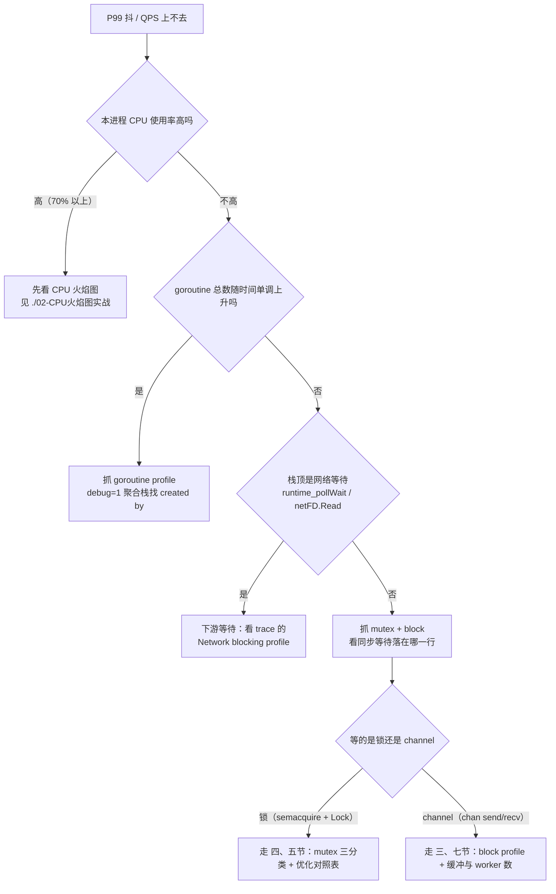
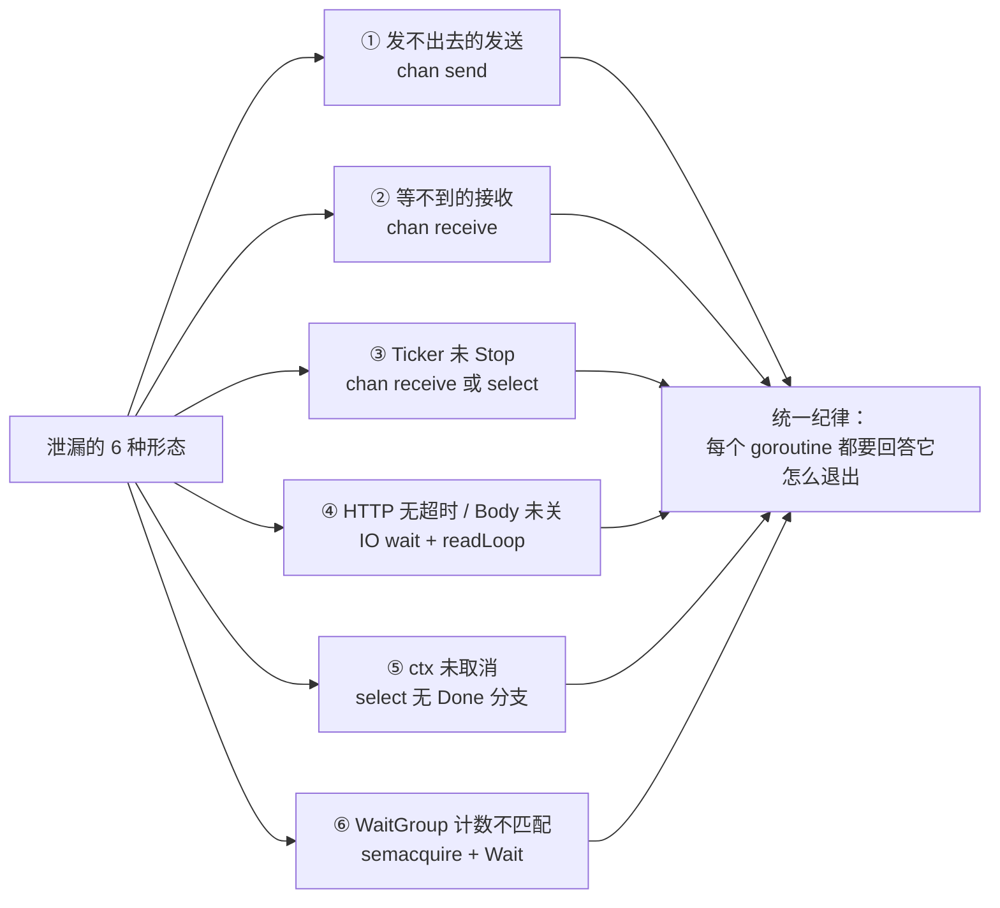
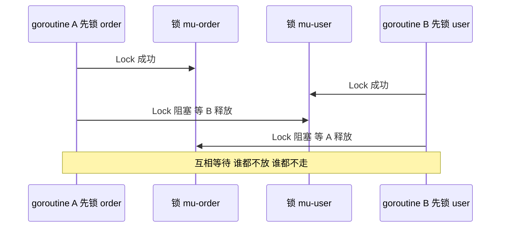

# 04 · goroutine 泄漏、锁竞争与阻塞定位

> 属于「架构师修炼」· 19 pprof 实战 · 第 4 篇：goroutine 泄漏、锁竞争与阻塞定位
> 上一篇：[03 内存与 GC 实战](./03-内存与GC实战)｜下一篇：[05 常见问题排查手册](./05-常见问题排查手册)｜栏目总览：[架构师修炼](../)

> **这篇解决什么问题**：上一章解决"内存涨"，这一章解决**"CPU 不高，但 QPS 上不去、P99 一直抖"**。这类问题火焰图上找不到热点——因为耗时不在计算上，而在**等**上：等锁、等 channel、等下游、或者 goroutine 只增不减最终把内存和调度压垮。本篇按"分诊 → 三种 profile 抓法 → 六种泄漏形态 → 锁优化对照表 → 死锁定位 → 三个完整实验"的顺序，把"等"变成可测量的数字。所有实验只用冻结样例目录 `code/architect/pprof-lab/` 里的 L03 / L04 / L05 与 `cmd/load`。

---

## 一、先分诊：该抓哪个 profile

**结论先行**：CPU 火焰图回答"CPU 花在哪"，goroutine / block / mutex 三件套回答"**时间花在等谁**"。抓错 profile 的代价是白抓一轮，所以先查表再动手。

### 1.1 现象 → profile 判定表

| # | 现象 | 首抓 profile | 次抓 | 决定性判据（看到就可以定案） |
| --- | --- | --- | --- | --- |
| ① | P99 抖、本进程 CPU 不高（<50%）、QPS 到顶；大量 goroutine 停在 `[semacquire]` | **mutex** | block + CPU | mutex profile 的 top1 就是某业务函数的临界区（`Unlock` 侧栈）；CPU 图里 `runtime.lock2` / `runtime.futex` 显眼 |
| ② | 吞吐被一个串行环节压住（单 worker、无缓冲 channel），CPU 更不高 | **block** | goroutine | block profile 中 `chansend`/`chanrecv` 下的业务栈宽度占观测窗口的大头 |
| ③ | goroutine 数随时间**单调上升**、FD 与内存同步缓涨、几小时后 OOM | **goroutine** | heap | `goroutine?debug=1` 首行 total 的斜率恒定 > 0；同一段栈的计数随请求线性增长 |
| ④ | 响应变慢但本进程 CPU 空闲、栈顶停在 netpoll | **trace** | goroutine + 下游客户端指标 | 栈顶是 `internal/poll.runtime_pollWait` / `net.(*netFD).Read`；**block profile 里根本看不到它**（见 1.4） |

### 1.2 分诊决策图



### 1.3 四类 profile 的采样开关与统计对象

| profile | 默认状态 | 开启方式 | 统计对象 | 单位 | 线上代价 |
| --- | --- | --- | --- | --- | --- |
| `goroutine` | **默认可用** | 无需任何开关 | 每个 goroutine 的当前栈（按栈聚合） | 个数 | 极低，可随时抓；`debug=2` 在 10w goroutine 时会短暂卡顿 |
| `block` | **默认关闭**（rate=0） | `runtime.SetBlockProfileRate(rate)` | channel send/recv、select、Mutex、Cond、WaitGroup 等**同步原语阻塞事件** | 阻塞纳秒（`delay`）+ 次数（`contentions`） | 与阻塞事件频率成正比；rate=1 全采样开销显著 |
| `mutex` | **默认关闭**（fraction=0） | `runtime.SetMutexProfileFraction(rate)` | **仅争抢过（contended）的锁**，栈取自 `Unlock` 侧 | 争抢纳秒 + 次数 | 只在发生争抢时才有采样动作 |
| `profile`（CPU） | 按需 | `/debug/pprof/profile?seconds=N` | On-CPU 采样帧 | 采样点数 | 100Hz 采样，代价低 |

### 1.4 怎么区分"等待下游"与"等待锁"

这是本篇最容易答错的一道题，三个来自运行时实现的事实直接给出判据：

1. **block profile 不记录网络 IO**。运行时只在四处埋了 `blockevent`：`runtime.chansend`、`runtime.chanrecv`、`runtime.selectgo`、`runtime.semacquire1`（Mutex/RWMutex/Cond/WaitGroup 都走最后一个）。**DB / Redis / RPC 的等待属于 netpoll + syscall，不进 block profile**——所以"block profile 里看不到下游等待"不是抓错了，是抓不到。
2. **goroutine 栈的状态词直接给答案**：`[semacquire]` = 等锁或等 `WaitGroup`；`[chan send]` / `[chan receive]` / `[select]` = 等 channel；`[IO wait]` + `internal/poll.runtime_pollWait` = 等网络/下游；`[sleep]` = 等 timer。
3. **mutex profile 的栈来自 `Unlock` 侧**（运行时在 `semrelease1` 里记账），所以 `top` 出的函数是"**持锁太久、制造争抢的临界区**"，而不是干等的那一方。这一点决定了优化方向：改的是临界区，不是等锁的调用点。

需要把两者分到同一张时间轴上时用 trace：

```bash
cd code/architect/pprof-lab
# 抓 5 秒执行 trace（端口按样例：L04 为 19084）
curl -o trace.out 'http://127.0.0.1:19084/debug/pprof/trace?seconds=5'
go tool trace trace.out
# 浏览器里对比 "Network blocking profile"（下游等待）与 "Sync blocking profile"（锁/channel）
```

---

## 二、goroutine profile 实战

### 2.1 三种视图，各有用途

```bash
cd code/architect/pprof-lab

# ① 交互式：按 goroutine 数聚合，可 top / peek / traces / list（L03 样例的 pprof 端口）
go tool pprof -http=:9090 'http://127.0.0.1:19083/debug/pprof/goroutine'

# ② 文本聚合栈（?debug=1）：首行 "goroutine profile: total N" 就是当前总数，每段栈前的数字是该栈的 goroutine 数
curl -s 'http://127.0.0.1:19083/debug/pprof/goroutine?debug=1' | head -100

# ③ 逐个 goroutine 的完整栈（?debug=2）：等价于 SIGQUIT 的转储，但进程还活着
curl -s 'http://127.0.0.1:19083/debug/pprof/goroutine?debug=2' | head -60

# ④ 只数个数：做趋势曲线的最小实现
curl -s 'http://127.0.0.1:19083/debug/pprof/goroutine?debug=2' | grep -c '^goroutine '
```

`?debug=1` 的输出结构如下（**示意，行号与地址以你的代码为准**）：

```text
goroutine profile: total <N>
<count> @ 0x... 0x... 0x...
#	0x...	main.(*taskRunner).run+0x...	<你的源码路径>/main.go:<行号>
#	0x...	created by main.handleTaskStart in goroutine <id>
```

**读法**：`debug=1` 看"**哪一段栈有多少个**"（定位形态），`debug=2` 看"**某个 goroutine 现在卡在哪一行、谁创建的**"（定位代码）。`created by ... in goroutine N` 这行是泄漏排查的关键——它直接指出启动它的调用点。

### 2.2 健康基线：goroutine 数多少才算正常

```go
import (
	"runtime"
	"runtime/metrics"
)

// ① 最省事：塞进业务指标或 /debug 端点（L03 的 /api/task/count 就是这个思路）
n := runtime.NumGoroutine()

// ② 走 runtime/metrics：不依赖任何第三方，接 Prometheus 只需换 Exporter
func goroutines() uint64 {
	s := []metrics.Sample{{Name: "/sched/goroutines:goroutines"}}
	metrics.Read(s)
	return s[0].Value.Uint64()
}
```

| 判据 | 健康 | 病态 | 说明 |
| --- | --- | --- | --- |
| 绝对值 | 与**并发请求量同量级**（100 并发 → 数百个） | 稳态数万以上 | 有连接池/后台任务的服务，基线一般是"并发数 + 常数" |
| 与负载的关系 | 随并发升降，负载停了 30s 内回落 | QPS 归零后不回落 | 这是**泄漏与"高水位"的分水岭** |
| 30 分钟趋势 | 围绕基线锯齿波动 | 斜率恒定 > 0，只能靠重启归零 | 监控上就画 `/sched/goroutines:goroutines` 的斜率 |
| 与 FD / heap 的关系 | 各自平稳 | goroutine 与 FD、heap 同步上涨 | 泄漏常伴随连接/FD 泄漏，一起看能加速定案 |
| 成本量级 | 每个 goroutine 初始栈 2KB，按需增长 | 10w goroutine 即数百 MB 起 | 泄露的不只是内存，还有调度与 GC 扫描成本 |

> 一句话纪律：**每条监控曲线都要能回答"负载下去以后它会不会降"，回答不了就不是健康基线。**

### 2.3 goroutine 泄漏的 6 种经典形态



| # | 代码形态（一句话） | 栈特征（`debug=1` 里长什么样） | 修法 |
| --- | --- | --- | --- |
| ① | 向**无缓冲 / 无人接收**的 channel 发送 | `[chan send]`，同一段栈的计数与请求数成正比 | 发送侧 `select { case ch <- v: case <-ctx.Done(): }`；或保证有接收方、给足缓冲 |
| ② | 阻塞在 channel 接收，但**发送方永远不发**（含 `for range ch` 等一个永不发生的 `close`） | `[chan receive]`；若是 nil channel 则是 `[chan receive (nil chan)]` | 约定唯一发送方负责 `close(ch)`；接收侧同时 select `ctx.Done()` 兜底 |
| ③ | `time.NewTicker` 未 `Stop`，且 goroutine **没有退出路径**（L03 的 bug 就是这一条） | `for range t.C` 形态是 `[chan receive]`；写成 `select` 则是 `[select]`，栈里能看到 Ticker 或 `time.` 相关帧，`created by` 指向启动它的 handler | `defer ticker.Stop()`；循环里 `select { case <-ctx.Done(): return; case <-t.C: ... }` |
| ④ | `http.Client` 无超时 / **未 `Close` resp.Body** | 调用侧 `[IO wait]`；transport 侧多出常驻 `[select]`（readLoop 等连接） | 设 `Timeout` 或带超时的 ctx；`defer resp.Body.Close()`（未读完也要关，否则连接不回池） |
| ⑤ | `context` 未被取消，或子 goroutine **没 select `ctx.Done()`** | `[select]` / `[chan receive]`，且看不到退出分支 | 创建即 `defer cancel()`；ctx 作为第一参数传递；所有循环都 select ctx |
| ⑥ | `sync.WaitGroup` 计数不匹配（`Add` 比 `Done` 多、panic 吞掉 `Done`） | `[semacquire]` + `sync.(*WaitGroup).Wait`，计数持续增长 | `go` 之前 `Add(1)`；goroutine 首行 `defer wg.Done()`；panic 也要能收敛 |

**纪律：每个 goroutine 都要回答"它怎么退出"四问**

| 四问 | 反例 | 正确写法 |
| --- | --- | --- |
| 谁负责让它退出（谁 cancel / 谁 close）？ | "任务跑完自然就退" | 由请求 ctx 或服务关闭 ctx 负责 |
| 退出信号**一定**会被送达吗？ | 发送方自己先 return 了 | 退出走 cancel，不走数据通道 |
| 退出路径上的资源谁释放？ | 忘了 `ticker.Stop()` | `defer` 里集中释放：`cancel` / `Stop` / `Close` / `wg.Done` |
| 它可能卡在 IO 上多久？ | 无限等下游 | 所有 IO 都带超时，超时即返回 |

修复形态的骨架（对应 L03 的 `-fix`）：

```go
func (s *Server) startTask(ctx context.Context) {
	ctx, cancel := context.WithCancel(ctx) // ① 退出权交给上层 ctx
	var wg sync.WaitGroup

	wg.Add(1) // ② 先 Add，再 go（顺序反了就是形态⑥）
	go func() {
		defer wg.Done() // ③ 首行 defer，panic 也能收敛

		t := time.NewTicker(time.Second)
		defer t.Stop() // ③ Ticker 必须 Stop

		for {
			select {
			case <-ctx.Done(): // ④ 唯一的正常出口
				return
			case <-t.C:
				s.tick(ctx)
			}
		}
	}()
	go func() { wg.Wait(); cancel() }() // ⑤ 收敛：任务结束则释放 ctx
}
```

---

## 三、block profile 实战

### 3.1 它采样什么：**阻塞事件**，单位是"阻塞耗时"

| 事件 | 运行时记录点 | 典型栈帧 |
| --- | --- | --- |
| channel 发送 | `runtime.chansend` | `runtime.chansend1` → 你的业务函数 |
| channel 接收 | `runtime.chanrecv` | `runtime.chanrecv1/2`、`for range ch` |
| select | `runtime.selectgo` | 多路等待的 `select` 块 |
| 锁与同步原语 | `runtime.semacquire1` | `sync.(*Mutex).Lock`、`sync.(*RWMutex).RLock`、`sync.(*Cond).Wait`、`sync.(*WaitGroup).Wait` |
| **不记录** | netpoll / syscall / `time.Sleep` / GC 停顿 | 下游 IO 等待不在此列（见 1.4） |

**为什么它对 P99 最有价值**：P99 抖动的常见形态不是"某次请求算得慢"，而是"**排队**"。block profile 直接给"**谁在什么地方、累计等了多久**"，火焰图的宽度就是累计阻塞时间——**宽栈 = 大量时间阻塞在那里**。这是火焰图读法在 block profile 上的唯一区别：没有 CPU 采样点，只有等待。

### 3.2 开启方式与采样率选择

```go
// 本机实验：全采样（rate=1 表示每个阻塞事件都记录）
runtime.SetBlockProfileRate(1)

// 线上常驻：1ms（>1ms 的阻塞必采，更短的按 probability = 阻塞时长/rate 采样，已做无偏放大）
runtime.SetBlockProfileRate(1_000_000)

// 关闭
runtime.SetBlockProfileRate(0)
```

> **单位别记错**：`rate` 是**纳秒**。`1_000` = 1µs、`1_000_000` = 1ms、`10_000_000` = 10ms。写错一个数量级，采样开销和"抓不到长阻塞"就会各错一边。

> 本实验包在 `internal/labkit` 里对所有样例统一开了 `SetBlockProfileRate(1)` 与 `SetMutexProfileFraction(1)`，所以 L04 / L05 的 block、mutex profile 开箱即可抓；生产环境当然不会这么干——理由与更稳的抓法见[06 生产环境 pprof 实践](./06-生产环境pprof实践)。

| rate | 采样语义 | 开销 | 用途 |
| --- | --- | --- | --- |
| `0` | 关闭（运行时默认） | 0 | 线上默认状态 |
| `1` | **每个**阻塞事件都记录 | 高（高频 channel/锁场景最明显） | 本机实验（L05）、压测环境排障 |
| `1e3 ~ 1e4`（1~10µs） | 几乎全采 | 明显 | 灰度实例短时排障，用完即关 |
| `1e6`（1ms） | >1ms 必采，短事件按比例采 | 低 | **线上常驻推荐起点** |
| `≥1e7`（10ms） | 只关心长阻塞 | 极低 | 只盯 P99 以上抖动，日常保底用 |

**替代方案（不想常驻开启时）**：

```bash
# ① 抓增量 profile：seconds=N 返回的是这段时间的 delta，不必提前常驻采样
go tool pprof -http=:9090 -seconds=20 'http://127.0.0.1:19085/debug/pprof/block'
# ② 只在 1 台灰度实例上设 rate=1e6，用「单实例 vs 集群」对比代替全量开启
# ③ 先用 /sched/goroutines:goroutines 与 P99 指标确认"是等型问题"，再开 block
```

### 3.3 读法：宽栈就是瓶颈

```bash
cd code/architect/pprof-lab
go tool pprof -http=:9090 'http://127.0.0.1:19085/debug/pprof/block'
# 只聚焦 channel 相关栈
go tool pprof -http=:9090 -focus='chan' 'http://127.0.0.1:19085/debug/pprof/block'
# 只要文本 top15，用于写实验报告
go tool pprof -top -nodecount=15 'http://127.0.0.1:19085/debug/pprof/block'
```

| 观察 | 结论 | 下一步 |
| --- | --- | --- |
| `runtime.chansend1` 占满火焰图宽度，下面是业务 pipeline 函数 | 生产端被消费端卡住（无缓冲/worker 太少） | 转第七节实验三：加缓冲 + worker pool |
| `runtime.chanrecv2` 宽，但下面没有生产者栈 | 消费者比生产者多，或生产已断 | 检查 worker 数是否远超上游吞吐（空转） |
| `sync.(*Mutex).Lock` 宽且栈落在业务函数 | 是锁竞争，不是 channel | 转第四节用 mutex profile 精确定位临界区 |
| block profile 几乎为空，但请求确实慢 | 耗时在**下游 IO** 或 CPU 上 | 抓 goroutine 栈 + CPU profile + trace（见 1.4） |
| `contentions` 高而 `delay` 低 | 频率型争抢，单次很短 | 优先 `atomic` / 批量合并（见五） |

---

## 四、mutex profile 实战

### 4.1 开关与抓法

```go
// 记录全部争抢事件（fraction=1）；0 关闭；<0 只读取当前值
runtime.SetMutexProfileFraction(1)
```

```bash
cd code/architect/pprof-lab
go tool pprof -http=:9090 'http://127.0.0.1:19084/debug/pprof/mutex'
go tool pprof -top -nodecount=10 -sample_index=contentions 'http://127.0.0.1:19084/debug/pprof/mutex'
```

**三条必须记住的语义**（都来自运行时实现，面试常考）：

1. **只统计争抢**：`Unlock` 时发现确实有 goroutine 在排队，才记账。无争抢的锁完全不出现在 profile 里——所以"profile 里没有某把锁"既可能是好事，也可能是它压根没被并发命中。
2. **栈取自 `Unlock` 侧**：样本归因给**持锁方**的临界区栈，即"谁制造了争抢"。
3. **采样概率是 1/fraction**：fraction 越大越省，但极端事件会被低估；profile 显示的 `delay` 已按采样概率放大，可直接当真实值用。

### 4.2 三类锁问题的证伪

| 症状（mutex profile 里） | 机制 | 判据 | 修法 |
| --- | --- | --- | --- |
| top1 单条栈占比 >50%，且临界区里有 IO / sleep / 序列化 / 日志 | **持锁太久** | 栈的叶子落在 `os.File.Write`、`time.Sleep`、`json.Marshal`、RPC 调用上 | 把慢操作移出临界区：先在锁外算好/取快照，锁内只做赋值 |
| 多个不同业务路径都指向**同一把全局锁** | **锁粒度过粗** | 同一锁变量被不同 key 的路径争抢 | 分片锁、按 key 分桶、copy-on-write 发布 |
| 临界区极短但 top 仍是它，`contentions` 巨大 | **争抢频率高** | 单次 delay 小、次数以百万计 | `atomic`、批量合并（把 N 次锁操作并成 1 次）、单 goroutine 串行化 |
| `delay` 很高但 `contentions` 很低 | 偶发长持锁（如定时任务全量刷新） | 看 `?debug=2` 或日志对齐时间点 | 大刷新改成增量或 COW，避免长时间独占 |

### 4.3 与 block profile 的分工

| 问题 | 用哪个 | 原因 |
| --- | --- | --- |
| 是"锁"还是"channel"在拖 P99 | 先 block（含两种事件） | block 一次性覆盖 chan + select + semacquire |
| 是哪把锁、哪段临界区 | 再 mutex | 只有 mutex profile 会按锁归因到持锁方栈 |
| 锁没争抢但请求还是慢 | 都不是 | 去看 CPU / 下游 / GC |

---

## 五、锁竞争优化对照表

### 5.1 分片锁：把一把锁拆成 N 个桶

```go
const shards = 64 // 必须是 2 的幂，才能用位与取模

type Sharded struct {
	mu  [shards]sync.Mutex
	val [shards]int64
}

func (s *Sharded) Add(k string, d int64) {
	i := shardOf(k) // ① hash(key) & (shards-1)，同一 key 永远落同一个桶
	s.mu[i].Lock()  // ② 只锁 1/64 的分片，其余 63 个桶照常并发
	s.val[i] += d
	s.mu[i].Unlock()
}

func shardOf(k string) uint64 {
	h := fnv.New64a() // ③ hash/fnv 属于标准库；样例里手写 FNV-1a 是为了省掉一次接口调用
	_, _ = h.Write([]byte(k))
	return h.Sum64() & (shards - 1)
}
```

### 5.2 手段对照表（手段 / 适用 / 收益 / 代价与坑）

| 手段 | 适用场景 | 收益 | 代价与坑 |
| --- | --- | --- | --- |
| **分片锁**（sharded mutex） | 单 key 更新频繁但 key 空间大：计数器、缓存分桶、限流桶 | 争抢概率近似降到 1/N | 内存 ×N；跨分片聚合要遍历；N 过大会吃 cache line 与更多锁对象 |
| **`sync.RWMutex`** | 读远多于写、临界区短 | 读并发度提升 | 写饥饿风险（持续读会推迟写）；**读临界区不能有慢操作**；读锁本身有原子操作成本，临界区极短时未必赢过 `Mutex` |
| **`atomic`** | 单字段计数、标志位、指针换版本 | 无锁，纳秒级 | 只保证**单变量**原子；多字段一致性必须用锁；用 `atomic.Int64` 的 `Add/Load/Store`，不要写成 `n.Value += 1`（读改写不原子）；`atomic.Pointer` 是 COW 发布的载体 |
| **`sync.Map`** | 读多写少、**key 集合稳定**（注册表、连接索引） | 读路径无锁 | 写多/频繁增删反而比 `map + Mutex` 慢；无法限容量（当缓存会无限增长）；`Range` 语义弱 |
| **channel 替代锁** | 需要所有权转移、有界队列、天然串行化 | 语义清晰，自带背压 | 比 mutex **慢一个量级**（调度 + 内存屏障 + 队列）；无缓冲 channel 直接退化为串行 |
| **copy-on-write** | 读多写极少：配置、路由表、白名单 | 读完全无锁（`atomic.Pointer.Load`） | 写要复制整份，O(n) 写放大；旧快照的内存要等 GC；写频率一高就得不偿失 |
| **单 goroutine 串行化 + batching** | 高吞吐计数、打点、写合并 | 把 N 次锁操作合并为 1 次，争抢归零 | 引入攒批延迟；**队列满时必须拒绝或降级，不能无限等待**（见[限流熔断降级与背压](/架构师修炼/12-限流熔断降级与背压)） |

**纪律：先测再改。** 四步闭环，缺一步结论都不可信：

1. 用 `cmd/load` 拿基线（QPS / P50 / P95 / P99 / 错误数），**参数固定**；
2. mutex / block profile 定位到"具体哪把锁、哪一行"；
3. **一次只改一处**（改分片就不同时换 atomic，否则说不清收益来自哪里）；
4. 用**同一条命令**重测并填对比表——改了实现不重测，等于没做优化。

> 反例：看到锁就换 `atomic`。多字段一起改却用原子操作，会把"慢"换成"数据竞争"，而 race 比慢更难查（`go test -race`，见 6.3）。

---

## 六、死锁与活锁定位

### 6.1 `fatal error: all goroutines are asleep - deadlock!` 的读法

这句由运行时在"**所有 goroutine 都睡着、且没有任何一种可能唤醒它们的事件**"时打印。三个要点：

1. 它只会在**纯同步原语**的程序里出现（没有活跃的 netpoll、timer、syscall）。线上 HTTP 服务几乎不会打印这句——因为总有 netpoll 在等——**线上更常见的表现是"不死也不通"：goroutine 越积越多、QPS 归零但进程活着**，也就是队头阻塞/活锁。
2. 它后面跟的是普通 panic 栈。**默认 `GOTRACEBACK=single` 只打印当前 goroutine**，要看到全部参与者必须用 `GOTRACEBACK=all`（见 6.3）。
3. 死锁的栈里一定能找到**环**：每个 goroutine 都在等下一个持有的资源。

### 6.2 锁顺序不一致：最典型的环



排查手法：用 `?debug=2` 抓全栈，**找"持有 + 等待"的两条链**——A 的栈里已经持有 `mu[order]`（在上层帧）并停在 `mu[user].Lock`，B 正好相反。这种"A 持 X 等 Y、B 持 Y 等 X"的对称结构就是铁证。

**防御三板斧**：

| 防御 | 做法 | 代价 |
| --- | --- | --- |
| 全局锁顺序 | 约定按锁 ID 升序获取，谁都不许反序 | 需要评审纪律，跨模块最难守 |
| 带超时/非阻塞获取 | `sync.Mutex.TryLock()`（Go 1.18+）或 ctx 化等待，拿不到就返回错误 | 要把"拿不到锁"变成可处理的业务错误，不能静默重试 |
| 减少同时持锁 | 一个函数只持一把锁，需要两把时改成"先拷贝快照 → 释放 → 再操作" | 多一次拷贝 |

Go **没有**内置的"锁顺序检查器"；`go vet` 与 `-race` 都不检测锁顺序。真正能自动化的是：`-race` 抓相关数据竞争、`-timeout` 让卡死的测试自动爆栈、生产上用 `?debug=2` 观察环。

### 6.3 排障工具箱

| 手段 | 命令 | 作用 | 注意 |
| --- | --- | --- | --- |
| 全栈快照（在线） | `curl -s 'http://127.0.0.1:19083/debug/pprof/goroutine?debug=2'` | 拿到每个 goroutine 的完整栈 | **进程不死**，生产首选 |
| SIGQUIT | `kill -QUIT <pid>` 或前台 `Ctrl+\` | 打印所有 goroutine 栈后退出 | 打印后进程退出；若程序自行 `signal.Notify` 了 SIGQUIT，默认转储会被接管 |
| `GOTRACEBACK=all` | `GOTRACEBACK=all ./app` | panic 时打印**所有用户 goroutine** 的栈 | 默认是 `single`；也可在代码里 `debug.SetTraceback("all")` 运行时提高（但不能低于环境变量设定） |
| `GOTRACEBACK=system` | 同上 | 额外包含 runtime 内部 goroutine（GC、sysmon 等） | 怀疑卡在 runtime 时用 |
| `GOTRACEBACK=crash` | 同上 | 额外触发 SIGABRT + core dump | 需要配好 `ulimit -c` 与 core 落地路径 |
| race 检测 | `go test -race -run TestX ./...` | 抓数据竞争（锁用法错误常伴随 race） | 只能发现真实执行到的竞争；CPU/内存开销约 5~10× |
| 测试超时全栈 | `go test -timeout 30s ./...` | 测试卡死时超时 panic 并打印全部 goroutine 栈 | 默认 10m，CI 里务必显式设置 |
| block/mutex profile | 见三、四节 | 找"谁在等谁"、哪把锁在争抢 | 需要先在程序里开启采样 |

---

## 七、三个完整实验

### 7.1 实验一（样例 L03）：goroutine 泄漏与修复

**终端 A**：

```bash
cd code/architect/pprof-lab
go run ./cmd/l03-goroutine-leak   # 业务端口 18083，pprof 端口 19083
```

**终端 B**（打流量 + 看计数；`/api/task/count` 返回的是 JSON，关键字段是 `goroutines` 与 `baseline`）：

```bash
# 一次触发 20 个任务（start 支持 n 参数，默认 1，上限 100）
curl -s 'http://127.0.0.1:18083/api/task/start?n=20'; echo
curl -s 'http://127.0.0.1:18083/api/task/count'; echo

# 再打 20 个，看 goroutines 是否继续涨且不回落（泄漏的第一个证据）
curl -s 'http://127.0.0.1:18083/api/task/start?n=20'; echo
sleep 5
curl -s 'http://127.0.0.1:18083/api/task/count'; echo

# bug 模式下的"停止"是无效的：这些 goroutine 没有任何退出信号
curl -s 'http://127.0.0.1:18083/api/task/stop'; echo
```

**预期**：bug 模式**每次 start 泄漏 3 个** goroutine（响应里的 `leaked_per_start`），所以 `goroutines - baseline` 约等于 `40 × 3`；`leaked_total` 单调累加；`/api/task/stop` 返回 `stopped: false`，只有进程退出才能回收。

**抓泄漏栈**：

```bash
curl -s 'http://127.0.0.1:19083/debug/pprof/goroutine?debug=1' | head -100
curl -s 'http://127.0.0.1:19083/debug/pprof/goroutine?debug=2' | grep -c '^goroutine '
go tool pprof -http=:9090 'http://127.0.0.1:19083/debug/pprof/goroutine'
```

**再跑修复版**（Ctrl+C 停掉 bug 版本，端口保持一致才可比）：

```bash
go run ./cmd/l03-goroutine-leak -fix
curl -s 'http://127.0.0.1:18083/api/task/start?n=20'; echo   # 记下 goroutines 与 active
curl -s 'http://127.0.0.1:18083/api/task/count'; echo        # active_workers 应为 60（20 × 3）
curl -s 'http://127.0.0.1:18083/api/task/stop'; echo         # 预期 released = 60，goroutines_after 回到 baseline
```

> **这里有一个关键认知**：fix 模式下 goroutine 数**照样会涨到 baseline + 60**——所以"数大"不是病。区别在于它们**受 ctx 控制、能被 cancel + `WaitGroup.Wait` 收敛**。判据是"**能不能收敛**"，不是"数大不大"。

**泄漏栈特征 → 结论对照表**：

| 栈特征 | 结论 | 修复动作 |
| --- | --- | --- |
| `[chan receive]`，栈里是 `main.leakTask.func1`（`for range t.C`），`created by main.leakTask` | Ticker 驱动的 goroutine **既没退出条件、Ticker 也没 Stop**（形态③，双份代价：goroutine + runtime timer） | 改成 `select { case <-ctx.Done(): return; case <-t.C: }` + `defer t.Stop()` |
| `[chan receive]`，`main.leakTask.func2` 等一个**永远不会 close** 的 channel | 形态②：接收方在等一个不会发生的事件 | 明确唯一发送方负责 `close`，接收侧同时 select `ctx.Done()` |
| `[chan receive]`，`main.leakTask.func3` 等一个**永远不会被写入**的 channel | 形态①/②：无发送方 | 发送侧 select ctx 兜底，或让接收侧可被取消 |
| 三段栈的计数都等于 start 次数（本例各 40），且 `goroutines - baseline ≈ 3 × starts` | 泄漏与请求量成**线性**关系，这是最硬的证据 | 给每个任务绑 ctx，取消即返回 |
| `[semacquire]` + `sync.(*WaitGroup).Wait` 计数持续增长 | 收敛逻辑把 goroutine 挂住了（形态⑥） | `go` 前 `Add(1)`，goroutine 首行 `defer wg.Done()` |
| total 不降，但栈里几乎都是 `net/http.(*conn).serve` | 这是 keep-alive 连接 goroutine，**不是泄漏** | 用压测器控制连接数后复测，别误判 |
| `-fix` 下 `/api/task/stop` 返回 `released = 60`、`goroutines_after ≈ baseline` | 修复生效：泄漏变为"受控的临时并发" | 把 baseline 值写成监控告警阈值 |

### 7.2 实验二（样例 L04）：全局锁竞争与分片锁 + atomic

**终端 A**：

```bash
cd code/architect/pprof-lab
go run ./cmd/l04-lock-contention   # 业务端口 18084，pprof 端口 19084
```

**终端 B**（先拿基线，再边压边抓）：

```bash
# 基线：100 并发压 30 秒（注意 URL 要加引号，? 和 & 会被 shell 吃掉）
go run ./cmd/load -url='http://127.0.0.1:18084/api/counter?k=hot' -c=100 -d=30s
```

```bash
# 压测进行中，另一个终端抓 profile
go tool pprof -top -nodecount=15 'http://127.0.0.1:19084/debug/pprof/mutex'
go tool pprof -http=:9090 'http://127.0.0.1:19084/debug/pprof/mutex'
go tool pprof -http=:9090 'http://127.0.0.1:19084/debug/pprof/profile?seconds=30'
curl -s 'http://127.0.0.1:19084/debug/pprof/goroutine?debug=1' | head -60
```

**预期观察**（bug 实现是"一把全局 mutex + 临界区里做 200 次计算 + 30µs 模拟 IO 等待"，正好同时命中 4.2 表的**持锁太久**与**粒度太粗**两类）：

- CPU 火焰图上 `sync.(*Mutex).Lock` 之下出现 `runtime.lock2`、`runtime.futex`、`runtime.semacquire1` 这类"争抢痕迹"，而不是业务计算帧；
- mutex profile 的 top1 是 `main.(*bugCounter).Inc`（栈来自 `Unlock` 侧），读路径的 `main.(*bugCounter).Total` 也在抢同一把锁；
- goroutine profile 里出现一大段 `[semacquire]`，数量与并发量同量级；
- 业务响应里的 `elapsed_ms` 会明显大于临界区自身的耗时（差值就是排队时间）——这是"等待"最直观的自证。

> **不需要改一行代码**：本实验包在 `internal/labkit` 里对所有样例统一调用了 `runtime.SetBlockProfileRate(1)` 与 `runtime.SetMutexProfileFraction(1)`，所以 `/debug/pprof/block` 与 `/debug/pprof/mutex` 才不是空的。生产环境怎么开、开多大，见[06 生产环境 pprof 实践](./06-生产环境pprof实践)。

**再跑修复版**（Ctrl+C 停掉 bug 版本，**端口与压测参数保持完全一致**）。fix 实现是 **64 个分片锁 + `atomic.Int64` 自增**，并把计算与模拟 IO 全部移出临界区：

```bash
go run ./cmd/l04-lock-contention -fix
go run ./cmd/load -url='http://127.0.0.1:18084/api/counter?k=hot' -c=100 -d=30s
```

> 注意压的是**同一个 key**（`k=hot`）：分片锁只在"热点 key 分散到不同桶"时才有收益。若所有请求都打同一个 key，分片锁退化成单锁——这时该换的是"单 goroutine 串行化 + 批量合并"（见 5.2）。

**bug vs fix 对比表**（数值列一律**实测填写**，测量方法在最后一列）：

| 指标 | bug（全局 mutex） | fix（分片锁 + atomic） | 测量方法 |
| --- | --- | --- | --- |
| QPS | 实测填写 | 实测填写 | `cmd/load` 输出的 QPS |
| P50 / P95 / P99 | 实测填写 | 实测填写 | `cmd/load` 输出 |
| 错误数 | 实测填写 | 实测填写 | `cmd/load` 输出 |
| mutex 争抢总延迟 | 实测填写 | 实测填写 | `go tool pprof -top '…/mutex'` 首行的 delay（纳秒） |
| mutex top 热点 | 实测填写（预期 `main.(*bugCounter).Inc`） | 实测填写（预期大幅下降或转成分片路径） | mutex profile 的 top1 函数名 |
| CPU 图热点 | 实测填写（预期 `runtime.lock2` / `runtime.futex` 显眼） | 实测填写 | CPU profile 火焰图 top |
| `[semacquire]` goroutine 数 | 实测填写 | 实测填写 | `goroutine?debug=1` 中该段的计数 |
| 平均排队深度 | 实测填写 | 实测填写 | 争抢总延迟 ÷ 观测窗口时长（>1 即持续有人排队） |

> 报告写法：**"同机、同压测参数、同端口、同一个 key，只改了锁实现"**——这句话是面试官唯一在意的可比性前提。

### 7.3 实验三（样例 L05）：无缓冲 channel 串行 → 有缓冲 + worker pool

**终端 A**：

```bash
cd code/architect/pprof-lab
go run ./cmd/l05-channel-block   # 业务端口 18085，pprof 端口 19085
```

**终端 B**：

```bash
go run ./cmd/load -url='http://127.0.0.1:18085/api/pipeline' -c=100 -d=30s
```

```bash
# 压测中抓 block profile（该样例开启阻塞采样）
go tool pprof -http=:9090 'http://127.0.0.1:19085/debug/pprof/block'
go tool pprof -top -nodecount=15 'http://127.0.0.1:19085/debug/pprof/block'
go tool pprof -http=:9090 'http://127.0.0.1:19085/debug/pprof/goroutine'
```

**预期观察**（bug 实现是"**无缓冲 `in` + 无缓冲 `out` + 只有 1 个 worker**"，所以调用方一次请求要在 `chansend` 上阻塞两次——投递一次、取结果一次）：

- block 火焰图里 `runtime.chansend1` 与 `runtime.chanrecv2` 之下就是 pipeline 的 `Submit`/`worker`，宽度几乎吃掉整个观测窗口；
- goroutine 图上 100 个请求 goroutine 全部停在 `[chan send]`，只有 1 个 worker 在 `[chan receive]` 之间来回；
- 因为整条流水线串行，QPS 被"单 worker 处理一个 job 的耗时"锁死，P99 随排队线性上涨，而 CPU 使用率上不去（有大量时间在等）；
- 额外代价：如果调用方先超时退出（客户端断开），worker 会**永久阻塞**在往 `out` 发送上——从"慢"升级成"泄漏"。

```bash
# Ctrl+C 停掉，跑修复版：有缓冲（chanBuf=4096）+ worker pool（worker 数 = runtime.NumCPU()）
go run ./cmd/l05-channel-block -fix
go run ./cmd/load -url='http://127.0.0.1:18085/api/pipeline' -c=100 -d=30s
```

修复版还要保证**退出可收敛**：`Close` 时先 `close(in)` 让空闲 worker 的 `range` 结束，再 `close(done)` 让正在往缓冲写结果的 worker 立刻返回，最后 `WaitGroup.Wait` 确认全部退出。

**参数怎么定**：

| 参数 | 怎么估 | 依据与边界 |
| --- | --- | --- |
| 缓冲大小 `buffer` | ① 先算上界：`buffer ≈ 峰值到达率 × 可容忍排队时延`（Little's Law）；② 再看余量：本样例取 `chanBuf = 4096`，远大于并发上限 100，效果是"投递几乎不阻塞" | 缓冲只吸收突发，**不是无限队列**；满了必须拒绝（背压，见[限流熔断降级与背压](/架构师修炼/12-限流熔断降级与背压)） |
| worker 数 | CPU 密集：本样例用 `runtime.NumCPU()`（每个 job 是 5 万个整数的真实计算）；容器里更严谨用 `GOMAXPROCS(0)`，它反映配额限制后的可用并行度。IO 密集：`N = 核数 × (1 + 等待时间/计算时间)` | 超过这个数只增加上下文切换与锁争抢，吞吐不涨 |
| 无缓冲 vs 有缓冲 | 除需要严格 rendezvous，**至少给 1** | 无缓冲强制生产消费同步 = 串行，是 L05 的根因 |
| 队列满策略 | 拒绝（429/503）或降级返回，**绝不无限等待** | 无限等待会把队头阻塞传导到入口，P99 与超时一起雪崩 |
| 关停路径 | 先关入口（`close(in)`）、再打断写侧（`close(done)`）、最后 `Wait` 收敛 | 只 `close(in)` 不够：正在写 `out` 的 worker 仍然卡住 |

---

## 八、与架构主线的衔接

| 现象 | 本篇结论 | 主线篇章 |
| --- | --- | --- |
| 锁成为吞吐天花板 | "锁"是[单体架构的极限与分层](/架构师修炼/02-单体架构的极限与分层)里四个天花板之一：**先量化再拆锁** | 判据：`平均排队深度 = 某锁争抢总延迟 ÷ 观测窗口时长`，**>1** 说明锁前持续有人排队；或锁等待占 P99 的**5% 以上**；或 CPU <50% 但 QPS 到顶 → 这三条命中任一条就该优化 |
| 阻塞从一段传到全局 | 无缓冲 channel / 无限队列 = 没有背压的串行化，队长会一路顶到入口 | [限流熔断降级与背压](/架构师修炼/12-限流熔断降级与背压)（队列满要拒绝，不要等待） |
| 怎么证明优化有效 | 同机、同参数、同端口重跑并填对比表；把泄漏基线写成告警阈值 | [容量规划压测与故障演练](/架构师修炼/13-容量规划压测与故障演练) |
| 故障演练靶子 | 把 L03（泄漏）、L04（锁竞争）、L05（channel 串行）的 **bug 版本**直接当演练目标，练习"制造 → 观测 → 定位 → 修复 → 复测"闭环 | 同栏目：[01 观测体系与 pprof 原理](./01-观测体系与pprof原理)、[02 CPU 火焰图实战](./02-CPU火焰图实战)、[03 内存与 GC 实战](./03-内存与GC实战)、[05 常见问题排查手册](./05-常见问题排查手册)、[06 生产环境 pprof 实践](./06-生产环境pprof实践)、[07 实战案例集](./07-实战案例集)、[08 面试题与追问链](./08-面试题与追问链) |

> 延伸（非本样例范围）：Go 1.26 起提供了实验性的 `goroutineleak` profile，能直接列出泄漏 goroutine 的栈，但它是 `GOEXPERIMENT` 构建开关控制的实验特性；本栏目样例基于 go 1.22，用 `goroutine?debug=1` 的聚合栈达到同一目的。

---

## 面试追问链（带答案）

1. **「P99 抖但 CPU 不高，你第一步抓什么？」** → 先分诊：抓 goroutine profile 看总数趋势与状态词，再按状态选 block 还是 mutex。**一句话背诵**："CPU 不高说明耗时不在算上而在等上，我先用 goroutine 栈判断它在等锁、等 channel 还是等下游，再决定抓 block 还是 mutex。"

2. **「怎么区分'等下游'和'等锁'？」** → 三个判据：`[IO wait]` + `internal/poll.runtime_pollWait`/`netFD.Read` 是下游；`[semacquire]` + `sync.(*Mutex).Lock` 是锁；`[chan send]`/`[chan receive]`/`[select]` 是 channel。而且 **block profile 只记录 chan/select/semacquire，网络 IO 走 netpoll 根本不进 block profile**，所以"下游等待在 block 里查不到"是预期行为。**一句话背诵**："栈状态词先分流，再用一个事实兜底——block profile 不记录网络 IO，查不到下游等待是正常的。"

3. **「goroutine 泄漏怎么发现、怎么定位？」** → 发现靠趋势：`/sched/goroutines:goroutines` 或 `runtime.NumGoroutine()` 的曲线在负载下去后不回落、斜率恒定 >0；定位靠 `goroutine?debug=1` 找计数持续增长的栈、`debug=2` 找 `created by` 那一行。**一句话背诵**："泄漏的判据不是绝对数大，而是'负载归零后不降'；定位靠聚合栈按计数排序加 created by 回溯入口。"

4. **「你项目里最常见的 goroutine 泄漏是哪种？」** → Ticker 未 `Stop`、`http.Client` 无超时/未 `Close resp.Body`、子 goroutine 没 select `ctx.Done()`。统一纪律是"每个 goroutine 都要回答它怎么退出"。**一句话背诵**："我按'它怎么退出'四问 Code Review：谁取消、信号一定送得到吗、defer 里释放了吗、最多卡多久。"

5. **「block profile 线上能常开吗？」** → 默认关闭（rate=0）；常驻建议 `SetBlockProfileRate(1_000_000)`（1ms，长阻塞必采、短阻塞按概率采），全量 `rate=1` 只在本机实验和压测用；更省的办法是 `?seconds=N` 抓增量 delta 或只开一台灰度实例。**一句话背诵**："1 是全采样只配实验，线上起点是 1ms，配合 seconds 增量抓取。"

6. **「mutex profile 统计什么？没出现某把锁说明什么？」** → 只统计**发生过争抢**的锁，且栈取自 `Unlock` 侧的持锁方；没出现只能说"在那段窗口里没争抢"，不代表锁不存在或没有问题。**一句话背诵**："mutex profile 只记 contended，而且归因给持锁方，所以 top 出来的就是该改的临界区。"

7. **「锁竞争你怎么优化？改了怎么证明有效？」** → 先按 mutex profile 分三类：持锁太久 → 慢操作移出临界区；粒度过粗 → 分片锁 / COW；争抢频率高 → `atomic` / 批量合并。证明靠同机同参数同端口复测，填 QPS / P99 / 争抢延迟 / top 热点四个数。**一句话背诵**："分类之后再选手段，一次只改一处，用同一压测命令复测才叫优化。"

8. **「死锁怎么定位？Go 里有什么工具？」** → 线上几乎不会打印 `all goroutines are asleep - deadlock!`（总有 netpoll 在等），实际表现是 goroutine 越积越多；定位用 `?debug=2` 抓全栈找"持 X 等 Y、持 Y 等 X"的环，或用 `GOTRACEBACK=all` / `kill -QUIT` 拿全栈。防御靠全局锁顺序、`TryLock` + 超时、一次只持一把锁；注意 Go **没有内置锁顺序检测器**，`-race` 只抓数据竞争。**一句话背诵**："死锁找环，防御限序；Go 没有锁顺序检查器，race 检测不等于死锁检测。"

---

## 自测清单

- [ ] 能不看文档说出四种成因（锁竞争 / channel 串行 / goroutine 泄漏 / 下游等待）各自首抓哪个 profile
- [ ] 能背出 `goroutine?debug=1`（聚合栈）与 `?debug=2`（逐个全栈）的区别与各自用途
- [ ] 能解释为什么 block profile 里看不到 DB/Redis/RPC 的等待，并说出替代手段（trace 的 Network blocking profile）
- [ ] 能写出 `SetBlockProfileRate` 与 `SetMutexProfileFraction` 的采样语义差异（前者按「阻塞时长 ÷ rate」的概率采样，后者按 1/fraction 采样）
- [ ] 能说出 mutex profile 的栈为什么归因给持锁方（`Unlock` 侧记账），以及它对优化方向的含义
- [ ] 能默写 goroutine 泄漏 6 种形态的栈特征与修法，并说出"它怎么退出"四问
- [ ] 能解释 goroutine 健康基线的判据："负载归零后是否回落"，并说出 `/sched/goroutines:goroutines` 的用法
- [ ] 能写出分片锁伪码，并说明为什么分片数取 2 的幂
- [ ] 能说出 `atomic` 的适用边界（单字段）与 `sync.Map` 反而更慢的场景（写多、key 集合变动）
- [ ] 能给出 channel 缓冲大小与 worker 数的估算依据（Little's Law / `GOMAXPROCS` / IO 密集公式）
- [ ] 能解释 `fatal error: all goroutines are asleep - deadlock!` 为何在线上的 HTTP 服务里罕见
- [ ] 能说出 `GOTRACEBACK` 各档（single / all / system / crash）的差异，以及 SIGQUIT 与 `?debug=2` 的取舍
- [ ] 能说出 `go test -race` 与 `-timeout` 的分工（前者抓竞争，后者让卡死自动爆栈）
- [ ] 能说出锁优化的判据阈值（平均排队深度 > 1 或锁等待占 P99 > 5%）与"先测再改"四步闭环

> **下一篇**：[05 常见问题排查手册](./05-常见问题排查手册) —— 把本篇的判据做成速查表：症状、一条命令、结论、修法。
